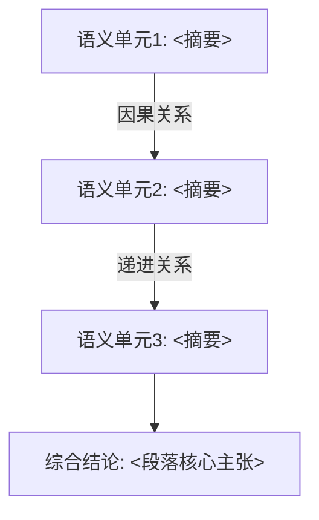
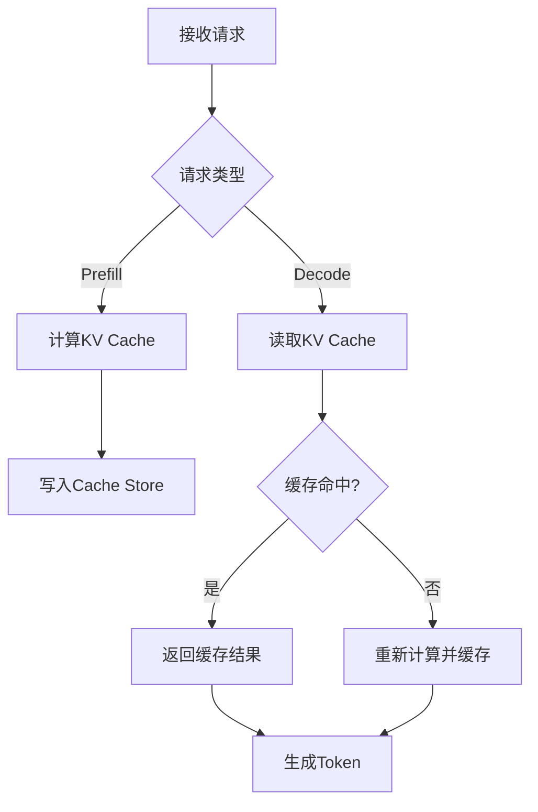

# Obsidian Keyword Explainer

## Overview

本 skill 用于回答来自 Obsidian vault 的关键词解释请求。核心功能：

1. **关键词/段落解释**：接收单个关键词、多个关键词、或完整段落，搜索 vault 中 `knowledge_notes/`、`experiment_notes/`、`idea_notes/`、`papers/` 四个目录，对每个语义单元逐一解释。
2. **段落语义切分**：当用户输入为段落时，按逻辑语义将段落切分为若干独立语义单元，每个单元作为关键词分别搜索和解释，最后对整个段落做综合解释。
3. **论文标题上下文**：调用本 skill 时，将当前正在分析的论文标题（如有）也作为搜索关键词，搜索 vault 中匹配的文档，将文档内容作为后续解释的上下文补充。论文标题本身不需要解释，仅用于发现上下文。
4. **联网补充**：对不确定或笔记中未命中的关键词，自动联网搜索补充。

任务为只读，除非用户明确要求创建、编辑或更新笔记。不人为缩短回答；为每个问题提供足够的细节和具体例子。所有公式、伪代码、流程图、调度时序图都必须附带详细注释解释，说明变量、步骤、节点、边、分支、资源泳道、时间顺序、依赖、重叠、停顿、假设以及它如何回答当前问题。

## Workflow

### 第零步：论文标题上下文搜索

如果当前会话正在分析某篇论文（即存在论文标题上下文），则在开始关键词搜索前，执行论文标题上下文搜索：

1. 将论文标题作为搜索关键词，用 `mcp__obsidian__.search_simple` 在 `knowledge_notes/`、`experiment_notes/`、`idea_notes/`、`papers/` 中搜索。
2. 对匹配到的文档（标题命中的笔记），使用 `mcp__obsidian__.vault_read` 读取全文。
3. 将这些文档内容作为**上下文**而非解释目标存储。在后续解释各关键词时，优先引用这些上下文中相关的片段。
4. 论文标题本身不需要按 Answer Format 输出解释。在最终输出的"上下文依据"板块列出命中的文档路径和摘要。

如果不存在论文标题上下文（即用户仅查询关键词/段落，没有关联论文），跳过此步。

### 第一步：判断输入类型

判断用户输入是以下哪种类型：

| 输入类型 | 特征 | 处理方式 |
|----------|------|----------|
| 单个关键词 | 短词组/术语，无句号 | 直接搜索和解释 |
| 多个关键词 | 逗号/空格/换行分隔的多个术语 | 逐词搜索和解释 |
| 段落 | 包含完整句子、句号、逻辑连接词 | 语义切分后逐单元搜索解释，最后综合 |

### 第二步：段落语义切分

当输入类型为"段落"时，按以下规则切分：

1. **识别逻辑语义单元**：分析段落的逻辑结构，识别以下切分边界：
   - 因果关系的"因为...所以..." → 拆为"原因语义"和"结果语义"
   - 转折关系的"虽然...但是..." → 拆为"前提语义"和"转折语义"
   - 并列关系的"不仅...而且..." → 拆为多个"并列语义"
   - 条件关系的"如果...那么..." → 拆为"条件语义"和"结论语义"
   - 递进关系的"进一步...因此..." → 拆为"前提语义"和"递进语义"
   - 对比关系的"A与B不同/相比..." → 拆为"对比主体A"和"对比主体B"和"对比结论"
   - 按句号/分号自然断句 → 每个独立句作为一个语义单元

2. **提取核心术语**：对每个语义单元，提取其中的核心技术术语作为搜索关键词。术语判断标准：
   - 大写缩写（如 KV Cache、MoE、SLO）
   - 特定领域名词（如 投机解码、量化、稀疏化）
   - 方法/框架名（如 vLLM、Triton、FlashAttention）
   - 硬件/系统概念（如 PIM、chiplet、SM）

3. **保留段落语境**：切分后每个语义单元仍携带原始段落的位置和语境，确保后续解释不丢失段落级语义关联。

4. **去重**：如果多个语义单元提取出相同的核心术语，合并为一次搜索，但在解释时注明该术语在不同语义单元中的不同角色。

### 第三步：搜索 Obsidian Vault

对每个关键词/语义单元执行以下搜索流程：

1. **首选 `mcp__obsidian__.search_simple`**：使用原始关键词搜索，`contextLength` 设置为 `160`-`240`。对返回结果的 `filename` 字段过滤，只保留目标四个目录前缀的匹配：`knowledge_notes/`、`experiment_notes/`、`idea_notes/`、`papers/`。

2. **如果搜索结果稀疏或需要更精确过滤**：使用 `mcp__obsidian__.search_query`，配合 JsonLogic 查询约束文件夹和关键词：

```json
{
  "and": [
    {
      "or": [
        {"regexp": ["^knowledge_notes/", {"var": "path"}]},
        {"regexp": ["^experiment_notes/", {"var": "path"}]},
        {"regexp": ["^idea_notes/", {"var": "path"}]},
        {"regexp": ["^papers/", {"var": "path"}]}
      ]
    },
    {
      "or": [
        {"regexp": ["<escaped-keyword>", {"var": "path"}]},
        {"regexp": ["<escaped-keyword>", {"var": "content"}]}
      ]
    }
  ]
}
```

3. 如果需要确认目录名和结构，使用 `mcp__obsidian__.vault_list`。

4. 对最佳匹配笔记使用 `mcp__obsidian__.vault_read` 读取全文，而非仅依赖搜索片段。

### 第四步：别名扩展搜索

如果精确命中不足，尝试以下变体重新搜索：

- 中文/英文变体（如 "KV Cache" / "KV缓存" / "键值缓存"）
- 空格/连字符变体（如 "KV-Cache" / "KV_Cache" / "KVCache"）
- 单复数变体
- 首字母缩写展开（如 "MoE" → "Mixture of Experts"）
- 已知别名（如 "投机解码" / "Speculative Decoding"）

当确实没有直接笔记证据时，明确声明。

### 第五步：联网搜索补充

对以下情况使用 `WebSearch` 补充信息：

- 笔记中没有命中或命中不足的关键词
- 术语模糊、多义
- 需要确认首字母缩写的完整展开
- 术语来源、当前通用用法不明确
- 缺少实现上下文或落地细节
- 需要补充公式、算法细节、架构信息或调度时序安排

优先使用权威来源：论文、官方文档、项目页、标准、知名技术参考资料。在最终答案中引用网络来源链接。

### 第六步：综合与解释

对每个关键词/语义单元，综合三种笔记类型的信息：

| 笔记目录 | 提供的信息类型 |
|----------|---------------|
| `knowledge_notes/` | 定义、机制、术语背景、理论基础 |
| `experiment_notes/` | 实现证据、baseline、指标、复现细节、实验使用 |
| `idea_notes/` | 动机、痛点、设计思路、适用场景 |
| `papers/` | 论文全文、标题上下文、方法细节、实验设置、术语在原论文中的具体用法 |

额外综合第零步获得的论文标题上下文文档中的相关片段。

### 第七步：输出

按照 Answer Format 规定的格式输出。对每个关键词的每个问题，必须包含具体例子。不限制输出长度。每个公式、伪代码、流程图或调度时序图后必须紧跟“注释解释”，让读者能逐项理解结构化例子的含义。

如果原始输入是段落，在逐语义单元解释完毕后，追加"段落综合解释"板块。

## Answer Format

用中文回答。使用以下结构（除非用户指定其他格式）。

### 关键词/语义单元解释格式

对每个关键词或语义单元，重复以下完整结构：

```md
## <关键词/语义单元>

### 是什么？
<基于命中笔记解释概念本身。区分笔记证据和合理推断。>

具体例子：
<用 Obsidian/MathJax 兼容公式、伪代码、Mermaid flowchart 或调度时序图表达至少一个具体例子，说明这个概念在系统、论文、实验、代码、模型或实际场景中是什么样。随后用“注释解释”详细说明公式变量/伪代码步骤/流程图节点与边/时序图资源泳道、时间顺序、依赖与重叠关系。>

### 为什么需要？
<解释它解决的痛点、引入原因、对系统/实验/想法的价值。>

具体例子：
<用 Obsidian/MathJax 兼容公式、伪代码、Mermaid flowchart 或调度时序图表达至少一个具体例子，说明没有它会遇到什么问题，或者引入它后解决了什么问题。随后用“注释解释”详细说明公式变量/伪代码步骤/流程图节点与边/时序图资源泳道、时间顺序、依赖与重叠关系。>

### 如何使用？什么场景使用？
<说明典型使用方式、落地流程、适用场景、相关限制。>

具体例子：
<用 Obsidian/MathJax 兼容公式、伪代码、Mermaid flowchart 或调度时序图表达至少一个具体例子，说明实际怎么用、在哪类任务/系统/实验中使用。优先给出可执行步骤、调度逻辑、计算关系、端到端流程或 kernel/pipeline 时序安排。随后用“注释解释”详细说明公式变量/伪代码步骤/流程图节点与边/时序图资源泳道、时间顺序、依赖与重叠关系。>

### 笔记依据
- `<vault-relative-path>`: <该笔记提供的关键信息>

### 联网补充依据
- <source link>: <当使用联网搜索时，简述该来源补充了什么；如果未使用联网搜索，写"未使用，Obsidian 笔记证据足够"。>

### 不确定处
<列出笔记未明确说明、命中不足、别名不确定或需要进一步确认的点；没有就写"暂无明显不确定处"。>
```

### 段落综合解释格式（仅段落输入时追加）

```md
## 段落综合解释

### 段落整体概述
<用2-4句话概括整段话的核心论点和逻辑链条。>

### 语义单元关联
<说明段落中切分出的语义单元之间的逻辑关系：因果、并列、递进、对比、条件等。>



### 段落整体理解
<将各语义单元的解释串联起来，还原段落的完整逻辑。说明：
- 段落的核心主张是什么
- 各语义单元如何支撑这个主张
- 段落中隐含的前提或假设
- 段落讨论的问题在当前领域的定位>

### 段落涉及的关键技术对比（如适用）
<如果段落涉及多个技术的对比，用表格总结>

| 维度 | 技术A | 技术B |
|------|-------|-------|
| <维度1> | <描述> | <描述> |
| <维度2> | <描述> | <描述> |

### 段落笔记依据
- `<vault-relative-path>`: <该笔记提供的段落级上下文>
```

### 论文标题上下文格式（如有）

如果执行了第零步论文标题上下文搜索，在所有解释之前添加：

```md
## 论文上下文

当前分析论文：**<论文标题>**

从 vault 中匹配到的上下文文档：

| 文档路径 | 提供上下文摘要 |
|----------|---------------|
| `<path>` | <该文档与论文相关的关键内容摘要> |
```

## 例子格式规范

对每个问题的具体例子，使用以下四种格式之一。每个结构化例子后都必须添加“注释解释”小节：

- 公式使用 Obsidian/MathJax 兼容写法，并在公式后解释每个变量、单位/维度、关键假设、公式表达的因果或计算关系，以及变量变化会带来什么影响。
- 伪代码后解释输入、输出、每个主要循环/分支/状态更新、终止条件，以及这段逻辑如何映射到当前术语。
- 流程图后解释每个节点、每条边/分支标签、开始和结束条件，以及每条路径对应的实际系统行为或使用场景。
- 调度时序图后解释时间轴或事件顺序、资源泳道、kernel/任务持续时间、依赖关系、重叠关系、同步点、停顿/空泡，以及这些安排如何影响延迟、吞吐或 goodput。

### 公式 (Formula)

适用于：指标计算、代价模型、张量形状、内存/延迟/吞吐量分析、算法关系、概率/目标函数。

使用 Obsidian/MathJax 兼容写法：

- 块级公式使用独立成行的 `$$` 包裹，公式前后各留空行；不要把公式放进三反引号代码块，否则 Obsidian 不会渲染。
- 行内公式使用 `$...$`，例如 `$F_l$`。
- 公式内部优先使用 ASCII 变量名，中文含义放在公式外解释。
- 英文可读标签优先使用 `\mathrm{}` 或 `\operatorname{}`，例如 `\mathrm{Latency}`、`\operatorname{softmax}`。
- 避免依赖自定义宏、额外 LaTeX package、复杂中文 `\text{...}`；如果需要多行，优先使用 MathJax 支持较好的 `aligned` 环境。
- 普通文本里的下划线变量用行内公式或反引号包住，避免 Markdown 把下划线当作格式符。

例如：

$$
\mathrm{Latency}
= \max_{l \in L}
\left(
  \frac{F_l}{C_l}
  +
  \frac{B_l}{W_l}
\right)
$$

其中：
- $L$: 模型层集合。
- $l$: 某一层的索引。
- $F_l$: 第 $l$ 层的浮点运算量，单位可用 FLOPs。
- $C_l$: 第 $l$ 层可获得的计算吞吐，单位可用 FLOPs/s。
- $B_l$: 第 $l$ 层的内存访问量，单位可用 Byte。
- $W_l$: 第 $l$ 层可获得的内存带宽，单位可用 Byte/s。

注释解释：
- 这个公式把每层延迟拆成计算时间和访存时间，并用最慢层近似端到端瓶颈。
- $C_l$ 越大，计算项 $F_l / C_l$ 越小；$W_l$ 越大，访存项 $B_l / W_l$ 越小。
- 如果某层 $B_l$ 很大，即使 $F_l$ 不高，也可能因为访存成为瓶颈。
- 中文说明不放在公式内部，避免 Obsidian/MathJax 对中文 `\text{...}` 或字体支持不稳定。

### 伪代码 (Pseudocode)

适用于：算法、调度器、运行时策略、编译器pass、kernel执行、数据处理、决策逻辑。

使用缩进和关键字（`for`, `if`, `while`, `return` 等），避免特定语言的语法噪音。例如：

```
算法: KV Cache 逐出策略
输入: cache_size, new_kv, priority_threshold
输出: eviction_list

for each block in cache:
    score[block] = access_freq[block] / (now - last_access[block])
sorted_blocks = sort_by(score, ascending=True)
eviction_list = []
for block in sorted_blocks:
    if cache_used - block.size >= target_free:
        break
    eviction_list.append(block)
return eviction_list
```

注释解释：
- 输入 `cache_size` 表示缓存容量，`new_kv` 表示即将写入的新 KV 块，`priority_threshold` 表示保留高价值缓存的阈值。
- 第一段循环为每个缓存块计算优先级分数，访问越频繁、越新近访问的块越不容易被驱逐。
- 第二段循环按低分优先选择驱逐对象，直到释放出足够空间。
- 输出 `eviction_list` 是实际要从缓存中移除的块列表。

### 流程图 (Flowchart)

适用于：系统工作流、pipeline阶段、请求路径、组件交互、使用场景。

使用 Mermaid `flowchart` 语法。例如：



注释解释：
- `A` 是请求进入系统的起点，系统首先判断请求属于 Prefill 还是 Decode。
- Prefill 路径负责计算并写入 KV Cache，Decode 路径优先读取已有 KV Cache。
- `F` 的命中判断决定是否复用缓存；未命中时需要重新计算并写入缓存。
- 所有路径最终汇入 `I`，表示使用已有或新生成的上下文继续生成 token。

### 调度时序图 (Scheduling Timeline)

适用于：kernel 调度、pipeline 安排、prefill-decode 复用、通信-计算重叠、异构 CPU/GPU/PIM/FPGA 执行、batching window、资源占用随时间变化。

优先使用 Mermaid `sequenceDiagram` 表达事件顺序和跨资源交互；使用 Mermaid `gantt` 表达 kernel/pipeline 在时间轴上的占用和重叠。例如：

```mermaid
gantt
    title Prefill-Decode Pipeline 调度时序
    dateFormat X
    axisFormat %s

    section GPU SMs
    Prefill batch P0        :p0, 0, 4
    Decode microbatch D0    :d0, 4, 2
    Decode microbatch D1    :d1, 6, 2

    section HBM / KV Cache
    Write KV for P0         :kvw, 2, 3
    Read KV for D0          :kvr0, 4, 2
    Read KV for D1          :kvr1, 6, 2

    section Scheduler
    Admit P0                :adm, 0, 1
    Switch to decode        :sw, 4, 1
```



注释解释：
- 横轴表示逻辑时间，`0, 4` 表示任务从时间 0 开始，占用 4 个时间单位；这些时间单位可以对应毫秒、调度 tick 或论文中的归一化时间。
- `GPU SMs` 是计算资源泳道，展示 Prefill kernel 和 Decode microbatch kernel 如何排队或交错执行。
- `HBM / KV Cache` 是访存资源泳道，展示 Prefill 写 KV 与 Decode 读 KV 的时间重叠；如果读写与计算重叠，说明系统在隐藏访存延迟。
- `Scheduler` 泳道展示调度器何时接纳请求、何时切换到 decode；`Switch to decode` 是潜在同步点，可能引入 pipeline 空泡。
- 该图用于解释 kernel/pipeline 调度时，重点看计算资源是否空闲、访存是否成为瓶颈、Prefill 和 Decode 是否被有效 multiplex。

## Examples for Each Question Type

对"是什么？"的问题，例子应说明概念在系统中的具体形态：

- 量化是什么？→ 给出量化前后的张量数据流公式对比
- MoE是什么？→ 给出 Router + Expert 的伪代码执行流程
- KV Cache是什么？→ 给出 Attention 计算中 KV Cache 作用的公式
- kernel pipeline是什么？→ 给出多个 kernel 在 GPU SM/HBM/通信资源上的调度时序图

对"为什么需要？"的问题，例子应说明有/无此概念的对比：

- 为什么需要KV Cache？→ 给出有无 KV Cache 的计算量对比公式
- 为什么需要Speculative Decoding？→ 给出串行解码 vs 投机解码的延迟对比流程图
- 为什么需要量化？→ 给出 FP16 vs INT4 的内存带宽对比公式
- 为什么需要 prefill-decode multiplexing？→ 给出 Prefill 独占 vs Prefill/Decode 交错执行的调度时序图

对"如何使用？"的问题，例子应说明实际落地的可执行流程：

- 如何使用Triton写kernel？→ 给出一个完整的Triton kernel伪代码
- 如何使用vLLM部署？→ 给出从配置到推理的端到端流程图
- 如何使用PagedAttention？→ 给出内存分配和管理的伪代码
- 如何安排 kernel pipeline？→ 给出计算 kernel、通信 kernel、KV cache 读写之间的调度时序图

## Paragraph Semantics Splitting Examples

以下是段落语义切分的具体示例，用于指导切分粒度：

**示例段落：**
> "KV Cache虽然显著减少了重复计算，但因为每个token都需要读写全部历史KV对，其内存占用随序列长度线性增长。为此，PagedAttention将KV Cache按Page分块管理，不仅避免了显存碎片，而且支持了KV Cache的动态换入换出。"

**切分结果：**

| 语义单元 | 核心术语 | 语义角色 | 逻辑关系 |
|----------|----------|----------|----------|
| KV Cache减少重复计算 | KV Cache | 当前方案的优点 | 前提（被转折） |
| 内存占用随序列长度线性增长 | KV Cache, 内存占用 | 当前方案的瓶颈 | 问题（触发因果） |
| PagedAttention按Page分块管理 | PagedAttention, Page | 解决方案 | 因果（解决问题） |
| 避免显存碎片 | 显存碎片 | 解决效果1 | 并列 |
| KV Cache动态换入换出 | KV Cache, 换入换出 | 解决效果2 | 并列 |

**解释顺序**：先逐语义单元解释，最后综合为完整逻辑链。

## Evidence Rules

- 从笔记推导的声明引用 vault 相对路径。
- 从网络搜索推导的声明引用链接。
- 区分笔记支持的事实与推断。使用 `笔记显示` 表示来源声明，`可推断` 表示合成。
- 区分网络支持的事实与笔记支持的事实。当依赖网络来源时使用 `联网资料显示`。
- 不编造实现细节。如果笔记未解释某项内容，写 `笔记未明确说明`。
- 优先详细、举例丰富的技术解释而非简短摘要。当用户要求深度时，不人为限制输出token。
- 确保每个关键词在三个问题下都有具体例子。尽可能用 Obsidian/MathJax 兼容公式、伪代码、Mermaid 流程图或调度时序图表达例子，而非纯文字。涉及 kernel 调度、pipeline 安排、资源竞争、overlap 或 batching 时优先使用调度时序图。每个公式、伪代码、Mermaid 流程图或调度时序图后必须有详细注释解释，说明变量/步骤/节点/边/分支/资源泳道/时间轴/依赖/重叠/停顿/假设及其与当前问题的关系。公式必须使用独立 `$$` 块或 `$...$` 行内写法，不要放入代码块。如果某问题确实无法给出经过验证的结构化例子，直接声明证据缺口。
- 搜索范围锚定在 `knowledge_notes/`、`experiment_notes/`、`idea_notes/`、`papers/`；如果相关匹配出现在请求范围外（如 `repo_2026/`、`paper_single_analysis_repo/`），提及但未经用户批准不作为主要证据。

## Cross-Keyword Synthesis

处理完所有关键词后，如果关键词之间有联系，添加跨关键词综合（段落输入时已在"段落综合解释"中处理，无需重复）：

```md
## 关键词关联

| 关键词A | 关键词B | 关联关系 |
|---------|---------|---------|
| <A>     | <B>     | <关系描述> |
```

## Quality Checklist

完成前验证：

- [ ] 如果存在论文标题上下文，已完成第零步搜索并输出"论文上下文"板块
- [ ] 输入类型判断正确（关键词 vs 段落）
- [ ] 段落输入时，已完成语义切分，切分结果合理
- [ ] 每个关键词/语义单元的三个问题（是什么/为什么需要/如何使用）都有回答
- [ ] 每个问题的具体例子使用了公式、伪代码、Mermaid 流程图或调度时序图之一
- [ ] 涉及 kernel 调度、pipeline 安排、资源竞争、overlap 或 batching 的问题优先使用调度时序图，并包含详细注释解释
- [ ] 所有笔记来源的声明有 vault 路径引用
- [ ] 所有网络来源的声明有链接
- [ ] 不确定处已声明
- [ ] 未人为限制回答长度
- [ ] 段落输入时，已输出"段落综合解释"板块，包含逻辑关联流程图
- [ ] 段落输入时，已输出整个段落的综合理解
