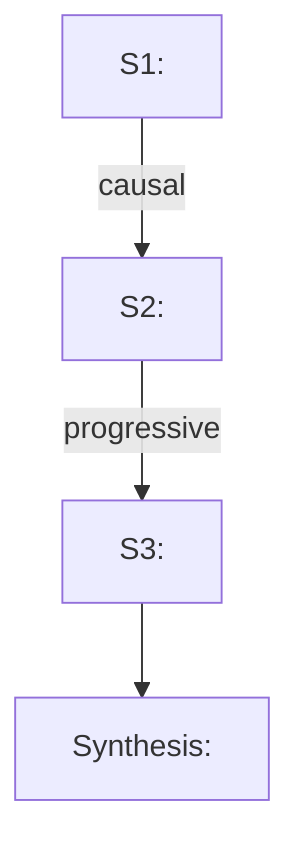

# Obsidian Keyword Explainer

Read-only. Answer in Chinese. Do not artificially shorten. Every structured example (formula/pseudocode/flowchart/timeline) must be followed by an "Annotations" section. The path below is related or based on '/data3/paper_analysis/'.

## Local Search Backend Hard Restriction

- All vault-note searches must use the Obsidian API: search with `obsidian_search_notes`, then read with `obsidian_get_note`.
- Do not use filesystem search or directory traversal as evidence retrieval, including `rg`, `grep`, `find`, `ls`, Python scanning, shell globs, or direct file scans.
- Web/internet search is allowed as external supplementary evidence, but it must not replace local Obsidian API search. If the Obsidian API returns no local matches, first record "no note evidence", then cite any web result separately as "Web evidence".
- Treat Obsidian API search as Markdown-note-only search. Every `omnisearch` query must include both `path:<dir>`.

## Workflow

### Step 1: Semantic Segmentation

Split the input paragraph into **semantic segments** — each segment is a semantically coherent unit (cause/effect, contrast, parallel, conditional, progressive, comparative, or a single sentence/clause).

**1.1 Segment** by logical boundaries: cause/effect, contrast, parallel, conditional, progressive, comparative, and sentence/clause breaks.

**1.2 Extract core terms** from each segment: acronyms (KV Cache, MoE), domain terms (speculative decoding, quantization), method names (vLLM, Triton), hardware concepts (PIM, chiplet, SM).

**1.3 Do NOT cluster/group** keywords across segments. Each keyword is processed independently in subsequent steps. Keywords belong to their originating segment only.

**1.4 Expand** each keyword with aliases, Chinese/English variants, acronym expansions, separator variants (for search coverage).

**1.5 Report segments** in final answer. Example:

| Segment | Keywords | Semantic Role |
|---------|----------|---------------|
| S1 | KV Cache, key-value cache, memory footprint | Current approach: pros & bottleneck |
| S2 | PagedAttention, Page, block management, fragmentation | Solution & its effects |

---

---

### Step 2: Per-Keyword Search via Omnisearch

For **each keyword** extracted in Step 1, run **six** separate omnisearch queries — one per target directory. Each query returns scored results; record up to 5 paths per directory per keyword, ordered by score descending.

**API**: `obsidian_search_notes` with `mode="omnisearch"`. Results capped at 50 upstream; paginate via `cursor` / `nextCursor` if needed.

**Query format**: `path:<dir>  <keyword>`

- Single-word keyword: `path:paper_secs  KV-Cache`
- Multi-word keyword: use quoted phrases — `path:paper_secs  "KV Cache"`
- Path filter is embedded in the query string. Do NOT use `pathPrefix` (text-mode only).
- Use both English and Chinese variants of the keyword in separate searches if applicable. Combine results from variant searches for the same keyword.

#### 2.1 Search `paper_secs/`

```
obsidian_search_notes(mode="omnisearch", query="path:paper_secs  <keyword>")
```

Record up to 5 paths with the highest scores. Score = API-returned score directly.

#### 2.2 Search `knowledge_notes/`

```
obsidian_search_notes(mode="omnisearch", query="path:knowledge_notes  <keyword>")
```

Record up to 5 paths with the highest scores.

#### 2.3 Search `experiment_notes/`

```
obsidian_search_notes(mode="omnisearch", query="path:experiment_notes  <keyword>")
```

Record up to 5 paths with the highest scores.

#### 2.4 Search `idea_notes/`

```
obsidian_search_notes(mode="omnisearch", query="path:idea_notes  <keyword>")
```

Record up to 5 paths with the highest scores.

#### 2.5 Search `human_notes/`

```
obsidian_search_notes(mode="omnisearch", query="path:human_notes  <keyword>")
```

Record up to 10 paths with the highest scores.

#### 2.6 Search `learning_outputs/`

```
obsidian_search_notes(mode="omnisearch", query="path:learning_outputs  <keyword>")
```

Record up to 5 paths with the highest scores.

#### 2.7 Relevance Scoring

**Directly use each match's score** from the omnisearch API response. No custom scoring formula needed. The omnisearch BM25 score is the relevance score.

#### 2.8 Tracking

Maintain a running table during search:

| Keyword | Segment | Dir | Path | Score |
|---------|---------|-----|------|-------|
| KV Cache | S1 | paper_secs | paper_secs/2025/xxx.md | 12.5 |
| KV Cache | S1 | knowledge_notes | knowledge_notes/kv_cache.md | 8.3 |
| ... | ... | ... | ... | ... |

---

### Step 3: Deduplicate, Read & Build Context

After ALL keywords have been searched:

**3.1 Deduplicate**: collect all unique paths from the search results table. De-duplicate by vault-relative path.

**3.2 Read**: call `obsidian_get_note` for each unique path to read the full content.

`obsidian_get_note` supports four format projections:

| `format` | Returns | Use when |
|----------|---------|----------|
| `"content"` | Raw markdown body only | Reading note body for context building (default choice in Step 4/5) |
| `"full"` | Content + parsed frontmatter, tags, file metadata | Need frontmatter context (tags, ctime, mtime, size). Pass `includeLinks: true` to also parse outgoing wiki/markdown link references (vault-internal only; external URLs filtered) |
| `"document-map"` | Catalog of headings, block IDs, frontmatter field names | Discovering structural targets before calling `obsidian_patch_note` / `obsidian_write_note` with `section` |
| `"section"` | Single heading subtree, block body, or frontmatter field value | Targeted reading of a specific section. Requires `section: { type, target }`. Heading sections include the full subtree; use `Parent::Child` syntax for nested headings |

For Step 3 context building, use **`format: "content"`** (the raw body is all that's needed). Use `format: "full"` only when frontmatter metadata (tags, dates) adds meaningful context to the explanation. Use `format: "section"` when the matched content is known to be under a specific heading and reading the whole file is wasteful.

Address the note by one of: vault-relative `path` (e.g. `paper_secs/2025/xxx.md`), `active` file, or `periodic` (daily/weekly/monthly/quarterly/yearly, with optional ISO date).

**Important target schema**: `obsidian_get_note.target` is a discriminated object, not a bare string. For vault-relative paths, always pass:

```json
{
  "format": "content",
  "target": {
    "type": "path",
    "path": "knowledge_notes/example.md"
  }
}
```

Do **not** call `obsidian_get_note` with `"target": "knowledge_notes/example.md"` or `"target": {"path": "knowledge_notes/example.md"}`; both are invalid because the tool requires `target.type`.

**3.3 Build context**: assemble all read notes into a unified context. For each file, annotate which keyword(s) and segment(s) it was matched for, along with the omnisearch score(s).

**3.4 Supplement**: for keywords with zero matches across all six directories, mark as "no note evidence". Web search may be used as external supplement, but it must be cited separately and must not be presented as note evidence.

---

### Step 4: Segment Explanation

For **each semantic segment** from Step 1, output a complete explanation section using the context built in Step 3.

First explain each keyword in the segment, then explain the segment as a whole.

Three dimensions, each with ≥1 structured example + annotations:

| Dimension | Focus |
|-----------|-------|
| **What is it?** | Concepts based on notes; distinguish evidence from inference |
| **Why is it needed?** | Pain points solved, motivation, value |
| **How to use? / Scenarios?** | Usage, implementation flow, limitations |

**Example formats** (one per dimension minimum):

- **Formula**: Obsidian/MathJax (`$$...$$`). Metrics, cost models, memory/latency.
- **Pseudocode**: `for/if/while/return`. Algorithms, schedulers, kernels.
- **Flowchart**: Mermaid `flowchart`. Workflows, pipelines, request paths.
- **Timeline**: Mermaid `gantt` or `sequenceDiagram`. Kernel scheduling, overlap, batching.

**After each example**: "Annotations" section — variables, steps, nodes, edges, lanes, time axis, dependencies, overlap, stalls, assumptions.

**Note evidence**: list `<vault-path>` with omnisearch scores. If notes are insufficient, explicitly state the evidence gap; web search may be used as a separately labeled supplement.

---

### Step 5: Paragraph Synthesis

**5.1 Summary**: 2-4 sentences on core thesis and logical chain.

**5.2 Segment relationships** with Mermaid flowchart:



**5.3 Integrated understanding**: core claim, how each segment supports it, implicit premises, position in the field.

**5.4 Technical comparison table** if the paragraph compares techniques.

---

## Answer Format

```md
## Paper Context
<If paper title available. List matched doc and context summary.>

## Semantic Segments
<Table: Segment | Keywords | Semantic Role>

## Context Summary
<Table of all unique paths read, with matching keywords and omnisearch scores>

## S<n>: <one-line summary>

**Segment Keywords**: `<kw1>`, `<kw2>`, ...
**Relevant Context**:
- `<vault-path>` (omnisearch score: <score>): <key context>

### What is it?
<Explanation + concrete example + Annotations.>

### Why is it needed?
<Explanation + concrete example + Annotations.>

### How to use? In what scenarios?
<Explanation + concrete example + Annotations.>

### Note Evidence
- `<vault-path>` (omnisearch score: <score>): <key info>

### Web Supplement
- <url>: <supplement; or "Not used">

### Uncertainties
<Unclear points; or "No significant uncertainties.">

## Paragraph Synthesis
<Only for paragraph input: Overall Summary → Segment Relationships (Mermaid) → Integrated Understanding → Technical Comparison (if any) → Note Evidence>
```

---

## Mermaid Syntax Safety Rules

Violating these causes `Parse error`:

1. **Always double-quote** node text and edge labels: `A["text"]`, `-->|"label"|`
2. **Forbidden char replacements**:

| Forbidden | Replace with | Reason |
|-----------|-------------|--------|
| `^` | `#Hat;` or rephrase (`qK^T` → `qK-transpose`) | Arrow marker |
| `<br>` | `<br/>` | Unclosed HTML tag |
| `×` | `x` | Non-ASCII math symbol |
| `&` | `&amp;` | HTML entity start |
| `<` `>` | `&lt;` `&gt;` | HTML tag boundaries |
| `"` inside quotes | `#quot;` or rephrase | Quote delimiter |

3. **Node IDs**: alphanumeric only (`A`, `B1`). No Chinese/special chars.
4. **Multi-line**: `A["Line 1<br/>Line 2"]`
5. **Subgraph titles**: always quoted: `subgraph "Title"`

---

## Formula Guidelines

- Block: `$$...$$` on separate lines, blank lines around. Inline: `$...$`. **Never in code fences.**
- ASCII variable names; use `\mathrm{Label}` or `\operatorname{name}` for labels.
- No custom macros, extra packages, or Chinese `\text{...}`. Multi-line: `aligned` environment.
- Underscore variables in prose: wrap in `$...$` or backticks.

---

## Evidence Rules

- Cite vault paths for notes and links for web. Distinguish note-backed fact ("Notes show") from inference ("Can be inferred") and web-backed fact ("Web sources show").
- Don't invent implementation details — write "Notes do not explicitly clarify."
- Search scope: `paper_secs/`, `knowledge_notes/`, `experiment_notes/`, `idea_notes/`, `human_notes/`, `learning_outputs/`.
- Relevance = omnisearch BM25 score directly. No custom formula.
- Each keyword searches all six directories; up to 5 paths per directory per keyword, except `human_notes/` where up to 10 paths are allowed.
- Local/vault searches must use Obsidian API only. Do not use filesystem search for local evidence retrieval. Web search is allowed only as separately labeled external supplement.

## Quality Checklist

- [ ] Step 1: Paragraph semantically segmented; keywords extracted per segment (no cross-segment grouping)
- [ ] Step 2: Per-keyword omnisearch across all six directories (paper_secs, knowledge_notes, experiment_notes, idea_notes, human_notes, learning_outputs); up to 5 paths per directory per keyword, except human_notes up to 10; scores recorded directly
- [ ] Step 3: All paths deduplicated; unique files read; unified context built
- [ ] Step 4: Per-segment explanation with all three dimensions; each with ≥1 structured example + annotations
- [ ] Kernel/pipeline/overlap/batching questions use timeline diagrams
- [ ] Note evidence: vault paths + omnisearch scores. Web evidence links if used. Uncertainties declared. No filesystem evidence retrieval used.
- [ ] Not artificially shortened
- [ ] Step 5: Paragraph synthesis with Mermaid flowchart + integrated understanding
