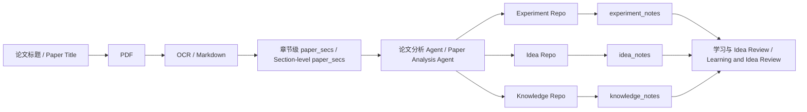

# Paper Analysis / 论文分析

面向 AI Systems、LLM 推理、Serving、编译器、GPU Kernel 与体系结构研究的 Agent 原生论文工作台。
*An agent-native paper research workbench for AI systems, LLM inference, serving, compilers, GPU kernels, and computer architecture.*

它不只生成单篇论文摘要，而是把论文持续加工成可检索、可复用、可审查的研究资产：原始 PDF、章节级 Markdown、分层知识、实验复现信息、研究 Idea、学习报告与 Idea Review。
*Rather than producing disposable paper summaries, it continuously transforms papers into searchable, reusable, and reviewable research assets: original PDFs, section-level Markdown, layered knowledge, reproducibility evidence, research ideas, learning reports, and idea reviews.*

适合希望把几十到上百篇系统论文沉淀为长期知识库，并用 Agent 持续开展学习、复现设计和 Idea 审查的研究者。
*It is designed for researchers who want to turn dozens or hundreds of systems papers into a long-lived knowledge base and use agents for continuous learning, reproduction planning, and idea evaluation.*

## 能做什么？ / What Can It Do?

- **论文摄取 / Paper ingestion**：按标题批量下载论文，使用 Marker 将 PDF/OCR 转为 Markdown，并按章节拆分。
  *Download papers by title, convert PDFs to Markdown with Marker and OCR, and split them into sections.*
- **论文分析 / Paper analysis**：从论文中提取 Baseline 缺陷、核心设计、实现方式、实验配置与 pipeline/kernel 执行流。
  *Extract baseline limitations, core designs, implementations, experimental setups, and pipeline/kernel execution flows.*
- **分层知识库 / Layered knowledge base**：按算法 Pipeline、Serving 调度、编译框架、Kernel 调度、硬件架构、芯片设计六个层次沉淀知识。
  *Organize knowledge across six layers: algorithm pipeline, serving scheduling, compiler framework, kernel scheduling, hardware architecture, and chip design.*
- **实验与 Idea 提取 / Experiment and idea extraction**：将可复现实验、实现环境和设计思想分别写入 experiment、knowledge、idea repo。
  *Extract reproducible experiments, implementation environments, and design ideas into experiment, knowledge, and idea repositories.*
- **研究问题学习 / Research-question learning**：多 Agent 从六个层次构造问题、检索本地笔记、回答问题，并生成横向与纵向总结。
  *Use multiple agents to formulate questions across six layers, retrieve local notes, answer questions, and produce horizontal and vertical summaries.*
- **Idea 盲评 / Blind idea review**：Question Agent 在看不到 Idea 原文的条件下追问，Answer Agent 基于本地论文和笔记作答，最终输出可复现性与创新性 Review。
  *A Question Agent probes an idea without seeing its source note, while an Answer Agent responds from local papers and notes before a final reproducibility and novelty review is produced.*
- **Obsidian 检索解释 / Obsidian-grounded explanation**：以本地论文和研究笔记为证据，解释术语、机制、伪代码、公式和执行流程。
  *Explain terminology, mechanisms, pseudocode, formulas, and execution flows using local papers and research notes as evidence.*

## 主要思想 / Core Ideas

### 1. 从“论文文件”到“研究资产” / From Paper Files to Research Assets



论文不是一次性输入。系统将其逐步转化为结构化 Markdown，使后续 Agent 可以继续检索、比较、追问和审查。
*A paper is not treated as a one-time input. The system progressively converts it into structured Markdown so later agents can retrieve, compare, question, and review it.*

### 2. 用研究层次组织知识 / Organize Knowledge by Research Layer

仓库使用统一的六层研究视角：
*The repository uses a unified six-layer research perspective:*

```text
算法 Pipeline / Algorithm Pipeline
  -> Serving 调度 / Serving Scheduling
  -> 编译框架 / Compiler Framework
  -> Kernel 调度 / Kernel Scheduling
  -> 硬件架构 / Hardware Architecture
  -> 芯片设计 / Chip Design
```

同一篇论文可以同时贡献术语、实验实现和研究 Idea，并被归入多个层次。这样得到的不是按论文孤立存放的摘要，而是可跨论文复用的研究知识库。
*A single paper can contribute terminology, experimental implementations, and research ideas to multiple layers. The result is a reusable cross-paper research knowledge base rather than a collection of isolated summaries.*

### 3. Skill 定义研究方法，脚本负责可靠编排 / Skills Define Methods, Scripts Provide Reliable Orchestration

- `.codex/skills/` 和 `.claude/skills/` 定义论文分析、知识提取、笔记解释和 Review 方法。
  *`.codex/skills/` and `.claude/skills/` define methods for paper analysis, knowledge extraction, note-grounded explanation, and review.*
- `scripts/` 负责批处理、Agent 调度、协议转发、checkpoint、恢复和进度监控。
  *`scripts/` handles batch processing, agent scheduling, protocol forwarding, checkpoints, recovery, and progress monitoring.*
- Markdown 与 Obsidian Vault 充当透明、可人工编辑的持久状态。
  *Markdown and the Obsidian Vault provide transparent, human-editable persistent state.*
- `--dry-run`、隔离测试目录和 checkpoint 用于在启动批量或付费 Agent 前验证路径与任务。
  *`--dry-run`, isolated test directories, and checkpoints validate paths and tasks before batch jobs or paid agents are launched.*

### 4. 复用现有工具环境 / Reuse Existing Tool Environments

论文下载与 Marker 转换使用轻量接口脚本调用已有工具，不复制或迁移大型环境。后端路径可通过环境变量覆盖。
*Thin wrapper scripts call existing paper-download and Marker environments without copying or migrating large installations. Backend paths can be overridden through environment variables.*

## 处理链路 / Processing Pipeline

```text
papers_pdf/<批次 / batch>
  -- scripts/pdf_to_md.py -->
papers_md/<批次 / batch>
  -- scripts/paper_mdsplit_batch.py -->
paper_secs/<批次 / batch>
  -- scripts/run_all_papers.py -->
repos/<批次 / batch>
  -- scripts/repo_mdsplit_batch.py -->
experiment_notes / idea_notes / knowledge_notes
```

`paper_secs`、`knowledge_notes`、`experiment_notes`、`idea_notes`、`human_notes` 和 `learning_outputs` 可以共同作为 Obsidian 检索与 Agent 学习的本地证据源。
*`paper_secs`, `knowledge_notes`, `experiment_notes`, `idea_notes`, `human_notes`, and `learning_outputs` can jointly serve as local evidence sources for Obsidian retrieval and agent learning.*

## 依赖 / Dependencies

### 本地处理 / Local Processing

- Linux / Bash
- Python 3
- `mdsplit`：按 Markdown 标题拆分论文。
  *`mdsplit`: splits papers by Markdown headings.*

### Agent 工作流 / Agent Workflows

- Node.js、`npx` 与 `tsx`
  *Node.js, `npx`, and `tsx`*
- Claude Code CLI，并已配置可用模型与权限。
  *Claude Code CLI with an available model and appropriate permissions configured.*

### 外部工具集成 / External Tool Integrations

- 论文下载后端 / Paper-download backend：默认 / default `/data3/agent_research/download_papers.py`
- Marker 环境 / Marker environment：默认 / default `/home/descfly/Desktop/marker`
- Marker Python：默认 / default `/home/descfly/miniconda3/bin/python3`
- Obsidian Vault 与 Obsidian API/MCP：用于本地笔记检索、学习与 Idea Review。
  *Obsidian Vault and Obsidian API/MCP for local-note retrieval, learning, and idea review.*

本仓库有意复用这些现有环境，目前不提供统一依赖锁文件或一键安装脚本。
*This repository intentionally reuses existing environments and currently does not provide a unified dependency lockfile or one-command installer.*

下载器和 Marker 路径可临时覆盖：
*The downloader and Marker paths can be overridden temporarily:*

```bash
PAPER_DOWNLOAD_BACKEND=/path/to/download_papers.py \
  python3 scripts/paper_download.py --help

MARKER_ROOT=/path/to/marker MARKER_PYTHON=/path/to/python \
  python3 scripts/pdf_to_md.py --help
```

当前部分 Agent 编排脚本默认使用 `/data3/paper_analysis` 作为 Vault 根目录。迁移到其他路径前，需要同步调整脚本与 Skill 中的路径配置。
*Some agent orchestration scripts currently use `/data3/paper_analysis` as the default Vault root. Update path configuration in both scripts and skills before relocating the repository.*

## 快速开始 / Quick Start

### 1. 检查环境 / Check the Environment

```bash
cd /data3/paper_analysis

python3 -m py_compile scripts/*.py
mdsplit --help
npx tsx --version
claude --version
npx tsx scripts/idea_review_orchestrator.test.ts
```

### 2. 下载并转换论文 / Download and Convert Papers

```bash
# 根据标题文件批量下载 PDF / Download PDFs from a title-list file
python3 scripts/paper_download.py \
  --file /data3/paper_analysis/papers_pdf/paper_titles_2026.md \
  --output /data3/paper_analysis/papers_pdf/paper_2026

# 批量转为 Markdown，跳过已有结果 / Convert PDFs to Markdown and skip existing outputs
python3 scripts/pdf_to_md.py batch \
  /data3/paper_analysis/papers_pdf/paper_2026 \
  --output /data3/paper_analysis/papers_md/md_2026 \
  --workers 2 \
  --skip-existing

# 按一级标题拆分为章节 / Split papers into sections by level-one headings
python3 scripts/paper_mdsplit_batch.py \
  /data3/paper_analysis/papers_md/md_2026 \
  /data3/paper_analysis/paper_secs/secs_2026
```

需要对扫描版或文本质量较差的论文执行整篇 OCR 时，将 `--force_ocr` 传给 `pdf_to_md.py`。
*For scanned or low-quality papers, pass `--force_ocr` to `pdf_to_md.py` to OCR the entire document.*

### 3. 分析论文并生成知识资产 / Analyze Papers and Generate Knowledge Assets

先用真实路径进行单论文 dry-run，不会启动 Claude 或写 checkpoint：
*Start with a single-paper dry run using real paths. It does not launch Claude or write checkpoints:*

```bash
python3 scripts/run_all_papers.py \
  --paper-base-dir /data3/paper_analysis/paper_secs/secs_2026 \
  --checkpoint-dir /data3/paper_analysis/paper_extract_checkpoints/2026 \
  --output-repo-dir /data3/paper_analysis/repos/repo_2026 \
  --title "1-Towards High-Goodput LLM Serving with Prefill-decode Multiplexing" \
  --dry-run
```

确认路径和 Prompt 后移除 `--dry-run`，再将汇总 repo 拆分到 Vault：
*After verifying the paths and prompt, remove `--dry-run`, then split the aggregate repositories into the Vault:*

```bash
python3 scripts/repo_mdsplit_batch.py \
  /data3/paper_analysis/repos/repo_2026 \
  --notes-base /data3/paper_analysis
```

### 4. 启动六层研究学习 / Start Six-Layer Research Learning

```bash
npx tsx scripts/learning_scheduler.ts \
  --work-dir /data3/paper_analysis/learning_outputs \
  --user-input "研究 MoE 在单 GPU 上的多算子并发，侧重 Kernel 调度"
```

监控任务进度：
*Monitor task progress:*

```bash
watch -n 5 -c scripts/monitor_progress.sh <具体学习任务目录 / learning-run-directory>
```

### 5. 启动 Idea 盲评 / Start a Blind Idea Review

```bash
npx tsx scripts/idea_review_orchestrator.ts \
  --idea-note "/data3/paper_analysis/idea_notes/<Idea Note>.md" \
  --work-dir "/data3/paper_analysis/.claude/idea-review-runs/<论文短名 / short-paper-name>" \
  --max-rounds 8 \
  --max-budget-usd 100
```

## 可直接使用的脚本 / Ready-to-Use Scripts

| 脚本 / Script | 用途 / Purpose |
|---|---|
| `scripts/paper_download.py` | 按单个标题或标题文件下载论文。<br>*Download papers by a single title or title-list file.* |
| `scripts/pdf_to_md.py` | 单篇或批量 PDF 转 Markdown，支持 OCR。<br>*Convert single or batch PDFs to Markdown with OCR support.* |
| `scripts/paper_mdsplit_batch.py` | 将论文 Markdown 拆分为章节。<br>*Split paper Markdown into sections.* |
| `scripts/run_all_papers.py` | 顺序分析论文并生成 experiment/idea/knowledge repo。<br>*Analyze papers sequentially and generate experiment, idea, and knowledge repositories.* |
| `scripts/run_all_papers_multi_launch*.py` | 按预设配置并行分析多组论文。<br>*Analyze multiple configured paper groups in parallel.* |
| `scripts/repo_mdsplit_batch.py` | 将汇总 repo 拆分为 Vault 独立笔记。<br>*Split aggregate repositories into standalone Vault notes.* |
| `scripts/learning_scheduler.ts` | 编排六层问题、回答与总结 Agent。<br>*Orchestrate six-layer question, answer, and summary agents.* |
| `scripts/monitor_progress.sh` | 只读监控学习任务进度。<br>*Monitor learning-task progress without modifying it.* |
| `scripts/idea_review_orchestrator.ts` | 编排 QA/AA 双会话 Idea 盲评。<br>*Orchestrate a dual-session QA/AA blind idea review.* |

完整参数、正式路径、临时测试命令和已验证的 SGLang OCR 样例见 [scripts/README.md](scripts/README.md)。
*See [scripts/README.md](scripts/README.md) for complete parameters, production paths, isolated test commands, and the validated SGLang OCR example.*

## 核心 Skill / Core Skills

### Claude 工作流 Skill / Claude Workflow Skills

`.claude/skills/` 中的 Skill 定义批量论文处理、学习调度和 Idea Review 的实际 Agent 行为。编排脚本主要负责启动会话、传递参数、转发协议和维护 checkpoint。
*Skills under `.claude/skills/` define the actual agent behavior for batch paper processing, learning orchestration, and idea review. The orchestration scripts primarily launch sessions, pass parameters, forward protocol messages, and maintain checkpoints.*

下表使用各 `SKILL.md` frontmatter 中声明的可调用名称。Idea Skill 的目录名使用下划线：`idea_question`、`idea_answer`、`idea_brainstorm`；其可调用名称使用连字符：`idea-question`、`idea-answer`、`idea-brainstorm`。
*The tables use the callable names declared in each `SKILL.md` frontmatter. Idea-skill directories use underscores (`idea_question`, `idea_answer`, and `idea_brainstorm`), while their callable names use hyphens (`idea-question`, `idea-answer`, and `idea-brainstorm`).*

#### 论文处理 / Paper Processing

| Skill | 调用方式 / Invocation | 能力 / Capability |
|---|---|---|
| `paper-experiment-idea` | `run_all_papers.py` | 从论文提取分层实验、复现配置和 Baseline-vs-Method Idea。<br>*Extract layered experiments, reproduction configurations, and baseline-vs-method ideas from papers.* |
| `paper-knowledge` | `run_all_papers.py` | 从论文提取关键术语，并维护分层 knowledge repo。<br>*Extract key terminology from papers and maintain the layered knowledge repository.* |
| `md-split` | 直接调用 / Direct invocation | 按 `##` 标题将单个汇总 Markdown 拆成独立笔记。<br>*Split one aggregate Markdown file into standalone notes by `##` headings.* |

#### 六层研究学习 / Six-Layer Research Learning

| Skill | 调用阶段 / Phase | 能力 / Capability |
|---|---|---|
| `learning-experiment-from-notes-question` | `learning_scheduler.ts` Phase 1 | 为每个研究层次构造方法、实现和实验环境问题空间。<br>*Build a method, implementation, and experimental-environment question space for each research layer.* |
| `learning-experiment-from-notes-answer` | `learning_scheduler.ts` Phase 2 | 使用 Obsidian API 检索本地证据并回答单个问题。<br>*Retrieve local evidence through the Obsidian API and answer one question.* |
| `learning-experiment-from-notes-horizon` | `learning_scheduler.ts` Phase 3 | 在单个层次内分类、去重并总结所有答案。<br>*Classify, deduplicate, and summarize answers within one research layer.* |
| `learning-experiment-from-notes-vertical` | `learning_scheduler.ts` Phase 4 | 跨六层梳理从模型负载到芯片设计的完整执行链。<br>*Synthesize the complete execution chain across all six layers, from model workload to chip design.* |

#### Idea 工作流 / Idea Workflows

| Skill | 调用方式 / Invocation | 能力 / Capability |
|---|---|---|
| `idea-question` | `idea_review_orchestrator.ts` | 在不读取 Idea 原文的条件下负责追问、维度评估和最终判断。<br>*Perform blind questioning, dimension-level evaluation, and final judgment without reading the source idea note.* |
| `idea-answer` | `idea_review_orchestrator.ts` | 独占读取 Idea note，检索论文与笔记证据，并提供可追溯回答。<br>*Exclusively read the idea note, retrieve paper and note evidence, and provide traceable answers.* |
| `idea-brainstorm` | 直接调用 / Direct invocation | 对低表面关联的方法进行跨域类比和潜在并发 Idea 探索。<br>*Explore cross-domain analogies and potential concurrency ideas for methods with low apparent relevance.* |

#### 检索与归档 / Retrieval and Archival

| Skill | 能力 / Capability |
|---|---|
| `obsidian-keyword-explain` | 通过 Obsidian API 检索本地证据，解释术语、机制、公式和执行流。<br>*Retrieve local evidence through the Obsidian API and explain terminology, mechanisms, formulas, and execution flows.* |
| `export-conversation-notes` | 将用户输入和 Claude 最终回答增量归档到 `human_notes/`。<br>*Incrementally archive user inputs and Claude final answers under `human_notes/`.* |

### Codex 配套 Skill / Codex Companion Skills

`.codex/skills/` 提供适合交互式研究与维护工作的 Codex 入口，其中部分能力与 Claude Skill 对应，但命名和执行约束不同。
*`.codex/skills/` provides Codex entry points for interactive research and maintenance. Some capabilities correspond to Claude skills, but their names and execution constraints differ.*

| Skill | 能力 / Capability |
|---|---|
| `paper-single-analysis` | 对单篇论文生成实现、实验、Baseline 与 pipeline/kernel 分析。<br>*Analyze implementation, experiments, baselines, and pipeline/kernel flows for one paper.* |
| `paper-experiment-idea` | 提取可复现实验和跨层设计 Idea。<br>*Extract reproducible experiments and cross-layer design ideas.* |
| `paper-knowledge-base` | 构建分层术语知识库，对应 Claude 侧的 `paper-knowledge`。<br>*Build a layered terminology knowledge base, corresponding to Claude's `paper-knowledge` skill.* |
| `obsidian-keyword-explainer` | 基于本地 Obsidian 证据解释术语与机制，对应 Claude 侧的 `obsidian-keyword-explain`。<br>*Explain terminology and mechanisms using local Obsidian evidence, corresponding to Claude's `obsidian-keyword-explain` skill.* |
| `export-conversation-notes` | 将研究对话增量归档到 `human_notes/`。<br>*Incrementally archive research conversations under `human_notes/`.* |

## 目录结构 / Repository Structure

```text
paper_analysis/
├── papers_pdf/              # 下载的原始论文 / Downloaded original papers
├── papers_md/               # Marker 转换结果 / Marker conversion outputs
├── paper_secs/              # 按章节拆分后的论文 / Papers split into sections
├── repos/                   # Agent 批处理汇总 / Agent-generated aggregate repositories
├── knowledge_notes/         # 分层术语知识库 / Layered terminology knowledge base
├── experiment_notes/        # 实验与复现信息 / Experiment and reproduction evidence
├── idea_notes/              # 论文设计 Idea / Paper design ideas
├── review_notes/            # Idea Review 结果 / Idea review results
├── human_notes/             # 人工笔记与对话归档 / Human notes and conversation archives
├── learning_outputs/        # 多 Agent 学习结果 / Multi-agent learning outputs
├── paper_extract_checkpoints/
├── .codex/skills/
├── .claude/skills/
└── scripts/
```

## 使用边界 / Usage Boundaries

- 下载论文需要网络，并受公开可访问来源限制。
  *Paper downloading requires network access and is limited by publicly accessible sources.*
- Marker OCR 和大批量转换可能需要较多 CPU/GPU、显存与时间。
  *Marker OCR and large batch conversions may require significant CPU/GPU resources, memory, and time.*
- `run_all_papers.py`、`learning_scheduler.ts` 和 `idea_review_orchestrator.ts` 会启动 Agent，并可能产生模型调用费用。
  *`run_all_papers.py`, `learning_scheduler.ts`, and `idea_review_orchestrator.ts` launch agents and may incur model usage costs.*
- 批量分析前建议先使用 `--dry-run` 或临时目录验证输入、输出与 checkpoint。
  *Before batch analysis, use `--dry-run` or isolated directories to validate inputs, outputs, and checkpoints.*
- Agent 输出应视为研究辅助材料；关键论文结论、实验数字与复现配置仍需要人工核对。
  *Agent outputs should be treated as research assistance; critical paper claims, experimental numbers, and reproduction configurations still require human verification.*

## 当前状态 / Current Status

仓库已完成从标题下载、Marker OCR、章节拆分、单论文分析到知识笔记拆分的单样本与正式路径验证。当前重点面向 AI Systems 与体系结构论文，并持续完善分层知识库、研究学习和 Idea Review 工作流。
*The repository has validated both isolated samples and production paths covering title-based download, Marker OCR, section splitting, single-paper analysis, and knowledge-note splitting. It currently focuses on AI systems and architecture papers while continuing to improve its layered knowledge base, research-learning workflow, and idea-review process.*
