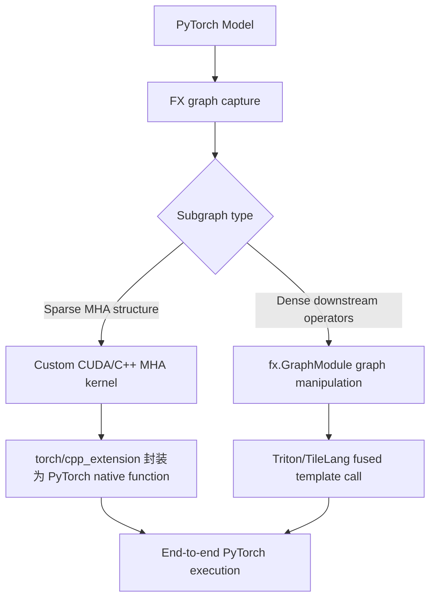

# Accelerating Sparse Transformer Inference on GPU (STOF) 对话记录

来源当前笔记：[[idea_notes/Accelerating Sparse Transformer Inference on GPU (STOF).md]]

本对话围绕 STOF 论文的五层全栈执行路径展开，重点补充了**编译框架层**：`neural hashing → predefined rules → hash encoding → numerical decoding → Triton/TileLang template → two-stage search`。

---

## 1. 用户选中文段

```md
**算法层**：Bigbird mask (80.8% sparsity, unstructured) → two-level storage format表示为full OTs (BSR) + part OTs (64×uint64 bitmap_mask)，任意mask pattern统一表示。Mask sparsity直接转化为计算量跳过（仅加载/计算valid OTs）
  - **系统框架层**：STOF将模型分为MHA structure（sparse，custom kernel处理）和downstream operators（dense，template-based fusion处理）→ torch/cpp_extension将MHA kernel封装为PyTorch native function→ fx.GraphModule operate downstream graph
  - **编译框架层**：neural hashing发现频繁子图→predefined rules生成initial fusion scheme→hash encoding转为binary array→numerical decoding映射到Triton/TileLang compilation template→two-stage search engine确定optimal fusion scheme + kernel parameter
  - **kernel调度层**：Block-wise kernel（因seq_len=4096，valid OT ratio适中）：Q_i在register中resident→仅加载valid OTs的K_Tj/V_j→cp.async异步加载V_j与GEMM重叠→part OTs用bitmap_mask精确mask 8×8 IT→Softmax with scaling factor α做跨OT reduction→最终write back HBM。OT行主序（Softmax迭代）、IT列主序（bank conflict-free）、Q register resident（避免SMEM重复读写）
  - **硬件架构层**：NVIDIA A100 (108 SM, 80GB HBM2e) → block-wise kernel利用Tensor Cores (8×8 IT对齐mma.m16n8k16)，SMEM double buffering重叠memory access与compute → 端到端相对FA2加速~4.8×（(16,4096)时）
```

---

## 2. 第一轮解释：五层语义切分与综合理解

### 2.1 语义切分

1. **算法层：Bigbird mask + two-level storage + valid OT skipping**  
   解释 sparse attention mask 如何被统一表示，以及 mask sparsity 如何转化成真实计算跳过。

2. **系统框架层：MHA structure / downstream operators 分离 + PyTorch native integration + FX graph 操作**  
   解释 STOF 如何嵌入 PyTorch 执行框架，把 sparse MHA 和 dense downstream fusion 分开处理。

3. **编译框架层：neural hashing → hash encoding → numerical decoding → Triton/TileLang template → two-stage search**  
   解释 dense downstream operators 如何自动选择 fusion scheme 和 kernel 参数。

4. **kernel 调度层：block-wise sparse MHA kernel 的 tile 级执行流**  
   解释 GPU kernel 内部如何只加载 valid OTs、bitmap 处理 part OTs、online softmax 跨 OT reduction、重叠访存与计算。

5. **硬件架构层：A100 + Tensor Cores + SMEM double buffering + HBM 减流量**  
   解释算法、编译、kernel 优化最终如何映射到 NVIDIA GPU 硬件资源。

### 2.2 算法层重点

Bigbird mask 是 compound sparse attention，由 sliding window + global attention + random attention 组成。笔记中设置为 `global width=32, band width=32, filling rate=10%`，sparsity 约 **80.8%**。

STOF 使用 two-level storage format：

- **OuterTile, OT**：粗粒度 block，用 BSR/CSR 风格数组记录有效 OT。
- **InnerTile, IT**：细粒度 `8×8` 元素 tile。
- **full OT**：整个 OT 内部有效，用 `full_row_ptr/full_col_idx` 表示。
- **part OT**：部分元素有效，用 `part_row_ptr/part_col_idx + bitmap_mask` 表示。
- **bitmap_mask**：每个 part OT 对应 `64 × uint64`，精确表示内部 64 个 `8×8 IT`。

计算量直觉：

```text
seq_len = 4096
full attention score entries = 4096 × 4096 = 16,777,216
Bigbird sparsity = 80.8%
valid ratio = 19.2%
理论有效注意力位置 ≈ 16,777,216 × 0.192 ≈ 3,221,225
```

核心价值：mask 不再只是 `-inf` subtraction，而是驱动 kernel 只加载/计算 valid OTs。

### 2.3 系统框架层重点

STOF 把 Transformer 图拆成：

```text
MHA structure        → sparse，custom CUDA/C++ kernel 处理
downstream operators → dense，template-based fusion 处理
```

系统集成流程：



### 2.4 kernel 调度层重点

Block-wise sparse MHA fused kernel 把：

```text
QK^T → mask → softmax → PV
```

融合到一个 kernel 中，并且只遍历 valid OTs。

核心伪代码：

```pseudo
for row_OT i:
    Q_i = load_Q_to_register(i)
    O_i = 0

    for each valid col_OT j in load_col_idx[i]:
        K_Tj = load_K_to_smem(j)
        async_load(V_j)

        P_ij = gemm(Q_i, K_Tj)

        if OT(i,j) is part:
            P_ij = apply_bitmap_mask(P_ij, bitmap_mask[i,j])

        S_ij, alpha = online_softmax(P_ij)
        O_i = O_i * alpha + gemm(S_ij, V_j)

    store O_i to HBM
```

其中 online softmax 跨 OT reduction 可理解为：

```text
m_new = max(m_old, max(P_ij))
α     = exp(m_old - m_new)
β     = exp(P_ij - m_new)

l_new = α·l_old + sum(β)
O_new = α·O_old + β·V_j
```

### 2.5 硬件架构层重点

STOF 在 A100 上利用：

- Tensor Cores：`8×8 IT` 对齐 `mma.m16n8k16` operand tile。
- Shared Memory：缓存 K/V tile。
- SMEM double buffering：一边加载下一块 K/V，一边计算当前块。
- HBM traffic reduction：避免完整 score/probability matrix 来回写 HBM。
- Q register resident：`Q_i` 跨多个 KV tile 循环复用。

需要谨慎区分：笔记最明确支持的是 A100 上 MHA/block-wise kernel 相对 FA2 的 kernel-level 加速，特别是 sliding window 高稀疏案例；若要严格断言 Bigbird end-to-end 相对 FA2 为 4.8×，需要回查论文原图或 artifact benchmark 表。

---

## 3. 第二轮：编译框架层整体链路补充

用户追问：

> 编译框架层：neural hashing → hash encoding → numerical decoding → Triton/TileLang template → two-stage search，补充更多细节，每一步是什么？具体流程/算法是什么？

回答核心：这条链路可以理解为：

```text
FX Graph
→ neural hashing 发现可融合子图
→ predefined rules 形成初始 fusion scheme
→ hash encoding 把 scheme 变成 binary array
→ numerical decoding 把 binary array 还原为 fused segments
→ 映射到 Triton/TileLang template
→ two-stage search 同时优化 fusion boundary 和 kernel parameters
→ 替换 fx.GraphModule 中的原始 nodes
```

### 3.1 输入

输入不是 sparse MHA 本身，而是 **MHA 后面的 downstream dense operators**，例如：

```text
GEMM → Add → LayerNorm
GEMM → GEMM → Activation
Add → LayerNorm
```

### 3.2 neural hashing

形式：

```text
H(G) = F_hash(F_conv(G))
```

作用：从 computational graph 中发现频繁出现、值得作为 fusion candidate 的子图 pattern。

简化算法：

```pseudo
function neural_hashing(FXGraph G):
    candidates = enumerate_local_subgraphs(G)

    fingerprints = {}
    for subgraph sg in candidates:
        feature = F_conv(sg)
        h = F_hash(feature)
        fingerprints[h].append(sg)

    frequent_patterns = []
    for h, group in fingerprints:
        if frequency(group) >= threshold:
            frequent_patterns.append(group)

    return frequent_patterns
```

### 3.3 predefined rules

neural hashing 只发现候选子图，predefined rules 把候选子图变成初始 fusion scheme。

示例规则：

```pseudo
function initialize_scheme(patterns, input_shape):
    S = empty_scheme()

    for pattern in patterns:
        if pattern == GEMM_CHAIN and input_shape.batch small and input_shape.seq short:
            fuse_as_one_segment(pattern)

        elif pattern == GEMM_ADD_LAYERNORM:
            mark_as_candidate_CI_MI(pattern)

        elif pattern == ADD_LAYERNORM:
            mark_as_candidate_MI_MI(pattern)

        else:
            leave_unfused_or_small_segment(pattern)

    enforce_constraint(max_CI_per_segment = 2)
    return S
```

### 3.4 hash encoding

规则：

```text
binary array 长度 = operator 数量
相邻 operator 如果属于同一个 fused segment → 使用相同数字
相邻 operator 如果是 fusion boundary → 使用不同数字
```

例子：

```text
#0 #1 [#2 #3 #4 #5 #6] [#7 #8 #9] [#10 #11 #12] [#13 #14]
 0  1   0  0  0  0  0    1  1  1    0   0   0     1   1
```

### 3.5 numerical decoding

从 binary array 扫描连续相同数字，恢复 segments，再根据 operator type 映射 template。

```pseudo
function numerical_decode(code, graph):
    segments = []
    start = 0

    for i in range(1, len(code)):
        if code[i] != code[i-1]:
            segments.append(graph.ops[start:i])
            start = i
    segments.append(graph.ops[start:])

    template_plan = []
    for seg in segments:
        types = [op.type for op in seg]

        if match(types, ["GEMM", "Add", "LayerNorm"]):
            template_plan.append(template_gemm_layernorm(seg))

        elif match(types, ["GEMM", "GEMM", "Activation"]):
            template_plan.append(template_gemm_gemm(seg))

        elif match(types, ["Add", "LayerNorm"]):
            template_plan.append(template_add_layernorm(seg))

        elif is_MHA(seg):
            template_plan.append(custom_mha_kernel(seg))

        else:
            template_plan.append(unfused_or_vendor_kernel(seg))

    return template_plan
```

### 3.6 Triton/TileLang template

template 是手写的高性能 kernel skeleton，固定 fused operator 数据流，并暴露关键参数给 search engine。

例子：

```text
template_gemm_layernorm:
    BLOCK_M, BLOCK_N, BLOCK_K, num_warps, num_stages

template_gemm_gemm:
    blkM, blkN, blkK, blkH, num_warps, num_stages

template_add_layernorm:
    block_size, num_warps, num_stages
```

### 3.7 two-stage search

目标：

```text
(S*, θ*) = argmin Latency(S, θ | input_shape, hardware)
```

其中：

- `S`：fusion scheme。
- `θ`：kernel parameters。
- `input_shape`：batch size、seq_len、hidden dim。
- `hardware`：A100 / RTX4090 等。

Stage 1 Fusion Expansion：搜索 fusion boundary，使用 expand/seize/compete 三条规则。  
Stage 2 Reward-based Parameter Sampling：固定 fusion scheme，搜索每段 template 参数，并把更多采样预算分给收益最高的 segment。

---

## 4. 第三轮：四个编译前端步骤更详细展开

用户继续追问：

> Neural hashing：发现“频繁子图”。Predefined rules：生成 initial fusion scheme。Hash encoding：把 fusion scheme 编成 binary array。Numerical decoding：从 binary array 还原 segment 并映射 template更详细点

回答重点：这四步是 **“图结构 → 初始融合方案 → 数字编码 → 模板实例化”** 的编译前端。

```text
FX Graph
  ↓
1. Neural hashing：找哪些子图值得融合
  ↓
2. Predefined rules：根据经验规则生成初始 fusion scheme
  ↓
3. Hash encoding：把 fusion scheme 编成 binary array，方便搜索和缓存
  ↓
4. Numerical decoding：把 binary array 还原成 fused segments，并映射到 Triton/TileLang template
```

### 4.1 Neural hashing：发现频繁子图

#### 解决的问题

如果 graph 有 `n` 个 operator，每条边界都有“断开/融合”两种可能，搜索空间约为：

$possible fusion schemes ≈ 2^{(n-1)}$

因此 STOF 先找出高频、典型、值得作为初始候选的 pattern。

#### 输入

PyTorch FX downstream graph：

```text
G = (V, E)
V: operator nodes
E: data dependency edges
```

每个 node 可以有：

```text
op_type: GEMM / Add / LayerNorm / Softmax / Activation
category: CI / MI
shape: tensor shape, hidden_dim, seq_len, batch
in_degree / out_degree
position: 在 transformer block 中的位置
```

#### 具体流程

Step A：枚举局部子图。

```pseudo
function enumerate_subgraphs(G, max_len):
    candidates = []

    for node in G.nodes:
        for length in [2, 3, ..., max_len]:
            sg = get_forward_dependency_chain(node, length)
            if is_valid_subgraph(sg):
                candidates.append(sg)

    return candidates
```

Step B：`F_conv` 提取结构特征。

```pseudo
function F_conv(subgraph):
    h = []

    for node in subgraph.nodes:
        node_feature = encode(
            op_type=node.op_type,
            category=CI_or_MI(node),
            tensor_shape=node.shape,
            degree=(node.in_degree, node.out_degree),
            has_reduction=node.has_reduction
        )
        h.append(node_feature)

    structural_feature = aggregate_by_edges(h, subgraph.edges)
    return structural_feature
```

Step C：`F_hash` 生成 fingerprint 并统计频率。

```pseudo
function find_frequent_patterns(subgraphs):
    table = {}

    for sg in subgraphs:
        feature = F_conv(sg)
        h = F_hash(feature)
        table[h].append(sg)

    frequent = []
    for h, group in table:
        if len(group) >= frequency_threshold:
            frequent.append(group)

    return frequent
```

输出示例：

```text
Pattern A: GEMM → Add → LayerNorm
Pattern B: GEMM → GEMM → Activation
Pattern C: Add → LayerNorm
```

### 4.2 Predefined rules：生成 initial fusion scheme

#### 解决的问题

Neural hashing 只告诉系统“哪些子图常见”，但没有决定融合边界。因此 predefined rules 负责把候选 pattern 变成初始融合方案。

#### 规则类型

Rule A：优先融合高频 pattern。

```pseudo
if pattern.frequency high:
    mark_as_fusion_candidate(pattern)
```

Rule B：区分 CI 和 MI。

```text
CI: compute-intensive，例如 GEMM
MI: memory-intensive，例如 Add, LayerNorm, elementwise op
```

常见组合：

```text
CI + MI: GEMM + Add + LayerNorm
CI + CI: GEMM + GEMM chain
MI + MI: Add + LayerNorm
```

Rule C：限制每个 segment 中 CI operator 数量。

```pseudo
if count_CI(segment) > 2:
    split_segment(segment)
```

Rule D：根据 input shape 选择初始偏好。

```pseudo
if batch_size small and seq_len short:
    prefer_fusing_GEMM_chain()

if hidden_dim small_or_medium:
    allow_GEMM_LayerNorm_fusion()

if hidden_dim large:
    be_conservative_about_CI_MI_fusion()
```

输出示例：

```text
[#0]
[#1]
[#2 #3 #4 #5 #6]
[#7 #8 #9]
[#10 #11 #12]
[#13 #14]
```

### 4.3 Hash encoding：把 fusion scheme 编成 binary array

#### 解决的问题

Fusion scheme 是图结构，不方便 search、comparison、cache、mutation。Hash encoding 把它变成 binary numerical expression。

#### 编码规则

```text
每个 operator 对应 binary array 的一个位置。
连续相同数字表示属于同一个 fused segment。
相邻位置数字变化表示 fusion boundary。
```

例子：

```text
#0 #1 #2 #3 #4 #5 #6 #7 #8 #9 #10 #11 #12 #13 #14
0  1  0  0  0  0  0  1  1  1  0   0   0   1   1
```

注意：`0` 和 `1` 没有 operator 语义，只是连续段标签。

#### 编码算法

```pseudo
function hash_encode(segments, num_ops):
    code = array(length=num_ops)

    bit = 0

    for segment in segments in topological_order:
        for op in segment:
            code[op.id] = bit

        bit = 1 - bit

    return code
```

支持 cache：

```pseudo
performance_cache[(scheme_hash, param_hash)] = measured_latency
```

### 4.4 Numerical decoding：还原 segment 并映射 template

#### 解决的问题

Search engine 处理 binary array，但真正编译时需要知道每段包含哪些 operator、属于什么 pattern、调用哪个 template、参数空间是什么。

#### 解码第一步：还原 segments

```pseudo
function split_segments(code, ops):
    segments = []
    start = 0

    for i in range(1, len(code)):
        if code[i] != code[i-1]:
            segments.append(ops[start:i])
            start = i

    segments.append(ops[start:len(code)])
    return segments
```

示例：

```text
code = 0 1 0 0 0 0 0 1 1 1 0 0 0 1 1
ops  = #0 #1 #2 #3 #4 #5 #6 #7 #8 #9 #10 #11 #12 #13 #14
```

得到：

```text
Segment 0: [#0]
Segment 1: [#1]
Segment 2: [#2 #3 #4 #5 #6]
Segment 3: [#7 #8 #9]
Segment 4: [#10 #11 #12]
Segment 5: [#13 #14]
```

#### 解码第二步：识别 pattern

```pseudo
function classify_segment(segment):
    types = [op.type for op in segment]

    if types == [GEMM, Scale, Mask, Softmax, GEMM]:
        return MHA_PATTERN

    if types == [GEMM, Add, LayerNorm]:
        return CI_MI_GEMM_LN

    if types == [GEMM, GEMM, Activation]:
        return CI_CI_GEMM_CHAIN

    if types == [Add, LayerNorm]:
        return MI_MI_ADD_LN

    return UNKNOWN_OR_UNFUSED
```

#### 解码第三步：映射 template

| Segment pattern | 类型 | Template |
|---|---|---|
| `GEMM → Scale → Mask → Softmax → GEMM` | Sparse MHA | custom MHA kernel |
| `GEMM → Add → LayerNorm` | CI + MI | `template_gemm_layernorm` |
| `GEMM → GEMM → Activation` | CI + CI | `template_gemm_gemm` |
| `Add → LayerNorm` | MI + MI | `template_add_layernorm` |

#### 完整伪代码

```pseudo
function numerical_decode(code, ops):
    segments = split_segments(code, ops)
    plan = []

    for seg in segments:
        pattern = classify_segment(seg)

        if pattern == MHA_PATTERN:
            plan.append({
                "segment": seg,
                "backend": "custom_cuda_mha_kernel",
                "params": mha_kernel_param_space
            })

        elif pattern == CI_MI_GEMM_LN:
            plan.append({
                "segment": seg,
                "backend_candidates": [
                    "triton_template_gemm_layernorm",
                    "tilelang_template_gemm_layernorm"
                ],
                "params": {
                    "BLOCK_M": [...],
                    "BLOCK_N": [...],
                    "BLOCK_K": [...],
                    "num_warps": [...],
                    "num_stages": [...]
                }
            })

        elif pattern == CI_CI_GEMM_CHAIN:
            plan.append({
                "segment": seg,
                "backend_candidates": [
                    "triton_template_gemm_gemm",
                    "tilelang_template_gemm_gemm"
                ],
                "params": {
                    "blkM": [...],
                    "blkN": [...],
                    "blkK": [...],
                    "blkH": [...],
                    "num_warps": [...],
                    "num_stages": [...]
                }
            })

        elif pattern == MI_MI_ADD_LN:
            plan.append({
                "segment": seg,
                "backend_candidates": [
                    "triton_template_add_layernorm",
                    "tilelang_template_add_layernorm"
                ],
                "params": {
                    "block_size": [...],
                    "num_warps": [...],
                    "num_stages": [...]
                }
            })

        else:
            plan.append({
                "segment": seg,
                "backend": "fallback_vendor_or_torch_kernel"
            })

    return plan
```

### 4.5 四步连起来的完整例子

输入 FX graph：

```text
#0 GEMM
#1 Add
#2 GEMM
#3 Scale
#4 Mask
#5 Softmax
#6 GEMM
#7 GEMM
#8 Add
#9 LayerNorm
#10 GEMM
#11 GEMM
#12 Activation
#13 Add
#14 LayerNorm
```

Step 1：Neural hashing 发现：

```text
GEMM → Add → LayerNorm
GEMM → GEMM → Activation
Add → LayerNorm
MHA-like pattern
```

Step 2：Predefined rules 生成：

```text
[#0]
[#1]
[#2 #3 #4 #5 #6]
[#7 #8 #9]
[#10 #11 #12]
[#13 #14]
```

Step 3：Hash encoding：

```text
0 1 0 0 0 0 0 1 1 1 0 0 0 1 1
```

Step 4：Numerical decoding：

```text
Segment 2 → custom sparse MHA kernel
Segment 3 → template_gemm_layernorm
Segment 4 → template_gemm_gemm
Segment 5 → template_add_layernorm
```

得到编译计划：

```text
[
  fallback_or_vendor_kernel(#0),
  fallback_or_vendor_kernel(#1),
  custom_sparse_mha_kernel(#2-#6),
  Triton/TileLang GEMM+LayerNorm template(#7-#9),
  Triton/TileLang GEMM+GEMM template(#10-#12),
  Triton/TileLang Add+LayerNorm template(#13-#14)
]
```

---

## 5. 对话中的关键一句话总结

> Neural hashing 负责“找候选”，predefined rules 负责“给初始答案”，hash encoding 负责“让答案可搜索”，numerical decoding 负责“把搜索答案变成可编译 kernel plan”。

更完整地说：

> STOF 的编译框架层把 PyTorch FX graph 中的 dense downstream operators 先转成可融合候选，再由规则生成初始 scheme，用 binary array 表达 scheme，最后通过 numerical decoding 映射到 Triton/TileLang templates，并交给 two-stage search 根据真实性能反馈优化 fusion boundary 和 kernel parameters。

---

## 6. 本对话引用/依据的 vault 笔记

- [[idea_notes/Accelerating Sparse Transformer Inference on GPU (STOF).md]]
- [[experiment_notes/算法实验笔记/Accelerating Sparse Transformer Inference on GPU (STOF).md]]
- [[experiment_notes/kernel实验笔记/Accelerating Sparse Transformer Inference on GPU (STOF).md]]
- [[experiment_notes/编译实验笔记/Accelerating Sparse Transformer Inference on GPU (STOF).md]]
- [[knowledge_notes/算法知识笔记/Sparse Attention Patterns（稀疏注意力模式）：Atomic & Compound.md]]
- [[knowledge_notes/kernel知识笔记/Two-level Sparse Storage Format (BSR + Bitmap) for Sparse MHA.md]]
- [[knowledge_notes/kernel知识笔记/Block-wise Sparse MHA Kernel with Kernel Selection Analytical Model.md]]
- [[knowledge_notes/编译知识笔记/Hash Encoding of Operator Fusion Schemes.md]]
- [[knowledge_notes/编译知识笔记/Compilation Template Mapping via Numerical Decoding.md]]
- [[knowledge_notes/编译知识笔记/Two-stage Hierarchical Search Engine (Fusion Expansion + Reward-based Parameter Sampling).md]]
- [[knowledge_notes/编译知识笔记/TileLang（可组合的 Tiled 编程模型）.md]]

## 7. 联网补充来源

- STOF 论文 PDF：<https://www.ssslab.cn/assets/papers/2026-dai-STOF.pdf>
- PPoPP 2026 页面：<https://ppopp26.sigplan.org/details/PPoPP-2026-papers/24/Accelerating-Sparse-Transformer-Inference-on-GPU>
