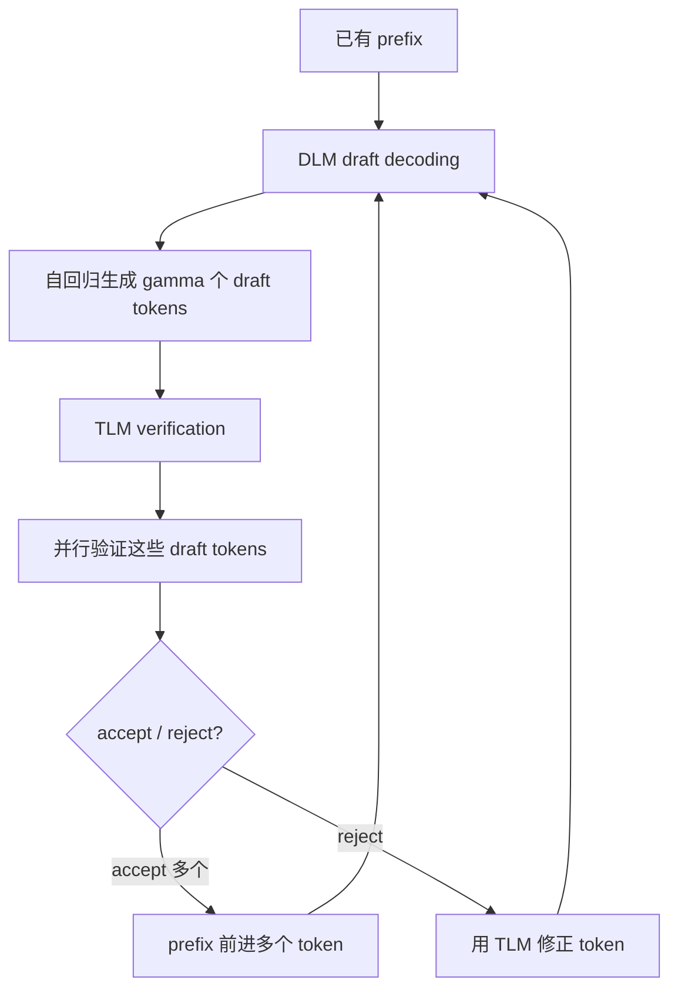

# Adaptive Draft Sequence Length_ Enhancing Speculative Decoding Throughput on PIM-Enabled Systems

- 导出时间：2026-05-19 23:14 CST
- 来源：当前 Codex 可见对话上下文
- 保存路径：conv_notes/Adaptive Draft Sequence Length_ Enhancing Speculative Decoding Throughput on PIM-Enabled Systems.md
- 标题推断：根据当前笔记 `idea_notes/Adaptive Draft Sequence Length_ Enhancing Speculative Decoding Throughput on PIM-Enabled Systems.md` 的 basename 推断。

## 对话记录

### User

用户首先在当前笔记中选中并要求解释一段关于 SADDLE 论文方法的“全栈执行例子”，主题是：

- 论文：Adaptive Draft Sequence Length: Enhancing Speculative Decoding Throughput on PIM-Enabled Systems
- 示例配置：OPT-66B + OPT-1.3B，Dolly，BS=64
- 选中文本覆盖五层：
  - 算法层：自适应 draft length；DLM 生成 token 时用采样概率 $p_t$ 更新 $H_t=H_{t-1}\cdot p_t$，若 $H_t<\tau$ 则停止该请求 drafting。
  - 系统框架层：异步 pipeline；batch 切为 micro-batches，每个 micro-batch 有独立 Draft Generator；Shared Pool 聚合 tokens，Eager Pool 暂存 TLM 验证期间继续生成的 tokens。
  - 编译框架层：论文未明确说明。
  - kernel 调度层：动态 operator mapping；prediction 后统计活跃请求数估算 DLM FC effective batch size，verification 前统计 Shared Pool 中每请求 token 数估算 TLM attention arithmetic intensity，据此在 PIM/GPU 间 remap。
  - 硬件架构层：SADDLE Manager 硬件；Controller 用 softmax unit、multipliers、comparators 低延迟计算 $H_t$ 并比较阈值；Shared/Eager Pool 为小容量片上缓冲；SFU 和 HBM-PIM PE 支持 Transformer 推理。

随后用户继续追问：

1. 固定映射与动态映射分别是什么？这些 mapping 和 speculative decoding 的 decoding / verification 阶段是否有关？
   - 固定映射：
     - DLM attention：低算术强度，固定 PIM。
     - TLM FC：Shared Pool 聚合后 compute-intensive，固定 GPU。
   - 动态映射：
     - DLM FC。
     - TLM attention。
   - 用户要求结合一般 SPD 推理 pipeline 解释。

2. 为什么 TLM attention 需要动态映射，而 TLM FC 能利用 Shared Pool 填满 GPU？为什么 TLM attention 不行？

最后用户触发 `$export-conversation-notes`，要求导出当前可见对话记录。

### Codex

#### 使用的技能与检索

Codex 使用了 `obsidian-keyword-explainer` 技能来解释当前 Obsidian 笔记中的 SADDLE/SPD 语义片段，并通过 Obsidian MCP 在 vault 中检索和读取相关笔记。

主要读取或引用的 vault 文档包括：

- `idea_notes/Adaptive Draft Sequence Length_ Enhancing Speculative Decoding Throughput on PIM-Enabled Systems.md`
- `papers/paper_2026/47-Adaptive Draft Sequence Length Enhancing Speculative Decoding Throughput on PIM-Enabled Systems.md`
- `experiment_notes/系统实验笔记/Adaptive Draft Sequence Length_ Enhancing Speculative Decoding Throughput on PIM-Enabled Systems.md`
- `experiment_notes/kernel实验笔记/Adaptive Draft Sequence Length_ Enhancing Speculative Decoding Throughput on PIM-Enabled Systems.md`
- `experiment_notes/硬件实验笔记/Adaptive_Draft_Sequence_Length_SADDLE.md`
- `knowledge_notes/算法知识笔记/Adaptive Draft Sequence Length（自适应起草序列长度）.md`
- `knowledge_notes/算法知识笔记/Cumulative Acceptance Probability（累计接受概率）.md`
- `knowledge_notes/算法知识笔记/Speculative Decoding（投机解码）.md`
- `knowledge_notes/系统知识笔记/Prediction-Verification Decoupled Asynchronous Pipeline（预测-验证解耦异步流水线）.md`
- `knowledge_notes/系统知识笔记/Shared Pool and Eager Pool for Speculative Decoding（投机解码的共享池与乐观池）.md`
- `knowledge_notes/kernel知识笔记/Arithmetic Intensity-Aware PIM-GPU Operator Scheduling（算术强度感知的PIM-GPU算子调度）.md`
- `knowledge_notes/硬件知识笔记/Roofline-Guided PIM-GPU Heterogeneous Operator Mapping（Roofline引导的PIM-GPU异构算子映射）.md`
- `knowledge_notes/硬件知识笔记/HBM-PIM PE and SFU for Speculative Decoding（面向投机解码的HBM-PIM计算单元与专用功能单元）.md`

未使用联网搜索，因为 Obsidian 笔记证据足够。

#### 第一轮解释：SADDLE 全栈执行例子

Codex 将用户提供的段落切分为 5 个语义单元：

1. 算法层：自适应 draft length 与累计接受概率 $H_t$。
2. 系统框架层：异步 prediction-verification pipeline 与 Shared/Eager Pool。
3. 编译框架层：论文未明确说明。
4. kernel 调度层：算术强度感知的动态 operator mapping。
5. 硬件架构层：SADDLE Manager、HBM-PIM PE、SFU。

关键解释包括：

- 自适应 draft length 用公式

$$
H_t=\prod_{i=1}^{t}p_i
$$

  表示当前 draft 序列的累计置信度；当 $H_t<\tau$ 时停止该请求继续 drafting。

- 用固定 $d=8$ 和 acceptance rate $\rho\approx0.4$ 举例，说明无效 token 估计：

$$
\mathrm{waste}(B,d,\rho)\approx B\cdot d\cdot(1-\rho)
$$

  若 $B=64,d=8,\rho=0.4$，则约有 $64\times8\times0.6=307.2$ 个 token 量级的无效生成/验证负担。

- Shared Pool / Eager Pool 的系统流程：
  - DLM 逐 token 生成 draft。
  - Shared Pool 聚合跨 micro-batch tokens。
  - 当 token 数达到 GPU verification capacity $C$ 或 GPU idle 时触发 TLM verification。
  - TLM 验证期间，DLM 继续为仍满足 $H_t\ge\tau$ 的请求生成 tokens 到 Eager Pool。
  - 如果旧 tokens 被接受，则 Eager Pool tokens 迁移到 Shared Pool；若被拒绝，则丢弃并用 TLM 修正 token 重启。

- 编译框架层强调证据边界：
  - 当前笔记与论文上下文没有明确 compiler IR、compiler pass、lowering 或 codegen pipeline。
  - 因此不应把 runtime scheduler 或 operator mapping 误写成 compiler framework。

- kernel 调度层解释：
  - DLM attention 固定 PIM。
  - TLM FC 固定 GPU。
  - DLM FC 和 TLM attention 动态 PIM/GPU remap。
  - DLM FC 的 CI 近似随 active requests / effective batch size 变化。
  - TLM attention 的 CI 随 Shared Pool 中每请求 token 数变化。

- 硬件层解释：
  - SADDLE Manager 包含 Draft Generator、Controller、Shared Pool、Eager Pool、Scheduler。
  - Controller 集成 softmax unit、multipliers、comparators。
  - PIM device 包含 A100 GPU/xPU、router、HBM-PIM chips、bank-level PE 和 buffer-die SFU。
  - 面积开销示例：

$$
\mathrm{DRAM\ die\ overhead}
=
\frac{16.24\ \mathrm{mm}^2}{121\ \mathrm{mm}^2}
\approx 13.4\%
$$

最终综合说明：SADDLE 是算法、系统 pipeline、runtime/kernel 调度和 PIM 硬件协同优化，而不是单独改一个 speculative decoding 算法。

#### 第二轮解释：固定映射、动态映射与 SPD pipeline 的关系

Codex 回答：这些映射和 speculative decoding 的 prediction/decoding 阶段、verification 阶段直接相关。

对应关系整理为：

| SPD 阶段 | 使用模型 | Transformer 子算子 | SADDLE 映射策略 |
|---|---|---|---|
| Draft decoding / prediction | DLM，小模型 | DLM attention | 固定 PIM |
| Draft decoding / prediction | DLM，小模型 | DLM FC / FFN | 动态 PIM/GPU |
| Verification | TLM，大模型 | TLM attention | 动态 PIM/GPU |
| Verification | TLM，大模型 | TLM FC / FFN | 固定 GPU |

一般 SPD pipeline 被解释为：



关键结论：

- **DLM attention 固定 PIM**：发生在 draft decoding 阶段，每次生成 1 个 token，读 KV cache 多、计算少，低算术强度，memory-bound，适合 PIM。
- **TLM FC 固定 GPU**：发生在 verification 阶段，Shared Pool 聚合 tokens 后形成大 GEMM，compute-intensive，适合 GPU Tensor Core。
- **DLM FC 动态映射**：发生在 draft decoding 阶段，adaptive draft length 会让 active requests 变化，$CI_{\mathrm{DLM\_FC}}\approx B_{\mathrm{eff}}$，所以可能从 GPU 转 PIM 或反之。
- **TLM attention 动态映射**：发生在 verification 阶段，效率取决于 Shared Pool 中每请求 draft token 数，而不是只看总 token 数。

一句话总结：

```text
DLM attention：draft decoding 阶段，低 CI，固定 PIM
DLM FC：draft decoding 阶段，CI 随 active requests 变化，动态 PIM/GPU

TLM attention：verification 阶段，CI 随每请求 draft token 数变化，动态 PIM/GPU
TLM FC：verification 阶段，Shared Pool 聚合成大 GEMM，高 CI，固定 GPU
```

#### 第三轮解释：为什么 TLM FC 能被 Shared Pool 填满 GPU，而 TLM attention 不一定可以

Codex 回答的核心区分是：

> Shared Pool 填满的是“总 token 数”，但 TLM attention 的效率不只看总 token 数，还强依赖“每个请求各有多少 token”以及各自的 KV cache。

更具体地：

- TLM FC / FFN 对每个 token 独立，可把 Shared Pool 中所有 tokens 拼成一个矩阵：

$$
Y=XW
$$

其中：

- $X\in\mathbb{R}^{N_{\mathrm{pool}}\times d}$ 是 Shared Pool 中所有 draft tokens 的 hidden states。
- $W$ 是 FC/FFN 权重矩阵。
- $N_{\mathrm{pool}}$ 是 Shared Pool 聚合的总 token 数。

所以 TLM FC 可以稳定形成大 batch GEMM，适合固定 GPU。

- TLM attention 对每个请求独立：

$$
Q_rK_r^T \rightarrow \mathrm{softmax}\rightarrow V_r
$$

其中：

- $r$ 是请求编号。
- $Q_r$ 是该请求本轮要验证的 draft tokens。
- $K_r,V_r$ 是该请求自己的 KV cache。
- 不同请求的 KV cache 不能混用。

因此：

```text
请求 #0 的 draft tokens 只能 attend 请求 #0 的 KV cache
请求 #1 的 draft tokens 只能 attend 请求 #1 的 KV cache
请求 #2 的 draft tokens 只能 attend 请求 #2 的 KV cache
```

不能像 FC 那样把不同请求的 tokens 无脑拼成一个统一 attention。

Codex 用两个 Shared Pool 总 token 数相同但分布不同的例子解释：

1. 512 个请求，每个请求 1 token：
   - FC：$X=[512,d]$，大 GEMM，GPU 好。
   - Attention：512 个独立 single-query attention，每个都读自己的长 KV cache，memory-bound 强，PIM 可能更好。

2. 64 个请求，每个请求 8 tokens：
   - FC：仍是 $X=[512,d]$，GPU 好。
   - Attention：每个请求内部有多个 query tokens，可复用同一请求的 KV cache，CI 上升，GPU 可能更好。

最终结论：

> Shared Pool 能让 TLM FC 稳定变成大 GEMM，但不能保证 TLM attention 稳定变成高效 GPU attention。因为 Attention 的有效 batch 不是总 token 数，而是每个请求内部可一起验证的 token 数。

## 已产生的文件或修改

- 创建：`conv_notes/Adaptive Draft Sequence Length_ Enhancing Speculative Decoding Throughput on PIM-Enabled Systems.md`

## 后续待办

- 可选：如果后续继续深入 SADDLE，可补充一张表专门比较 `total_tokens_in_shared_pool` 与 `tokens_per_request` 对 FC/attention 算术强度的不同影响。
- 可选：将 “TLM FC 可跨请求 batching，而 TLM attention 受 per-request KV cache 限制” 这一点整理回 `idea_notes/Adaptive Draft Sequence Length_ Enhancing Speculative Decoding Throughput on PIM-Enabled Systems.md`。
