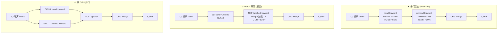

# review_draft

- 导出时间：2026-06-04 (Asia/Shanghai)
- 来源：当前 Claude Code session 可用对话上下文
- 保存路径：human_notes/review_draft.md
- 范围：仅用户输入与 Claude 最终输出

## 对话记录

### 001 User
教我

> 用户 IDE 选中了 `draft/review_draft.md` 第 21 行：
> | DiT调度 | CFG Batch 双流调度? | Conditional + Unconditional latent合并batch=2单次forward pass；GEMM M维度翻倍→Tensor Core利用率~50%→~80%+；HBM weight loading减半（仅加载一次）；对比串行双流（2×延迟）和双GPU并行CFG | Batch双流在单GPU最优——减少HBM weight loading次数+提高GEMM效率 | Q2.1, vault: knowledge_notes/MMDiT (262.0, 笔记推断) |

### 002 Claude
# CFG Batch 双流调度 — 详解

## 1. 背景：什么是 CFG？

**CFG (Classifier-Free Guidance)** 是扩散模型（DiT/Stable Diffusion/Flux 等）推理时的核心机制：

- 每次去噪步骤中，模型需要做**两次 forward pass**：一次带文本条件（conditional，如 "a cat on a table"），一次不带条件（unconditional，空文本嵌入）
- 最终噪声预测由两者线性组合：  

$$\epsilon_{\text{final}} = \epsilon_{\text{uncond}} + w \cdot (\epsilon_{\text{cond}} - \epsilon_{\text{uncond}})$$

其中 $w$ 是 guidance scale（典型值 7.5），控制生成图像与文本条件的匹配程度。

## 2. 三种 CFG 调度策略

### 策略 A：串行双流（Baseline — 大多数开源实现）

```
时间线:
 T0: conditional forward  ──────┐
 T1: unconditional forward ──────┤
 T2: CFG Merge                   │
                                  │
 总延迟 = 2 × per-step latency  ←┘
```

**问题**：
- 两次 forward 串行执行，延迟翻倍
- 每次单 batch（latent shape = [1, H, W, C]），GEMM 的 M 维度小，**Tensor Core 利用率仅 ~50%**
- 模型权重需要从 HBM 加载**两次**（cond 一次、uncond 一次）

### 策略 B：Batch 双流（最优方案 ✅）

```
时间线:
 T0: batched forward [cond, uncond]  ──┐
      z_batch = cat([z_cond, z_uncond]) │  batch_size=2 一次 forward
 T1: CFG Merge                          │
                                         │
 总延迟 ≈ 1 × per-step latency  ←───────┘
```

**核心思想**：将 conditional 和 unconditional 的 latent 在 batch 维拼接为 `[2, H, W, C]`，单次 forward pass 完成。

**三个关键收益**：

| 优化维度 | 机理 | 效果 |
|----------|------|------|
| **GEMM M 维度翻倍** | `M` 从 `H×W` → `2×H×W`，Tensor Core 对 `M` 维度敏感 | 利用率 ~50% → ~80%+ |
| **Weight loading 减半** | 模型权重从 HBM 只加载一次（非两次） | HBM 带宽压力 ~50%↓ |
| **Kernel launch 减半** | 一次 forward pass 的 kernel 序列（attention + FFN），非两次 | 减少 ~5-10μs/kernel 的 launch overhead |

**为什么 M 维度翻倍能提升 Tensor Core 利用率？**

NVIDIA Tensor Core 以 warp-level MMA（Matrix Multiply-Accumulate）指令执行 `D = A×B + C`，其中 M 维度决定了一个 warp 需要处理的输出行数。当 M 很小时（如 M=256 的单 latent），每个 SM 上的 thread blocks 较少，无法充分填充 Tensor Core 流水线。翻倍 M → 翻倍每个 GEMM 的计算量 per weight load → 硬件利用率从 memory-bound 转向 compute-bound。

### 策略 C：双 GPU 并行 CFG

```
 GPU_0: conditional forward   ─┐
 GPU_1: unconditional forward ─┤  并行执行
 GPU_0: CFG Merge (NCCL 接收) ─┘
```

- 延迟 ≈ 1× per-step + merge overhead
- **代价**：需要两份模型权重副本（或需 TP/EP 并行），GPU 间需 NCCL 通信传回结果
- 仅在多 GPU 可用时可行，且引入了跨 GPU 同步开销

## 3. 为什么 Batch 双流在单 GPU 上最优？

| | 串行双流 | Batch 双流 | 双 GPU 并行 |
|---|---|---|---|
| 延迟 | 2× baseline | **~1× baseline** | ~1× + NCCL overhead |
| HBM weight 加载次数 | 2× | **1×** | 1× (per GPU) |
| Tensor Core 利用率 | ~50% | **~80%+** | ~50% (per GPU) |
| 显存需求 | 1× 模型权重 | 1× 模型权重 | **2× 模型权重** |
| 跨 GPU 通信 | 无 | 无 | 每次 step 需 NCCL |

结论：Batch 双流在不增加显存需求、不引入跨 GPU 通信的前提下，同时获得了 **weight loading 减半**和 **GEMM 效率提升**两个收益，是单 GPU 场景的最优解。

## 4. Mermaid 流程图



## 5. 更深入的硬件视角

**为什么 weight loading 是瓶颈？**

DiT 模型（如 SD3、Flux）有 2B-12B 参数。每个 denoising step 的 forward pass 需要将全部权重从 HBM 读到 SMEM/Register：

$$\text{Weight data per step} = N_{\text{layers}} \times (W_{QKV} + W_O + W_{\text{FFN}}) \approx 2\times\text{模型参数量 (FP16)}$$

以 Flux-dev (12B) 为例，单 step 需读取 ~24GB 权重。HBM 带宽 ~3.35 TB/s (H100)，所以纯 weight loading 时间 ~7.2ms per step。50 steps 仅 weight loading 就 ~360ms。**Batch 双流把 weight loading 从 2× 降为 1×，直接节省 ~360ms**。

**与 LLM decode 的对比**：

- LLM decode：memory-bound，瓶颈是逐 token 加载 KV Cache + 权重
- DiT forward：compute-bound（全量 latent 的 attention/FFN 打满 SM），但 **weight loading 仍然是不可忽略的 HBM 带宽开销**

**与 MoE 的对比**：

- MoE decode：HBM 带宽瓶颈更严重（expert weights 反复加载，占 42% decode time）
- DiT：所有层都要完整执行（无 expert sparsity），所以减少 weight loading 次数的收益更加确定

## 6. 总结

CFG Batch 双流调度是一个"简单但有效"的优化——它不改变模型结构、不引入额外硬件、只是将两次串行 forward 合并为一次 batched forward。收益来自 GPU 硬件的基本特性：**Tensor Core 的 M 维度敏感**和 **HBM 带宽是共享稀缺资源**。这个思路也适用于其他需要双流 forward 的场景（如 diffusion model 的 negative prompt 推理、self-conditioning 等）。

---

## 对话记录补充：2026-06-04 11:00 Asia/Shanghai

### 003 User
教我

> 用户 IDE 选中了 `draft/review_draft.md` 第 34 行：
> | Video调度 | 长视频分块与上下文窗口滑动? | Sliding Window: W=64 frames, S=32 frames每chunk做spatial-temporal encoding + attention KV cache保留最近K chunks；Hierarchical Chunk: L1 short-term (8f)→L2 medium-term (8 chunks, 64f)→L3 long-term (相似度搜索选择关键segments)；Context Window Sliding: LLM 128K token窗口→注意力分驱逐+attention sink保留 | 分层时间表示降低KV cache膨胀；粗粒度segment搜索+细粒度frame分析 | Q2.1, vault: knowledge_notes/Online Video-LLM (192.5, 笔记推断) |

### 004 Claude
# 长视频分块与上下文窗口滑动 — 完整讲解

## 为什么需要这个技术？

在线 Video-LLM 面临一个根本矛盾：**视频帧无限到达，但 GPU 显存和 LLM 上下文窗口是有限的**。每帧进入 LLM 都会产生 KV Cache（每帧 × 每层 × hidden_dim × 2），10 FPS 下几分钟就会耗尽 80GB HBM。同时，LLM 的上下文窗口（如 128K tokens）也有限——一个 30 分钟视频可能有数万帧，远超窗口容量。

这个技术要回答两个问题：
1. **怎么存？** — 如何在有限的显存和上下文窗口中保存长视频的有效信息？
2. **怎么查？** — 用户提问时，如何从长视频中高效定位相关片段？

## 子技术一：Sliding Window（滑动窗口）

这是最基础的时空分块策略，参数为 **W=64 frames, S=32 frames**（窗口大小 64 帧，步长 32 帧，50% 重叠）：

```
时间轴: [====Chunk 1 (64f)====]
                  [====Chunk 2 (64f)====]
                            [====Chunk 3 (64f)====]
        |------32f-------|------32f-------|------32f-------|
```

**处理流程：**
```
for each chunk C_i (64 frames, stride 32):
    # 1. 时空编码
    for each frame f in C_i:
        v_f = VisionTower(f)        # InternViT, 每帧→16 tokens
    V_chunk = concat([v_1, ..., v_64])  # 64×16 = 1024 visual tokens

    # 2. Attention 计算（保留前 K 个最近 chunk 的 KV Cache）
    attn_out = Attention(
        Q = V_chunk,
        K = [K_{i-K}, ..., K_{i-1}, K_i],   # 最近 K 个 chunks
        V = [V_{i-K}, ..., V_{i-1}, V_i]
    )

    # 3. 更新 KV Cache 池
    KV_pool.push(K_i, V_i)
    if len(KV_pool) > K:
        KV_pool.evict_oldest()       # 驱逐最老的 chunk
```

**关键设计点：**
- **W=64, S=32**：50% 重叠确保 chunk 边界处的跨帧语义不丢失
- **保留最近 K 个 chunk**：K 的大小取决于 GPU 显存预算；早期 chunk 被驱逐，丧失对视频开头内容的回忆能力
- **每 chunk 独立编码**：避免了逐帧 iterative prefill 的 O(N²T) KV Cache 膨胀

## 子技术二：Hierarchical Chunk（分层分块）

这是对 Sliding Window 的升级——不同时间尺度使用不同的表示粒度，形成三层金字塔：

```
L3 Long-term:  [======== Key Segment A ========] ... [======== Key Segment Z ========]
                ↑ 相似度搜索选出关键 segment        ↑ （粗粒度，仅保留代表性帧）

L2 Medium-term: [Chunk1][Chunk2][Chunk3][Chunk4][Chunk5][Chunk6][Chunk7][Chunk8]
                 ↑ 每 chunk 64f，8 chunks = 512f    ↑ （中粒度，chunk 级表示）

L1 Short-term:  [f1][f2][f3][f4][f5][f6][f7][f8]
                 ↑ 8 帧，最细粒度                   ↑ （细粒度，逐帧表示）
```

**三层各自的作用：**

| 层级 | 粒度 | 覆盖范围 | 作用 |
|------|------|---------|------|
| L1 Short-term | 8 帧（逐帧） | 最近几秒 | 捕获瞬时动作、快速变化 |
| L2 Medium-term | 8 chunks × 64f | 最近几十秒-几分钟 | 覆盖中等时长的语义单元（场景、对话段落） |
| L3 Long-term | 相似度搜索选择的关键 segment | 整个视频（可能几十分钟） | 保留远距离的历史关键事件，支持"视频开头发生了什么"类问题 |

**L3 长程检索的核心机制：**
```
# 构建 L3 long-term 表示
video_segments = []  # 存储所有历史 segment 的特征

for each medium_chunk in L2:
    # 使用 chunk 的 pooled feature 作为索引 key
    segment_key = mean_pool(chunk_KV)         # d-dim vector
    video_segments.append(segment_key, chunk_ref)

# 用户提问时
query_embed = encode(question)
# 相似度搜索找到最相关的 na 个 segment
relevant = topk(cosine_sim(query_embed, video_segments), na)
# 仅将这些 segment 的细粒度帧送入 LLM
answer = LLM.decode(question, relevant.frames)
```

这就是表格核心机制所说的 **"粗粒度 segment 搜索 + 细粒度 frame 分析"**：L3 用粗粒度 embedding 做高效检索定位关键 segment，找到后再将该 segment 内的 L1 细粒度帧送入 LLM 分析。

## 子技术三：Context Window Sliding（上下文窗口滑动）

这处理 LLM 的 128K token 窗口管理问题。即使分块压缩后，视觉 token 仍可能超出窗口上限，需要决定**哪些 KV Cache 保留、哪些驱逐**：

```
LLM Context Window (128K tokens)
┌─────────────────────────────────────────────────────────┐
│ Attention Sink │  Recent K chunks  │  Recall Segment  │  New Tokens │
│   (4 tokens)   │  (KV Cache保留)   │  (从L3召回的片段) │  (当前输入) │
└─────────────────────────────────────────────────────────┘
       ↑                    ↑                  ↑               ↑
   永久保留           按注意力分驱逐     检索召回          当前推理
```

**两种驱逐策略：**

1. **Attention Score-Based Eviction（注意力分驱逐）**：
   ```
   # 计算每个历史 token 的重要性
   for each past_token in KV_cache:
       score = mean(attention_weights[:, past_token])  # 所有 head 的平均注意力
   # 驱逐分数最低的 tokens
   evict_mask = bottomk(scores, budget=window_capacity - current_tokens)
   KV_cache = KV_cache[~evict_mask]
   ```

2. **Attention Sink 保留**：
   - 大语言模型的前几个 token（通常 4 个）天然获得极高的注意力分数
   - 这些 "sink tokens" 像注意力"泄洪区"一样吸收多余的注意力质量
   - 即使不包含语义信息，驱逐它们会严重损害模型性能
   - 策略：**始终保留前 4 个 sink tokens，不参与驱逐**

## 三种技术的协同关系

```
原始视频流（无限帧）
        │
        ▼
┌──────────────────────────────────────┐
│  Sliding Window (W=64, S=32)        │  ← 时间轴上均匀切分，控制单步计算量
│  每 chunk 做 spatial-temporal 编码   │
└──────────────┬───────────────────────┘
               │
               ▼
┌──────────────────────────────────────┐
│  Hierarchical Chunk                  │  ← 不同时间尺度分层表示
│  L1 (8f 细粒度) → L2 (8×64f 中粒度)  │
│  → L3 (相似度搜索选关键 segment)      │
└──────────────┬───────────────────────┘
               │
               ▼
┌──────────────────────────────────────┐
│  Context Window Sliding (128K)       │  ← LLM 上下文窗口管理
│  Attention分驱逐 + Sink保留           │
│  + L3 召回的 segment 注入             │
└──────────────┬───────────────────────┘
               │
               ▼
         LLM Decode → 答案
```

**核心思想总结**：
- **分层时间表示降低 KV cache 膨胀** — 不是所有帧都保留逐帧 KV Cache；L1 细粒度仅保留最近帧，L2 保留 chunk 级压缩表示，L3 仅保留关键 segment 的索引
- **粗粒度 segment 搜索 + 细粒度 frame 分析** — 先在大范围内用低维 embedding 快速定位相关 segment（省计算），再对定位到的 segment 做细粒度逐帧分析（保精度）

这是一个典型的 **"存算换精度"** 设计：通过分层、分块、滑动窗口三种机制的组合，将 O(N²T) 的 KV Cache 增长和 O(T²) 的注意力计算降低到可控的 O(W² + K·log T)，同时保持对长视频全局内容的回忆能力。


---

## 对话记录补充：2026-06-04 12:00 Asia/Shanghai

### 005 User
教我

> 用户 IDE 选中了 `draft/review_draft.md` 第 33 行：
> | Video调度 | LiveStar SVeD Streaming 逐帧因果? | Vision Encoding (InternViT, 16 tokens/frame)→Streaming SVeD Loop: Cache Lookup (Inter-dialogue Streaming Cache)→Verification Forward Pass (PPL计算)→Gate Decision (PPL>α×PPL_ref→Response Mode生成新描述；else Silence Mode维持状态)；Peak-End压缩（保留高PPL峰值+最新帧） | PPL-gated响应-沉默决策；Strict因果约束（不可预看未来帧）；双级KV Cache (Intra-dialogue + Inter-dialogue) | Q2.1, vault: knowledge_notes/Online Video-LLM (192.5), Streaming KV Cache (556.9) |

### 006 Claude
# 逐行拆解：LiveStar / SVeD 的 Video 调度机制

你选中的这行位于 review draft 的「Video调度」行，描述的是 **LiveStar（CVPR 2025）** 在在线流式视频理解中的完整推理 pipeline。下面逐模块拆解：

---

## 1. 背景：Online Video-LLM 的核心问题

传统 Video-LLM 是 **离线（offline）** 的：输入完整视频 → 一次性生成答案。而 **Online Video-LLM** 必须：
- **始终在线**，逐帧接收视频流
- **自主决策** 何时输出、何时沉默（用户不会每帧提问）
- **严格因果**：不能预看未来帧
- **管理内存**：10+ 分钟视频产生的 KV Cache 会 OOM

LiveStar 用 **SVeD（Streaming Verification Decoding）** 框架解决了这些挑战。

---

## 2. Pipeline 逐阶段详解

你选中行描述的流水线是：

```
Vision Encoding → Streaming SVeD Loop → Cache Lookup → Verification Forward Pass → Gate Decision → Peak-End 压缩
```

### 阶段 ①：Vision Encoding（InternViT，16 tokens/frame）

每一帧到达后，用 **InternViT**（视频专用的 ViT 编码器）将其编码为 **仅 16 个 visual tokens**（而非 CLIP ViT 的 257 tokens），这是为了在保证语义表达的前提下最小化每帧的计算和显存开销。

### 阶段 ②：Cache Lookup（Inter-dialogue Streaming Cache）

在计算新帧之前，先从 **Inter-dialogue KV Cache**（对话间缓存）加载历史帧的 Key/Value 投影。这意味着：
- **不需要重算** 之前所有帧的 K/V
- 新帧的 attention 可以直接 concat 到历史 K/V 上
- 这是实现 1.53× 加速的关键

### 阶段 ③：Verification Forward Pass（PPL 计算）

这是 LiveStar 最核心的创新。**不需要完整 decode**，只需要 **一次 forward pass**（约 1ms）来计算当前字幕 [Dec] 在新帧上下文下的 perplexity：

$$\text{PPL}^{t_j}([Dec]) = \sqrt[N]{\frac{1}{P([Dec] \mid Ctx^{\leq t_j}, Frm^{t_j})}}$$

数学含义：给定到目前为止的所有上下文和最新一帧，当前描述字幕中每个 token 的"平均惊讶程度"。PPL 越低 → 新帧与当前字幕语义匹配；PPL 越高 → 新帧出现了字幕无法解释的新内容。

### 阶段 ④：Gate Decision（PPL > α × PPL_ref → Response，else Silence）

```python
if PPL_new > α × PPL_reference:   # α 默认 1.03
    → Response Mode: 激活完整解码，生成新字幕
else:
    → Silence Mode: 保持当前字幕，不触发解码
```

**核心思想**：把"响应 vs 沉默"的离散决策问题，转化为连续的 **perplexity 变化检测**问题。

- `PPL_reference`：上一次成功解码时记录的参考 PPL（存于 `PPL_cache`）
- `α = 1.03`：在 OmniStar 数据集上调优的阈值，α 越大越敏感（更多解码），α 越小越保守（更多沉默）
- 在 180 帧、仅 5 个语义变化段的典型场景中，只需 **5 次完整 decoding + 180 次轻量 verification**，比 EOS-based 方法（180 次完整 decoding）减少约 **97% 的 decoding 开销**

### 阶段 ⑤：Peak-End 压缩

当视频超过 10 分钟，KV Cache 膨胀到 GPU 显存放不下时触发。策略：
- **Peak**：保留 PPL 峰值对应的帧（语义突变点，信息量大）
- **End**：保留最新帧（最近因效应，对当前理解最重要）
- 丢弃中间的低信息量帧（PPL 平稳期），将 cache 压缩到可控大小

---

## 3. 三大关键设计总结

| 设计 | 含义 | 为什么重要 |
|------|------|-----------|
| **PPL-gated 响应-沉默决策** | 用 perplexity 变化率替代 EOS 预测来判断是否需要输出 | 避免了 EOS token 词表污染 + 每帧完整解码的巨额开销 |
| **Strict 因果约束** | 模型在时刻 t 只能看到 ≤t 的帧，不可预看未来 | 这是 Online 场景的硬约束，违反即信息泄露 |
| **双级 KV Cache** | Intra-dialogue（一个语义片段内的帧级缓存）+ Inter-dialogue（跨语义片段的流式缓存） | Intra 避免片段内重算，Inter 避免跨片段重算，合计 1.53× 加速 |

---

## 4. 一图胜千言：SVeD 循环伪代码

```
Streaming SVeD Inference Loop:
  for each incoming frame F^{t_j}:
      1. Vision Encoding (InternViT) → 16 tokens
      
      2. Cache Lookup: 
         hist_KV = InterCache.load(0:t_j-1)  # 不重算历史
      
      3. Verification (单次 forward, ~1ms):
         PPL_new = model.forward(Ctx + F^{t_j})[Dec_positions]
      
      4. Gate Decision:
         if PPL_new > 1.03 × PPL_ref:
             caption = full_decode()      # ~500ms, 仅触发5次/180帧
             InterCache.append(caption.KV)
             PPL_ref = PPL_new
         else:
             swap_last_two_in_cache()     # 维持时序一致性
      
      5. Memory (每 W 帧):
         if cache_size > threshold:
             InterCache = peak_end_prune(InterCache, PPL_scores)
```

---

## 5. 与其他 Online Video-LLM 方案的对比

| 方法 | 决策机制 | 开销 | 缺陷 |
|------|---------|------|------|
| VideoLLM-online | EOS token 预测 | 每帧完整 decode | EOS 词表污染，开销大 |
| VideoLLM-MoD | MoD token selection | 每帧 forward | 无明确静默决策 |
| MMDuet | 分类头 | 额外训练 | 灵活性差 |
| **LiveStar (SVeD)** | **PPL-gated** | **仅 verification pass** | α 阈值需调优 |

---

如果你还想深入了解某个具体模块（比如 InternViT 的 16-token 压缩原理、Peak-End 的心理学依据、或者 SVeD 的训练策略），我可以继续展开。

---

## 对话记录补充：2026-06-04 13:30 Asia/Shanghai

### 007 User
教我

> 用户 IDE 选中了 `draft/review_draft.md` 第 57 行：
> | 混合优先级调度 | QoServe Hybrid Prioritization + Eager Relegation | EDF+SRPF插值优先级（α=8 ms/token最优，低负载α↓优化tail latency/高负载α↑优先短请求）；**三队列（Prefill→Decode→Relegated）**；Dynamic Chunking：增大chunk→更多prefill tokens与decode融合→HBM bandwidth利用率提升；仅prefill可抢占（不抢占decode/不递归） | Eager Relegation：仅5% relegation在极端过载下维持SLO；复杂度O(log N_new)仅priority queue操作 | Q2.4, vault: QoServe Design (3756.4) |

### 008 Claude
# QoServe 混合优先级调度：完整讲解

用户选中的行位于 review draft 的 Dispatcher 设计分类中「混合优先级调度」，对标的是 **QoServe**（微软研究院，ASPLOS 2026 在投）的核心调度算法。

---

## 1. 问题背景：为什么需要混合优先级？

LLM 推理调度面临一个经典的两难选择：

| 调度策略 | 低负载表现 | 高负载表现 | 公平性 |
|----------|-----------|-----------|--------|
| **EDF** (Earliest Deadline First) | ✅ 违规率极低 | ❌ 过载后违规率飙升到近 100% | ✅ 公平 |
| **SRPF/SJF** (Shortest Remaining Time First) | ❌ 低负载时就"欺负"长请求 | ✅ 整体违规少 | ❌ 长请求被无限期饿死 |

**直觉**：
- EDF 只看 deadline，不管请求工作量。一旦过载，谁都完成不了，所有人一起死（cascading violations）。
- SRPF 优先做短的，整体完成率高，但长请求（长 prompt、长解码）永远排队——在真实场景里请求重要性不跟长度挂钩，这不公平也不合理。

**QoServe 的核心洞察**：生产环境的负载是波动的（有高峰期和低谷期）。所以需要一个**能根据负载动态在 EDF 和 SRPF 之间平滑过渡**的策略。

---

## 2. 混合优先级公式

对于交互式请求（interactive，关心 TTFT）：

$$P^{i} = t_{arrival}^{i} + SLO_{TTFT}^{i} + \alpha \cdot Prefill_{rem}^{i}$$

对于非交互式请求（non-interactive，关心 TTLT）：

$$P^{i} = t_{arrival}^{i} + SLO_{TTLT}^{i} + \alpha \cdot (Prefill_{rem}^{i} + Decode_{rem}^{i})$$

其中：
- $t_{arrival}$ + $SLO$ 部分 → **EDF 语义**（越早到 deadline 的优先级越高）
- $\alpha \cdot RemainingWork$ 部分 → **SRPF 语义**（剩余工作量越小的越优先）
- $\alpha$ 是插值系数（单位 ms/token），控制两种策略的权重

**$\alpha$ 的调节规律**：

```
低负载 → α↓（如 1 ms/token）→ EDF 主导 → 公平优先，优化 tail latency
高负载 → α↑（如 8 ms/token）→ SRPF 主导 → 优先短请求，整体完成率最大化
```

QoServe 通过离线 sweep（α = 0~10）发现 **α = 8 ms/token 在固定 QPS 场景最优**；而在变 QPS 场景，低负载自动降到 α=1 来优化尾部延迟。

---

## 3. 三队列架构与 Eager Relegation

```
请求进入 → [Prefill 队列]  →(prefill完成)→ [Decode 队列]  →(done)
                ↓ 违反TTFT/TTLT 或即将违反
             [Relegated 队列] —— 仅在系统空闲时机会主义服务
```

**Eager Relegation（主动降级）的核心逻辑**：

- 高负载下，任何调度策略都不可能让 100% 请求满足 SLO。
- 与其让级联违规（一个请求超时堵住后续所有），不如**主动牺牲 5% 注定要超时的请求**，保 95% 的请求满足 SLO。
- 判断标准：请求的 TTFT/TTLT 已经违反，或**当前迭代即将违反**。
- 多租户场景还支持基于 application hint（免费用户 vs 付费用户）的优先降级。
- 被降级的请求不会被抛弃——系统空闲时会被**机会主义地服务**，保证最终完成。

**关键结果**：仅退让 5% 的请求，即可在极端过载下维持 SLO（论文图 5 所示）。

---

## 4. Selective Preemption（选择性抢占）

抢占能力避免了一个长请求堵住短交互请求（head-of-line blocking），但 QoServe 的选择性体现在：

1. **仅 prefill 可被抢占** — decode 不抢占（因为 TBT 目标严格，10ms 级，抢占导致的 KV-cache 换入换出代价太高）
2. **不递归抢占** — 正在被抢占的请求不会被另一请求再次抢占
3. 抢占请求的 KV-cache 保持在 GPU 中的时间最短 → 最小化内存压力

---

## 5. Dynamic Chunking 配合调度

混合优先级决定了**选哪个 prefill 请求**，而 Dynamic Chunking 决定了**这个 prefill 拿多少 token**：

- 更大的 chunk → 更多 prefill token 跟 decode 融合 → HBM bandwidth 利用率提升（decode 是 memory-bound，prefill 可填满空闲带宽）
- 但不能无限大——要受 decode 队列中所有请求的 TBT slack 约束
- QoServe 用轻量 Random Forest 预测器（CPU 上运行，误差 <10%）动态估算最优 chunk size

```
chunk_size = f(num_decodes, decode_context_lengths, min_decode_slack)
```

当 decode 请求积累了 slack（生成比预期快），chunk 自动增大，吞吐量提升 ~20%。

---

## 6. 调度复杂度

整个调度过程仅需 **$O(\log N_{new})$**（优先队列 push/pop），不做全局优化。对比同期的 SLOs-Serve 需要 $O(N \cdot N_{new} \cdot M)$ 的动态规划，QoServe 的可扩展性显著更好。

---

## 7. 与同类方法的对比

| 维度 | MuxWise SLO-Aware Dispatcher | QoServe Hybrid Prioritization |
|------|--------------------------|------------------------------|
| 策略层面 | 硬件级 SM 分区 + decode 优先 | 软件调度层优先级 + chunk 自适应 |
| 公平性 | Decode 优先，prefill 填空 | EDF+SRPF 插值，兼顾 deadline 和公平 |
| 过载应对 | Prefill Preemption | Eager Relegation（主动降级） |
| 复杂度 | 依赖 CUDA 12.4 GreenContext | O(log N) 纯优先队列，无硬件依赖 |

---

## 8. 一句话总结

> **QoServe 用 $\alpha$ 一个参数实现了 EDF（公平截止时间）和 SRPF（短作业优先）的平滑插值**——低负载时倾向 EDF 保证公平和尾部延迟，高负载时倾向 SRPF 最大化整体完成率；同时用 Eager Relegation 主动牺牲 ~5% 注定超时的请求，避免级联雪崩，复杂度仅 O(log N)。

---

## 对话记录补充：2026-06-04 14:00 Asia/Shanghai

### 009 User
教我

> 用户 IDE 选中了 `draft/review_draft.md` 第 101 行：
> | **IR设计** | XLA HLO all-to-all + GSPMD | HLO: `all-to-all` (**NCCL alltoall映射**)→`fusion` (multi-output: gate_proj+up_proj共享输入→单kernel)→逆`all-to-all` combine。HLO→LHLO (buffer assignment)→LMHLO (MLIR HLO dialect)→gpu.launch (Thunk-based runtime)。GSPMD: device mesh=[8,64], sharding hint→约束传播(O(N))→自动插入Reshard collective→SPMD program生成 | IR中并发表达：`all-to-all`为op一等公民，GSPMD自动插入sharding+collective，async all-to-all (实验性flag) | Q3.1, Q3.4 (XLA/GSPMD) |

### 010 Claude
# XLA HLO + GSPMD IR 设计详解

这一行信息密度很高，逐层拆解。

---

## 一、整体背景：这条 IR 链路在 MoE 中做什么？

在 MoE（Mixture of Experts）模型中，一个 token 经过 Router/Gate 决定发给哪几个 expert，然后需要：
1. **Dispatch（分发）**：把 token 从当前 GPU 发送到持有对应 expert 的 GPU → 通过 **All-to-All** 通信实现
2. **Expert Compute（专家计算）**：每个 GPU 在本地对收到的 tokens 执行 expert FFN
3. **Combine（合并）**：把计算结果通过**逆 All-to-All** 发回原来的 GPU

XLA HLO 负责用 IR（中间表示）来表达这整条链路，而 GSPMD 负责自动决定每个张量在 512 个设备（8×64 mesh）上如何切分。

---

## 二、逐段拆解

### 第 1 步：HLO 层的 All-to-All 表达

```
HLO: all-to-all (NCCL alltoall映射) → fusion (multi-output: gate_proj+up_proj共享输入→单kernel) → 逆all-to-all combine
```

**什么是 HLO？**
HLO（High-Level Optimizer）是 XLA 编译器的核心 IR，是一组针对线性代数计算设计的图级操作（算子粒度 ~100+ 个 op）。HLO 比 MLIR 的 StableHLO 更早诞生，StableHLO 是后来从 HLO 演化出来的、在 MLIR 生态中标准化的版本。

**关键设计：All-to-All 是 HLO IR 的一等公民**

在 HLO 中，`all-to-all` 不是被降级为底层 send/recv 的组合，而是作为一个 **high-level op** 存在。这意味着：

- ✅ 编译器**知道**这是 all-to-all 语义 → 可以做融合优化（比如把 all-to-all 和后续的 GEMM 在 tile 粒度重叠）
- ✅ **NCCL alltoall 映射**：HLO 的 `all-to-all` op 在 GPU backend 上直接映射到 NCCL 的 `alltoall` 集合通信原语（而不是退化为 p2p send/recv）
- ✅ 方便 GSPMD 在 sharding propagation 时识别并插入 reshard collective

**算子融合：Fusion 阶段**

```
all-to-all → fusion (multi-output) → 逆all-to-all
```

中间的 `fusion` 做了什么？在 MoE expert FFN 中：

```
输入 x → gate_proj(x) → SiLU(gate) * up_proj(x) → down_proj(result)
```

XLA 的 **Multi-Output Fusion** 将 `gate_proj` 和 `up_proj` 融合为一个 kernel，因为：
- 两个投影**共享同一输入 x**（读取 HBM 的次数减半）
- 融合后中间结果留在寄存器/SMEM，不需要写回 HBM
- 最终输出是 **两个张量**（gate 和 up），这正是 "multi-output" 的含义

然后 `SiLU(gate) * up` 可以和 `down_proj` 做垂直融合（element-wise + GEMM）。

**逆 All-to-All**：Expert 计算完后，token 结果需要发送回原 GPU，这是第二次 All-to-All（通信模式对称但方向相反）。

### 第 2 步：IR Lowering 链路

```
HLO → LHLO (buffer assignment) → LMHLO (MLIR HLO dialect) → gpu.launch (Thunk-based runtime)
```

这是 XLA 从**图级 IR 到可执行代码**的 lowering 过程：

```
HLO (High-Level Optimizer)
 │  纯计算语义：描述"做什么"，不涉及内存/设备
 │  例：all-to-all(input, split_dim=0), fusion(gate_proj, up_proj)
 │
 ▼
LHLO (Late HLO / Buffer-Assigned HLO)
 │  插入 buffer assignment：每个 op 的输入/输出绑定到具体内存 buffer
 │  这是从"值语义"到"内存语义"的关键转换
 │  例：all-to-all 的输出 buffer 已经分配好 GPU 显存地址
 │
 ▼
LMHLO (Late MLIR HLO / MLIR HLO dialect)
 │  将 LHLO 映射到 MLIR 的 HLO dialect → 接入 MLIR 生态系统
 │  此时可以用 MLIR 的其他 dialect 做进一步优化
 │  （如 scf.forall + async.execute 的表达）
 │
 ▼
gpu.launch (Thunk-based Runtime)
 │  生成 GPU kernel launch 指令
 │  Thunk：XLA 的运行时抽象，一个 Thunk = 一个可执行的 GPU 操作
 │  （kernel launch / NCCL collective / memcpy 等）
 │  Thunk 按序执行，但有 async Thunk 支持 overlapping
```

**为什么需要 LHLO？** HLO 是纯函数式的（值语义），但 GPU 执行需要知道每个张量在显存中的确切位置。LHLO 完成了从 "值" 到 "buffer" 的映射，这是编译器中经典的**寄存器/内存分配**问题在 IR 层面的体现。

### 第 3 步：GSPMD 自动并行化

```
GSPMD: device mesh=[8,64], sharding hint → 约束传播(O(N)) → 自动插入Reshard collective → SPMD program生成
```

这是整个系统最精彩的部分。逐步解释：

#### 3.1 Device Mesh = [8, 64]

512 个设备被组织为 8×64 的逻辑二维网格：

```
        64 devices (expert/model 维度)
  ┌───────────────────────────────────┐
  │ GPU₀,₀  GPU₀,₁  ...  GPU₀,₆₃    │  ← 8 rows (data/batch 维度)
  │ GPU₁,₀  GPU₁,₁  ...  GPU₁,₆₃    │
  │  ...      ...    ...    ...      │
  │ GPU₇,₀  GPU₇,₁  ...  GPU₇,₆₃    │
  └───────────────────────────────────┘

  mesh[0] = 8  → data parallelism (batch 切分)
  mesh[1] = 64 → expert/model parallelism (expert 权重切分)
```

MoE 中每个 expert 的权重被分发到 mesh 的第二维（64 个设备），而 batch 维度沿第一维（8 个设备）做数据并行。

#### 3.2 Sharding Hint → 约束传播（O(N)）

用户**只需标注 <10 个关键张量**的 sharding 方式（<1% 的图中张量），GSPMD 编译器自动推导所有其他张量的 sharding：

```python
# 用户只需写：
mesh_split(expert_weight, device_mesh=[8,64], dims_mapping=[1, -1])
# 含义：expert_weight 的第0维沿 mesh 第1维切分（64个设备各持有不同expert）
#       第1维不切分（每个设备持有完整的 hidden_dim）
```

**约束传播算法**（O(N) 图节点数）：
```
1. 初始化：用户标注的 sharding hints → known set
2. 优先队列迭代（elementwise 优先, MatMul 次之）：
   - 前向传播：已知 input sharding → 根据 op 语义推导 output sharding
   - 反向传播：已知 output sharding → 推导 input sharding
3. 冲突消解：当 forward 和 backward 推导不一致时 → 插入 Reshard
```

举例：

```
已知：W[E, H] 沿 dim 0 (expert) 切分 → W_sharding = [1, -1]
      X[B, H] 沿 dim 0 (batch) 切分 → X_sharding = [0, -1]

推导 MatMul Y = X × W^T：
  GSPMD 发现 X 的 H 维不切分 + W 的 H 维不切分 → MatMul 可本地计算
  但 X 的 B 维沿 mesh[0]、W 的 E 维沿 mesh[1]
  → 需要插入 All-to-All：先沿 mesh[0] 做 all-to-all 交换 token
  → 再沿 mesh[1] 做 expert 计算
```

#### 3.3 自动插入 Reshard Collective

当张量的 sharding 在不同 op 之间不匹配时，GSPMD 自动插入 collective 操作：

| 不匹配情况 | 插入的 Collective |
|-----------|-------------------|
| 从复制 → 切分 | AllGather 或 All-to-All |
| 从切分方式 A → 切分方式 B | All-to-All (reshard) |
| 从切分 → 复制 | AllReduce 或 ReduceScatter |
| Expert dispatch | All-to-All（token → expert 设备） |

在 MoE 场景中，**All-to-All 是最高频的 Reshard collective**。

#### 3.4 SPMD Program 生成

SPMD = Single Program, Multiple Data。**所有 512 个设备运行同一个编译出的程序**，但因为各自持有不同的数据分片，实际执行效果不同。这是 XLA/GSPMD 的核心哲学：

```
同一个 HLO 图 ──GSPMD──▶ 512 个设备上运行相同的 XLA 编译程序
                         每个设备的程序 = 本地计算 + 必要的 collective
                         
对比 MPMD（Multiple Program Multiple Data）：
  不同设备运行不同程序 → 编程复杂、调试困难
```

### 第 4 步：核心机制解读

表格第三列 "核心机制" 提炼了三个要点：

#### 4.1 `all-to-all` 为 op 一等公民

在 HLO IR 中 all-to-all 不是被展开为底层 send/recv，而是保持其**语义完整性**。好处：
- 编译器可以做 **all-to-all + GEMM 融合**（如 MegaScale-MoE 的 tile 级通信-计算重叠）
- 编译器了解全局通信模式 → 可以做拓扑感知调度
- GSPMD 的 sharding propagation 可以识别 all-to-all 语义 → 自动决定是否需要插入

#### 4.2 GSPMD 自动插入 sharding + collective

用户完全不需要手写任何通信代码。标注几个 sharding hint 后：
- GSPMD 推导全图的张量如何分布
- 自动在需要的边界插入 AllReduce / AllGather / All-to-All
- 自动处理反向传播中的梯度同步

#### 4.3 Async All-to-All（实验性 flag）

`XLA_FLAGS=--xla_gpu_enable_latency_hiding_scheduler=true` 时，all-to-all 可以异步执行——通信与后续计算 overlap，不阻塞 CUDA stream。这是实验性功能，说明 XLA 团队正在将通信隐藏能力从手动优化（手写 CUDA stream 管理）转移到编译器自动完成。

---

## 三、端到端流程总结

```
┌─────────────────────────────────────────────────────────────────┐
│ GSPMD 编译时（offline）                                          │
│                                                                  │
│ 用户标注 ──▶ Sharding Propagation ──▶ 插入 All-to-All ──▶ SPMD │
│ (10 hints)    (O(N) 图节点)          (Reshard collective)  Program│
└─────────────────────────────────────────────────────────────────┘
                           ↓
┌─────────────────────────────────────────────────────────────────┐
│ XLA HLO IR（运行时图的表示）                                      │
│                                                                  │
│  all-to-all ──▶ fusion(gate_proj,up_proj) ──▶ SiLU*mul ──▶     │
│  (token dispatch)  (multi-output, 共享输入)   (element-wise)     │
│                                                                  │
│  down_proj ──▶ 逆all-to-all ──▶ output                          │
│  (GEMM)        (token combine)                                   │
└─────────────────────────────────────────────────────────────────┘
                           ↓
┌─────────────────────────────────────────────────────────────────┐
│ 编译 Lowering                                                     │
│                                                                  │
│  HLO ──▶ LHLO ──▶ LMHLO ──▶ gpu.launch (Thunk)                 │
│  (值语义) (buffer分配) (MLIR方言) (可执行Thunk序列)               │
└─────────────────────────────────────────────────────────────────┘
```

**核心哲学对比**：

| | XLA HLO + GSPMD | MLIR scf.forall + async.execute |
|---|---|---|
| 并行表达 | all-to-all 是 IR 一等公民 + GSPMD 自动插 collective | scf.forall 标注独立迭代 + async.execute 显式并发 |
| 适用场景 | 规则的数据并行 + expert 并行（TPU/GPU 大规模集群） | 不规则并行、灵活 device placement、通信 overlap |
| 优势 | 全自动 sharding 推导、SPMD 编程模型简单 | 细粒度控制、多 dialect 协作、更灵活的并发表达 |

---

## 对话记录补充：2026-06-04 15:00 Asia/Shanghai

### 011 User
教我

> 用户 IDE 选中了 `draft/review_draft.md` 第 125-126 行：
> | **Codegen** | GSPMD+XLA TPU Backend? | 6阶段编译：User Annotation (<10 key tensors sharding hint)→Sharding Completion Pass (优先队列约束传播, O(N)图节点, 冲突时插入Reshard/AllGather/AllToAll)→SPMD Program Generation (所有devices同程序, 不同数据分片)→XLA Fusion Pipeline (Instruction/Multi-Output Fusion+Layout Optim+Memory Planning+Async Op Scheduling)→GPU CUDA (Thunk IR) / TPU VLIW Codegen→Runtime execution。TPU ICI (Inter-Chip Interconnect) 支持collective-permute硬件加速+2D/3D torus拓扑优化 | SPMD partition+collective-permute异步overlap+VLIW bundle编排 (scalar+vector+matrix+dma同cycle并发)+scratchpad编译时静态分配 | Q3.6 (GSPMD 41.8) |

### 012 Claude
# GSPMD + XLA TPU Backend 详解

你选中了 review_draft.md 的第 125-126 行，这是关于 **GSPMD+XLA TPU Backend** 的编译框架综述。下面我从头到尾拆解这行里的每一个概念。

---

## 一、先理解两个主角：GSPMD 和 XLA 是什么？

### GSPMD（General and Scalable Parallelization for ML Computation Graphs）

GSPMD 是 Google 2021 年提出的**自动并行化编译器**。核心思想一句话：

> 用户写单设备程序，只标注不到 1% 的关键张量的分片策略（sharding hint），编译器自动推导全图所有张量应该如何切分到多个设备上，并自动插入必要的通信原语（AllReduce/AllGather/All-to-All 等），生成每个设备上跑的 **SPMD 程序**（所有设备执行同一份程序代码，但各自处理不同的数据分片）。

举个例子，在 MoE 模型中，用户只需要标注 expert 权重的 sharding：
```python
mesh_split(expert_weight, mesh, [0, -1])  # 沿 expert 维度切分权重
```
GSPMD 就会自动完成剩下所有事情——token dispatch 的 All-to-All 通信怎么插、梯度同步的 AllReduce 怎么放，都不需要你手动写。

### XLA（Accelerated Linear Algebra）

XLA 是 Google 的**张量编译器**，是 TensorFlow/JAX 的后端。它把高层 ML 算子（如 MatMul、Conv）编译成 TPU/GPU/CPU 上的可执行代码。XLA 做算子融合（fusion）、内存布局优化、异步调度等——它是 GSPMD 的下游"代码生成器"。

**两者关系**：GSPMD 决定"数据怎么分到多设备、什么通信在哪插入"，XLA 决定"每个设备上怎么高效执行那个子图"。

---

## 二、6 阶段编译管线逐段拆解

你的笔记把完整编译流程归纳为 6 个阶段，我用流水线图 + 解释的方式来讲：

```
User Annotation  →  Sharding Completion  →  SPMD Program Gen  →  XLA Fusion  →  Codegen  →  Runtime
    (阶段1)             (阶段2)                 (阶段3)            (阶段4)        (阶段5)      (阶段6)
```

### 阶段 1：User Annotation（用户标注）

用户只对 **不到 10 个关键张量** 给出 sharding hint。例如：

```python
# MoE 场景：沿 expert 维度 (dim 0) 切分权重
mesh_split(expert_weight, mesh, [0, -1])
# device_mesh 是 8×64 的逻辑设备网格
# [0, -1] 表示 dim 0 (expert维) 沿 mesh dim 0 切分，dim 1 (hidden维) 不切分（复制）
```

**为什么 <1% 足够？** 因为 ML 图具有强连通性——你标注了某个关键位置的 sharding，编译器可以通过 **约束传播** 推导出所有相邻张量的 sharding。

### 阶段 2：Sharding Completion Pass（分片补全——核心算法）

这是 GSPMD 最核心的编译 Pass。输入是稀疏的 sharding annotation，输出是全图每个张量的完整 sharding + 集体通信调度。

**算法细节**：使用**优先队列约束传播**：
- element-wise 算子（ReLU、LayerNorm）优先级最高——sharding 直接透传（input 怎么切，output 就怎么切）
- MatMul 次之——需要分析 contracting dimension 在哪条轴
- 整个过程 **O(N)**（N = 图节点数），每个算子只访问常数次

**冲突时的处理**：当一条路径推导出的 sharding 和另一条路径冲突时，插入 **Reshard** 操作，即插入集体通信：

| 通信原语 | 作用 |
|-----------|------|
| AllGather | 把切分在不同设备上的张量片段拼成完整张量 |
| AllToAll | 设备间按 token→expert 映射交换数据（MoE 分发/收集的核心） |
| ReduceScatter | 各设备归约后分散，每设备获得结果的一个分片 |
| CollectivePermute | TPU 特有的硬件加速置换通信（见阶段 6） |

### 阶段 3：SPMD Program Generation（SPMD 程序生成）

SPMD = **Single Program, Multiple Data**。

所有设备执行**完全相同的程序代码**，但每个设备的输入数据是整体的不同分片（不同的 shard）。这和 MPMD（Multiple Program Multiple Data，每个设备执行不同程序）不同。

这一阶段编译器做的事情：
- 根据阶段 2 的 complete sharding，把每个算子转化为 **设备本地计算**（去掉全局视角，只关心本地分片）
- 在需要跨设备数据的地方插入集体通信
- 生成的是一份可以在所有设备上直接执行的程序（每个设备按自己的 device_id 索引对应分片）

### 阶段 4：XLA Fusion Pipeline（算子融合 + 优化）

进入 XLA 的标准优化流水线：

1. **Instruction Fusion**：把多个小算子合并成一个 kernel（减少 kernel launch 开销和 HBM 读写）
2. **Multi-Output Fusion**：当一个中间结果被多个下游算子使用时，融合为一个多输出的 kernel
3. **Layout Optimization**：选择最节省 memory 带宽的张量内存布局（如 NHWC vs NCHW）
4. **Memory Planning**：通过 liveness analysis 复用 buffer
5. **Async Op Scheduling**：标记哪些操作可以异步发射并重叠执行

### 阶段 5：Codegen（目标代码生成——GPU vs TPU 差异）

这里分两条路径：

**GPU 路径 → CUDA Codegen**：
- XLA 生成 **Thunk IR**（一种延迟执行的中间表示）
- Thunk IR 再 lower 到 CUDA kernel + stream/event 管理
- 支持 CUDA stream 级并发

**TPU 路径 → VLIW Codegen**（这是更独特的部分）：
- TPU 使用 **VLIW（Very Long Instruction Word）** 指令架构
- 编译器在**编译时**就把每个 cycle 要并发的操作编排好
- 一个 VLIW bundle 可以在**同一时钟周期**内包含 4 种操作：

```
VLIW[t] = {
    scalar:  address_calc_for_next_tile,   // 标量：地址计算/控制流
    vector:  activation_fn(prev_output),    // VPU：向量 ALU 操作
    matrix:  matmul(tile_A, tile_B),        // MXU：128×128 systolic array 矩阵乘
    dma:     prefetch(next_tile)            // DMA：CMEM ↔ HBM 异步搬运
}
→ 这 4 种操作在同 1 个 cycle 内并发执行！
```

**这为什么厉害？** GPU 上你需要 CUDA stream、warp scheduler、memory 延迟隐藏等一系列硬件机制来实现并发（而且还做不到 100% 重叠）。TPU 在编译时就直接编排好了——运行时零调度开销。

### 阶段 6：Runtime Execution

运行时的特点：
- **TPU ICI（Inter-Chip Interconnect）**：TPU 芯片间互联，提供 **collective-permute** 硬件加速——这不是软件模拟的通信，是硬件直接支持的置换通信原语
- **2D/3D torus 拓扑优化**：TPU 芯片物理连接成环面（torus），编译器知道拓扑结构，可以优化通信路径让数据走最短路径
- **Scratchpad 编译时静态分配**：TPU 使用 scratchpad memory（CMEM）而非传统 cache——编译器在编译时通过 liveness analysis 完成所有内存分配。**运行时没有 cache miss**，延迟完全可预测

---

## 三、核心机制 —— 表格右边那列的深层解读

你笔记中的「核心机制」列写道：

> SPMD partition + collective-permute 异步 overlap + VLIW bundle 编排 (scalar+vector+matrix+dma 同 cycle 并发) + scratchpad 编译时静态分配

这 4 个要点对应的设计哲学是：

### 1. SPMD partition
所有设备同一份程序，不同数据分片。好处：代码逻辑一致、调试简单、天然适配 TPU 的 2D/3D torus 拓扑。

### 2. Collective-permute 异步 overlap
编译器插入异步通信（collective-permute），并调度计算与通信重叠：
```
T0: 发射 collective-permute (异步，不阻塞)
T1: 执行 Expert FFN on 已到达的 tokens (计算，与 T0 通信并行)
T2: 等待 collective-permute 完成 (同步 barrier)
```
这与 GPU 上手动管理 CUDA stream 实现 compute/comm overlap 是同一思想，但由编译器自动完成。

### 3. VLIW bundle 编排
这是 TPU 和 GPU 最大的区别。GPU 依赖**运行时硬件调度**（warp scheduler 在几百个 ready warp 中动态选择），TPU 依赖**编译时软件编排**（编译器精确到每 cycle 发射什么指令）。各有优劣：
- GPU：灵活，适应动态不规则计算，但调度有开销
- TPU：零运行时开销，延迟可预测，但要求编译器对 workload 有完整知识

### 4. Scratchpad 编译时静态分配
TPU 的内存层次是软件管理的 scratchpad，不是硬件管理的 cache。编译器通过 liveness analysis 决定每个 tensor 在 CMEM 中的地址和生命周期。好处：无 cache miss → 延迟确定性 100%，坏处：要求静态 shape（MoE 中需要 padding expert capacity）。

---

## 四、MoE 场景下的全局视角

最后，把 GSPMD+XLA 放在 MoE 推理/训练的具体场景中串一遍：

```
用户标注: mesh_split(W_expert, mesh, [0, -1])
          ↓
GSPMD Sharding Completion:
  - 推导出 token dispatch 需要 All-to-All（所有设备发 token 给对应 expert 所在设备）
  - 推导出 expert FFN 输出需要第二个 All-to-All（token 回到原设备）
  - 推导出 expert 梯度需要 ReduceScatter
          ↓
SPMD Program:
  - 每个 TPU chip 执行: AllToAll → ExpertFFN(local_expert) → AllToAll → 后续层
          ↓
XLA: 融合 expert FFN 的 gate+up GEMM + SiLU + down GEMM 为单 kernel
          ↓
TPU VLIW Codegen:
  - DMA prefetch expert 权重的下一个 tile
  - MXU 计算当前 tile 的矩阵乘法
  - VPU 对上一 tile 输出做 SiLU 激活
  - Scalar 单元计算下一 tile 地址
  → 四者同 cycle 并发
          ↓
Runtime: ICI 硬件加速 All-to-All（2D torus 拓扑最短路径路由）
```

这就是整行笔记要传达的完整图景：**从用户写几行 sharding hint，到编译器全自动生成高效的 TPU 多芯片 SPMD 程序，在编译时就把一切（数据分布、通信、内存、指令编排）确定下来，运行时零开销执行。**
