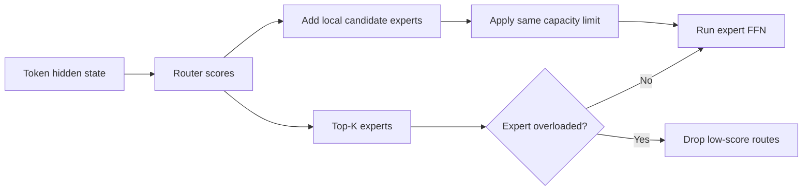

# Capacity-Aware Token Drop for MoE Inference 对话记录

- 导出时间：2026-06-03 17:24 CST
- 来源：当前 Codex session 可用对话上下文
- 保存路径：human_notes/Capacity-Aware Token Drop for MoE Inference 对话记录.md
- 范围：仅用户输入与 Codex 最终输出
- 说明：按技能要求，未保存系统/开发者/运行环境上下文、工具调用、中间状态更新或技能说明正文。

## 对话记录

### 001 User
# Context from my IDE setup:

## Active file: learning_outputs/20260529_185938__MoEDiT多模态Video__单GPUNPU加速器__多算子微算子并发__硬件体系结构/Q1.2_L1_answer.md

## Active selection of the file:
**笔记证据**: `paper_secs/secs_moe/Capacity-Aware Inference Mitigating the Straggler Effect in Mixture of Experts/CAPACITY-AWARE-INFERENCE-MITIGATING-THE-STRAGGLER-EFFECT-IN-MIXTURE-OF-EXPERTS.md` (score: 9475.4)

#### 是什么？

MoE 的 sparse gating 机制在 expert parallelism 下产生 **Straggler 效应**：token-to-expert 分配不均衡导致某些 expert 过载、其他 expert 空闲等待，过载 expert 的计算时间决定全局延迟。Capacity-Aware Token Drop 通过强制 expert capacity 上限，丢弃过载 expert 上的多余 token，从而均衡负载、消除 straggler。

#### 方法细节（算法伪代码）

```
# Capacity-Aware Token Drop for MoE Inference
# 输入: hidden_states ∈ R^{B×S×D}  (B=batch, S=seq_len, D=hidden_dim)
#       W_gate ∈ R^{D×E}           (E 个 expert 的 gating 权重)
#       capacity_factor C ∈ [1.0, 2.0]
#       num_experts E, top_k K

# Step 1: Gating 计算
router_logits = hidden_states @ W_gate          # [B, S, E]
router_probs  = softmax(router_logits, dim=-1)  # [B, S, E]
topk_weights, topk_indices = topk(router_probs, K, dim=-1)  # [B, S, K]

# Step 2: Expert capacity 计算
tokens_per_expert = capacity_factor * ceil(B*S / E)  # 每个 expert 的 token 上限

# Step 3: Capacity-Aware Token Drop (核心)
for expert_id in 0..E-1:
    # 收集分配给该 expert 的所有 tokens
    expert_mask = (topk_indices == expert_id)      # [B, S, K]
    expert_tokens = hidden_states[expert_mask]     # [N_e, D]

    if N_e > tokens_per_expert:
        # 按 router_probs 降序排序，仅保留 top-C 的 tokens
        sorted_idx = argsort(gate_score[expert_mask], descending=True)
        keep_idx = sorted_idx[:tokens_per_expert]
        drop_idx = sorted_idx[tokens_per_expert:]

        # 丢弃的 token 不参与 expert FFN 计算
        expert_tokens = expert_tokens[keep_idx]  # [C, D]

    # Step 4: Expert FFN 计算
    expert_output = expert_ffn[expert_id](expert_tokens)  # [C, D]

# Step 5: Expanded Drop (可选增强)
# 在 top-K 基础上扩展候选集为 top-(K+K')，增加 token 被至少一个 expert 接受的概率
# 然后再施加 capacity 约束
```

**注解**：
- **变量含义**：`capacity_factor` 控制每个 expert 可处理的最大 token 数，C=1.0 表示精确均分，C=2.0 表示允许 2× over-subscription。`tokens_per_expert` 是硬件友好的上限值。
- **复杂度分析**：原始 MoE 的 expert 计算复杂度为 O(B×S×K×D_ffn)，Capacity-Aware Token Drop 将最坏情况的 expert 计算从 O(max_e N_e × D_ffn) 限制到 O(C×B×S/E × D_ffn)，消除了尾部延迟。
- **数据依赖**：gating 决策必须先于 expert FFN 计算（串行瓶颈），但 expert 间完全独立可并行。
- **硬件适配性**：均衡后的 expert 负载使得 GPU SM 分配更均匀，减少 warp divergence。在 H100 上，30% 推理加速仅带来 0.9% 精度损失（笔记来源：OLMoE 实验）。
## Open tabs:
- Q1.2_L1_answer.md: learning_outputs/20260529_185938__MoEDiT多模态Video__单GPUNPU加速器__多算子微算子并发__硬件体系结构/Q1.2_L1_answer.md
- review_on_learning_outputs_20260529_185938.md: human_notes/review_on_learning_outputs_20260529_185938.md
- Q1.1_L1_answer.md: learning_outputs/20260529_185938__MoEDiT多模态Video__单GPUNPU加速器__多算子微算子并发__硬件体系结构/Q1.1_L1_answer.md
- SKILL.md: .claude/skills/obsidian-keyword-explain/SKILL.md
- SKILL.md: .codex/skills/obsidian-keyword-explainer/SKILL.md

## My request for Codex:
**笔记证据**: `paper_secs/secs_moe/Capacity-Aware Inference Mitigating the Straggler Effect in Mixture of Experts/CAPACITY-AWARE-INFERENCE-MITIGATING-THE-STRAGGLER-EFFECT-IN-MIXTURE-OF-EXPERTS.md` (score: 9475.4)

#### 是什么？

MoE 的 sparse gating 机制在 expert parallelism 下产生 **Straggler 效应**：token-to-expert 分配不均衡导致某些 expert 过载、其他 expert 空闲等待，过载 expert 的计算时间决定全局延迟。Capacity-Aware Token Drop 通过强制 expert capacity 上限，丢弃过载 expert 上的多余 token，从而均衡负载、消除 straggler。

#### 方法细节（算法伪代码）

```
# Capacity-Aware Token Drop for MoE Inference
# 输入: hidden_states ∈ R^{B×S×D}  (B=batch, S=seq_len, D=hidden_dim)
#       W_gate ∈ R^{D×E}           (E 个 expert 的 gating 权重)
#       capacity_factor C ∈ [1.0, 2.0]
#       num_experts E, top_k K

# Step 1: Gating 计算
router_logits = hidden_states @ W_gate          # [B, S, E]
router_probs  = softmax(router_logits, dim=-1)  # [B, S, E]
topk_weights, topk_indices = topk(router_probs, K, dim=-1)  # [B, S, K]

# Step 2: Expert capacity 计算
tokens_per_expert = capacity_factor * ceil(B*S / E)  # 每个 expert 的 token 上限

# Step 3: Capacity-Aware Token Drop (核心)
for expert_id in 0..E-1:
    # 收集分配给该 expert 的所有 tokens
    expert_mask = (topk_indices == expert_id)      # [B, S, K]
    expert_tokens = hidden_states[expert_mask]     # [N_e, D]

    if N_e > tokens_per_expert:
        # 按 router_probs 降序排序，仅保留 top-C 的 tokens
        sorted_idx = argsort(gate_score[expert_mask], descending=True)
        keep_idx = sorted_idx[:tokens_per_expert]
        drop_idx = sorted_idx[tokens_per_expert:]

        # 丢弃的 token 不参与 expert FFN 计算
        expert_tokens = expert_tokens[keep_idx]  # [C, D]

    # Step 4: Expert FFN 计算
    expert_output = expert_ffn[expert_id](expert_tokens)  # [C, D]

# Step 5: Expanded Drop (可选增强)
# 在 top-K 基础上扩展候选集为 top-(K+K')，增加 token 被至少一个 expert 接受的概率
# 然后再施加 capacity 约束
```

**注解**：
- **变量含义**：`capacity_factor` 控制每个 expert 可处理的最大 token 数，C=1.0 表示精确均分，C=2.0 表示允许 2× over-subscription。`tokens_per_expert` 是硬件友好的上限值。
- **复杂度分析**：原始 MoE 的 expert 计算复杂度为 O(B×S×K×D_ffn)，Capacity-Aware Token Drop 将最坏情况的 expert 计算从 O(max_e N_e × D_ffn) 限制到 O(C×B×S/E × D_ffn)，消除了尾部延迟。
- **数据依赖**：gating 决策必须先于 expert FFN 计算（串行瓶颈），但 expert 间完全独立可并行。
- **硬件适配性**：均衡后的 expert 负载使得 GPU SM 分配更均匀，减少 warp divergence。在 H100 上，30% 推理加速仅带来 0.9% 精度损失（笔记来源：OLMoE 实验）。教我

### 002 Codex Final
我用一句话先把它钉住：

**Capacity-Aware Token Drop = 给每个 expert 设“最多接多少 token”的上限；过载 expert 只保留 router 分数最高的 token-expert 路由边，把低分的丢掉，从而把 MoE 层延迟从“最忙 expert 决定”改成“capacity 上限决定”。**

**先纠正你笔记里两个小点**
1. capacity 公式应包含 `top_k`：  
   $$\bar N = \frac{B \times S \times K}{E}, \quad C = \gamma \bar N$$  
   不是简单的 `B*S/E`。因为每个 token 会路由到 `K` 个 expert，所以总 token-expert 分配数是 `B*S*K`。
2. Token Drop 丢的通常不是“整个 token”，而是某个 **token 到某个 expert 的路由边**。比如 token 原本去 expert 2 和 expert 7，expert 7 过载时可能只丢掉 `token -> expert 7` 这条边。

**为什么 MoE 会慢？**

MoE 的本意是：一个 FFN 不够大，那就放很多个 FFN expert，但每个 token 只激活少数几个 expert。

普通 dense FFN：

$$
y = FFN(x)
$$

MoE FFN：

$$
y = \sum_{i \in TopK(router(x))} G(x)_i \cdot E_i(x)
$$

问题在于 router 不一定平均分配。假设有 8 个 expert，有些 expert 只收到 100 个 token，有些收到 900 个 token。并行执行时，100 个 token 的 expert 很快算完，但它不能进入下一层，因为整个 MoE 层要等最慢的 expert。

所以 MoE 层延迟近似是：

$$
L \propto \max_i N_i
$$

Annotations：  
`N_i` 是第 `i` 个 expert 收到的 token 数。最忙 expert 就是 straggler。即使平均负载不高，只要一个 expert 特别热，整层就被拖慢。

**Token Drop 怎么做？**

修正后的核心伪代码更像这样：

```python
# x: [N, D], N = B * S
# scores: [N, E]
scores = softmax(gate(x), dim=-1)

topk_scores, topk_idx = topk(scores, K, dim=-1)
topk_mask = zeros_like(scores).scatter(dim=1, index=topk_idx, value=1)

masked_scores = scores * topk_mask

avg_load = N * K / E
cap = int(gamma * avg_load)

# 对每个 expert 的列，只保留分数最高的 cap 个 token
_, keep_idx = topk(masked_scores, cap, dim=0)
cap_mask = zeros_like(scores).scatter(dim=0, index=keep_idx, value=1)

final_map = topk_mask * cap_mask
final_scores = scores * final_map
```

Annotations：  
`topk_mask` 表示 router 原本选中的 token-expert 边。  
`cap` 是每个 expert 最多接多少条边。  
`topk(masked_scores, cap, dim=0)` 是按 expert 维度筛选，也就是每个 expert 自己保留最重要的 token。  
`final_map` 才是最后真正送进 expert FFN 的路由图。

**一个数字例子**

假设：

$$
B \times S = 1000,\quad K = 2,\quad E = 10
$$

那么总路由边数是：

$$
1000 \times 2 = 2000
$$

平均每个 expert 应该收到：

$$
\bar N = 2000 / 10 = 200
$$

如果设：

$$
\gamma = 1.5
$$

那么每个 expert 的 capacity 是：

$$
C = 1.5 \times 200 = 300
$$

如果某个 expert 收到 700 条路由边，Token Drop 会只保留 router score 最高的 300 条，剩下 400 条不送进这个 expert。这样最坏负载从 700 被压到 300，straggler 明显变短。

**为什么分数低的能丢？**

router score 本来就表示“这个 expert 对这个 token 有多重要”。所以相比 `Order`、`Reverse Order`、`Random`，按 `Score` 丢更合理。

论文里也比较了几种策略：  
`Order` 是先到先得，容易受 batch 顺序影响。  
`Random` 不看 token 重要性。  
`Score` 最稳定，因为它直接用 router 的置信度。

**Expanded Drop 是什么？**

Token Drop 只解决“过载 expert 太忙”。但它没有利用“空闲 expert 还在等”的问题。

Expanded Drop 的想法是：  
如果 token 原本 top-k expert 里有些过载，那就允许它额外考虑 **同一 GPU 上的本地 expert**，让空闲 expert 接一部分活。



Annotations：  
`Top-K experts` 是标准 MoE 路由。  
`Drop low-score routes` 是 Token Drop。  
`Add local candidate experts` 是 Expanded Drop 的关键，但通常限制在本地 GPU，避免额外 All-to-All 通信。  
最后仍然要过 capacity 约束，不是无限加 expert。

**你该怎么记**

把 MoE 想成很多窗口办业务。router 把用户分到窗口，但热门窗口会爆满，其他窗口空着也得等。  
Token Drop：热门窗口只接最重要的客户，低优先级的先不处理。  
Expanded Drop：如果旁边窗口空着，就让部分客户去旁边窗口，但只在同一片区域内调度，避免跨楼层搬人太慢。

**最重要的结论**

这篇方法不是为了减少 MoE 的理论总计算，而是为了减少 **尾部延迟**。它抓住了 MoE 推理的关键瓶颈：并行系统不是看平均负载，而是看最慢 worker。Capacity-Aware Inference 用很小的精度代价，把最慢 expert 的负载上界压住，所以能明显加速。

证据来自你的本地笔记：  
[CAPACITY-AWARE-INFERENCE-MITIGATING-THE-STRAGGLER-EFFECT-IN-MIXTURE-OF-EXPERTS.md](/data3/paper_analysis/paper_secs/secs_moe/Capacity-Aware%20Inference%20Mitigating%20the%20Straggler%20Effect%20in%20Mixture%20of%20Experts/CAPACITY-AWARE-INFERENCE-MITIGATING-THE-STRAGGLER-EFFECT-IN-MIXTURE-OF-EXPERTS.md:9)

### 003 User
# Context from my IDE setup:

## Active file: learning_outputs/20260529_185938__MoEDiT多模态Video__单GPUNPU加速器__多算子微算子并发__硬件体系结构/Q1.2_L1_answer.md

## Active selection of the file:
# Capacity-Aware Token Drop for MoE Inference
# 输入: hidden_states ∈ R^{B×S×D}  (B=batch, S=seq_len, D=hidden_dim)
#       W_gate ∈ R^{D×E}           (E 个 expert 的 gating 权重)
#       capacity_factor C ∈ [1.0, 2.0]
#       num_experts E, top_k K

# Step 1: Gating 计算
router_logits = hidden_states @ W_gate          # [B, S, E]
router_probs  = softmax(router_logits, dim=-1)  # [B, S, E]
topk_weights, topk_indices = topk(router_probs, K, dim=-1)  # [B, S, K]

# Step 2: Expert capacity 计算
tokens_per_expert = capacity_factor * ceil(B*S*K / E)  # 每个 expert 的 token 上限

# Step 3: Capacity-Aware Token Drop (核心)
for expert_id in 0..E-1:
    # 收集分配给该 expert 的所有 tokens
    expert_mask = (topk_indices == expert_id)      # [B, S, K]
    expert_tokens = hidden_states[expert_mask]     # [N_e, D]

    if N_e > tokens_per_expert:
        # 按 router_probs 降序排序，仅保留 top-C 的 tokens
        sorted_idx = argsort(gate_score[expert_mask], descending=True)
        keep_idx = sorted_idx[:tokens_per_expert]
        drop_idx = sorted_idx[tokens_per_expert:]

        # 丢弃的 token 不参与 expert FFN 计算
        expert_tokens = expert_tokens[keep_idx]  # [C, D]

    # Step 4: Expert FFN 计算
    expert_output = expert_ffn[expert_id](expert_tokens)  # [C, D]

# Step 5: Expanded Drop (可选增强)
# 在 top-K 基础上扩展候选集为 top-(K+K')，增加 token 被至少一个 expert 接受的概率
# 然后再施加 capacity 约束
## Open tabs:
- Q1.2_L1_answer.md: learning_outputs/20260529_185938__MoEDiT多模态Video__单GPUNPU加速器__多算子微算子并发__硬件体系结构/Q1.2_L1_answer.md
- review_on_learning_outputs_20260529_185938.md: human_notes/review_on_learning_outputs_20260529_185938.md
- Q1.1_L1_answer.md: learning_outputs/20260529_185938__MoEDiT多模态Video__单GPUNPU加速器__多算子微算子并发__硬件体系结构/Q1.1_L1_answer.md
- SKILL.md: .claude/skills/obsidian-keyword-explain/SKILL.md
- SKILL.md: .codex/skills/obsidian-keyword-explainer/SKILL.md

## My request for Codex:
解释代码:'# Capacity-Aware Token Drop for MoE Inference
# 输入: hidden_states ∈ R^{B×S×D}  (B=batch, S=seq_len, D=hidden_dim)
#       W_gate ∈ R^{D×E}           (E 个 expert 的 gating 权重)
#       capacity_factor C ∈ [1.0, 2.0]
#       num_experts E, top_k K

# Step 1: Gating 计算
router_logits = hidden_states @ W_gate          # [B, S, E]
router_probs  = softmax(router_logits, dim=-1)  # [B, S, E]
topk_weights, topk_indices = topk(router_probs, K, dim=-1)  # [B, S, K]

# Step 2: Expert capacity 计算
tokens_per_expert = capacity_factor * ceil(B*S*K / E)  # 每个 expert 的 token 上限

# Step 3: Capacity-Aware Token Drop (核心)
for expert_id in 0..E-1:
    # 收集分配给该 expert 的所有 tokens
    expert_mask = (topk_indices == expert_id)      # [B, S, K]
    expert_tokens = hidden_states[expert_mask]     # [N_e, D]

    if N_e > tokens_per_expert:
        # 按 router_probs 降序排序，仅保留 top-C 的 tokens
        sorted_idx = argsort(gate_score[expert_mask], descending=True)
        keep_idx = sorted_idx[:tokens_per_expert]
        drop_idx = sorted_idx[tokens_per_expert:]

        # 丢弃的 token 不参与 expert FFN 计算
        expert_tokens = expert_tokens[keep_idx]  # [C, D]

    # Step 4: Expert FFN 计算
    expert_output = expert_ffn[expert_id](expert_tokens)  # [C, D]

# Step 5: Expanded Drop (可选增强)
# 在 top-K 基础上扩展候选集为 top-(K+K')，增加 token 被至少一个 expert 接受的概率
# 然后再施加 capacity 约束'

### 004 Codex Final
这段代码在做一件事：**MoE 推理时，router 给每个 token 选 top-K 个 expert，但如果某个 expert 被分到太多 token，就只保留 router 分数最高的一部分，剩下的 token-expert 路由丢掉。**

它的核心目标是限制最忙 expert 的负载，避免 straggler 拖慢整层。

**Step 1：Gating 计算**

```python
router_logits = hidden_states @ W_gate          # [B, S, E]
router_probs  = softmax(router_logits, dim=-1)  # [B, S, E]
topk_weights, topk_indices = topk(router_probs, K, dim=-1)
```

含义是：对每个 token，router 给所有 expert 打分。

比如一个 token 对 4 个 expert 的概率是：

```text
expert 0: 0.10
expert 1: 0.65
expert 2: 0.20
expert 3: 0.05
```

如果 `K=2`，那这个 token 会被送到 expert 1 和 expert 2：

```text
topk_indices = [1, 2]
topk_weights = [0.65, 0.20]
```

`topk_indices` 决定“去哪些 expert”，`topk_weights` 决定“这些 expert 输出怎么加权”。

**Step 2：计算每个 expert 的容量**

```python
tokens_per_expert = capacity_factor * ceil(B*S*K / E)
```

这里 `B*S` 是 token 总数，`K` 是每个 token 选几个 expert，所以总路由数是：

$$
B \times S \times K
$$

平均分给 `E` 个 expert，每个 expert 平均应该收到：

$$
\bar N = \frac{B S K}{E}
$$

再乘上 `capacity_factor`：

$$
C = \gamma \bar N
$$

例如：

```text
B*S = 1000
K = 2
E = 10
capacity_factor = 1.5
```

那么：

```text
总路由数 = 1000 * 2 = 2000
平均每个 expert = 2000 / 10 = 200
容量上限 = 1.5 * 200 = 300
```

也就是说，每个 expert 最多处理 300 条 token-expert 分配。

**Step 3：对每个 expert 做限流**

```python
for expert_id in 0..E-1:
    expert_mask = (topk_indices == expert_id)
    expert_tokens = hidden_states[expert_mask]
```

这一步是在问：**哪些 token 被 router 分配给了当前 expert？**

比如：

```text
token 0 -> expert 1, expert 2
token 1 -> expert 1, expert 3
token 2 -> expert 0, expert 1
```

对 `expert_id = 1` 来说，它收到了 token 0、token 1、token 2，所以 `N_e = 3`。

如果 `N_e` 没超过容量，就正常算：

```python
expert_output = expert_ffn[expert_id](expert_tokens)
```

如果超过了容量，就要丢掉一部分：

```python
sorted_idx = argsort(gate_score[expert_mask], descending=True)
keep_idx = sorted_idx[:tokens_per_expert]
drop_idx = sorted_idx[tokens_per_expert:]
```

意思是：当前 expert 收到太多 token 了，那就按 router 分数从高到低排序，只保留最重要的那些。

例如 expert 1 收到了 5 个 token，但容量只有 3：

```text
token A score = 0.91
token B score = 0.76
token C score = 0.62
token D score = 0.21
token E score = 0.08
```

保留：

```text
A, B, C
```

丢掉：

```text
D, E
```

因为 router 自己也觉得 D、E 跟 expert 1 的匹配度较低。

**Step 4：只计算保留下来的 token**

```python
expert_output = expert_ffn[expert_id](expert_tokens)
```

被丢掉的 token 不进入这个 expert 的 FFN，因此减少计算量，也减少最慢 expert 的负载。

注意：这不是一定把整个 token 丢掉，而是丢掉某条 **token -> expert** 的路由边。一个 token 如果原本去两个 expert，被其中一个 expert 拒绝了，它可能还会被另一个 expert 处理。

**Step 5：Expanded Drop**

```python
# 在 top-K 基础上扩展候选集为 top-(K+K')
```

Token Drop 只会“丢”。Expanded Drop 进一步说：如果某些 expert 太忙，而同一 GPU 上有些 expert 很空，那就让 token 多考虑几个本地 expert。

直觉是：

```text
原始 top-K:
token -> expert 1, expert 7

expert 1 过载，被拒绝

Expanded Drop:
token 还可以考虑本地 expert 2, expert 3, expert 4
```

这样空闲 expert 可以接一些活，性能可能比单纯丢掉更好。

**这段伪代码有几个实现层面的注意点**

第一，`expert_tokens = hidden_states[expert_mask]` 在真实 PyTorch 里 shape 不一定对。因为：

```python
hidden_states: [B, S, D]
expert_mask:   [B, S, K]
```

mask 多了一个 `K` 维度。真实实现一般会先 flatten：

```python
x = hidden_states.reshape(B*S, D)
topk_indices = topk_indices.reshape(B*S, K)
topk_weights = topk_weights.reshape(B*S, K)
```

然后用 `nonzero` 找出被分到某个 expert 的 token。

第二，`gate_score` 在伪代码里没有定义。它应该对应当前 token-expert 路由边的分数，也就是 `topk_weights` 里对应的位置。

第三，代码没有写最后一步：把所有 expert 的输出按照 `topk_weights` 加权合并回原 token 位置。真实 MoE 会做类似：

$$
y_t = \sum_{e \in selected(t)} w_{t,e} E_e(x_t)
$$

如果某条路由被 drop，这条边的贡献就是 0。

最短总结：这段代码就是 **router 先分配，capacity 再限流，低分路由被丢弃，只让每个 expert 处理最多 C 个 token，从而把 MoE 推理延迟从“最忙 expert 无上限拖后腿”变成“每个 expert 有上限地并行执行”。**

### 005 User
# Context from my IDE setup:

## Active file: learning_outputs/20260529_185938__MoEDiT多模态Video__单GPUNPU加速器__多算子微算子并发__硬件体系结构/Q1.2_L1_answer.md

## Active selection of the file:
# Step 3: Capacity-Aware Token Drop (核心)
for expert_id in 0..E-1:
    # 收集分配给该 expert 的所有 tokens
    expert_mask = (topk_indices == expert_id)      # [B, S, K]
    expert_tokens = hidden_states[expert_mask]     # [N_e, D]

    if N_e > tokens_per_expert:
        # 按 router_probs 降序排序，仅保留 top-C 的 tokens
        sorted_idx = argsort(gate_score[expert_mask], descending=True)
        keep_idx = sorted_idx[:tokens_per_expert]
        drop_idx = sorted_idx[tokens_per_expert:]

        # 丢弃的 token 不参与 expert FFN 计算
        expert_tokens = expert_tokens[keep_idx]  # [C, D]

    # Step 4: Expert FFN 计算
    expert_output = expert_ffn[expert_id](expert_tokens)  # [C, D]
## Open tabs:
- Q1.2_L1_answer.md: learning_outputs/20260529_185938__MoEDiT多模态Video__单GPUNPU加速器__多算子微算子并发__硬件体系结构/Q1.2_L1_answer.md
- review_on_learning_outputs_20260529_185938.md: human_notes/review_on_learning_outputs_20260529_185938.md
- Q1.1_L1_answer.md: learning_outputs/20260529_185938__MoEDiT多模态Video__单GPUNPU加速器__多算子微算子并发__硬件体系结构/Q1.1_L1_answer.md
- SKILL.md: .claude/skills/obsidian-keyword-explain/SKILL.md
- SKILL.md: .codex/skills/obsidian-keyword-explainer/SKILL.md

## My request for Codex:
# Step 3: Capacity-Aware Token Drop (核心)
for expert_id in 0..E-1:
    # 收集分配给该 expert 的所有 tokens
    expert_mask = (topk_indices == expert_id)      # [B, S, K]
    expert_tokens = hidden_states[expert_mask]     # [N_e, D]

    if N_e > tokens_per_expert:
        # 按 router_probs 降序排序，仅保留 top-C 的 tokens
        sorted_idx = argsort(gate_score[expert_mask], descending=True)
        keep_idx = sorted_idx[:tokens_per_expert]
        drop_idx = sorted_idx[tokens_per_expert:]

        # 丢弃的 token 不参与 expert FFN 计算
        expert_tokens = expert_tokens[keep_idx]  # [C, D]

    # Step 4: Expert FFN 计算
    expert_output = expert_ffn[expert_id](expert_tokens)  # [C, D],这几行的张量计算没看懂

### 006 Codex Final
你卡住得很正常：这段伪代码写得“概念上对”，但**张量 shape 上不严谨**。关键问题在这行：

```python
expert_tokens = hidden_states[expert_mask]
```

因为：

```python
hidden_states.shape = [B, S, D]
expert_mask.shape   = [B, S, K]
```

`expert_mask` 多了一个 `K` 维度，不能直接拿来索引 `[B, S, D]` 的 `hidden_states`。真实实现一般要先 flatten。

我们把它改成更清楚的版本：

```python
N = B * S

x = hidden_states.reshape(N, D)        # [N, D]
expert_ids = topk_indices.reshape(N, K)  # [N, K]
expert_scores = topk_weights.reshape(N, K)  # [N, K]
```

这里：

```text
x[i]                 = 第 i 个 token 的 hidden state
expert_ids[i, j]     = 第 i 个 token 的第 j 个候选 expert
expert_scores[i, j]  = 这个 token 分给这个 expert 的 router 分数
```

比如：

```text
N = 4 个 token
K = 2
E = 3 个 expert
D = 2
```

假设：

```python
expert_ids =
[
  [0, 2],   # token 0 去 expert 0 和 2
  [1, 2],   # token 1 去 expert 1 和 2
  [2, 0],   # token 2 去 expert 2 和 0
  [1, 0],   # token 3 去 expert 1 和 0
]
```

现在看这句：

```python
expert_mask = (expert_ids == expert_id)
```

如果当前：

```python
expert_id = 2
```

那么：

```python
expert_mask =
[
  [False, True ],   # token 0 的第 2 个 expert 是 2
  [False, True ],   # token 1 的第 2 个 expert 是 2
  [True,  False],   # token 2 的第 1 个 expert 是 2
  [False, False],   # token 3 没有去 expert 2
]
```

这个 mask 的意思不是“哪些 hidden dimension 被选中”，而是：

**哪些 token-expert 路由边属于 expert 2。**

真实取 token 应该这么写：

```python
token_idx, route_idx = expert_mask.nonzero(as_tuple=True)
```

得到：

```text
token_idx = [0, 1, 2]
route_idx = [1, 1, 0]
```

含义是：

```text
token 0 的第 1 条路由去了 expert 2
token 1 的第 1 条路由去了 expert 2
token 2 的第 0 条路由去了 expert 2
```

然后才能取 token：

```python
expert_tokens = x[token_idx]       # [N_e, D]
expert_scores_e = expert_scores[token_idx, route_idx]  # [N_e]
```

如果 `D=2`，比如：

```python
x =
[
  [1.0, 1.1],   # token 0
  [2.0, 2.1],   # token 1
  [3.0, 3.1],   # token 2
  [4.0, 4.1],   # token 3
]
```

那么 expert 2 收到：

```python
expert_tokens =
[
  [1.0, 1.1],
  [2.0, 2.1],
  [3.0, 3.1],
]
```

也就是：

```text
N_e = 3
```

接下来如果容量只有 2：

```python
tokens_per_expert = 2
```

那就要按 router 分数排序：

```python
sorted_idx = argsort(expert_scores_e, descending=True)
keep_idx = sorted_idx[:tokens_per_expert]
drop_idx = sorted_idx[tokens_per_expert:]
```

例如：

```python
expert_scores_e = [0.20, 0.80, 0.50]
```

排序后：

```text
token 1 score 0.80
token 2 score 0.50
token 0 score 0.20
```

保留前 2 个：

```python
expert_tokens = expert_tokens[keep_idx]
```

结果：

```python
expert_tokens =
[
  [2.0, 2.1],   # token 1
  [3.0, 3.1],   # token 2
]
```

最后：

```python
expert_output = expert_ffn[expert_id](expert_tokens)
```

输出 shape 是：

```python
expert_output.shape = [min(N_e, tokens_per_expert), D]
```

也就是这个 expert 只处理保留下来的 token。

更准确的伪代码应该是：

```python
x = hidden_states.reshape(B*S, D)
expert_ids = topk_indices.reshape(B*S, K)
expert_scores = topk_weights.reshape(B*S, K)

for expert_id in range(E):
    route_mask = (expert_ids == expert_id)  # [B*S, K]

    token_idx, route_idx = route_mask.nonzero(as_tuple=True)

    expert_tokens = x[token_idx]  # [N_e, D]
    scores_e = expert_scores[token_idx, route_idx]  # [N_e]

    if len(token_idx) > tokens_per_expert:
        keep_idx = scores_e.argsort(descending=True)[:tokens_per_expert]

        token_idx = token_idx[keep_idx]
        route_idx = route_idx[keep_idx]
        expert_tokens = expert_tokens[keep_idx]
        scores_e = scores_e[keep_idx]

    expert_output = expert_ffn[expert_id](expert_tokens)
```

一句话理解：

**`expert_mask` 找的是“哪些 token 的 top-K 路由里包含当前 expert”；`token_idx` 找出这些 token；`scores_e` 用来按重要性排序；超过 capacity 时只保留分数最高的 token 给这个 expert 计算。**

### 007 User
[$export-conversation-notes](/data3/paper_analysis/.codex/skills/export-conversation-notes/SKILL.md)
