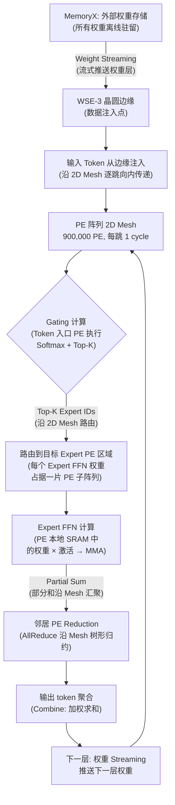

# session-20260603

- 导出时间：2026-06-03
- 来源：当前 Claude Code session 可用对话上下文
- 保存路径：human_notes/session-20260603.md
- 范围：仅用户输入与 Claude 最终输出

## 对话记录

### 001 User

用户从 [L1_horizon_summary.md](../learning_outputs/20260529_185938__MoEDiT多模态Video__单GPUNPU加速器__多算子微算子并发__硬件体系结构/L1_horizon_summary.md) 第 130 行选中内容：

```
**实现框架** | Cerebras SDK | WSE Weight Streaming + 2D Mesh 片上路由；Single-GPU-like PyTorch API | Llama 4: 2,522 tok/s | Q1.3 |
```

并说：教我

### 002 Claude

# Cerebras WSE（晶圆级引擎）深度讲解

你选中的这行是 L1 层「实现框架」分类中的最后一行：

> **Cerebras SDK** | WSE Weight Streaming + 2D Mesh 片上路由；Single-GPU-like PyTorch API | Llama 4: 2,522 tok/s

它描述的是完全不同于 GPU/NPU 的一种硬件范式的实现框架。下面将从物理架构 → 数据流机制 → 编程模型 → MoE 推理优势 → 性能数据这五个层次，完整展开。

---

## 一、物理架构：什么是「晶圆级」？

### 1.1 核心概念

**Wafer-Scale Engine (WSE)** 是 Cerebras Systems 的招牌架构。关键创新：**它不在硅晶圆上切出许多小芯片（die），而是把整片 300mm 晶圆做成一块芯片。**

```
GPU 路线（NVIDIA）:                Cerebras 路线:
┌──────────────────┐                ┌──────────────────────────┐
│ 切出很多小 die    │                │ 整片晶圆 = 一块芯片      │
│ ┌──┐ ┌──┐ ┌──┐  │                │                          │
│ │H100│ │H100│ │H100│              │  ┌────────────────────┐  │
│ └──┘ └──┘ └──┘  │                │  │  900,000 PE 排列在  │  │
│ ┌──┐ ┌──┐ ┌──┐  │                │  │  2D Mesh 网格上    │  │
│ │H100│ │H100│ │H100│              │  │  (每个 PE: 48KB    │  │
│ └──┘ └──┘ └──┘  │                │  │   scratchpad SRAM) │  │
│ ... 再封装+互联  │                │  └────────────────────┘  │
└──────────────────┘                └──────────────────────────┘
  die 间需 NVLink/PCIe                die 间互联在光刻时就完成
  通信延迟: ~300-800 cycles           片上跳转延迟: 1 cycle
```

### 1.2 三代 WSE 关键参数对比

| 参数 | WSE-1 | **WSE-2** (CS-2) | **WSE-3** (CS-3) |
|------|-------|-------------------|-------------------|
| 制程 | TSMC 16nm | TSMC 7nm | TSMC 5nm |
| 面积 | 46,225 mm² | 46,225 mm² | ~46,225 mm² |
| 晶体管 | 1.2 万亿 | 2.6 万亿 | **4 万亿** |
| AI 核心 (PE) | 400,000 | 850,000 | **900,000** |
| 片上 SRAM | 18 GB | 40 GB | **44 GB** |
| 片上带宽 | 9 PB/s | 20 PB/s | **21 PB/s** |

### 1.3 为什么晶圆级是革命性的？—— 与 H100 的物理对比

```
                 WSE-2                    H100 (SXM5)
面积            46,225 mm²  (57×)        814 mm²
晶体管          2.6 万亿   (32×)         800 亿
AI 核心         850,000    (56×)         14,592 CUDA + 456 Tensor Core
片上 SRAM       40 GB      (800×)        0.05 GB (≈50 MB L2)
片上带宽        20 PB/s    (10,000×)     0.002 PB/s (≈2 TB/s L2)
HBM             无！(用 MemoryX)         80 GB HBM3, 3.35 TB/s
```

**核心洞察：** H100 的 HBM 访问延迟约 300-800 GPU cycles。WSE 上 PE 访问邻居 PE 只需 **1 cycle**。延迟差异 300-800×，对于 MoE 这种通信密集的负载，这是本质性的优势。

---

## 二、数据流机制：Weight Streaming

### 2.1 问题背景

WSE 有 44 GB 片上 SRAM，对 Llama 4 规模的模型（参数量远大于 44 GB）来说，权重根本放不进片上 SRAM。Cerebras 的解决方案是 **Weight Streaming（权重流式加载）**：

```
传统 GPU 推理:                     Cerebras Weight Streaming:
┌─────────────────────┐            ┌────────────────────────┐
│ 模型权重驻留在 HBM  │            │ MemoryX (外部 DRAM)    │
│ (80GB HBM3)         │            │ 存储所有权重           │
│ ↓ 反复读取          │            │      ↓ 流式推送        │
│ Tensor Core 计算    │            │ WSE-3 晶圆边缘接收     │
│ ↓ 写回 HBM          │            │      ↓                 │
│                     │            │ 权重沿 2D Mesh         │
│ 问题: 权重大 → 小   │            │ 路由到目标 PE          │
│ batch 时 memory-bound│            │      ↓                 │
│ GPU MFU < 1%        │            │ PE 本地计算             │
└─────────────────────┘            └────────────────────────┘
  瓶颈: HBM 带宽                    瓶颈: MemoryX→晶圆带宽
```

**关键区别：** GPU 上权重常驻 HBM，每次 forward pass 需要从 HBM 重新读取（memory-bound）；WSE 上权重是**流水线式流进来的**——当 PE 正在计算当前层时，下一层的权重已经在传输路上了。这本质上把**权重加载延迟隐藏在了计算之后**。

### 2.2 对量化的影响

H100 上 INT4/FP8 量化的核心收益来自"更小的权重→更少的 HBM 带宽压力"。但在 WSE 上：

- 权重本就不驻留在片上，而是流式进来
- Weight Streaming 的延迟已经被计算隐藏
- **量化对 WSE 的加速收益远不如 GPU 显著**（因为 bottleneck 不是 weight fetch bandwidth）

这就是笔记中说的 ★★☆☆☆ 的原因——不是量化不好，而是 WSE 的瓶颈不在权重加载。

---

## 三、片上互联：2D Mesh 路由

### 3.1 拓扑结构

```
WSE-3 2D Mesh 互联拓扑:
┌───────┬───────┬───────┬───────┬───────┐
│ PE[0] │ PE[1] │ PE[2] │ PE[3] │ ...   │
│  ↕↔   │  ↕↔   │  ↕↔   │  ↕↔   │       │
├───────┼───────┼───────┼───────┼───────┤
│ PE[N] │ PE[]  │ PE[]  │ PE[]  │ ...   │
│  ↕↔   │  ↕↔   │  ↕↔   │  ↕↔   │       │
├───────┼───────┼───────┼───────┼───────┤
│ ...   │ ...   │ ...   │ ...   │ ...   │
└───────┴───────┴───────┴───────┴───────┘

每个 PE 有 4×32-bit 双向端口 (N/S/E/W)
单跳延迟: 1 cycle (~1 ns @ 1 GHz)
```

### 3.2 MoE Token 路由在 WSE 上的实际流程

这是 WSE 对于 MoE 推理最大的杀手锏。看下面的 Mermaid 流程图：



### 3.3 为什么这消除了 MoE 的通信瓶颈？

在 GPU 上做 MoE（以 Mixtral-8×7B, EP=8 为例）：

```
GPU All-to-All 通信:
Step 1: Router 选 expert → token 按 expert 分组
Step 2: All-to-All Dispatch
  - 每个 GPU 把属于其他 GPU 的 token 通过 NVLink/IB 发送出去
  - 通信量 ∝ batch_size × hidden_dim × num_tokens
  - 占 step time 的 30-50%！
Step 3: 等待所有 remote token 到齐 (barrier)
Step 4: 计算 Expert FFN
Step 5: All-to-All Combine (反向通信)
Step 6: 等待 barrier
```

在 WSE 上：

```
WSE 片上 Token 路由:
Step 1: Router 选 expert → 输出 expert PE 的物理坐标 (x, y)
Step 2: Token 数据沿 2D Mesh 逐跳传递到目标 PE
  - 每跳 1 cycle
  - 最远距离 ≈ √(900,000) ≈ 950 hops ≈ 950 cycles
  - 对比: HBM 访问 ~300 cycles —— 同一个数量级！
Step 3: Expert FFN 计算 (PE 本地 SRAM 中权重已就绪)
Step 4: 部分和沿 Mesh 树形归约返回

核心差异:
- GPU: token 数据走 NVLink/IB (跨芯片, 长距离电气信号)
- WSE:  token 数据走片上 Mesh (同芯片, 相邻 PE 间短距传输)
- 延迟差异: ~300-800×
```

**结论：** MoE 推理的第一大瓶颈（All-to-All 通信占 30-50% 延迟）在 WSE 上被**根本性地消除**了。Token 路由从"跨芯片网络传输"降级为"片上邻居传递"。

---

## 四、编程模型：Single-GPU-like PyTorch API

### 4.1 抽象层次

Cerebras SDK 的设计哲学：**将整片 900,000 PE 的晶圆抽象为一台"巨大的 GPU"。**

```
用户视角:                         实际硬件:
import torch                      WSE-3 晶圆
import cerebras                   
                                  ┌────────────────────┐
model = Llama4(...)               │ 900,000 PE 网格     │
model.to("cerebras")  ←──→       │ 每个 PE 负责不同    │
                                  │ 的计算片段          │
output = model(input)             │                    │
                                  │ Cerebras CGC 编译器 │
# 无需手动 DP/TP/EP！             │ 自动映射模型→PE    │
                                  └────────────────────┘
```

对比 GPU 上的 MoE 部署：

| 维度 | GPU (如 8×A100) | Cerebras WSE-3 |
|------|-----------------|-----------------|
| 并行策略 | 用户需手动选择 DP+TP+EP 组合 | CGC 编译器自动映射 |
| All-to-All 通信 | 显式 NCCL 调用，占 30-50% | 片上 mesh 路由，隐含于 PE 通信 |
| Token dispatch | 手动管理 reorder/unpermute | 编译器生成 PE 间路由指令 |
| Expert 权重分布 | 手动决定 expert 放置策略 | 编译器自动 Place-and-Route |
| 代码量 | ~500-2000 行 (DeepSpeed-MoE) | ~10 行修改 (PyTorch 模型) |

### 4.2 编译栈

```
PyTorch Model
      ↓
Cerebras CGC Compiler (计算图编译)
  - 算子→PE 子阵列映射
  - 2D Mesh Place-and-Route
  - Weight Streaming 时序编排
  - 数据流 Pipeline 生成
      ↓
WSE 可执行指令
  - PE 级: 计算指令 + 通信指令
  - Mesh 级: token 路由表
```

---

## 五、性能数据解读：Llama 4 2,522 tok/s

### 5.1 这个数字的背景

```
Llama 4 推理吞吐对比:
  H100 (单卡):        ~1,000 tok/s  (估计值)
  H200 (单卡):        ~1,200 tok/s
  Cerebras CS-2/CS-3:  2,522 tok/s  (~2.5× H100)

HNLPU (ASIC, 5nm 16-chip): 5,555× H100 吞吐
                             1,047× H100 能效
```

2,522 tok/s 的背后是：

1. **MoE 通信瓶颈消除：** All-to-All 从 >30% 延迟降到可忽略
2. **海量并发：** 900,000 PE 同时活跃，远超 GPU 132 SM 的并发能力
3. **无 kernel launch overhead：** 数据流架构天然流水线——不像 GPU 每个 kernel 有 ~5-100μs 启动开销

### 5.2 WSE 的瓶颈转移 (Bottleneck Transfer)

最有意思的现象是 BTA (Batch Tiling on Attention) 论文的洞察：

```
GPU 上 MoE 训练的瓶颈层次:
  #1: Expert 间 All-to-All 通信   ← GPU 最大瓶颈
  #2: Expert FFN 计算密度
  #3: Attention 激活内存

WSE 上瓶颈重组:
  #1: Attention 激活内存 (KV cache + softmax 中间结果)
      ← 因为 #1 通信瓶颈已消除！
  #2: Expert FFN 计算密度
  #3: (通信不再是瓶颈)
```

**这意味着什么？** 在 WSE 上，MoE 的优化方向不再是「如何减少通信」（GPU 上的 PROBE/DualPipe/Comet 等方向），而是「如何管理 attention 的激活内存」和「如何增大 batch size」。

---

## 六、WSE 的局限性

| 局限 | 说明 |
|------|------|
| **片上 SRAM 44 GB** | 无法容纳完整模型权重，必须依赖 Weight Streaming |
| **系统功耗 15 kW** | CS-3 整机功耗（含冷却），是 8×H100 节点（~5.6 kW）的 2.7× |
| **量化收益折半** | Weight Streaming 隐藏了权重加载延迟→INT4/FP8 加速不如 GPU 显著 |
| **价格/可用性** | Cerebras 系统采购渠道有限，远不如 GPU 普及 |
| **生态成熟度** | PyTorch 兼容但不支持 CUDA 生态的全部算子 |
| **动态 routing 局限** | MoE 的 per-token gating 是完全确定性的 token 路由，但更复杂的控制流可能映射困难 |

---

## 七、总结：WSE 在 MoE/DiT/多模态推理中的定位

```
硬件谱系 (从通用到专用):

通用 ←──────────────────────────────→ 专用

GPU (H100)    NPU (Ascend)   RDU (SN40L)   WSE (Cerebras)   HNLPU (ASIC)
SIMT 灵活      SA 高效        数据流原生     晶圆级 2D Mesh   权重固化硅片
MFU 0.01-95%  MFU 70-80%     高并发         通信瓶颈消除     仅跑一个模型
生态最成熟    生态在追赶      编译器依赖大    44GB SRAM 限制   5,555× 吞吐
```

**Cerebras WSE + Cerebras SDK 的核心价值主张是：**

> 对于 MoE 这类通信密集的模型，WSE 用**极致的硬件并发度**（900,000 PE）和**极低的片上通信延迟**（1 cycle/hop），从根本上消除了 GPU 上 MoE 推理的首要瓶颈（All-to-All 通信占 30-50% 延迟）。代价是系统功耗和 SRAM 容量的约束，以及远不如 CUDA 成熟的软件生态。

**与你笔记中其他实现框架的关系：**

- **vLLM/TensorRT-LLM**: 它们是「在 GPU 的约束下最大化 MoE 效率」——通过 PagedAttention、INT4 量化、CUDA Graph 优化 memory 和 kernel launch
- **Cerebras WSE**: 它是「换一种硬件范式来消除 GPU 的约束」——通信瓶颈不存在了，但 attention 激活内存成为新瓶颈

两条路线互补：GPU 路线通过软件工程榨取硬件性能；WSE 路线通过硬件设计绕开软件难题。

### 003 User

'Cerebras CGC Compiler (计算图编译)'更多信息?

### 004 Claude

# Cerebras CGC (Cerebras Graph Compiler) 深度解析

## 一、CGC 在 Cerebras 全栈中的位置

```
Cerebras 软件全栈:

┌──────────────────────────────────────────┐
│ 用户代码层                                │
│  PyTorch / TensorFlow / C / Python       │
│  (Single-GPU-like API)                   │
├──────────────────────────────────────────┤
│        ▼                                 │
│  ┌────────────────────────────────────┐  │
│  │  CGC (Cerebras Graph Compiler)     │  │
│  │                                    │  │
│  │  ① 图提取 → ② CLAIR 构造          │  │
│  │  ③ Matching & Covering             │  │
│  │  ④ Placement (多约束求解)          │  │
│  │  ⑤ Routing (fabric 配置)           │  │
│  │  ⑥ 可执行文件生成                  │  │
│  └────────────────────────────────────┘  │
│        ▼                                 │
├──────────────────────────────────────────┤
│  WSE 可执行指令                           │
│  900,000 PE 上的计算 + 通信时序           │
└──────────────────────────────────────────┘
```

CGC 是整个 Cerebras 平台的核心——它是将**标准 PyTorch 模型**转化为**WSE 晶圆上 900,000 个 PE 的并行计算指令**的唯一通道。

---

## 二、完整编译流水线

### 阶段 ①: 图提取 (Graph Extraction)

```
用户 PyTorch 代码:
  def forward(x):
      h = self.attn(x)
      h = self.ffn(h)
      return h

        ↓ CGC 第一步: trace / extract

静态计算图 (Static Graph):
  x → Attention(Q,K,V) → Add → RMSNorm → Router → ExpertFFN → Add → output
       ↑___ residual _____________|                        ↑___ residual ___|
```

CGC 从 PyTorch/TensorFlow/C 代码中**提取静态计算图**。与 PyTorch 的动态图不同，CGC 需要的是一个完全确定的、无控制流的计算图（这一点对 MoE 的 per-token routing 是一个挑战——后面展开）。

### 阶段 ②: CLAIR — Cerebras Linear Algebra Intermediate Representation

**CLAIR** 是 CGC 的核心 IR（Intermediate Representation），它的关键设计特性：

```
CLAIR 的设计目标:
┌─────────────────────────────────────────────┐
│ 1. 框架无关 (Framework-agnostic)            │
│    PyTorch / TF / C → 统一的 CLAIR          │
│    添加新前端框架无需修改后端编译器          │
│                                             │
│ 2. 线性代数语义 (Linear Algebra Semantics)   │
│    所有操作都表示为线性代数操作的组合        │
│    (matmul, reduce, element-wise, etc.)      │
│                                             │
│ 3. 形状与布局信息 (Shape & Layout)           │
│    每个张量带完整 shape + 内存布局注释       │
│    (row-major / col-major / tiled / swizzled)│
│                                             │
│ 4. 数据流图 (Dataflow Graph)                 │
│    节点 = 操作 (compute node)               │
│    边   = 张量流动 (communication edge)      │
└─────────────────────────────────────────────┘
```

**CLAIR vs 其他 IR 的对比：**

| IR | 目标硬件 | 关键抽象 | 并发模型 |
|----|---------|---------|---------|
| **CLAIR** (Cerebras) | WSE 2D Mesh PE 阵列 | 线性代数操作 → PE 矩形映射 | 空间数据流 (spatial) |
| **XLA HLO** (Google) | TPU systolic array | HLO 指令 → SPMD partition | SPMD (数据并行) |
| **MLIR** (LLVM) | 通用 (GPU/CPU/NPU) | 多层 dialect → 渐进 lowering | 多模型 (GPU/CPU/...) |
| **TVM Relay** (Apache) | GPU/CPU/NPU | 计算图 → TensorIR → 底层代码 | 多后端 |
| **Triton IR** (OpenAI) | GPU | Block-level 编程 → PTX | SIMT |

**CLAIR 的独特性**：它是为**空间数据流架构**设计的 IR——不像 GPU 的 IR 需要处理 SIMT 线程模型、warp divergence、shared memory bank conflict；而是关注**PE 矩形区域的划分**、**PE 间通信方向**（水平/垂直）、**tile 沿 PE 阵列的传播**。

### 阶段 ③: Matching & Covering — 内核图构建

这是 CGC 最关键的技术步骤。

```
CLAIR 子图:
  ┌─────────────────────────┐
  │ RMSNorm → MatMul → SiLU │
  │   ↓                     │
  │ MatMul → * → MatMul     │
  └─────────────────────────┘

        ↓ Matching & Covering

每一个匹配的 CLAIR 子图 → 一个来自 Cerebras Kernel Library 的优化内核 (kernel)

结果: Kernel Graph (内核图)
  ┌──────────────────────────────────────┐
  │ K_fused_rmsnorm_matmul  →  K_silu    │
  │        ↓                            │
  │ K_gated_ffn (gate+up+down 融合)     │
  └──────────────────────────────────────┘
```

**什么是 Cerebras Kernel Library？**

Cerebras 维护了一个**手动高度优化的内核库**，每个内核是针对 WSE 架构手写优化的（类似 NVIDIA 的 cuBLAS/cuDNN，但粒度更粗）。内核覆盖：

- 矩阵乘法 (GEMM)：各种 tile shape、数据类型
- Attention (FlashAttention-like fused kernel)
- 卷积：各种 kernel size/stride/dilation
- Layer Norm / RMS Norm / Batch Norm
- 激活函数：GELU, SiLU, ReLU 等（融合到 GEMM epilogue）
- MoE 专用：GroupedGEMM, Token Router, All-to-All (片上路由实现)
- 通信原语：reduce, broadcast, gather, scatter

**Matching & Covering** 是一个**子图同构匹配 (subgraph isomorphism)** 问题：

```
给定:
  - CLAIR 子图 G_clair (操作图)
  - Kernel 库中每个 kernel K_i 的 pattern graph G_i

目标:
  用最少的 kernel 覆盖整个 G_clair，最大化融合宽度 (fusion width),
  最小化 kernel 间通信开销

算法:
  贪心匹配 + 回溯 (类似编译器指令选择的 tree-pattern-matching)
  优先匹配大 pattern (如 merged QKV projection + attention)
  无法匹配的退化到逐操作 kernel
```

**一个具体的例子**——Mixtral MoE 的 attention + FFN 层在 CLAIR 中的匹配：

```
用户 PyTorch:
  x = x + self.attn(rms_norm(x))
  gate = self.router(x)
  x = x + moe_ffn(x, gate)

CLAIR 子图 → Kernel 匹配:
  ┌──────────────────────────────────────────────┐
  │ RMSNorm + QKV_Projection + Fused Attention   │  → K_flash_attn_fused
  │ Router (Softmax + TopK)                      │  → K_moe_router
  │ Expert FFN (Gate + Up + SiLU + Down) × 8     │  → K_grouped_gemm_moe × 1 (融合)
  │ Token Dispatch (片上路由)                    │  → K_alltoall_mesh (隐含在通信中)
  │ Token Combine                                 │  → K_reduce_scatter_mesh
  └──────────────────────────────────────────────┘
```

**Kernel Graph 的最终产物**：一个有向无环图 (DAG)，节点是 kernel（含计算需求和内存需求），边是数据依赖（含通信量）。

### 阶段 ④: Placement — 多约束优化求解

这是 CGC 与所有其他编译器**最不同**的地方。

```
问题: 把 Kernel Graph 的每个 kernel 映射到 WSE 的物理 PE 矩形区域上

Kernel Graph:                        WSE 2D PE 阵列 (示意):
┌───────┐                           ┌─────────────────────┐
│K_attn │──→ K_router               │ A A A A │ R R │ E E │
│ (大)  │    (小)                    │ A A A A │ R R │ E E │
└──┬────┘                           │ A A A A │     │ E E │
   │                                │ A A A A │  D  │ E E │
   ↓                                ├─────────┤     │     │
┌───────┐     ┌───────┐             │   C C   │  D  │ E E │
│K_moe  │────→│K_comb │             │   C C   │     │ E E │
│ (超大)│     │ (中)  │             ├─────────┴─────┴─────┤
└───────┘     └───────┘             │    (其他层...)     │
                                    └─────────────────────┘
                                    A=Attention PE 矩形
                                    R=Router PE 矩形
                                    E=Expert FFN PE 矩形
                                    C=Combine PE 矩形
                                    D=数据流路径 (片上路由)
```

**Placement 被形式化为多约束优化问题：**

```
最小化:
  Σ 通信距离 × 通信量    (最小化 total wire length)
  + Σ PE 空闲率          (最大化利用率)
  + λ × 热点惩罚          (避免局部过热)

约束:
  ① 内存约束: kernel 所需 SRAM ≤ 分配给它的 PE 矩形中所有 scratchpad 之和
     每个 PE 有 48 KB → 一个 m×n PE 矩形提供 m×n×48 KB

  ② 计算约束: kernel 所需 FLOPS ≤ 分配给它的 PE 矩形的总算力
     每个 PE 约 2 TFLOPS (FP16) → m×n PE 矩形提供 m×n×2 TFLOPS

  ③ 通信约束: kernel 间通信需在 2D mesh 上有可用路径
     任意两 PE 间通信距离 = |x1-x2| + |y1-y2| (Manhattan distance)
     通信延迟 = 距离 × 1 cycle/hop

  ④ 非重叠约束: 任意两个 kernel 的 PE 矩形不重叠
     (除非支持空间并发 on same PE — 通常不支持)
```

**Placement Engine 的策略：**

```
三个层次的并行性利用:

Level 1: Within-Kernel 并行
  单个 kernel 内部, 数据沿 PE 矩形的行/列传播
  例: GEMM 的 m 维沿行 (多个 PE 各算一段 m), n 维沿列

Level 2: Across-Kernel 并行 (Layer-Pipelined)
  不同 layer 的 kernel 放置在不同 PE 区域, 数据流式传递
  例: Layer L-1 的 Attention 和 Layer L 的 Router 可同时在不同 PE 上执行

Level 3: Data-Parallel (多 CS 系统间)
  同一 kernel 在不同 CS 系统上运行不同 batch 分片
  SwarmX 负责跨系统梯度归约
```

**Placement 的启发式算法：**

由于搜索空间巨大（900,000 PE × N 个 kernel 的放置位置），精确求解不可能。CGC 使用 EDA 领域的启发式方法：

```
1. 初始放置 (Initial Placement):
   模拟退火 (Simulated Annealing) 或 力导向 (Force-Directed) 方法
   大 kernel (高计算需求) 优先放在中央区域
   小 kernel 填充空隙

2. 迭代优化 (Iterative Refinement):
   Kernel 间有数据依赖 → 尝试将 consumer 放在 producer 附近
   通信热点 → 扩展 PE 矩形或添加中继 PE

3. 合法化 (Legalization):
   确保无重叠、满足内存/计算约束
```

这一点 SLIP 2020 (Groeneveld) 和 ISPD 2021 的 Cerebras 论文中描述为**"EDA-inspired solutions for efficient kernel mapping"**——本质上，CGC 的 placement 是在做芯片物理设计中的 **floorplanning**（布图规划），只不过"标准单元"变成了 kernel、"芯片面积"变成了 WSE 的 PE 阵列、"互联"变成了 2D mesh。

### 阶段 ⑤: Routing — Fabric 配置

Placement 确定了每个 kernel 占哪些 PE，Routing 确定 PE 间**数据如何流动**。

```
Kernel A (PE矩形 [0:7, 0:3])  →  Kernel B (PE矩形 [4:11, 8:11])

Routing 引擎的任务:
  在 2D mesh 上找到一条从 A 的输出 PE 到 B 的输入 PE 的路径

通信任务分解 (来自 IMPACT 2020 LAIR 论文):
  ┌─────────────────────────────────────────────┐
  │ Spread Task:   1 个 PE → N 个 PE 广播       │
  │                 沿 mesh 行或列扩散           │
  │                                             │
  │ Collect Task:  N 个 PE → 1 个 PE 归约       │
  │                 沿 mesh 行或列树形汇聚       │
  │                                             │
  │ Route Task:    数据沿 XY-routing 在 mesh     │
  │                上从源 PE 传输到目标 PE       │
  └─────────────────────────────────────────────┘

MoE Token Dispatch 的 Routing 具体例子:
  Router PE 输出: token[i] → expert_id = 5
  Expert 5 的 PE 矩形: [32:63, 16:31]
  
  Routing 路径 (XY-routing):
    从 Router PE (x=2, y=2)
    第一步 (X方向): 向东逐个 PE 传递, 到 x=32
    第二步 (Y方向): 向南逐个 PE 传递, 到 y=16
    总跳数: 30 + 14 = 44 cycles
```

### 阶段 ⑥: 可执行文件生成

Placement + Routing 完成后，CGC 生成：
- 每个 PE 的**计算指令序列**（microcode）：什么时候做什么计算
- 每个 PE 的**通信指令序列**：什么时候从哪个邻居 PE 接收数据、发送数据
- 全局的**时序编排**：Weight Streaming 的权重加载时序与计算的交叠

这就是 WSE 上的"二进制文件"（executable）——没有操作系统、没有 kernel launch、没有动态调度。所有 900,000 个 PE 的每一步操作都在编译时确定。

---

## 三、Weight Streaming vs Pipelined 两种执行模式

CGC 根据模型大小和用户配置，选择两种编译策略：

```
模型所有层的权重能否全部放入 44GB 片上 SRAM？

  YES ──→ Pipelined Execution (层流水线)
  │       • 所有权重一次性加载到 WSE 片上 SRAM
  │       • 不同 layer 占据不同 PE 区域
  │       • Layer L 和 L+1 可同时在芯片不同区域执行
  │       • 适用: 小模型 (< 44GB 权重)
  │       • 无 MemoryX 参与推理
  │
  NO ──→ Weight Streaming Execution (权重流式)
          • 权重存储在外部 MemoryX
          • 每次仅流式加载一层权重到 WSE
          • Layer 1 权重流入 → 计算 → 激活留在片上
          • Layer 1 权重流出, Layer 2 权重流入 → 使用 Layer 1 激活
          • 适用: 大模型 (Llama 4, MoE, > 44GB 权重)
          • 这是 MoE/LLM 推理的默认模式
```

**Weight Streaming 编译的特殊考量：**

```
CGC 在 Weight Streaming 模式下的 Placement 策略:

传统 Pipelined: 所有 kernel 同时放置 → 全局优化
Weight Streaming: 每层 kernel 单独放置 → 每层用整晶圆

这意味着:
  - 每层的 placement 是独立的 (单层优化),
    不需要和上下层 kernel 抢 PE
  - 单层可利用全部 900,000 PE → MoE 的 8 个 expert
    可以被放在 8 个相距很远的 PE 矩形, 各自有足够算力
  - 层间激活数据留在片上不移动,
    下一层 placement 必须能接收上一层激活的位置
```

---

## 四、与 GPU 编译器的对比

| 维度 | CGC (Cerebras) | XLA (Google TPU) | TensorRT (NVIDIA GPU) | TVM (多后端) |
|------|---------------|-------------------|----------------------|-------------|
| **目标硬件** | WSE 2D PE Mesh | TPU MXU SA | GPU SIMT+Tensor Core | CPU/GPU/NPU |
| **IR** | CLAIR (线性代数) | HLO (XLA) / StableHLO | TensorRT Network Def | Relay / TensorIR |
| **执行模型** | 空间数据流 (spatial) | SPMD (数据并行) | SIMT (线程级并行) | 多模型 |
| **Kernel 选择** | Matching & Covering (子图匹配) | HLO→Linalg lowering | 手工规则 + 图融合 | AutoTVM/AutoScheduler |
| **Placement** | 多约束 floorplanning (核心!) | SPMD partition (device mesh) | N/A (kernel 在 SM 上动态调度) | N/A |
| **Routing** | 显式 fabric 配置 (XY-routing) | ICI 互联 (高速网络) | N/A (L2 cache coherence) | N/A |
| **自动调优** | 编译时求解 (启发式) | XLA cost model | 基于 profiling 的 kernel 选择 | AutoTVM (ML-based) |
| **并行度发现** | 编译器从 CLAIR DAG 自动提取 | GSPMD 标注驱动 | 用户手动 (CUDA stream+graph) | 有限的自动并行化 |
| **量化支持** | FP16/BF16 (主流), FP8 部分 | BF16/INT8 原生 | INT4/FP8 全支持 | 通过量化 pass |

**关键差异总结：**

1. **GPU 编译器不需要 Placement**——GPU 的 SM 硬件调度器在运行时动态分配 thread blocks 到 SM。CGC 必须在编译时静态确定"哪个 kernel 用哪块 PE 区域"。

2. **GPU 编译器不需要 Routing**——数据走 L1/L2 cache hierarchy 或 HBM，硬件自动管理。WSE 是分布式 scratchpad（无 cache coherence），编译器必须显式编排 PE 间的每一次数据传递。

3. **CGC 的 Matching & Covering 更接近 EDA 综合工具**（如 Synopsys Design Compiler 的 technology mapping），而非传统编译器。这是因为 WSE 本质是一块可配置的数据流硬件，不是通用处理器。

---

## 五、MoE 模型编译到 WSE 的特殊挑战

MoE 在 WSE 上的编译面临一个根本性挑战：

```
挑战: Per-token Dynamic Routing vs 静态编译

GPU 方案:
  Router 在运行时输出 expert_id → 动态 All-to-All → Expert FFN
  编译器不需要知道哪个 token 去哪个 expert

WSE 方案:
  所有 PE 指令在编译时确定 → 编译器需要知道数据从哪里来、到哪里去
  但 MoE 的 token→expert 映射是运行时决定的!

CGC 的解决方案（推断）:
  1. Router 计算仍在 PE 上执行 (Softmax + TopK)——这部分是确定性的
  2. Token dispatch 不是真正的"动态路由"——
     而是将所有可能的 token→expert 路径预先编译好
  3. 在运行时，Router PE 根据 TopK 结果选择激活哪条预设路径
  4. 这类似 FPGA 的 multiplexer: 所有路径物理存在，控制信号选择
```

这是 MoE 在 WSE 上"★☆☆☆☆"动态路由能力限制的技术根源——不是数据流架构不能做动态路由，而是**CGC 编译器需要在编译时知道 PE 间通信模式**，MoE 的 per-token routing 破坏了这一假设。

---

## 六、已知限制与未公开细节

笔记库和公开资料对以下 CGC 内部细节缺乏覆盖：

| 未知点 | 重要程度 |
|--------|---------|
| **CLAIR 的具体语法和语义**：与 MLIR/HLO 的精确差异 | 高 |
| **Kernel Library 的规模和覆盖**：有多少 hand-tuned kernel？覆盖哪些 pattern？ | 高 |
| **Placement 的具体算法**：是 ILP、SA、还是 force-directed？收敛时间？ | 高 |
| **Routing 的 deadlock 避免**：如何在 2D mesh 上确保无死锁通信？ | 中 |
| **XLA/MLIR 集成程度**：CGC 是否在 MLIR 生态中、有 CLAIR dialect？ | 中 |
| **Dynamic shape 支持**：MikPoly 这类动态 shape 优化在 CGC 中如何实现？ | 高 |
| **编译时间**：Llama 4 这类大模型在 CGC 上编译需要多长时间？ | 中 |
| **调试与 profiling 工具**：类似 Nsight Systems 的 WSE profiling 工具 | 中 |

---

## 七、小结

```
CGC 编译器的本质:

  CGC 不是一个传统编译器 (像 GCC/LLVM/XLA)，
  而是一个 EDA-style 的硬件映射工具。

  它做的事:

  PyTorch 模型                               WSE 晶圆
  (数学运算图)  ────── CGC ──────→  (900,000 PE 的物理指令序列)
                 ① 图提取 → CLAIR
                 ② Matching → Kernel Graph
                 ③ Placement → PE 矩形分配
                 ④ Routing → 2D Mesh 通信路径
                 ⑤ 时序编排 → Weight Streaming 调度

  关键创新:
  - 用 EDA floorplanning 解决 kernel→PE 的映射问题
  - 用 Matching & Covering (类似指令选择) 将 CLAIR 子图映射到优化 kernel
  - 将整片晶圆抽象为 "Single-GPU-like"，对用户隐藏 900,000 PE 的复杂度
```

