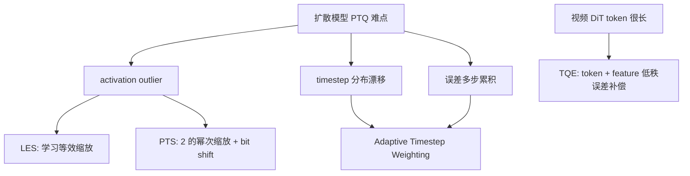

# DMQ 扩散模型量化 对话记录

- 导出时间：2026-06-03 17:18 CST
- 来源：当前 Codex session 可用对话上下文
- 保存路径：/data3/paper_analysis/human_notes/DMQ_扩散模型量化_对话记录.md
- 范围：仅用户输入与 Codex 最终输出

## 对话记录

### 001 User
<environment_context>
  <cwd>/data3/paper_analysis</cwd>
  <shell>bash</shell>
  <current_date>2026-06-01</current_date>
  <timezone>Asia/Shanghai</timezone>
</environment_context>

### 002 User
# Context from my IDE setup:

## Active file: .mcp.json

## Open tabs:
- .mcp.json: .mcp.json
- Q1.2_L1_answer.md: learning_outputs/20260529_185938__MoEDiT多模态Video__单GPUNPU加速器__多算子微算子并发__硬件体系结构/Q1.2_L1_answer.md
- settings.json: .claude/settings.json
- settings.local.json: .claude/settings.local.json
- review_on_learning_outputs_20260529_185938.md: human_notes/review_on_learning_outputs_20260529_185938.md

## My request for Codex:
# ===== DMQ: 扩散模型专用优化 =====
# 核心1: Learned Equivalent Scaling (LES)
for each channel c in weight:
    # 学习 channel-wise scaling factor α_c
    # 使得量化误差在 weight 和 activation 之间最优分配
    # W'_c = W_c / α_c,  X'_c = X_c * α_c
    # 目标: min_{α} ||W_c X_c - Q(W_c/α_c) Q(X_c*α_c)||²
    α_c = optimize_scaling_factor(W_c, X_c)

# 核心2: Adaptive Timestep Weighting
# 扩散早期步骤的量化误差累积效应更大
for t in denoising_steps:
    w_t = exp(-β * t / T)  # 早期步权重更高
    loss += w_t * reconstruction_loss(o_fp[t], o_q[t])
```

**注解**：
- **量化位宽与硬件映射**：INT8 GEMM 在 NVIDIA Tensor Core 上可达 FP16 的 2× 吞吐（H100: INT8=3958 TOPS vs FP16=1979 TFLOPS）。INT4 进一步可达 INT8 的 2× 吞吐，但精度损失需通过 PTQ 方法（如 GPTQ/AWQ）补偿。
- **DMQ 的 PTS (Power-of-Two Scaling)**：利用 2 的幂次缩放使得 rescale 操作退化为移位，硬件上无需乘法器，节省 ALU 资源。
- **Q-VDiT 的 TQE**：在 token 维度和 feature 维度使用 rank=1 低秩矩阵补偿量化误差，参数开销仅 d_in + d_out + t，推理时通过融合 kernel 执行，额外延迟 <5%。,教我

### 003 Codex Final
用了你本地笔记里的 DMQ / Q-VDiT 证据来讲。核心先抓一句话：

**DMQ 是给扩散模型做 PTQ 的“异常值处理 + 时间步加权 + 硬件友好缩放”方案；Q-VDiT 的 TQE 是给视频 DiT 量化误差加一个极小的低秩补偿分支。**

**1. 为什么扩散模型量化难**
扩散模型不是一次前向结束，而是反复去噪：

```text
x_T -> UNet/DiT -> x_{T-1} -> UNet/DiT -> ... -> x_0
```

所以量化误差有两个麻烦点：

1. 每个 timestep 的 activation 分布不同，固定 scale 很容易不合适。
2. 早期 timestep 的误差会被后续去噪过程继续放大。
3. skip connection 等层会有 channel outlier，一个通道特别大，会把整层量化范围撑爆，普通通道精度被浪费。

你可以把它理解成：LLM 量化主要怕 outlier channel；扩散模型还额外怕 **outlier 随 timestep 漂移** 和 **误差沿 denoising chain 累积**。

**2. LES 在干什么**
LES = Learned Equivalent Scaling，学一个通道级缩放因子。理想浮点下：

$$
XW = (X \alpha)(W / \alpha)
$$

数学上等价，但量化后不等价：

$$
Q(X)Q(W) \neq Q(X\alpha)Q(W/\alpha)
$$

所以 LES 的问题是：怎么选 $\alpha_c$，让 activation 和 weight 的量化误差分配得最好？

你写的形式是对的：

$$
\min_{\alpha} \|WX - Q(W/\alpha)Q(X\alpha)\|^2
$$

DMQ 里不是像 SmoothQuant 那样靠最大值启发式算缩放，而是用校准数据直接梯度下降学 $\tau$，目标是 layer/block reconstruction MSE。这样可以避免扩散模型里 `activation >> weight` 导致 SmoothQuant 把权重量化误差放大的问题。证据见 [DMQ note](</data3/paper_analysis/idea_notes/DMQ Dissecting Outliers of Diffusion Models for Post-Training Quantization.md:23>)。

**3. Adaptive Timestep Weighting 在干什么**
普通校准会把所有 timestep 的重建误差平均：

$$
L = \sum_t \|o_{fp}^{(t)} - o_q^{(t)}\|^2
$$

但扩散模型里，早期步虽然单步误差可能小，却会影响后面很多步。DMQ 因此引入 timestep 权重：

$$
L = \sum_t \lambda_t \cdot \|o_{fp}^{(t)} - o_q^{(t)}\|^2
$$

你写的 `exp(-β * t / T)` 是一种直觉版：早期权重大。DMQ 笔记里的实际形式更自适应：用每个 timestep 的累计损失 $\Lambda_t$ 动态算 $\lambda_t$，避免固定函数不适配不同层。证据见 [DMQ note](</data3/paper_analysis/idea_notes/DMQ Dissecting Outliers of Diffusion Models for Post-Training Quantization.md:25>)。

**4. PTS 为什么硬件友好**
PTS = Power-of-Two Scaling。它不只是“把 outlier 转移给权重”，而是对 activation 用 $2^\delta$ 做通道级缩放：

$$
\tilde{X} = Q\left(\frac{X}{2^\delta \cdot \tau \cdot s^X}\right)
$$

推理时可以把 $2^\delta$ 补到权重侧：

$$
Y \approx s^X s^W \cdot \tilde{X}(\tilde{W} \ll \delta)
$$

关键是 `<< δ` 是 bit shift，不是乘法。硬件上移位比乘法便宜很多，尤其适合 fused quantization/GEMM kernel。DMQ 还只在 skip connection 等 outlier 严重层上用 PTS，避免全模型乱缩放。证据见 [DMQ note](</data3/paper_analysis/idea_notes/DMQ Dissecting Outliers of Diffusion Models for Post-Training Quantization.md:28>) 和 [Shift Quantization note](</data3/paper_analysis/knowledge_notes/算法知识笔记/Shift Quantization (幂次量化 _ Power-of-Two Quantization).md:1>)。

**5. Q-VDiT 的 TQE 是什么**
Q-VDiT 关注视频 Diffusion Transformer。视频 token 数是：

$$
n = s \times t
$$

其中 $s$ 是每帧空间 token 数，$t$ 是帧数。视频 DiT 的量化误差不只在 feature/channel 维度，还在 token/frame 维度变化。

TQE 的想法是：量化误差 $\Delta$ 信息熵比原权重低，可以用低秩近似：

$$
XW^T \approx \hat{Q}(X)\hat{Q}(W)^T + \hat{\Delta}\beta
$$

其中：

$$
\hat{\Delta} = (\mathcal{M} \odot \hat{Q}(X))\alpha
$$

参数只有：

$$
d_{in} + d_{out} + t
$$

也就是 feature 方向的 $\alpha$、输出方向的 $\beta$、时间/token 方向的 $\mathcal{M}$。它像一个 rank=1 LoRA 补偿分支，用很小参数补回量化损失。证据见 [Q-VDiT TQE](</data3/paper_analysis/paper_secs/secs_model_quant/Q-VDiT Towards Accurate Quantization and Distillation of Video-Generation Diffusion Transformers/Q-VDiT-Towards-Accurate-Quantization-and-Distillation-of-Video-Generation-Diffusion-Transformers.md:94>)。

**一张心智图**


Annotations：`LES` 负责把 weight/activation 之间的量化难度分配好；`PTS` 负责处理极端 channel outlier 并映射到移位；`Adaptive Timestep Weighting` 负责让校准目标符合扩散去噪链；`TQE` 是 Q-VDiT 对视频 token/feature 双维度误差的轻量补偿。

### 004 User
# Context from my IDE setup:

## Active file: learning_outputs/20260529_185938__MoEDiT多模态Video__单GPUNPU加速器__多算子微算子并发__硬件体系结构/Q1.2_L1_answer.md

## Open tabs:
- Q1.2_L1_answer.md: learning_outputs/20260529_185938__MoEDiT多模态Video__单GPUNPU加速器__多算子微算子并发__硬件体系结构/Q1.2_L1_answer.md
- .mcp.json: .mcp.json
- settings.json: .claude/settings.json
- settings.local.json: .claude/settings.local.json
- review_on_learning_outputs_20260529_185938.md: human_notes/review_on_learning_outputs_20260529_185938.md

## My request for Codex:
为什么?'LES = Learned Equivalent Scaling，学一个通道级缩放因子。理想浮点下：
\[
XW = (X \alpha)(W / \alpha)
\]数学上等价，但量化后不等价：
\[
Q(X)Q(W) \neq Q(X\alpha)Q(W/\alpha)
\]所以 LES 的问题是：怎么选 $\alpha_c$，让 activation 和 weight 的量化误差分配得最好？
你写的形式是对的：
\[
\min_{\alpha} \|WX - Q(W/\alpha)Q(X\alpha)\|^2
\]DMQ 里不是像 SmoothQuant 那样靠最大值启发式算缩放，而是用校准数据直接梯度下降学 $\tau$，目标是 layer/block reconstruction MSE。这样可以避免扩散模型里 activation >> weight 导致 SmoothQuant 把权重量化误差放大的问题。'

### 005 Codex Final
因为 **量化不是线性操作**。浮点里 $\alpha$ 和 $1/\alpha$ 会完全抵消；但一旦经过 `round / clamp / scale`，中间值已经被投到离散格点上，抵消关系就被破坏了。

看单通道就够了：

$$
y = xw
$$

浮点缩放后：

$$
(x\alpha)(w/\alpha)=xw
$$

但量化后：

$$
Q(x\alpha)Q(w/\alpha)
$$

不是先算精确值再抵消，而是：

$$
Q(x\alpha)=x\alpha+\epsilon_x(\alpha)
$$

$$
Q(w/\alpha)=w/\alpha+\epsilon_w(\alpha)
$$

所以乘起来是：

$$
Q(x\alpha)Q(w/\alpha)
= xw + x\alpha\epsilon_w + \epsilon_x w/\alpha + \epsilon_x\epsilon_w
$$

真正抵消的只有第一项 $xw$。后面三个量化误差项不会抵消，而且还被 $\alpha$ 放大或缩小。

一个玩具例子：假设 $Q(z)=round(z)$。

$$
x=1.4,\quad w=1.4,\quad xw=1.96
$$

不缩放：

$$
Q(1.4)Q(1.4)=1\times1=1
$$

取 $\alpha=2$：

$$
Q(2.8)Q(0.7)=3\times1=3
$$

浮点下两者都等价于 $1.96$，但量化后一个变成 1，一个变成 3。问题就在这里：**缩放不改变浮点函数，但会改变量化误差的分布。**

LES 的本质就是在选一个最合适的 $\alpha_c$：到底把误差压力放在 activation 侧，还是 weight 侧？

如果用你写的形式：

$$
Q(W/\alpha)Q(X\alpha)
$$

那么：

- $\alpha_c$ 大：activation 被放大，weight 被缩小。
- $\alpha_c$ 小：activation 被缩小，weight 被放大。
- 缩小 activation outlier 可以让 activation 更好量化。
- 但补偿到 weight 上以后，weight 的范围会扩大，尤其 W4/INT4 时很容易炸。

SmoothQuant 的问题就在这里。它看到扩散模型里 activation 很大、weight 很小，于是会选很激进的缩放，把 activation 压下去，把 weight 放大。可扩散模型的权重量化位宽通常很低，比如 W4A8，weight 一被放大，INT4 的格点根本装不下细节，权重量化误差暴涨。DMQ 笔记里也记录了这个现象：SmoothQuant 直接迁移后 weight quantization error 从 `0.0060` 涨到 `0.0694`，FID 也严重恶化，见 [DMQ note](</data3/paper_analysis/idea_notes/DMQ Dissecting Outliers of Diffusion Models for Post-Training Quantization.md:8>)。

所以 LES 不用最大值公式硬猜，而是直接问最终问题：

$$
\min_{\alpha}\|XW - Q(X/\tau)Q(\tau W)\|^2
$$

也就是：我不关心 $\alpha$ 看起来多漂亮，我只关心量化后的 block/layer 输出能不能接近 FP 输出。这样它会学到一个更温和、更任务相关的缩放，避免“activation 好量化了，weight 被牺牲到崩掉”。

### 006 User
# Context from my IDE setup:

## Active file: learning_outputs/20260529_185938__MoEDiT多模态Video__单GPUNPU加速器__多算子微算子并发__硬件体系结构/Q1.2_L1_answer.md

## Open tabs:
- Q1.2_L1_answer.md: learning_outputs/20260529_185938__MoEDiT多模态Video__单GPUNPU加速器__多算子微算子并发__硬件体系结构/Q1.2_L1_answer.md
- .mcp.json: .mcp.json
- settings.json: .claude/settings.json
- settings.local.json: .claude/settings.local.json
- review_on_learning_outputs_20260529_185938.md: human_notes/review_on_learning_outputs_20260529_185938.md

## My request for Codex:
DMQ所说的方法是量化训练?PTQ则是训练后量化?但实际上,量化训练算法很早就有了(cnn中就存在)?DMQ有什么特别的呢?

### 007 Codex Final
对，你理解的方向是对的，但要加一个关键区分：

**DMQ 不是传统意义上的 QAT，它属于 optimization-based PTQ。**

也就是说，DMQ 里面确实有“learned / optimize / gradient descent”，但它学的不是原模型的全部权重，不是在完整训练集上重新训练扩散模型，而是在模型训练完成后，用少量校准数据优化量化相关参数。

**QAT vs PTQ**
| 范式 | 做什么 | 更新什么 | 数据/成本 |
|---|---|---|---|
| QAT / 量化感知训练 | 训练时插入 fake quant，让模型适应低比特 | 通常更新模型权重，可能也更新 scale/clipping | 成本高，像重新训练/微调 |
| PTQ / 训练后量化 | 模型训练完后再量化 | 通常只定 scale、zero-point、rounding、clipping、等效变换参数 | 小校准集，成本低 |
| DMQ | PTQ 里的优化型方法 | 学 LES 的缩放 $\tau$，做 BRECQ/rounding，选 PTS 因子 | 不重训扩散模型主体 |

所以 DMQ 里的“Learned Equivalent Scaling”容易让人误会成 QAT。更准确地说，它是：

> 用梯度下降做量化校准参数学习，而不是训练原始扩散模型。

**CNN 里早就有量化训练，这没错**
比如 BinaryConnect、XNOR-Net、DoReFa-Net、PACT、LSQ 这些都很早。它们的基本套路是：

```text
forward: 用低比特/fake quant 权重和激活
backward: 用 STE 近似 round 的梯度
update: 更新模型权重或 clipping/scale 参数
```

这类方法解决的是“模型在训练阶段适应低比特表示”。DMQ 的特别之处不在于“第一次学习量化参数”，而在于它把这个问题放进了 **扩散模型 PTQ** 的特殊约束里。

**DMQ 特别在哪里**
第一，扩散模型有 timestep 维度。一次生成要跑很多步，早期步的量化误差会在后续 denoising 中累积。所以 DMQ 加了 **Adaptive Timestep Weighting**，不是简单平均所有 timestep 的重建误差。

第二，扩散模型 activation outlier 很严重，尤其 skip connection 层。普通 per-tensor activation quantization 会被一个极端通道撑大范围，导致普通通道精度变差。

第三，SmoothQuant 直接搬过来会失败。因为扩散模型里经常是：

```text
activation 很大，weight 相对小
```

SmoothQuant 会为了压 activation，把误差压力转移到 weight 上；但 DMQ 做 W4A8/W4A6 时，weight 只有 4 bit，很容易被放大后量化崩掉。

第四，DMQ 的 LES 不是手工最大值公式，而是用校准数据直接最小化 block/layer 输出误差：

$$
\min_\tau \|XW - Q(X/\tau)Q(\tau W)\|^2
$$

它问的是：“这个缩放最后让输出更接近 FP 吗？”而不是：“这个缩放是否让 activation 最大值更好看？”

第五，DMQ 的 PTS 很硬件友好。它用 $2^\delta$ 缩放，推理时可以变成 bit-shift：

```text
W_shifted = W_int << δ
```

这样处理极端 outlier 时不需要额外乘法器，适合融合进 CUDA/GEMM kernel。

一句话总结：**CNN 时代已有 QAT；DMQ 的贡献是把 PTQ 做成扩散模型专用，处理 timestep 误差累积、activation/weight 不平衡、skip connection outlier，并把缩放设计成可融合、低开销的硬件友好形式。**

### 008 User
<environment_context>
  <current_date>2026-06-03</current_date>
  <timezone>Asia/Shanghai</timezone>
  <filesystem><workspace_roots><root>/data3/paper_analysis</root></workspace_roots><permission_profile type="managed"><file_system type="restricted"><entry access="read"><special>:root</special></entry><entry access="write"><path>/data3/paper_analysis</path></entry><entry access="write"><special>:slash_tmp</special></entry><entry access="write"><special>:tmpdir</special></entry><entry access="read"><path>/data3/paper_analysis/.git</path></entry><entry access="read"><path>/data3/paper_analysis/.agents</path></entry><entry access="read"><path>/data3/paper_analysis/.codex</path></entry></file_system></permission_profile></filesystem>
</environment_context>

### 009 User
# Context from my IDE setup:

## Active file: learning_outputs/20260529_185938__MoEDiT多模态Video__单GPUNPU加速器__多算子微算子并发__硬件体系结构/L1_horizon_summary.md

## Open tabs:
- L1_horizon_summary.md: learning_outputs/20260529_185938__MoEDiT多模态Video__单GPUNPU加速器__多算子微算子并发__硬件体系结构/L1_horizon_summary.md
- SKILL.md: .codex/skills/export-conversation-notes/SKILL.md
- Accelerating Sparse Transformer Inference on GPU (STOF).md: human_notes/Accelerating Sparse Transformer Inference on GPU (STOF).md
- Adaptive Draft Sequence Length_ Enhancing Speculative Decoding Throughput on PIM-Enabled Systems.md: human_notes/Adaptive Draft Sequence Length_ Enhancing Speculative Decoding Throughput on PIM-Enabled Systems.md
- AdaServe_ Accelerating Multi-SLO LLM Serving with SLO-Customized Speculative Decoding.md: human_notes/AdaServe_ Accelerating Multi-SLO LLM Serving with SLO-Customized Speculative Decoding.md

## My request for Codex:
[$export-conversation-notes](/data3/paper_analysis/.codex/skills/export-conversation-notes/SKILL.md) 

### 010 User
<skill>
<name>export-conversation-notes</name>
<path>/data3/paper_analysis/.codex/skills/export-conversation-notes/SKILL.md</path>
---
name: export-conversation-notes
description: Export the currently available Codex/chat session record into a target Markdown file, defaulting to human_notes/. Save only user inputs and Codex final outputs. Use when the user asks to save, archive, output, or record the current conversation, dialogue history, or analysis session in the paper_analysis workspace. If the target Markdown file already exists and is non-empty, append incrementally without modifying, deleting, reformatting, or replacing any existing content.
---

# Export Conversation Notes

## Overview

Save the current session's available user inputs and Codex final outputs to the requested target location. Default to `human_notes/` when no explicit directory is provided. Default to Chinese for headings and status text. Do not save process notes, status updates, tool calls, command outputs, hidden instructions, or intermediate work logs.

## Workflow

1. Identify the target path.
   - save under `human_notes/`.
   - If no filename can be identified, use `<session-name>.md` and <session-name> is the name of the current session.

2. Prepare the target file.
   - Work relative to the current workspace root.
   - Ensure the destination directory exists.
   - Sanitize only the filename portion by replacing filesystem-hostile characters such as `/`, `\`, `:`, `*`, `?`, `"`, `<`, `>`, and `|` with safe separators, then trim whitespace.
   - Save to the resolved target path.

3. Capture the available conversation record.
   - Output only user inputs and Codex final outputs in chronological order with speaker labels.
   - Include all available user messages exactly as written.
   - Include only Codex final responses that answer the user, not interim progress updates or tool-facing content.
   - Do not include tool calls, shell commands, command outputs, file edit logs, errors from tools, status updates, planning chatter, hidden system/developer/policy/runtime instructions, or intermediate reasoning.
   - Do not summarize, compress, paraphrase, normalize, or reorganize the saved user inputs and final outputs.
   - If earlier user inputs or final outputs are unavailable because context was compacted or not exposed to Codex, state this limitation briefly before the saved conversation.

4. Write the Markdown file.
   - If the file does not exist, create it with the new-file template.
   - If the file exists but is empty, write the new-file template.
   - If the file exists and is non-empty, enter incremental mode: append a new dated section only at the end of the file.
   - In incremental mode, never modify, delete, reorder, summarize, normalize, reformat, or replace any existing content, even if the existing note has typos, duplicate headings, stale metadata, or inconsistent formatting.
   - In incremental mode, use an append-only edit. With `apply_patch`, add only new lines after the existing final line.
   - Keep the saved record readable, but preserve the available user inputs and final outputs over brevity.
   - If the record is too long for one edit, append it in multiple consecutive chunks until all currently available user inputs and final outputs are saved.

## Markdown Template

For a new file, use this structure:

```md
# <session-or-paper-title>

- 导出时间：<YYYY-MM-DD HH:MM TZ>
- 来源：当前 Codex session 可用对话上下文
- 保存路径：<resolved-target-path>
- 范围：仅用户输入与 Codex 最终输出

## 对话记录

### 001 User
<用户消息原文>

### 002 Codex Final
<Codex 最终回复原文>
```

For appending to an existing non-empty file, add this block at the end of the file without changing earlier content:

```md
---

## 对话记录补充：<YYYY-MM-DD HH:MM TZ>

<continue the same chronological format, saving only user inputs and Codex final outputs>
```

## Completion Response

After saving, respond briefly with the output path and whether the file was created or appended. Mention any uncertainty about target inference or incomplete available conversation context.

</skill>
