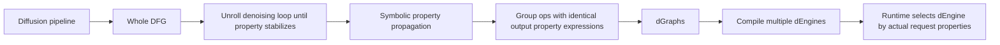

# Difflow DFG dGraph IR设计 对话记录

- 导出时间：2026-06-04 12:03 CST
- 来源：当前 Codex session 可用对话上下文
- 保存路径：human_notes/Difflow_DFG_dGraph_IR设计_对话记录.md
- 范围：仅用户输入与 Codex 最终输出

## 对话记录

### 001 User
# Context from my IDE setup:

## Active file: draft/review_draft.md

## Active selection of the file:
| **IR设计** | Difflow DFG/dGraph* | Denoising loop展开到收敛(≤5步)→符号属性传播(redundant? T/F)→dGraph分解(按输出属性表达式相同性对连续算子分组)→dEngine multi-version编译(每属性组合→不同dEngine, 运行时根据实际属性选择)。Symbolic shape propagation: ragged帧数→**合并到batch维或round-robin到GPU blocks** | 符号属性传播(Table 1规则, 如BatchMatmul [NHW] redundant传播)→跨迭代数据复用的编译时发现→消除冗余HBM读取 | Q3.1, paper_secs Difflow §4 (1488) |
## Open tabs:
- review_draft.md: draft/review_draft.md
- L3_horizon_summary.md: learning_outputs/20260529_185938__MoEDiT多模态Video__单GPUNPU加速器__多算子微算子并发__硬件体系结构/L3_horizon_summary.md
- L6_horizon_summary.md: learning_outputs/20260529_185938__MoEDiT多模态Video__单GPUNPU加速器__多算子微算子并发__硬件体系结构/L6_horizon_summary.md
- L5_horizon_summary.md: learning_outputs/20260529_185938__MoEDiT多模态Video__单GPUNPU加速器__多算子微算子并发__硬件体系结构/L5_horizon_summary.md
- L4_horizon_summary.md: learning_outputs/20260529_185938__MoEDiT多模态Video__单GPUNPU加速器__多算子微算子并发__硬件体系结构/L4_horizon_summary.md

## My request for Codex:
教我:'| **IR设计** | Difflow DFG/dGraph* | Denoising loop展开到收敛(≤5步)→符号属性传播(redundant? T/F)→dGraph分解(按输出属性表达式相同性对连续算子分组)→dEngine multi-version编译(每属性组合→不同dEngine, 运行时根据实际属性选择)。Symbolic shape propagation: ragged帧数→**合并到batch维或round-robin到GPU blocks** | 符号属性传播(Table 1规则, 如BatchMatmul [NHW] redundant传播)→跨迭代数据复用的编译时发现→消除冗余HBM读取 | Q3.1, paper_secs Difflow §4 (1488) |'

### 002 Codex Final
**一句话**
这行在讲：Difflow 把 diffusion pipeline 编译成一个带“数据属性标签”的 DFG，然后按属性相同的连续算子切成 `dGraph`，再给每个 `dGraph` 编译多个属性专用版本 `dEngine`，运行时根据请求是否冗余、shape 是否 ragged 来选最快版本。

**语义拆分**
| 段 | 关键词 | 你要抓住的意思 |
|---|---|---|
| S1 | `DFG/dGraph` | 先把 diffusion pipeline 表示成数据流图，再切成可独立优化的子图 |
| S2 | `denoising loop 展开` | 展开初始迭代直到“属性表达式稳定”，不是说图像生成 5 步收敛 |
| S3 | `symbolic property propagation` | 用布尔表达式推导每个 tensor 维度是否 redundant |
| S4 | `dEngine multi-version` | 一个 dGraph 对应多个专用执行版本 |
| S5 | `ragged shape / round-robin` | 不同帧数/尺寸请求通过 shape 变换或 tile 调度变得可 batch |
| S6 | `HBM read elimination` | 发现 K/V 等冗余数据后，少读少算 |

**核心流程**


Annotations:
`DFG` 是全 pipeline 的数据流图；`dGraph` 是按输出属性表达式相同切出来的子图；`dEngine` 是某个 dGraph 在某种属性条件下的专用执行引擎。运行时不是重新编译，而是在预编译版本里选。

**Table 1 怎么看**
比如 `Batch Matmul [NHW]` 的规则：

$$
A:[a_1,a_2,a_3],\quad B:[b_1,b_2,b_3]
$$

$$
BatchMatmul(A,B)\Rightarrow O:[a_1\land b_1,\ a_2,\ b_3]
$$

Annotations:
`a_i/b_i` 表示输入第 i 维是否冗余；`T` 是冗余，`F` 是不冗余，`∧` 是 AND。对 batch matmul 来说，输出 batch 维只有在两个输入 batch 维都冗余时才冗余；输出的 H 维继承第一个输入，W 维继承第二个输入。

**为什么要 dGraph**
如果整个 U-Net/DiT pipeline 一次性按所有输入属性组合编译，会爆炸。例如 14 个输入只考虑 redundant T/F 就可能是 `2^14 = 16384` 个版本。Difflow 的做法是：

```text
for op in DFG topological order:
    output_property[op] = propagation_rule(op, input_properties)

group consecutive ops if output_property expression is identical

for each dGraph:
    enumerate possible input property conditions
    prune impossible conditions
    prune low-benefit conditions
    compile remaining conditions into dEngines
```

Annotations:
“按输出属性分组”很关键，因为输出属性会继续影响后续算子；输入属性往往只带来某个单算子的局部优化。这样切图后，编译版本数从指数爆炸降到可控数量。

**Ragged 那句怎么理解**
`Symbolic shape propagation: ragged帧数→合并到batch维或round-robin到GPU blocks` 可以拆成两类：

1. 对有共享权重的算子，如 `Matmul/Conv`：把 ragged 维度压平到 batch 维，变成 regular kernel 能处理的形状。  
   例：`[B, m_hat, K] -> [sum(m_i), K]`，然后调用普通 matmul。

2. 对无跨请求共享数据的算子，如 `transpose/reduce`：每个请求单独切 tile，再把 tile round-robin 分配给 GPU thread blocks。

Annotations:
这里的 `round-robin` 是 Difflow ragged kernel 的 tile 映射策略，不等于 NVIDIA GPU 硬件 block scheduler 一定是 round-robin。

**HBM 读取为什么能省**
典型例子是 attention：多个请求 prompt 相同，则 K/V 相同。

```text
Baseline:
Q1 attends K1,V1
Q2 attends K2,V2
Q3 attends K3,V3
where K1=K2=K3, V1=V2=V3

Difflow:
K_compact = unique(K1,K2,K3)
V_compact = unique(V1,V2,V3)
Q_concat = concat(Q1,Q2,Q3)
FlashAttention(Q_concat, K_compact, V_compact)
```

Annotations:
这样 K/V 不用按 batch 重复从 HBM 读，也少做重复 attention 计算。你这行里的“跨迭代数据复用”还和 Difflow 的 invariant tensor elimination 有关：常量可编译期预计算，loop-invariant 可移出 denoising loop。

**最容易误读的点**
`≤5步收敛` 指属性表达式/loop inputs 稳定，不是 diffusion 采样质量 5 步收敛。  
`dGraph` 不是 CUDA Graph，而是数据属性感知的子图。  
`dEngine` 不是一份新模型参数，而是某个 dGraph 的专用执行版本。  
这行的主旨是：用 IR 把“请求之间相同、shape 不同、loop 中不变”这些数据特征显式化，然后让编译器和调度器利用它们。

证据主要来自 [Difflow §4](</data3/paper_analysis/paper_secs/secs_2026/29-Difflow A Data-Characteristic-Aware Serving System for Diffusion Models/4-Compile-Time-Optimizations.md>)、[Symbolic Data Property Propagation](</data3/paper_analysis/knowledge_notes/编译知识笔记/Symbolic Data Property Propagation for Diffusion Pipelines（扩散管道的符号化数据属性传播）.md>)、[dGraph/dTask/dEngine](</data3/paper_analysis/knowledge_notes/系统知识笔记/dGraph, dTask, and dEngine_ Data-Property-Aware Diffusion Pipeline Decomposition and Scheduling（数据属性.md>)。

### 003 User
# Context from my IDE setup:

## Active file: draft/review_draft.md

## Open tabs:
- review_draft.md: draft/review_draft.md
- L3_horizon_summary.md: learning_outputs/20260529_185938__MoEDiT多模态Video__单GPUNPU加速器__多算子微算子并发__硬件体系结构/L3_horizon_summary.md
- L6_horizon_summary.md: learning_outputs/20260529_185938__MoEDiT多模态Video__单GPUNPU加速器__多算子微算子并发__硬件体系结构/L6_horizon_summary.md
- L5_horizon_summary.md: learning_outputs/20260529_185938__MoEDiT多模态Video__单GPUNPU加速器__多算子微算子并发__硬件体系结构/L5_horizon_summary.md
- L4_horizon_summary.md: learning_outputs/20260529_185938__MoEDiT多模态Video__单GPUNPU加速器__多算子微算子并发__硬件体系结构/L4_horizon_summary.md

## My request for Codex:
[$export-conversation-notes](/data3/paper_analysis/.codex/skills/export-conversation-notes/SKILL.md) 

### 004 User
<skill>
<name>export-conversation-notes</name>
<path>/data3/paper_analysis/.codex/skills/export-conversation-notes/SKILL.md</path>
---
name: export-conversation-notes
description: Export the currently available Codex/chat session record into a target Markdown file, defaulting to human_notes/. Save only user inputs and Codex final outputs. Use when the user asks to save, archive, output, or record the current conversation, dialogue history, or analysis session in the paper_analysis workspace. If the target Markdown file already exists and is non-empty, append incrementally without modifying, deleting, reformatting, or replacing any existing content.
---

# Export Conversation Notes

## Overview

Save the current session's available user inputs and Codex final outputs to the requested target location. Default to `human_notes/` when no explicit directory is provided. Default to Chinese for headings and status text. Do not save process notes, status updates, tool calls, command outputs, hidden instructions, or intermediate work logs.

## Workflow

1. Identify the target path.
   - save under `human_notes/`.
   - If no filename can be identified, use `<session-name>.md` and <session-name> is the name of the current session.

2. Prepare the target file.
   - Work relative to the current workspace root.
   - Ensure the destination directory exists.
   - Sanitize only the filename portion by replacing filesystem-hostile characters such as `/`, `\`, `:`, `*`, `?`, `"`, `<`, `>`, and `|` with safe separators, then trim whitespace.
   - Save to the resolved target path.

3. Capture the available conversation record.
   - Output only user inputs and Codex final outputs in chronological order with speaker labels.
   - Include all available user messages exactly as written.
   - Include only Codex final responses that answer the user, not interim progress updates or tool-facing content.
   - Do not include tool calls, shell commands, command outputs, file edit logs, errors from tools, status updates, planning chatter, hidden system/developer/policy/runtime instructions, or intermediate reasoning.
   - Do not summarize, compress, paraphrase, normalize, or reorganize the saved user inputs and final outputs.
   - If earlier user inputs or final outputs are unavailable because context was compacted or not exposed to Codex, state this limitation briefly before the saved conversation.

4. Write the Markdown file.
   - If the file does not exist, create it with the new-file template.
   - If the file exists but is empty, write the new-file template.
   - If the file exists and is non-empty, enter incremental mode: append a new dated section only at the end of the file.
   - In incremental mode, never modify, delete, reorder, summarize, normalize, reformat, or replace any existing content, even if the existing note has typos, duplicate headings, stale metadata, or inconsistent formatting.
   - In incremental mode, use an append-only edit. With `apply_patch`, add only new lines after the existing final line.
   - Keep the saved record readable, but preserve the available user inputs and final outputs over brevity.
   - If the record is too long for one edit, append it in multiple consecutive chunks until all currently available user inputs and final outputs are saved.

## Markdown Template

For a new file, use this structure:

```md
# <session-or-paper-title>

- 导出时间：<YYYY-MM-DD HH:MM TZ>
- 来源：当前 Codex session 可用对话上下文
- 保存路径：<resolved-target-path>
- 范围：仅用户输入与 Codex 最终输出

## 对话记录

### 001 User
<用户消息原文>

### 002 Codex Final
<Codex 最终回复原文>
```

For appending to an existing non-empty file, add this block at the end of the file without changing earlier content:

```md
---

## 对话记录补充：<YYYY-MM-DD HH:MM TZ>

<continue the same chronological format, saving only user inputs and Codex final outputs>
```

## Completion Response

After saving, respond briefly with the output path and whether the file was created or appended. Mention any uncertainty about target inference or incomplete available conversation context.

</skill>
