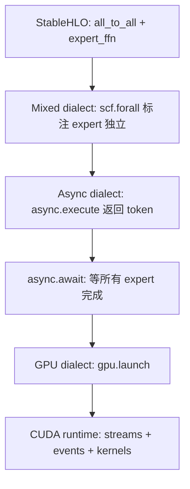

# MLIR MoE IR设计对话记录

- 导出时间：2026-06-04 11:43 CST
- 来源：当前 Codex session 可用对话上下文
- 保存路径：human_notes/MLIR_MoE_IR设计对话记录.md
- 范围：仅用户输入与 Codex 最终输出

## 对话记录

### 001 User
<environment_context>
  <cwd>/data3/paper_analysis</cwd>
  <shell>bash</shell>
  <current_date>2026-06-04</current_date>
  <timezone>Asia/Shanghai</timezone>
  <filesystem><workspace_roots><root>/data3/paper_analysis</root></workspace_roots><permission_profile type="managed"><file_system type="restricted"><entry access="read"><special>:root</special></entry><entry access="write"><path>/data3/paper_analysis</path></entry><entry access="write"><special>:slash_tmp</special></entry><entry access="write"><special>:tmpdir</special></entry><entry access="read"><path>/data3/paper_analysis/.git</path></entry><entry access="read"><path>/data3/paper_analysis/.agents</path></entry><entry access="read"><path>/data3/paper_analysis/.codex</path></entry></file_system></permission_profile></filesystem>
</environment_context>

### 002 User
# Context from my IDE setup:

## Active file: draft/review_draft.md

## Active selection of the file:
| **IR设计** | MLIR scf.forall + async.execute | 四层lowering：StableHLO (**all_to_all** op)→Mixed dialect (scf.forall标注expert迭代独立→编译器并发发射)+Async dialect (async.execute token→显式并发+async.await barrier)→GPU lowering (async.execute→独立CUDA Stream, async.await→cudaEventRecord/WaitEvent)。Polyhedral affine融合：affine-loop-fusion→scalar-replacement→parallelize→GPU lowering (gpu.launch+map-parallel-loops) | scf.forall适合规则并行 (各expert计算量相近, 可fusion/tiling)；async.execute适合不规则并行+灵活device placement+通信overlap | Q3.1, Q3.4 (MLIR笔记578/2553) |
## Open tabs:
- review_draft.md: draft/review_draft.md
- L6_horizon_summary.md: learning_outputs/20260529_185938__MoEDiT多模态Video__单GPUNPU加速器__多算子微算子并发__硬件体系结构/L6_horizon_summary.md
- L5_horizon_summary.md: learning_outputs/20260529_185938__MoEDiT多模态Video__单GPUNPU加速器__多算子微算子并发__硬件体系结构/L5_horizon_summary.md
- L4_horizon_summary.md: learning_outputs/20260529_185938__MoEDiT多模态Video__单GPUNPU加速器__多算子微算子并发__硬件体系结构/L4_horizon_summary.md
- L3_horizon_summary.md: learning_outputs/20260529_185938__MoEDiT多模态Video__单GPUNPU加速器__多算子微算子并发__硬件体系结构/L3_horizon_summary.md

## My request for Codex:
教我:'| **IR设计** | MLIR scf.forall + async.execute | 四层lowering：StableHLO (**all_to_all** op)→Mixed dialect (scf.forall标注expert迭代独立→编译器并发发射)+Async dialect (async.execute token→显式并发+async.await barrier)→GPU lowering (async.execute→独立CUDA Stream, async.await→cudaEventRecord/WaitEvent)。Polyhedral affine融合：affine-loop-fusion→scalar-replacement→parallelize→GPU lowering (gpu.launch+map-parallel-loops) | scf.forall适合规则并行 (各expert计算量相近, 可fusion/tiling)；async.execute适合不规则并行+灵活device placement+通信overlap | Q3.1, Q3.4 (MLIR笔记578/2553) |'

### 003 Codex Final
可以把这行翻译成一句白话：

**用 MLIR 把 MoE 层里的“token 跨 GPU 通信”和“多个 expert 并行计算”表达出来，再逐层 lowering 成 GPU 上的 kernel、stream 和 event。**

**语义切分**

| 段落 | 关键词 | 作用 |
|---|---|---|
| S1 | `MLIR`, `scf.forall`, `async.execute` | 说明 IR 设计选型 |
| S2 | `StableHLO all_to_all`, Mixed dialect, Async dialect, GPU lowering | 说明从高层语义到 GPU 执行的 lowering 链 |
| S3 | `affine-loop-fusion`, `scalar-replacement`, `parallelize`, `gpu.launch` | 说明规则 loop 的 polyhedral 优化路径 |
| S4 | 规则并行 vs 不规则并行, fusion/tiling, device placement, communication overlap | 说明什么时候用 `scf.forall`，什么时候用 `async.execute` |

**核心直觉**

MoE 一层通常是：

```text
Router 选 expert
→ All-to-All dispatch：把 token 发到 expert 所在 GPU
→ 每个 expert 独立 FFN 计算
→ All-to-All combine：把结果发回 token 原 GPU
```

所以 IR 里要表达两件事：

1. **通信**：`all_to_all` 表达 token 在设备之间重新分布。
2. **计算并发**：多个 expert 彼此独立，可以同时算。

`scf.forall` 负责表达“这些 expert 迭代彼此独立”；`async.execute` 负责表达“这些任务可以异步发射，之后用 token/barrier 等待”。

**Lowering 链**



Annotations:

- `StableHLO all_to_all`：高层 collective op，说明 token 要跨设备交换。
- `scf.forall`：告诉编译器每个 expert iteration 没有循环依赖。
- `async.execute`：把 expert 计算或通信包装成异步任务。
- `async.await`：相当于 gather barrier，等所有异步任务完成。
- `gpu.launch`：把并行 region 变成 GPU kernel launch。
- CUDA stream/event：一种可能的 GPU runtime 实现方式，`async.execute` 可映射到独立 stream，`await` 可映射到 event wait。

**小例子**

```mlir
%dispatched = stablehlo.all_to_all %tokens

scf.forall (%e) in (0 to %num_experts) {
  %t = async.execute {
    call @expert_ffn(%dispatched[%e])
    async.yield
  }
}

async.await_all
%combined = stablehlo.all_to_all %expert_outputs
```

Annotations:

- 第一行是 dispatch，把 token 按 expert 位置重排。
- `scf.forall` 表示 expert 维度上的并行循环。
- 每个 `async.execute` 是一个可并发发射的 expert 任务。
- `await_all` 是 combine 前的同步点。
- 第二个 `all_to_all` 把 expert 输出发回原 token 所属位置。

**为什么还要 affine/polyhedral 那条线？**

`affine-loop-fusion → scalar-replacement → parallelize → GPU lowering` 是另一条偏“规则循环优化”的路径。

它适合 DiT、Video、规则 FFN 这类循环结构比较稳定的计算：

```text
多个小 loop
→ affine-loop-fusion 合成大 loop
→ scalar-replacement 消掉临时 buffer
→ affine-parallelize 标注并行
→ gpu.launch 映射到 GPU
```

如果 expert 负载差不多，`scf.forall/affine` 路线好，因为编译器能做 fusion、tiling、buffer 优化。  
如果 expert 负载差很多，或者要把通信和计算重叠，`async.execute` 更自然，因为它能表达“任务什么时候发、什么时候等、能不能放到别的 stream/device”。

**一句记忆法**

`scf.forall` 是“这个循环的每一轮都能并行”。  
`async.execute` 是“这个任务先发出去，之后我拿 token 再等它”。  
`gpu.launch` 是“最后真的变成 GPU kernel”。  
`all_to_all` 是“MoE token 跨 GPU 找 expert 的搬运”。

本地证据主要来自：

- `learning_outputs/.../Q3.1_L3_answer.md`
- `learning_outputs/.../Q3.4_L3_answer.md`
- `knowledge_notes/编译知识笔记/MLIR (Multi-Level Intermediate Representation).md`
- `knowledge_notes/系统知识笔记/All-to-All Communication in MoE Training.md`
- `paper_secs/.../2.-CUDA-PROGRAMMING-MODEL.md`

### 004 User
# Context from my IDE setup:

## Active file: draft/review_draft.md

## Active selection of the file:
**用 MLIR 把 MoE 层里的“token 跨 GPU 通信”和“多个 expert 并行计算”表达出来，再逐层 lowering 成 GPU 上的 kernel、stream 和 event**
## Open tabs:
- review_draft.md: draft/review_draft.md
- L3_horizon_summary.md: learning_outputs/20260529_185938__MoEDiT多模态Video__单GPUNPU加速器__多算子微算子并发__硬件体系结构/L3_horizon_summary.md
- L6_horizon_summary.md: learning_outputs/20260529_185938__MoEDiT多模态Video__单GPUNPU加速器__多算子微算子并发__硬件体系结构/L6_horizon_summary.md
- L5_horizon_summary.md: learning_outputs/20260529_185938__MoEDiT多模态Video__单GPUNPU加速器__多算子微算子并发__硬件体系结构/L5_horizon_summary.md
- L4_horizon_summary.md: learning_outputs/20260529_185938__MoEDiT多模态Video__单GPUNPU加速器__多算子微算子并发__硬件体系结构/L4_horizon_summary.md

## My request for Codex:
[$export-conversation-notes](/data3/paper_analysis/.codex/skills/export-conversation-notes/SKILL.md) 

### 005 User
<skill>
<name>export-conversation-notes</name>
<path>/data3/paper_analysis/.codex/skills/export-conversation-notes/SKILL.md</path>
---
name: export-conversation-notes
description: Export the currently available Codex/chat session record into a target Markdown file, defaulting to human_notes/. Save only user inputs and Codex final outputs. Use when the user asks to save, archive, output, or record the current conversation, dialogue history, or analysis session in the paper_analysis workspace. If the target Markdown file already exists and is non-empty, append incrementally without modifying, deleting, reformatting, or replacing any existing content.
---

# Export Conversation Notes

## Overview

Save the current session's available user inputs and Codex final outputs to the requested target location. Default to `human_notes/` when no explicit directory is provided. Default to Chinese for headings and status text. Do not save process notes, status updates, tool calls, command outputs, hidden instructions, or intermediate work logs.

## Workflow

1. Identify the target path.
   - save under `human_notes/`.
   - If no filename can be identified, use `<session-name>.md` and <session-name> is the name of the current session.

2. Prepare the target file.
   - Work relative to the current workspace root.
   - Ensure the destination directory exists.
   - Sanitize only the filename portion by replacing filesystem-hostile characters such as `/`, `\`, `:`, `*`, `?`, `"`, `<`, `>`, and `|` with safe separators, then trim whitespace.
   - Save to the resolved target path.

3. Capture the available conversation record.
   - Output only user inputs and Codex final outputs in chronological order with speaker labels.
   - Include all available user messages exactly as written.
   - Include only Codex final responses that answer the user, not interim progress updates or tool-facing content.
   - Do not include tool calls, shell commands, command outputs, file edit logs, errors from tools, status updates, planning chatter, hidden system/developer/policy/runtime instructions, or intermediate reasoning.
   - Do not summarize, compress, paraphrase, normalize, or reorganize the saved user inputs and final outputs.
   - If earlier user inputs or final outputs are unavailable because context was compacted or not exposed to Codex, state this limitation briefly before the saved conversation.

4. Write the Markdown file.
   - If the file does not exist, create it with the new-file template.
   - If the file exists but is empty, write the new-file template.
   - If the file exists and is non-empty, enter incremental mode: append a new dated section only at the end of the file.
   - In incremental mode, never modify, delete, reorder, summarize, normalize, reformat, or replace any existing content, even if the existing note has typos, duplicate headings, stale metadata, or inconsistent formatting.
   - In incremental mode, use an append-only edit. With `apply_patch`, add only new lines after the existing final line.
   - Keep the saved record readable, but preserve the available user inputs and final outputs over brevity.
   - If the record is too long for one edit, append it in multiple consecutive chunks until all currently available user inputs and final outputs are saved.

## Markdown Template

For a new file, use this structure:

```md
# <session-or-paper-title>

- 导出时间：<YYYY-MM-DD HH:MM TZ>
- 来源：当前 Codex session 可用对话上下文
- 保存路径：<resolved-target-path>
- 范围：仅用户输入与 Codex 最终输出

## 对话记录

### 001 User
<用户消息原文>

### 002 Codex Final
<Codex 最终回复原文>
```

For appending to an existing non-empty file, add this block at the end of the file without changing earlier content:

```md
---

## 对话记录补充：<YYYY-MM-DD HH:MM TZ>

<continue the same chronological format, saving only user inputs and Codex final outputs>
```

## Completion Response

After saving, respond briefly with the output path and whether the file was created or appended. Mention any uncertainty about target inference or incomplete available conversation context.

</skill>
