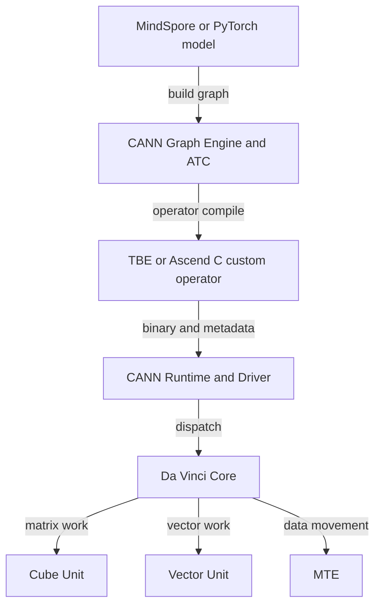
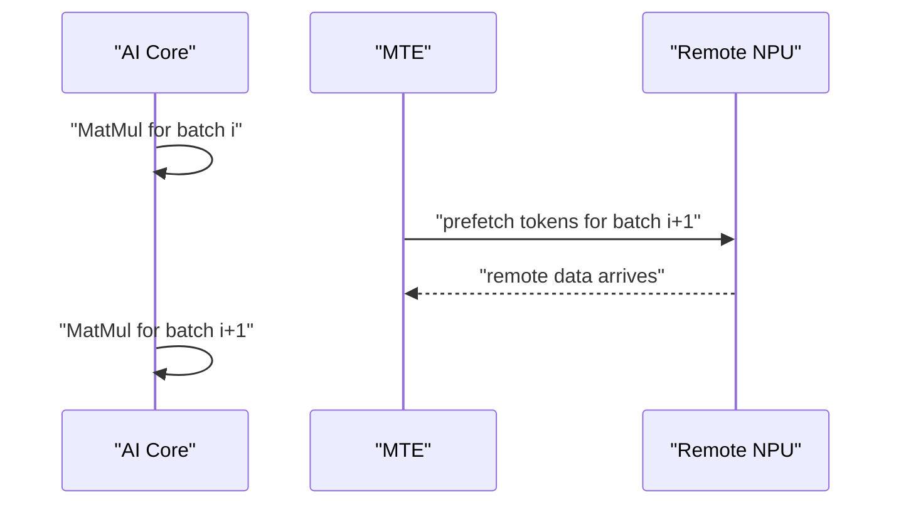
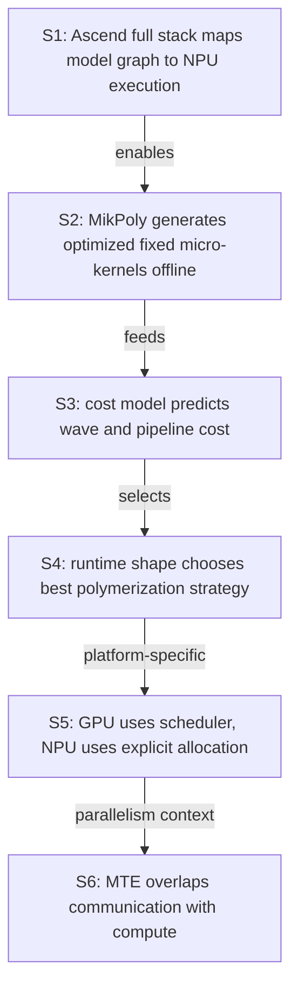

# MoEDiT多模态Video__单GPUNPU加速器__多算子微算子并发__硬件体系结构_对话记录

- 导出时间：2026-06-03 17:30 CST
- 来源：当前 Codex session 可用对话上下文
- 保存路径：human_notes/MoEDiT多模态Video__单GPUNPU加速器__多算子微算子并发__硬件体系结构_对话记录.md
- 范围：仅用户输入与 Codex 最终输出
- 说明：已排除环境上下文、技能说明块、工具调用过程与中间进度消息。

## 对话记录

### 001 User
# Context from my IDE setup:

## Active file: learning_outputs/20260529_185938__MoEDiT多模态Video__单GPUNPU加速器__多算子微算子并发__硬件体系结构/Q1.3_L1_answer.md

## Open tabs:
- Q1.3_L1_answer.md: learning_outputs/20260529_185938__MoEDiT多模态Video__单GPUNPU加速器__多算子微算子并发__硬件体系结构/Q1.3_L1_answer.md
- SKILL.md: .claude/skills/obsidian-keyword-explain/SKILL.md
- SKILL.md: .codex/skills/obsidian-keyword-explainer/SKILL.md
- mcp-obsidian-obsidian_search_notes-1780403536477.txt: /home/descfly/.claude/projects/-data3-paper-analysis/1cd5113f-572b-4909-9206-79a781b56db6/tool-results/mcp-obsidian-obsidian_search_notes-1780403536477.txt
- Q1.4_L1_answer.md: learning_outputs/20260529_185938__MoEDiT多模态Video__单GPUNPU加速器__多算子微算子并发__硬件体系结构/Q1.4_L1_answer.md

## My request for Codex:
'### 方法7: 华为昇腾 Ascend 910B — CANN + MindSpore + MikPoly

**笔记证据**: `paper_secs/secs_2025/69-Optimizing Dynamic-Shape Neural Networks on Accelerators.../1-Introduction.md` (score: 471.5); `knowledge_notes/kernel知识笔记/All-to-All Communication in MoE.md` (score: 461.4)

**方法细节**（L1 粒度 —— Ascend NPU 全栈推理 Pipeline + 动态 Shape 编译）:

```
Ascend NPU 推理全栈 (Da Vinci 架构):
======================================

软件栈层次:
  Layer 5: PyTorch/MindSpore (高层框架)
  Layer 4: CANN Graph Engine + ATC (图编译与模型转换)
  Layer 3: TBE (Tensor Boost Engine, 自定义算子 DSL)
  Layer 2: Ascend C (类似 CUDA, 自定义 kernel 编程)
  Layer 1: Driver + Runtime (Da Vinci Core 指令调度)

硬件架构 (Ascend 910B):
  ┌──────────────────────────────────────────┐
  │ Da Vinci Core × N                         │
  │  ├── Cube Unit (矩阵乘, 类似 Tensor Core) │
  │  ├── Vector Unit (激活函数, Norm, Softmax) │
  │  ├── Scalar Unit (控制流, Router 计算)    │
  │  └── MTE (Memory Transfer Engine)         │
  │       └── 远程内存访问, All-to-All 卸载   │
  ├── L1 Buffer (Cube Unit 专用)              │
  ├── Unified Buffer (Vector/Scalar 共享)     │
  ├── 64 GB HBM (~1.2 TB/s)                  │
  └── HCCS 互联 (节点内 NPU 间)               │
       + RoCE (节点间)                        │
```

**MikPoly 动态 Shape 编译 (GPU + NPU 双平台)**:

```
MikPoly 两阶段微 Kernel 聚合编译:
==================================

=== 离线: 微 Kernel 生成 (一次, ~6h for GEMM on GPU) ===
输入: 算子类型 (GEMM/Conv), 目标硬件 H

1. 生成 Program Template Q:
   Q = Q_offline (内层 tile 循环, 优化 M_local)
       + Q_online  (外层循环, 优化 M_global)

2. 从 Q_offline 提取 Micro-Kernel Template K_hat:
   for uM,uN,uK in range(16,512,16):
       micro_kernel = AutoTune(K_hat, (uM,uN,uK), H)
       // GPU: CUTLASS-based templates
       // NPU: manual TBE templates

3. 剪枝: 保留 Top-40 (n_mik=40) 高性能 micro-kernel
   // 评估: 在合成 shape {2^i} 上的平均性能

4. 构建 Micro-Kernel 性能模型 g_predict(t, K, H):
   // 单 PE 上测量不同 t 的 pipeline 延迟
   // 分段线性函数, t=1..5120

=== 在线: Micro-Kernel 聚合 (运行时, <1ms) ===
输入: 运行时 shape (M,N,K), S_K 微 Kernel 集合

5. 遍历聚合模式 (GPU: Pattern I+II; NPU: Pattern I-IX):
   for each pattern:
       生成聚合策略 (从 S_K 选择 micro-kernel 组合)
       // 启发式: 早期剪枝——若部分组合 cost 已超已知最优则跳过

6. 聚合成本模型评估 (Eq 2-4):
   Cost(S,H) = Σ_{(R_i,K_i)∈S} f_wave(R_i,K_i,H) × f_pipe(R_i,K_i,H)
     f_wave: 跨 PE 的 parallel wave 数
     f_pipe:  单 PE 的 pipeline 延迟

7. 选最优策略, 实例化 micro-kernel (偏移量/地址参数化)
   NPU: max-min 静态分配→各 Da Vinci Core
   GPU: 动态分配→SM hardware scheduler

结果 (MikPoly):
  GPU A100: 1.29× avg speedup, 峰值 11.05× vs cuBLAS
  NPU Ascend 910: 1.70× avg speedup, 峰值 15.32× vs CANN
```

**注解**:
- **NPU vs GPU 编译差异**: Ascend 需软件显式管理 L1 Buffer 分配；GPU hardware scheduler 自动分配 thread blocks→SM
- **动态 Shape 覆盖**: MikPoly benchmark 覆盖 DeepBench (166 测试例) + 真实应用 (1267 测试例)，含 BERT/CNN/Transformer GEMM 的全范围动态 shape
- **MTE 优势 (ETR 论文)**: Communication over Computation——当前 batch 的 MatMul 与下一 batch 的 All-to-All 通信在 MTE 上并行执行。训练效率提升 5.4-46.6% (32N/64N/256N Ascend NPU 集群)
- **NPU 并发能力**: 多级 on-chip buffer (L1+UB) 可分区给不同并发算子，MTE 提供额外的通信并发通道

**实验环境**:
- **硬件**: Ascend 910 (32 GB HBM, Da Vinci Core)；对比 A100 (80 GB, SM + Tensor Core)
- **模型**: BERT (Transformer 语言模型), AlexNet/ResNet/VGG (CNN)
- **benchmark**: DeepBench (166 shapes), 真实应用 (1267 shapes)
- **软件**: CANN SDK v5.1.RC1, MindSpore v1.7; 对比 cuBLAS v11.5, cuDNN, CUTLASS v2.9
- **硬件适配**: MikPoly 通过统一硬件抽象 H=(P_multi, M_local, M_global) 同时适配 GPU SMs 和 NPU Da Vinci Cores

---',教我,解释伪代码. [$obsidian-keyword-explainer](/data3/paper_analysis/.codex/skills/obsidian-keyword-explainer/SKILL.md) 

### 002 Codex Final
## Paper Context

这段主要来自 MikPoly 论文：`Optimizing Dynamic-Shape Neural Networks on Accelerators via On-the-Fly Micro-Kernel Polymerization`。核心思想一句话：**把动态 shape 的大算子拆成很多固定尺寸 micro-kernel，离线调好，在线按真实 shape 快速拼接。**

## Semantic Segments

| Segment | Keywords | Semantic Role |
|---|---|---|
| S1 | Ascend NPU, Da Vinci, CANN, MindSpore, TBE, Ascend C | 平台栈：代码如何落到 NPU |
| S2 | Q, Q_offline, Q_online, K_hat, micro-kernel | MikPoly 离线阶段：生成小内核 |
| S3 | g_predict, f_wave, f_pipe, Cost | 代价模型：怎么判断哪个组合快 |
| S4 | polymerization pattern, strategy, S_K, S* | 在线阶段：运行时拼 micro-kernel |
| S5 | NPU vs GPU, max-min allocation, SM scheduler | 平台差异：NPU 更显式，GPU 更自动 |
| S6 | MTE, All-to-All, CoC | 通信计算重叠：MoE 场景的并发收益 |

## Context Summary

| Path | Matched Keywords | Score |
|---|---:|---:|
| `paper_secs/.../69-Optimizing Dynamic-Shape.../1-Introduction.md` | MikPoly, dynamic shape, micro-kernel, cost model | 205.9 / 690.5 / 1246.6 / 798.3 |
| `paper_secs/.../69-Optimizing Dynamic-Shape.../5.2.1-Optimizing-Dynamic-Shape-Operators..md` | dynamic shape, MikPoly-Wave, cost model | 1867.4 / 368.1 / 460.5 |
| `knowledge_notes/硬件知识笔记/Ascend NPU Architecture (AI Core _ AI Vector _ Da Vinci).md` | Ascend, Da Vinci, MTE, Ascend C | 397.0 / 1820.9 / 23.5 / 1133.7 |
| `knowledge_notes/编译知识笔记/CANN (Compute Architecture for Neural Networks).md` | CANN, Ascend C | 546.4 / 680.1 |
| `knowledge_notes/kernel知识笔记/CoC (Communication over Computation).md` | MTE, CoC, Ascend C | 32.9 / 1340.5 |
| `knowledge_notes/kernel知识笔记/All-to-All Communication in MoE.md` | All-to-All, MTE | 3088.6 / 25.0 |
| `knowledge_notes/kernel知识笔记/Micro-Kernel Specialization...md` | micro-kernel | 2443.9 |

## S1: Ascend NPU 伪代码在说什么

这段：

```text
Layer 5: PyTorch/MindSpore
Layer 4: CANN Graph Engine + ATC
Layer 3: TBE
Layer 2: Ascend C
Layer 1: Driver + Runtime
```

可以读成：**上层模型图先由 MindSpore/PyTorch 表达，CANN 把图编译成 Ascend 可执行计划，TBE/Ascend C 用来做自定义算子，Runtime/Driver 最后把任务调度到 Da Vinci Core。**



Annotations:
- `CANN Graph Engine + ATC` 是图编译与模型转换层。
- `TBE` 是 Ascend AI Core 自定义算子开发框架，官方文档说明它基于 TVM，用于生成可在 Ascend AI Processor 上运行的算子程序。
- `Cube Unit` 对应矩阵乘主力；`Vector Unit` 更适合激活、Norm、elementwise；`MTE` 负责搬数据。

Web Supplement:
- Huawei Ascend TBE docs: https://www.hiascend.com/document/detail/en/canncommercial/800/opdevg/tbeaicpudevg/atlasopdev_10_0010.html

## S2: 离线阶段伪代码逐行解释

你可以把 MikPoly 离线阶段理解成：**先做一盒“规格不同但都调优过”的小 GEMM 积木。**

```text
Q = Q_offline + Q_online
K_hat = extract(Q_offline)
for uM,uN,uK in range(16,512,16):
    micro_kernel = AutoTune(K_hat, (uM,uN,uK), H)
keep Top-40 micro-kernels
build g_predict(t, K, H)
```

翻译成人话：

```pseudo
function Offline_Generation(Q, H):
    K_hat = extract_inner_tile_loops(Q.offline)
    candidates = []

    for uM in 16..512 step 16:
        for uN in 16..512 step 16:
            for uK in 16..512 step 16:
                K = autotune(K_hat, tile=(uM, uN, uK), hardware=H)
                candidates.append(K)

    ranked = rank_by_synthetic_shapes(candidates)
    S_K = keep_top(ranked, n_mik=40)

    for K in S_K:
        g_predict[K] = fit_pipeline_latency_model(K, H)

    return S_K, g_predict
```

Annotations:
- `Q` 是完整算子模板，比如 GEMM 的多层循环。
- `Q_offline` 是最内层 tile 循环，负责单个 PE 内部的高效计算。
- `K_hat` 是 micro-kernel 模板，不是具体 kernel；填入 `(uM,uN,uK)` 后才变成固定尺寸 kernel。
- `Top-40` 的目的不是“只要 40 个够用”，而是为了把在线搜索空间压小。

## S3: Cost Model 为什么这么写

MikPoly 在线不能真的把所有组合都跑一遍，所以用代价模型估算：

$$
S^* = \operatorname*{arg\,min}_{S \in S_S} \operatorname{Cost}(S,H)
$$

$$
\operatorname{Cost}(S,H)
=
\sum_{(R_i,K_i)\in S}
f_{\mathrm{wave}}(R_i,K_i,H)
\cdot
f_{\mathrm{pipe}}(R_i,K_i,H)
$$

Annotations:
- `S` 是一种完整拼法，也就是“哪些区域用哪个 micro-kernel”。
- `R_i` 是被某个 pattern 切出来的计算区域。
- `f_wave` 估计需要多少轮 PE wave 才能跑完所有并行 tile。
- `f_pipe` 估计单个 PE 上一条流水任务要多久。
- 只看 `f_wave` 会偏向大 tile；只看 `f_pipe` 会偏向小 tile。MikPoly 同时看二者。

更具体一点：

$$
f_{\mathrm{wave}}(R_i,K_i,H)
=
\left\lceil
\frac{f_{\mathrm{parallel}}(R_i,K_i)}
{|P_{\mathrm{multi}}|}
\right\rceil
$$

$$
f_{\mathrm{pipe}}(R_i,K_i,H)
=
g_{\mathrm{predict}}(f_{\mathrm{num}}(R_i,K_i),K_i,H)
$$

Annotations:
- `|P_multi|` 在 GPU 上是 SM 数，在 Ascend NPU 上是 Da Vinci Core 数。
- `f_parallel` 是非 reduction 维度产生的并行任务数。
- `f_num` 是 reduction loop 里同一个 micro-kernel 要重复多少次。
- `g_predict` 是离线拟合出的分段线性延迟模型。

## S4: 在线聚合阶段怎么跑

在线阶段的输入是运行时 shape，例如 `(M,N,K)=(4096,1024,4096)`。此时 MikPoly 不重新 autotune，只做快速组合搜索。

```pseudo
function Online_Polymerization(Q, S_K, H, shape):
    best_cost = infinity
    best_strategy = null

    for pattern in patterns(H):
        regions = split_online_loops(Q.online, pattern, shape)

        for strategy in enumerate_micro_kernel_choices(regions, S_K):
            cost = 0

            for region, K in strategy:
                cost += f_wave(region, K, H) * f_pipe(region, K, H)

                if cost >= best_cost:
                    break  // early pruning

            if cost < best_cost:
                best_cost = cost
                best_strategy = strategy

    S_star = instantiate(best_strategy, shape)
    return S_star
```

Annotations:
- `pattern` 决定“把输出区域怎么切”。
- `strategy` 决定“每个区域用哪个 micro-kernel”。
- `early pruning` 是在线低开销的关键：当前部分成本已经超过最好方案，就不继续算。
- `instantiate` 不是重新编译大 kernel，而是填地址偏移、loop bound、micro-kernel 参数。

## S5: 为什么 NPU 和 GPU 分支不同

| 项目 | GPU A100 | Ascend NPU |
|---|---|---|
| PE | SM | Da Vinci Core |
| Tensor 单元 | Tensor Core | Cube Unit |
| local memory | shared memory/register | L1 buffer/Unified Buffer/L0/register |
| micro-kernel 生成 | CUTLASS-based templates | manual TBE templates |
| 在线 pattern | I-II | I-IX |
| 任务分配 | hardware scheduler 自动把 blocks 分配到 SM | max-min 静态分配到 Da Vinci Core |

关键差异：**GPU 的 block 调度更依赖硬件 scheduler；Ascend NPU 更需要软件显式安排 core、buffer、pattern。**

## S6: MTE + All-to-All 注解怎么理解

这段和 MikPoly 不是同一个优化点，但它解释 Ascend 的“并发通道”优势：MoE 中 All-to-All 要把 token 发到 expert 所在设备，传统流程会让计算和通信串行。



Annotations:
- `AI Core` 跑当前 batch 的 FFN MatMul。
- `MTE` 同时搬下一 batch 的 All-to-All 数据。
- 如果通信时间和计算时间接近，总耗时从 `T_compute + T_comm` 接近变成 `max(T_compute, T_comm)`。
- 笔记证据里 ETR 的 CoC 在 32N/64N/256N Ascend NPU 集群上报告训练效率提升 5.4%-46.6%。

## Paragraph Synthesis



Annotations:
- 主链条是：软件栈提供可执行平台，MikPoly 提供动态 shape 算子优化，MTE/All-to-All 提供 MoE 通信并发背景。
- 你这段伪代码的核心不是“Ascend 比 GPU 快”，而是“在 NPU 上，动态 shape 编译和资源调度要更显式”。

## 最短记忆版

MikPoly = **离线调 micro-kernel，在线拼 micro-kernel**。  
`f_wave` 管“并行任务要跑几波”，`f_pipe` 管“单个流水任务多慢”。  
Ascend 侧的难点是：Da Vinci Core、L1/UB、TBE/Ascend C、MTE 这些资源更需要软件显式安排。

### 003 User
# Context from my IDE setup:

## Open tabs:
- Q1.3_L1_answer.md: learning_outputs/20260529_185938__MoEDiT多模态Video__单GPUNPU加速器__多算子微算子并发__硬件体系结构/Q1.3_L1_answer.md
- L1_horizon_summary.md: learning_outputs/20260529_185938__MoEDiT多模态Video__单GPUNPU加速器__多算子微算子并发__硬件体系结构/L1_horizon_summary.md
- SKILL.md: .codex/skills/export-conversation-notes/SKILL.md
- Accelerating Sparse Transformer Inference on GPU (STOF).md: human_notes/Accelerating Sparse Transformer Inference on GPU (STOF).md
- Adaptive Draft Sequence Length_ Enhancing Speculative Decoding Throughput on PIM-Enabled Systems.md: human_notes/Adaptive Draft Sequence Length_ Enhancing Speculative Decoding Throughput on PIM-Enabled Systems.md

## My request for Codex:
[$export-conversation-notes](/data3/paper_analysis/.codex/skills/export-conversation-notes/SKILL.md) 

---

---

## 对话记录补充：2026-06-04 10:39 CST

### 001 User
<environment_context>
  <cwd>/data3/paper_analysis</cwd>
  <shell>bash</shell>
  <current_date>2026-06-04</current_date>
  <timezone>Asia/Shanghai</timezone>
  <filesystem><workspace_roots><root>/data3/paper_analysis</root></workspace_roots><permission_profile type="managed"><file_system type="restricted"><entry access="read"><special>:root</special></entry><entry access="write"><path>/data3/paper_analysis</path></entry><entry access="write"><special>:slash_tmp</special></entry><entry access="write"><special>:tmpdir</special></entry><entry access="read"><path>/data3/paper_analysis/.git</path></entry><entry access="read"><path>/data3/paper_analysis/.agents</path></entry><entry access="read"><path>/data3/paper_analysis/.codex</path></entry></file_system></permission_profile></filesystem>
</environment_context>

### 002 User
# Context from my IDE setup:

## Active file: draft/review_draft.md

## Active selection of the file:
| DiT调度 | MixFusion Patch-Level 并行分解? | GCD-based uniform patch统一不同分辨率；CSP格式4个integer array O(1)查找；Operator Taxonomy: pixel-wise ops (>70%，batch全29 patches) vs Self-Attention (~20%，per-resolution分组) vs Conv (仅U-Net，PES边界缝合) | DiT无Convolution→patched inference自然100% accuracy；H100 sequential 17.8s→batched 9.5s | Q2.3, vault: knowledge_notes/Operator Taxonomy (751.0) |
## Open tabs:
- review_draft.md: draft/review_draft.md
- L6_horizon_summary.md: learning_outputs/20260529_185938__MoEDiT多模态Video__单GPUNPU加速器__多算子微算子并发__硬件体系结构/L6_horizon_summary.md
- L5_horizon_summary.md: learning_outputs/20260529_185938__MoEDiT多模态Video__单GPUNPU加速器__多算子微算子并发__硬件体系结构/L5_horizon_summary.md
- L4_horizon_summary.md: learning_outputs/20260529_185938__MoEDiT多模态Video__单GPUNPU加速器__多算子微算子并发__硬件体系结构/L4_horizon_summary.md
- L3_horizon_summary.md: learning_outputs/20260529_185938__MoEDiT多模态Video__单GPUNPU加速器__多算子微算子并发__硬件体系结构/L3_horizon_summary.md

## My request for Codex:
教我:'| DiT调度 | MixFusion Patch-Level 并行分解? | GCD-based uniform patch统一不同分辨率；CSP格式4个integer array O(1)查找；Operator Taxonomy: pixel-wise ops (>70%，batch全29 patches) vs Self-Attention (~20%，per-resolution分组) vs Conv (仅U-Net，PES边界缝合) | DiT无Convolution→patched inference自然100% accuracy；H100 sequential 17.8s→batched 9.5s | Q2.3, vault: knowledge_notes/Operator Taxonomy (751.0) |'

### 003 Codex Final
这行可以这样读：

**MixFusion 的“DiT 调度”不是传统队列调度，而是把不同分辨率扩散请求切成同形状 patch，让它们能在一个 batch 里并发跑。**

核心链条是：

```text
不同分辨率请求不能直接 batch
→ 用 GCD 切成 uniform patches
→ 用 CSP 记录 patch/request/resolution 映射
→ 按 Operator Taxonomy 分三类执行
→ DiT 没有 Conv 边界依赖，所以 patch 化几乎天然无精度损失
→ H100 上 17.8s sequential 降到 9.5s batched
```

**1. GCD-based uniform patch 是什么**

假设请求分辨率是 `512x512`, `768x768`, `1024x1024`：

$$
p = \gcd(512, 768, 1024) = 256
$$

所以：

```text
512x512   -> 2x2 = 4 patches
768x768   -> 3x3 = 9 patches
1024x1024 -> 4x4 = 16 patches
total     -> 29 patches
```

这样原本 shape 不同的 3 个请求，被转成了 `29` 个同形状 patch。GPU 最喜欢这种事：同形状、可 batch、可并行。

**注解**：这里的 `patch_size=256` 不是拍脑袋选的，而是 batch 内各分辨率的最大公约数。缺点是如果分辨率组合太碎，GCD 变小，patch 数会爆炸，显存和调度开销就会上来。

**2. CSP 格式是干嘛的**

CSP = `Compressed Sparse Patch`。你可以把它理解成 MixFusion 的 patch 地址簿。

它用几个 integer array 记录：

```text
RequestOffset[]     每个请求的首 patch 位置
ResolutionOffset[]  每种分辨率的 patch 分组位置
RequestStart[]      每个 patch 所属请求的起始 patch
RequestEnd[]        每个 patch 所属请求的结束 patch
```

有了这些数组，系统就能快速回答：

```text
这个 patch 属于哪个 request？
这个 request 有哪些 patches？
Self-Attention 要重组成哪一个 full feature map？
Conv 边界要找哪个邻居 patch？
```

一个小提醒：表格里写 `O(1) 查找`基本是在说直接数组索引这件事；如果只靠 `RequestOffset` 做边界查找，严格说可能是 `O(log R)` 二分。但工程语境里，CSP 的重点是把复杂 metadata 压成少量 offset array，查找开销很低。

**3. Operator Taxonomy 是这行的灵魂**

MixFusion 把扩散模型算子分三类：

| 算子类型 | 占比/性质 | 怎么处理 |
|---|---:|---|
| Pixel-wise ops | `>70%` | Linear、FFN、Cross-Attn 等，只依赖当前 patch，直接把 29 个 patches batch 跑 |
| Self-Attention | `~20%` | 需要同一图像内所有 patch 互相看，所以按 resolution 分组，先 reconstruct 成 full feature map，再做 attention |
| Convolution | U-Net 才有 | 需要邻居 patch 的边界像素，用 Patch Edge Stitcher 做边界缝合 |

伪代码就是：

```python
for op in denoising_block:
    if op in ["Linear", "FFN", "CrossAttention"]:
        out = op(all_uniform_patches)  # batch=29

    elif op == "SelfAttention":
        for group in resolution_groups:
            full = reconstruct(group.patches)
            out = self_attention(full)

    elif op == "Convolution":  # U-Net only
        out = fused_groupnorm_with_edge_stitching(patches)
```

**注解**：这就是“patch-level 并行分解”能成立的原因：大多数算子根本不需要全图上下文；只有 Self-Attention 和 Conv 需要特殊照顾。

**4. 为什么 DiT 更舒服**

DiT，也就是 Diffusion Transformer，只有 Transformer blocks，没有 U-Net 里的 Convolution。于是它少了最麻烦的“邻居 patch 边界像素”问题。

所以表格里这句：

```text
DiT无Convolution → patched inference自然100% accuracy
```

意思是：DiT 的 patch 化主要只要处理 Self-Attention 的 full-image reconstruction；不像 U-Net 那样还要处理 Conv 的边界缝合。U-Net 用 PES，也就是 `Patch Edge Stitcher`，来补这个坑。

**证据来源**

- `paper_secs/.../MixFusion.../1-Introduction.md`：论文正文，包含 `17.8s` vs `9.5s`、GCD patch、CSP、PES、DiT/U-Net 区别。
- `knowledge_notes/算法知识笔记/Operator Taxonomy for Patch-Level Diffusion Inference.md`：Pixel-wise / Self-Attention / Convolution 分类。
- `knowledge_notes/系统知识笔记/Mixed-Resolution Batching for Diffusion Model Serving.md`：GCD patch、CSP 四数组、H100 结果。
- `knowledge_notes/kernel知识笔记/Compressed Sparse Patch (CSP) Format.md`：CSP 数据结构。
- `knowledge_notes/kernel知识笔记/Patch Edge Stitcher.md`：Conv 边界缝合。

### 004 User
# Context from my IDE setup:

## Active file: draft/review_draft.md

## Open tabs:
- review_draft.md: draft/review_draft.md
- L6_horizon_summary.md: learning_outputs/20260529_185938__MoEDiT多模态Video__单GPUNPU加速器__多算子微算子并发__硬件体系结构/L6_horizon_summary.md
- L5_horizon_summary.md: learning_outputs/20260529_185938__MoEDiT多模态Video__单GPUNPU加速器__多算子微算子并发__硬件体系结构/L5_horizon_summary.md
- L4_horizon_summary.md: learning_outputs/20260529_185938__MoEDiT多模态Video__单GPUNPU加速器__多算子微算子并发__硬件体系结构/L4_horizon_summary.md
- L3_horizon_summary.md: learning_outputs/20260529_185938__MoEDiT多模态Video__单GPUNPU加速器__多算子微算子并发__硬件体系结构/L3_horizon_summary.md

## My request for Codex:
[$export-conversation-notes](/data3/paper_analysis/.codex/skills/export-conversation-notes/SKILL.md) 

### 005 User
<skill>
<name>export-conversation-notes</name>
<path>/data3/paper_analysis/.codex/skills/export-conversation-notes/SKILL.md</path>
---
name: export-conversation-notes
description: Export the currently available Codex/chat session record into a target Markdown file, defaulting to human_notes/. Save only user inputs and Codex final outputs. Use when the user asks to save, archive, output, or record the current conversation, dialogue history, or analysis session in the paper_analysis workspace. If the target Markdown file already exists and is non-empty, append incrementally without modifying, deleting, reformatting, or replacing any existing content.
---

# Export Conversation Notes

## Overview

Save the current session's available user inputs and Codex final outputs to the requested target location. Default to `human_notes/` when no explicit directory is provided. Default to Chinese for headings and status text. Do not save process notes, status updates, tool calls, command outputs, hidden instructions, or intermediate work logs.

## Workflow

1. Identify the target path.
   - save under `human_notes/`.
   - If no filename can be identified, use `<session-name>.md` and <session-name> is the name of the current session.

2. Prepare the target file.
   - Work relative to the current workspace root.
   - Ensure the destination directory exists.
   - Sanitize only the filename portion by replacing filesystem-hostile characters such as `/`, `\`, `:`, `*`, `?`, `"`, `<`, `>`, and `|` with safe separators, then trim whitespace.
   - Save to the resolved target path.

3. Capture the available conversation record.
   - Output only user inputs and Codex final outputs in chronological order with speaker labels.
   - Include all available user messages exactly as written.
   - Include only Codex final responses that answer the user, not interim progress updates or tool-facing content.
   - Do not include tool calls, shell commands, command outputs, file edit logs, errors from tools, status updates, planning chatter, hidden system/developer/policy/runtime instructions, or intermediate reasoning.
   - Do not summarize, compress, paraphrase, normalize, or reorganize the saved user inputs and final outputs.
   - If earlier user inputs or final outputs are unavailable because context was compacted or not exposed to Codex, state this limitation briefly before the saved conversation.

4. Write the Markdown file.
   - If the file does not exist, create it with the new-file template.
   - If the file exists but is empty, write the new-file template.
   - If the file exists and is non-empty, enter incremental mode: append a new dated section only at the end of the file.
   - In incremental mode, never modify, delete, reorder, summarize, normalize, reformat, or replace any existing content, even if the existing note has typos, duplicate headings, stale metadata, or inconsistent formatting.
   - In incremental mode, use an append-only edit. With `apply_patch`, add only new lines after the existing final line.
   - Keep the saved record readable, but preserve the available user inputs and final outputs over brevity.
   - If the record is too long for one edit, append it in multiple consecutive chunks until all currently available user inputs and final outputs are saved.

## Markdown Template

For a new file, use this structure:

```md
# <session-or-paper-title>

- 导出时间：<YYYY-MM-DD HH:MM TZ>
- 来源：当前 Codex session 可用对话上下文
- 保存路径：<resolved-target-path>
- 范围：仅用户输入与 Codex 最终输出

## 对话记录

### 001 User
<用户消息原文>

### 002 Codex Final
<Codex 最终回复原文>
```

For appending to an existing non-empty file, add this block at the end of the file without changing earlier content:

```md
---

## 对话记录补充：<YYYY-MM-DD HH:MM TZ>

<continue the same chronological format, saving only user inputs and Codex final outputs>
```

## Completion Response

After saving, respond briefly with the output path and whether the file was created or appended. Mention any uncertainty about target inference or incomplete available conversation context.

</skill>
