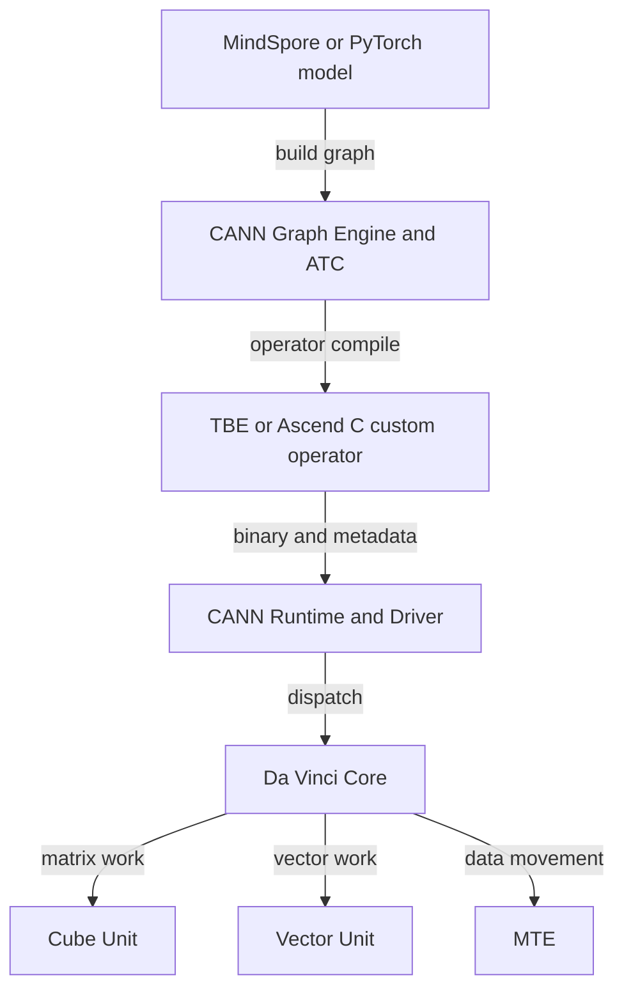
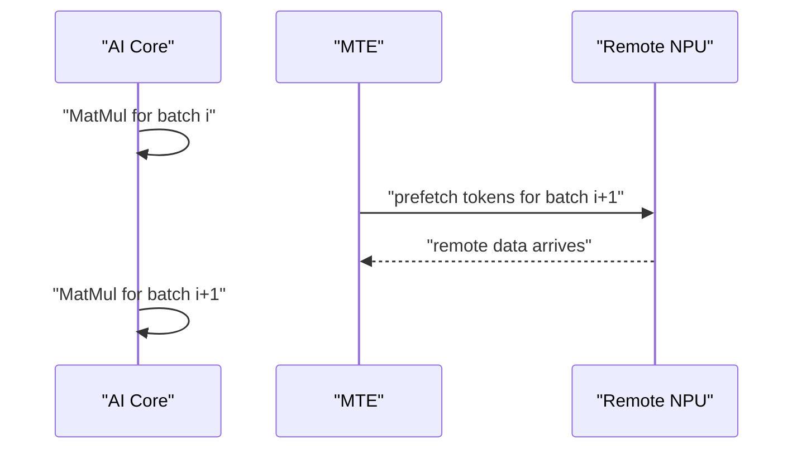
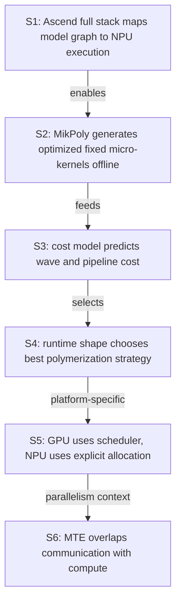

# MoEDiT多模态Video__单GPUNPU加速器__多算子微算子并发__硬件体系结构_对话记录

- 导出时间：2026-06-03 17:30 CST
- 来源：当前 Codex session 可用对话上下文
- 保存路径：human_notes/MoEDiT多模态Video__单GPUNPU加速器__多算子微算子并发__硬件体系结构_对话记录.md
- 范围：仅用户输入与 Codex 最终输出
- 说明：已排除环境上下文、技能说明块、工具调用过程与中间进度消息。

## 对话记录

### 001 User
# Context from my IDE setup:

## Active file: learning_outputs/20260529_185938__MoEDiT多模态Video__单GPUNPU加速器__多算子微算子并发__硬件体系结构/Q1.3_L1_answer.md

## Open tabs:
- Q1.3_L1_answer.md: learning_outputs/20260529_185938__MoEDiT多模态Video__单GPUNPU加速器__多算子微算子并发__硬件体系结构/Q1.3_L1_answer.md
- SKILL.md: .claude/skills/obsidian-keyword-explain/SKILL.md
- SKILL.md: .codex/skills/obsidian-keyword-explainer/SKILL.md
- mcp-obsidian-obsidian_search_notes-1780403536477.txt: /home/descfly/.claude/projects/-data3-paper-analysis/1cd5113f-572b-4909-9206-79a781b56db6/tool-results/mcp-obsidian-obsidian_search_notes-1780403536477.txt
- Q1.4_L1_answer.md: learning_outputs/20260529_185938__MoEDiT多模态Video__单GPUNPU加速器__多算子微算子并发__硬件体系结构/Q1.4_L1_answer.md

## My request for Codex:
'### 方法7: 华为昇腾 Ascend 910B — CANN + MindSpore + MikPoly

**笔记证据**: `paper_secs/secs_2025/69-Optimizing Dynamic-Shape Neural Networks on Accelerators.../1-Introduction.md` (score: 471.5); `knowledge_notes/kernel知识笔记/All-to-All Communication in MoE.md` (score: 461.4)

**方法细节**（L1 粒度 —— Ascend NPU 全栈推理 Pipeline + 动态 Shape 编译）:

```
Ascend NPU 推理全栈 (Da Vinci 架构):
======================================

软件栈层次:
  Layer 5: PyTorch/MindSpore (高层框架)
  Layer 4: CANN Graph Engine + ATC (图编译与模型转换)
  Layer 3: TBE (Tensor Boost Engine, 自定义算子 DSL)
  Layer 2: Ascend C (类似 CUDA, 自定义 kernel 编程)
  Layer 1: Driver + Runtime (Da Vinci Core 指令调度)

硬件架构 (Ascend 910B):
  ┌──────────────────────────────────────────┐
  │ Da Vinci Core × N                         │
  │  ├── Cube Unit (矩阵乘, 类似 Tensor Core) │
  │  ├── Vector Unit (激活函数, Norm, Softmax) │
  │  ├── Scalar Unit (控制流, Router 计算)    │
  │  └── MTE (Memory Transfer Engine)         │
  │       └── 远程内存访问, All-to-All 卸载   │
  ├── L1 Buffer (Cube Unit 专用)              │
  ├── Unified Buffer (Vector/Scalar 共享)     │
  ├── 64 GB HBM (~1.2 TB/s)                  │
  └── HCCS 互联 (节点内 NPU 间)               │
       + RoCE (节点间)                        │
```

**MikPoly 动态 Shape 编译 (GPU + NPU 双平台)**:

```
MikPoly 两阶段微 Kernel 聚合编译:
==================================

=== 离线: 微 Kernel 生成 (一次, ~6h for GEMM on GPU) ===
输入: 算子类型 (GEMM/Conv), 目标硬件 H

1. 生成 Program Template Q:
   Q = Q_offline (内层 tile 循环, 优化 M_local)
       + Q_online  (外层循环, 优化 M_global)

2. 从 Q_offline 提取 Micro-Kernel Template K_hat:
   for uM,uN,uK in range(16,512,16):
       micro_kernel = AutoTune(K_hat, (uM,uN,uK), H)
       // GPU: CUTLASS-based templates
       // NPU: manual TBE templates

3. 剪枝: 保留 Top-40 (n_mik=40) 高性能 micro-kernel
   // 评估: 在合成 shape {2^i} 上的平均性能

4. 构建 Micro-Kernel 性能模型 g_predict(t, K, H):
   // 单 PE 上测量不同 t 的 pipeline 延迟
   // 分段线性函数, t=1..5120

=== 在线: Micro-Kernel 聚合 (运行时, <1ms) ===
输入: 运行时 shape (M,N,K), S_K 微 Kernel 集合

5. 遍历聚合模式 (GPU: Pattern I+II; NPU: Pattern I-IX):
   for each pattern:
       生成聚合策略 (从 S_K 选择 micro-kernel 组合)
       // 启发式: 早期剪枝——若部分组合 cost 已超已知最优则跳过

6. 聚合成本模型评估 (Eq 2-4):
   Cost(S,H) = Σ_{(R_i,K_i)∈S} f_wave(R_i,K_i,H) × f_pipe(R_i,K_i,H)
     f_wave: 跨 PE 的 parallel wave 数
     f_pipe:  单 PE 的 pipeline 延迟

7. 选最优策略, 实例化 micro-kernel (偏移量/地址参数化)
   NPU: max-min 静态分配→各 Da Vinci Core
   GPU: 动态分配→SM hardware scheduler

结果 (MikPoly):
  GPU A100: 1.29× avg speedup, 峰值 11.05× vs cuBLAS
  NPU Ascend 910: 1.70× avg speedup, 峰值 15.32× vs CANN
```

**注解**:
- **NPU vs GPU 编译差异**: Ascend 需软件显式管理 L1 Buffer 分配；GPU hardware scheduler 自动分配 thread blocks→SM
- **动态 Shape 覆盖**: MikPoly benchmark 覆盖 DeepBench (166 测试例) + 真实应用 (1267 测试例)，含 BERT/CNN/Transformer GEMM 的全范围动态 shape
- **MTE 优势 (ETR 论文)**: Communication over Computation——当前 batch 的 MatMul 与下一 batch 的 All-to-All 通信在 MTE 上并行执行。训练效率提升 5.4-46.6% (32N/64N/256N Ascend NPU 集群)
- **NPU 并发能力**: 多级 on-chip buffer (L1+UB) 可分区给不同并发算子，MTE 提供额外的通信并发通道

**实验环境**:
- **硬件**: Ascend 910 (32 GB HBM, Da Vinci Core)；对比 A100 (80 GB, SM + Tensor Core)
- **模型**: BERT (Transformer 语言模型), AlexNet/ResNet/VGG (CNN)
- **benchmark**: DeepBench (166 shapes), 真实应用 (1267 shapes)
- **软件**: CANN SDK v5.1.RC1, MindSpore v1.7; 对比 cuBLAS v11.5, cuDNN, CUTLASS v2.9
- **硬件适配**: MikPoly 通过统一硬件抽象 H=(P_multi, M_local, M_global) 同时适配 GPU SMs 和 NPU Da Vinci Cores

---',教我,解释伪代码. [$obsidian-keyword-explainer](/data3/paper_analysis/.codex/skills/obsidian-keyword-explainer/SKILL.md) 

### 002 Codex Final
## Paper Context

这段主要来自 MikPoly 论文：`Optimizing Dynamic-Shape Neural Networks on Accelerators via On-the-Fly Micro-Kernel Polymerization`。核心思想一句话：**把动态 shape 的大算子拆成很多固定尺寸 micro-kernel，离线调好，在线按真实 shape 快速拼接。**

## Semantic Segments

| Segment | Keywords | Semantic Role |
|---|---|---|
| S1 | Ascend NPU, Da Vinci, CANN, MindSpore, TBE, Ascend C | 平台栈：代码如何落到 NPU |
| S2 | Q, Q_offline, Q_online, K_hat, micro-kernel | MikPoly 离线阶段：生成小内核 |
| S3 | g_predict, f_wave, f_pipe, Cost | 代价模型：怎么判断哪个组合快 |
| S4 | polymerization pattern, strategy, S_K, S* | 在线阶段：运行时拼 micro-kernel |
| S5 | NPU vs GPU, max-min allocation, SM scheduler | 平台差异：NPU 更显式，GPU 更自动 |
| S6 | MTE, All-to-All, CoC | 通信计算重叠：MoE 场景的并发收益 |

## Context Summary

| Path | Matched Keywords | Score |
|---|---:|---:|
| `paper_secs/.../69-Optimizing Dynamic-Shape.../1-Introduction.md` | MikPoly, dynamic shape, micro-kernel, cost model | 205.9 / 690.5 / 1246.6 / 798.3 |
| `paper_secs/.../69-Optimizing Dynamic-Shape.../5.2.1-Optimizing-Dynamic-Shape-Operators..md` | dynamic shape, MikPoly-Wave, cost model | 1867.4 / 368.1 / 460.5 |
| `knowledge_notes/硬件知识笔记/Ascend NPU Architecture (AI Core _ AI Vector _ Da Vinci).md` | Ascend, Da Vinci, MTE, Ascend C | 397.0 / 1820.9 / 23.5 / 1133.7 |
| `knowledge_notes/编译知识笔记/CANN (Compute Architecture for Neural Networks).md` | CANN, Ascend C | 546.4 / 680.1 |
| `knowledge_notes/kernel知识笔记/CoC (Communication over Computation).md` | MTE, CoC, Ascend C | 32.9 / 1340.5 |
| `knowledge_notes/kernel知识笔记/All-to-All Communication in MoE.md` | All-to-All, MTE | 3088.6 / 25.0 |
| `knowledge_notes/kernel知识笔记/Micro-Kernel Specialization...md` | micro-kernel | 2443.9 |

## S1: Ascend NPU 伪代码在说什么

这段：

```text
Layer 5: PyTorch/MindSpore
Layer 4: CANN Graph Engine + ATC
Layer 3: TBE
Layer 2: Ascend C
Layer 1: Driver + Runtime
```

可以读成：**上层模型图先由 MindSpore/PyTorch 表达，CANN 把图编译成 Ascend 可执行计划，TBE/Ascend C 用来做自定义算子，Runtime/Driver 最后把任务调度到 Da Vinci Core。**



Annotations:
- `CANN Graph Engine + ATC` 是图编译与模型转换层。
- `TBE` 是 Ascend AI Core 自定义算子开发框架，官方文档说明它基于 TVM，用于生成可在 Ascend AI Processor 上运行的算子程序。
- `Cube Unit` 对应矩阵乘主力；`Vector Unit` 更适合激活、Norm、elementwise；`MTE` 负责搬数据。

Web Supplement:
- Huawei Ascend TBE docs: https://www.hiascend.com/document/detail/en/canncommercial/800/opdevg/tbeaicpudevg/atlasopdev_10_0010.html

## S2: 离线阶段伪代码逐行解释

你可以把 MikPoly 离线阶段理解成：**先做一盒“规格不同但都调优过”的小 GEMM 积木。**

```text
Q = Q_offline + Q_online
K_hat = extract(Q_offline)
for uM,uN,uK in range(16,512,16):
    micro_kernel = AutoTune(K_hat, (uM,uN,uK), H)
keep Top-40 micro-kernels
build g_predict(t, K, H)
```

翻译成人话：

```pseudo
function Offline_Generation(Q, H):
    K_hat = extract_inner_tile_loops(Q.offline)
    candidates = []

    for uM in 16..512 step 16:
        for uN in 16..512 step 16:
            for uK in 16..512 step 16:
                K = autotune(K_hat, tile=(uM, uN, uK), hardware=H)
                candidates.append(K)

    ranked = rank_by_synthetic_shapes(candidates)
    S_K = keep_top(ranked, n_mik=40)

    for K in S_K:
        g_predict[K] = fit_pipeline_latency_model(K, H)

    return S_K, g_predict
```

Annotations:
- `Q` 是完整算子模板，比如 GEMM 的多层循环。
- `Q_offline` 是最内层 tile 循环，负责单个 PE 内部的高效计算。
- `K_hat` 是 micro-kernel 模板，不是具体 kernel；填入 `(uM,uN,uK)` 后才变成固定尺寸 kernel。
- `Top-40` 的目的不是“只要 40 个够用”，而是为了把在线搜索空间压小。

## S3: Cost Model 为什么这么写

MikPoly 在线不能真的把所有组合都跑一遍，所以用代价模型估算：

$$
S^* = \operatorname*{arg\,min}_{S \in S_S} \operatorname{Cost}(S,H)
$$

$$
\operatorname{Cost}(S,H)
=
\sum_{(R_i,K_i)\in S}
f_{\mathrm{wave}}(R_i,K_i,H)
\cdot
f_{\mathrm{pipe}}(R_i,K_i,H)
$$

Annotations:
- `S` 是一种完整拼法，也就是“哪些区域用哪个 micro-kernel”。
- `R_i` 是被某个 pattern 切出来的计算区域。
- `f_wave` 估计需要多少轮 PE wave 才能跑完所有并行 tile。
- `f_pipe` 估计单个 PE 上一条流水任务要多久。
- 只看 `f_wave` 会偏向大 tile；只看 `f_pipe` 会偏向小 tile。MikPoly 同时看二者。

更具体一点：

$$
f_{\mathrm{wave}}(R_i,K_i,H)
=
\left\lceil
\frac{f_{\mathrm{parallel}}(R_i,K_i)}
{|P_{\mathrm{multi}}|}
\right\rceil
$$

$$
f_{\mathrm{pipe}}(R_i,K_i,H)
=
g_{\mathrm{predict}}(f_{\mathrm{num}}(R_i,K_i),K_i,H)
$$

Annotations:
- `|P_multi|` 在 GPU 上是 SM 数，在 Ascend NPU 上是 Da Vinci Core 数。
- `f_parallel` 是非 reduction 维度产生的并行任务数。
- `f_num` 是 reduction loop 里同一个 micro-kernel 要重复多少次。
- `g_predict` 是离线拟合出的分段线性延迟模型。

## S4: 在线聚合阶段怎么跑

在线阶段的输入是运行时 shape，例如 `(M,N,K)=(4096,1024,4096)`。此时 MikPoly 不重新 autotune，只做快速组合搜索。

```pseudo
function Online_Polymerization(Q, S_K, H, shape):
    best_cost = infinity
    best_strategy = null

    for pattern in patterns(H):
        regions = split_online_loops(Q.online, pattern, shape)

        for strategy in enumerate_micro_kernel_choices(regions, S_K):
            cost = 0

            for region, K in strategy:
                cost += f_wave(region, K, H) * f_pipe(region, K, H)

                if cost >= best_cost:
                    break  // early pruning

            if cost < best_cost:
                best_cost = cost
                best_strategy = strategy

    S_star = instantiate(best_strategy, shape)
    return S_star
```

Annotations:
- `pattern` 决定“把输出区域怎么切”。
- `strategy` 决定“每个区域用哪个 micro-kernel”。
- `early pruning` 是在线低开销的关键：当前部分成本已经超过最好方案，就不继续算。
- `instantiate` 不是重新编译大 kernel，而是填地址偏移、loop bound、micro-kernel 参数。

## S5: 为什么 NPU 和 GPU 分支不同

| 项目 | GPU A100 | Ascend NPU |
|---|---|---|
| PE | SM | Da Vinci Core |
| Tensor 单元 | Tensor Core | Cube Unit |
| local memory | shared memory/register | L1 buffer/Unified Buffer/L0/register |
| micro-kernel 生成 | CUTLASS-based templates | manual TBE templates |
| 在线 pattern | I-II | I-IX |
| 任务分配 | hardware scheduler 自动把 blocks 分配到 SM | max-min 静态分配到 Da Vinci Core |

关键差异：**GPU 的 block 调度更依赖硬件 scheduler；Ascend NPU 更需要软件显式安排 core、buffer、pattern。**

## S6: MTE + All-to-All 注解怎么理解

这段和 MikPoly 不是同一个优化点，但它解释 Ascend 的“并发通道”优势：MoE 中 All-to-All 要把 token 发到 expert 所在设备，传统流程会让计算和通信串行。



Annotations:
- `AI Core` 跑当前 batch 的 FFN MatMul。
- `MTE` 同时搬下一 batch 的 All-to-All 数据。
- 如果通信时间和计算时间接近，总耗时从 `T_compute + T_comm` 接近变成 `max(T_compute, T_comm)`。
- 笔记证据里 ETR 的 CoC 在 32N/64N/256N Ascend NPU 集群上报告训练效率提升 5.4%-46.6%。

## Paragraph Synthesis



Annotations:
- 主链条是：软件栈提供可执行平台，MikPoly 提供动态 shape 算子优化，MTE/All-to-All 提供 MoE 通信并发背景。
- 你这段伪代码的核心不是“Ascend 比 GPU 快”，而是“在 NPU 上，动态 shape 编译和资源调度要更显式”。

## 最短记忆版

MikPoly = **离线调 micro-kernel，在线拼 micro-kernel**。  
`f_wave` 管“并行任务要跑几波”，`f_pipe` 管“单个流水任务多慢”。  
Ascend 侧的难点是：Da Vinci Core、L1/UB、TBE/Ascend C、MTE 这些资源更需要软件显式安排。

### 003 User
# Context from my IDE setup:

## Open tabs:
- Q1.3_L1_answer.md: learning_outputs/20260529_185938__MoEDiT多模态Video__单GPUNPU加速器__多算子微算子并发__硬件体系结构/Q1.3_L1_answer.md
- L1_horizon_summary.md: learning_outputs/20260529_185938__MoEDiT多模态Video__单GPUNPU加速器__多算子微算子并发__硬件体系结构/L1_horizon_summary.md
- SKILL.md: .codex/skills/export-conversation-notes/SKILL.md
- Accelerating Sparse Transformer Inference on GPU (STOF).md: human_notes/Accelerating Sparse Transformer Inference on GPU (STOF).md
- Adaptive Draft Sequence Length_ Enhancing Speculative Decoding Throughput on PIM-Enabled Systems.md: human_notes/Adaptive Draft Sequence Length_ Enhancing Speculative Decoding Throughput on PIM-Enabled Systems.md

## My request for Codex:
[$export-conversation-notes](/data3/paper_analysis/.codex/skills/export-conversation-notes/SKILL.md) 

---
