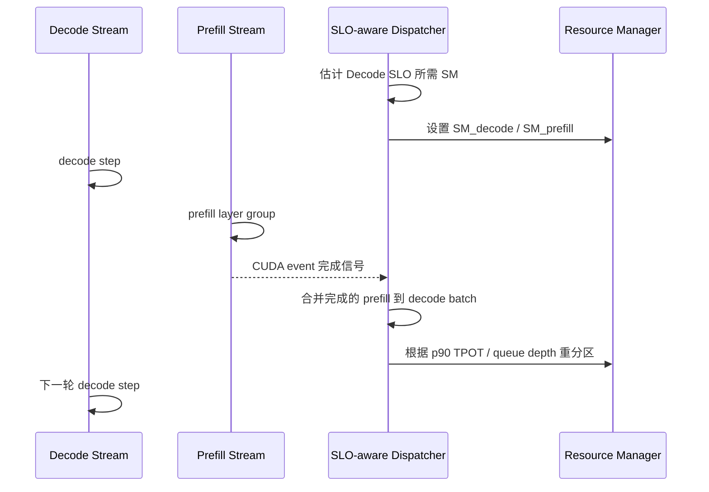

# SLO感知调度对话记录

- 导出时间：2026-06-04 11:02 CST
- 来源：当前 Codex session 可用对话上下文
- 保存路径：/data3/paper_analysis/human_notes/SLO感知调度对话记录.md
- 范围：仅用户输入与 Codex 最终输出
- 说明：运行时环境上下文、工具过程、中间状态更新和技能展开说明未保存。

## 对话记录

### 001 User
# Context from my IDE setup:

## Active file: draft/review_draft.md

## Active selection of the file:
| SLO感知调度 | MuxWise SLO-Aware Dispatcher + Bullet Dynamic SM Repartitioning *| Decode SLO优先→Contention-Tolerant Estimator建模HBM带宽竞争→**确定SM分区（GreenContext CUDA 12.4+，重分区~4.1μs**）；layer-wise prefill multiplexing穿插decode执行；Prefill Preemption（不递归抢占）；Bullet: 每prefill layer group/decode step后读shared metadata buffer→SLO感知重分区 | **CUDA Event异步prefill/decode stream同步**；SM mask硬件寄存器操作（libsmctrl）→后续kernel自动在新SM子集执行 | Q2.4, vault: SLO-aware-Dispatcher (5286.6), Dynamic SM Repartitioning (46.3) |
## Open tabs:
- review_draft.md: draft/review_draft.md
- L6_horizon_summary.md: learning_outputs/20260529_185938__MoEDiT多模态Video__单GPUNPU加速器__多算子微算子并发__硬件体系结构/L6_horizon_summary.md
- L5_horizon_summary.md: learning_outputs/20260529_185938__MoEDiT多模态Video__单GPUNPU加速器__多算子微算子并发__硬件体系结构/L5_horizon_summary.md
- L4_horizon_summary.md: learning_outputs/20260529_185938__MoEDiT多模态Video__单GPUNPU加速器__多算子微算子并发__硬件体系结构/L4_horizon_summary.md
- L3_horizon_summary.md: learning_outputs/20260529_185938__MoEDiT多模态Video__单GPUNPU加速器__多算子微算子并发__硬件体系结构/L3_horizon_summary.md

## My request for Codex:
教我:'| SLO感知调度 | MuxWise SLO-Aware Dispatcher + Bullet Dynamic SM Repartitioning *| Decode SLO优先→Contention-Tolerant Estimator建模HBM带宽竞争→**确定SM分区（GreenContext CUDA 12.4+，重分区~4.1μs**）；layer-wise prefill multiplexing穿插decode执行；Prefill Preemption（不递归抢占）；Bullet: 每prefill layer group/decode step后读shared metadata buffer→SLO感知重分区 | **CUDA Event异步prefill/decode stream同步**；SM mask硬件寄存器操作（libsmctrl）→后续kernel自动在新SM子集执行 | Q2.4, vault: SLO-aware-Dispatcher (5286.6), Dynamic SM Repartitioning (46.3) |'

### 002 Codex Final
这行的核心意思是：

**为了让 LLM serving 同时跑 Prefill 和 Decode，又不让 Decode 的延迟 SLO 爆掉，系统先给 Decode 分配“刚好够用”的 SM，剩下的 SM 给 Prefill；运行过程中再根据队列和延迟压力动态调整 SM 分区。**

**语义拆分**

| 段落 | 关键词 | 作用 |
|---|---|---|
| S1 | `SLO感知调度`, `MuxWise`, `Bullet` | 说明这一行融合了两个系统的调度思想 |
| S2 | `Decode SLO优先`, `Contention-Tolerant Estimator`, `HBM带宽竞争` | 决定 SM 怎么分 |
| S3 | `layer-wise prefill multiplexing`, `Prefill Preemption` | 说明 Prefill 如何插进 Decode 间隙 |
| S4 | `CUDA Event`, `GreenContext`, `libsmctrl`, `SM mask` | 说明底层怎么真正执行 |
| S5 | `Q2.4`, `vault score` | 说明证据来源；括号数字是检索相关度分数，不是性能指标 |

**一句话版本**

MuxWise 负责“怎么根据 SLO 做调度决策”：Decode 延迟最敏感，所以先保证 Decode；Prefill 尽早执行但不强行保证。Bullet 负责“怎么快速改 SM 分区”：每个 prefill layer group 或 decode step 后读共享状态，如果 Decode 快碰到 SLO，就把更多 SM 给 Decode；如果 Prefill 队列堆积且 Decode 余量够，就把更多 SM 给 Prefill。

**关键机制**

`Contention-Tolerant Estimator` 是调度器的大脑。它不是只看“Decode 单独跑多快”，而是估计 Prefill 和 Decode 同时跑时共享 HBM、L2 等资源造成的 slowdown：

```text
predicted_decode_latency
  = solo_decode_latency(SM_decode, batch, context)
    × worst_case_slowdown(prefill_config, decode_config)
```

Annotations:
`solo_decode_latency` 是无竞争时的 Decode 延迟；`worst_case_slowdown` 来自离线 profiling 和在线更新；这样 Dispatcher 可以找满足 TBT/ITL SLO 的最小 `SM_decode`，剩下的 SM 给 Prefill 提升 goodput。

MuxWise 的调度逻辑可以理解成：

```text
for each decode iteration or prefill batch completion:
    estimate decode latency under candidate SM splits
    choose minimal SM_decode satisfying Decode SLO
    SM_prefill = SM_total - SM_decode

    launch decode on decode stream
    launch enough prefill layers on prefill stream

    if short prefill request may miss TTFT:
        preempt long prefill only if long prefill still meets TTFT
        do not allow recursive preemption
```

Annotations:
`Decode SLO优先` 不等于“所有 SM 都给 Decode”，而是“给 Decode 刚好够的 SM”。`Prefill Preemption 不递归` 是为了避免短请求抢占长请求后，又被更短请求抢占，导致级联 SLO miss。

**执行时间线**



Annotations:
`CUDA Event` 用来跨 stream 异步同步，避免 `cudaDeviceSynchronize` 这种全局阻塞。`libsmctrl_set_stream_mask()` 或 GreenContext 更新后，后续 kernel 会自动跑在新的 SM 子集上。

**GreenContext 和 libsmctrl 的区别**

| 机制 | 你可以怎么记 |
|---|---|
| `GreenContext` | CUDA 12.4+ 的官方轻量上下文机制，把不同 stream/context 绑定到不同 SM 子集 |
| `libsmctrl` | 更底层地改 CUDA stream 的 SM mask，Bullet 用它做约 `4.1us` 级别的动态重分区 |
| `CUDA Event` | 不是分 SM 的工具，而是 prefill/decode stream 之间的异步同步和完成检测工具 |

小心一个细节：你这行里“GreenContext CUDA 12.4+，重分区 ~4.1μs”容易让人误读。更精确地说：**GreenContext 是 MuxWise 侧的进程内 SM 分区能力；~4.1μs 更像 Bullet/libsmctrl 的 stream mask 更新开销。**

**证据来源**

主要来自本地笔记：
`paper_secs/.../3.4-SLO-aware-Dispatcher.md`、`knowledge_notes/.../SLO-aware Dispatcher（SLO感知调度器）.md`、`knowledge_notes/.../Dynamic SM Repartitioning（动态SM重分区）.md`、`knowledge_notes/.../NVIDIA GreenContext.md`、`knowledge_notes/.../libsmctrl _ CUDA Stream SM Mask（CUDA流SM掩码控制）.md`。

### 003 User
# Context from my IDE setup:

## Active file: draft/review_draft.md

## Open tabs:
- review_draft.md: draft/review_draft.md
- L6_horizon_summary.md: learning_outputs/20260529_185938__MoEDiT多模态Video__单GPUNPU加速器__多算子微算子并发__硬件体系结构/L6_horizon_summary.md
- L5_horizon_summary.md: learning_outputs/20260529_185938__MoEDiT多模态Video__单GPUNPU加速器__多算子微算子并发__硬件体系结构/L5_horizon_summary.md
- L4_horizon_summary.md: learning_outputs/20260529_185938__MoEDiT多模态Video__单GPUNPU加速器__多算子微算子并发__硬件体系结构/L4_horizon_summary.md
- L3_horizon_summary.md: learning_outputs/20260529_185938__MoEDiT多模态Video__单GPUNPU加速器__多算子微算子并发__硬件体系结构/L3_horizon_summary.md

## My request for Codex:
[$export-conversation-notes](/data3/paper_analysis/.codex/skills/export-conversation-notes/SKILL.md) 
