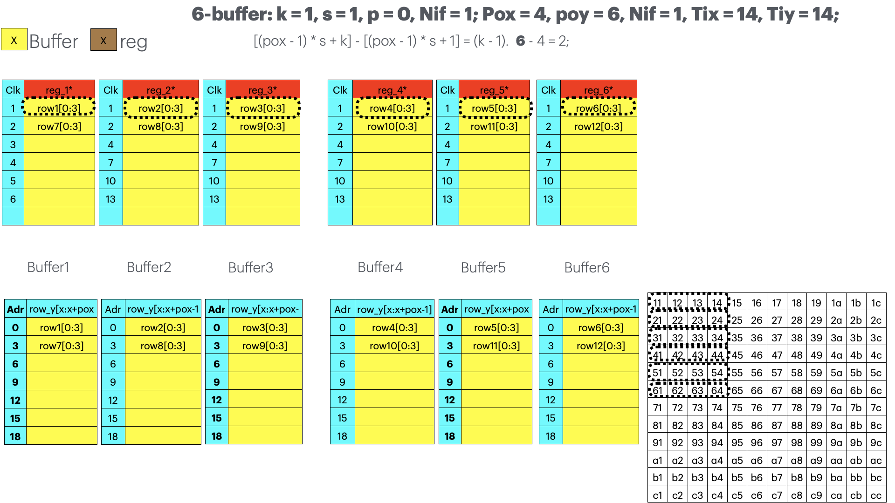

# 2025-05-29

# 1、report

## 1、卷积的数据复用设计

针对pox,poy,pof的超高并行,设计高效片上访问的img2col算法.

地址访问比较规整适合GPU,但需要p、slab等辅助存储和滑动寄存器辅助,又不适合GPU

但片上多访问一次其实问题不大.

其余工作在poy、N、pof、pif的几种并行来回组合.

- 1,1,0
    
    > **[图片提取文字 (image.png)]:**
> ## 6-buffer: k = 1, s = 1, p = 0, Nif = 1; Pox = 4, poy = 6, Nif = 1, Tix = 14, Tiy = 14;
> 
> × Buffer × reg
> 
> [(pox - 1) \* s + k] - [(pox - 1) \* s + 1] = (k - 1). **6** - 4 = 2;
> 
> | Clk | reg_1*    | Clk | reg_2*    | Clk | reg_3*    |
> |-----|-----------|-----|-----------|-----|-----------|
> | 1   | row1[0:3] | 1   | row2[0:3] | 1   | row3[0:3] |
> | 2   | row7[0:3] | 2   | row8[0:3] | 2   | row9[0:3] |
> | 3   |           | 4   |           | 4   |           |
> | 4   |           | 7   |           | 7   |           |
> | 5   |           | 10  |           | 10  |           |
> | 6   |           | 13  |           | 13  |           |
> |     |           |     |           |     |           |
> 
> | Clk | reg_4*     | Clk | reg_5*     | Clk | reg_6*     |
> |-----|------------|-----|------------|-----|------------|
> | 1   | row4[0:3]  | 1   | row5[0:3]  | 1   | row6[0:3]  |
> | 2   | row10[0:3] | 2   | row11[0:3] | 2   | row12[0:3] |
> | 4   |            | 4   |            | 4   |            |
> | 7   |            | 7   |            | 7   |            |
> | 10  |            | 10  |            | 10  |            |
> | 13  |            | 13  |            | 13  |            |
> |     |            |     |            |     |            |
> 
> Buffer1
> 
> Buffer2
> 
> Buffer3
> 
> Buffer4
> 
> Buffer5
> 
> Buffer6
> 
> | Adr | row_y[x:x+pox | Adr | row_y[x:x+pox-1 | Adr | row_y[x:x+pox- |
> |-----|---------------|-----|-----------------|-----|----------------|
> | 0   | row1[0:3]     | 0   | row2[0:3]       | 0   | row3[0:3]      |
> | 3   | row7[0:3]     | 3   | row8[0:3]       | 3   | row9[0:3]      |
> | 6   |               | 6   |                 | 6   |                |
> | 9   |               | 9   |                 | 9   |                |
> | 12  |               | 12  |                 | 12  |                |
> | 15  |               | 15  |                 | 15  |                |
> | 18  |               | 18  |                 | 18  |                |
> 
> | Adr | row_y[x:x+pox-1] | Adr | row_y[x:x+pox | Adr | row_y[x:x+pox-1 |
> |-----|------------------|-----|---------------|-----|-----------------|
> | 0   | row4[0:3]        | 0   | row5[0:3]     | О   | row6[0:3]       |
> | 3   | row10[0:3]       | 3   | row11[0:3]    | 3   | row12[0:3]      |
> | 6   |                  | 6   |               | 6   |                 |
> | 9   |                  | 9   |               | 9   |                 |
> | 12  |                  | 12  |               | 12  |                 |
> | 15  |                  | 15  |               | 15  |                 |
> | 18  |                  | 18  |               | 18  |                 |
> 
> | 11         | 12 | 13 | 14 | 15 | 16 | 17         | 18 | 19 | 1a | 1b | 1c |
> |------------|----|----|----|----|----|------------|----|----|----|----|----|
> | 21         | 22 | 23 | 24 | 25 | 26 | 27         | 28 | 29 | 2a | 2b | 2c |
> | 31         | 32 | 33 | 34 | 35 | 36 | 37         | 38 | 39 | 3а | 3b | 3с |
> | 41         | 42 | 43 | 44 | 45 | 46 | 47         | 48 | 49 | 4a | 4b | 4c |
> | 51         | 52 | 53 | 54 | 55 | 56 | 57         | 58 | 59 | 5a | 5b | 5с |
> | 61         | 62 | 63 | 64 | 65 | 66 | 67         | 68 | 69 | 6a | 6b | 6c |
> | 71         | 72 | 73 | 74 | 75 | 76 | 77         | 78 | 79 | 7a | 7b | 7с |
> | 81         | 82 | 83 | 84 | 85 | 86 | 87         | 88 | 89 | 8a | 8b | 8c |
> | 91         | 92 | 93 | 94 | 95 | 96 | 97         | 98 | 99 | 9a | 9b | 9с |
> | <b>a</b> 1 | a2 | аЗ | a4 | a5 | a6 | <b>a</b> 7 | a8 | a9 | aa | ab | ac |
> | b1         | b2 | b3 | b4 | b5 | b6 | b7         | b8 | b9 | ba | bb | bc |
> | с1         | c2 | сЗ | с4 | с5 | с6 | с7         | с8 | с9 | са | cb | СС |

    
- 3,1,1
    
    > **[图片提取文字 (image.png)]:**
> 
> 
> ## No fifo: k = 3, s = 1, p = 1, Nif = 1; Pox = 4, poy = 3, Nif = 1, Tix = 14, Tiy = 14;
> 
> | Clk | reg_1*       | Clk | reg_1*     | Clk | reg_1*        |
> |-----|--------------|-----|------------|-----|---------------|
> | 1   | p,p[0:4]     | 37  | p[3:8]     | 73  | p[7:11],p     |
> | 4   | p,row1[0:4]  | 40  | row1[3:8]  | 76  | row1[7:11],p  |
> | 7   | p,row2[0:4]  | 43  | row2[3:8]  | 79  | row2[7:11],p  |
> | 10  | p,row3[0:4]  | 46  | row3[3:8]  | 82  | row3[7:11],p  |
> | 13  | p,row4[0:4]  | 49  | row4[3:8]  | 85  | row4[7:11],p  |
> | 16  | p,row5[0:4]  | 52  | row5[3:8]  | 88  | row5[7:11],p  |
> | 19  | p,row6[0:4]  | 55  | row6[3:8]  | 91  | row6[7:11],p  |
> | 22  | p,row7[0:4]  | 58  | row7[3:8]  | 94  | row7[7:11],p  |
> | 25  | p,row8[0:4]  | 61  | row8[3:8]  | 97  | row8[7:11],p  |
> | 28  | p,row9[0:4]  | 64  | row9[3:8]  | 100 | row9[7:11],p  |
> | 31  | p,row10[0:4] | 67  | row10[3:8] | 103 | row10[7:11],p |
> | 34  | p,row11[0:4] | 70  | row11[3:8] | 106 | row11[7:11],p |
> 
> | Clk | reg_2*       | Clk | reg_2*     | Clk | reg_2*        |
> |-----|--------------|-----|------------|-----|---------------|
> | 1   | p,row1[0:4]  | 37  | row1[3:8]  | 73  | row1[7:11],p  |
> | 4   | p,row2[0:4]  | 40  | row2[3:8]  | 76  | row2[7:11],p  |
> | 7   | p,row3[0:4]  | 43  | row3[3:8]  | 79  | row3[7:11],p  |
> | 10  | p,row4[0:4]  | 46  | row4[3:8]  | 82  | row4[7:11],p  |
> | 13  | p,row5[0:4]  | 49  | row5[3:8]  | 85  | row5[7:11],p  |
> | 16  | p,row6[0:4]  | 52  | row6[3:8]  | 88  | row6[7:11],p  |
> | 19  | p,row7[0:4]  | 55  | row7[3:8]  | 91  | row7[7:11],p  |
> | 22  | p,row8[0:4]  | 58  | row8[3:8]  | 94  | row8[7:11],p  |
> | 25  | p,row9[0:4]  | 61  | row9[3:8]  | 97  | row9[7:11],p  |
> | 28  | p,row10[0:4] | 64  | row10[3:8] | 100 | row10[7:11],p |
> | 31  | p,row11[0:4] | 67  | row11[3:8] | 103 | row11[7:11],p |
> | 34  | p,row12[0:4] | 70  | row12[3:8] | 106 | row12[3:8],p  |
> 
> | Clk | reg_3*       | Clk | reg_3*     | Clk | reg_3*        |  |  |
> |-----|--------------|-----|------------|-----|---------------|--|--|
> | 1   | p,row2[0:4]  | 37  | row2[3:8]  | 73  | row2[7:11],p  |  |  |
> | 4   | p,row3[0:4]  | 40  | row3[3:8]  | 76  | row3[7:11],p  |  |  |
> | 7   | p,row4[0:4]  | 43  | row4[3:8]  | 79  | row4[7:11],p  |  |  |
> | 10  | p,row5[0:4]  | 46  | row5[3:8]  | 82  | row5[7:11],p  |  |  |
> | 13  | p,row6[0:4]  | 49  | row6[3:8]  | 85  | row6[7:11],p  |  |  |
> | 16  | p,row7[0:4]  | 52  | row7[3:8]  | 88  | row7[7:11],p  |  |  |
> | 19  | p,row8[0:4]  | 55  | row8[3:8]  | 91  | row8[7:11],p  |  |  |
> | 22  | p,row9[0:4]  | 58  | row9[3:8]  | 94  | row9[7:11],p  |  |  |
> | 25  | p,row10[0:4] | 61  | row10[3:8] | 97  | row10[7:11],p |  |  |
> | 28  | p,row11[0:4] | 64  | row11[3:8] | 100 | row11[7:11],p |  |  |
> | 31  | p,row12[0:4] | 67  | row12[3:8] | 103 | row12[7:11],p |  |  |
> | 34  | p,p[0:4]     | 70  | p[3:8]     | 106 | p[7:11],p     |  |  |
> 
> $$[(pox - 1) * s + k] - [(pox - 1) * s + 1] = (k - 1).$$
>  **6** - 4 = 2;
> 
> Buffer 1
> 
> | Adr | row_y[x:x+pox-1] |
> |-----|------------------|
> | 0   | p[0:11]          |
> | 3   | row3[0:11]       |
> | 6   | row6[0:11]       |
> | 9   | row9[0:11]       |
> | 12  | row12[0:11]      |
> 
> Buffer 2
> 
> | Adr | row_y[x:x+pox-1] |
> |-----|------------------|
> | 0   | row1[0:11]       |
> | 3   | row4[0:11]       |
> | 6   | row7[0:11]       |
> | 9   | row10[0:11]      |
> | 12  | p[0:11]          |
> 
> Buffer 3
> 
> | Adr | row_y[x:x+pox-1] |
> |-----|------------------|
> | 0   | row2[0:11]       |
> | 3   | row5[0:11]       |
> | 6   | row8[0:11]       |
> | 9   | row11[0:11]      |
> | 12  |                  |
> 
> |       |            |    |    | 1- 6 |            |    |            |    | 1- 5 |    | / I- |    |  |
> |-------|------------|----|----|------|------------|----|------------|----|------|----|------|----|--|
> |       |            |    |    |      |            |    |            |    |      |    |      |    |  |
> |       |            |    |    |      |            |    |            |    |      |    |      |    |  |
> |       | 11         | 12 | 13 | 14   | 15         | 16 | 17         | 18 | 19   | 1a | 1b   | 1c |  |
> |       | 21         |    |    |      | 25         |    |            | 28 | 29   | 2a | 2b   | 2c |  |
> |       | 31         | 32 | 33 | 34   | 35         | 36 | 37         | 38 | 39   | За | 3b   | 3с |  |
> | • • • | 41         | 42 | 43 | 44   | 45         | 46 | 47         | 48 | 49   | 4a | 4b   | 4c |  |
> | `     | 51         | 52 | 53 | 54   | 55         | 56 | 57         | 58 | 59   | 5a | 5b   | 5с |  |
> |       | 61         | 62 | 63 | 64   | 65         | 66 | 67         | 68 | 69   | 6a | 6b   | 6с |  |
> |       | 71         | 72 | 73 | 74   | 75         | 76 | 77         | 78 | 79   | 7a | 7b   | 7с |  |
> |       | 81         | 82 | 83 | 84   | 85         | 86 | 87         | 88 | 89   | 8a | 8b   | 8c |  |
> |       | 91         | 92 | 93 | 94   | 95         | 96 | 97         | 98 | 99   | 9a | 9b   | 9с |  |
> |       | <b>a</b> 1 | α2 | а3 | a4   | <b>a</b> 5 | a6 | <b>a</b> 7 | a8 | a9   | aa | ab   | ac |  |
> |       | b1         | b2 | b3 | b4   | b5         | b6 | b7         | b8 | b9   | ba | bb   | bc |  |
> |       | с1         | с2 | сЗ | с4   | с5         | с6 | с7         | с8 | с9   | са | cb   | СС |  |
> |       |            |    |    |      |            |    |            |    |      |    |      |    |  |

    
- 3,2,1
    
    > **[图片提取文字 (image.png)]:**
> ## 6-buffer: k = 3, s = 2, p = 1, Nif = 1; Pox = 4, poy = 6, Nif = 1, Tix = 14, Tiy = 14;
> 
> |   |        |   |     |   |      |            |        | _       |               | =                   |              | _  | _ |
> |---|--------|---|-----|---|------|------------|--------|---------|---------------|---------------------|--------------|----|---|
> | X | Buffer | X | reg | Х | fifo | [(pox - 1) | *s+k]- | [(pox - | · 1) * s + 1] | = (k - 1). <b>9</b> | - <b>7</b> = | 2; |   |
> 
> | Clk | reg_1*      | Clk | reg_2*      | Clk | reg_3*      |
> |-----|-------------|-----|-------------|-----|-------------|
> | 1   | p,p[0:3]    | 1   | p,row2[0:3] | 1   | p,row4[0:3] |
> | 2   | p[4:7]      | 2   | row2[4:7]   | 2   | row4[4:7]   |
> | 3   | p,p[0:7]    | 3   | p,row2[0:7] | 3   | p,row4[0:7] |
> | 5   | p,row1[0:7] | 5   | p,row3[0:7] | 5   | p,row5[0:7] |
> | 9   | p,row2[0:7] | 9   | p,row4[0:7] | 9   | p,row6[0:7] |
> | 13  |             | 13  |             | 13  |             |
> |     |             |     |             |     |             |
> |     |             |     |             |     |             |
> |     |             |     |             |     |             |
> |     |             |     |             |     |             |
> |     |             |     |             |     |             |
> |     |             |     |             |     |             |
> |     |             |     |             |     |             |
> |     |             |     |             |     |             |
> 
> | Clk | reg_4*                                  | Clk | reg_5*       | Clk | reg_6*       |
> |-----|-----------------------------------------|-----|--------------|-----|--------------|
> | 1   | p,row6[0:3]                             | 1   | p,row8[0:3]  | 1   | p,row10[0:3] |
> | 2   | row6[4:7]                               | 2   | row8[4:7]    | 2   | row10[4:7]   |
> | 3   | p,row6[0:7]                             | 3   | p,row8[0:7]  | 3   | p,row10[0:7] |
> | 5   | p,row7[0:7]                             | 5   | p,row9[0:7]  | 5   | p,row11[0:7] |
> | 9   | p,row8[0:7]                             | 9   | p,row10[0:7] | 9   | p,row12[0:7] |
> | 13  | ,,,,,,,,,,,,,,,,,,,,,,,,,,,,,,,,,,,,,,, | 13  |              | 13  |              |
> |     |                                         |     |              |     |              |
> |     |                                         |     |              |     |              |
> |     |                                         |     |              |     |              |
> |     |                                         |     |              |     |              |
> |     |                                         |     |              |     |              |
> |     |                                         |     |              |     |              |
> |     |                                         |     |              |     |              |
> |     |                                         |     |              |     |              |
> 
> |   | Buffer1         |   | Buffer2         | Buffer3 |                 |  |  |
> |---|-----------------|---|-----------------|---------|-----------------|--|--|
> | Α | row_y[x:x+pox-1 | Α | row_y[x:x+pox-1 | Α       | row_y[x:x+pox-1 |  |  |
> | 0 | p[0:11]         | 0 | row2[0:11]      | 0       | row4[0:11]      |  |  |
> | 3 | row1[0:11]      | 3 | row3[0:11]      | 3       | row5[0:11]      |  |  |
> | 6 | row12[0:11]     | 6 | p[0:11]         | 6       |                 |  |  |
> | 9 | p[0:11]         | 9 |                 | 9       |                 |  |  |
> 
> | Buffer4 |                 |   | Buffer5         |   | Buffer6         |  |  |  |
> |---------|-----------------|---|-----------------|---|-----------------|--|--|--|
> | Α       | row_y[x:x+pox-1 | Α | row_y[x:x+pox-1 | Α | row_y[x:x+pox-1 |  |  |  |
> | 0       | row6[0:11]      | 0 | row8[0:11]      | 0 | row10[0:11]     |  |  |  |
> | 3       | row7[0:11]      | 3 | row9[0:11]      | 3 | row11[0:11]     |  |  |  |
> | 6       |                 | 6 |                 | 6 |                 |  |  |  |
> | 9       |                 | 9 |                 | 9 |                 |  |  |  |
> 
> | • - |    |    |    |    |    |    |            |    |            |    |    |    |  |
> |-----|----|----|----|----|----|----|------------|----|------------|----|----|----|--|
> |     | 11 | 12 | 13 | 14 | 15 | 16 | 17         | 18 | 19         | 1a | 1b | 1c |  |
> |     | 21 | 22 | 23 | 24 | 25 | 26 | 27         | 28 | 29         | 2a | 2b | 2c |  |
> |     | 31 | 32 | 33 | 34 | 35 | 36 | 37         | 38 | 39         | За | 3b | Зс |  |
> |     | 41 | 42 | 43 | 44 | 45 | 46 | 47         | 48 | 49         | 4a | 4b | 4c |  |
> |     | 51 | 52 | 53 | 54 | 55 | 56 | 57         | 58 | 59         | 5a | 5b | 5с |  |
> | *   | 61 | 62 | 63 | 64 | 65 | 66 | 67         | 68 | 69         | 6a | 6b | 6с |  |
> |     | 71 | 72 | 73 | 74 | 75 | 76 | 77         | 78 | 79         | 7a | 7b | 7с |  |
> |     | 81 | 82 | 83 | 84 | 85 | 86 | 87         | 88 | 89         | 8a | 8b | 8c |  |
> |     | 91 | 92 | 93 | 94 | 95 | 96 | 97         | 98 | 99         | 9a | 9b | 9с |  |
> | * - | αĺ | α2 | a3 | α4 | α5 | α6 | α <b>7</b> | g8 | <b>a</b> 9 | aa | ab | ас |  |
> |     | b1 | b2 | b3 | b4 | b5 | b6 | b7         | b8 | b9         | ba | bb | bc |  |
> |     | с1 | c2 | сЗ | с4 | с5 | с6 | с7         | с8 | с9         | са | cb | СС |  |
> |     |    |    |    |    |    |    |            |    |            |    |    |    |  |

    
- 6,2,2
    
    > **[图片提取文字 (image.png)]:**
> ## 6-buffer: k = 6, s = 2, p = 2, Nif = 1; Pox = 4, poy = 6, Nif = 1, Tix = 14, Tiy = 14;
> 
> | Clk     | reg_1*         | Clk     | reg_2*         | Clk     | reg_3*         | Clk     | reg_4*          | CI  | k reg_5*       | Clk | reg_6*            |          |           |    |      |     |      |    |      |      |          |             |          |
> |---------|----------------|---------|----------------|---------|----------------|---------|-----------------|-----|----------------|-----|-------------------|----------|-----------|----|------|-----|------|----|------|------|----------|-------------|----------|
> | 1       | p,p,p[0:3]     | 1       | p,p,row1[0:3]  | 1       | p,p,row3[0:3]  | 1       | p,p,row5[0:3]   | 1   | p,p,row7[0:3]  | 1   | p,p,row9[0:3]     |          |           |    |      |     |      |    |      |      |          |             |          |
> | 2       | p[4:7]         | 2       | row1[4:7]      | 2       | row3[4:7]      | 2       | row5[4:7]       | 2   | row7[4:7]      | 2   | row9[4:7]         |          |           |    |      |     |      |    |      |      |          |             |          |
> | 3       | p[7:9]         | 3       | row1[7:9]      | 3       | row3[7:9]      | 3       | row5[7:9]       | 3   | row7[7:9]      | 3   | row9[7:9]         |          |           |    |      |     |      |    |      |      |          |             |          |
> | 8       | p,p,p[0:9]     | 8       | p,p,row2[0:9]  | 8       | p,p,row4[0:9]  | 8       | p,p,row6[0:9]   | 8   | p,p,row8[0:9]  | 8   | p,p,row10[0:9     |          |           |    |      |     |      |    |      |      |          |             |          |
> | 15      | p,p,row1[0:9]  | 15      | p,p,row3[0:9]  | 15      | p,p,row5[0:9]  | 15      | p,p,row7[0:9]   | 15  | p,p,row9[0:9]  | 15  | p,p,row11[0:9]    |          |           |    |      |     |      |    |      |      |          |             |          |
> | 22      | p,p,row2[0:9]  | 22      | p,p,row4[0:9]  | 22      | p,p,row6[0:9]  | 22      | p,p,row8[0:9]   | 22  | p,p,row10[0:9  | 22  | p,p,row12[0:9]    |          |           |    |      |     |      |    |      |      |          |             |          |
> | 29      | p,p,row3[0:9]  | 29      | p,p,row5[0:9]  | 29      | p,p,row7[0:9]  | 29      | p,p,row9[0:9]   | 29  | p,p,row11[0:9] | 29  | p,p,p[0:9]        |          |           |    |      |     |      |    |      |      |          |             |          |
> | 36      | p,p,row4[0:9]  | 36      | p,p,row6[0:9]  | 36      | p,p,row8[0:9]  | 36      | p,p,row10[0:9   | 36  | p,p,row12[0:9] | 36  | p,p,p[0:9]        |          |           |    |      |     |      |    |      |      |          |             |          |
> |         |                |         |                |         |                |         |                 |     |                |     |                   | •        |           |    |      |     |      |    |      | -    | 1        | <del></del> | 7        |
> |         |                |         |                |         |                |         |                 |     |                |     |                   |          |           |    |      |     |      |    |      |      | Ŧ        |             |          |
> |         |                |         |                |         |                |         |                 |     |                |     |                   | }'-'     | 11        | 12 | 13 1 | 4 1 | 5 16 | 17 | 18   | 19 1 | la 1     | b 1c        | ;        |
> |         |                |         |                |         |                |         |                 |     |                |     |                   |          |           |    |      |     | 5 26 |    |      |      |          |             |          |
> |         |                |         |                |         |                |         |                 |     |                |     |                   |          | 31        | 32 | 33 3 | 4 3 | 5 36 | 37 | 38 3 | 39 3 | 3a 3     | b 3c        | ;        |
> |         |                |         |                |         |                |         |                 |     |                |     |                   | ļ.,      | 41        | 42 | 43 4 | 4 4 | 5 46 | 47 | 48 4 | 49 4 | la 4     | b 4c        | <u>;</u> |
> |         |                |         |                |         |                |         |                 |     |                |     |                   |          | 51        | 52 | 53 5 | 4 5 | 5 56 | 57 | 58 5 | 59 5 | 5a 5     | b 5c        | ;        |
> |         |                |         |                |         |                |         |                 |     |                |     |                   | <b>,</b> |           |    |      |     | 5 66 |    |      |      | _        |             |          |
> | Buffer1 |                | Buffer2 |                | Buffer3 |                | Buffer4 |                 |     | Buffer5        |     | Buffer6           |          |           |    |      |     | 5 76 |    |      |      |          |             |          |
> |         |                |         |                |         |                |         |                 |     |                |     |                   |          |           |    |      |     | 5 86 |    |      | _    |          |             |          |
> | A r     | ow_y[x:x+pox-1 | A r     | ow_y[x:x+pox-1 | A r     | ow_y[x:x+pox-1 |         | A row_y[x:x+pox | x-1 | A row_y[x:x+po | x-1 | A row_y[x:x+pox-1 |          | 91        |    |      |     | 5 96 |    |      |      |          |             |          |
> | 0       | p[0:11]        | 0       | row1[0:11]     | 0       | row3[0:11]     |         | 0 row5[0:11]    |     | 0 row7[0:11]   |     | 0 row9[0:11]      |          |           |    |      |     | 5 a6 |    |      |      |          |             |          |
> | 3       | p[0:11]        | 3       | row2[0:11]     | 3       | row4[0:11]     |         | 3 row6[0:11]    |     | 3 row8[0:11]   |     | 3 row10[0:11]     |          |           |    |      |     | 5 b6 |    |      |      | _        |             |          |
> | 6       | row11[0:11]    | 6       | p[0:11]        | 6       | 10#4[0.11]     |         | 6               |     | 6              |     | 6                 | <b>.</b> | <u>c1</u> | с2 | с3 с | 4 c | 5 c6 | с7 | c8 ( | .9 c | :a; c    | b cc        | ;        |
> | 9       | row12[0:11]    | 9       | p[0:11]        | 9       |                |         | 9               |     | 9              |     | 9                 |          |           |    |      |     |      |    |      | _    | -        | +           | ++       |
> | 9       | TOWIZ[U:TI]    | 9       | ρ[υ:11]        | 9       |                |         | 3               |     | 9              |     | 9                 |          |           |    |      |     |      |    |      |      | <u>.</u> | $\perp$     |          |
> 
> [(pox - 1) \* s + k] - [(pox - 1) \* s + 1] = (k - 1). **12** - **7** = 5;
> 
> × Buffer × reg

    

## 2、论文

阅读auto-tuning相关文章,转3

## 3、GPU相关

[Temporal vs Spatial：分时 or 分空](../knowledge%20chips/Temporal%20vs%20Spatial%EF%BC%9A%E5%88%86%E6%97%B6%20or%20%E5%88%86%E7%A9%BA%201f3e12d10b6e80a0bb3ecd10a78e6d36.md)

[GPU的SIMT执行模型](../../Notes/AI%20Arch/GPU%E7%9A%84SIMT%E6%89%A7%E8%A1%8C%E6%A8%A1%E5%9E%8B%201ffe12d10b6e80bcbe99c3cb5c0167f6.md)

[GPU WMMA和Tensor Core](../../Notes/AI%20Arch/GPU%20WMMA%E5%92%8CTensor%20Core%20201e12d10b6e80b9a13dd735b5a509f7.md)

[GPU与CUDA](../../Notes/AI%20Arch/GPU%E4%B8%8ECUDA%201fce12d10b6e8099b559dfffe6b13cc7.md)

# 2、discussion

- 我的工作的关联idea:
    - QKV,SMA的数据访问方式,sp张量,某一channel是0.
    - sp的输入是固定结构,部分0跳不掉.
    - tensor core(sp-》dense)
    - 稀疏场景的动态并行(释放部分资源闲置或改变并行方式).
    - 混合精度的gating,降低功耗
    - GPU的稀疏卷积,比较成熟
    - warp内线程之间作滑动???如何模拟.shuffle?ld&str的模拟方式效率太低
- 论文思路
    - 问题(**现在工作哪里没做,什么场景的问题**)
    - 方法1、2(解决问题)、实现/3
    - 效果(性能、能耗)
- 其余idea
    - sim模拟流/过程:C、RTL、cycle、model(建模),改变架构的参考模拟,用于实验(实现)
    - 算子融合(软件优化)在端到端硬件上的实现.软件的特性在硬件上的不适配—-》idea.
- Todo
    - baseline:加速器工作现状(4大会)、**参考文章list**.(周五中午前完成)
    - 总结key:背景、动机(问题)、方法、与我的工作的关系
    - 11月ISCA.