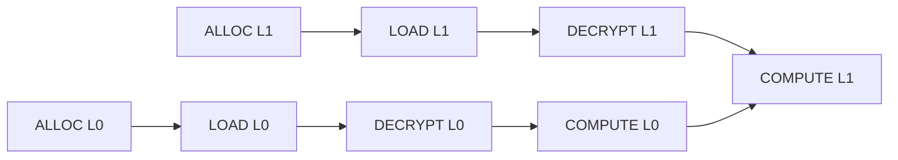

# 加密和计算的overlap

- 导出时间：2026-06-04 11:08 CST
- 来源：当前 Codex session 可用对话上下文
- 保存路径：human_notes/加密和计算的overlap.md
- 范围：仅用户输入与 Codex 最终输出

## 对话记录

### 001 User
<environment_context>
  <cwd>/data3/paper_analysis</cwd>
  <shell>bash</shell>
  <current_date>2026-06-04</current_date>
  <timezone>Asia/Shanghai</timezone>
  <filesystem><workspace_roots><root>/data3/paper_analysis</root></workspace_roots><permission_profile type="managed"><file_system type="restricted"><entry access="read"><special>:root</special></entry><entry access="write"><path>/data3/paper_analysis</path></entry><entry access="write"><special>:slash_tmp</special></entry><entry access="write"><special>:tmpdir</special></entry><entry access="read"><path>/data3/paper_analysis/.git</path></entry><entry access="read"><path>/data3/paper_analysis/.agents</path></entry><entry access="read"><path>/data3/paper_analysis/.codex</path></entry></file_system></permission_profile></filesystem>
</environment_context>

### 002 User
# Context from my IDE setup:

## Active file: draft/review_draft.md

## Active selection of the file:
| 优先级调度 | TZ-LLM Priority Greedy + Preemptive Micro-Operator? | 四类operator DAG扩展（ALLOC→LOAD→DECRYPT→COMPUTE每层）、COMPUTE优先级最高；大restoration op切分为~64KB micro-op支持CPU computation就绪时抢占（抢占开销~2.5μs）；REE control plane + TEE data plane co-driver架构 | Pipeline效率距critical path lower bound仅0.01-9.9% | Q2.4, vault: Pipelined Parameter Restoration (141.3), TZ-LLM (187.6) |
## Open tabs:
- review_draft.md: draft/review_draft.md
- L6_horizon_summary.md: learning_outputs/20260529_185938__MoEDiT多模态Video__单GPUNPU加速器__多算子微算子并发__硬件体系结构/L6_horizon_summary.md
- L5_horizon_summary.md: learning_outputs/20260529_185938__MoEDiT多模态Video__单GPUNPU加速器__多算子微算子并发__硬件体系结构/L5_horizon_summary.md
- L4_horizon_summary.md: learning_outputs/20260529_185938__MoEDiT多模态Video__单GPUNPU加速器__多算子微算子并发__硬件体系结构/L4_horizon_summary.md
- L3_horizon_summary.md: learning_outputs/20260529_185938__MoEDiT多模态Video__单GPUNPU加速器__多算子微算子并发__硬件体系结构/L3_horizon_summary.md

## My request for Codex:
教我:'| 优先级调度 | TZ-LLM Priority Greedy + Preemptive Micro-Operator? | 四类operator DAG扩展（ALLOC→LOAD→DECRYPT→COMPUTE每层）、COMPUTE优先级最高；大restoration op切分为~64KB micro-op支持CPU computation就绪时抢占（抢占开销~2.5μs）；REE control plane + TEE data plane co-driver架构 | Pipeline效率距critical path lower bound仅0.01-9.9% | Q2.4, vault: Pipelined Parameter Restoration (141.3), TZ-LLM (187.6) |'

### 003 Codex Final
一句话：这行在讲 **TZ-LLM 如何把“加载/分配/解密模型参数”藏到计算后面**。核心不是让每个步骤更快，而是用优先级调度把它们排得更聪明，让 CPU/NPU 尽量一直有活干。

**语义拆分**

| 段 | 关键词 | 作用 |
|---|---|---|
| S1 | TZ-LLM, TEE, TrustZone | 背景：在端侧 TEE 中安全跑 LLM |
| S2 | ALLOC→LOAD→DECRYPT→COMPUTE, operator DAG | 方法：把串行流程改成流水线 DAG |
| S3 | Priority Greedy, Preemptive Micro-Operator | 调度：计算优先，长恢复任务可被抢占 |
| S4 | REE control plane + TEE data plane co-driver | 系统架构：安全共享 NPU |
| S5 | critical path lower bound, 0.01-9.9% | 结果：调度接近理论下界 |

证据主要来自 vault：`knowledge_notes/kernel知识笔记/Pipelined Parameter Restoration.md`，`knowledge_notes/系统知识笔记/Co-driver NPU Architecture.md`，`experiment_notes/kernel实验笔记/TZ-LLM_ Protecting On-Device Large Language Models with Arm TrustZone.md`，`idea_notes/TZ-LLM_ Protecting On-Device Large Language Models with Arm TrustZone.md`。其中 `~2.5μs` 抢占开销我只在 `learning_outputs/.../Q2.4_L2_answer.md` 里检索到，核心知识/实验笔记未命中这个数字，所以写综述时最好再回原文 figure/table 核一次。

**先看传统问题**

TEE 里保护 LLM 参数时，不能直接把明文权重放在普通 REE/Linux 内存里。传统 strawman 很直：

```text
ALLOC 全部安全内存
→ LOAD 全部加密参数
→ DECRYPT 全部参数
→ COMPUTE 开始推理
```

问题是：前面三个步骤都压在 TTFT 上。你的笔记里 strawman 的 restoration overhead 大约是秒级，完全暴露在 critical path 上。

**TZ-LLM 的关键改法**

它把每层/每个 computation operator 前面插入三类 restoration operator：



Annotations：  
`ALLOC` 是申请连续物理内存，常由 REE Linux CMA 帮忙；`LOAD` 是把加密参数从存储读入内存；`DECRYPT` 是在 TEE 中解密；`COMPUTE` 是真正的 LLM layer/prefill 计算。关键点是：`L0` 开始计算时，`L1/L2/...` 的 alloc/load/decrypt 可以在后台推进。

**Priority Greedy 是什么**

调度器的朴素规则是：

```pseudo
while has_pending_ops:
    update_ready_queue()

    if exists ready COMPUTE:
        run COMPUTE          # 计算最高优先级
    else:
        target = earliest_future_compute()
        run restoration_op_associated_with(target)
```

Annotations：  
`COMPUTE` 优先，是因为 CPU/NPU 一旦等参数就会 idle；如果没有 compute ready，就服务“最早快要用到参数”的 computation，避免提前恢复太远的层导致浪费。它叫 greedy，因为每次只看当前 ready 队列和最近的 computation，不做复杂全局优化。

**Preemptive Micro-Operator 是补刀**

大块 `ALLOC` 或 `DECRYPT` 可能执行很久。如果它正在跑，而某个 `COMPUTE` 突然 ready，CPU 就还得等它结束，形成 pipeline bubble。

所以 TZ-LLM 把大 restoration op 切成约 `64KB` 的 micro-op：

```text
DECRYPT_BIG
= decrypt_64KB_0 + decrypt_64KB_1 + decrypt_64KB_2 + ...
```

每完成一个小块就检查：有没有 compute ready？有就抢占 restoration，先跑 compute。这样牺牲一点抢占/状态保存开销，换来更少的 CPU/NPU 空转。

**Co-driver 那半句**

`REE control plane + TEE data plane` 是说 NPU driver 不整个搬进 TEE。

```text
REE: 负责调度、电源频率、统一 job queue
TEE: 只负责 secure context 验证、MMIO launch、中断完成
```

这样做的原因很实际：完整 NPU driver 很大，放进 TEE 会把 TCB 撑爆；但完全让 REE 控制又不安全。co-driver 的折中是：REE 可以排队调度 shadow job，但看不到/伪造不了真正 secure NPU job 的内容。

**最后那句性能怎么理解**

`Pipeline效率距critical path lower bound仅0.01-9.9%` 的意思是：

$$
\text{overhead} =
\frac{T_{\text{TZ-LLM schedule}} - T_{\text{critical path lower bound}}}
{T_{\text{critical path lower bound}}}
$$

Annotations：  
`critical path lower bound` 是这个 DAG 在依赖约束下理论上不可能突破的最短路径；如果实际调度只比它慢 `0.01%-9.9%`，说明 priority greedy + micro-op 抢占已经把 pipeline bubble 压得很小。

你可以把整行背成一句话：

> TZ-LLM 把每层参数恢复拆成 `ALLOC→LOAD→DECRYPT→COMPUTE` 的流水线 DAG，用 compute-first 的 greedy 调度和 64KB micro-op 抢占，让参数恢复尽量藏在计算背后；同时用 REE control plane + TEE data plane co-driver 安全共享 NPU，最终流水线开销接近 critical-path 下界。

### 004 User
# Context from my IDE setup:

## Active file: draft/review_draft.md

## Active selection of the file:
**加密和计算的overlap**
## Open tabs:
- review_draft.md: draft/review_draft.md
- L6_horizon_summary.md: learning_outputs/20260529_185938__MoEDiT多模态Video__单GPUNPU加速器__多算子微算子并发__硬件体系结构/L6_horizon_summary.md
- L5_horizon_summary.md: learning_outputs/20260529_185938__MoEDiT多模态Video__单GPUNPU加速器__多算子微算子并发__硬件体系结构/L5_horizon_summary.md
- L4_horizon_summary.md: learning_outputs/20260529_185938__MoEDiT多模态Video__单GPUNPU加速器__多算子微算子并发__硬件体系结构/L4_horizon_summary.md
- L3_horizon_summary.md: learning_outputs/20260529_185938__MoEDiT多模态Video__单GPUNPU加速器__多算子微算子并发__硬件体系结构/L3_horizon_summary.md

## My request for Codex:
[$export-conversation-notes](/data3/paper_analysis/.codex/skills/export-conversation-notes/SKILL.md) 

### 005 User
<skill>
<name>export-conversation-notes</name>
<path>/data3/paper_analysis/.codex/skills/export-conversation-notes/SKILL.md</path>
---
name: export-conversation-notes
description: Export the currently available Codex/chat session record into a target Markdown file, defaulting to human_notes/. Save only user inputs and Codex final outputs. Use when the user asks to save, archive, output, or record the current conversation, dialogue history, or analysis session in the paper_analysis workspace. If the target Markdown file already exists and is non-empty, append incrementally without modifying, deleting, reformatting, or replacing any existing content.
---

# Export Conversation Notes

## Overview

Save the current session's available user inputs and Codex final outputs to the requested target location. Default to `human_notes/` when no explicit directory is provided. Default to Chinese for headings and status text. Do not save process notes, status updates, tool calls, command outputs, hidden instructions, or intermediate work logs.

## Workflow

1. Identify the target path.
   - save under `human_notes/`.
   - If no filename can be identified, use `<session-name>.md` and <session-name> is the name of the current session.

2. Prepare the target file.
   - Work relative to the current workspace root.
   - Ensure the destination directory exists.
   - Sanitize only the filename portion by replacing filesystem-hostile characters such as `/`, `\`, `:`, `*`, `?`, `"`, `<`, `>`, and `|` with safe separators, then trim whitespace.
   - Save to the resolved target path.

3. Capture the available conversation record.
   - Output only user inputs and Codex final outputs in chronological order with speaker labels.
   - Include all available user messages exactly as written.
   - Include only Codex final responses that answer the user, not interim progress updates or tool-facing content.
   - Do not include tool calls, shell commands, command outputs, file edit logs, errors from tools, status updates, planning chatter, hidden system/developer/policy/runtime instructions, or intermediate reasoning.
   - Do not summarize, compress, paraphrase, normalize, or reorganize the saved user inputs and final outputs.
   - If earlier user inputs or final outputs are unavailable because context was compacted or not exposed to Codex, state this limitation briefly before the saved conversation.

4. Write the Markdown file.
   - If the file does not exist, create it with the new-file template.
   - If the file exists but is empty, write the new-file template.
   - If the file exists and is non-empty, enter incremental mode: append a new dated section only at the end of the file.
   - In incremental mode, never modify, delete, reorder, summarize, normalize, reformat, or replace any existing content, even if the existing note has typos, duplicate headings, stale metadata, or inconsistent formatting.
   - In incremental mode, use an append-only edit. With `apply_patch`, add only new lines after the existing final line.
   - Keep the saved record readable, but preserve the available user inputs and final outputs over brevity.
   - If the record is too long for one edit, append it in multiple consecutive chunks until all currently available user inputs and final outputs are saved.

## Markdown Template

For a new file, use this structure:

```md
# <session-or-paper-title>

- 导出时间：<YYYY-MM-DD HH:MM TZ>
- 来源：当前 Codex session 可用对话上下文
- 保存路径：<resolved-target-path>
- 范围：仅用户输入与 Codex 最终输出

## 对话记录

### 001 User
<用户消息原文>

### 002 Codex Final
<Codex 最终回复原文>
```

For appending to an existing non-empty file, add this block at the end of the file without changing earlier content:

```md
---

## 对话记录补充：<YYYY-MM-DD HH:MM TZ>

<continue the same chronological format, saving only user inputs and Codex final outputs>
```

## Completion Response

After saving, respond briefly with the output path and whether the file was created or appended. Mention any uncertainty about target inference or incomplete available conversation context.

</skill>
