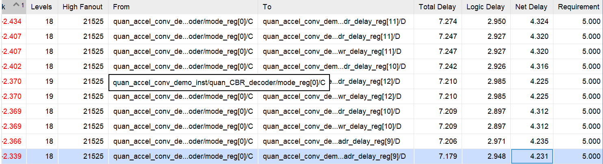

# ideas

- 在最初设计整体方案时，十分困难。抓不住重点，感觉需要边做边设计。包括不同模块的接口、大小设置、初始化设置、加速器如何使用。
    - 待解决
- 整个卷积的设计和实现难以分拆，单人完成，压力很大。
    - 待解决
- 关于计划与进度，如何控制类似项目的进度。
    - 待解决
    - 梳理任务列表，理清依赖关系

- 引入slab后，计算-量化-激活的输出仅进行了基本的仿真测试，缺少python仿真的对拍。
    - 涉及到待验证算法时，先写python验证

- 不同模块的组合、协作麻烦，容易产生bug。因为细节多，端口多。
    - 按照预设功能设计局部数据通路进行测试。
    
- 加载、计算、存储的控制器的设计。
    - 多状态机协同，类似多线程编程。

- 设计与测试时，不同精度的控制和接口在开发时最好分开来，测试无bug后合并。
    - 开发时先分开处理数据流，后合并。

- 输入重排的控制逻辑（译码）对同步（多个信号需要同时产生）要求较高，在资源占用高时，难以满足时钟约束。
    
    > **[图片提取文字 (image.png)]:**
> | k ^1   | Levels | High Fanout | From                                  | То                                      | Total Delay | Logic Delay | Net Delay | Requirement |
> |--------|--------|-------------|---------------------------------------|-----------------------------------------|-------------|-------------|-----------|-------------|
> | -2.434 | 18     | 21525       | quan_accel_conv_deoder/mode_reg[0]/C  | quan_accel_conv_demdr_delay_reg[11]/D   | 7.274       | 2.950       | 4.324     | 5.000       |
> | -2.407 | 18     | 21525       | quan_accel_conv_deoder/mode_reg[0]/C  | quan_accel_conv_dedr_delay_reg[11]/D    | 7.247       | 2.927       | 4.320     | 5.000       |
> | -2.407 | 18     | 21525       | quan_accel_conv_deoder/mode_reg[0]/C  | quan_accel_conv_dewr_delay_reg[11]/D    | 7.247       | 2.927       | 4.320     | 5.000       |
> | -2.402 | 18     | 21525       | quan_accel_conv_deoder/mode_reg[0]/C  | quan_accel_conv_demdr_delay_reg[10]/D   | 7.242       | 2.926       | 4.316     | 5.000       |
> | -2.370 | 19     | 21525       | quan_accel_conv_demo_inst/quan_CBR_de | coder/mode_reg[0]/C =dr_delay_reg[12]/D | 7.210       | 2.985       | 4.225     | 5.000       |
> | -2.370 | 19     | 21525       | quan_accel_conv_deoder/mode_reg[0]/C  | quan_accel_conv_dewr_delay_reg[12]/D    | 7.210       | 2.985       | 4.225     | 5.000       |
> | -2.369 | 18     | 21525       | quan_accel_conv_deoder/mode_reg[0]/C  | quan_accel_conv_dedr_delay_reg[10]/D    | 7.209       | 2.897       | 4.312     | 5.000       |
> | -2.369 | 18     | 21525       | quan_accel_conv_deoder/mode_reg[0]/C  | quan_accel_conv_dewr_delay_reg[10]/D    | 7.209       | 2.897       | 4.312     | 5.000       |
> | -2.366 | 18     | 21525       | quan_accel_conv_deoder/mode_reg[0]/C  | quan_accel_conv_deadr_delay_reg[9]/D    | 7.206       | 2.971       | 4.235     | 5.000       |
> | -2.339 | 18     | 21525       | quan_accel_conv_deoder/mode_reg[0]/C  | quan_accel_conv_demadr_delay_reg[9]/D   | 7.179       | 2.948       | 4.231     | 5.000       |

    
    - 多周期译码，但需要重新优化数据流
    - 但多周期译码要么打破计算数据流的连续性（增加控制复杂性）来进行紧耦合控制，要么需要增加额外FIFO等候所有数据重排完成（延迟增加）来进行松耦合控制。
    - 或许结合二者，使用FIFO来握手，降低控制复杂度，同时挽回性能。
- 多个模块共用资源时，将共享资源放到顶层，顶层进行选择，进行任务分拆和解耦。

- LUT占用超过70%时很容易布线拥塞，这时需要考虑优化LUT的使用，降低其使用率。目前core中单个MAC占用大概150，是否能把修正用的加法先传出来通过bias的向量加法计算，这样内部可以不进行修正用的加法器。

- 关于CNNs加速器的工作:
    - 脉动阵列的尺寸可配置
    - 脉动阵列的控制和输出设计优化(支撑维度上扩展的技术)
    - img2col的实现控制不依赖于数据流设计,而依赖于控制逻辑,因此扩展数据流时,该模块不会成为技术难点
    - ~~端到端加速器,不需要CPU干预,完全片上控制???,因为CPU和加速器的频繁低速通信可能成为性能瓶颈~~
        - 不对,**端到端加速是和CPU+XPU加速**相对的思想,后者基于CPU控制+XPU加速核心算子的协作方式,通过优化XPU和优化交互来加速;端到端是面向某个/类模型提供全过程的系统优化和流式加速.
        - CPU+XPU加速的设计侧重通用和扩展性,加速框架能面向更多应用,利于系统扩展;端到端加速追求某类应用极致的性能,系统的模块类型和模块交互定制化.
        - 现有CPU+GPU就不是端到端执行,GPU只进行核心运算的加速,控制调度由CPU负责.
        - DLA等异构加速器(zync?)是面向特定应用的端到端加速
        - 控制和计算分离的思想没错,但需要解决控制核和计算核的通信开销

- 关于片上网络,主要设计点在于运行时改变数据流,达成降低功耗(不同精度不同数据流)、灵活并行方式的效果.

- 计算并行方式决定数据复用模式，不同的计算并行方式，本质将数据流送到核心，通过数据排布和片上网络/路由实现，每个核心需要自己独立的路由来接受数据，核心间的数据复用模式能缓解传输压力。

- GPU上基于GEMM实现Conv也是通过数据重排,通过将输入通道数据打包来利用传输带宽,因此其并行度部分在输入通道上.
    - 我实现的片上img2col能够支持宽度上的并行度,这是否是一个优势?
    - 但其实GPU可以从高度方向扩展并行度,但其高度方向扩展并行度也需要并行行的数据的排布吧,也要考虑读取重叠数据的模式?
    - 我的思路能否应用在GPU上,因为这种数据的复用思想应该是通用的吧?只是需要额外的缓存,如果shared-memory能够支持的话.
    - 很难，我的设计基于片上的数据重排来达成数据复用，但GPU上寄存器之间的连接固定，其行为是和core之间进行数据交换，不能控制寄存器行为来做片上重排。
    - 感觉可以通过寄存器读取的起始地址来模拟行的滑动？
    
    感觉tensorcore这种DLA和我设计的不太一样？因为重排写在片上，片上以数据流形式加速，而不是通过存取来完成算子加速。
    
    但本质上都是通过存取获得数据流，只是片上重排的缓存数据复用更好，但这种复用完全可以通过片上大缓存来实现，因为片上的存取速度很快。
    
    也不一定 复用肯定更好
    
    GPU的重排怎么做的？显式排好数据？地址访问？将卷积写成隐式矩阵乘法,通过计算地址来实现重排,通过数据排列提高访存效率.
    
    感觉我设计的img2col更适合在GPU上执行,但GPU内每个warp内寄存器的操作灵活度都是ld/str类型,除非在TensorCore内部增加shift寄存器组
    
- 算子融合一般考虑都是有正向收益,因为去除中间结果的存储和重新加载.