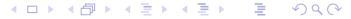

# 泛函分析II

# 滕岩梅

主要内容: 不动点、逼近论、无界线性算子、非线性泛函分析

平时成绩: 40% 出勤、学堂在线

大作业: 60% 在本专业或研究课题中与泛函分析相关问题、题 目自拟,

摘要、正文、参考文献,3000字以上

# 有界线性算子的谱

# 回顾:矩阵的特征值

**定义1** 设V是数域 $\mathbb{K}$ 上的n维线性空间,  $\mathbf{A}$ 是V的一个线性变换. 若对于某个数 $\lambda \in \mathbb{K}$ , 存在非零向量 $\boldsymbol{\xi} \in V$ , 使得

$$A\xi = \lambda \xi \tag{1}$$

就称 $\lambda$ 是A的一个特征值,  $\xi$ 为A的属于特征值 $\lambda$ 的一个特征向量.

设 $\{e_1, \cdots, e_n\}$ 是V的一组基. 设

- (1) 线性变换 $\mathbf{A}$ 在这组基下的矩阵 $\mathbf{A} \in \mathbb{K}^{n \times n}$ ,
- (2) 向量 $\xi$ 在这组基下的坐标 为 $X = (x_1, x_2, \cdots, x_n)^T \in \mathbb{K}^{n \times 1}$ , 由方程(1)可知齐次线性方程组

$$(\lambda I - A)X = 0 (2)$$

有非零解, 其中 I表示单位矩阵. 等价地,

$$|\lambda I - A| = 0.$$

#### 定义2 数域 $\mathbb{K}$ 上的n次多项式

$$p_n(\lambda) := |\lambda I - A|$$

称为A的特征多项式.

**命题1**  $\lambda_0$ 是**A**的特征值当且仅当 $\lambda_0$ 是 $p_n(\lambda)$ 在数域 $\mathbb{K}$ 中的一个根.

 $\mathbf{A}$ 的属于特征值 $\lambda_0$ 的全部特征向量以及零向量所成的集合构成线性空间V的一个子空间,称之为 $\mathbf{A}$ 的 一个特征子空间,记为 $V_{\lambda_0}$ .显然,

$$V_{\lambda_0} = \{ \xi \in V \mid \mathrm{A}\xi = \lambda_0 \xi \}$$

线性变换 $\mathbf{A}$ 的特征子空间 $V_{\lambda 0}$ 是 $\mathbf{A}$ 的不变子空间.

**定理1** 设线性变换**A**的特征多项式 $p_n(\lambda)$ 可分解为一次因式的乘积,

$$p_n(\lambda) = (\lambda - \lambda_1)^{r_1} (\lambda - \lambda_2)^{r_2} \cdots (\lambda - \lambda_s)^{r_s},$$

则V可分解为不变子空间的直和,

$$V = V_1 \oplus V_2 \oplus \cdots \oplus V_s,$$

其中
$$V_i = \{ \xi \in V \mid (\mathbf{A} - \lambda_i \mathbf{I})^{r_i} \xi = 0 \}.$$

# 有界线性算子的谱

定义3 设X是Banach空间,  $T \in L(X)$ , I是恒等算子,  $\lambda \in \mathbb{C}$ . 若

- (1)  $\lambda I T$ 的值域 $R(\lambda I T) = X$ ,
- (2)  $\lambda I T$ 可逆, 且 $(\lambda I T)^{-1} \in L(X)$ ,

则称 $\lambda$ 为T的正则点. T的全体正则点的集合称为T的预解集, 记为 $\rho(T)$ .

定义4 当 $\lambda \in \rho(T)$ 时,称相应的算子 $(\lambda I - T)^{-1}$ 为T的预解式,通常简记为 $R(\lambda, T)$ .

定义5 设X是非零Banach空间,  $T \in L(X)$ , T的谱是 $\rho(T)$ 的余集, 即 $\sigma(T) := \mathbb{C} - \rho(T)$ .

- (1) 若  $N(\lambda I T) \neq \{0\}$ , 即  $\lambda I T$  不是单射, 则称  $\lambda$  为 T 的特征值. 特征值的全体称为 T 的点谱, 简记为  $\sigma_p(T)$ . 对于 $\lambda \in \sigma_p(T)$ , 若非零向量x满足 $(\lambda I T)x = 0$ , 称x为 T的属于 $\lambda$ 的特征向量;
- (2) 若  $N(\lambda I T) = \{0\}$ ,  $\overline{R(\lambda I T)} = X$ , 但 $R(\lambda I T) \neq X$ , 称  $\lambda$  属于 T 的连续谱, 记作  $\lambda \in \sigma_c(T)$ ;
- (3) 若  $N(\lambda I T) = \{0\}$ ,  $\overline{R(\lambda I T)} \neq X$ , 则称  $\lambda$  属于 T 的剩余谱, 记作  $\lambda \in \sigma_r(T)$ .

定理2 设X是非零Banach空间,  $T \in L(X)$ .

(1)  $\lambda \in \rho(T)$  当且仅当对于任意  $y \in X$ , 非齐次方程

$$(\lambda I - T)x = y \tag{3}$$

存在唯一解 $x \in X$ , 而且存在常数 c > 0, 使得  $||x|| \le c||y||$ ;

(2)  $\lambda \in \sigma_p(T)$  当且仅当齐次方程

$$(\lambda I - T)x = 0 \tag{4}$$

有非零解;

(3)  $\lambda \in \sigma_c(T) \cup \sigma_r(T)$  当且仅当齐次方程 (4) 有唯一零解, 而相应的非齐次方程 (3) 并非 对所有的  $u \in X$  都有解.

#### 小 结

- 矩阵特征值概念, 直和分解
- ;Banach空间上有界线性算子预解集、谱的概念;
- 判别正则点、特征值、连续谱点或剩余谱点的方法。

# 谱的求解实例

~1 ƒ C[0, 1] ˛éf

$$(Tx)(t) = \int_0^t x(s)ds, \quad x \in C[0,1],$$

¶σ(T ).

): ƒk, λ<sup>0</sup> = 0 ∈ σr(T ). ˘¥œè:

(1) 
$$N(\lambda_0 I - T) = \{0\}$$
,即 $T$ 是单射: $Tx = 0 \Rightarrow x = 0$ ;

(2) 
$$\overline{R(\lambda_0 I - T)} \neq C[0, 1]$$
:  $\overline{R(\lambda_0 I - T)} = \overline{R(T)}$ ,  $\overline{m}$ 

$$R(T) = \{y(t) \mid y(t)$$
在  $[0,1]$  上有连续导数,  $y(0) = 0\}$ .

记
$$\varphi(t)\equiv 1$$
,则 $\varphi\in C[0,1]\setminus \overline{R(T)}$ .

0 ∈ σr(T ) ⊂ σ(T ).

此外,容易验证

$$\|T^n\| \leq \frac{1}{n!}$$

从而利用Stirling公式可知T的谱半径

$$r(T) = \lim_{n \to \infty} ||T^n||^{\frac{1}{n}} = 0.$$

所以0是T的唯一谱点,即

$$\sigma(T)=\{0\}.$$

**例2** 设  $X = l^1$ , 线性算子  $T: X \to X$  由下式给出:

$$Tx = y = (x_1, \frac{1}{2}x_2, \cdots, \frac{1}{n}x_n, \cdots),$$
  $x = (x_1, x_2, \cdots, x_n, \cdots) \in l^1.$ 

试讨论 T 的谱.

解: 首先, 
$$\rho(T)=\mathbb{C}-\{0,1,\frac{1}{2},\frac{1}{3},\cdots,\frac{1}{n},\cdots\}.$$
  
对于 $\lambda \not\in \{0,1,\frac{1}{2},\frac{1}{3},\cdots,\frac{1}{n},\cdots\}$ 和 $y\in l^1$ ,方程 $(\lambda I-T)x=y$ 即

$$\left(\lambda-\frac{1}{n}\right)x_n=y_n, \qquad n=1,2,\cdots. \ \Rightarrow \quad x_n=\frac{1}{\lambda-\frac{1}{n}}y_n, \qquad n=1,2,\cdots.$$

$$\lim_{n \to \infty} \left| \frac{1}{\lambda - \frac{1}{n}} \right| = |\lambda|^{-1} > 0,$$
  $\Rightarrow \quad \exists M > 0, \; \text{ s.t. } \left| \frac{1}{\lambda - \frac{1}{n}} \right| \le M.$ 

于是

$$\sum_{n=1}^{\infty}|x_n|\leq M\sum_{n=1}^{\infty}|y_n|, \qquad \forall y\in l^1.$$
 
$$\iff \qquad \|\left(\lambda I-T\right)^{-1}y\|_{l^1}\leq M\|y\|_{l^1}, \qquad \forall y\in l^1.$$

可见,  $\lambda$  是 T 的正则点, 即  $\lambda \in \rho(T)$ .

其次, 
$$\sigma_p(T) = \{1, \frac{1}{2}, \frac{1}{3}, \cdots, \frac{1}{n}, \cdots\}$$
.

对于
$$\lambda=\frac{1}{n}$$
,  $n=1,2,\cdots$ , 方程 $(\frac{1}{n}I-T)x=0$ 即

$$(\cdots,(\frac{1}{n}-\frac{1}{n-1})x_{n-1},0\cdot x_n,(\frac{1}{n}-\frac{1}{n+1})x_{n+1},\cdots)=0,$$

可见, 无论x的分量 $x_n$ 取何值, 只要 $x_k = 0$ ,  $\forall k \neq n$ , 则相应的 x都是方程  $(\frac{1}{n}I - T)x = 0$ 的解, 即

$$N(\frac{1}{n}I-T) \neq \{0\}, \qquad n=1,2,\cdots$$

所以 $\frac{1}{n} \in \sigma_p(T)$ ,  $\forall n = 1, 2, \cdots$ .

最后,  $0 \in \sigma_c(T)$ .

考虑方程 Tx = 0. 即

$$(x_1,\frac{1}{2}x_2,\cdots,\frac{1}{n}x_n,\cdots)=0,\quad \Rightarrow x_n=0,\quad n=1,2,\cdots$$

故
$$N(T) = \{0\}, T^{-1}$$
存在.

取
$$\{\mathbf e_n\}_{n=1}^\infty\subset l^1$$
, 其中

$$\mathrm{e}_n = (\underbrace{0,0,\cdots,0}_{n-1},1,0,\cdots), \quad n \in \mathbb{N}.$$

显然, 
$$\|\mathbf{e}_n\| = 1$$
, 且 $T(\underbrace{0,0,\cdots,0}_{n-1},n,0,\cdots) = \mathbf{e}_n$ ,

=e<sup>n</sup> ∈ R(T ),

$$T^{-1}e_n = (\underbrace{0, 0, \cdots, 0}_{n-1}, n, 0, \cdots), \quad ||T^{-1}e_n|| = n \to \infty.$$

=T <sup>−</sup>1Ã., §± R(T ) 6= l 1 . 现证  $\overline{R(T)}=l^1$ . 注意到 $\{\mathbf{e}_n\}_{n=1}^{\infty}\subset R(T)$ , 对于任意 $x\in l^1$ ,

$$x=(x_1,\cdots,x_n,\cdots),\quad \sum_{n=1}^{\infty}|x_n|<\infty.$$

令
$$\boldsymbol{\xi}^{(n)}=(x_1,\cdots,x_n,0,\cdots,0,\cdots)\in l^1$$
, $n\in\mathbb{N}$ . 显然, $\boldsymbol{\xi}^{(n)}=\sum_{k=1}^nx_k\mathrm{e}_k\in\mathsf{span}\{\mathrm{e}_1,\cdots,\mathrm{e}_n\}\subset R(T),$   $\lim_{n\to\infty}\|\boldsymbol{\xi}^{(n)}-x\|=0.$ 

所以 
$$\overline{R(T)} = l^1$$
, 从而  $0 \in \sigma_c(T)$ .

综上可知, 
$$\rho(T)=\mathbb{C}-\{0,1,\frac{1}{2},\cdots,\frac{1}{n},\cdots\}$$
, 且

$$\sigma_c(T)=\{0\},\;\;\sigma_p(T)=\{1,\frac{1}{2},\cdots,\frac{1}{n},\cdots\},\;\;\sigma_r(T)=\emptyset,$$

#### 小 结

• 以C[0,1]上的算子 $(Tx)(t)=\int_0^t x(s)ds$ 为例, 求得 $\sigma(T)=\{0\}.$ 

#### 以*l*<sup>1</sup>上的算子

$$T(x_1,x_2,\cdots,x_n,\cdots)=(x_1,\frac{1}{2}x_2,\cdots,\frac{1}{n}x_n,\cdots)$$
  
为例, 求得 $\rho(T)=\mathbb{C}-\{0,1,\frac{1}{2},\cdots,\frac{1}{n},\cdots\}$ , 且 $\sigma_c(T)=\{0\},\;\;\sigma_p(T)=\{1,\frac{1}{2},\cdots,\frac{1}{n},\cdots\},\;\;\sigma_r(T)=\emptyset,$ 

# 谱的基本性质

设X是非零复Banach空间.

引理1 设 $T\in L(X)$ 满足 $\|T\|<1$ ,则  $(I-T)^{-1}\in L(X)$ ,且 $\|(I-T)^{-1}\|\leq \frac{1}{1-\|T\|}.$ 

引理**2** 设 $A \in L(X)$ , 且 $A^{-1} \in L(X)$ . 若 $B \in L(X)$ 满足

$$||A - B|| < \frac{1}{||A^{-1}||},$$

则 $B^{-1} \in L(X)$ .

证明 注意到 $B = A(A^{-1}B)$ , 只需证明 $A^{-1}B$ 存在连续逆算子.

$$||I - A^{-1}B|| = ||A^{-1}(A - B)|| \le ||A^{-1}|| ||A - B|| < 1,$$

而且 $A^{-1}B = I - (I - A^{-1}B)$ . 根据引理1即可得证.

定理3 设 $T \in L(X)$ , 则预解集  $\rho(T)$  是开集,  $\sigma(T)$  是闭集.

证明 任意取 $\lambda \in \rho(T)$ , 则 $\lambda I - T \in L(X)$ 存在连续逆算子. 若 $\mu \in \mathbb{C}$ 满足

$$|\lambda-\mu|<\frac{1}{\|(\lambda I-T)^{-1}\|},$$

那么,

$$\|(\lambda I - T) - (\mu I - T)\| = |\lambda - \mu| < \frac{1}{\|(\lambda I - T)^{-1}\|},$$

根据引理2, 可知  $(\mu I - T)^{-1} \in L(X)$ , 即  $\mu \in \rho(T)$ , 故 $\lambda$  是 $\rho(T)$ 的内点. 得证预解集  $\rho(T)$  是开集,  $\sigma(T) = \mathbb{C} - \rho(T)$  是闭集.

定理4 设 $T \in L(X)$ ,则 $\sigma(T)$ 是有界集,且

$$\sigma(T) \subset \{\lambda \in \mathbb{C} \mid |\lambda| \leq ||T||\}.$$

证明 若 $\lambda \in \mathbb{C}$ 满足 $|\lambda| > ||T||$ ,则  $\left\| \frac{T}{\lambda} \right\| < 1$ . 由引理1可知 $\left( I - \frac{T}{\lambda} \right)^{-1} \in L(X)$ . 注意到

$$\lambda I - T = \lambda \left( I - \frac{T}{\lambda} \right),$$

从而 $(\lambda I - T)^{-1}$ 存在,且 $(\lambda I - T)^{-1} \in L(X)$ ,即 $\lambda \in \rho(T)$ . 故而,若 $\lambda \in \sigma(T)$ ,必有 $|\lambda| \leq ||T||$ .

结论1: 若 $T \in L(X)$ , 则 $\sigma(T)$ 是有界闭集.

问题:对于 $T \in L(X)$ ,  $\sigma(T) = \emptyset$ 或 $\sigma(T) \neq \emptyset$ ?

引理5  $T \in L(X)$ 的预解式是算子值函数

$$\begin{aligned} R(\cdot,T): \rho(T) &\rightarrow L(X), \ R(\lambda,T) &= (\lambda I - T)^{-1}, & \forall \lambda \in \rho(T). \end{aligned}$$

它具有以下性质:

(1) 第一预解公式: 对于任意 $\lambda, \mu \in \rho(T)$ ,

$$R(\lambda, T) - R(\mu, T) = (\mu - \lambda)R(\lambda, T)R(\mu, T).$$

(2)  $R(\cdot,T)$ 是 $\rho(T)$ 内的解析函数.

推论1. 设X是非零复Banach空间,  $T \in L(X)$ , 则 $\sigma(T) \neq \emptyset$ .

结论2: 若 $T \in L(X)$ ,则 $\sigma(T)$ 是非空紧集.

问题:如何刻画  $\sigma(T)$  在复平面 $\mathbb{C}$ 中的分布范围?

定义1  $T \in L(X)$ 的谱半径r(T)定义为

$$r(T) = \sup\{|\lambda| \mid \lambda \in \sigma(T)\}.$$

定理6 设 $T \in L(X)$ ,则  $r(T) = \lim_{n \to \infty} \|T^n\|^{\frac{1}{n}}$ .

结论 $\mathbf{3}$ :  $T\in L(X)$ 的谱 $\sigma(T)$ 是复平面 $\mathbb{C}$ 中非空紧集,谱点分布在以原点为中心、以 r(T)为最小半径的圆盘上.

**例1** 设 K(t,s) 是  $[a,b] \times [a,b]$  上的连续函数. 对于函数  $y \in C[a,b]$  和  $\lambda \in \mathbb{C}$ ,  $\lambda \neq 0$ , 试讨论关于  $x \in C[a,b]$  的 Volterra 方程

$$\lambda x(t) - \int_a^t K(t,s) x(s) ds = y(t), \;\; t \in [a,b]$$

解的存在性和唯一性.

解 记X = C[a, b], 定义算子  $T: X \to X$  如下,

$$Tx(t) = \int_a^t K(t,s)x(s)ds, \quad t \in [a,b],$$

那么  $T \in L(X)$ . 事实上, 若记  $M = \max_{a < t, s < b} |K(t, s)|$ , 则有

$$\|Tx\|=\max_{t\in [a,b]}\left|\int_a^t K(t,s)x(s)ds\right|\leq (b-a)M\|x\|.$$

#### 原方程可以写成

$$(\lambda I - T)x = y.$$

下面利用公式  $r(T) = \lim_{n \to \infty} ||T^n||^{\frac{1}{n}}$  计算谱半径.

首先, 容易验证  $T^n: X \to X$  具有如下形式:

$$T^nx(t)=\int_a^t K_n(t,s)x(s)ds, \;\; t\in [a,b],$$

其中  $K_n(t,s)$  定义为

$$K_n(t,s) = \left\{ \begin{array}{ll} \int_a^t K(t,\tau) K_{n-1}(\tau,s) d\tau, & a \leq s,t \leq b, \ 0, & \text{ $\sharp$ $\vec{\alpha}$.} \end{array} \right.$$

应用归纳法可证

$$\int_a^t |K_n(t,s)| ds \leq \frac{M^n(t-a)^n}{n!}.$$

从而有

$$\begin{array}{lll} \|T^n\| &=& \sup_{\|x\|=1} \|T^n x\| \ &=& \sup_{\|x\|=1} \max_{t \in [a,b]} \left| \int_a^t K_n(t,s) x(s) ds \right| \ &\leq & \max_{t \in [a,b]} \int_a^t |K_n(t,s)| ds \leq \frac{M^n (b-a)^n}{n!}. \end{array}$$

于是,

$$r(T)=\lim_{n\to\infty}\|T^n\|^{\frac{1}{n}}\leq \lim_{n\to\infty}\frac{M(b-a)}{(n!)^{\frac{1}{n}}}=0.$$

因此  $\lambda = 0$  是算子 T 的唯一的谱点.

当 $\lambda \neq 0$ 时,  $\lambda \in \rho(T)$ ,  $\lambda I - T$ 存在连续逆算子

$$(\lambda I - T)^{-1} = \sum_{n=0}^{\infty} \frac{T^n}{\lambda^{n+1}}.$$

所以, 对于 $\lambda \neq 0$ , 原方程有唯一解

$$x=(\lambda I-T)^{-1}y=\sum_{n=0}^{\infty}\frac{T^n}{\lambda^{n+1}}y.$$

#### -(

(ÿ1µT ∈ L(X)Ãσ(T )¥k.48.

(ÿ2µT ∈ L(X)Ãσ(T ) 6= ∅.

(ÿ3µT ∈ L(X)Ãσ(T ) ⊂ {λ ∈ C | |λ| ≤ r(T )}.

# <span id="page-32-0"></span>紧算子

# 紧算子

# 紧算子

#### 定义1

设 X,Y 是赋范线性空间, T 是 X 到 Y 上的线性算子. 如对于任意的有界序列  $\{x_n\}_{n=1}^{\infty}\subset X$ , 序列  $\{Tx_n\}_{n=1}^{\infty}\subset Y$  都有收敛的子列, 则称 T 是紧算子 (或全连续算子). 我们用  $\mathbb{K}(X,Y)$  表示 X 到 Y 上的全体紧算子构成的集合,  $\mathbb{K}(X,X)$  常简记为  $\mathbb{K}(X)$ .

# 注

(1) 定义中的条件等价于 T 把 X 中的每个有界集都映成 Y 中的列紧集;

# 注

- (1) 定义中的条件等价于 T 把 X 中的每个有界集都映成 Y 中的 列紧集;
- (2) 如果  $T \in \mathbb{K}(X,Y)$ , 则  $T \in L(X,Y)$ .

# 注

- (1) 定义中的条件等价于 T 把 X 中的每个有界集都映成 Y 中的 列紧集;
- (2) 如果 T ∈ K(X, Y ), 则 T ∈ L(X, Y ).

设  $T \in L(X,Y)$ , 若  $\dim \mathbb{R}(T) < \infty$ , 则称 T 是有限秩算子. 试证 明有限秩算子一定是紧算子. 进而可知当  $\dim X < \infty$  或  $\dim Y < \infty$  时, T 是紧算子.

设  $T \in L(X,Y)$ , 若  $\dim \mathbb{R}(T) < \infty$ , 则称 T 是有限秩算子. 试证 明有限秩算子一定是紧算子. 进而可知当  $\dim X < \infty$  或  $\dim Y < \infty$  时, T 是紧算子.

证明 由  $T\in L(X,Y)$ , 可知 T 映 X 中的有界集 S 为  $\mathbb{R}(T)$  中的有界集 T(S). 利用  $\dim\mathbb{R}(T)<\infty$ , 得 T(S) 列紧, 于是  $T\in\mathbb{K}(X,Y)$ .

设 T ∈ L(X, Y ), 若 dim R(T) < ∞, 则称 T 是有限秩算子. 试证 明有限秩算子一定是紧算子. 进而可知当 dim X < ∞ 或 dim Y < ∞ 时, T 是紧算子.

证 明 由 T ∈ L(X, Y ), 可知 T 映 X 中的有界集 S 为 R(T) 中 的有界集 T(S). 利用 dim R(T) < ∞, 得 T(S) 列紧, 于是 T ∈ K(X, Y ).

当 dim X < ∞ 时, 易见 dim R(T) ≤ dim X < ∞. 当 dim Y < ∞ 时, 易见 dim R(T) ≤ dim Y < ∞. 利用上面的证明都可知 T ∈ K(X, Y ).

设 K(s,t) 是  $[0,1] \times [0,1]$  上的连续函数, 则第一型 Fredholm 积分算子

$$(Tx)(s) = \int_0^1 K(s,t)x(t)dt, \ x \in C[0,1]$$

是 C[0,1] 上的紧算子.

设 K(s, t) 是 [0, 1] × [0, 1] 上的连续函数, 则第一型 Fredholm 积 分算子

$$(Tx)(s) = \int_0^1 K(s,t)x(t)dt, \ x \in C[0,1]$$

是 C[0, 1] 上的紧算子 .

证明 设 M = sup 0≤s,t≤1 |K(s, t)|, S = {x | ∥x∥ ≤ B} 是 X 中的有 界集, 则

$$|(Tx)(s)| \le \int_0^1 |K(s,t)x(t)| dt \le MB,$$

表明 T(S) 是一致有界的.

另外, 利用 K(s,t) 的一致连续性, 对任给的  $\varepsilon > 0$ , 存在  $\delta > 0$ , 使

$$|K(s_1,t) - K(s_2,t)| < \varepsilon, |s_1 - s_2| < \delta, 0 \le t \le 1.$$

另外, 利用 K(s,t) 的一致连续性, 对任给的  $\varepsilon > 0$ , 存在  $\delta > 0$ , 使

$$|K(s_1,t) - K(s_2,t)| < \varepsilon, |s_1 - s_2| < \delta, 0 \le t \le 1.$$

从而

$$|(Tx)(s_1) - (Tx)(s_2)| \le \int_0^1 |K(s_1, t) - K(s_2, t)| |x(t)| dt \le B\varepsilon,$$

表明 T(S) 的等度连续性.

另外, 利用 K(s, t) 的一致连续性, 对任给的 ε > 0, 存在 δ > 0, 使

$$|K(s_1,t) - K(s_2,t)| < \varepsilon, |s_1 - s_2| < \delta, 0 \le t \le 1.$$

从而

$$|(Tx)(s_1) - (Tx)(s_2)| \le \int_0^1 |K(s_1, t) - K(s_2, t)| |x(t)| dt \le B\varepsilon,$$

表明 T(S) 的等度连续性.

利用 Arzel`a-Ascoli 定理, 可知 T(S) 是列紧集, 所以 T 是紧算 子.

设 X, Y, Z 是赋范线性空间,

- (1) 设  $S,T \in \mathbb{K}(X,Y)$ ,  $\alpha,\beta \in \mathbb{C}$ , 则  $\alpha S + \beta T \in \mathbb{K}(X,Y)$ . 即  $\mathbb{K}(X,Y)$  是 L(X,Y) 的一个线性子空间;
- (2) 设  $S \in L(X,Y)$ ,  $T \in L(Y,Z)$ , 如果 S,T 至少有一个是紧算子, 则  $TS \in \mathbb{K}(X,Z)$ .

设 X, Y, Z 是赋范线性空间,

- (1) 设  $S, T \in \mathbb{K}(X, Y)$ ,  $\alpha, \beta \in \mathbb{C}$ , 则  $\alpha S + \beta T \in \mathbb{K}(X, Y)$ . 即  $\mathbb{K}(X, Y)$  是 L(X, Y) 的一个线性子空间;
- (2) 设  $S \in L(X,Y)$ ,  $T \in L(Y,Z)$ , 如果 S,T 至少有一个是紧算子,则  $TS \in \mathbb{K}(X,Z)$ .
- 证明 (1) 对于任意的有界序列  $\{x_n\}_{n=1}^{\infty} \subset X$ , 利用  $S \in \mathbb{K}(X,Y)$ , 知存在子列  $\{x_{n_k}\}_{k=1}^{\infty}$ , 使  $\{Sx_{n_k}\}_{k=1}^{\infty}$  收敛.

设 X, Y, Z 是赋范线性空间,

- (1) 设  $S, T \in \mathbb{K}(X, Y)$ ,  $\alpha, \beta \in \mathbb{C}$ , 则  $\alpha S + \beta T \in \mathbb{K}(X, Y)$ . 即  $\mathbb{K}(X, Y)$  是 L(X, Y) 的一个线性子空间;
- (2) 设  $S \in L(X,Y)$ ,  $T \in L(Y,Z)$ , 如果 S,T 至少有一个是紧算子, 则  $TS \in \mathbb{K}(X,Z)$ .
- 证明 (1) 对于任意的有界序列  $\{x_n\}_{n=1}^{\infty}\subset X$ , 利用  $S\in\mathbb{K}(X,Y)$ , 知存在子列  $\{x_{n_k}\}_{k=1}^{\infty}$ , 使  $\{Sx_{n_k}\}_{k=1}^{\infty}$  收敛. 再利用  $\{x_{n_k}\}_{k=1}^{\infty}$  的有界性和 T 是紧算子, 可得 存在  $\{x_{n_k}\}_{k=1}^{\infty}$  的子列  $\{x_{n_k}\}_{l=1}^{\infty}$ , 使得  $\{Tx_{n_k}\}_{l=1}^{\infty}$  收敛.

设 X, Y, Z 是赋范线性空间,

- (1) 设  $S,T \in \mathbb{K}(X,Y)$ ,  $\alpha,\beta \in \mathbb{C}$ , 则  $\alpha S + \beta T \in \mathbb{K}(X,Y)$ . 即  $\mathbb{K}(X,Y)$  是 L(X,Y) 的一个线性子空间;
- (2) 设  $S \in L(X,Y)$ ,  $T \in L(Y,Z)$ , 如果 S,T 至少有一个是紧算子, 则  $TS \in \mathbb{K}(X,Z)$ .

证明 (1) 对于任意的有界序列  $\{x_n\}_{n=1}^{\infty}\subset X$ , 利用  $S\in\mathbb{K}(X,Y)$ , 知存在子列  $\{x_{n_k}\}_{k=1}^{\infty}$ , 使  $\{Sx_{n_k}\}_{k=1}^{\infty}$  收敛. 再利用  $\{x_{n_k}\}_{k=1}^{\infty}$  的有界性和 T 是紧算子, 可得 存在  $\{x_{n_k}\}_{k=1}^{\infty}$  的子列  $\{x_{n_{k_l}}\}_{l=1}^{\infty}$ , 使得  $\{Tx_{n_{k_l}}\}_{l=1}^{\infty}$  收敛.

因此, 序列  $\{\alpha Sx_{n_{k_l}} + \beta Tx_{n_{k_l}}\}_{l=1}^{\infty}$  收敛, 所以  $\alpha S + \beta T \in \mathbb{K}(X,Y)$ .

(2) 对于任意有界序列  $\{x_n\}_{n=1}^{\infty}\subset X$ , 若 S 紧,则存在  $\{x_n\}_{n=1}^{\infty}$ 的子列  $\{x_{n_k}\}_{k=1}^{\infty}$  使  $\{Sx_{n_k}\}_{k=1}^{\infty}$  收敛.因为  $T\in L(Y,Z)$ ,所以序列  $\{TSx_{n_k}\}_{k=1}^{\infty}$  收敛.可得  $TS\in \mathbb{K}(X,Z)$ .

(2) 对于任意有界序列  $\{x_n\}_{n=1}^{\infty} \subset X$ , 若 S 紧, 则存在  $\{x_n\}_{n=1}^{\infty}$  的子列  $\{x_{n_k}\}_{k=1}^{\infty}$  使  $\{Sx_{n_k}\}_{k=1}^{\infty}$  收敛. 因为  $T \in L(Y,Z)$ , 所以序列  $\{TSx_{n_k}\}_{k=1}^{\infty}$  收敛. 可得  $TS \in \mathbb{K}(X,Z)$ . 若 T 紧, 而  $S \in L(X,Y)$  非紧, 则序列  $\{Sx_n\}_{n=1}^{\infty}$  仍是有界的. 然后利用 T 是紧算子, 可知存在  $\{Sx_n\}_{n=1}^{\infty}$  的子列  $\{Sx_{n_k}\}_{k=1}^{\infty}$ ,使得  $\{TSx_{n_k}\}_{k=1}^{\infty}$  收敛. 可得  $TS \in \mathbb{K}(X,Z)$ .

<span id="page-52-0"></span>设 Y 是 Banach 空间, 则  $\mathbb{K}(X,Y)$  是 L(X,Y) 的闭子空间.

设 Y 是 Banach 空间, 则  $\mathbb{K}(X,Y)$  是 L(X,Y) 的闭子空间.

**证明** 等价于证明 "如  $\{T_n\}_{n=1}^{\infty} \subset \mathbb{K}(X,Y), ||T_n-T|| \to 0,$   $n \to \infty$ , 则  $T \in \mathbb{K}(X,Y)$ ".

对于任意有界序列  $\{x_n\}_{n=1}^{\infty}\subset X$ ,由  $T_1\in\mathbb{K}(X,Y)$  知,存在  $\{x_n\}_{n=1}^{\infty}$  的子列  $\{x_{1n}\}_{n=1}^{\infty}$  使得  $\{T_1x_{1n}\}_{n=1}^{\infty}$  收敛. 由  $T_2\in\mathbb{K}(X,Y)$  知,存在  $\{x_{1n}\}_{n=1}^{\infty}$  的子列  $\{x_{2n}\}_{n=1}^{\infty}$  使得  $\{T_2x_{2n}\}_{n=1}^{\infty}$  收敛.

设 Y 是 Banach 空间, 则  $\mathbb{K}(X,Y)$  是 L(X,Y) 的闭子空间.

**证明** 等价于证明 "如  $\{T_n\}_{n=1}^{\infty} \subset \mathbb{K}(X,Y), ||T_n-T|| \to 0,$   $n \to \infty$ , 则  $T \in \mathbb{K}(X,Y)$ ".

对于任意有界序列  $\{x_n\}_{n=1}^{\infty}\subset X$ , 由  $T_1\in\mathbb{K}(X,Y)$  知, 存在  $\{x_n\}_{n=1}^{\infty}$  的子列  $\{x_{1n}\}_{n=1}^{\infty}$  使得  $\{T_1x_{1n}\}_{n=1}^{\infty}$  收敛. 由  $T_2\in\mathbb{K}(X,Y)$  知, 存在  $\{x_{1n}\}_{n=1}^{\infty}$  的子列  $\{x_{2n}\}_{n=1}^{\infty}$  使得  $\{T_2x_{2n}\}_{n=1}^{\infty}$  收敛.

```
x_{11}, x_{12}, \cdots, x_{1n}, \cdots
x_{21}, x_{22}, \cdots, x_{2n}, \cdots
x_{k1}, x_{k2}, \cdots, x_{kn}, \cdots
```

此处,  $\{x_{kn}\}_{n=1}^{\infty}$  是  $\{x_{(k-1)n}\}_{n=1}^{\infty}$  的子序列, 且  $\{T_kx_{kn}\}_{n=1}^{\infty}$  收敛. 将对角线上的元素选出来, 得到  $\{x_n\}_{n=1}^{\infty}\subset X$  的子序列  $\{x_{nn}\}_{n=1}^{\infty}$ , 使得对于一切  $j\in\mathbb{N}$ ,  $\{T_jx_{nn}\}_{n=1}^{\infty}$  收敛.

此处,  $\{x_{kn}\}_{n=1}^{\infty}$  是  $\{x_{(k-1)n}\}_{n=1}^{\infty}$  的子序列, 且  $\{T_kx_{kn}\}_{n=1}^{\infty}$  收敛. 将对角线上的元素选出来, 得到  $\{x_n\}_{n=1}^{\infty}$  、

下证  $\{Tx_{nn}\}_{n=1}^{\infty}$  收敛. 任给  $\varepsilon > 0$ .

下证  $\{Tx_{nn}\}_{n=1}^\infty$  收敛. 任给  $\varepsilon>0$ . 首先, 利用  $\{x_{nn}\}_{n=1}^\infty$  有界知, 存在 M>0, 使得对任意的  $n\in\mathbb{N}$ ,  $\|x_{nn}\|\leq M$ ;

下证  $\{Tx_{nn}\}_{n=1}^{\infty}$  收敛. 任给  $\varepsilon > 0$ . 首先, 利用  $\{x_{nn}\}_{n=1}^{\infty}$  有界知, 存在 M > 0, 使得对任意的  $n \in \mathbb{N}$ ,  $\|x_{nn}\| \leq M$ ; 其次, 利用  $\|T_n - T\| \to 0$  知, 存在一个正整数 K, 使得  $\|T_K - T\| < \frac{\varepsilon}{3M}$ ; 下证  $\{Tx_{nn}\}_{n=1}^{\infty}$  收敛. 任给  $\varepsilon > 0$ .

首先, 利用  $\{x_{nn}\}_{n=1}^{\infty}$  有界知, 存在 M>0, 使得对任意的  $n\in\mathbb{N}$ ,  $\|x_{nn}\|< M$ ;

其次, 利用  $\|T_n-T\|\to 0$  知, 存在一个正整数 K, 使得  $\|T_K-T\|<\frac{\varepsilon}{\varepsilon M};$ 

最后, 利用  $\{T_K x_{nn}\}_{n=1}^{\infty}$  收敛知, 存在  $N \in \mathbb{N}$ , 使得当  $n, m \geq N$ 时.

$$||T_K x_{nn} - T_K x_{mm}|| < \frac{\varepsilon}{3}.$$

所以, 对任意  $n, m \geq N$ ,

$$||Tx_{nn} - Tx_{mm}|| \le ||Tx_{nn} - T_Kx_{nn}|| + ||T_Kx_{nn} - T_Kx_{mm}|| + ||T_Kx_{mm} - Tx_{mm}|| < \varepsilon.$$

表明  $\{Tx_{nn}\}_{n=1}^{\infty}$  是 Cauchy 列, 根据 Y 完备, 可知  $\{Tx_{nn}\}_{n=1}^{\infty}$  收敛.

设 T ∈ L(l 2 ) 由 T{an} = {n <sup>−</sup>1an} 所定义, 试证明 T ∈ K(l 2 ).

证 明 对任意的 k ∈ N, 通过下式定义 Tk:

$$T_k\{a_n\} = \{b_n^{(k)}\},$$
 其中 
$$\begin{cases} b_n^{(k)} = n^{-1}a_n, & n \le k, \\ b_n^{(k)} = 0, & n > k. \end{cases}$$

易见, T<sup>k</sup> ∈ L(l 2 ), 并且是有限秩的.

# 而对于任意的 $a=(a_n)\in l^2$ , 我们有

$$||(T_k - T)a||^2 = \sum_{n=k+1}^{\infty} \frac{|a_n|^2}{n^2}$$

$$\leq \frac{1}{(k+1)^2} \sum_{n=k+1}^{\infty} |a_n|^2 \leq \frac{1}{(k+1)^2} ||a||^2.$$

#### 而对于任意的 a = (an) ∈ l 2 , 我们有

$$||(T_k - T)a||^2 = \sum_{n=k+1}^{\infty} \frac{|a_n|^2}{n^2}$$

$$\leq \frac{1}{(k+1)^2} \sum_{n=k+1}^{\infty} |a_n|^2 \leq \frac{1}{(k+1)^2} ||a||^2.$$

因此,

$$||T_k - T|| \le \frac{1}{k+1},$$

所以 ∥T<sup>k</sup> − T∥ → 0, k → ∞. 由定理 [5](#page-52-0) 可知 T ∈ K(l 2 ).

设无穷阶矩阵 (aij ) 满足 X∞ i=1 X∞ j=1 |aij | <sup>2</sup> < ∞, 定义算子

T : l <sup>2</sup> → l 2 :

$$y_i = \sum_{j=1}^{\infty} a_{ij} x_j, \ i \in \mathbb{N}, \ x = \{x_n\}, \ Tx = y = \{y_n\}.$$

试证 T ∈ K(l 2 ).

# 证明

利用 Hölder 不等式, 容易估计出

$$||T|| \le \left(\sum_{i=1}^{\infty} \sum_{j=1}^{\infty} |a_{ij}|^2\right)^{\frac{1}{2}}.$$

所以  $T \in L(l^2)$ .

# 证明

利用 Hölder 不等式, 容易估计出

$$||T|| \le \left(\sum_{i=1}^{\infty} \sum_{j=1}^{\infty} |a_{ij}|^2\right)^{\frac{1}{2}}.$$

所以  $T \in L(l^2)$ .

现在定义算子  $T_k \approx l^2 \rightarrow l^2$  为: 其 k 阶主子式与上面矩阵的 k 阶主子式一样, 其余位置上的元素为 0, 易见  $T_k$  是有限秩算子.

# 证明

利用 H¨older 不等式, 容易估计出

$$||T|| \le \left(\sum_{i=1}^{\infty} \sum_{j=1}^{\infty} |a_{ij}|^2\right)^{\frac{1}{2}}.$$

所以 T ∈ L(l 2 ).

现在定义算子 Tk:l <sup>2</sup> → l <sup>2</sup> 为:其 k 阶主子式与上面矩阵的 k 阶 主子式一样, 其余位置上的元素为 0, 易见 T<sup>k</sup> 是有限秩算子. 又由于

$$||T_k - T|| \le \left(\sum_{i=1}^{\infty} \sum_{j=1}^{\infty} |a_{ij}|^2 - \sum_{i=1}^k \sum_{j=1}^k |a_{ij}|^2\right)^{\frac{1}{2}} \to 0, \quad k \to \infty,$$

所以 T ∈ K(l 2 ).

设 X 是赋范线性空间, Y 是 Hilbert 空间,  $T \in \mathbb{K}(X,Y)$ , 则一定存在 L(X,Y) 中的有限秩算子列  $\{T_k\}_{k=1}^{\infty}$ , 其极限是 T.

设 X 是赋范线性空间, Y 是 Hilbert 空间, T ∈ K(X, Y ), 则一定 存在 L(X, Y ) 中的有限秩算子列 {Tk}<sup>∞</sup> <sup>k</sup>=1, 其极限是 T.

# 定理3

设 X, Y 是 Banach 空间, T ∈ K(X, Y ), 则其 Banach 共轭算子 T ′ ∈ K(Y ′ , X′ ).

假设 X 是复 Banach 空间.

### 定理4

<span id="page-70-0"></span>设  $T \in \mathbb{K}(X)$ ,  $\lambda \neq 0$ , 则  $\dim \mathbb{N}(\lambda I - T) < \infty$ ,  $\mathbb{R}(\lambda I - T)$  是 X 的闭子空间.

假设 X 是复 Banach 空间.

### 定理4

设  $T \in \mathbb{K}(X)$ ,  $\lambda \neq 0$ , 则 dim  $\mathbb{N}(\lambda I - T) < \infty$ ,  $\mathbb{R}(\lambda I - T)$  是 X 的闭子空间.

证明 由  $\lambda I - T \in L(X)$  知  $\mathbb{N}(\lambda I - T)$  是 X 的闭子空间.

假设 X 是复 Banach 空间.

# 定理4

设  $T \in \mathbb{K}(X)$ ,  $\lambda \neq 0$ , 则  $\dim \mathbb{N}(\lambda I - T) < \infty$ ,  $\mathbb{R}(\lambda I - T)$  是 X 的闭子空间.

证明 由  $\lambda I - T \in L(X)$  知  $\mathbb{N}(\lambda I - T)$  是 X 的闭子空间. 设  $\{x_n\}_{n=1}^{\infty} \subset \mathbb{N}(\lambda I - T)$ , 且  $\|x_n\| \leq 1, n \in \mathbb{N}$ . 利用  $T \in \mathbb{K}(X)$ , 可见存在  $\{x_n\}_{n=1}^{\infty}$  的子列  $\{x_{n_k}\}_{k=1}^{\infty}$  使得  $\{Tx_{n_k}\}_{k=1}^{\infty}$  收敛.

假设 X 是复 Banach 空间.

### 定理4

设  $T \in \mathbb{K}(X)$ ,  $\lambda \neq 0$ , 则  $\dim \mathbb{N}(\lambda I - T) < \infty$ ,  $\mathbb{R}(\lambda I - T)$  是 X 的闭子空间.

证明 由  $\lambda I - T \in L(X)$  知  $\mathbb{N}(\lambda I - T)$  是 X 的闭子空间. 设  $\{x_n\}_{n=1}^{\infty} \subset \mathbb{N}(\lambda I - T)$ , 且  $\|x_n\| \leq 1, n \in \mathbb{N}$ . 利用  $T \in \mathbb{K}(X)$ , 可见存在  $\{x_n\}_{n=1}^{\infty}$  的子列  $\{x_{n_k}\}_{k=1}^{\infty}$  使得  $\{Tx_{n_k}\}_{k=1}^{\infty}$  收敛. 因为  $(\lambda I - T)x_{n_k} = 0$ , 所以  $x_{n_k} = \frac{1}{\lambda} Tx_{n_k}$ , 故  $\{x_{n_k}\}_{k=1}^{\infty}$  收敛.

假设 X 是复 Banach 空间.

## 定理4

设  $T \in \mathbb{K}(X)$ ,  $\lambda \neq 0$ , 则  $\dim \mathbb{N}(\lambda I - T) < \infty$ ,  $\mathbb{R}(\lambda I - T)$  是 X 的闭子空间.

证明 由  $\lambda I - T \in L(X)$  知  $\mathbb{N}(\lambda I - T)$  是 X 的闭子空间. 设  $\{x_n\}_{n=1}^{\infty} \subset \mathbb{N}(\lambda I - T)$ , 且  $\|x_n\| \leq 1, n \in \mathbb{N}$ . 利用  $T \in \mathbb{K}(X)$ , 可见存在  $\{x_n\}_{n=1}^{\infty}$  的子列  $\{x_{n_k}\}_{k=1}^{\infty}$  使得  $\{Tx_{n_k}\}_{k=1}^{\infty}$  收敛. 因为  $(\lambda I - T)x_{n_k} = 0$ , 所以  $x_{n_k} = \frac{1}{\lambda}Tx_{n_k}$ , 故  $\{x_{n_k}\}_{k=1}^{\infty}$  收敛. 即空间  $\mathbb{N}(\lambda I - T)$  的单位球是列紧的, 从而证得  $\dim \mathbb{N}(\lambda I - T) < \infty$ .

由于  $\dim \mathbb{N}(\lambda I - T) < \infty$ , 所以存在 X 的闭子空间  $\mathbb{M}$ , 使得

$$X = \mathbb{N}(\lambda I - T) \oplus \mathbb{M}.$$

由于  $\dim \mathbb{N}(\lambda I - T) < \infty$ , 所以存在 X 的闭子空间  $\mathbb{M}$ , 使得

$$X = \mathbb{N}(\lambda I - T) \oplus \mathbb{M}.$$

定义算子  $S: \mathbb{M} \to X$  如下

$$Sx = (\lambda I - T)x, \ x \in \mathbb{M}.$$

由于  $\dim \mathbb{N}(\lambda I - T) < \infty$ , 所以存在 X 的闭子空间  $\mathbb{M}$ , 使得

$$X = \mathbb{N}(\lambda I - T) \oplus \mathbb{M}.$$

定义算子  $S: \mathbb{M} \to X$  如下

$$Sx = (\lambda I - T)x, \ x \in \mathbb{M}.$$

显然  $S \in L(M, X)$ , 且  $\mathbb{R}(\lambda I - T) = \mathbb{R}(S)$ . 转化为证明  $\mathbb{R}(S)$  闭.

由于 dim N(λI − T) < ∞, 所以存在 X 的闭子空间 M, 使得

$$X = \mathbb{N}(\lambda I - T) \oplus \mathbb{M}.$$

定义算子 S : M → X 如下

$$Sx = (\lambda I - T)x, \ x \in \mathbb{M}.$$

显然 S ∈ L(M, X), 且 R(λI − T) = R(S). 转化为证明 R(S) 闭. 易见 S 是单射, 并且存在 δ > 0 使得

$$||Sx|| \ge \delta ||x||, \ x \in \mathbb{M}.$$

若不然, 存在  $\{x_n\}_{n=1}^{\infty} \subset M$ ,  $\|Sx_n\| < n^{-1}\|x_n\|$ .

若不然, 存在  $\{x_n\}_{n=1}^{\infty} \subset \mathbb{M}$ ,  $\|Sx_n\| < n^{-1}\|x_n\|$ . 不失一般性, 可设  $\|x_n\| = 1$ , 则  $\|Sx_n\| < n^{-1}$ ,  $Sx_n \to 0$ . 因 T 是紧算子, 所以有子列  $\{x_{n_k}\}_{k=1}^{\infty}$ ,  $Tx_{n_k} \to y_0 \in X$ . 但  $Tx_{n_k} = \lambda x_{n_k} - Sx_{n_k}$ , 故  $\lambda x_{n_k} \to y_0$ . 根据  $\mathbb{M}$  闭, 知  $y_0 \in \mathbb{M}$ . 一方面, 利用 S 的连续性,

$$Sy_0 = \lim_{k \to \infty} S(\lambda x_{n_k}) = \lambda \lim_{k \to \infty} S(x_{n_k}) = 0,$$

从而由 S 是单射可知,  $y_0 = 0$ .

#### 另一方面,

$$||y_0|| = \lim_{k \to \infty} ||\lambda x_{n_k}|| = |\lambda| > 0.$$

矛盾.

若  $y_n = Sx_n \in \mathbb{R}(S), y_n \to y$ , 则

$$||y_m - y_n|| = ||S(x_m - x_n)|| \ge \delta ||x_m - x_n||.$$

所以  $\{x_n\}_{n=1}^{\infty}$  是 M 中的 Cauchy 列, M 闭, 故存在  $x_0 \in M$ ,  $x_n \to x_0$ . 因此

$$y = \lim_{n \to \infty} Sx_n = Sx_0 \in \mathbb{R}(S),$$

所以  $\mathbb{R}(S)$  闭, 从而  $\mathbb{R}(\lambda I - T)$  闭.

<span id="page-82-0"></span>设  $T \in L(X)$ , 则对应于 T 的不同特征值的特征向量是线性无关的.

**证明** 设  $\lambda_1, \lambda_2, \dots, \lambda_n$  是 T 的不同的特征值,  $x_1, x_2, \dots, x_n$  是 相应的非零特征向量, 满足  $Tx_i = \lambda_i x_i, i = 1, 2, \dots, n$ .

设 T ∈ L(X), 则对应于 T 的不同特征值的特征向量是线性无关 的 .

证明 设 λ1, λ2, · · · , λ<sup>n</sup> 是 T 的不同的特征值, x1, x2, · · · , x<sup>n</sup> 是 相应的非零特征向量, 满足 T x<sup>i</sup> = λix<sup>i</sup> , i = 1, 2, · · · , n.

若 x1, x2, · · · , x<sup>n</sup> 线性相关, 不失一般性, 可假设 x<sup>n</sup> = nX−1 i=1 aix<sup>i</sup> .

设 T ∈ L(X), 则对应于 T 的不同特征值的特征向量是线性无关 的 .

证明 设 λ1, λ2, · · · , λ<sup>n</sup> 是 T 的不同的特征值, x1, x2, · · · , x<sup>n</sup> 是 相应的非零特征向量, 满足 T x<sup>i</sup> = λix<sup>i</sup> , i = 1, 2, · · · , n.

若 x1, x2, · · · , x<sup>n</sup> 线性相关, 不失一般性, 可假设 x<sup>n</sup> = nX−1 i=1 aix<sup>i</sup> .

# 一方面,

$$(\lambda_1 I - T) \cdots (\lambda_{n-1} I - T) x_n$$

$$I - T) \cdots (\lambda_{n-1} x_n - \lambda_n x_n)$$

$$= (\lambda_1 I - T) \cdots (\lambda_{n-1} x_n - \lambda_n x_n)$$

$$= (\lambda_1 I - T) \cdots (\lambda_{n-2} I - T) x_n (\lambda_{n-1} - \lambda_n)$$

$$= \cdots \cdots$$

$$= (\lambda_1 - \lambda_n) \cdots (\lambda_{n-1} - \lambda_n) x_n$$

$$\neq 0;$$

## 另一方面,

$$(\lambda_1 I - T) \cdots (\lambda_{n-1} I - T) x_n = (\lambda_1 I - T) \cdots (\lambda_{n-1} I - T) \sum_{i=1}^{n-1} a_i x_i$$

$$\sum_{i=1}^{n-1} a_i(\lambda_1 I - T) \cdots (\lambda_{n-1} I - T) x_i = 0.$$

矛盾! 所以对应于 T 的不同特征值的特征向量是线性无关的.

<span id="page-87-0"></span>设  $T \in \mathbb{K}(X)$ ,  $\lambda \neq 0$ , 若  $\mathbb{N}(\lambda I - T) = \{0\}$ , 则  $\mathbb{R}(\lambda I - T) = X$ .

设  $T \in \mathbb{K}(X)$ ,  $\lambda \neq 0$ , 若  $\mathbb{N}(\lambda I - T) = \{0\}$ , 则  $\mathbb{R}(\lambda I - T) = X$ . 证明 注意到当 $\lambda \neq 0$ 和 $T \in \mathcal{K}(X)$ 时,  $\frac{1}{\lambda}T \in \mathcal{K}(X)$ , 且

$$(\lambda I - T)(x) = 0 \quad \Leftrightarrow \quad \left(I - \frac{1}{\lambda}T\right)(\lambda x) = 0,$$

以下不妨设 $\lambda = 1$ . 采用反证法, 假设  $R(I - T) \neq X$ , 记

$$X_0 = X, \ X_1 = (I - T)X_0, \ \cdots, \ X_n = (I - T)X_{n-1}, \ n \in \mathbb{N}.$$

设  $T \in \mathbb{K}(X)$ ,  $\lambda \neq 0$ , 若  $\mathbb{N}(\lambda I - T) = \{0\}$ , 则  $\mathbb{R}(\lambda I - T) = X$ . 证明 注意到当 $\lambda \neq 0$ 和 $T \in \mathcal{K}(X)$ 时,  $\frac{1}{\lambda}T \in \mathcal{K}(X)$ , 且

$$(\lambda I - T)(x) = 0 \quad \Leftrightarrow \quad \left(I - \frac{1}{\lambda}T\right)(\lambda x) = 0,$$

以下不妨设 $\lambda = 1$ . 采用反证法, 假设  $R(I - T) \neq X$ , 记

$$X_0 = X$$
,  $X_1 = (I - T)X_0$ ,  $\cdots$ ,  $X_n = (I - T)X_{n-1}$ ,  $n \in \mathbb{N}$ .

则必有

$$X_0 \supseteq X_1 \supseteq X_2 \supseteq \cdots \supseteq X_n \supseteq \cdots$$
.

事实上, 由于 $R(I-T) \neq X$ , 故 $X_0 \supsetneq X_1$ . 现在假设  $X_{n-1} \supsetneq X_n$ , 下证  $X_n \supsetneq X_{n+1}$ . 若不然,  $X_n = X_{n+1}$ . 对于任意  $x \in X_{n-1}$ ,  $(I-T)x \in X_n$ , 从而存在  $y \in X_n$ , 使得 y = (I-T)x. 由于 $X_n = X_{n+1} = (I - T)X_n$ , 对上述 $y \in X_n$ , 存在 $x' \in X_n$ , 使得y = (I - T)x', 即

$$(I-T)x' = (I-T)x.$$

由于 $N(I-T)=\{0\},\ I-T$  是单射,所以  $x=x'\in X_n$ . 由 $x\in X_{n-1}$ 的任意性可知  $X_{n-1}\subseteq X_n$ ,这与  $X_{n-1}\supsetneq X_n$  矛盾. 由于 $X_n = X_{n+1} = (I - T)X_n$ ,对上述 $y \in X_n$ ,存在 $x' \in X_n$ ,使得y = (I - T)x',即

$$(I-T)x' = (I-T)x.$$

由于 $N(I-T)=\{0\},\ I-T$  是单射,所以  $x=x'\in X_n$ . 由 $x\in X_{n-1}$ 的任意性可知  $X_{n-1}\subseteq X_n$ , 这与  $X_{n-1}\supsetneq X_n$  矛盾.

注意到对于任意 $n \ge 1$ ,

$$X_n = (I - T)^n X_0 = (I - C_n^1 T + \dots + (-1)^n C_n^n T^n) X_0,$$

若记 $B=C_n^1T-\cdots-(-1)^nC_n^nT^n\in\mathcal{K}(T),\ M_N=(I-B)X_0,$ 于是 由定理 4 可知  $X_n(\forall n\in\mathbb{N}^*)$  是闭的. 特别地,  $X_{n+1}$ 是 $X_n$  的闭子空间.

根据 Riesz 引理, 存在  $x_n \in X_n$ ,  $||x_n|| = 1$ , 使得

$$d(x_n, X_{n+1}) \ge \frac{1}{2}, \ n \in \mathbb{N}.$$

根据 Riesz 引理, 存在  $x_n \in X_n$ ,  $||x_n|| = 1$ , 使得

$$d(x_n, X_{n+1}) \ge \frac{1}{2}, \ n \in \mathbb{N}.$$

对于任意自然数 m > n,

$$||Tx_n - Tx_m|| = ||x_n - [(x_n - Tx_n) - (x_m - Tx_m) + x_m]|| \ge \frac{1}{2},$$

这是因为 
$$(x_n - Tx_n) - (x_m - Tx_m) + x_m \in X_{n+1}$$
. 从而  $\{Tx_n\}_{n=1}^{\infty}$  不存在收敛子列, 与  $T \in \mathcal{K}(X)$  矛盾!

设  $T \in \mathbb{K}(X)$ , 则

(1) 若 dim  $X = \infty$ , 则  $0 \in \sigma(T)$ ;

设 $T \in \mathbb{K}(X)$ ,则

- (1) 若 dim  $X = \infty$ , 则  $0 \in \sigma(T)$ ;
- (2) 如  $\lambda \neq 0$ , 必有  $\lambda \in \rho(T)$  或者  $\lambda \in \sigma_p(T)$ ; (Fredholm 择一定

理)

设 $T \in \mathbb{K}(X)$ ,则

- (1) 若 dim  $X = \infty$ , 则  $0 \in \sigma(T)$ ;
- (2) 如  $\lambda \neq 0$ , 必有  $\lambda \in \rho(T)$  或者  $\lambda \in \sigma_p(T)$ ; (Fredholm 择一定理)
- (3)  $\sigma(T)$  是可数集, 0 是唯一可能的聚点;

设  $T \in \mathbb{K}(X)$ , 则

- (1) 若 dim  $X = \infty$ , 则  $0 \in \sigma(T)$ ;
- (2) 如  $\lambda \neq 0$ , 必有  $\lambda \in \rho(T)$  或者  $\lambda \in \sigma_p(T)$ ; (Fredholm 择一定理)
- (3)  $\sigma(T)$  是可数集, 0 是唯一可能的聚点;
- (4) 对应于每个非零特征值的特征向量空间是有限维的.

设  $T \in \mathbb{K}(X)$ , 则

- (1) 若 dim  $X = \infty$ , 则  $0 \in \sigma(T)$ ;
- (2) 如  $\lambda \neq 0$ , 必有  $\lambda \in \rho(T)$  或者  $\lambda \in \sigma_p(T)$ ; (Fredholm 择一定理)
- (3)  $\sigma(T)$  是可数集, 0 是唯一可能的聚点;
- (4) 对应于每个非零特征值的特征向量空间是有限维的.

**证明** (1) 若  $0 \in \rho(T)$ , 则 T 可逆, 又因为  $T \in \mathbb{K}(X)$ , 所以  $I = TT^{-1}$  是紧算子, 说明 X 是有限维空间, 与所设条件矛盾!

设 T ∈ K(X), 则

- (1) 若 dim X = ∞, 则 0 ∈ σ(T);
- (2) 如 λ ̸= 0, 必有 λ ∈ ρ(T) 或者 λ ∈ σp(T); (Fredholm 择一定 理)
- (3) σ(T) 是可数集, 0 是唯一可能的聚点;
- (4) 对应于每个非零特征值的特征向量空间是有限维的 .

证明 (1) 若 0 ∈ ρ(T), 则 T 可逆, 又因为 T ∈ K(X), 所以 I = T T <sup>−</sup><sup>1</sup> 是紧算子, 说明 X 是有限维空间, 与所设条件矛盾! (2) 若 λ ̸∈ σp(T), 则 N(λI − T) = {0}, 根据引理 [2](#page-87-0) 可知, R(λI − T) = X. 由 Banach 逆算子定理, λI − T 可逆, 所以 λ ∈ ρ(T).

(3) 先证明, 对于任意的 t > 0,  $\{\lambda \mid \lambda \in \sigma(T), |\lambda| > t\}$  是有限集.

(3) 先证明, 对于任意的 t > 0,  $\{\lambda \mid \lambda \in \sigma(T), |\lambda| > t\}$  是有限集. 若不然, 由 (1) 可知, 存在互不相同的一列  $\lambda_n \in \sigma_p(T)$ ,  $|\lambda_n| > t$ . 设  $x_n$  是相应的非零特征向量,  $Tx_n = \lambda_n x_n$ ,  $n \in \mathbb{N}$ . 由引理 1,  $\{x_n\}_{n=1}^{\infty}$  是线性无关的.

(3) 先证明, 对于任意的 t > 0,  $\{\lambda \mid \lambda \in \sigma(T), |\lambda| > t\}$  是有限集. 若不然, 由 (1) 可知, 存在互不相同的一列  $\lambda_n \in \sigma_p(T), |\lambda_n| > t$ . 设  $x_n$  是相应的非零特征向量,  $Tx_n = \lambda_n x_n, n \in \mathbb{N}$ . 由引理 1,  $\{x_n\}_{n=1}^{\infty}$  是线性无关的.

记  $M_n = \text{span}\{x_1, \cdots, x_n\}$ , 则  $\dim M_n = n$ .  $M_n$  是闭子空间, 并且  $M_n \supseteq M_{n-1}$ .

(3) 先证明, 对于任意的 t > 0,  $\{\lambda \mid \lambda \in \sigma(T), |\lambda| > t\}$  是有限集. 若不然, 由 (1) 可知, 存在互不相同的一列  $\lambda_n \in \sigma_p(T)$ ,  $|\lambda_n| > t$ . 设  $x_n$  是相应的非零特征向量,  $Tx_n = \lambda_n x_n$ ,  $n \in \mathbb{N}$ . 由引理 1,  $\{x_n\}_{n=1}^{\infty}$  是线性无关的.

记  $M_n = \operatorname{span}\{x_1, \cdots, x_n\}$ , 则  $\dim M_n = n$ .  $M_n$  是闭子空间, 并且  $M_n \supseteq M_{n-1}$ .

根据 Riesz 引理, 存在

$$y_n \in M_n$$
,  $||y_n|| = 1$ ,  $d(y_n, M_{n-1}) \ge \frac{1}{2}$ ,  $n = 2, 3, \cdots$ 

(3) 先证明, 对于任意的 t > 0,  $\{\lambda \mid \lambda \in \sigma(T), |\lambda| > t\}$  是有限集. 若不然, 由 (1) 可知, 存在互不相同的一列  $\lambda_n \in \sigma_p(T), |\lambda_n| > t$ . 设  $x_n$  是相应的非零特征向量,  $Tx_n = \lambda_n x_n, n \in \mathbb{N}$ . 由引理 1,  $\{x_n\}_{n=1}^{\infty}$  是线性无关的. 记  $M_n = \text{span}\{x_1, \cdots, x_n\}$ , 则  $\dim M_n = n$ .  $M_n$  是闭子空间, 并

且  $M_n \supseteq M_{n-1}$ . 根据 Riesz 引理, 存在

$$y_n \in M_n, ||y_n|| = 1, \rho(y_n, M_{n-1}) \ge \frac{1}{2}, \quad n = 2, 3, \dots.$$

不妨设 
$$y_n = \sum_{i=1}^n \alpha_{i,n} x_i$$
, 则

$$\lambda_n y_n - T y_n = \alpha_{nn} (\lambda_n I - T) x_n + \sum_{i=1}^{n-1} \alpha_{i,n} (\lambda_n I - T) x_i$$
$$= \sum_{i=1}^{n-1} \alpha_{i,n} (\lambda_n - \lambda_i) x_i \in M_{n-1}.$$

$$\lambda_n y_n - T y_n = \alpha_{nn} (\lambda_n I - T) x_n + \sum_{i=1}^{n-1} \alpha_{i,n} (\lambda_n I - T) x_i$$
$$= \sum_{i=1}^{n-1} \alpha_{i,n} (\lambda_n - \lambda_i) x_i \in M_{n-1}.$$

 $> |\lambda_m| \rho(y_m, M_{m-1}) > \frac{|t|}{2} > 0,$ 

记 
$$\lambda_i y_i - Ty_i = z_{i-1}, i = 2, 3, \cdots$$
 若  $m > n$ ,则  $z_{n-1} \in M_{n-1} \subset M_{m-1}, y_n \in M_n \subset M_{m-1}$ ,所以 
$$\|Ty_m - Ty_n\| = \|(\lambda_m y_m - \lambda_n y_n) - (z_{m-1} - z_{n-1})\| = |\lambda_m| \|y_m - (\frac{\lambda_n}{\lambda_m} y_n + \frac{z_{m-1}}{\lambda_m} - \frac{z_{n-1}}{\lambda_m})\|$$

与  $T\in\mathbb{K}(X)$  矛盾. 故对于任意的 t>0,  $\{\lambda\mid\lambda\in\sigma(T),|\lambda|>t\}$  是有限集. 所以  $\sigma(T)=\{0\}\bigcup_{n=1}^{\infty}\{\lambda\mid\lambda\in\sigma(T),|\lambda|>\frac{1}{n}\}$  是可数集, 0 是唯一可能的聚点.

与 T ∈ K(X) 矛盾. 故对于任意的 t > 0, {λ | λ ∈ σ(T), |λ| > t} 是有限集. 所以 σ(T) = {0} [∞ n=1 {λ | λ ∈ σ(T), |λ| > 1 n } 是可数集,

- 0 是唯一可能的聚点.
- 4) 若 λ ∈ σ(T), λ ̸= 0, λ 对应的特征向量空间为 N(λI − T), 由 定理 [4](#page-70-0) 可见结论成立.

与 T ∈ K(X) 矛盾. 故对于任意的 t > 0, {λ | λ ∈ σ(T), |λ| > t} 是有限集. 所以 σ(T) = {0} [∞ n=1 {λ | λ ∈ σ(T), |λ| > 1 n } 是可数集,

- 0 是唯一可能的聚点.
- 4) 若 λ ∈ σ(T), λ ̸= 0, λ 对应的特征向量空间为 N(λI − T), 由 定理 [4](#page-70-0) 可见结论成立.

# 自伴算子

# 算子的伴随

假设X,Y 均为复的 Hilbert 空间,并且其上的内积均用  $(\cdot,\cdot)$  表示.

#### 定理

设  $T\in L(X,Y)$ , 则存在唯一的  $T^*\in L(Y,X)$ , 使得  $(Tx,y)=(x,T^*y)$  对任意  $x\in X,y\in Y$  成立.

# 算子的伴随

假设X, Y 均为复的 Hilbert 空间, 并且其上的内积均用 (·, ·) 表 示.

# 定理6

证 设 T ∈ L(X, Y ), 则存在唯一的 T <sup>∗</sup> ∈ L(Y, X), 使得 (T x, y) = (x, T∗y) 对任意 x ∈ X, y ∈ Y 成立. 明 设 y ∈ Y , 则由

$$f(x) = (Tx, y), \ x \in X$$

所定义的 f 是 X 上的一个连续线性泛函. 由 Fr´echet-Riesz 定理 知存在唯一 z ∈ X, 使得

$$f(x) = (x, z), \quad x \in X.$$

定义 T <sup>∗</sup>y = z, 易证 T <sup>∗</sup> 满足定理中的所有要求.



定理中所定义的算子  $T^*$ , 常被人们称为 T 的伴随算子或 Hilbert 共轭算子.

定理1中所定义的算子 T ∗ , 常被人们称为 T 的伴随算子或 Hilbert 共轭算子.

Hilbert 空间上的线性算子的 Hilbert 共轭 (Adjoint) T <sup>∗</sup> 和前面定 义的线性算子的 Banach 共轭 (Conjugates )T ′关系: T <sup>∗</sup> = τT′ τ −1 .

$$(x, \tau(T'f)) = T'f(x) = f(Tx) = (Tx, \tau(f)) = (x, T^*(\tau(f)))$$

设  $\{e_1,e_2\}$  是  $\mathbb{C}^2$  的一组正规正交基, T 是  $\mathbb{C}^2$  上的线性算子,  $(a_{ij})_{2\times 2}$  是 T 在  $\{e_1,e_2\}$  下的矩阵表示.

设  $\{e_1, e_2\}$  是  $\mathbb{C}^2$  的一组正规正交基, T 是  $\mathbb{C}^2$  上的线性算子,  $(a_{ij})_{2\times 2}$  是 T 在  $\{e_1, e_2\}$  下的矩阵表示. 若设  $T^*$  相应的矩阵表示为  $(b_{ij})_{2\times 2}$ , 则根据定义, 对所有  $(x_1, x_2)^T$ ,  $(y_1, y_2)^T \in \mathbb{C}^2$ , 我们有

设  $\{e_1, e_2\}$  是  $\mathbb{C}^2$  的一组正规正交基, T 是  $\mathbb{C}^2$  上的线性算子,  $(a_{ij})_{2\times 2}$  是 T 在  $\{e_1, e_2\}$  下的矩阵表示. 若设  $T^*$  相应的矩阵表示为  $(b_{ij})_{2\times 2}$ , 则根据定义, 对所有  $(x_1, x_2)^T$ ,  $(y_1, y_2)^T \in \mathbb{C}^2$ , 我们有

$$\left(\left(\begin{array}{cc}a_{11} & a_{12}\\a_{21} & a_{22}\end{array}\right)\left(\begin{array}{c}x_1\\x_2\end{array}\right), \left(\begin{array}{c}y_1\\y_2\end{array}\right)\right) = \left(\left(\begin{array}{cc}x_1\\x_2\end{array}\right), \left(\begin{array}{cc}b_{11} & b_{12}\\b_{21} & b_{22}\end{array}\right)\left(\begin{array}{c}y_1\\y_2\end{array}\right)\right)$$

设  $\{e_1, e_2\}$  是  $\mathbb{C}^2$  的一组正规正交基, T 是  $\mathbb{C}^2$  上的线性算子,  $(a_{ij})_{2\times 2}$  是 T 在  $\{e_1, e_2\}$  下的矩阵表示. 若设  $T^*$  相应的矩阵表示为  $(b_{ij})_{2\times 2}$ , 则根据定义, 对所有  $(x_1, x_2)^T$ ,  $(y_1, y_2)^T \in \mathbb{C}^2$ , 我们有

$$\left(\left(\begin{array}{cc}a_{11} & a_{12}\\a_{21} & a_{22}\end{array}\right)\left(\begin{array}{c}x_1\\x_2\end{array}\right), \left(\begin{array}{c}y_1\\y_2\end{array}\right)\right) = \left(\left(\begin{array}{cc}x_1\\x_2\end{array}\right), \left(\begin{array}{cc}b_{11} & b_{12}\\b_{21} & b_{22}\end{array}\right)\left(\begin{array}{c}y_1\\y_2\end{array}\right)\right)$$

$$= \frac{a_{11}x_1\overline{y_1} + a_{12}x_2\overline{y_1} + a_{21}x_1\overline{y_2} + a_{22}x_2\overline{y_2}}{\overline{b_{11}}x_1\overline{y_1} + \overline{b_{21}}x_2\overline{y_1} + \overline{b_{12}}x_1\overline{y_2} + \overline{b_{22}}x_2\overline{y_2}}.$$

设  $\{e_1,e_2\}$  是  $\mathbb{C}^2$  的一组正规正交基, T 是  $\mathbb{C}^2$  上的线性算子,  $(a_{ij})_{2\times 2}$  是 T 在  $\{e_1,e_2\}$  下的矩阵表示. 若设  $T^*$  相应的矩阵表示为  $(b_{ij})_{2\times 2}$ , 则根据定义, 对所有  $(x_1,x_2)^T$ ,  $(y_1,y_2)^T\in\mathbb{C}^2$ , 我们有

$$\left( \left( \begin{array}{cc} a_{11} & a_{12} \\ a_{21} & a_{22} \end{array} \right) \left( \begin{array}{c} x_1 \\ x_2 \end{array} \right), \left( \begin{array}{c} y_1 \\ y_2 \end{array} \right) \right) = \left( \left( \begin{array}{c} x_1 \\ x_2 \end{array} \right), \left( \begin{array}{cc} b_{11} & b_{12} \\ b_{21} & b_{22} \end{array} \right) \left( \begin{array}{c} y_1 \\ y_2 \end{array} \right) \right)$$

$$= \frac{a_{11}x_1\overline{y_1} + a_{12}x_2\overline{y_1} + a_{21}x_1\overline{y_2} + a_{22}x_2\overline{y_2}}{b_{11}x_1\overline{y_1} + b_{21}x_2\overline{y_1} + b_{12}x_1\overline{y_2} + b_{22}x_2\overline{y_2}}.$$

可见 
$$a_{11} = \overline{b_{11}}, a_{12} = \overline{b_{21}}, a_{21} = \overline{b_{12}}, a_{22} = \overline{b_{22}},$$
 因此  $(b_{ij})_{2\times 2} = (\overline{a_{ji}})_{2\times 2}.$ 

设  $\{e_1,e_2\}$  是  $\mathbb{C}^2$  的一组正规正交基, T 是  $\mathbb{C}^2$  上的线性算子,  $(a_{ij})_{2\times 2}$  是 T 在  $\{e_1,e_2\}$  下的矩阵表示. 若设  $T^*$  相应的矩阵表示为  $(b_{ij})_{2\times 2}$ , 则根据定义, 对所有  $(x_1,x_2)^T$ ,  $(y_1,y_2)^T\in\mathbb{C}^2$ , 我们有

$$\left( \left( \begin{array}{cc} a_{11} & a_{12} \\ a_{21} & a_{22} \end{array} \right) \left( \begin{array}{c} x_1 \\ x_2 \end{array} \right), \left( \begin{array}{c} y_1 \\ y_2 \end{array} \right) \right) = \left( \left( \begin{array}{c} x_1 \\ x_2 \end{array} \right), \left( \begin{array}{cc} b_{11} & b_{12} \\ b_{21} & b_{22} \end{array} \right) \left( \begin{array}{c} y_1 \\ y_2 \end{array} \right) \right)$$

$$= \frac{a_{11}x_1\overline{y_1} + a_{12}x_2\overline{y_1} + a_{21}x_1\overline{y_2} + a_{22}x_2\overline{y_2}}{\overline{b_{11}}x_1\overline{y_1} + \overline{b_{21}}x_2\overline{y_1} + \overline{b_{12}}x_1\overline{y_2} + \overline{b_{22}}x_2\overline{y_2}}.$$

可见 
$$a_{11} = \overline{b_{11}}, a_{12} = \overline{b_{21}}, a_{21} = \overline{b_{12}}, a_{22} = \overline{b_{22}},$$
 因此  $(b_{ij})_{2\times 2} = (\overline{a_{ji}})_{2\times 2}.$ 

设  $X=L^2[0,1]$ , 对任一  $k\in C[0,1]$ , 易证明由  $(T_kg)(t)=k(t)g(t),g\in X$  所定义的算子  $T_k\in L(X)$ , 如  $f\in C[0,1]$ , 则  $(T_f)^*=T_{\overline{f}}$ .

设 X = L 2 [0, 1], 对任一 k ∈ C[0, 1], 易证明由 (Tkg)(t) = k(t)g(t), g ∈ X 所定义的算子 T<sup>k</sup> ∈ L(X), 如 f ∈ C[0, 1], 则 (T<sup>f</sup> ) <sup>∗</sup> <sup>=</sup> <sup>T</sup><sup>f</sup> .

证 明 设 g, h ∈ X, 则根据定义 (T<sup>f</sup> g, h) = (g,(T<sup>f</sup> ) <sup>∗</sup>h), 可得

$$\int_0^1 f(t)g(t)\overline{h(t)}dt = \int_0^1 g(t)\overline{(T_f)^*h(t)}dt.$$

易见上式对 (T<sup>f</sup> ) <sup>∗</sup>h(t) = f(t)h(t) 成立. 所以由伴随算子的唯一 性, 可推出 (T<sup>f</sup> ) <sup>∗</sup>h = f(t)h(t), 即得 (T<sup>f</sup> ) <sup>∗</sup> <sup>=</sup> <sup>T</sup><sup>f</sup> .

设 X, Y, Z 都是复的 Hilbert 空间, S, T ∈ L(X, Y ), R ∈ L(Y, Z),

$$\lambda, \mu \in \mathbb{C}$$
. 则

- (1) (λS + µT) <sup>∗</sup> = λS<sup>∗</sup> + µT<sup>∗</sup> ;
- (2) (RT) <sup>∗</sup> = T <sup>∗</sup>R<sup>∗</sup> ;
- (3) (T ∗ ) <sup>∗</sup> = T;
- (4) ∥T <sup>∗</sup>∥ = ∥T∥;
- (5) ∥T <sup>∗</sup>T∥ = ∥T∥ 2 .

(3) 对任意的  $x \in X, y \in Y$ , 有

$$(y, (T^*)^*x) = (T^*y, x) = \overline{(x, T^*y)} = \overline{(Tx, y)} = (y, Tx),$$

所以  $(T^*)^* = T$ .

(3) 对任意的  $x \in X, y \in Y$ , 有

$$(y,(T^*)^*x)=(T^*y,x)=\overline{(x,T^*y)}=\overline{(Tx,y)}=(y,Tx),$$

所以  $(T^*)^* = T$ .

(4) 对任意的  $y \in Y$ , 利用 Cauchy-Schwarz 不等式, 有

$$||T^*y||^2 = (T^*y, T^*y) = (TT^*y, y) \le ||TT^*y|| ||y|| \le ||T|| ||T^*y|| ||y||,$$

所以

$$||T^*y|| \le ||T|| ||y||.$$

故  $||T^*|| \le ||T||$ .

(3) 对任意的 x ∈ X, y ∈ Y , 有

$$(y, (T^*)^*x) = (T^*y, x) = \overline{(x, T^*y)} = \overline{(Tx, y)} = (y, Tx),$$

所以 (T ∗ ) <sup>∗</sup> = T.

(4) 对任意的 y ∈ Y , 利用 Cauchy-Schwarz 不等式, 有

$$||T^*y||^2 = (T^*y, T^*y) = (TT^*y, y) \le ||TT^*y|| ||y|| \le ||T|| ||T^*y|| ||y||,$$

所以

$$||T^*y|| \le ||T|| ||y||.$$

故 ∥T <sup>∗</sup>∥ ≤ ∥T∥.

利用 (3), 在上式中以 T <sup>∗</sup> 代 T, 得 ∥T∥ = ∥(T ∗ ) <sup>∗</sup>∥ ≤ ∥T <sup>∗</sup>∥, 即得 ∥T <sup>∗</sup>∥ = ∥T∥.

(5) 因为 
$$||T^*|| = ||T||$$
, 所以

$$||T^*T|| \le ||T^*|| ||T|| = ||T||^2.$$

#### 另一方面

$$||Tx||^2 = (Tx, Tx) = (T^*Tx, x) \le ||T^*Tx|| ||x|| \le ||T^*T|| ||x||^2.$$

因此 
$$||T||^2 \le ||T^*T||$$
, 可见 (5) 成立.

# (5) 因为 $||T^*|| = ||T||$ , 所以

$$||T^*T|| \le ||T^*|| ||T|| = ||T||^2.$$

#### 另一方面

$$||Tx||^2 = (Tx, Tx) = (T^*Tx, x) \le ||T^*Tx|| ||x|| \le ||T^*T|| ||x||^2.$$

因此  $||T||^2 \le ||T^*T||$ , 可见 (5) 成立.

#### 定理7

设  $T \in L(X)$  是可逆的, 则  $T^*$  也有界可逆, 且  $(T^*)^{-1} = (T^{-1})^*$ .

#### (5) 因为 ∥T <sup>∗</sup>∥ = ∥T∥, 所以

$$||T^*T|| \le ||T^*|| ||T|| = ||T||^2.$$

#### 另一方面

$$||Tx||^2 = (Tx, Tx) = (T^*Tx, x) \le ||T^*Tx|| ||x|| \le ||T^*T|| ||x||^2.$$

因此 ∥T∥ <sup>2</sup> ≤ ∥T <sup>∗</sup>T∥, 可见 (5) 成立.

### 定理7

设 T ∈ L(X) 是可逆的, 则 T <sup>∗</sup> 也有界可逆, 且 (T ∗ ) <sup>−</sup><sup>1</sup> = (T −1 ) ∗ . 根据定理 和恒等算子 I 的伴随算子还是恒等算子, 易证 .

设  $T \in L(X,Y)$ , 则有

$$\mathbb{N}(T) = \mathbb{R}(T^*)^{\perp}, \quad \mathbb{N}(T^*) = \mathbb{R}(T)^{\perp};$$
$$\overline{\mathbb{R}(T)} = \mathbb{N}(T^*)^{\perp}, \quad \overline{\mathbb{R}(T^*)} = \mathbb{N}(T)^{\perp}.$$

设  $T \in L(X,Y)$ , 则有

$$\begin{split} \mathbb{N}(T) &= \mathbb{R}(T^*)^{\perp}, \ \mathbb{N}(T^*) = \mathbb{R}(T)^{\perp}; \\ \overline{\mathbb{R}(T)} &= \mathbb{N}(T^*)^{\perp}, \ \overline{\mathbb{R}(T^*)} = \mathbb{N}(T)^{\perp}. \end{split}$$

证明 设  $x \in \mathbb{N}(T)$ , 则 Tx = 0, 从而对任意的  $y \in Y$ ,

$$(x, T^*y) = (Tx, y) = 0,$$

表明  $x \in \mathbb{R}(T^*)^{\perp}$ .

设 T ∈ L(X, Y ), 则有

$$\mathbb{N}(T) = \mathbb{R}(T^*)^{\perp}, \quad \mathbb{N}(T^*) = \mathbb{R}(T)^{\perp};$$
$$\overline{\mathbb{R}(T)} = \mathbb{N}(T^*)^{\perp}, \quad \overline{\mathbb{R}(T^*)} = \mathbb{N}(T)^{\perp}.$$

证明 设 x ∈ N(T), 则 T x = 0, 从而对任意的 y ∈ Y ,

$$(x, T^*y) = (Tx, y) = 0,$$

表明 x ∈ R(T ∗ ) ⊥. 如 x ∈ R(T ∗ ) <sup>⊥</sup>, 对任意的 y ∈ Y ,

$$(Tx, y) = (x, T^*y) = 0,$$

可得 T x = 0, 即 x ∈ N(T). 故 N(T) = R(T ∗ ) ⊥. 以 T <sup>∗</sup> 替代 T, 则得 N(T ∗ ) = R((T ∗ ) ∗ ) <sup>⊥</sup> = R(T) ⊥.

# 自伴算子的基本性质

定义2 设  $T \in L(X)$ , 若  $T^* = T$ , 则称 T 是自伴算子.

# 自伴算子的基本性质

定义2

设 T ∈ L(X), 若 T <sup>∗</sup> = T, 则称 T 是自伴算子.

例

在例中, 如果 f ∈ C[0, 1] 是实值函数, 则 T<sup>f</sup> 是自伴算子.

设 $T \in L(X)$ ,则

T是自伴的  $\Leftrightarrow \forall x \in X, (Tx, x)$ 恒为实数.

设  $T \in L(X)$ , 则

T是自伴的  $\Leftrightarrow \forall x \in X, (Tx, x)$ 恒为实数.

证明 如果 T 是自伴的,则对任意  $x \in X$ ,

$$(Tx, x) = (x, Tx) = \overline{(Tx, x)},$$

可见 (Tx,x) 恒为实数.

设  $T \in L(X)$ , 则

T是自伴的  $\Leftrightarrow \forall x \in X, (Tx, x)$ 恒为实数.

**证明** 如果 T 是自伴的, 则对任意  $x \in X$ ,

$$(Tx, x) = (x, Tx) = \overline{(Tx, x)},$$

可见 (Tx,x) 恒为实数.

反之, 若  $\forall x \in X$ , (Tx, x)恒为实数, 易见

$$(Tx,x) = (x,Tx), x \in X.$$
(1)

T是自伴的 ⇔ ∀x ∈ X, (T x, x)恒为实数 .

证明 如果 T 是自伴的, 则对任意 x ∈ X,

$$(Tx, x) = (x, Tx) = \overline{(Tx, x)},$$

可见 (T x, x) 恒为实数.

反之, 若 ∀x ∈ X, (T x, x)恒为实数, 易见

$$(Tx,x) = (x,Tx), x \in X.$$
(1)

因为

$$\begin{array}{ll} 4(x,Ty) &= (x+y,T(x+y)) - (x-y,T(x-y)) \\ &+ i(x+iy,T(x+iy)) - i(x-iy,T(x-iy)) \\ &= (T(x+y),x+y) - (T(x-y),x-y) \\ &+ i(T(x+iy),x+iy) - i(T(x-iy),x-iy) = 4(Tx,y) \end{array}$$

可得

$$(Tx, y) = (x, Ty), \ \forall x, y \in X.$$

因此, T <sup>∗</sup> = T, 即 T 是自伴的.


<span id="page-140-0"></span>设 $T \in L(X)$ , 记

$$\mu = \sup\{|(Tx, y)| \mid ||x|| = 1, ||y|| = 1\},$$

则  $||T|| = \mu$ .

设  $T \in L(X)$ , 记

$$\mu = \sup\{|(Tx, y)| \mid ||x|| = 1, ||y|| = 1\},$$

则  $||T|| = \mu$ .

证明 显然, 对任意  $x, y \in X$ ,

$$|(Tx,y)| \le \mu ||x|| ||y||,$$

故对任意  $x \in X$ ,

$$||Tx||^2 = (Tx, Tx) \le \mu ||x|| ||Tx||,$$

从而

$$||Tx|| \le \mu ||x||,$$

可见  $||T|| \leq \mu$ .

设 T ∈ L(X), 记

$$\mu = \sup\{|(Tx, y)| \mid ||x|| = 1, ||y|| = 1\},\$$

则 ∥T∥ = µ.

证明 显然, 对任意 x, y ∈ X,

$$|(Tx,y)| \le \mu ||x|| ||y||,$$

故对任意 x ∈ X,

$$||Tx||^2 = (Tx, Tx) \le \mu ||x|| ||Tx||,$$

从而

$$||Tx|| \le \mu ||x||,$$

可见 ∥T∥ ≤ µ.

另一方面, 对任意 x, y ∈ X,

$$|(Tx,y)| \le ||Tx|| ||y|| \le ||T|| ||x|| ||y||,$$

可见 
$$\mu \leq ||T||$$
. 所以  $||T|| = \mu$ .

设 $T \in L(X)$ 是自伴的,则

$$||T|| = \sup\{|(Tx, x)| \mid ||x|| = 1\}.$$

设 $T \in L(X)$ 是自伴的,则

$$||T|| = \sup\{|(Tx, x)| \mid ||x|| = 1\}.$$

证明 记  $M=\sup\{|(Tx,x)|\mid \|x\|=1\}$ , 结合引理 3 , 只需证  $\mu\leq M$  即可.

# 设 T ∈ L(X) 是自伴的, 则

$$||T|| = \sup\{|(Tx, x)| \mid ||x|| = 1\}.$$

证 明 µ ≤ M 即可. 记 M = sup{|(T x, x)| | ∥x∥ = 1}, 结合引理 [3](#page-140-0) , 只需证

设 x, y ∈ X, ∥x∥ = 1, ∥y∥ = 1, 则易 证

$$(T(x+y),(x+y)) = (Tx,x) + 2Re(Tx,y) + (Ty,y),$$

$$(T(x-y), (x-y)) = (Tx, x) - 2Re(Tx, y) + (Ty, y).$$

#### 两式相减, 可得

$$4Re(Tx,y) = (T(x+y), (x+y)) - (T(x-y), (x-y)).$$

$$4Re(Tx,y) \le |(T(x+y),(x+y))| + |(T(x-y),(x-y))|$$
  
  $\le M(||x+y||^2 + ||x-y||^2)$ 

#### 所以

$$4Re(Tx,y) \le |(T(x+y),(x+y))| + |(T(x-y),(x-y))|$$
  
  $\le M(||x+y||^2 + ||x-y||^2)$ 

设  $(Tx,y)=e^{i\theta}|(Tx,y)|$ , 并在上面不等式中以  $e^{-i\theta}x$  代替 x, 得到

$$|(Tx,y)| = Re(T(e^{-i\theta}x), y) \le M.$$

#### 所以

$$4Re(Tx,y) \le |(T(x+y),(x+y))| + |(T(x-y),(x-y))|$$
  
  $\le M(\|x+y\|^2 + \|x-y\|^2)$ 

设 (T x, y) = e iθ|(T x, y)|, 并在上面不等式中以 e <sup>−</sup>iθx 代替 x, 得 到

$$|(Tx,y)| = Re(T(e^{-i\theta}x), y) \le M.$$

从而

$$\mu = \sup\{|(Tx, y)| \mid ||x|| = 1, ||y|| = 1\} \le M.$$

证毕.

设  $T \in L(X)$  是自伴的, 则

- (1)  $\sigma(T) \subset \mathbb{R}$ ;
- (2)  $\sigma_r(T) = \emptyset$ ;
- (3) 设  $Tx_i = \lambda_i x_i, x_i \neq 0, j = 1, 2,$  且  $\lambda_1 \neq \lambda_2$ ,则  $x_1 \perp x_2$ .

设 T ∈ L(X) 是自伴的, 则

- (1) σ(T) ⊂ R;
- (2) σr(T) = ∅;
- ̸ ̸ (3) 设 T x<sup>j</sup> = λjx<sup>j</sup> , x<sup>j</sup> = 0, j = 1, 2, 且 λ<sup>1</sup> = λ2, 则 x1⊥x2.

#### 证 明 (1) 设 λ, µ ∈ R, 注意到

$$((T - \lambda I)^2 x, x) = ((T - \lambda I)x, \ (T - \lambda I)x) = ||(T - \lambda I)x||^2,$$

# 便有

$$\begin{aligned} \|(T - (\lambda + i\mu)I)x\|^2 &= ((T - (\lambda + i\mu)I)x, (T - (\lambda + i\mu)I)x) \\ &= ((T - (\lambda + i\mu)I)^*(T - (\lambda + i\mu)I)x, x) \\ &= ((T - (\lambda - i\mu)I)(T - (\lambda + i\mu)I)x, x) \\ &= (((T - \lambda I)^2 + \mu^2 I)x, x) \\ &= \|(T - \lambda I)x\|^2 + \mu^2 \|x\|^2. \end{aligned}$$

如  $\mu \neq 0$ , 则

$$||(T - (\lambda + i\mu)I)x|| \ge |\mu||x||.$$

可见 
$$T-(\lambda+i\mu)I$$
 是单射,且  $\mathbb{R}(T-(\lambda+i\mu)I)$  闭. (  $T-(\lambda-i\mu)I$  具有一样结果 )

如 µ ̸= 0, 则

$$||(T - (\lambda + i\mu)I)x|| \ge |\mu||x||.$$

可见 T − (λ + iµ)I 是单射, 且 R(T − (λ + iµ)I) 闭. ( T − (λ − iµ)I 具有一样结果 )

̸ 假如 R(T − (λ + iµ)I) = X, 根据定理 [8](#page-32-0) , 有

$$\mathbb{N}(T - (\lambda - i\mu)I) = \mathbb{N}((T - (\lambda + i\mu)I)^*) = \mathbb{R}((T - (\lambda + i\mu)I))^{\perp} \neq \{0\}.$$

与 T − (λ − iµ)I 是单射矛盾. 故 R(T − (λ + iµ)I) = X, T − (λ + iµ)I 是有界可逆的, 即 λ + iµ ∈ ρ(T). 可见 σ(T) ⊂ R. (2) 设  $\lambda_0 \in \sigma_r(T)$ , 则  $\overline{\mathbb{R}(T-\lambda_0 I)} \neq X$ . 由 (1) 可知  $z_0 \in \mathbb{R}$ , 所以  $(T-\lambda_0 I)^* = T-\lambda_0 I$ , 再根据定理, 有

(2) 设  $\lambda_0 \in \sigma_r(T)$ , 则  $\mathbb{R}(T - \lambda_0 I) \neq X$ . 由 (1) 可知  $z_0 \in \mathbb{R}$ , 所以  $(T - \lambda_0 I)^* = T - \lambda_0 I$ , 再根据定理8, 有

$$\mathbb{N}(T - \lambda_0 I) = \overline{\mathbb{R}(T - \lambda_0 I)}^{\perp} \neq \{0\}.$$

于是  $\lambda_0 \in \sigma_p(T)$ . 这与  $\sigma_r(T) \cap \sigma_p(T) = \emptyset$  矛盾, 所以  $\sigma_r(T) = \emptyset$ .

(2) 设 λ<sup>0</sup> ∈ σr(T), 则 R(T − λ0I) ̸= X. 由 (1) 可知 z<sup>0</sup> ∈ R, 所以 (T − λ0I) <sup>∗</sup> = T − λ0I, 再根据定理, 有

$$\mathbb{N}(T - \lambda_0 I) = \overline{\mathbb{R}(T - \lambda_0 I)}^{\perp} \neq \{0\}.$$

于是 λ<sup>0</sup> ∈ σp(T). 这与 σr(T) T σp(T) = ∅ 矛盾, 所以 σr(T) = ∅.

(3) 由 σ(T) ⊂ R 知, λ1, λ<sup>2</sup> ∈ R. 于是

$$\lambda_1(x_1, x_2) = (\lambda_1 x_1, x_2) = (Tx_1, x_2) = (x_1, Tx_2)$$
  
=  $(x_1, \lambda_2 x_2) = \lambda_2(x_1, x_2).$ 

由假定 λ<sup>1</sup> ̸= λ<sup>2</sup> 知必有 x1⊥x2.

记 m = inf ∥x∥=1 (T x, x), M = sup ∥x∥=1 (T x, x).

设 T ∈ L(X) 是自伴算子, 则 σ(T) ⊂ [m, M], 且 m, M ∈ σ(T).

# 定理13

设 T ∈ L(X) 是自伴算子, 则 r(T) = ∥T∥.

证 明 因为 ∥T <sup>2</sup>∥ = ∥T <sup>∗</sup>T∥ = ∥T∥ 2 , 所以, 由数学归纳法可知对 一切正整数 n, 有

$$||T^{2^n}|| = ||T||^{2^n}.$$

根据定理, 
$$r(T) = \lim_{n \to \infty} ||T^{2^n}||^{\frac{1}{2^n}} = ||T||.$$

<span id="page-157-0"></span>假设 X 是可分的 Hilbert 空间, T 是 X 上的非零紧自伴算子.

假设 X 是可分的 Hilbert 空间, T 是 X 上的非零紧自伴算子.

定理

T 必有非零的特征值.

假设 X 是可分的 Hilbert 空间, T 是 X 上的非零紧自伴算子.

# 定理14

T 必有非零的特征值.

证 明 如若不然, 由 Fredholm 择一定理, 可知所有的 λ ̸= 0 均在 ρ(T) 中, 于是, r(T) = 0. 而由 T 的自伴性, 利用定理 [13](#page-32-0), 可 知∥T∥ = r(T) = 0, 故 T = 0, 与假设矛盾.

假设 X 是可分的 Hilbert 空间, T 是 X 上的非零紧自伴算子.

# 定理14

T 必有非零的特征值.

证 明 如若不然, 由 Fredholm 择一定理, 可知所有的 λ ̸= 0 均在 ρ(T) 中, 于是, r(T) = 0. 而由 T 的自伴性, 利用定理 [13](#page-32-0), 可 知∥T∥ = r(T) = 0, 故 T = 0, 与假设矛盾.

(Hilbert-Schmidt)

(1)  $\{\varphi_n\}_{n\in J}\bigcup\{\psi_\alpha\}_{\alpha\in\mathbb{A}}$  是 X 的一个正规正交基, 且满足

$$T\varphi_n = \lambda_n \varphi_n, \lambda_n \neq 0, n \in J, \quad T\psi_\alpha = 0, \alpha \in \mathbb{A}.$$

(2) 对于任给的  $\psi \in X$ , 有展开式

$$T\psi = \sum_{n \in J} \lambda_n(\psi, \varphi_n) \varphi_n.$$

级数在 X 中按范数收敛.

(Hilbert-Schmidt)

(1) {φn}n∈<sup>J</sup> S {ψα}α∈<sup>A</sup> 是 X 的一个正规正交基, 且满 足

$$T\varphi_n = \lambda_n \varphi_n, \lambda_n \neq 0, n \in J, \quad T\psi_\alpha = 0, \alpha \in \mathbb{A}.$$

(2) 对于任给的 ψ ∈ X, 有展开式

$$T\psi = \sum_{n \in J} \lambda_n(\psi, \varphi_n) \varphi_n.$$

级数在 X 中按范数收敛.

证明 (1) 由于T是自伴算子, 故σ(T) ⊂ R. 若λ ∈ σ(T)且λ ̸= 0, 则λ ∈ R是T的特征值. 于是可以将T的所有非零特征值按照大小 进行排序, 若特征值λn的重数为τn, 在排序时将λn连续排τ<sup>n</sup> 次.

按照上述方式得到由T的非零特征值构成的点列 $\{\lambda_n\}_{n\in J}\subset \mathbb{R}$ ,其中指标集 $\mathcal{J}$ 可能是有限集,也可能是可数无限集.

 $\diamond$  由于T是紧算子,属于 $\lambda_n$ 的特征子空间 $V_{\lambda_n}$ 是有限维的,设

$$\{\varphi_{n_1},\varphi_{n_2},\cdots,\varphi_{n_k}\}$$

是 $V_{\lambda_n}$ 的一组基. 利用Gram-Schmidt正交化方法, 由上述向量组产生一个有限的正规正交向量组, 仍表示为 $\{\varphi_{n_i}\}_{i=1}^k$ . 由于T是自伴算子, 对于不同非零特征值 $\lambda_m \neq \lambda_n$ , 相应地有 $\varphi_{m_i} \perp \varphi_{n_i}$ .

 $\Diamond$  将上述向量组 $\{\varphi_{n_i}\}_{i=1}^k$ 放在一起, 并按其所属非零特征值的次序对 向量组进行排列, 产生至多可数的向量集, 并对该向量集进行重新编号, 记为 $\{\varphi_n\}_{n\in J}$ . 可知 $\{\varphi_n\}_{n\in J}$ 是正规正交集.

- ⋄ 由于H是可分的Hilbert空间, 那么T的零空间N(T)也是可分 的, 于是可取N(T)的一个正规正交基, 记为 {ψα}α∈A.
- ⋄ 将以上两个向量组汇集在一起, 记为{φn}n∈J S {ψα}α∈A. 注 意到T是自伴算子, 那么

$$\varphi_n \perp \psi_\alpha, \quad \forall n \in \mathcal{J}, \ \forall \alpha \in \mathcal{A}.$$

下面证明正规正交集{φn}n∈J S {ψα}α∈A是H的基. 记

$$\mathcal{M} = \overline{\operatorname{span}} \{ \varphi_n, \ \psi_\alpha, \ n \in \mathcal{J}, \ \alpha \in \mathcal{A} \}.$$

显然, T(M) ⊂ M. 若 f ∈ M⊥, 则对任何的 g ∈ M,

$$(Tf,g) = (f,Tg) = 0.$$

可得 T(M⊥) ⊂ M⊥.

设 X 到  $\mathbb{M}^{\perp}$  上的正交投影为 P, 则  $T|_{\mathbb{M}^{\perp}}$  可表示为 PTP, 可见  $T|_{\mathbb{M}^{\perp}}$  也是紧自伴算子. 如果  $T|_{\mathbb{M}^{\perp}}$  非零, 由定理 10, 知存在  $\lambda \neq 0$  及  $0 \neq \varphi \in \mathbb{M}^{\perp}$ , 使得  $(T|_{\mathbb{M}^{\perp}})(\varphi) = \lambda \varphi$ , 即  $T(\varphi) = \lambda \varphi$ .

设 X 到  $\mathbb{M}^{\perp}$  上的正交投影为 P, 则  $T|_{\mathbb{M}^{\perp}}$  可表示为 PTP, 可见  $T|_{\mathbb{M}^{\perp}}$  也是紧自伴算子. 如果  $T|_{\mathbb{M}^{\perp}}$  非零, 由定理 10, 知存在  $\lambda \neq 0$  及  $0 \neq \varphi \in \mathbb{M}^{\perp}$ , 使得  $(T|_{\mathbb{M}^{\perp}})(\varphi) = \lambda \varphi$ , 即  $T(\varphi) = \lambda \varphi$ . 根据  $\mathbb{M}$  的定义, 应有  $\varphi \in \mathbb{M}$ , 矛盾! 故  $T|_{\mathbb{M}^{\perp}} = 0$ . 若  $\mathbb{M}^{\perp} \neq \{0\}$ , 则  $\mathbb{M}^{\perp} \subset \mathbb{N}(T) \subset \mathbb{M}$ , 矛盾! 所以  $\mathbb{M}^{\perp} = \{0\}$ , 证得  $\{\varphi_n\}_{n\in J}\bigcup\{\psi_{\alpha}\}_{\alpha\in \mathbb{A}}$  是 X 的一个正规正交基.

设 X 到  $\mathbb{M}^{\perp}$  上的正交投影为 P, 则  $T|_{\mathbb{M}^{\perp}}$  可表示为 PTP, 可见  $T|_{\mathbb{M}^{\perp}}$  也是紧自伴算子. 如果  $T|_{\mathbb{M}^{\perp}}$  非零, 由定理 10, 知存在  $\lambda \neq 0$  及  $0 \neq \varphi \in \mathbb{M}^{\perp}$ , 使得  $(T|_{\mathbb{M}^{\perp}})(\varphi) = \lambda \varphi$ , 即  $T(\varphi) = \lambda \varphi$ .根据  $\mathbb{M}$  的定义, 应有  $\varphi \in \mathbb{M}$ , 矛盾! 故  $T|_{\mathbb{M}^{\perp}} = 0$ . 若  $\mathbb{M}^{\perp} \neq \{0\}$ , 则  $\mathbb{M}^{\perp} \subset \mathbb{N}(T) \subset \mathbb{M}$ , 矛盾! 所以  $\mathbb{M}^{\perp} = \{0\}$ , 证得  $\{\varphi_n\}_{n\in J} \bigcup \{\psi_{\alpha}\}_{\alpha\in \mathbb{A}}$  是 X 的一个正规正交基. 由  $\{\varphi_n\}$  和  $\{\psi_{\alpha}\}$  的取法,关系式易得.

(2) 对于任给的  $\psi \in X$ , 有展开式

$$\psi = \sum_{n \in J} (\psi, \varphi_n) \varphi_n + \sum_{\alpha \in \mathbb{A}} (\psi, \psi_\alpha) \psi_\alpha,$$

两个级数均在 X 中按范数收敛, 且  $\sum_{\alpha\in\mathbb{A}}(\psi,\psi_{\alpha})\psi_{\alpha}$  中至多有可数个非零项.

# 于是利用 (1), 有

$$T\psi = \sum_{n \in J} (\psi, \varphi_n) T(\varphi_n) + \sum_{\alpha \in \mathbb{A}} (\psi, \psi_\alpha) T(\psi_\alpha)$$
$$= \sum_{n \in J} \lambda_n(\psi, \varphi_n) \varphi_n.$$