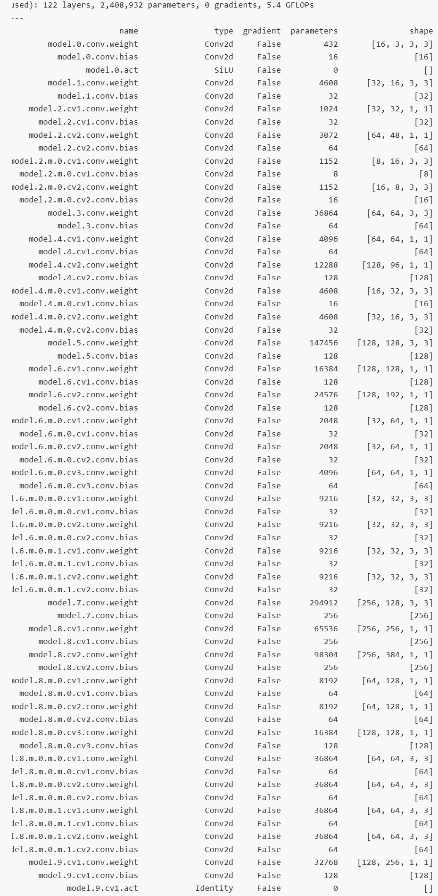

# YOLO26

ref：[https://github.com/ultralytics/ultralytics/tree/main](https://github.com/ultralytics/ultralytics/tree/main)

主要算子：conv（CBS）、self-attention、残差连接、上下采样、排序（head）。

### 粗粒度架构

[https://github.com/ultralytics/ultralytics/tree/main/ultralytics/cfg/models/26](https://github.com/ultralytics/ultralytics/tree/main/ultralytics/cfg/models/26)

```python
# Ultralytics 🚀 AGPL-3.0 License - https://ultralytics.com/license

# Ultralytics YOLO26 object detection model with P3/8 - P5/32 outputs
# Model docs: https://docs.ultralytics.com/models/yolo26
# Task docs: https://docs.ultralytics.com/tasks/detect

# Parameters
nc: 80 # number of classes
end2end: True # whether to use end-to-end mode
reg_max: 1 # DFL bins
scales: # model compound scaling constants, i.e. 'model=yolo26n.yaml' will call yolo26.yaml with scale 'n'
  # [depth, width, max_channels]
  n: [0.50, 0.25, 1024] # summary: 260 layers, 2,572,280 parameters, 2,572,280 gradients, 6.1 GFLOPs
  s: [0.50, 0.50, 1024] # summary: 260 layers, 10,009,784 parameters, 10,009,784 gradients, 22.8 GFLOPs
  m: [0.50, 1.00, 512] # summary: 280 layers, 21,896,248 parameters, 21,896,248 gradients, 75.4 GFLOPs
  l: [1.00, 1.00, 512] # summary: 392 layers, 26,299,704 parameters, 26,299,704 gradients, 93.8 GFLOPs
  x: [1.00, 1.50, 512] # summary: 392 layers, 58,993,368 parameters, 58,993,368 gradients, 209.5 GFLOPs

# YOLO26n backbone
backbone:
  # [from, repeats, module, args]
  - [-1, 1, Conv, [64, 3, 2]] # 0-P1/2
  - [-1, 1, Conv, [128, 3, 2]] # 1-P2/4
  - [-1, 2, C3k2, [256, False, 0.25]]
  - [-1, 1, Conv, [256, 3, 2]] # 3-P3/8
  - [-1, 2, C3k2, [512, False, 0.25]]
  - [-1, 1, Conv, [512, 3, 2]] # 5-P4/16
  - [-1, 2, C3k2, [512, True]]
  - [-1, 1, Conv, [1024, 3, 2]] # 7-P5/32
  - [-1, 2, C3k2, [1024, True]]
  - [-1, 1, SPPF, [1024, 5, 3, True]] # 9
  - [-1, 2, C2PSA, [1024]] # 10

# YOLO26n head
head:
  - [-1, 1, nn.Upsample, [None, 2, "nearest"]]
  - [[-1, 6], 1, Concat, [1]] # cat backbone P4
  - [-1, 2, C3k2, [512, True]] # 13

  - [-1, 1, nn.Upsample, [None, 2, "nearest"]]
  - [[-1, 4], 1, Concat, [1]] # cat backbone P3
  - [-1, 2, C3k2, [256, True]] # 16 (P3/8-small)

  - [-1, 1, Conv, [256, 3, 2]]
  - [[-1, 13], 1, Concat, [1]] # cat head P4
  - [-1, 2, C3k2, [512, True]] # 19 (P4/16-medium)

  - [-1, 1, Conv, [512, 3, 2]]
  - [[-1, 10], 1, Concat, [1]] # cat head P5
  - [-1, 1, C3k2, [1024, True, 0.5, True]] # 22 (P5/32-large)

  - [[16, 19, 22], 1, Detect, [nc]] # Detect(P3, P4, P5)
```

### Conv（conv）

[https://github.com/ultralytics/ultralytics/blob/main/ultralytics/nn/modules/conv.py](https://github.com/ultralytics/ultralytics/blob/main/ultralytics/nn/modules/conv.py)

```python
class Conv(nn.Module):
    """Standard convolution module with batch normalization and activation.

    Attributes:
        conv (nn.Conv2d): Convolutional layer.
        bn (nn.BatchNorm2d): Batch normalization layer.
        act (nn.Module): Activation function layer.
        default_act (nn.Module): Default activation function (SiLU).
    """

    default_act = nn.SiLU()  # default activation

    def __init__(self, c1, c2, k=1, s=1, p=None, g=1, d=1, act=True):
        """Initialize Conv layer with given parameters.

        Args:
            c1 (int): Number of input channels.
            c2 (int): Number of output channels.
            k (int): Kernel size.
            s (int): Stride.
            p (int, optional): Padding.
            g (int): Groups.
            d (int): Dilation.
            act (bool | nn.Module): Activation function.
        """
        super().__init__()
        self.conv = nn.Conv2d(c1, c2, k, s, autopad(k, p, d), groups=g, dilation=d, bias=False)
        self.bn = nn.BatchNorm2d(c2)
        self.act = self.default_act if act is True else act if isinstance(act, nn.Module) else nn.Identity()

    def forward(self, x):
        """Apply convolution, batch normalization and activation to input tensor.

        Args:
            x (torch.Tensor): Input tensor.

        Returns:
            (torch.Tensor): Output tensor.
        """
        return self.act(self.bn(self.conv(x)))

    def forward_fuse(self, x):
        """Apply convolution and activation without batch normalization.

        Args:
            x (torch.Tensor): Input tensor.

        Returns:
            (torch.Tensor): Output tensor.
        """
        return self.act(self.conv(x))

```

### C3k2

[https://github.com/ultralytics/ultralytics/blob/main/ultralytics/nn/modules/block.py](https://github.com/ultralytics/ultralytics/blob/main/ultralytics/nn/modules/block.py)

```python
class C3k2(C2f):
    """Faster Implementation of CSP Bottleneck with 2 convolutions."""

    def __init__(
        self,
        c1: int,
        c2: int,
        n: int = 1,
        c3k: bool = False,
        e: float = 0.5,
        attn: bool = False,
        g: int = 1,
        shortcut: bool = True,
    ):
        """Initialize C3k2 module.

        Args:
            c1 (int): Input channels.
            c2 (int): Output channels.
            n (int): Number of blocks.
            c3k (bool): Whether to use C3k blocks.
            e (float): Expansion ratio.
            attn (bool): Whether to use attention blocks.
            g (int): Groups for convolutions.
            shortcut (bool): Whether to use shortcut connections.
        """
        super().__init__(c1, c2, n, shortcut, g, e)
        self.m = nn.ModuleList(
            nn.Sequential(
                Bottleneck(self.c, self.c, shortcut, g),
                PSABlock(self.c, attn_ratio=0.5, num_heads=max(self.c // 64, 1)),
            )
            if attn
            else C3k(self.c, self.c, 2, shortcut, g)
            if c3k
            else Bottleneck(self.c, self.c, shortcut, g)
            for _ in range(n)
        )
        
        
class PSABlock(nn.Module):
    """PSABlock class implementing a Position-Sensitive Attention block for neural networks.

    This class encapsulates the functionality for applying multi-head attention and feed-forward neural network layers
    with optional shortcut connections.

    Attributes:
        attn (Attention): Multi-head attention module.
        ffn (nn.Sequential): Feed-forward neural network module.
        add (bool): Flag indicating whether to add shortcut connections.

    Methods:
        forward: Performs a forward pass through the PSABlock, applying attention and feed-forward layers.

    Examples:
        Create a PSABlock and perform a forward pass
        >>> psablock = PSABlock(c=128, attn_ratio=0.5, num_heads=4, shortcut=True)
        >>> input_tensor = torch.randn(1, 128, 32, 32)
        >>> output_tensor = psablock(input_tensor)
    """

    def __init__(self, c: int, attn_ratio: float = 0.5, num_heads: int = 4, shortcut: bool = True) -> None:
        """Initialize the PSABlock.

        Args:
            c (int): Input and output channels.
            attn_ratio (float): Attention ratio for key dimension.
            num_heads (int): Number of attention heads.
            shortcut (bool): Whether to use shortcut connections.
        """
        super().__init__()

        self.attn = Attention(c, attn_ratio=attn_ratio, num_heads=num_heads)
        self.ffn = nn.Sequential(Conv(c, c * 2, 1), Conv(c * 2, c, 1, act=False))
        self.add = shortcut

    def forward(self, x: torch.Tensor) -> torch.Tensor:
        """Execute a forward pass through PSABlock.

        Args:
            x (torch.Tensor): Input tensor.

        Returns:
            (torch.Tensor): Output tensor after attention and feed-forward processing.
        """
        x = x + self.attn(x) if self.add else self.attn(x)
        x = x + self.ffn(x) if self.add else self.ffn(x)
        return x
        
 
 class Attention(nn.Module):
    """Attention module that performs self-attention on the input tensor.

    Args:
        dim (int): The input tensor dimension.
        num_heads (int): The number of attention heads.
        attn_ratio (float): The ratio of the attention key dimension to the head dimension.

    Attributes:
        num_heads (int): The number of attention heads.
        head_dim (int): The dimension of each attention head.
        key_dim (int): The dimension of the attention key.
        scale (float): The scaling factor for the attention scores.
        qkv (Conv): Convolutional layer for computing the query, key, and value.
        proj (Conv): Convolutional layer for projecting the attended values.
        pe (Conv): Convolutional layer for positional encoding.
    """

    def __init__(self, dim: int, num_heads: int = 8, attn_ratio: float = 0.5):
        """Initialize multi-head attention module.

        Args:
            dim (int): Input dimension.
            num_heads (int): Number of attention heads.
            attn_ratio (float): Attention ratio for key dimension.
        """
        super().__init__()
        self.num_heads = num_heads
        self.head_dim = dim // num_heads
        self.key_dim = int(self.head_dim * attn_ratio)
        self.scale = self.key_dim**-0.5
        nh_kd = self.key_dim * num_heads
        h = dim + nh_kd * 2
        self.qkv = Conv(dim, h, 1, act=False)
        self.proj = Conv(dim, dim, 1, act=False)
        self.pe = Conv(dim, dim, 3, 1, g=dim, act=False)

    def forward(self, x: torch.Tensor) -> torch.Tensor:
        """Forward pass of the Attention module.

        Args:
            x (torch.Tensor): The input tensor.

        Returns:
            (torch.Tensor): The output tensor after self-attention.
        """
        B, C, H, W = x.shape
        N = H * W
        qkv = self.qkv(x)
        q, k, v = qkv.view(B, self.num_heads, self.key_dim * 2 + self.head_dim, N).split(
            [self.key_dim, self.key_dim, self.head_dim], dim=2
        )

        attn = (q.transpose(-2, -1) @ k) * self.scale
        attn = attn.softmax(dim=-1)
        x = (v @ attn.transpose(-2, -1)).view(B, C, H, W) + self.pe(v.reshape(B, C, H, W))
        x = self.proj(x)
        return x
 
 
 
 
 class C3k(C3):
    """C3k is a CSP bottleneck module with customizable kernel sizes for feature extraction in neural networks."""

    def __init__(self, c1: int, c2: int, n: int = 1, shortcut: bool = True, g: int = 1, e: float = 0.5, k: int = 3):
        """Initialize C3k module.

        Args:
            c1 (int): Input channels.
            c2 (int): Output channels.
            n (int): Number of Bottleneck blocks.
            shortcut (bool): Whether to use shortcut connections.
            g (int): Groups for convolutions.
            e (float): Expansion ratio.
            k (int): Kernel size.
        """
        super().__init__(c1, c2, n, shortcut, g, e)
        c_ = int(c2 * e)  # hidden channels
        # self.m = nn.Sequential(*(RepBottleneck(c_, c_, shortcut, g, k=(k, k), e=1.0) for _ in range(n)))
        self.m = nn.Sequential(*(Bottleneck(c_, c_, shortcut, g, k=(k, k), e=1.0) for _ in range(n)))
```

### SPPF（block）

```python
class SPPF(nn.Module):
    """Spatial Pyramid Pooling - Fast (SPPF) layer for YOLOv5 by Glenn Jocher."""

    def __init__(self, c1: int, c2: int, k: int = 5, n: int = 3, shortcut: bool = False):
        """Initialize the SPPF layer with given input/output channels and kernel size.

        Args:
            c1 (int): Input channels.
            c2 (int): Output channels.
            k (int): Kernel size.
            n (int): Number of pooling iterations.
            shortcut (bool): Whether to use shortcut connection.

        Notes:
            This module is equivalent to SPP(k=(5, 9, 13)).
        """
        super().__init__()
        c_ = c1 // 2  # hidden channels
        self.cv1 = Conv(c1, c_, 1, 1, act=False)
        self.cv2 = Conv(c_ * (n + 1), c2, 1, 1)
        self.m = nn.MaxPool2d(kernel_size=k, stride=1, padding=k // 2)
        self.n = n
        self.add = shortcut and c1 == c2

    def forward(self, x: torch.Tensor) -> torch.Tensor:
        """Apply sequential pooling operations to input and return concatenated feature maps."""
        y = [self.cv1(x)]
        y.extend(self.m(y[-1]) for _ in range(getattr(self, "n", 3)))
        y = self.cv2(torch.cat(y, 1))
        return y + x if getattr(self, "add", False) else y
```

### C2PSA（block）

```python
class C2PSA(nn.Module):
    """C2PSA module with attention mechanism for enhanced feature extraction and processing.

    This module implements a convolutional block with attention mechanisms to enhance feature extraction and processing
    capabilities. It includes a series of PSABlock modules for self-attention and feed-forward operations.

    Attributes:
        c (int): Number of hidden channels.
        cv1 (Conv): 1x1 convolution layer to reduce the number of input channels to 2*c.
        cv2 (Conv): 1x1 convolution layer to reduce the number of output channels to c.
        m (nn.Sequential): Sequential container of PSABlock modules for attention and feed-forward operations.

    Methods:
        forward: Performs a forward pass through the C2PSA module, applying attention and feed-forward operations.

    Examples:
        >>> c2psa = C2PSA(c1=256, c2=256, n=3, e=0.5)
        >>> input_tensor = torch.randn(1, 256, 64, 64)
        >>> output_tensor = c2psa(input_tensor)

    Notes:
        This module essentially is the same as PSA module, but refactored to allow stacking more PSABlock modules.
    """

    def __init__(self, c1: int, c2: int, n: int = 1, e: float = 0.5):
        """Initialize C2PSA module.

        Args:
            c1 (int): Input channels.
            c2 (int): Output channels.
            n (int): Number of PSABlock modules.
            e (float): Expansion ratio.
        """
        super().__init__()
        assert c1 == c2
        self.c = int(c1 * e)
        self.cv1 = Conv(c1, 2 * self.c, 1, 1)
        self.cv2 = Conv(2 * self.c, c1, 1)

        self.m = nn.Sequential(*(PSABlock(self.c, attn_ratio=0.5, num_heads=self.c // 64) for _ in range(n)))

    def forward(self, x: torch.Tensor) -> torch.Tensor:
        """Process the input tensor through a series of PSA blocks.

        Args:
            x (torch.Tensor): Input tensor.

        Returns:
            (torch.Tensor): Output tensor after processing.
        """
        a, b = self.cv1(x).split((self.c, self.c), dim=1)
        b = self.m(b)
        return self.cv2(torch.cat((a, b), 1))
```

### Detect（head）

[https://github.com/ultralytics/ultralytics/blob/main/ultralytics/nn/modules/head.py](https://github.com/ultralytics/ultralytics/blob/main/ultralytics/nn/modules/head.py)

```python
class Detect(nn.Module):
    """YOLO Detect head for object detection models.

    This class implements the detection head used in YOLO models for predicting bounding boxes and class probabilities.
    It supports both training and inference modes, with optional end-to-end detection capabilities.

    Attributes:
        dynamic (bool): Force grid reconstruction.
        export (bool): Export mode flag.
        format (str): Export format.
        end2end (bool): End-to-end detection mode.
        max_det (int): Maximum detections per image.
        shape (tuple): Input shape.
        anchors (torch.Tensor): Anchor points.
        strides (torch.Tensor): Feature map strides.
        legacy (bool): Backward compatibility for v3/v5/v8/v9 models.
        xyxy (bool): Output format, xyxy or xywh.
        nc (int): Number of classes.
        nl (int): Number of detection layers.
        reg_max (int): DFL channels.
        no (int): Number of outputs per anchor.
        stride (torch.Tensor): Strides computed during build.
        cv2 (nn.ModuleList): Convolution layers for box regression.
        cv3 (nn.ModuleList): Convolution layers for classification.
        dfl (nn.Module): Distribution Focal Loss layer.
        one2one_cv2 (nn.ModuleList): One-to-one convolution layers for box regression.
        one2one_cv3 (nn.ModuleList): One-to-one convolution layers for classification.

    Methods:
        forward: Perform forward pass and return predictions.
        forward_end2end: Perform forward pass for end-to-end detection.
        bias_init: Initialize detection head biases.
        decode_bboxes: Decode bounding boxes from predictions.
        postprocess: Post-process model predictions.

    Examples:
        Create a detection head for 80 classes
        >>> detect = Detect(nc=80, ch=(256, 512, 1024))
        >>> x = [torch.randn(1, 256, 80, 80), torch.randn(1, 512, 40, 40), torch.randn(1, 1024, 20, 20)]
        >>> outputs = detect(x)
    """

    dynamic = False  # force grid reconstruction
    export = False  # export mode
    format = None  # export format
    max_det = 300  # max_det
    shape = None
    anchors = torch.empty(0)  # init
    strides = torch.empty(0)  # init
    legacy = False  # backward compatibility for v3/v5/v8/v9 models
    xyxy = False  # xyxy or xywh output

    def __init__(self, nc: int = 80, reg_max=16, end2end=False, ch: tuple = ()):
        """Initialize the YOLO detection layer with specified number of classes and channels.

        Args:
            nc (int): Number of classes.
            reg_max (int): Maximum number of DFL channels.
            end2end (bool): Whether to use end-to-end NMS-free detection.
            ch (tuple): Tuple of channel sizes from backbone feature maps.
        """
        super().__init__()
        self.nc = nc  # number of classes
        self.nl = len(ch)  # number of detection layers
        self.reg_max = reg_max  # DFL channels (ch[0] // 16 to scale 4/8/12/16/20 for n/s/m/l/x)
        self.no = nc + self.reg_max * 4  # number of outputs per anchor
        self.stride = torch.zeros(self.nl)  # strides computed during build
        c2, c3 = max((16, ch[0] // 4, self.reg_max * 4)), max(ch[0], min(self.nc, 100))  # channels
        self.cv2 = nn.ModuleList(
            nn.Sequential(Conv(x, c2, 3), Conv(c2, c2, 3), nn.Conv2d(c2, 4 * self.reg_max, 1)) for x in ch
        )
        self.cv3 = (
            nn.ModuleList(nn.Sequential(Conv(x, c3, 3), Conv(c3, c3, 3), nn.Conv2d(c3, self.nc, 1)) for x in ch)
            if self.legacy
            else nn.ModuleList(
                nn.Sequential(
                    nn.Sequential(DWConv(x, x, 3), Conv(x, c3, 1)),
                    nn.Sequential(DWConv(c3, c3, 3), Conv(c3, c3, 1)),
                    nn.Conv2d(c3, self.nc, 1),
                )
                for x in ch
            )
        )
        self.dfl = DFL(self.reg_max) if self.reg_max > 1 else nn.Identity()

        if end2end:
            self.one2one_cv2 = copy.deepcopy(self.cv2)
            self.one2one_cv3 = copy.deepcopy(self.cv3)

    @property
    def one2many(self):
        """Returns the one-to-many head components, here for v5/v5/v8/v9/11 backward compatibility."""
        return dict(box_head=self.cv2, cls_head=self.cv3)

    @property
    def one2one(self):
        """Returns the one-to-one head components."""
        return dict(box_head=self.one2one_cv2, cls_head=self.one2one_cv3)

    @property
    def end2end(self):
        """Checks if the model has one2one for v5/v5/v8/v9/11 backward compatibility."""
        return hasattr(self, "one2one")

    def forward_head(
        self, x: list[torch.Tensor], box_head: torch.nn.Module = None, cls_head: torch.nn.Module = None
    ) -> dict[str, torch.Tensor]:
        """Concatenates and returns predicted bounding boxes and class probabilities."""
        if box_head is None or cls_head is None:  # for fused inference
            return dict()
        bs = x[0].shape[0]  # batch size
        boxes = torch.cat([box_head[i](x[i]).view(bs, 4 * self.reg_max, -1) for i in range(self.nl)], dim=-1)
        scores = torch.cat([cls_head[i](x[i]).view(bs, self.nc, -1) for i in range(self.nl)], dim=-1)
        return dict(boxes=boxes, scores=scores, feats=x)

    def forward(
        self, x: list[torch.Tensor]
    ) -> dict[str, torch.Tensor] | torch.Tensor | tuple[torch.Tensor, dict[str, torch.Tensor]]:
        """Concatenates and returns predicted bounding boxes and class probabilities."""
        preds = self.forward_head(x, **self.one2many)
        if self.end2end:
            x_detach = [xi.detach() for xi in x]
            one2one = self.**forward_head**(x_detach, **self.one2one)
            preds = {"one2many": preds, "one2one": one2one}
        if self.training:
            return preds
        y = self._inference(preds["one2one"] if self.end2end else preds)
        if self.end2end:
            y = self.**postprocess**(y.permute(0, 2, 1))
        return y if self.export else (y, preds)

    def _inference(self, x: dict[str, torch.Tensor]) -> torch.Tensor:
        """Decode predicted bounding boxes and class probabilities based on multiple-level feature maps.

        Args:
            x (dict[str, torch.Tensor]): List of feature maps from different detection layers.

        Returns:
            (torch.Tensor): Concatenated tensor of decoded bounding boxes and class probabilities.
        """
        # Inference path
        dbox = self._get_decode_boxes(x)
        return torch.cat((dbox, x["scores"].sigmoid()), 1)

    def _get_decode_boxes(self, x: dict[str, torch.Tensor]) -> torch.Tensor:
        """Get decoded boxes based on anchors and strides."""
        shape = x["feats"][0].shape  # BCHW
        if self.dynamic or self.shape != shape:
            self.anchors, self.strides = (a.transpose(0, 1) for a in make_anchors(x["feats"], self.stride, 0.5))
            self.shape = shape

        dbox = self.decode_bboxes(self.dfl(x["boxes"]), self.anchors.unsqueeze(0)) * self.strides
        return dbox

    def bias_init(self):
        """Initialize Detect() biases, WARNING: requires stride availability."""
        for i, (a, b) in enumerate(zip(self.one2many["box_head"], self.one2many["cls_head"])):  # from
            a[-1].bias.data[:] = 2.0  # box
            b[-1].bias.data[: self.nc] = math.log(
                5 / self.nc / (640 / self.stride[i]) ** 2
            )  # cls (.01 objects, 80 classes, 640 img)
        if self.end2end:
            for i, (a, b) in enumerate(zip(self.one2one["box_head"], self.one2one["cls_head"])):  # from
                a[-1].bias.data[:] = 2.0  # box
                b[-1].bias.data[: self.nc] = math.log(
                    5 / self.nc / (640 / self.stride[i]) ** 2
                )  # cls (.01 objects, 80 classes, 640 img)

    def decode_bboxes(self, bboxes: torch.Tensor, anchors: torch.Tensor, xywh: bool = True) -> torch.Tensor:
        """Decode bounding boxes from predictions."""
        return dist2bbox(
            bboxes,
            anchors,
            xywh=xywh and not self.end2end and not self.xyxy,
            dim=1,
        )

    def postprocess(self, preds: torch.Tensor) -> torch.Tensor:
        """Post-processes YOLO model predictions.

        Args:
            preds (torch.Tensor): Raw predictions with shape (batch_size, num_anchors, 4 + nc) with last dimension
                format [x, y, w, h, class_probs].

        Returns:
            (torch.Tensor): Processed predictions with shape (batch_size, min(max_det, num_anchors), 6) and last
                dimension format [x, y, w, h, max_class_prob, class_index].
        """
        boxes, scores = preds.split([4, self.nc], dim=-1)
        scores, conf, idx = self.get_topk_index(scores, self.max_det)
        boxes = boxes.gather(dim=1, index=idx.repeat(1, 1, 4))
        return torch.cat([boxes, scores, conf], dim=-1)

    def get_topk_index(self, scores: torch.Tensor, max_det: int) -> tuple[torch.Tensor, torch.Tensor, torch.Tensor]:
        """Get top-k indices from scores.

        Args:
            scores (torch.Tensor): Scores tensor with shape (batch_size, num_anchors, num_classes).
            max_det (int): Maximum detections per image.

        Returns:
            (torch.Tensor, torch.Tensor, torch.Tensor): Top scores, class indices, and filtered indices.
        """
        batch_size, anchors, nc = scores.shape  # i.e. shape(16,8400,84)
        # Use max_det directly during export for TensorRT compatibility (requires k to be constant),
        # otherwise use min(max_det, anchors) for safety with small inputs during Python inference
        k = max_det if self.export else min(max_det, anchors)
        ori_index = scores.max(dim=-1)[0].topk(k)[1].unsqueeze(-1)
        scores = scores.gather(dim=1, index=ori_index.repeat(1, 1, nc))
        scores, index = scores.flatten(1).topk(k)
        idx = ori_index[torch.arange(batch_size)[..., None], index // nc]  # original index
        return scores[..., None], (index % nc)[..., None].float(), idx

    def fuse(self) -> None:
        """Remove the one2many head for inference optimization."""
        self.cv2 = self.cv3 = None
```

### 算子流

part 1

> **[图片提取文字 (image.png)]:**
> used): 122 layers, 2,408,932 parameters, 0 gradients, 5.4 GFLOPs parameters shape name type gradient model.0.conv.weight Conv2d False [16, 3, 3, 3] 432 model.0.conv.bias [16] Conv2d False 16 model.0.act SiLU False 0 [] model.1.conv.weight [32, 16, 3, 3] Conv2d False 4608 model.1.conv.bias False Conv2d 32 [32] model.2.cv1.conv.weight Conv2d False 1024 [32, 32, 1, 1] model.2.cv1.conv.bias Conv2d False [32] 32 model.2.cv2.conv.weight Conv2d False 3072 [64, 48, 1, 1] model.2.cv2.conv.bias Conv2d False [64] 64 nodel.2.m.0.cv1.conv.weight Conv2d False [8, 16, 3, 3] 1152 model.2.m.0.cv1.conv.bias Conv2d False 8 [8] nodel.2.m.0.cv2.conv.weight Conv2d False 1152 [16, 8, 3, 3]model.2.m.0.cv2.conv.bias False Conv2d [16] 16 model.3.conv.weight Conv2d False 36864 [64, 64, 3, 3] model.3.conv.bias Conv2d False [64] 64 model.4.cv1.conv.weight Conv2d False 4096 [64, 64, 1, 1] model.4.cv1.conv.bias False Conv2d [64] 64 model.4.cv2.conv.weight Conv2d False 12288 [128, 96, 1, 1] model.4.cv2.conv.bias Conv2d False [128] 128 nodel.4.m.0.cv1.conv.weight Conv2d False [16, 32, 3, 3] 4608 model.4.m.0.cv1.conv.bias False Conv2d [16] 16 nodel.4.m.0.cv2.conv.weight Conv2d False [32, 16, 3, 3] 4608 model.4.m.0.cv2.conv.bias False Conv2d [32] 32 model.5.conv.weight Conv2d False 147456 [128, 128, 3, 3] model.5.conv.bias Conv2d False [128] 128 model.6.cv1.conv.weight Conv2d False 16384 [128, 128, 1, 1] model.6.cv1.conv.bias False Conv2d 128 [128] model.6.cv2.conv.weight Conv2d False 24576 [128, 192, 1, 1] model.6.cv2.conv.bias Conv2d False 128 [128] nodel.6.m.0.cv1.conv.weight Conv2d False 2048 [32, 64, 1, 1] model.6.m.0.cv1.conv.bias False Conv2d [32] 32 [32, 64, 1, 1] nodel.6.m.0.cv2.conv.weight Conv2d False 2048 model.6.m.0.cv2.conv.bias False Conv2d [32] 32 nodel.6.m.0.cv3.conv.weight Conv2d False 4096 [64, 64, 1, 1] model.6.m.0.cv3.conv.bias False Conv2d [64] 64 l.6.m.0.m.0.cv1.conv.weight Conv2d False [32, 32, 3, 3] 9216 fel.6.m.0.m.0.cv1.conv.bias Conv2d False [32] 32 1.6.m.0.m.0.cv2.conv.weight Conv2d False [32, 32, 3, 3] 9216 fel.6.m.0.m.0.cv2.conv.bias Conv2d False 32 [32] L.6.m.0.m.1.cv1.conv.weight [32, 32, 3, 3] Conv2d False 9216 tel.6.m.0.m.1.cv1.conv.bias Conv2d False 32 [32] 1.6.m.0.m.1.cv2.conv.weight False Conv2d 9216 [32, 32, 3, 3] tel.6.m.0.m.1.cv2.conv.bias Conv2d False 32 [32] model.7.conv.weight False Conv2d 294912 [256, 128, 3, 3] False model.7.conv.bias Conv2d [256] 256 model.8.cv1.conv.weight False [256, 256, 1, 1] Conv2d 65536 model.8.cv1.conv.bias False Conv2d [256] 256 [256, 384, 1, 1] model.8.cv2.conv.weight False 98304 Conv2d model.8.cv2.conv.bias False Conv2d 256 [256] nodel.8.m.0.cv1.conv.weight False 8192 [64, 128, 1, 1] Conv2d
> 
> False
> 
> False
> 
> False
> 
> False
> 
> False
> 
> False
> 
> False
> 
> False
> 
> False
> 
> False
> 
> False
> 
> False
> 
> False
> 
> False
> 
> False
> 
> False
> 
> 64
> 
> 64
> 
> 8192
> 
> 16384
> 
> 36864
> 
> 36864
> 
> 36864
> 
> 36864
> 
> 32768
> 
> 128
> 
> 0
> 
> 128
> 
> 64
> 
> 64
> 
> 64
> 
> 64
> 
> Conv2d
> 
> Conv2d
> 
> Conv2d
> 
> Conv2d
> 
> Conv2d
> 
> Conv2d
> 
> Conv2d
> 
> Conv2d
> 
> Conv2d
> 
> Conv2d
> 
> Conv2d
> 
> Conv2d
> 
> Conv2d
> 
> Conv2d
> 
> Conv2d
> 
> Identity
> 
> [64]
> 
> [64]
> 
> [128]
> 
> [64]
> 
> [64]
> 
> [64]
> 
> [64]
> 
> [128]
> 
> []
> 
> [64, 128, 1, 1]
> 
> [128, 128, 1, 1]
> 
> [64, 64, 3, 3]
> 
> [64, 64, 3, 3]
> 
> [64, 64, 3, 3]
> 
> [64, 64, 3, 3]
> 
> [128, 256, 1, 1]
> 
> model.8.m.0.cv1.conv.bias
> 
> model.8.m.0.cv2.conv.bias
> 
> model.8.m.0.cv3.conv.bias
> 
> nodel.8.m.0.cv2.conv.weight
> 
> nodel.8.m.0.cv3.conv.weight
> 
> 1.8.m.0.m.0.cv1.conv.weight
> 
> tel.8.m.0.m.0.cv1.conv.bias
> 
> 1.8.m.0.m.0.cv2.conv.weight
> 
> tel.8.m.0.m.0.cv2.conv.bias
> 
> 1.8.m.0.m.1.cv1.conv.weight
> 
> tel.8.m.0.m.1.cv1.conv.bias
> 
> 1.8.m.0.m.1.cv2.conv.weight
> 
> tel.8.m.0.m.1.cv2.conv.bias
> 
> model.9.cv1.conv.weight
> 
> model.9.cv1.conv.bias
> 
> model.9.cv1.act


part 2

> **[图片提取文字 (image.png)]:**
> | model.9.cv1.act                                                  | Identity           | False          | 0          | []                     |
> |------------------------------------------------------------------|--------------------|----------------|------------|------------------------|
> | model.9.cv2.conv.weight                                          | Conv2d             | False          | 131072     | [256, 512, 1, 1]       |
> | model.9.cv2.conv.bias                                            | Conv2d             | False          | 256        | [256]                  |
> | model.9.m                                                        | MaxPool2d          | False          | 0          | []                     |
> | model.10.cv1.conv.weight                                         | Conv2d             | False          | 65536      | [256, 256, 1, 1]       |
> | model.10.cv1.conv.bias                                           | Conv2d             | False          | 256        | [256]                  |
> | model.10.cv2.conv.weight                                         | Conv2d             | False          | 65536      | [256, 256, 1, 1]       |
> | model.10.cv2.conv.bias                                           | Conv2d             | False          | 256        | [256]                  |
> | LO.m.O.attn.qkv.conv.weight                                      | Conv2d<br>Conv2d   | False<br>False | 32768      | [256, 128, 1, 1]       |
> | l.10.m.0.attn.qkv.conv.bias                                      |                    | False          | 256<br>0   | [256]                  |
> | <pre>model.10.m.0.attn.qkv.act ).m.0.attn.proj.conv.weight</pre> | Identity<br>Conv2d | False          | 16384      | []                     |
> | .10.m.0.attn.proj.conv.weight                                    | Conv2d             | False          | 10364      | [128, 128, 1, 1]       |
> | model.10.m.0.attn.proj.act                                       | Identity           | False          | 0          | [128]                  |
> | 10.m.0.attn.pe.conv.weight                                       | Conv2d             | False          | 1152       | [128, 1, 3, 3]         |
> | 21.10.m.0.attn.pe.conv.bias                                      | Conv2d             | False          | 128        | [128]                  |
> | model.10.m.0.attn.pe.act                                         | Identity           | False          | 0          | [120]                  |
> | ≥1.10.m.0. <b>ffn</b> .0.conv.weight                             | Conv2d             | False          | 32768      | [256, 128, 1, 1]       |
> | odel.10.m.0.ffn.0.conv.bias                                      | Conv2d             | False          | 256        | [256]                  |
> | ≥1.10.m.0. <b>ffn</b> .1.conv.weight                             | Conv2d             | False          | 32768      | [128, 256, 1, 1]       |
> | odel.10.m.0.ffn.1.conv.bias                                      | Conv2d             | False          | 128        | [128]                  |
> | model.10.m.0.ffn.1.act                                           | Identity           | False          | 0          | []                     |
> | model.11                                                         | Upsample           | False          | 0          | []                     |
> | model.12                                                         | Concat             | False          | 0          | []                     |
> | model.13.cv1.conv.weight                                         | Conv2d             | False          | 49152      | [128, 384, 1, 1]       |
> | model.13.cv1.conv.bias                                           | Conv2d             | False          | 128        | [128]                  |
> | model.13.cv2.conv.weight                                         | Conv2d             | False          | 24576      | [128, 192, 1, 1]       |
> | model.13.cv2.conv.bias                                           | Conv2d             | False          | 128        | [128]                  |
> | odel.13.m.0.cv1.conv.weight                                      | Conv2d             | False          | 2048       | [32, 64, 1, 1]         |
> | model.13.m.0.cv1.conv.bias                                       | Conv2d             | False          | 32         | [32]                   |
> | odel.13.m.0.cv2.conv.weight                                      | Conv2d             | False          | 2048       | [32, 64, 1, 1]         |
> | model.13.m.0.cv2.conv.bias                                       | Conv2d             | False          | 32         | [32]                   |
> | odel.13.m.0.cv3.conv.weight                                      | Conv2d             | False          | 4096       | [64, 64, 1, 1]         |
> | model.13.m.0.cv3.conv.bias                                       | Conv2d             | False          | 64         | [64]                   |
> | .13.m.0.m.0.cv1.conv.weight                                      | Conv2d             | False          | 9216       | [32, 32, 3, 3]         |
> | 1.13.m.0.m.0.cv1.conv.bias                                       | Conv2d             | False<br>False | 32         | [32]                   |
> | .13.m.0.m.0.cv2.conv.weight                                      | Conv2d<br>Conv2d   | False          | 9216<br>32 | [32, 32, 3, 3]<br>[32] |
> | .13.m.0.m.1.cv1.conv.weight                                      | Conv2d             | False          | 9216       | [32, 32, 3, 3]         |
> | 21.13.m.0.m.1.cv1.conv.weight                                    | Conv2d             | False          | 32         | [32, 32, 3, 3]         |
> | .13.m.0.m.1.cv2.conv.weight                                      | Conv2d             | False          | 9216       | [32, 32, 3, 3]         |
> | el.13.m.0.m.1.cv2.conv.bias                                      | Conv2d             | False          | 32         | [32, 32, 3, 3]         |
> | model.14                                                         | Upsample           | False          | 0          | []                     |
> | model.15                                                         | Concat             | False          | 0          | []                     |
> | model.16.cv1.conv.weight                                         | Conv2d             | False          | 16384      | [64, 256, 1, 1]        |
> | model.16.cv1.conv.bias                                           | Conv2d             | False          | 64         | [64]                   |
> | model.16.cv2.conv.weight                                         | Conv2d             | False          | 6144       | [64, 96, 1, 1]         |
> | model.16.cv2.conv.bias                                           | Conv2d             | False          | 64         | [64]                   |
> | odel.16.m.0.cv1.conv.weight                                      | Conv2d             | False          | 512        | [16, 32, 1, 1]         |
> | model.16.m.0.cv1.conv.bias                                       | Conv2d             | False          | 16         | [16]                   |
> | odel.16.m.0.cv2.conv.weight                                      | Conv2d             | False          | 512        | [16, 32, 1, 1]         |
> | model.16.m.0.cv2.conv.bias                                       | Conv2d             | False          | 16         | [16]                   |
> | odel.16.m.0.cv3.conv.weight                                      | Conv2d             | False          | 1024       | [32, 32, 1, 1]         |
> | model.16.m.0.cv3.conv.bias                                       | Conv2d             | False          | 32         | [32]                   |
> | .16.m.0.m.0.cv1.conv.weight                                      | Conv2d             | False          | 2304       | [16, 16, 3, 3]         |
> | :1.16.m.0.m.0.cv1.conv.bias                                      | Conv2d             | False          | 16         | [16]                   |
> | .16.m.0.m.0.cv2.conv.weight                                      | Conv2d             | False          | 2304       | [16, 16, 3, 3]         |
> | 21.16.m.0.m.0.cv2.conv.bias                                      | Conv2d             | False          | 16         | [16]                   |
> | 16.m.0.m.1.cv1.conv.weight                                       | Conv2d             | False          | 2304       | [16, 16, 3, 3]         |
> | el.16.m.0.m.1.cv1.conv.bias                                      | Conv2d             | False          | 16         | [16]                   |
> | .16.m.0.m.1.cv2.conv.weight                                      | Conv2d             | False          | 2304       | [16, 16, 3, 3]         |
> | 21.16.m.0.m.1.cv2.conv.bias                                      | Conv2d             | False          | 16         | [16]                   |
> | model.17.conv.weight                                             | Conv2d             | False          | 36864      | [64, 64, 3, 3]         |
> | model.17.conv.bias                                               | Conv2d             | False          | 64         | [64]                   |
> | model.18                                                         | Concat             | False          | 0          | Į.                     |


part 3

> **[图片提取文字 (image.png)]:**
> | model.19.cv1.conv.weight               | Conv2d   | False | 24576  | [128, 192, 1, 1] |
> |----------------------------------------|----------|-------|--------|------------------|
> | model.19.cv1.conv.bias                 | Conv2d   | False | 128    | [128]            |
> | model.19.cv2.conv.weight               | Conv2d   | False | 24576  | [128, 192, 1, 1] |
> | model.19.cv2.conv.bias                 | Conv2d   | False | 128    | [128]            |
> | odel.19.m.0.cv1.conv.weight            | Conv2d   | False | 2048   | [32, 64, 1, 1]   |
> | model.19.m.0.cv1.conv.bias             | Conv2d   | False | 32     | [32]             |
> | odel.19.m.0.cv2.conv.weight            | Conv2d   | False | 2048   | [32, 64, 1, 1]   |
> | model.19.m.0.cv2.conv.bias             | Conv2d   | False | 32     | [32]             |
> | odel.19.m.0.cv3.conv.weight            | Conv2d   | False | 4096   | [64, 64, 1, 1]   |
> | model.19.m.0.cv3.conv.bias             | Conv2d   | False | 64     | [64]             |
> | .19.m.0.m.0.cv1.conv.weight            | Conv2d   | False | 9216   | [32, 32, 3, 3]   |
> | :l.19.m.0.m.0.cv1.conv.bias            | Conv2d   | False | 32     | [32]             |
> | .19.m.0.m.0.cv2.conv.weight            | Conv2d   | False | 9216   | [32, 32, 3, 3]   |
> | :l.19.m.0.m.0.cv2.conv.bias            | Conv2d   | False | 32     | [32]             |
> | .19.m.0.m.1.cv1.conv.weight            | Conv2d   | False | 9216   | [32, 32, 3, 3]   |
> | l.19.m.0.m.1.cv1.conv.bias             | Conv2d   | False | 32     | [32]             |
> | .19.m.0.m.1.cv2.conv.weight            | Conv2d   | False | 9216   | [32, 32, 3, 3]   |
> | :l.19.m.0.m.1.cv2.conv.bias            | Conv2d   | False | 32     | [32]             |
> | model.20.conv.weight                   | Conv2d   | False | 147456 | [128, 128, 3, 3] |
> | model.20.conv.bias                     | Conv2d   | False | 128    | [128]            |
> | model.21                               | Concat   | False | 0      | []               |
> | model.22.cv1.conv.weight               | Conv2d   | False | 98304  | [256, 384, 1, 1] |
> | model.22.cv1.conv.bias                 | Conv2d   | False | 256    | [256]            |
> | model.22.cv2.conv.weight               | Conv2d   | False | 98304  | [256, 384, 1, 1] |
> | model.22.cv2.conv.bias                 | Conv2d   | False | 256    | [256]            |
> | ≥l.22.m.0.0.cv1.conv.weight            | Conv2d   | False | 73728  | [64, 128, 3, 3]  |
> | odel.22.m.0.0.cv1.conv.bias            | Conv2d   | False | 64     | [64]             |
> | ≥1.22.m.0.0.cv2.conv.weight            | Conv2d   | False | 73728  | [128, 64, 3, 3]  |
> | odel.22.m.0.0.cv2.conv.bias            | Conv2d   | False | 128    | [128]            |
> | .m.0.1.attn.qkv.conv.weight            | Conv2d   | False | 32768  | [256, 128, 1, 1] |
> | 22.m.0.1.attn.qkv.conv.bias            | Conv2d   | False | 256    | [256]            |
> | nodel.22.m.0.1.attn.qkv.act            | Identity | False | 0      | []               |
> | n.0.1.attn.proj.conv.weight            | Conv2d   | False | 16384  | [128, 128, 1, 1] |
> | ?.m.0.1.attn.proj.conv.bias            | Conv2d   | False | 128    | [128]            |
> | odel.22.m.0.1.attn.proj.act            | Identity | False | 0      | []               |
> | <pre>?.m.0.1.attn.pe.conv.weight</pre> | Conv2d   | False | 1152   | [128, 1, 3, 3]   |
> | .22.m.0.1.attn.pe.conv.bias            | Conv2d   | False | 128    | [128]            |
> | model.22.m.0.1.attn.pe.act             | Identity | False | 0      | []               |
> | .22.m.0.1.ffn.0.conv.weight            | Conv2d   | False | 32768  | [256, 128, 1, 1] |
> | el.22.m.0.1.ffn.0.conv.bias            | Conv2d   | False | 256    | [256]            |
> | .22.m.0.1.ffn.1.conv.weight            | Conv2d   | False | 32768  | [128, 256, 1, 1] |
> | ો.22.m.0.1.ffn.1.conv.bias             | Conv2d   | False | 128    | [128]            |
> | model.22.m.0.1.ffn.1.act               | Identity | False | 0      | []               |
> | model.23.dfl                           | Identity | False | 0      | []               |


part 4

> **[图片提取文字 (image.png)]:**
> | nne2one cv2.0.0.conv.weight              | Conv2d  | False     | 9216   | [16, 64, 3, 3]  |
> |------------------------------------------|---------|-----------|--------|-----------------|
> | 3.one2one cv2.0.0.conv.bias              | Conv2d  | False     | 16     | [16]            |
> | odel.23.one2one cv2.0.0.act              | SiLU    | False     | 0      | []              |
> | ne2one_cv2.0.1.conv.weight               | Conv2d  | False     | 2304   | [16, 16, 3, 3]  |
> | 3.one2one_cv2.0.1.conv.bias              | Conv2d  | False     | 16     | [16]            |
> | l.23.one2one cv2.0.2.weight              | Conv2d  | False     | 64     | [4, 16, 1, 1]   |
> | del.23.one2one_cv2.0.2.bias              | Conv2d  | False     | 4      | [4]             |
> | ne2one cv2.1.0.conv.weight               | Conv2d  | False     | 18432  | [16, 128, 3, 3] |
> | 3.one2one_cv2.1.0.conv.bias              | Conv2d  | False     | 16     | [16]            |
> | ne2one cv2.1.1.conv.weight               | Conv2d  | False     | 2304   | [16, 16, 3, 3]  |
> | 3.one2one cv2.1.1.conv.bias              | Conv2d  | False     | 16     | [16]            |
> | l.23.one2one cv2.1.2.weight              | Conv2d  | False     | 64     | [4, 16, 1, 1]   |
> | del.23.one2one cv2.1.2.bias              | Conv2d  | False     | 4      | [4]             |
> | ne2one cv2.2.0.conv.weight               | Conv2d  | False     | 36864  | [16, 256, 3, 3] |
> | 3.one2one cv2.2.0.conv.bias              | Conv2d  | False     | 16     | [16]            |
> | nne2one cv2.2.1.conv.weight              | Conv2d  | False     | 2304   | [16, 16, 3, 3]  |
> | 3.one2one cv2.2.1.conv.bias              | Conv2d  | False     | 16     | [16]            |
> | L.23.one2one cv2.2.2.weight              | Conv2d  | False     | 64     | [4, 16, 1, 1]   |
> | del.23.one2one cv2.2.2.bias              | Conv2d  | False     | 4      | [4]             |
> | 22one cv3.0.0.0.conv.weight              | Conv2d  | False     | 576    | [64, 1, 3, 3]   |
> | ne2one cv3.0.0.0.conv.bias               | Conv2d  | False     | 64     | [64]            |
> | -l.23.one2one_cv3.0.0.0.act              | SiLU    | False     | 0      | []              |
> | 22one cv3.0.0.1.conv.weight              | Conv2d  | False     | 5120   | [80, 64, 1, 1]  |
> | ne2one_cv3.0.0.1.conv.bias               | Conv2d  | False     | 80     | [80]            |
> | 22one_cv3.0.1.0.conv.weight              | Conv2d  | False     | 720    | [80, 1, 3, 3]   |
> | nne2one_cv3.0.1.0.conv.bias              | Conv2d  | False     | 80     | [80]            |
> | 20ne_cv3.0.1.1.conv.weight               | Conv2d  | False     | 6400   | [80, 80, 1, 1]  |
> | ne2one_cv3.0.1.1.conv.bias               | Conv2d  | False     | 80     | [80]            |
> | l.23.one2one_cv3.0.2.weight              | Conv2d  | False     | 6400   | [80, 80, 1, 1]  |
> | del.23.one2one_cv3.0.2.bias              | Conv2d  | False     | 80     | [80]            |
> | 20ne_cv3.1.0.0.conv.weight               | Conv2d  | False     | 1152   | [128, 1, 3, 3]  |
> | ne2one_cv3.1.0.0.conv.bias               | Conv2d  | False     | 128    | [128]           |
> | 20ne_cv3.1.0.1.conv.weight               | Conv2d  | False     | 10240  | [80, 128, 1, 1] |
> | ne2one_cv3.1.0.1.conv.bias               | Conv2d  | False     | 80     | [80]            |
> | ≥2one_cv3.1.1.0.conv.weight              | Conv2d  | False     | 720    | [80, 1, 3, 3]   |
> | ne2one_cv3.1.1.0.conv.bias               | Conv2d  | False     | 80     | [80]            |
> | ≥2one_cv3.1.1.1.conv.weight              | Conv2d  | False     | 6400   | [80, 80, 1, 1]  |
> | ne2one_cv3.1.1.1.conv.bias               | Conv2d  | False     | 80     | [80]            |
> | l.23.one2one_cv3.1.2.weight              | Conv2d  | False     | 6400   | [80, 80, 1, 1]  |
> | <pre>lel.23.one2one_cv3.1.2.bias</pre>   | Conv2d  | False     | 80     | [80]            |
> | ≥2one_cv3.2.0.0.conv.weight              | Conv2d  | False     | 2304   | [256, 1, 3, 3]  |
> | ne2one_cv3.2.0.0.conv.bias               | Conv2d  | False     | 256    | [256]           |
> | ≥2one_cv3.2.0.1.conv.weight              | Conv2d  | False     | 20480  | [80, 256, 1, 1] |
> | ne2one_cv3.2.0.1.conv.bias               | Conv2d  | False     | 80     | [80]            |
> | ≥2one_cv3.2.1.0.conv.weight              | Conv2d  | False     | 720    | [80, 1, 3, 3]   |
> | ne2one_cv3.2.1.0.conv.bias               | Conv2d  | False     | 80     | [80]            |
> | 20ne_cv3.2.1.1.conv.weight               | Conv2d  | False     | 6400   | [80, 80, 1, 1]  |
> | one2one_cv3.2.1.1.conv.bias              | Conv2d  | False     | 80     | [80]            |
> | l.23.one2one_cv3.2.2.weight              | Conv2d  | False     | 6400   | [80, 80, 1, 1]  |
> | <pre>lel.23.one2one_cv3.2.2.bias</pre>   | Conv2d  | False     | 80     | [80]            |
> | used): 122 layers, 2,408,932 parameters, | 0 gradi | ents, 5.4 | GFLOPs |                 |
