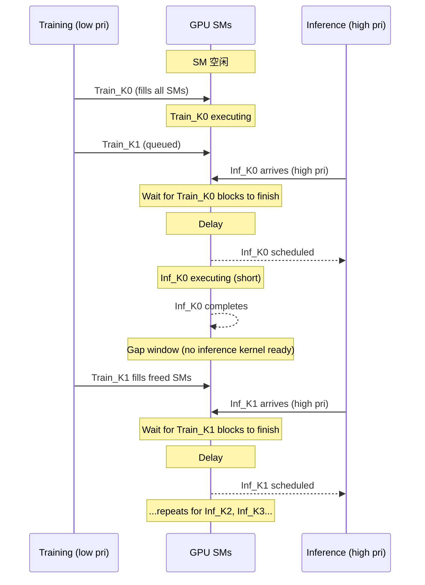

## Compounded Delay (GPU Scheduling Convoy Effect)

术语是什么？回答尽量完整，回答逻辑链中每一步都解释出来。通过联网搜索让回答具体和精准。

Compounded Delay 是本文提出的概念，指在 Priority Streams 机制下，高优先级 kernel 因 GPU 缺乏 block-level preemption 而连续多次被迫等待低优先级 kernel 的已执行 blocks 完成所产生的累积延迟。本质上是一种 GPU 调度层面的 convoy effect（伴随效应）：DL workload 中 inference 和 training 都是连续 kernel 序列（sequential kernel launches），每对相邻 kernel 之间存在微小的 launch gap——低优先级 training kernel 在此 gap 中抢占 SM 资源，当下一个高优先级 inference kernel 到达时被迫等待。这种 "到达-等待-完成-再到达-再等待" 的循环使总延迟远大于单次等待。

从kernel调度角度拆解术语，比如术语所在kernel调度的伪代码或具体计算过程，给出具体例子。通过联网搜索让回答具体和精准。

Compounded Delay 形成的时序：

影响程度取决于 training kernel 特征：
- ResNet-50 (56.63% training runtime on long-running kernels): inference TT +103%
- VGG-19 (41.60% long-running, 70.64% large kernels): inference TT +300%
- DenseNet-201 (6.76% long-running, 35.93% large): inference TT +75%

关键 insight：即使高优先级 inference kernel 本身很短（μs 级），只要每次都要等待低优先级 training blocks "drain"，延迟就会累积到数倍 baseline。

术语一般如何实现？如何使用？通过联网搜索让回答具体和精准。

Compounded delay 是 GPU scheduling 的观测现象，非可实现的机制。缓解方法：(i) Fine-grained preemption（论文提出的根本解决）；(ii) 调整 kernel launch timing 减少 gap window；(iii) 使用 MPS 的 spatial sharing 减少 training 独占比；(iv) 将 long-running kernels 拆分为多个 short kernels（但需算法层面配合且不总是可行）。论文发现 MPS 的 100% thread limit 下 compounded delay 同样存在（因 leftover policy + gap window），但影响较 priority streams 小。

涉及论文标题：
- Characterizing Concurrency Mechanisms for NVIDIA GPUs under Deep Learning Workloads
