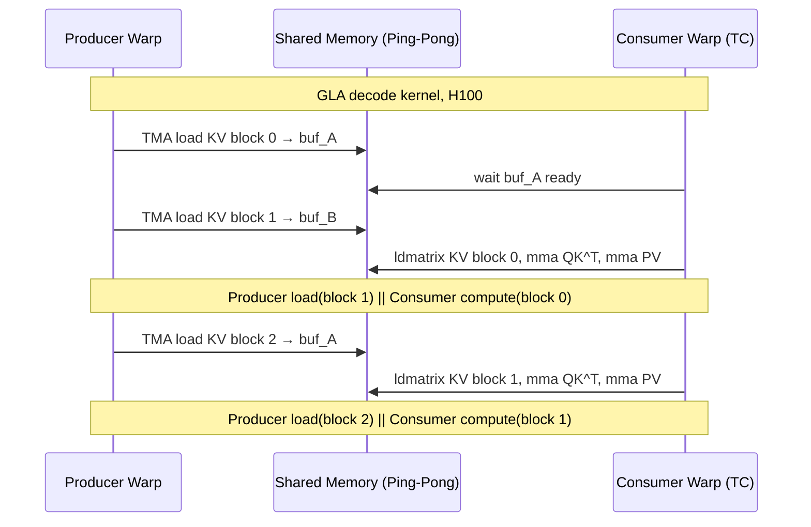

## Software Pipelining for GPU Attention Kernels (GPU注意力Kernel的软件流水线)

术语是什么？回答尽量完整，回答逻辑链中每一步都解释出来。

Software Pipelining（软件流水线）是一种经典的编译器优化技术（Lam, 1988），在 GPU attention kernel 中指将内存加载（HBM→SRAM）与 Tensor Core 计算（MMA）组织为流水线阶段，使第 i+1 个 KV block 的内存加载与第 i 个 block 的 Tensor Core 计算在时间上重叠。核心目标是隐藏 HBM 访存延迟，保持 Tensor Core 持续运行。

该论文中的软件流水线与 Warp Specialization 紧密结合：(1) **Producer warp**：使用 TMA 指令（contiguous block）或 cp.async 指令（paged block）从 HBM 异步加载下一个 KV tile 到 shared memory；(2) **Consumer warp**：对已加载的 KV tile 执行 ldmatrix→smem→mma（QK^T 和 PV）。Producer 的内存加载与 Consumer 的计算由 GPU warp scheduler 自动重叠，无需 explicit barrier（在 Hopper 上利用 WGMMA 异步特性）。

从kernel调度角度拆解，给出具体流程。

在标准解码（L_q=1）中，由于 Q 仅 1 token，内存加载占主导；软件流水线将计算隐藏在加载之后，使 kernel 接近 pure memory bandwidth bound。在推测解码（L_q=2）中，Q 维度更大→算术强度更高→流水线使 kernel 同时利用 memory 和 compute 子系统。

术语一般如何实现？如何使用？

现代 GPU attention kernel（FlashAttention-3, FlashMLA, GLA kernel）均使用软件流水线。在 CUDA 中通过 warp specialization + ping-pong shared memory buffer（2× tile_size）实现。关键参数：tile size 决定每次 pipelined transfer 的数据量——需足够大以摊销 TMA/cp.async 启动开销，但足够小以适合 shared memory（H100 每 SM 256KB）。

涉及论文标题：
- Hardware-Efficient_Attention_for_Fast_Decoding

---
