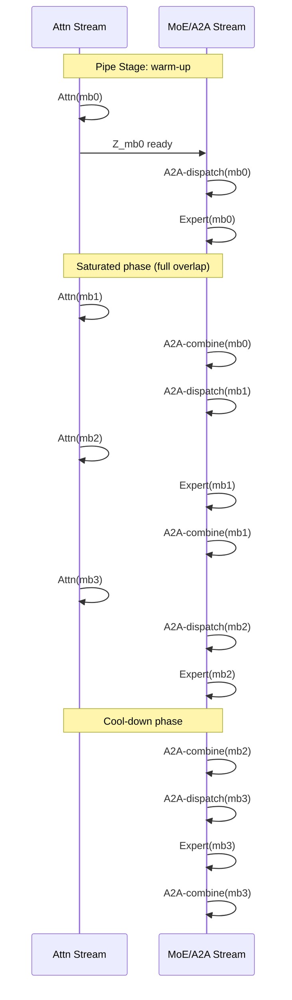

## 1A1M Schedule (1-Attention-1-MoE)

术语是什么？回答尽量完整，回答逻辑链中每一步都解释出来。通过联网搜索让回答具体和精准。

1A1M（1-Attention-1-MoE）是 FOLDMOE 提出的 attention-MoE 流水线调度策略，用于替代朴素的 aAaM（all-Attention-all-MoE）调度。aAaM 先将所有微批次的 attention 全部算完，再执行所有微批次的 MoE（A2A+expert），造成流水线尾部出现巨大气泡——最后阶段的 A2A combine 只能与短暂的 expert computation 重叠。

1A1M 通过交错执行 attention 和 MoE 阶段来减少气泡：在完成第 i 个微批次的 attention 后，立即启动该微批次的 A2A dispatch + expert computation，同时在第 i+1 个微批次上继续 attention 计算。这使得 A2A combine 阶段能被提前到流水线饱和阶段，与 attention 计算重叠。

从系统架构角度拆解术语，比如术语如何在系统架构中发挥作用，给出术语在系统架构中运转流程的具体例子。通过联网搜索让回答具体和精准。

1A1M 的调度时间线（d=4 微批次）：

对比 aAaM：aAaM 在完成所有 attention 后才开始任何 A2A，导致 A2A combine 只能与 expert computation 重叠，而 1A1M 的 A2A combine 在饱和阶段可与 attention 重叠。

术语一般如何实现？如何使用？通过联网搜索让回答具体和精准。

1A1M 作为 FOLDMOE 的调度策略，实现在 Megatron-LM 框架的 Transformer block forward 函数中。核心是修改 micro-batch 循环的控制流：
- 在 aAaM 中：两个嵌套循环（先全 attention，再全 MoE）
- 在 1A1M 中：一个 unified 循环，每轮执行一个 attention micro-batch + 立即跟随其 MoE stages
- 当 d=2 时，1A1M 退化为 aAaM（微批次太少无法交错）
- 配置：overlap degree d 通过 runtime profiling 确定

涉及论文标题：
- FOLDMOE: Efficient Long Sequence MoE Training via Attention-MoE Pipelining
