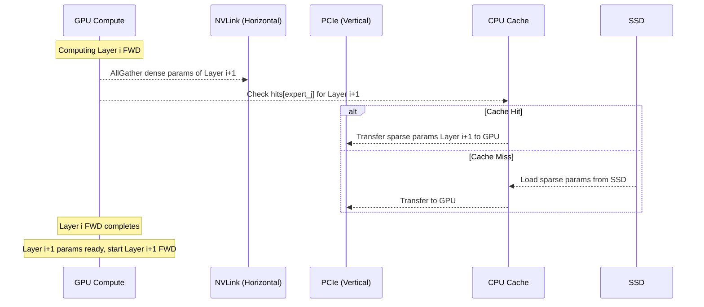

## 2D Prefetch Scheduling (二维预取调度)

术语是什么？回答尽量完整，回答逻辑链中每一步都解释出来。通过联网搜索让回答具体和精准。
2D Prefetch Scheduling 是 MoESys 针对 Hierarchical Storage 提出的参数预取调度策略，通过在两个维度上并行预取 MoE 模型的不同类型参数，并与当前层的计算重叠，消除异构存储间的数据搬运延迟。两个维度分别是：(1) **水平维度**（NVLink）——通过 AllGather 在 GPU 间预取下一层的 dense 参数（基于 ZeRO-3 的分片策略）；(2) **垂直维度**（PCIe）——从 CPU cache 或 SSD 预取下一层需要激活的 sparse expert 参数。两个维度的预取与当前第 i 层的 forward/backward 计算重叠，当前层计算完成时，第 (i+1) 层的参数已就绪。

从系统架构角度拆解术语：
2D Prefetch 在 MoESys 训练循环中的调度时序：

Dense 参数预取（Algorithm 1）：利用 NVLink 高带宽（900GB/s），在当前层 i 计算时通过 AllGather 收集所有 GPU shard 的 dense 参数切片 d'_i，拼合为完整参数 d_i 供下一层使用。

Sparse 参数预取（Algorithm 2）：维护 hash table hits 记录每个 sparse 参数的访问频率。CPU cache 满时，淘汰 hits 最低且超过 threshold 的参数（回写 SSD 更新状态），然后加载新的 sparse 参数。每 K 步对所有 hits × β 做 moving average 衰减，防止历史数据偏向。

术语一般如何实现？如何使用？通过联网搜索让回答具体和精准。
- 实现的关键是利用 dense 和 sparse 参数的非干扰特性——dense 参数走 NVLink（GPU-to-GPU），sparse 参数走 PCIe（CPU/SSD-to-GPU），两条数据通路互不冲突，可完全并行。
- CPU cache 的 hash table 维护在 GPU Node 上（因每个 node 仅存部分 sparse 参数，空间开销可分摊），利用 AlltoAll 通信的既有结果（Gate 网络的 expert 选择结果）触发 prefetch 决策，不引入额外通信开销。
- hash table 查找/插入/删除的 O(1) 时间复杂度保证 prefetch 决策本身不成为瓶颈。
- 该策略对比 DeepSpeed 的单一 prefetch 通道，额外利用了 NVLink 带宽，将 dense 参数的预取从 PCIe 通道中解放出来。

涉及论文标题：
- MoESys: A Distributed and Efficient Mixture-of-Experts Training and Inference System for Internet Services
