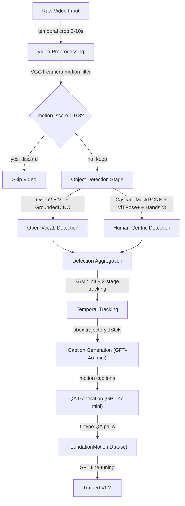

## Automated Video Data Curation Pipeline (视频自动数据标注Pipeline)

术语是什么？
Automated Video Data Curation Pipeline 是一种端到端的自动化系统，用于从原始视频中自动生成结构化的训练数据（captions和question-answer pairs）。在FoundationMotion中，该pipeline由四个顺序阶段组成：(1) Video Preprocessing（temporal cropping到5-10秒+使用VGGT过滤高相机运动视频）；(2) Object Detection & Multi-Object Tracking（开放词汇检测Grounded-DINO+人体/手部层级检测+两阶段SAM2时序tracking）；(3) Caption Generation（将tracking JSON+bbox visual overlay+frames输入GPT-4o-mini生成7维度motion captions）；(4) QA Generation（基于captions和frames使用GPT-4o-mini生成5类多选QA）。Pipeline输出是{视频clip, caption, QA pairs}的triplets。与传统人工标注（数分钟per 3-second video）相比，该pipeline全自动运行，在46.7K InternVid视频上规模化为467K QA pairs。

从系统架构角度拆解术语：
FoundationMotion Pipeline的系统架构流程（request flow）：

系统设计的核心权衡：(1) VGGT过滤——丢弃高相机运动视频以提升tracking质量，但减少了可利用的视频量；(2) 两阶段SAM2 tracking——keyframe refinement（每5帧）平衡tracking精度vs计算成本；(3) GPT-4o-mini vs GPT-4 tradeoff——使用更经济的mini版本在467K数据规模上可行，generation quality可通过structured prompts（7维度caption+5类QA）和bbox JSON输入补偿。

术语一般如何实现？如何使用？
通过模块化pipeline实现，每个阶段使用独立的开源模型。用户需：准备原始视频 → 运行preprocessing脚本 → 运行detection+tracking脚本 → 运行caption generation（调用GPT-4 API）→ 运行QA generation → 获得Dataset用于fine-tuning。全部开源：https://github.com/Wolfv0/FoundationMotion。Training使用llamafactory（Qwen系列）或NVILA official code，8×A100 GPUs。

涉及论文标题：
- FoundationMotion: Auto-Labeling and Reasoning about Spatial Movement in Videos
