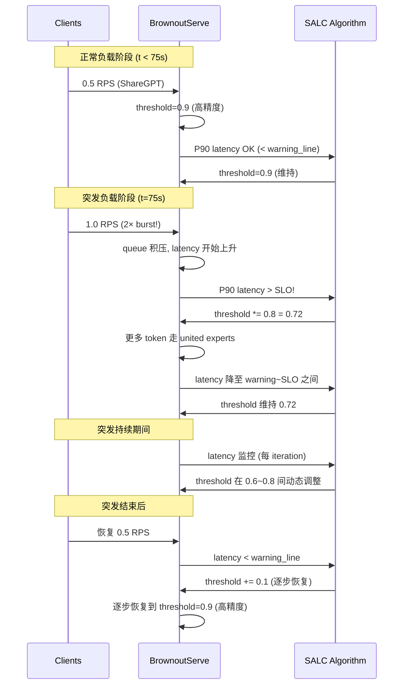

## Bursty Workload Handling in MoE LLM Serving (MoE LLM 推理中的突发负载处理)

术语解释
Bursty workload 指请求到达率在短时间内急剧增加的负载模式（如 chatbot 高峰期、热点事件触发），MoE 模型因参数规模大而对此尤为敏感。BrownoutServe 通过 brownout 降级而非水平扩展来处理突发负载。

术语是什么？
突发负载在 LLM 推理服务中的特征：
- **到达模式**：短时间窗口内请求率翻倍或更多（论文中 0.5→1.0 RPS, 1.0→2.0 RPS 翻倍场景）
- **传统方案与问题**：水平扩展（Kubernetes HPA、新 GPU 实例）→ 30-60s 实例初始化 + 30-90s MoE 模型加载 → 总延迟 1-2 分钟 → 突发结束后资源闲置
- **Brownout 方案**：不增加硬件资源，通过降级部分 token 的处理质量（threshold↓）降低 per-token latency → 同硬件吞吐量提升 1.07×-2.07× → 突发响应延迟在秒级

从系统架构角度拆解术语：
突发负载处理在 BrownoutServe 中的时序：

术语一般如何实现？如何使用？
- **适用场景**: chatbot/实时对话（用户高峰期）、推荐系统（热点事件）、API 网关（突发调用）
- **与水平扩展的级联**：Brownout 作为第一道防线（秒级响应），水平扩展作为第二道防线（分钟级，处理持续高负载）
- **关键指标**: SLO violation rate reduction（BrownoutServe 减少 90.28%），accuracy loss（~5%）

涉及论文标题：
- BrownoutServe: SLO-Aware Inference Serving under Bursty Workloads for MoE-based LLMs
