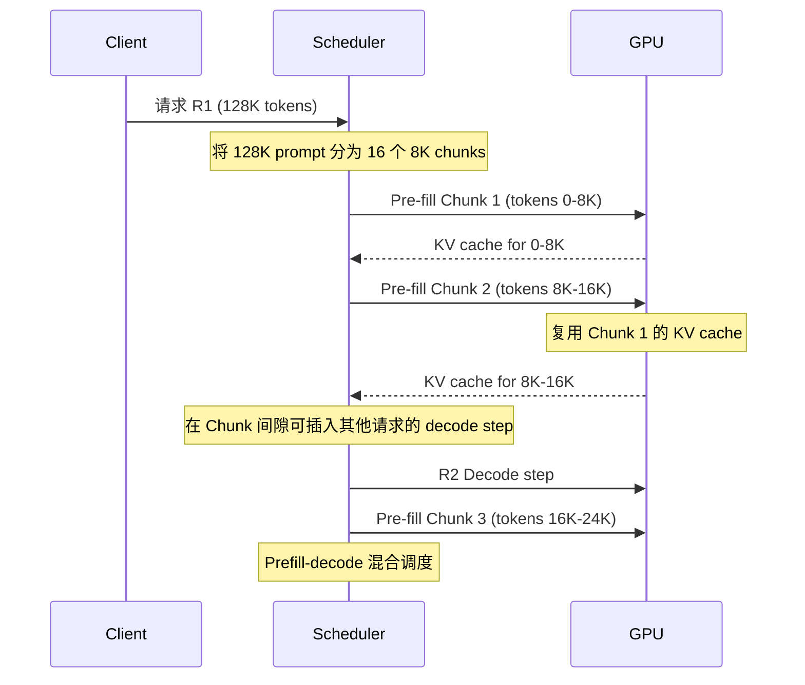

## Chunked Pre-filling (分块预填充)

术语是什么？回答尽量完整，回答逻辑链中每一步都解释出来。

Chunked Pre-filling 是将长输入序列分割为多个 chunk 并分多个 forward pass 处理的技术。在标准 pre-fill 中，整个输入序列在一次 forward pass 中处理——这导致长序列下的极高 peak GPU memory（需同时存储所有 hidden states 和中间激活）以及 GPU 计算时间过长。Chunked pre-filling 将序列分为若干固定大小的 chunk 依次处理，每次 forward 仅处理一个 chunk，显著降低 peak memory 并支持 prefill-decode 混合调度。SGLang 默认使用 8192 token pre-fill chunks。

DuoAttention（Xiao et al., 2025）进一步在 chunked pre-filling 中为 streaming heads 实现了 linear time + constant memory 的 pre-filling：每个 chunk 后 streaming heads 的 KV cache 立即 prune 仅保留 sink+recent tokens，下一 chunk 仅需 attend 到 O(K) 而非 O(L) tokens，pre-filling 复杂度从 O(L²) 降至 O(LK)，memory 从 O(L) 降至 O(K)。

从系统架构角度拆解术语。

**Chunked Pre-filling 调度流程**：

**Chunked vs Single-pass Pre-filling 对比**：

| 维度 | Single-pass Pre-fill | Chunked Pre-fill |
|------|---------------------|------------------|
| Peak memory | 高（所有 KV + hidden states 同时存在） | 低（每次仅 chunk 大小） |
| Pre-fill latency | 低（一次 forward） | 高（多次 forward） |
| KV Footprint（无 eviction） | 同 | 略高（KV 在 chunk 间保留） |
| 调度灵活性 | 低（独占 GPU） | 高（prefill-decode 混合） |
| 对 KV eviction 影响 | post-fill eviction 无问题 | 需 chunked eviction |

术语一般如何实现？如何使用？

SGLang（https://github.com/sgl-project/sglang）默认 chunked pre-filling（chunk=8192）。vLLM 同样支持 chunked pre-filling。实现：在模型 forward 时循环处理 chunk，每次 forward 仅计算一个 chunk 的 attention（使用完整 KV cache），然后只保留该 chunk 产生的 KV。PruLong 论文评估了 8K 和 32K 两种 chunk size：8K chunks 在 KV Footprint 上更优（evict 更频繁），但 32K chunks 在性能保持上更稳健（注意力模式更完整）。对 streaming attention heads（固定 KV cache），chunk size 不影响 memory。

涉及论文标题：
- DuoAttention: Efficient Long-Context LLM Inference with Retrieval and Streaming Heads
- Cache Me If You Can: How Many KVs Do You Need for Effective Long-Context LMs
- LOCRET: Enhancing Eviction in Long-Context LLM Inference with Trained Retaining Heads on Consumer-Grade Devices
- Rectified Sparse Attention

注：LOCRET 将 chunked prefill 与 KV cache eviction 深度整合——在每个 chunk forward pass 中，retaining head 预测 CIS 分数，chunk 处理后立即执行 TopK eviction 以维持固定 cache budget。关键设计包括：(a) Stabilizers——每个 chunk 最后 n_s 个 token 的 CIS 强制为 +∞，确保局部连续上下文；(b) 保留 pre-RoPE KV cache 并从起始位置重新分配连续 position embedding；(c) chunk 内 forward 使用 FlashAttention，retaining head 作为附加输出不增加显著延迟。Hyperparameters 见 LOCRET Table 4。推理速度：Phi-3-mini-128K 在 NVIDIA 4090 上 128K R.PassKey 达 5080 tok/s。
