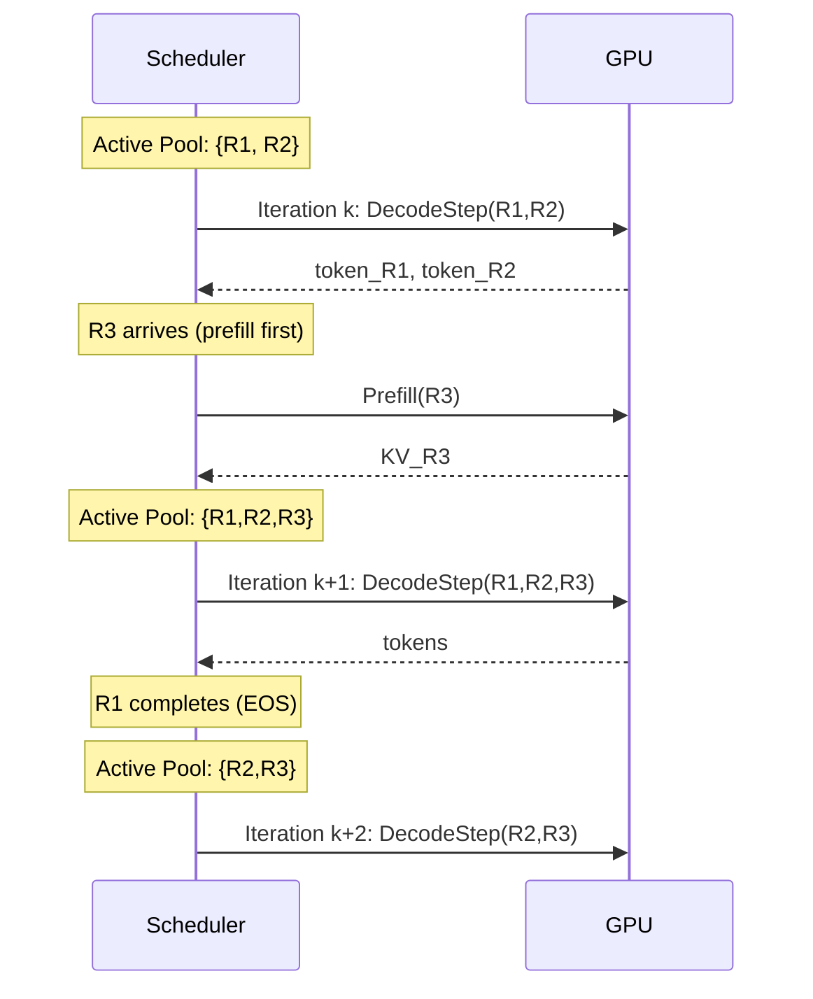

## Continuous Batching (连续批处理)

术语是什么？回答尽量完整，回答逻辑链中每一步都解释出来。

Continuous Batching（连续批处理，也称 iteration-level batching）是一种 LLM serving 系统的请求调度技术，由 Orca (OSDI 2022) 首次提出。与传统的 static batching（请求必须等前一批全部完成后才能开始）不同，continuous batching 在每次 decode iteration 粒度上动态决定哪些请求参与当前 batch——新请求可随时加入，已完成的请求可随时退出，从而大幅提升 GPU 利用率。

核心机制：调度器维护一个 active request pool，每次 decode iteration 前从 pool 中选取一批请求（受 GPU memory 约束），执行一次 forward pass 后立即检查各请求是否已完成（EOS token 或达到 max_length），已完成的从 pool 移除，新到达的请求在完成 prefill 后加入 pool。

在 ReSA 中（Section 2.2），Dense Rectification "naturally compatible with continuous batching"——因为 rectification 只需要周期性批量重编码最近 f 个 token，其操作本质上是一次 mini-prefill，可以在 continuous batching scheduler 中被当作一个独立的 forward pass 调度，不引入特殊同步屏障。

从系统架构角度拆解术语：

Continuous Batching 与 Chunked Prefill 的组合（SGLang/vLLM 默认配置）：prefill 被拆分为多个 chunk，在 chunk 间隙可插入其他请求的 decode step，避免长 prefill 阻塞所有 decode——这也是 ReSA 声称 rectification 兼容 continuous batching 的原因：rectification 的 dense forward 可作为"chunked mini-prefill"插入调度。

术语一般如何实现？如何使用？

主流实现：(a) vLLM 的 scheduler.py——维护 waiting/running/swapped 三个队列，每 iteration 检查是否可以加入新请求；(b) SGLang 的 RadixAttention scheduler——在 continuous batching 基础上增加 prefix-aware KV cache 复用；(c) ReSA 的 rectification 可在 continuous batching 框架下实现——rectification 作为额外的 forward pass 插入 scheduler 的 iteration 队列，无需独占 GPU。

涉及论文标题：
- Rectified Sparse Attention
