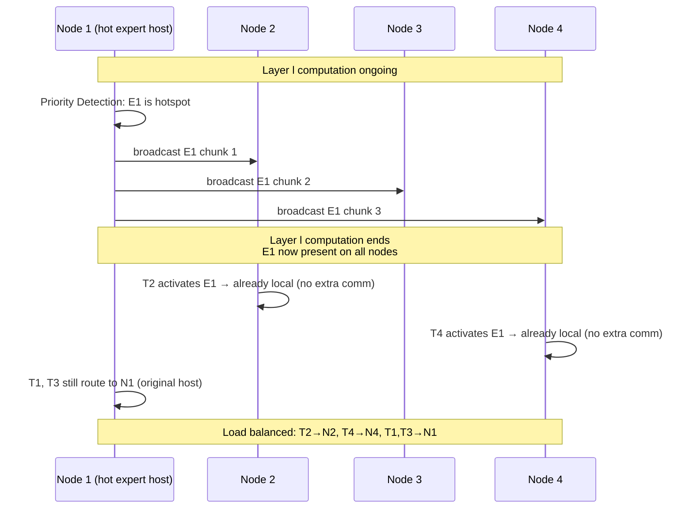

## Dynamic Expert Pre-broadcast for MoE on 3D NMP

术语解释
Dynamic Expert Pre-broadcast 是 HD-MoE 在线调度阶段的核心机制：在每层 MoE 推理执行期间，利用上一层推理的空闲 NoC 带宽，将预测的高负载 expert 提前广播到所有计算节点，使得下一层的 token dispatch 可以将 token 路由到更多候选节点，从而在不引入额外通信的前提下实现负载均衡。

术语是什么？
Dynamic Expert Pre-broadcast 是一种预取式（prefetching）专家放置策略。与静态 expert placement（offline 确定 P_ic 后固定不变）不同，动态策略在运行时根据实际 expert activation pattern 自适应调整。其核心思想源自两个观察：(1) MoE 相邻层之间的 expert 激活具有高时间局部性（residual connections 导致 gating 输出相似），可高精度预测下一层热点 expert；(2) expert 计算期间 NoC 链路大部分空闲（compute-bound phase），可利用这些空闲带宽进行 expert 权重的预广播。

从系统架构角度拆解术语
HD-MoE Dynamic Expert Pre-broadcast 的运行时执行流程：
```
每层 MoE 推理（Layer l）：

# Phase 1: Priority Detection
for each node c:
    for each expert i with P_ic > 0:
        # 预测下一层 expert i 的激活频率 f̂_i
        # 基于当前层 l 的实际 gating 输出 + temporal locality model
        prio_ic = 2 · P_ic · f̂_i · IS / comp  # 预估计算负载

# Phase 2: Expert Selection & Broadcast
bottleneck_node = argmax_c(Σ_i prio_ic)          # 负载最重节点
hot_expert = argmax_i(prio_i, bottleneck_node)    # 热点 expert
# 利用 α-β 模型计算最优 chunk size c*
# 在上一层推理进行时启动 NoC broadcast
broadcast_chunked(hot_expert, chunk_size=c*, timeout=prev_layer_latency)
# 重复 up to k 次（k 由时间窗口决定）

# Phase 3: Communication-Efficient Dispatch
for each token t in batch:
    activated_experts = gate(t)  # 假设可预测
    for each expert e_i in activated_experts:
        # 候选节点 = 所有持有 e_i 副本的节点（包括预广播的）
        candidates = {c | e_i present on c}
        # 贪心选择当前负载最低的候选节点
        target = argmin_c(compute_load[c]) for c in candidates
        dispatch(t.hidden_state, target)
```
时序图（Mermaid sequenceDiagram）：


术语一般如何实现？如何使用？
预广播策略适用于 batch size 较大时（HD-MoE 使用 batch=512），此时单层推理时间足够广播 2-5 个完整 expert。在 batch=1 的 edge inference 场景下，单层推理延迟太短，预广播可能不适用。HD-MoE 的动态策略在 math/coding 问题（gating pattern 与 reasoning 差异大）上加速达 1.25×（5 experts pre-broadcast），说明预广播能有效适应不同推理场景的 expert activation 分布偏移。

涉及论文标题：
- HD-MoE: Hybrid and Dynamic Parallelism for Mixture-of-Expert LLMs with 3D Near-Memory Processing
