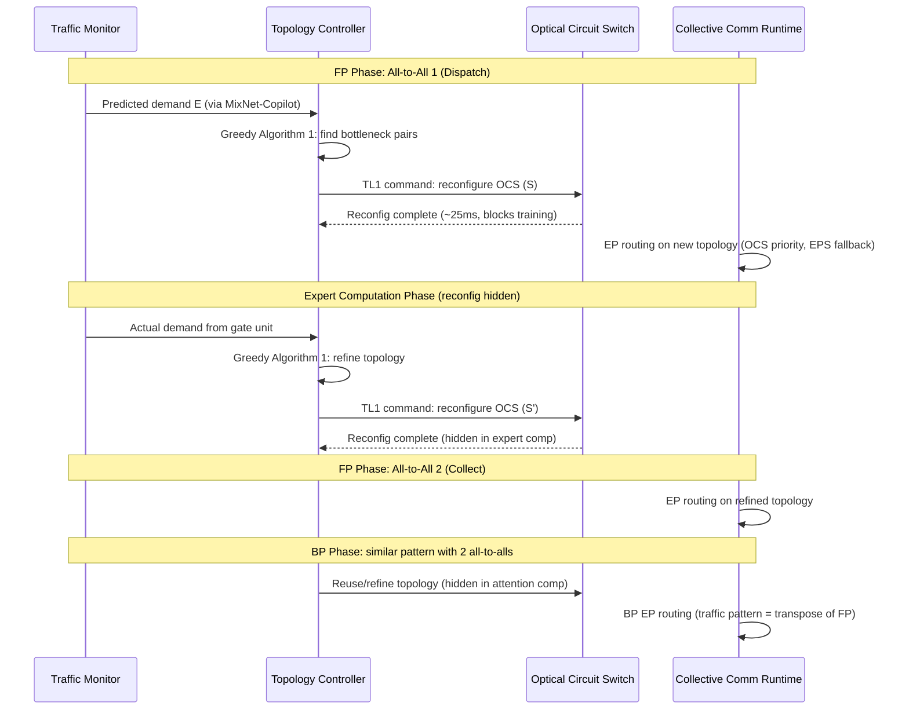

## In-Training Topology Reconfiguration

术语是什么？回答尽量完整，回答逻辑链中每一步都解释出来。通过联网搜索让回答具体和精准。
In-Training Topology Reconfiguration（训练中拓扑重配置）是 MixNet 提出的在 MoE 分布式训练过程中动态调整 GPU 互连网络拓扑的技术。传统 GPU 互连（Fat-tree/Rail-optimized）在整个训练过程中保持静态拓扑，无法适应 MoE 的 EP 通信中 per-iteration 变化的非均匀 all-to-all traffic 模式。TopoOpt 和 Google Lightwave Fabrics 虽然使用 OCS，但仅在训练前做一次性（one-shot）拓扑重配置，无法响应训练过程中的 traffic 动态。MixNet 首次提出在训练 iteration 内多次重配置 OCS 拓扑：每 MoE layer 重配置 2 次（FP 一次 + BP 一次），使拓扑实时跟踪 traffic pattern 变化。

从系统架构角度拆解术语，比如术语如何在系统架构中发挥作用，给出术语在系统架构中运转流程的具体例子。通过联网搜索让回答具体和精准。
MixNet 的训练中拓扑重配置完整流程（以一个 MoE layer 为例）：

重配置时机的选择（§5.1）：
- **FP 第一个 all-to-all（dispatch）**：阻塞训练等待 OCS 重配置（~25ms），因 gate unit 的 output 在此之前不可得。使用 MixNet-Copilot 预测算法提前估计 traffic demand，配合前次训练的 topology warm-start 来提高初始拓扑的准确性。
- **FP 第二个 all-to-all（collect）**：重配置隐藏在 expert computation 期间（expert 计算 >100ms >> 重配置 25ms）。
- **BP 两个 all-to-all**：重配置隐藏在 attention computation 或 expert computation 期间（BP computation 比 FP 更耗时）。

术语一般如何实现？如何使用？通过联网搜索让回答具体和精准。
- 实现组件：(a) Traffic Monitor：运行时收集 gate unit output（token routing probabilities），预测后续 all-to-all 的 expert load distribution（MixNet-Copilot using SLSQP optimization of conditional probability transition matrix P）；(b) Topology Controller：去中心化——每个 OCS region 独立运行，执行 Algorithm 1 的 greedy bottleneck allocation；(c) OCS Control：通过 TL1 commands over Ethernet 向 OCS 发送重配置指令。重配置延迟实测：1 pair ~41ms, 4 pairs ~42ms, 16 pairs ~47ms, 99th percentile <70ms。
- NIC activation 延迟问题：当前 commodity transceiver/NIC 的 NIC 从 OCS 重配置完成到变为 active 平均需要 ~5.67s（99th percentile ~6.33s），这是因为 commercial transceiver 未针对快速 OCS 重配置做 CDR 锁定优化。论文排除此时间计算实际训练时间，并指出 burst-mode transceiver + fast-locking CDR 是工程问题而非架构障碍。
- 重配置敏感性（§D.7）：当 reconfig latency >1000ms 时，性能显著退化（无法隐藏在计算中）；当 reconfig latency <25ms 时，进一步减少收益边际（因为 25ms 已可完全隐藏在计算中）。MixNet 的 millisecond-scale OCS 处于 sweet spot。
- 与 TopoOpt 的区别：TopoOpt 为静态 one-shot 重配置（假设 traffic 在训练全程不变）→ MixNet 为动态 in-training 重配置（每 iteration 调整）。仿真结果：MixNet 比 TopoOpt 快 1.3×-2.5×。

涉及论文标题：
- MixNet: A Runtime Reconfigurable Optical-Electrical Fabric for Distributed Mixture-of-Experts Training
