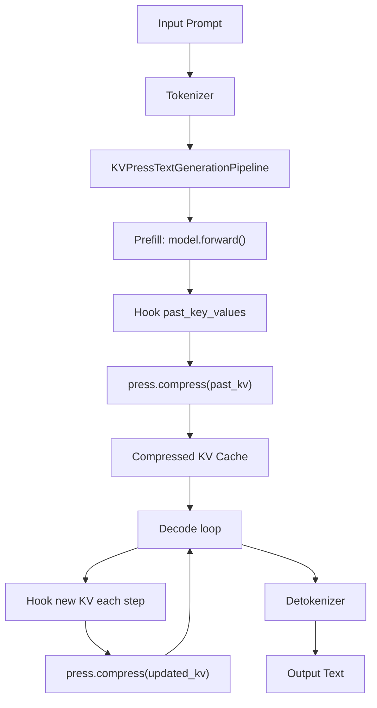

## KVPress (NVIDIA KV Cache Compression Framework)

术语是什么？回答尽量完整，回答逻辑链中每一步都解释出来。

KVPress 是 NVIDIA 开源的 KV Cache 压缩框架（https://github.com/NVIDIA/kvpress），提供标准化的 pipeline 接口，使各种 KV cache 压缩策略可以即插即用地集成到 HuggingFace Transformers 推理流程中。核心理念："KV cache compression made easy"——将压缩逻辑抽象为独立的 `press` 对象，通过 `KVPressTextGenerationPipeline` 在 `generate()` 调用期间自动 hook 每层的 `past_key_values` 应用压缩，无需修改模型代码。支持 question-agnostic 模式（压缩时不附加 query 信息），避免 attention-based 方法中的 instruction dependence bias。

从系统架构角度拆解术语，比如术语如何在系统架构中发挥作用，给出术语在系统架构中运转流程的具体例子。

**KVPress 在推理 pipeline 中的作用流程**：



```
# KVPress 使用示例（基于 LagKV 论文推断）
from kvpress import KVPressTextGenerationPipeline
from transformers import AutoModelForCausalLM, AutoTokenizer

model = AutoModelForCausalLM.from_pretrained("meta-llama/Llama-3.1-8B-Instruct")
tokenizer = AutoTokenizer.from_pretrained("meta-llama/Llama-3.1-8B-Instruct")

# 创建压缩 pipeline，传入自定义 press 策略
pipeline = KVPressTextGenerationPipeline(
    model=model, tokenizer=tokenizer,
    press=LagKVPress(lag_size=128, retention_ratio=0.5, sink_size=16)
)

# 标准 HuggingFace generate 接口，KV cache 自动压缩
output = pipeline("Long document text...", max_new_tokens=256)
```

**KVPress 支持 question-agnostic 模式**：通过在 prefill 时将 question 设为 None，避免 query 参与压缩阶段的 KV 重要性评分。在 LagKV 论文中，所有评估都使用此模式以确保公平比较（避免 SnapKV 等方法的 instruction dependence 优势）。

术语一般如何实现？如何使用？

KVPress 已集成 SnapKV、StreamingLLM 等主流方法的适配版本。用户在 KVPress 框架中实现新压缩策略时，只需继承 `BasePress` 类并重写 `compress(past_key_values)` 方法。LagKV 论文即通过 KVPress 的 `GreedyPress` 基类实现其递归分区压缩逻辑，并在 RULER 16K benchmark 上完成所有对比实验。框架与 HuggingFace Transformers `generate()` 完全兼容，支持 batch inference 和 `cache_position` 管理。开源地址：https://github.com/NVIDIA/kvpress。

涉及论文标题：
- LagKV: Lag-Relative Information of the KV Cache Tells Which Tokens Are Important
