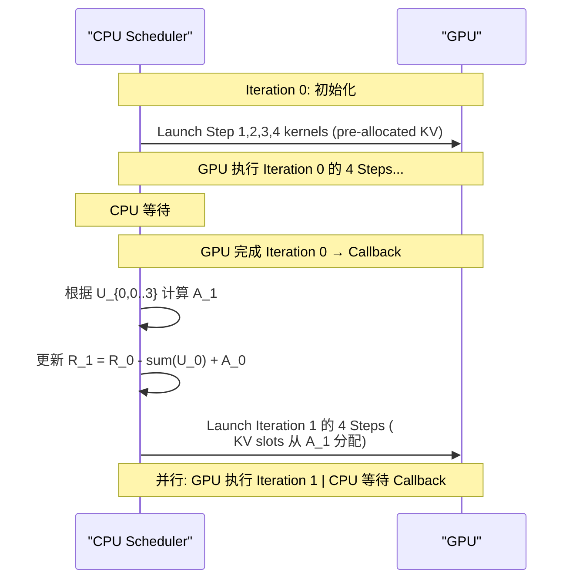

## Multi-Step Overlapped Scheduler (多步重叠调度器)

术语是什么？回答尽量完整，回答逻辑链中每一步都解释出来。通过联网搜索让回答具体和精准。

Multi-Step Overlapped Scheduler 是 LongCat-Flash 推理系统中消除 CPU 端 kernel launch bottleneck 的调度技术。在 LLM decoding 阶段（特别是 speculative decoding），单个 forward step 的 GPU 执行时间可能短于 CPU 端的 kernel launch + synchronization overhead，导致 GPU 空转（launch-bound）。

LongCat-Flash 的解决方案：单次 schedule iteration 预启动 n 个 forward step 的 CUDA kernel，在 GPU 执行当前 step 的同时，CPU 准备并 launch 未来 step 的 kernel。TVD fusing (Target forward + Verification + Draft forward 融合为单个 CUDA Graph) 作为前置优化减少单 step 的 launch 事件数。

关键挑战：多步预启动需要动态预分配 KV cache slots，但 speculative decoding 的每步 accept length 事先未知。LongCat-Flash 通过数学归纳法证明了 KV cache 分配的收敛性：

设 $R_i$ 为 GPU 第 i 次 iteration forward pass 时的可用 KV entries，$U_{i,s} \in [1, 2]$ 为第 i 次 iteration 第 s step 的 accept length（MTP depth=1），预启动步数 n=4，初始 $R_0 = (MTP+1) \times n = 2n$：

$$A_i = \sum_{s=0}^{n-1} U_{i-1,s}, \quad R_i = R_{i-1} - \sum_{s=0}^{n-1} U_{i-1,s} + A_{i-1}$$

通过归纳法得闭式解：$$R_i = 4n - \sum_{s=0}^{n-1} U_{i-1,s} \in [2n, 3n], \quad i \ge 1$$

证明了 KV cache 分配在有界范围内自适应波动，不会发散也不会溢出。

从系统架构角度拆解术语，比如术语如何在系统架构中发挥作用，给出术语在系统架构中运转流程的具体例子。通过联网搜索让回答具体和精准。

Multi-step scheduler 执行流程：

术语一般如何实现？如何使用？通过联网搜索让回答具体和精准。

实现要点：
1. **TVD fusing 前置**：先通过 CUDA Graph 将 Target forward + Verification + Draft forward 融合，减少单 step launch 事件数。LongCat-Flash 的 MTP head 为 single dense layer，forward 时间极短，TVD fusion 尤为重要。
2. **Callback-driven**：GPU 完成一批 step 后通过 callback 通知 CPU，CPU 计算下一批 step 的 KV cache 分配并 launch。
3. **n 的选择**：n=4 在 LongCat-Flash 中使用。过大增加 KV cache 预留量（浪费显存），过小不足以隐藏 CPU overhead。
4. **KV Cache 预分配策略**：基于上一 iteration 的 accept length 保守估计下一 iteration 的需求。induction proof 保证即使预估值有偏差（如上一 iteration 全接受但本次全部被拒绝），KV cache 仍在 [2n, 3n] 的有界范围内，不会溢出。
5. **适用范围**：对 forward pass 极快的模型（如 LongCat-Flash 28 layers, ~29ms/step, ~100 TPS）最为有效；对更深/更慢的模型 CPU overhead 占比小，收益递减。

涉及论文标题：
- LongCat-Flash Technical Report
