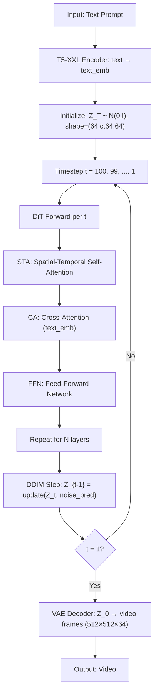

## Open-Sora (DiT-based Video Generation Framework)

术语是什么？回答尽量完整，回答逻辑链中每一步都解释出来。通过联网搜索让回答具体和精准。
Open-Sora 是 HPC-AI Tech 开源的大规模视频生成项目（https://github.com/hpcaitech/Open-Sora），基于 Diffusion Transformer (DiT) 架构实现文本到视频（text-to-video）生成。其架构包含三个核心模块：(1) **VAE (Variational Autoencoder)**：将视频帧从像素空间压缩到 latent space（空间压缩比 8×8，时序压缩比 4×），减少 DiT 处理的 token 数量；(2) **T5-XXL Text Encoder**：将文本 prompt 编码为条件嵌入，注入 DiT 的 cross-attention 层；(3) **DiT Backbone**：基于 PixArt-α 架构，包含交替的 Spatial-Temporal Attention (STA)、Cross-Attention (CA) 和 Feed-Forward Network (FFN) 层，通过 100-step DDIM 采样逐步去噪生成 latent 表示，最后经 VAE decoder 还原为视频帧。Open-Sora 1.2 可生成最高 512×512 分辨率、64 帧视频。在 NVIDIA A800-80GB 上生成一个视频典型耗时约 130 秒（FP16，无优化），是 DiT 视频生成推理效率研究的常用 baseline。

从系统架构角度拆解术语，比如术语如何在系统架构中发挥作用，给出术语在系统架构中运转流程的具体例子。通过联网搜索让回答具体和精准。
Open-Sora 在一次推理请求中的完整系统流程：

关键系统特性：(1) 多帧 latent 被 flatten 为 s×t 个 token 并行处理，每步 DiT 前向的 self-attention 复杂度 O((s×t)²)；(2) 无 KV cache（因每步从头计算而非自回归），而是通过 100 次完整前向迭代；(3) CFG (Classifier-Free Guidance) 标准取值 4.0-7.0，每步需 2 次前向（conditional + unconditional），总计算量为 2×100×N_layers 次 Transformer block 执行。

术语一般如何实现？如何使用？通过联网搜索让回答具体和精准。
Open-Sora 基于 PyTorch 实现，模型权重以 FP16 存储。部署方式：(1) 单 GPU 推理（如 A800-80GB、H100），通过 `torch.compile` 或自定义 CUDA kernels 加速；(2) 使用 DDIM scheduler（100 steps）或 DPM-Solver（更少步数）；(3) 量化加速：ViDiT-Q (W8A8, 1.71× speedup)、QuantCache (W4A6 + HLC + SRAP, 6.72× speedup) 等方法在 Open-Sora 上验证；(4) 缓存加速：AdaCache、Δ-DiT 等方法通过 feature caching 减少中间计算。Open-Sora 是 DiT 推理优化研究的标准 benchmark，广泛应用于视频 DiT 量化、缓存、剪枝、并行等方法的评估。开源地址：https://github.com/hpcaitech/Open-Sora。QuantCache 以 Open-Sora 1.2 为 baseline，通过联合 HLC + AIGQ + SRAP 实现 6.72× end-to-end speedup on A800-80GB（130s → ~19.3s）。

涉及论文标题：
- QuantCache Adaptive Importance-Guided Quantization with Hierarchical Latent and Layer Caching for Video Generation
