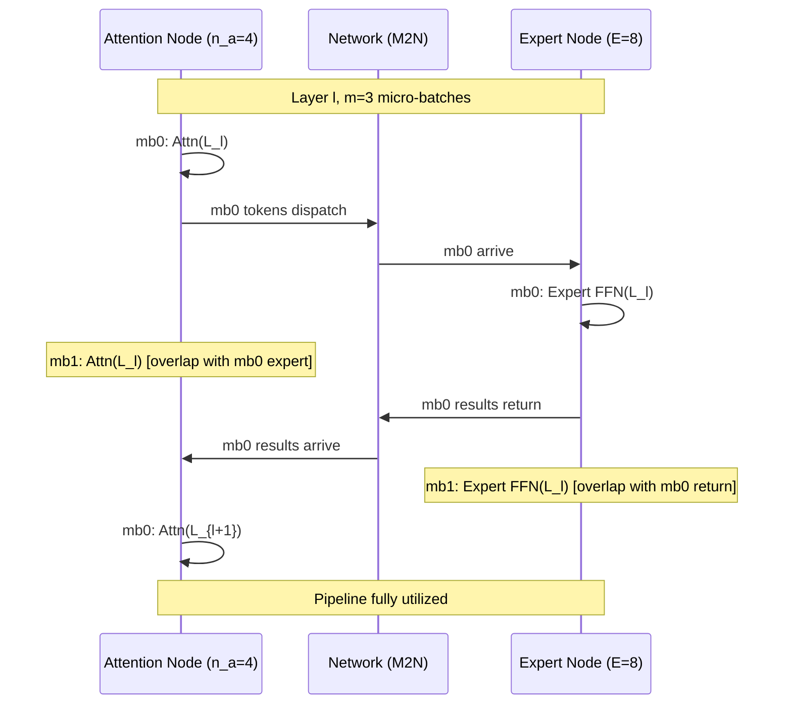

## Ping-Pong Pipeline Parallelism for MoE Inference

术语是什么？回答尽量完整，回答逻辑链中每一步都解释出来。通过联网搜索让回答具体和精准。
Ping-Pong Pipeline Parallelism（乒乓流水线并行）是 MegaScale-Infer 在解耦式 attention-expert 部署中提出的 micro-batch 流水线调度策略。核心思想：将请求 batch B 拆分为 m 个 micro-batch（大小 b_a = B/m），使这些 micro-batch 在 attention node（执行 self-attention + KV cache 访问）和 expert node（执行 expert FFN 计算）之间交替"乒乓"传递。在 Layer ℓ 中，micro-batch 0 在 attention 计算期间，micro-batch 1 在 expert 计算，micro-batch 2 在通信——三者流水线重叠，消除 idle time 并隐藏通信。这类似于 GPipe 的 micro-batch pipeline，但应用于 attention-expert 跨模块场景而非跨层场景。

从系统架构角度拆解术语，比如术语如何在系统架构中发挥作用，给出术语在系统架构中运转流程的具体例子。通过联网搜索让回答具体和精准。
以 Mixtral 8×22B, tp_a=2, tp_e=1, n_a=4, m=3 为例的 Ping-Pong Pipeline 时间线：

Pipeline 约束条件（Eq. 1-3）：
- $$T_a \approx T_e$$：attention 与 expert 计算时间需平衡（通过调节 n_a 实现）
- $$T_c < T_f = \max(T_a, T_e)$$：单次通信时间必须小于单 stage 计算时间
- $$m \times T_f \ge 2 \times (T_f + T_c)$$：micro-batch 数量需足够覆盖通信

最少 micro-batch 数：$$m \ge 2(1 + \frac{T_c}{T_f})$$。快速网络（T_c < T_f/2）需 m≥3；较慢网络需 m≥4。

术语一般如何实现？如何使用？通过联网搜索让回答具体和精准。
- 实现要点：(a) micro-batch 沿 batch 维度切分，每个 micro-batch 独立执行 attention→dispatch→expert→collect 循环；(b) attention node 和 expert node 各维护 m 个 in-flight micro-batch 的状态；(c) 需要 M2N 通信库支持多路并发传输（多个 micro-batch 的 token 同时在不同 QP 上传输）；(d) 每层 L 层共 mL 个 pipeline stage。
- 总 iteration latency（Eq. 5）：$$T_{total} = (T_a + T_e + 2T_c) + T_f(mL - 1)$$，其中第一项为首个 micro-batch 的冷启动延迟（cold start），第二项为流水线稳态时间。
- Ablation 结果（Figure 14）：m=1（无 pipeline）→ m=2（消除 idle）→ 1.9× throughput；m=2→m=3（覆盖通信）→额外 1.10×–1.38× gains。m>3 收益边际递减（网络带宽充足时）。
- 与 GPipe 的区别：GPipe 沿 layer 维度切分（不同 layer 在不同 device），Ping-Pong 沿 batch 维度切分（同 layer 内 attention 和 expert 交替）——前者跨层流水线，后者跨模块流水线。
- 局限性：(a) 需要 T_a ≈ T_e 平衡，否则一端 idle；(b) 增加 per-token latency（需 m≥3 保证利用率，单个 micro-batch 的等待时间增加）；(c) micro-batch 过多（m>4）降低 GEMM efficiency（batch size 过小）。

涉及论文标题：
- MegaScale-Infer: Serving Mixture-of-Experts at Scale with Disaggregated Expert Parallelism

---
