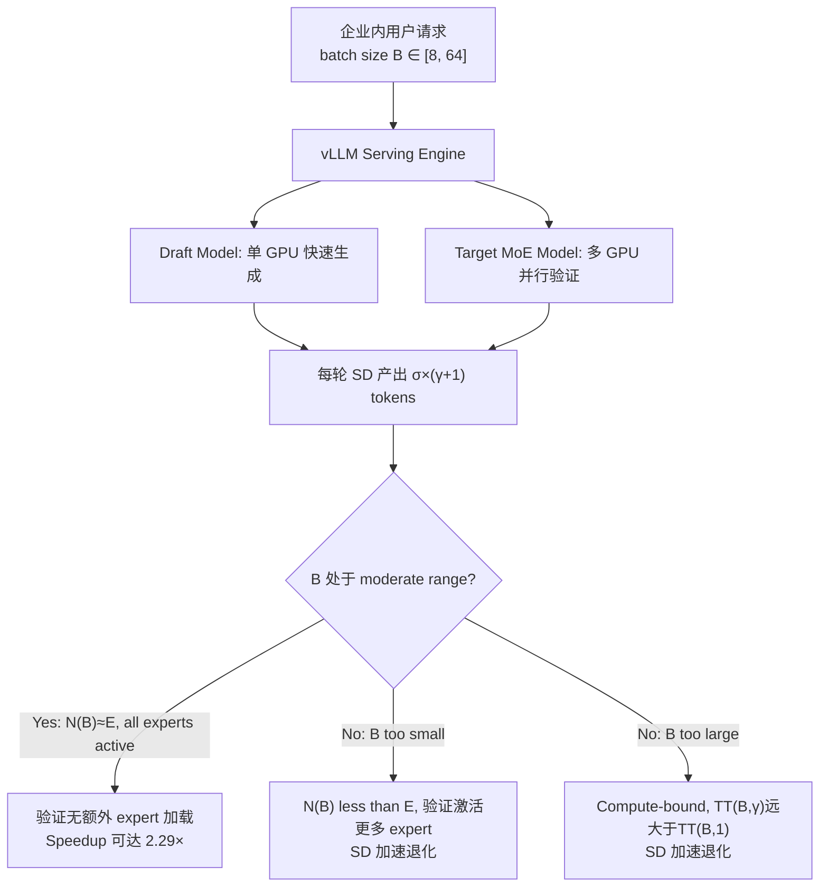

## Private Serving（LLM 私有化部署推理）

术语是什么？回答尽量完整，回答逻辑链中每一步都解释出来。通过联网搜索让回答具体和精准。
Private Serving 是指企业在自有基础设施（on-premises 或私有云）上部署 LLM 推理服务，而非使用第三方 API 服务（如 OpenAI API）。典型场景包括企业内联网 chatbot、内部代码助手、金融/医疗/法律等合规要求严格行业的文档处理。Private Serving 的关键特征：(1) 数据和模型不出企业边界（数据安全/隐私合规）；(2) 推理请求量中等——企业内用户数远小于公共 API 用户，典型的并发请求数在数十至数百量级；(3) batch size 通常为中等规模（MoESD 分析的 "moderate batch size" 范围），既非单请求也非数千请求的大规模 serving。MoESD 指出其发现对 private serving 特别有价值——中等 batch size 恰好是 SD 对 MoE 加速效果最佳的区间，而此前 MoE 加速研究（expert prefetching/caching、offloading 等）在中等 batch 下效率下降。

从系统架构角度拆解术语：
Private Serving 的推理系统架构（MoESD 关注点）：

Annotations: Private serving 的 B 通常在 moderate range，因为 (a) 企业用户量有限；(b) latency SLO 要求（TTFT, TPOT）限制 batch 不能过大。MoESD 发现 MoE 的 "efficiency gap"——中等 batch 下所有参数必须加载但 GPU FLOPs 未充分利用——恰好通过 SD 填补。

术语一般如何实现？如何使用？通过联网搜索让回答具体和精准。
- 部署方案：vLLM/SGLang on-premises + 企业内网；Kubernetes 集群 + GPU 节点；私有云（AWS Outposts, Azure Stack）。无需外部 API 调用。
- MoESD 的适用性：(a) 中等 batch 下 SD speedup 最优，天然匹配 private serving 场景；(b) MoE offloading 场景被 NVLink→PCIe 带宽降级后系统更 memory-bound → SD 效果更强；(c) Latency-critical 场景（严格 SLO 限制 batch 大小）同样受益。
- 对比：此前 MoE 推理加速方案（如 MoE-Infinity 的 expert prefetching, ExpertFlow 的 expert caching）在中等 batch 下效率退化（几乎所有 expert 都被激活 → prefetching/caching 失去选择性卸载的优势），MoESD 的 SD 方案在此场景下优势互补。

涉及论文标题：
- MoESD: Unveil Speculative Decoding's Potential for Accelerating Sparse MoE
