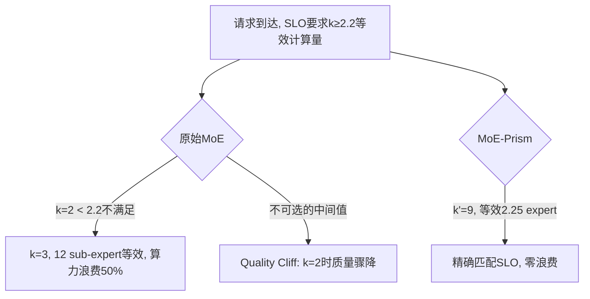

## Quality Cliff in MoE (MoE质量悬崖)

术语是什么？回答尽量完整，回答逻辑链中每一步都解释出来。通过联网搜索让回答具体和精准。
Quality Cliff 是 MoE-Prism 定义的概念，描述当前 MoE 模型在 serving 时面临的"成本-质量"权衡困境。MoE 模型只提供粗粒度的少数离散操作点（如 Mixtral-8x7B 仅有 k=1 或 k=2 两种激活配置），使得系统在降低计算成本时被迫经历不成比例的质量大幅下降。这是因为 monolithic expert 内部虽然存在冗余（大部分 neuron 对特定 token 贡献极小），但标准 top-k routing 只能以整个 expert 为单位做激活选择——哪怕只需 expert 内 25% 的 neuron，也必须激活 100% 的 expert 或 0%。Quality Cliff 导致系统只能在高计算/高质量和低计算/低质量之间做二选一，缺少中间梯度。MoE-Prism 通过 Sub-Expert Decomposition 将 expert 拆分为 N=4 个子 expert 后，k_active 的操作空间从整数 {1,2,...,k_max} 拓展为 {4,5,...,N×k_max}，将"悬崖"转化为平滑的权衡曲线。

从系统架构角度拆解术语：

对 cloud serving 的影响：批次调度时，若批次内各请求 SLO 不同，只能用批次内最高 k_min（最坏情况分配），导致大量请求被"过度服务"浪费算力。对 offloading 的影响：SLO 需求 4.2 expert → 必须加载 5 个完整 expert → PCIe 传输超额 19%。

术语一般如何实现？如何使用？通过联网搜索让回答具体和精准。
- Quality Cliff 的根本原因是训练约束：理论上可通过更多 expert 增加可配置性，但大规模 MoE 训练成本高且不稳定（如 KIMI K2 虽 1T 参数但仅 9 experts）。
- 解决 Quality Cliff 需要在 post-training 层面引入细粒度控制，而非从训练阶段增大 expert 数量。MoE-Prism 通过 offline refactoring（分解每个 expert 为 4 个子 expert）提供 4 倍操作点密度。
- 类似概念在 MoE 研究中也有体现：DualSparse-MoE (2025) 通过 tensor/neuron 双重稀疏性实现更细粒度的计算控制；Dynamic MoE (2024) 通过 adaptive expert 选择动态调整每 token 的激活 expert 数。

涉及论文标题：
- MoE-Prism: Disentangling Monolithic Experts for Elastic MoE Services via Model-System Co-Designs

---
