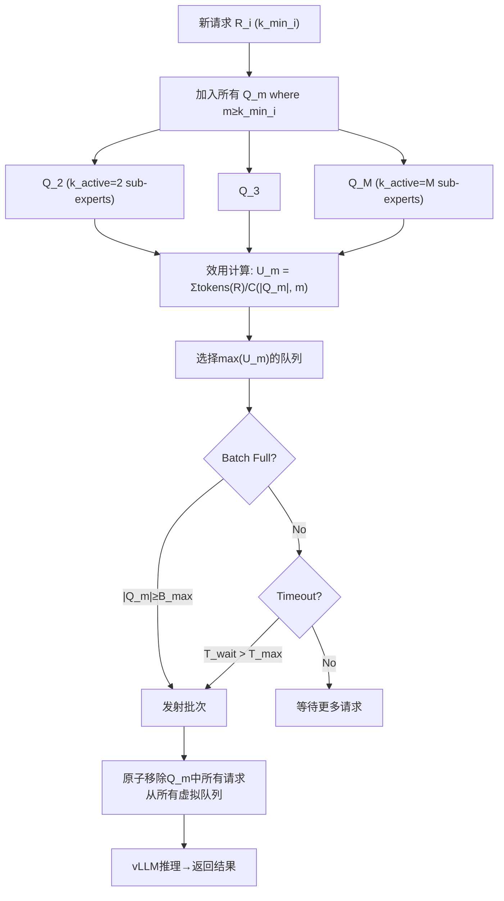

## Quality-Constrained Throughput Scheduler (质量约束吞吐调度器)

术语是什么？回答尽量完整，回答逻辑链中每一步都解释出来。通过联网搜索让回答具体和精准。
Quality-Constrained Throughput Scheduler 是 MoE-Prism Online Scheduling Engine 中面向云端部署的调度策略，目标是在满足每个请求的质量约束（最小激活 sub-expert 数 k_min）下最大化系统吞吐。核心创新是打破"批次组成依赖 k_active，k_active 选择又依赖批次组成"的循环依赖：维护 M 个虚拟队列（M=可能的 k_active 数量），每个请求到达时加入所有满足其 k_min 的虚拟队列，调度器对 M 个潜在批次并行计算效用函数 U_m = Σ tokens(R_i) / C(|Q_m|, m)，选择效用最高的批次发射。两个硬触发器防饥饿：Batch Full Trigger（队列达到最大批次 B_max 时发射）和 Timeout Trigger（请求等待超 T_max 时发射）。

从系统架构角度拆解术语：

关键行为：请求"升级"机制——低 k_min 请求可能被高 k_active 批次携带执行（如 k_min_A=2 的请求可能与 k_min_B=8 的请求一起在 Q_8 中被发射），因为运行大 batch 的硬件效率增益可能超过质量升级成本。这等价于在效用函数中隐式编码了 batch size 与 k_active 的 trade-off。

术语一般如何实现？如何使用？通过联网搜索让回答具体和精准。
- MoE-Prism 基于修改版 vLLM 0.9.1 实现。部署前执行一次性 benchmark 构建性能模型 C(k_active)，映射 sub-expert 数到延迟和内存。
- 对比基线：FullBatch（静态等到 B_max 才发射，最大化硬件利用但延迟高）和 FIFO（动态非阻塞，先到先服务批次）。
- 高负载下：MoE-Prism 在 Deepseek 上提升 19.9% 吞吐（13→15.59 req/s），在 OLMoE 上提升 14.9%（15.57→17.89 req/s），同时降低 TTFT 和 TPOT。
- 相关系统：AMoE (2025) 的 μ-queuing 动态重批处理，D²MoE (2025) 的 HEBF 调度（hottest-expert-bit-first），QoS-Efficient Serving (ICML 2025) 的 similarity-based expert consolidation。

涉及论文标题：
- MoE-Prism: Disentangling Monolithic Experts for Elastic MoE Services via Model-System Co-Designs

---
