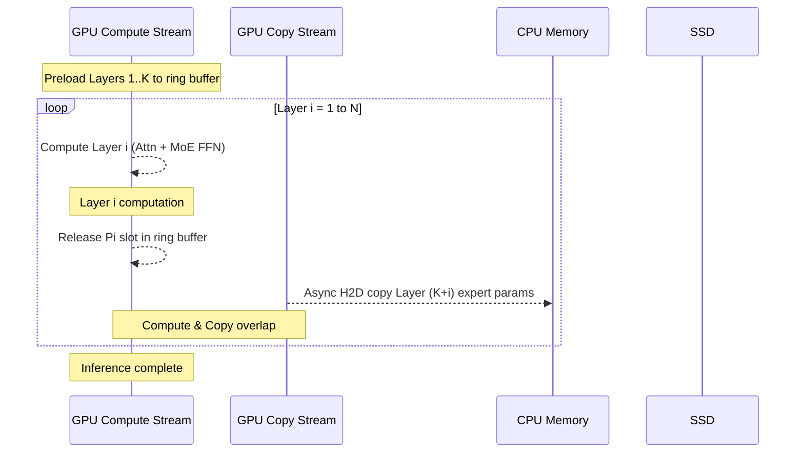

## Ring Memory Offloading (环形内存卸载)

术语是什么？回答尽量完整，回答逻辑链中每一步都解释出来。通过联网搜索让回答具体和精准。
Ring Memory Offloading 是 MoESys 提出的 MoE 模型单机推理时的 CPU-GPU 协同内存管理策略。当 MoE 模型参数量超过单 GPU 显存时，将 CPU 和 GPU 内存组织为环形缓冲区（ring buffer）：每个 decoder layer 的 expert 参数在 CPU 内存中存储 N 份副本（N = decoder 层数），GPU 内存中维护一个容量为 K 份 expert 参数的 ring buffer。推理时，GPU 计算第 i 层 → 释放第 i 层的 expert 参数 slot → 异步从 CPU 加载第 (K+i) 层的 expert 参数到刚释放的 slot → 形成"计算-释放-加载"的流水线。关键在于计算与数据搬运的 overlap：使用独立 CUDA stream 做 H2D copy，与 compute stream 并行执行。

从系统架构角度拆解术语：
Ring Memory Offloading 的推理时序（N decoder layers, GPU ring buffer 容量 K）：

每个 decoder layer 的结构（类似 Switch Transformer）具有层间参数独立性——第 i 层完成后其 expert 参数 Pi 可立即释放，不需要等待后续层。当 K 足够大且 N 足够多时，GPU 的 copy engine 完全隐藏在 compute 之后，推理性能几乎不受 offloading 影响。

术语一般如何实现？如何使用？通过联网搜索让回答具体和精准。
- 实现依赖 CUDA Pinned Memory（cudaHostAlloc）避免 pageable memory 的额外 copy，使用 cudaMemcpyAsync 在 non-default CUDA stream 上做异步传输。
- Ring buffer 的 slot 管理维护固定大小的 GPU memory pool，避免频繁 cudaMalloc/cudaFree 导致的内存碎片。
- 实验中 58.2B 参数 MoE model (32 experts) 在 16× A100(40G) 上：GPU memory 消耗降低 ≥30%，overlap offloading 的 compute time 与无 offloading 几乎相同（图 12）。
- 类似技术在其他系统中也有应用：DeepSpeed-Inference 的 layer-wise offloading、MoE-Infinity 的 expert-aware prefetching、Klotski 的 expert-aware multi-batch pipeline。

涉及论文标题：
- MoESys: A Distributed and Efficient Mixture-of-Experts Training and Inference System for Internet Services
