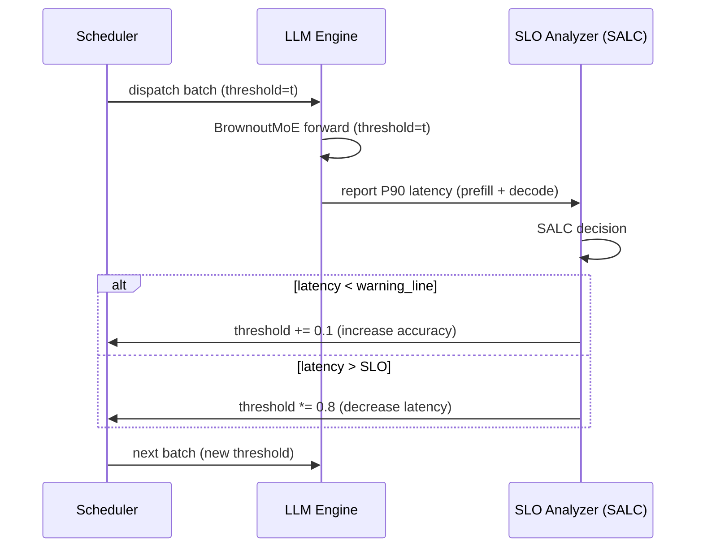

## SLO-Aware Latency Control (SALC) Algorithm (SLO 感知延迟控制算法)

术语解释
SALC 是 BrownoutServe 中动态调节 brownout threshold 的反馈控制算法。它基于实时 P90 latency 监控，在 SLO warning line 和 SLO 之间维持推理延迟，同时最大化 threshold（即最大化精度）。

术语是什么？
SALC 解决的核心优化问题（Eq. 9）：

$$\text{maximize} \quad \frac{1}{n} \sum_{i=1}^{n} \text{Accuracy}^{i}(\text{threshold}, k)$$
$$\text{subject to} \quad \text{Latency}^{i}_{j}(\text{threshold}, k) \leq \text{SLO}, \quad \forall i, \forall j$$

其中 way=k 变化频率低（涉及 united expert 重新加载），threshold 可每 iteration 调整（zero overhead）。Accuracy 是 threshold 的单调递增函数，因此优化目标等价于：在不违反 SLO 约束的前提下最大化 threshold。

从系统架构角度拆解术语：
```
Algorithm SALC (per iteration):
Input: current threshold, SLO, warning_factor, time_window tw,
       increment, shrink_ratio

1. warning_line = SLO * warning_factor     # e.g. 0.25s * 0.8 = 0.20s
2. latency = get_recent_P90_latency(threshold, tw)
3. if latency < warning_line:
       threshold = threshold + increment   # 线性增加 → 提升精度
   elif latency > SLO:
       threshold = threshold * shrink_ratio # 乘性缩减 → 快速降延迟
   # else: 在 warning_line 和 SLO 之间 → 维持不变
4. return threshold
```

SALC 在 BrownoutServe 中的集成位置：



术语一般如何实现？如何使用？
- **参数选择**：warning_factor=0.8（常见配置），increment=0.1（线性步长），shrink_ratio=0.8（乘性因子，快速反应）
- **关键设计选择**：乘性缩减 vs 线性增加的**非对称性**——突发时快速降低 threshold 保 SLO，恢复时缓慢提升 threshold 保精度
- **时间复杂度**：O(n log n)，n 为 time window 内 token 数（需排序求 P90）
- **与相关方法的区别**：不同于 AdaServe 的 SLO-customized token tree（基于 budget 约束的静态分配），SALC 是闭环反馈控制；不同于 MuxWise 的 SM partitioning（基于硬件资源分配），SALC 是算法级降级

涉及论文标题：
- BrownoutServe: SLO-Aware Inference Serving under Bursty Workloads for MoE-based LLMs
