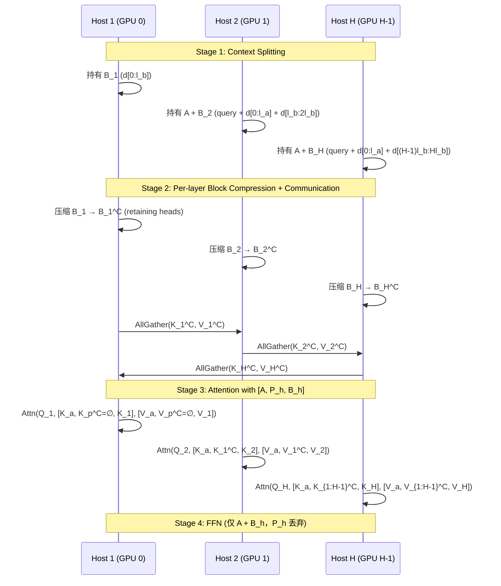

## Sequence Parallelism (序列并行)

术语是什么？回答尽量完整，回答逻辑链中每一步都解释出来。

Sequence Parallelism (SP) 是一种将 Transformer 输入序列沿 token 维度切分到多个 GPU 的分布式并行策略。与 Tensor Parallelism（沿 model weight 维度切分）、Pipeline Parallelism（沿 layer 维度切分）和 Data Parallelism（沿 batch 维度切分）不同，SP 专门针对序列长度的扩展需求——当单 GPU 无法容纳长序列的 KV cache 或 attention 计算时，SP 将序列均分到多个 GPU 上并行处理。

两种主要 SP 范式：(1) RINGATTN-style：沿序列维度切分 + P2P ring 通信传递 K/V，每 GPU 计算 local Q 与所有 K/V 的 attention，经 H-1 轮完成全局 attention；(2) ULYSSES-style：沿序列维度切分 + All-to-All 通信在 sequence layout↔head layout 间转换，每 GPU 持有完整序列的部分 heads 进行独立 attention。

SP 的主要约束：(a) ULYSSES 受限于 attention head 数量（SP degree ≤ num_heads），GQA/MQA 模型需 KV cache replication；(b) RINGATTN 通信量随 SP degree 线性增长，跨节点场景下带宽成为瓶颈；(c) SP 的 scaling efficiency 是 sublinear 的（通信开销不可忽略）。

Sequence Parallelism 最初设计用于训练（长序列训练，减少 activation memory），近年来被改造用于推理（如 Shift Parallelism、APB 等）。

从系统架构角度拆解术语。

**SP 在长上下文推理中的运转流程（以 APB 为例）**：

**SP 与其他并行策略的对比**：

| 维度 | Sequence Parallelism | Tensor Parallelism | Pipeline Parallelism | Data Parallelism |
|------|---------------------|-------------------|---------------------|-----------------|
| 切分维度 | Sequence length (N) | Model weights (d) | Layers (L) | Batch size (B) |
| KV Cache | 每 GPU 持有 N/H | 每 GPU 持有完整 N | 每 GPU 持有 N | 每 GPU 持有完整 N |
| 通信 | All-to-All 或 P2P ring | AllReduce | P2P (send/recv) | AllReduce (gradients) |
| 适用场景 | 长序列 (>32K) | 大模型 (>10B) | 超深模型 | 大批量 |
| 推理适用性 | 高（prefill 加速） | 中（latency 敏感） | 低（latency 大） | 低（无 KV cache 共享） |

**APB 对 SP 的改进**：
传统 SP 保持 FULLATTN 计算语义不变（RINGATTN, ULYSSES），计算量未减少。APB 在 SP 基础上引入 approximate attention：通过局部 KV cache 压缩 + passing block 传递，在保持分布式加速的同时减少每个 host 的计算量（attention 从 O((n/H)^2) 降低至 O((n/H + (H-1)l_p)^2)）。

术语一般如何实现？如何使用？

SP 在 PyTorch 中通过 `torch.distributed` 和 NCCL backend 实现。在 DeepSpeed 中通过 `sequence_parallel_size` 配置。在 Shift Parallelism 中，通过 `--ulysses-sequence-parallel-size SP` 指定。APB 在 HuggingFace Transformers 基础上添加了自定义 SP-aware attention layer。开源：https://github.com/microsoft/DeepSpeed (Ulysses), https://github.com/thunlp/APB (APB SP)。

涉及论文标题：
- APB: Accelerating Distributed Long-Context Inference by Passing Compressed Context Blocks across GPUs
- Cache Me If You Can: How Many KVs Do You Need for Effective Long-Context LMs
- LASP-2: Rethinking Sequence Parallelism for Linear Attention and Its Hybrid

---
