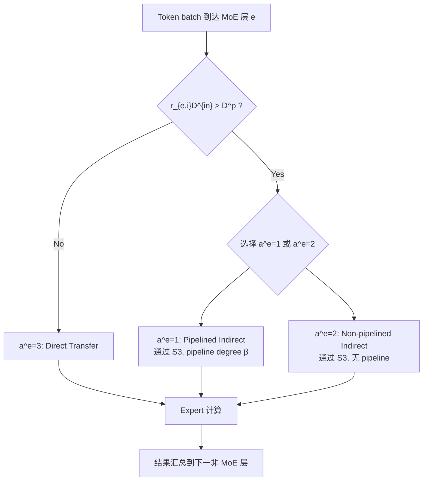

## Serverless Scatter-Gather Communication Design for MoE（Serverless MoE 的 Scatter-Gather 通信设计）

术语是什么？回答尽量完整，回答逻辑链中每一步都解释出来。通过联网搜索让回答具体和精准。
在 MoE 推理中，scatter 通信指 gating network 将 token 路由（派发）到各 expert 的过程，gather 通信指各 expert 处理结果汇总到下一非 MoE 层的过程。在 serverless 平台上，由于函数间无直接持久连接（stateless）、payload size 限制（如 6MB）、以及需要通过 external storage（如 S3）中继大数据，scatter-gather 通信无法直接复用 GPU/CPU 集群上的 all-to-all pipelining 方案。该论文为 serverless 平台设计了三种 scatter-gather 通信方法：

1. **Pipelined Indirect Transfer (a^e=1)**：gating network 将 token 数据按 minibatch（pipeline degree β）分片写入 S3 → expert function 从 S3 下载 minibatch_i 并计算，同时上传 minibatch_{i-1} 的结果到 S3（pipeline overlap）→ 所有结果写回 S3 → 下一非 MoE 层从 S3 下载所有结果。
2. **Non-pipelined Indirect Transfer (a^e=2)**：gating network 将所有 expert 输入一次性写入 S3 → 各 expert 从 S3 下载、计算、结果写回 S3 → 下一层从 S3 下载。无 pipeline overlap。
3. **Direct Transfer (a^e=3)**：gating 函数直接调用 expert 函数传输数据 → expert 计算后直接传结果给下一层。要求 r_{e,i} × D^{in} ≤ D^p（payload size）。无 S3 延迟，但受 payload 限制。

从系统架构角度拆解术语：
通信方法选择的工作流程：

Pipelined indirect transfer 的时间模型：
- Block time: t^{blk}_{1,e,i} = T^{dl} + β·max{D^{in}/B^s + t^{cal}_{e,i}, D^o/B^s}
- Non-block time: t^{nblk}_{1,e,i} = T^{dl} + ⌈r_{e,i}/β⌉·(D^o/B^s)
- Head time: T^{h,E}_{e,i} = P_{e,i}/B^s + T^{dl} + T^{str}
- 总 replica 执行时间: t^{rep}_{1,e,i} = T^{h,E}_{e,i} + t^{nblk}_{e,i} + β·t^{blk}_{e,i}

术语一般如何实现？如何使用？通过联网搜索让回答具体和精准。
- 小 batch（~256 tokens）时 direct transfer 最优（无 S3 开销）；大 batch（~2560 tokens）时 pipelined indirect 最优（突破 payload 限制 + pipeline 掩盖 S3 延迟）。
- ODS 算法（Optimal Deployment Selection）逐层选择最优通信方法，并允许不同 MoE 层使用不同方法。
- 实现依赖：AWS Lambda direct invocation API（payload ≤6MB）+ S3 put/get object API（pipeline overlap）。
- 论文实验表明：最优通信方法的选择随 token 数量变化——256 tokens 时 direct transfer 胜出，2560 tokens 时 pipelined indirect 胜出。

涉及论文标题：
- Optimizing Distributed Deployment of Mixture-of-Experts Model Inference in Serverless Computing
