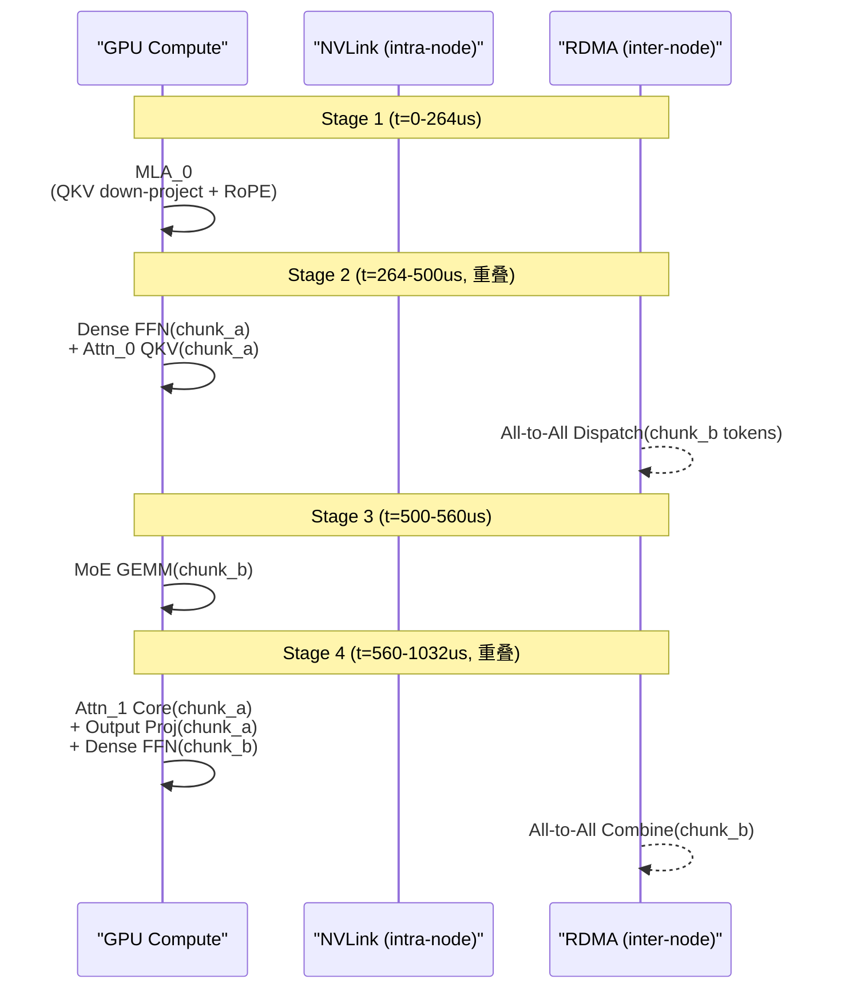

## Single Batch Overlap (SBO / 单 Batch 重叠调度)

术语是什么？回答尽量完整，回答逻辑链中每一步都解释出来。通过联网搜索让回答具体和精准。

Single Batch Overlap (SBO) 是 LongCat-Flash 提出的 MoE 推理调度策略。核心思想：利用 ScMoE 架构的 shortcut 连接，在单个 batch 内实现四阶段 computation-communication overlap，将 all-to-all 通信隐藏于 Dense FFN 和 Attention 计算中。SBO 区别于 DeepSeek-V3 的 TBO (Two Batch Overlap)——TBO 需要两个不同 batch 交错执行来实现重叠，而 SBO 在单 batch 内完成。

SBO 的四阶段 Pipeline：
- Stage 1: MLA_0 独立执行（输出作为后续阶段输入）
- Stage 2 (并行): Dense FFN(chunk_a) + Attn_0 QKV Projection(chunk_a) || All-to-All Dispatch(chunk_b tokens)
- Stage 3: MoE GEMM(chunk_b) 独立执行
- Stage 4 (并行): Attn_1 Core Attention + Output Projection(chunk_a) + Dense FFN(chunk_b) || All-to-All Combine(chunk_b)

SBO 的关键创新在于 module-level overlap——不同模块的计算与通信交叉执行。ScMoE 的 shortcut 连接是使 SBO 可行的关键：它将 Dense FFN 置于 MoE 之前，使 Dense FFN 的计算时间（约 264us/layer, intermediate dim=12288）可以覆盖 all-to-all 通信（约 708us dispatch+combine 总计）。

从系统架构角度拆解术语，比如术语如何在系统架构中发挥作用，给出术语在系统架构中运转流程的具体例子。通过联网搜索让回答具体和精准。

SBO 调度流程（Mermaid 时序图）：

LongCat-Flash 的理论分析（Table 7）：
- Attention (MLA): 264us/layer
- All-to-All Dispatch: 236us/layer
- MoE GEMM: 60us/layer
- All-to-All Combine: 472us/layer
- SBO 理论 TPOT: 16ms（28 layers）
- DeepSeek-V3 TBO 理论 TPOT: 30ms（61 layers）

SBO 使 non-overlapping communication 占比从 25.3% 降至 8.4%，TPOT 降低近 50%。

术语一般如何实现？如何使用？通过联网搜索让回答具体和精准。

实现要点：
1. **依赖 ScMoE 架构**：SBO 的 module-level overlap 需要 Dense FFN 在 MoE 之前执行（ScMoE shortcut 连接），传统 interleaved MoE+Dense FFN 架构无法直接使用 SBO。
2. **Token Chunking**：将 token batch 分两个 chunk（chunk_a 和 chunk_b），交替执行。Chunk_a 先过 Dense FFN+attention，与 chunk_b 的 all-to-all dispatch 并行，然后 chunk_b 的 MoE GEMM，最后 chunk_a 的 attention core 与 chunk_b 的 all-to-all combine 并行。
3. **Wide EP**：SBO 配合 wide EP deployment（128 EP）降低 MoE GEMM 延迟（>60us），使每层时间由 MLA 而非 MoE 主导。
4. **与 TBO 对比**：TBO 需维护双 batch pipeline state → 需额外的 KV cache management → 对单用户请求不友好。SBO 单 batch → 状态管理简单 → 所有请求均受益。
5. **Multi-step scheduler 配合**：SBO 的每层时间约 1032us，28 层约 29ms/step。Multi-step overlapped scheduler 批量预 launch 4 step 的 kernel 减少 CPU overhead。

涉及论文标题：
- LongCat-Flash Technical Report
