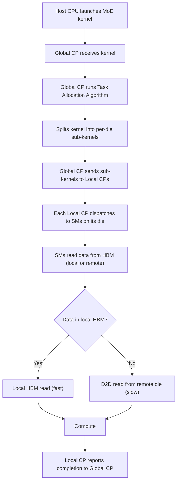

## Single-GPU-like Programming Model for Multi-Die GPU (多Die GPU的统一编程模型)

术语是什么？回答尽量完整，回答逻辑链中每一步都解释出来。通过联网搜索让回答具体和精准。
Single-GPU-like Programming Model 是将整个 multi-chiplet/wafer-scale GPU（含多个 compute die）暴露为统一单 GPU 的编程模型，完全从软件层面抽象 multi-die topology 和 data placement，使编程体验与 monolithic GPU 相同。与之对应的是 Multi-GPU-like Programming Model（如 WSC-LLM、MoEntwine），将 wafer 暴露为多 GPU 系统，允许程序员精细控制每个 die，但需要通过 NCCL/NVSHMEM 等库管理显式的跨 die 通信。Single-GPU-like 模型与当前商业 multi-chiplet GPU（Blackwell 2-die, Rubin 4-die）的编程方式一致——NVIDIA 不暴露 die-level 控制 toolchain，即使 MIG 模式也会禁用高速 D2D 链路。

从系统架构角度拆解术语：
Single-GPU-like 模型下的执行流程（以 MoE kernel launch 为例）：

核心trade-off：编程简单性 vs 性能。Single-GPU-like 消除了显式跨 die 通信管理，但将优化负担完全转移到硬件——local vs remote data access 延迟差距可达 15×，而软件无法控制 cross-die data movement。论文通过硬件架构扩展（Global/Local CP + ATU/PDU）在硬件层自动优化 data placement，弥补这一差距。

术语一般如何实现？如何使用？通过联网搜索让回答具体和精准。
- 论文采用的 Single-GPU-like 模型在实践中意味着：(1) 所有 die 的 SMs 由统一的 Command Processor 管理（论文改进为两级 CP）；(2) 所有 die 共享统一的虚拟地址空间（论文通过 ATU 实现 local/remote 地址翻译）；(3) 应用程序无需显式管理跨 die 数据搬移（论文通过 PDU 实现 hardware-managed caching）。
- 商业实现：NVIDIA Blackwell (2-die) 和 Rubin (4-die) 均采用 Single-GPU-like 模型，CUDA 程序无需修改即可运行在多 die GPU 上。HDPAT (HPCA 2026) 和 Hecton 也采用此模型。
- 替代方案：Multi-GPU-like 模型（WSC-LLM, MoEntwine）提供 die-level 控制但需要大量架构改动并偏离行业趋势。

涉及论文标题：
- Orders in Chaos: Enhancing Large-Scale MoE LLM Serving with Data Movement Forecasting
