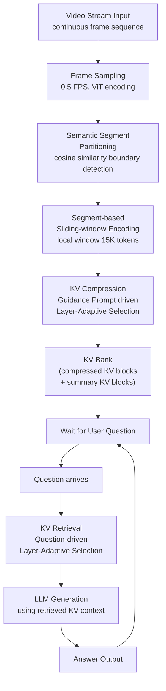

## Streaming Video Question Answering / Online Video-LLM（流式视频问答/在线视频大语言模型）

术语是什么？回答尽量完整，回答逻辑链中每一步都解释出来。

Streaming Video Question Answering (StreamingVQA) 是一种视频理解范式，要求 Video-LLM 持续处理实时视频流，并在任意时刻基于截至当前时间戳的所有历史视觉内容回答用户问题。与离线（offline）Video-LLM 一次性处理完整视频和所有问题不同，StreamingVQA 面临三个核心挑战：(1) 如何高效处理持续流入的视频帧（避免重复编码）；(2) 如何在保留历史视觉上下文与控制显存消耗之间取得平衡；(3) 如何在回答用户问题时快速准确地检索相关历史信息。Online Video-LLM 是支持 StreamingVQA 的模型范式，典型代表包括 VideoLLM-online（LIVE 框架）、Flash-VStream（memory-augmented 架构）、Dispider（解耦感知-决策-反应）、ReKV（KV cache 检索机制）和 StreamKV（语义分段+KV 压缩+检索）。

从系统架构角度拆解术语，比如术语如何在系统架构中发挥作用，给出术语在系统架构中运转流程的具体例子。

StreamingVQA 系统架构全流程（以 StreamKV 为例，NVIDIA H20 96GB，0.5 FPS，基座 LLaVA-OneVision-Qwen2-7B-OV）：

关键系统设计决策：
1. **增量式处理**：每段仅编码一次，压缩后存入 KV Bank，不会为每个问题重复编码历史视频。
2. **即时压缩**：段编码完成后立即压缩（非延迟压缩），确保 KV Bank 始终保持在目标显存预算内。
3. **显存-精度权衡**：压缩率 θ 从 0%（不压缩）到 90%（仅保留 10% KV），StreamKV 在 90% 压缩率下仍保持 56.7% Overall 准确率（vs 无压缩 ReKV 53.5%）。
4. **分离式位置编码**：Encoding 阶段 RoPE 仅应用于 local window（避免长序列远距离 attention 衰减）；QA 阶段基于 relative positions 应用 RoPE（将检索到的 KV blocks 视为连续序列）。

术语一般如何实现？如何使用？

实现方式：基座模型通常为 Video-LLM（如 LLaVA-OneVision），无需额外训练（training-free）。系统组件：(1) 视觉编码器（ViT）提取帧级特征；(2) 分段策略（语义/均匀）；(3) KV 编码模块（sliding-window attention）；(4) KV 压缩模块（可选）；(5) KV Bank 存储；(6) KV 检索模块；(7) LLM decoder 生成回答。评估基准：StreamingBench（18 个子任务，3 大类：Real-Time Visual Understanding、Omni-Source Understanding、Contextual Understanding）。硬件平台：NVIDIA H20/A100 GPU。适用场景：自动驾驶实时视频理解、具身智能（embodied AI）、AR 设备、监控视频分析、直播内容理解等需要持续处理视频流并响应查询的场景。限制：当前方法多基于 0.5 FPS 低帧率处理，实时性（如 30 FPS）仍需进一步优化；长视频（>1 小时）下即使压缩也可能面临 KV Bank 持续增长问题。

涉及论文标题：
- StreamKV: Streaming Video Question-Answering with Segment-based KV Cache Retrieval and Compression
