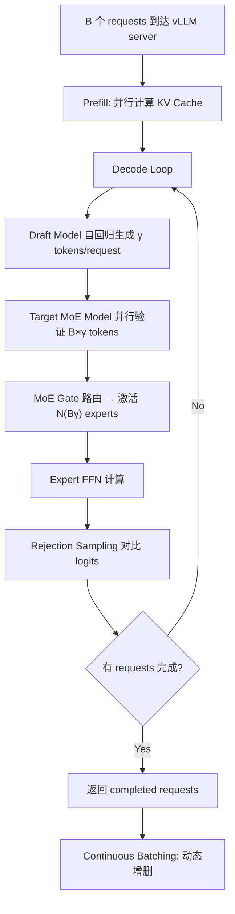

## vLLM (LLM Serving Framework)

术语是什么？回答尽量完整，回答逻辑链中每一步都解释出来。通过联网搜索让回答具体和精准。
vLLM 是 UC Berkeley 开发的 LLM 推理服务框架（Kwon et al., SOSP 2023），核心创新是 PagedAttention——将 KV Cache 划分为固定大小的 "blocks"（类似 OS 虚拟内存分页），消除碎片化并支持内存共享。vLLM 支持 continuous batching（动态增删请求）、cudagraph optimization（捕获并重放 CUDA graph 以减少 kernel launch overhead）、batched speculative decoding（支持多请求并行 draft→verify→reject 的 SD pipeline），并报告详细 timing 分解（T_D, T_T, T_reject, σ 等）。MoESD 利用 vLLM 的这些能力验证 SD 对 MoE 的加速效果，无需修改 vLLM 源码——仅通过修改模型 config.json 的 `num_experts_per_token` 控制 MoE sparsity。

从系统架构角度拆解术语：
vLLM 在 SD 场景下的请求处理流程（基于 MoESD 的使用方式）：

Annotations: D 阶段每个 request 独立 draft；E 阶段所有 requests 的 draft tokens 拼接为 batch 做一次 forward；vLLM cudagraph 优化减少 E-F-G 的 kernel launch overhead；vLLM 报告 T_D(B,1), T_T(B,γ), T_reject, σ 用于 MoESD 的 target efficiency 计算。

术语一般如何实现？如何使用？通过联网搜索让回答具体和精准。
- 开源：https://github.com/vllm-project/vllm（Apache 2.0 license）。
- MoESD 利用的主要 vLLM 功能：(a) batched speculative decoding——支持在 continuous batching 下同时处理多个 requests 的 SD pipeline；(b) 详细 timing report——自动记录各阶段耗时，使 target efficiency 等分析成为可能；(c) cudagraph——捕获一次计算图后重复执行，消除 Python overhead 和 kernel launch 延迟。
- vLLM 的 PagedAttention 使 KV Cache 内存利用率接近 100%（对比传统方式仅 20-40%），但 MoESD 的主要关注点不在 KV Cache 而在 expert 参数加载和计算时间。

涉及论文标题：
- MoESD: Unveil Speculative Decoding's Potential for Accelerating Sparse MoE
