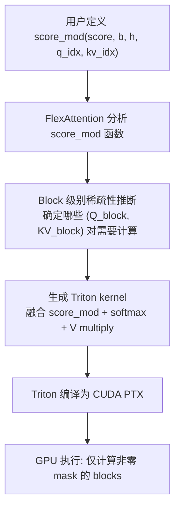

## FlexAttention (PyTorch Flexible Attention API)

术语是什么？回答尽量完整，回答逻辑链中每一步都解释出来。

FlexAttention 是 PyTorch 团队（Dong et al., 2024）提出的注意力编程模型和 kernel 生成系统，旨在统一多种注意力变体（sliding window、block-sparse、causal masking、document masking、soft-capping 等）到单一的 Python API 中。传统方法需要为每种注意力模式编写专用的融合 kernel（或使用 FlashAttention 的有限模板参数），FlexAttention 通过让用户用纯 PyTorch 张量操作在 Python 中定义 `score_mod`（attention score modifier）函数，自动编译为高效的融合 CUDA kernel。

核心设计：(1) `score_mod(score, b, h, q_idx, kv_idx)` 函数——用户定义如何修改注意力分数矩阵，框架负责高效的 kernel 生成；(2) 自动 block-sparse 编译——通过分析 mask 的稀疏模式自动跳过零值 block，实现与手写 block-sparse kernel 相当的硬件效率；(3) 支持反向传播——score_mod 中的所有操作为 PyTorch 可微操作，自动支持训练。

从编译框架角度拆解术语，比如术语如何在编译框架中发挥作用，给出术语在编译框架中运转流程的具体例子。

**FlexAttention 编译流程（用户到 GPU kernel）**：



**FlexAttention 的 score_mod 函数示例（PowerAttention）**：

```python
from torch.nn.attention.flex_attention import flex_attention, create_block_mask

def power_attention_score_mod(score, b, h, q_idx, kv_idx):
    """
    score: attention scores [B, H, M, N]
    q_idx, kv_idx: query 和 key 的 token 位置索引
    """
    block_size = 256
    # 转换为 block 索引
    blk_qk = (q_idx // block_size) - (kv_idx // block_size)
    
    # 滑动窗口（5 blocks）
    is_window = blk_qk < 5
    
    # PowerAttention: power-of-2 distances
    is_power = (blk_qk & (blk_qk - 1)) == 0
    
    # Sink tokens（第 0 block）
    is_sink = kv_idx < block_size
    
    # 因果性
    is_causal = q_idx >= kv_idx
    
    # 构造 mask: 将不需要的 score 设为 -inf
    if not (is_causal and (is_window | is_power | is_sink)):
        score = float('-inf')
    
    return score

# 预编译 block mask（首次调用时分析稀疏模式）
block_mask = create_block_mask(
    power_attention_score_mod, B=None, H=None, Q_LEN=32768, KV_LEN=32768
)

# 实际 attention 计算
output = flex_attention(query, key, value, block_mask=block_mask)
```

**FlexAttention 的编译技术细节**：

1. **稀疏性推断（Sparsity Inference）**：在编译时，FlexAttention 用符号化的 q_idx/kv_idx 值调用 score_mod，推断哪些 (query_block, kv_block) 对会产生非 -inf 的 score。这生成了一个 block-level 的稀疏模式（sparsity pattern）。

2. **Block-Sparse Kernel 生成**：基于推断的稀疏模式，FlexAttention 生成定制的 Triton kernel：
   ```
   for query_block in parallel (grid-level):
       load Q[query_block] to SRAM
       for kv_block in non_zero_blocks[query_block]:
           load K[kv_block], V[kv_block] to SRAM
           S = Q @ K^T / sqrt(d_k)
           S = score_mod(S)  # 应用用户定义的 score modifier
           O += softmax(S) @ V
       write O to HBM
   ```

3. **反向传播支持**：因为 score_mod 是 PyTorch 可微函数，backward pass 自动计算 score_mod 对 score 的梯度，无需手动编写 backward kernel。

术语一般如何实现？如何使用？

FlexAttention 是 `torch.nn.attention.flex_attention` 模块的一部分（PyTorch 2.5+）。使用方式：
1. 定义 `score_mod(score, b, h, q_idx, kv_idx)` 函数
2. 可选：调用 `create_block_mask(score_mod, B, H, Q_LEN, KV_LEN)` 预编译 block mask（提升重复调用性能）
3. 调用 `flex_attention(query, key, value, score_mod=score_mod)` 或 `flex_attention(query, key, value, block_mask=block_mask)`

PowerAttention 论文使用 FlexAttention 的所有 baseline 和 PowerAttention 模式的 mask 定义（见 Appendix D 中的 Algorithms 2-5）。对于序列并行训练，FlexAttention 结合的 Triton kernel 与 RingAttention 一起使用，实现跨 GPU 的序列维并行。

与手写 Triton kernel 相比，FlexAttention 的优势在于：(1) 所有注意力变体共享一个 API 和编译管线；(2) 自动 block-sparse 编译无需手动 tiling；(3) 支持训练（反向传播自动处理）；(4) 通过 score_mod 函数组合实现复杂掩码（如 power-of-2 + window + sink 的组合逻辑仅需几行 Python）。

涉及论文标题：
- PowerAttention: Exponentially Scaling of Receptive Fields for Effective Sparse Attention
- Scale-invariant Attention
