# Q1.1 — MoE、DiT、多模态、Video 模型的单请求推理计算流程与硬件瓶颈分析

## 笔记证据概览

| 路径 | 分数 | 关键信息 |
|------|------|----------|
| paper_secs/secs_moe/EPS-MoE Expert Pipeline Scheduler for Cost-Efficient MoE Inference/EPS-MoE-Expert-Pipeline-Scheduler-for-Cost-Efficient-MoE-Inference.md | 12326.9 | MoE 推理 pipeline 架构图(GEMM/compute-bound vs memory-bound 算子分类)、Expert Pipeline Scheduler、GroupGemm vs DenseGemm 切换、communication-computation overlap |
| paper_secs/secs_moe/Efficient MoE Serving in the Memory-Bound Regime Balance Activated Experts, Not Tokens/... | 13739.2 | MoE memory-bound 推理瓶颈、expert 激活平衡、all-to-all 通信开销定量分析 |
| knowledge_notes/算法知识笔记/Mixture of Experts (MoE).md | 2847.6 | MoE 核心公式、四步推理过程伪代码、MoE layer forward pass 完整流程 |
| knowledge_notes/算法知识笔记/Top-K Routing _ Gating Mechanism.md | 3989.1 | Top-K 路由伪代码、K 值选择、固定 Top-K 缺陷分析 |
| knowledge_notes/算法知识笔记/MoE Gate Network _ Expert Routing (门控网络 _ 专家路由).md | 3932.3 | Gate Network 决策链路、AlltoAll dispatch 流程、Capacity Factor 机制 |
| knowledge_notes/算法知识笔记/MoE (Mixture-of-Experts).md | 2065.3 | MoE 公式 y=ΣG(x)_i·E_i(x)、推理机制、Multi-LoRA serving |
| experiment_notes/系统实验笔记/Efficient MoE Inference with Fine-Grained Scheduling of Disaggregated Expert Parallelism.md | 3617.2 | FinDEP DEP 推理全流程(Offline/Online/Per-Layer)、四种 GPU 平台吞吐数据 |
| experiment_notes/系统实验笔记/MoE-Inference-Bench_ Performance Evaluation of Mixture of Expert Large Language and Vision Models.md | 3156.4 | vLLM MoE 推理全流程(TP+EP+Fused MoE)、H100 vs Cerebras CS-3 硬件对比 |
| paper_secs/secs_2026/29-Difflow A Data-Characteristic-Aware Serving System for Diffusion Models/4-Compile-Time-Optimizations.md | 2240.7 | Diffusion pipeline 计算图(dGraph)、denoising loop 展开、DiT 架构支持 |
| paper_secs/secs_model_quant/DMQ Dissecting Outliers of Diffusion Models for Post-Training Quantization/... | 3671.4 | Diffusion 模型量化、timestep-aware 量化、denoising 过程的 outlier 分析 |
| paper_secs/secs_multimodal_kernel/vLLM-Omni Fully Disaggregated Serving for Any-to-Any Multimodal Models/... | 886.0 | Any-to-Any 多模态架构(Thinker-Talker/AR+DiT)、stage graph 抽象 |
| knowledge_notes/算法知识笔记/Any-to-Any Multimodal Models.md | 44.5 | Any-to-Any pipeline 组成(Qwen3-Omni/GLM-Image/BAGEL) |
| knowledge_notes/算法知识笔记/MMDiT (Multi-Modal Diffusion Transformer).md | 262.0 | MMDiT block 伪代码(共享 Self-Attention + 独立 FFN) |
| knowledge_notes/算法知识笔记/Three-Stage Cross-Modal Interaction in MLLMs.md | 621.6 | MLLM 三阶段跨模态交互(浅层 Task Recognition/中层 Sparse Grounding/深层 Linguistic Alignment) |
| knowledge_notes/算法知识笔记/Cross-Attention based MLLM Architecture.md | 425.9 | 三大 MLLM 架构范式对比(Concatenation/Token Compression/Cross-Attention) |
| knowledge_notes/算法知识笔记/Multimodal Connector _ Projector in MLLM.md | 27.3 | 多模态连接器设计(MLP/Q-Former/Mamba-2 scan) |
| paper_secs/secs_2025/50-S-DMA- Sparse Diffusion Models Acceleration via Spatiality-Aware Prediction and Dimension-Adaptive Dataflow/5.4-Ablation-Study.md | 1645.0 | Video diffusion 加速、temporal extension、spatial attention 分析 |
| paper_secs/secs_effAttn/MoBA__Mixture_of_Block_Attention_for_Long-Context_LLMs/4-Related-Work.md | 1735.2 | spatial-temporal attention 分解、video transformer 相关研究 |

---

## 一、MoE 模型单请求推理计算流程

**侧重标签**: 硬件体系结构（主内容）

### 方法1: Standard MoE Transformer Layer Forward Pass

**笔记证据**: `knowledge_notes/算法知识笔记/Mixture of Experts (MoE).md` (score: 2847.6); `knowledge_notes/算法知识笔记/Top-K Routing _ Gating Mechanism.md` (score: 3989.1)

**方法细节（L1 伪代码粒度）**：

```
=== MoE 单请求推理：逐 Token 前向传播 ===
输入: x ∈ R^{T×d_model}  (T 个 token, d_model=4096 for Mixtral-8x7B)
参数: N 个 Expert FFN E_i, Router W_r ∈ R^{d_model×N}, K=top-k 激活数

for each MoE layer l = 1..L:                         # L=32 for Mixtral
    # === Step 1: Self-Attention (Dense, 所有 token) ===
    x_norm = RMSNorm(x)                              # [T, d_model]
    Q, K, V = x_norm @ W_Q, x_norm @ W_K, x_norm @ W_V
                                                     # 各 [T, d_head], 并行 32 heads
    A = FlashAttention(Q, K, V)                      # [T, d_model], O(T·d_model²)
    x = x + A                                        # residual, [T, d_model]

    # === Step 2: Router (Gate Network) ===
    x_norm = RMSNorm(x)                              # [T, d_model]
    logits = x_norm @ W_r                            # [T, N], N=8 experts
    probs = Softmax(logits, dim=-1)                  # [T, N]
    topk_weights, topk_indices = TopK(probs, K)      # 各 [T, K], K=2
    topk_weights = topk_weights / sum(topk_weights)  # 归一化

    # === Step 3: Token-to-Expert Dispatch (数据布局变换) ===
    # 将 T 个 token 按 routing 结果重排为 E 组
    for e = 0..E-1:
        tokens_e = {x_norm[t] | e ∈ topk_indices[t]} # 收集分配给 expert e 的 tokens
                                                      # 形状: [T_e, d_model], T_e 不均匀!
    # 注: 这一步是 memory-bound 操作（scatter/gather）

    # === Step 4: Expert FFN 并行计算 ===
    for e = 0..E-1:                                   # E 个 expert 可独立并行!
        if len(tokens_e) > 0:
            # Expert FFN: SiLU-gated FFN
            gate = SiLU(tokens_e @ W_gate[e])        # [T_e, d_ff], d_ff=14336
            up   = tokens_e @ W_up[e]                # [T_e, d_ff]
            act  = gate * up                          # element-wise, [T_e, d_ff]
            out_e = act @ W_down[e]                   # [T_e, d_model]
            # 总 FLOPs per token: 3·d_model·d_ff ≈ 3·4096·14336 ≈ 176M FLOPs

    # === Step 5: Token Un-permute + 加权聚合 ===
    y = zeros([T, d_model])
    for t = 0..T-1:
        for k = 0..K-1:
            e = topk_indices[t, k]
            y[t] += topk_weights[t, k] * out_e[idx_map[t, e]]
                                                     # 加权求和
    x = x + y                                         # residual, [T, d_model]
```

**注解**：

1. **变量含义与维度**：T 为 token 数(单请求 prefill 典型值 128-4096)，d_model 为隐藏维度(如 Mixtral 4096)，d_ff 为 FFN 中间维度(14336=3.5×d_model)，N 为总 expert 数(典型 8-256)，K 为每 token 激活 expert 数(典型 1-8)。
2. **计算复杂度**：Self-Attention 为 O(T²·d_model)(compute-bound)，Router 为 O(T·d_model·N)(可忽略)，Expert FFN 为 O(T·K·d_model·d_ff)(compute-bound，dominant)，Token dispatch 为 O(T)(memory-bound)。
3. **数据依赖**：Step 1(Attention) → Step 2(Router) → Step 3(Dispatch) 严格串行；Step 4 中各 expert 间无数据依赖可全并行；Step 5(Un-permute) 依赖 Step 4 全部完成。
4. **并发可行性**：Expert FFN 间完美并行（无依赖），但受 token 分配不均影响——热门 expert 获得 token 数可能达平均值的 16 倍以上(MoE Load Skewness 笔记) → 负载倾斜导致部分计算单元闲置。

### 硬件瓶颈分析：MoE Expert 路由开销与 GPU Memory Hierarchy 交互

**笔记证据**: `paper_secs/secs_moe/EPS-MoE...` (score: 12326.9, Fig.2 算子分类); `paper_secs/secs_moe/Efficient MoE Serving in the Memory-Bound Regime...` (score: 13739.2)

```
=== MoE 推理硬件瓶颈分解 ===

GPU Memory Hierarchy:
  HBM (80GB, 3.35TB/s on H100) → L2 Cache (50MB, ~12TB/s) → SM L1/SMEM (256KB/SM) → Register

瓶颈点 1: Token Dispatch 是 Memory-Bound 操作
  - Router 输出 topk_indices [T, K] 后，需将 T 个 token 重排为 E 组
  - 这涉及: sparse gather (从 HBM 读取 token hidden states)
            + scatter (写入各 expert 的输入 buffer)
  - 当 T 大(长序列 prefill)时，dispatch 完全受 HBM bandwidth 限制
  - EPS-MoE 论文指出: 浅蓝框操作为 memory-bound (Fig.2)
  - 笔记显示: All-to-All dispatch+combine 平均占 step time 34.1% (Lina 分析)
  - GPU SM efficiency 在 All-to-All 期间仅 3.7%

瓶颈点 2: Expert FFN 的 GroupGemm 效率低
  - 每个 expert 收到的 token 数 T_e 不均衡，导致:
    * T_e 小 → GroupGemm kernel 的 tile 利用率低(不足填满 Tensor Core)
    * T_e 大 → 该 expert 的 FFN 成为延迟瓶颈
  - EPS-MoE 通过动态切换 GroupGemm → DenseGemm 改善:
    当某 expert 的 T_e 足够大时，使用 cuBLAS DenseGemm 获得更高 Tensor Core 利用率
  - H100 Tensor Core FP8 峰值: 1979 TFLOPS, 但小 batch expert FFN 实际利用率常 <30%

瓶颈点 3: Expert 参数驻留问题
  - 单 GPU 场景: N 个 expert 的全部权重需驻留在 HBM
  - Mixtral-8x7B: total 46B params, 96% 在 expert FFN → ~44B expert 参数
  - H100 80GB 勉强容纳，但留给 KV-cache 和中间激活的空间很小
  - 当 K 大(top-k routing), 更多 expert 需同时活跃 → HBM bandwidth 争抢加剧
```

---

## 二、DiT (Diffusion Transformer) 模型单请求推理计算流程

**笔记证据**: `paper_secs/secs_2026/29-Difflow A Data-Characteristic-Aware Serving System for Diffusion Models/4-Compile-Time-Optimizations.md` (score: 2240.7); `knowledge_notes/算法知识笔记/MMDiT (Multi-Modal Diffusion Transformer).md` (score: 262.0)

### 方法2: DiT Denoising Loop 推理流程

**方法细节（L1 伪代码粒度）**：

```
=== DiT 单请求推理：迭代去噪流程 ===
输入: noise z_T ∈ R^{H×W×C} (随机高斯噪声, 如 32×32×4 latent)
      condition c (text prompt embedding, 如 CLIP text encoder 输出)
      timesteps t = T, T-1, ..., 1  (T=50 for SDXL-Turbo, T=1000 for standard)

参数: DiT blocks × L 层, 每层含 Adaptive LayerNorm (adaLN) + Multi-Head Self-Attn + MLP

# ═══ 外部去噪循环 ═══
z = z_T  # [H, W, C]
for step s = T down to 1:
    t_emb = TimestepEmbedding(s)                   # Sinusoidal + MLP → [d_model]
    c_emb = ConditionEmbedding(c)                   # [d_model]
    conditioning = t_emb + c_emb                    # [d_model], 合并条件

    # ═══ DiT Forward (单步去噪预测) ═══
    # 将 latent 展平为 patch tokens
    z_patches = Patchify(z)                         # [N_patches, d_model]
                                                    # N_patches = (H/p) × (W/p)
                                                    # 例: 32×32 / 2 = 256 patches

    # === DiT Block × L (所有 tokens 通过相同 Transformer) ===
    h = z_patches  # [N_patches, d_model]
    for l = 1..L:                                    # L=28 for DiT-XL/2
        # adaLN: 根据 conditioning 动态调整 scale/shift
        scale_1, shift_1, gate_1 = AdaLN_MLP(conditioning)
        scale_2, shift_2, gate_2 = AdaLN_MLP(conditioning)
        # 每个 [d_model], 由 conditioning 线性投影得到

        # Multi-Head Self-Attention (dense, 全 patch)
        h_norm = LayerNorm(h) * (1 + scale_1) + shift_1   # [N, d_model]
        Q, K, V = h_norm @ W_Q, h_norm @ W_K, h_norm @ W_V  # [N, d_head]
        attn = Softmax(Q @ K^T / sqrt(d_head)) @ V         # [N, d_model]
        h = h + gate_1 * attn                               # residual

        # MLP (Pointwise FFN)
        h_norm = LayerNorm(h) * (1 + scale_2) + shift_2   # [N, d_model]
        mlp = GELU(h_norm @ W_1) @ W_2                    # [N, d_model]
        h = h + gate_2 * mlp                                # residual
        # 每层 FLOPs: 4·N·d_model² + 2·N·d_model·d_ff

    # === 输出: 噪声预测 ===
    epsilon_pred = Unpatchify(h)                     # [H, W, C]

    # === DDIM/SDE 去噪步进 ===
    z = DenoisingStep(z, epsilon_pred, s)            # 更新 latent
    # 例(DDIM): z_{s-1} = sqrt(α_{s-1})·(z_s - sqrt(1-α_s)·ε_pred)/sqrt(α_s)
    #                + sqrt(1-α_{s-1})·ε_pred

# ═══ 最终: VAE Decoder → Image ═══
image = VAE_Decoder(z)                               # [H*8, W*8, 3]
```

**注解**：

1. **变量含义**：z 为 latent representation(压缩空间噪声)，conditioning 合并时间步嵌入和文本条件，N_patches 由 latent 分辨率决定(如 DiT-XL/2 为 256 patches)。adaLN 为 DiT 特有的自适应归一化机制，用 conditioning 调制每层的 scale/shift/gate。
2. **串行瓶颈——Denoising Loop**：最外层 denoising loop 有 T 次迭代(50-1000+)，每次迭代依赖上一步的 latent z → 纯串行，无法流水线并行。这是 DiT 推理延迟的主要来源。
3. **每步内的并行机会**：Self-Attention 中多个 head 可并行计算；MLP 的 W_1 和 W_2 是标准 dense matmul → Tensor Core 友好；不同 batch 的 patch token 可共享 conditioning(计算一次)。
4. **Difflow 论文关键优化**：通过 denoising loop 展开前几轮后识别 loop-invariant tensors(如固定的 conditioning embedding)，将其提升到循环外；检测多请求间共享的 prompt embedding 并消除冗余计算。

### 硬件瓶颈分析：DiT 迭代去噪对计算单元利用率的影响

```
=== DiT 推理硬件瓶颈 ===

瓶颈点 1: Denoising Loop 串行导致 Pipeline Bubble
  - T=50 步 × 每步 ~10ms(在 H100 上 DiT-XL) → 总延迟 ~500ms
  - 各步之间严格依赖: Step(t) 的 z_{t-1} 是 Step(t-1) 的输出
  - → 无法利用多 SM 并行加速单步(步内可并行但步间不可)
  - → GPU SM 利用率呈 "脉冲式": 每步计算时利用率高, 步间 kernel launch/idle

瓶颈点 2: Patch Token 数量决定 Attention 复杂度
  - N=256 patches → Attention FLOPs: 4·N²·d_model ≈ 4·256²·1152 ≈ 302M
  - N=1024 patches(高分辨率) → Attention FLOPs: 4·1024²·1152 ≈ 4.8B (暴涨 16x)
  - Attention 是 O(N²) → 高分辨率/长视频时迅速成为 compute-bound 瓶颈
  - H100 Tensor Core 在 Attention Softmax 阶段利用率低(Softmax 是 element-wise)

瓶颈点 3: 小 Batch 单请求场景 Tensor Core 利用率低
  - 单请求推理 batch_size=1 → N_patches=256 tokens
  - GPU MatMul 在 M=256 时远未填满 Tensor Core(A100 Tensor Core 最优 M ≥ 512-1024)
  - EPS-MoE 指出: 小 batch GEMM 的 Tensor Core 利用率 < 20%
  - NVLink/NVSwitch 带宽在单 GPU 场景不发挥作用(无跨 GPU 通信需求)

瓶颈点 4: VAE Decoder 是 "一次性大计算"
  - 去噪完成后, VAE Decoder 单次将 latent 解码为像素
  - 包含多个反卷积层 + upsampling → 计算量大但仅执行一次
  - 在单请求场景, VAE Decoder 启动开销(kernel launch latency)显著
```

---

## 三、多模态模型单请求推理计算流程

**笔记证据**: `knowledge_notes/算法知识笔记/Any-to-Any Multimodal Models.md` (score: 44.5); `paper_secs/secs_multimodal_kernel/vLLM-Omni...` (score: 886.0); `knowledge_notes/算法知识笔记/Three-Stage Cross-Modal Interaction in MLLMs.md` (score: 621.6); `knowledge_notes/算法知识笔记/Cross-Attention based MLLM Architecture.md` (score: 425.9)

### 方法3: Concatenation-based MLLM 推理流程 (以 LLaVA-1.5 为例)

**方法细节（L1 伪代码粒度 + 三阶段跨模态交互）**：

```
=== 多模态 MLLM 单请求推理流程 ===
输入: Image I ∈ R^{H×W×3}, Text prompt P (如 "What is in this image?")
输出: Text answer A

# ═══ Phase 1: 模态编码 (异构计算单元映射) ═══
# --- Vision Encoding (在 GPU Tensor Core 上执行) ---
with torch.no_grad():
    # Vision Encoder (ViT-L/14, 冻结)
    patches = PatchEmbed(I)                          # [N_v, d_vis], N_v=576, d_vis=1024
    for vit_layer in ViT.blocks:                     # 24 ViT layers
        patches = vit_layer(patches)                 # Self-Attention + MLP
    V = patches[:, 1:]                               # [576, 1024], 去掉 CLS token
    # 笔记: 视觉编码器输出 576 tokens × 1024 dims

# --- Text Tokenization (在 CPU 上执行) ---
T_ids = Tokenizer(P)                                 # [T_text], 如 20 tokens
T_emb = Embedding(T_ids)                             # [T_text, d_llm], d_llm=4096

# ═══ Phase 2: 模态对齐 (Projector) ═══
# --- 视觉特征 → LLM Embedding 空间 ---
V_proj = Projector(V)                                # [576, 4096]
# Projector: Linear(GELU(Linear(V))) 或 更复杂的 Q-Former/Mamba-2 scan
#    参数: ~2·d_vis·d_llm ≈ 2·1024·4096 ≈ 8.4M (极小)
#    笔记: knowledge_notes/.../Multimodal Connector _ Projector in MLLM.md

# ═══ Phase 3: LLM Backbone (跨模态融合) ═══
# --- Token 拼接 ---
H = Concat([V_proj, T_emb])                          # [576+20, 4096] = [596, 4096]

# --- 逐层 Transformer (三阶段跨模态交互) ---
for l = 1..L:                                        # L=32 for LLaVA-v1.5
    H_norm = RMSNorm(H)                              # [596, 4096]
    Q, K, V = H_norm @ W_Q, H_norm @ W_K, H_norm @ W_V

    # Attention 矩阵包含 4 个区域:
    # [V→V][V→T]  视觉 self-attn + 视觉→文本 cross-attn
    # [T→V][T→T]  文本→视觉 cross-attn + 文本 self-attn
    attn_scores = Q @ K^T / sqrt(d_head)             # [596, 596]
    # → O((N_v+T_text)²) = O(596²) ≈ 355K 次乘法 (per head per layer)

    # --- 三阶段行为差异 (VisiPruner 笔记) ---
    if l <= 8:   # Stage 1: Shallow — Task Recognition
        # 跨模态 attention 几乎无效; 视觉 token 仅作为 attention sink
        # 文本 token 编码的是 task type (如 "number"→counting), 非视觉内容
        pass
    elif l <= 23: # Stage 2: Middle — Sparse Cross-Modal Grounding
        # 跨模态融合突然发生 (abrupt onset)
        # 仅 ~10/576 视觉 token 驱动跨模态信息传递
        # → 大部分视觉 token 的 cross-attention 计算是冗余的!
        pass
    else:         # Stage 3: Deep — Linguistic Alignment
        # 视觉信息已集成到文本表示, 视觉 token 不再需要
        # → 可安全裁剪 (Vision Exit)
        pass

    attn_out = Softmax(attn_scores) @ V              # [596, 4096]
    H = H + attn_out                                  # residual
    H = H + FFN(RMSNorm(H))                          # gate_proj+up_proj+down_proj

# ═══ Phase 4: 自回归解码 ═══
generated_ids = []
for step in range(max_new_tokens):
    logits = H[-1] @ W_lm_head                       # [vocab_size], 仅取最后位置
    next_token = Argmax(logits / temperature)         # 或采样
    generated_ids.append(next_token)
    if next_token == EOS: break
    # 新 token 追加到序列, KV-cache 复用 → 每步仅计算单个新 token
    # decode 阶段 FLOPs/token ≈ 2·L·d_model² + 3·L·d_model·d_ff
    # = 2·32·4096² + 3·32·4096·14336 ≈ 1.07G + 5.64G ≈ 6.7G FLOPs

answer = Detokenizer(generated_ids)
```

**注解**：

1. **计算图依赖**：Phase 1 Vision Encoding → Phase 2 Projector → Phase 3 LLM → Phase 4 Decode。Vision 和 Text encoding 可并行（在不同计算单元）。
2. **跨模态融合的三阶段规律**(VisiPruner 笔记 EMNLP 2025)：浅层无实质融合 → 中层稀疏关键 token 驱动 → 深层纯语言 refinement。这意味着约 50% 的 visual token 计算是冗余的。
3. **异构计算单元映射**：
   - Vision Encoder (ViT) → Tensor Core + CNN 风格的 patch embedding → GPU SM
   - Text Tokenization → CPU (GPT/BPE tokenizer)
   - LLM Backbone → GPU Tensor Core (GEMM) + SM (Softmax/RMSNorm)
   - Projector → GPU Tensor Core (小矩阵, 利用率低)

### 硬件瓶颈分析：多模态跨模态融合在异构计算单元上的映射

```
=== 多模态推理硬件瓶颈 ===

瓶颈点 1: Visual Token 数量导致的 Attention 复杂度爆炸
  - N_v=576(CLIP ViT-L) → LLM 输入长度 = 576+text_len
  - Self-Attention O((N_v+T_text)²):
    单层 32 heads × 596² × 128(d_head) ≈ 1.45G FLOPs per layer
    32 层 → ~46G FLOPs 仅 Attention
  - Attention 矩阵中 V→V 区域 576² ≈ 332K entries, 但仅 ~10 个视觉 token 真正重要
  - → 跨模态注意力中 >95% 的计算是冗余的!

瓶颈点 2: Projector 成为数据搬运瓶颈
  - V_proj = Projector(V) 的计算量小（~8.4M params）但 V 从 Vision Encoder 输出
    需经 HBM → L2 → SM 传输 (576×1024×2bytes ≈ 1.2MB FP16)
  - 若 Vision Encoder 和 LLM 在不同 GPU/加速器上 → PCIe/NVLink 跨设备传输
  - 单 GPU 场景: V 从 HBM 读取→Projector 计算→写回 HBM→LLM 读取 → 3 次 HBM 往返

瓶颈点 3: Cross-Attention MLLM vs Concatenation MLLM 的硬件偏好差异
  - Concatenation-based (LLaVA): visual tokens 在 context window 中
    → HBM 需保存完整的 [V+T] KV-cache → 576 visual KV entries × 32 layers
    → ~576×32×4096×2×2bytes ≈ 302MB 仅视觉 KV-cache (FP16)
  - Cross-Attention-based (Flamingo/mPLUG-Owl3): visual tokens 不进入 context
    → KV-cache 仅需保存 text tokens → 大幅节省 HBM
    → 但需要额外的 cross-attn K/V 投影 → 增加计算量
  - 笔记未明确说明哪种在单 GPU H100 上更优 — 取决于 visual token 数量
```

---

## 四、Video 模型单请求推理计算流程

**笔记证据**: `paper_secs/secs_2025/50-S-DMA- Sparse Diffusion Models Acceleration via Spatiality-Aware Prediction and Dimension-Adaptive Dataflow/5.4-Ablation-Study.md` (score: 1645.0); `paper_secs/secs_effAttn/MoBA__Mixture_of_Block_Attention_for_Long-Context_LLMs/4-Related-Work.md` (score: 1735.2); `knowledge_notes/算法知识笔记/MMDiT (Multi-Modal Diffusion Transformer).md` (score: 262.0)

### 方法4: Video DiT (基于 MMDiT 的视频生成推理)

**方法细节（L1 伪代码粒度）**：

```
=== Video DiT 单请求推理流程 (以 HunyuanVideo/EasyAnimate 为例) ===
输入: noise z_T ∈ R^{F×H×W×C}  (F 帧, 如 14 帧 latent)
      text condition c
输出: video frames

F = 14  # latent 帧数
H, W = latent 空间分辨率 (如 40×64 for 720p)
C = 16  # VAE latent channels
N_tokens = F × H × W  # = 14×40×64 = 35840 tokens! (vs DiT image 的 256 tokens)
                       # → 140x 更多 tokens!

z = z_T  # [F, H, W, C]

for step s = T down to 1:
    # === Step 1: 3D Patchify ===
    z_patches = Patchify3D(z, patch_size=(2,2,2))
    # z_patches: [F/2 × H/2 × W/2, C·8]
    # → [7 × 20 × 32, 128] = [4480, 128]

    # === Step 2: Text-Video Conditioning ===
    t_emb = TimestepEmbedding(s)
    c_text = TextEncoder(c)                           # CLIP/T5 text features
    # Text features 经 RMSNorm+FC 变换后与 video tokens 拼接

    # === Step 3: MMDiT Blocks (共享 Self-Attn + 独立 FFN) ===
    h_text, h_video = c_text, z_patches
    for l = 1..L:                                     # L=28~48 for video DiT
        # --- 共享 Self-Attention: 文本+视频统一交互 ---
        h_combined = Concat([Norm(h_text), Norm(h_video)])
        attn_out = MultiHeadSelfAttn(h_combined)
        # → O((N_text + N_video)²) = O((77+4480)²) = O(4557²) ≈ 20.8M per head
        attn_text, attn_video = Split(attn_out)

        # --- 独立 FFN (MMDiT 设计) ---
        h_text  = h_text  + attn_text
        h_text  = h_text  + FFN_text(Norm(h_text))
        h_video = h_video + attn_video
        h_video = h_video + FFN_video(Norm(h_video))
        # 文本 FFN 参数 ≪ 视频 FFN 参数 (视频占据绝大部分计算)

    # === Step 4: 噪声预测 + 去噪步进 ===
    epsilon_pred = Unpatchify3D(h_video)
    z = DenoisingStep(z, epsilon_pred, s)             # DDIM/Flow-Matching

# VAE Decoder: latent → pixel frames [F, H_f, W_f, 3]
video = VAE_Decoder3D(z)
```

**注解**：

1. **时空 Attention 的两种实现范式**：
   - **(A) 联合时空 Attention (Full 3D)**：Q,K,V 同时包含空间和时间维度 → O((F·H·W)²) 复杂度 → 计算量爆炸但信息最完整
   - **(B) 分解时空 Attention (Factorized)**：先 Spatial Self-Attn (per frame) O(F·(H·W)²)，再 Temporal Self-Attn (per spatial location) O(H·W·F²)。总 O(F·(H·W)² + H·W·F²)。笔记 (MoBA Related Work 节) 指出：spatial-temporal attention 通过分解降低复杂度。
2. **数据依赖**：Spatial Attn 的各帧可独立并行 → 无帧间依赖 → 天然适合多 SM 并行。Temporal Attn 需所有帧的对应空间位置特征就绪 → 在 Spatial Attn 全部完成后才能执行。
3. **MMDiT 设计取舍**：共享 Self-Attention 实现文本-视频跨模态融合，独立 FFN 保持各模态特征表达。文本 FFN 计算量相对视频 FFN 可忽略。

### 硬件瓶颈分析：Video 时空 Attention 对访存带宽的压力

```
=== Video 推理硬件瓶颈 ===

瓶颈点 1: Token 数量爆炸 → HBM Capacity 和 Bandwidth 双重压力
  - 14帧 video latent = 35840 tokens (vs 256 for image DiT)
  - Attention 中间激活: Q,K,V 各 [35840, 4096] FP16 ≈ 294MB × 3 ≈ 882MB
  - Attention score matrix: [35840, 35840] FP16 ≈ 2.57GB (单层单 head!)
    → FlashAttention 通过 tiling 避免完整物化, 但仍需在 SRAM/HBM 间反复搬运 tile
  - 32 层 video DiT → HBM 峰值占用可能超过 80GB → 需要 offload/checkpointing

瓶颈点 2: 时空 Attention 的访存模式不友好
  - Spatial Attention (per frame):
    每帧的 token 在 HBM 中连续存储 → coalesced access ✓
    但需要 F 次独立的 Attention kernel launch → kernel launch overhead
  - Temporal Attention (per spatial location):
    需要跨帧 gather 同一空间位置的 token → strided memory access ✗
    → 每次 gather 涉及 F 次 HBM 访问 (F=14, 每次访问不连续)
    → Memory bandwidth utilization 在 temporal attention 期间 < 40%

瓶颈点 3: VAE 3D Decoder 的访存放大
  - 3D VAE Decoder 将 latent [14,40,64,16] → pixels [14,320,512,3]
  - 包含 3D ConvTranspose + Upsample → 大量 strided HBM 访问
  - 输出视频帧尺寸 14×320×512×3×1byte ≈ 6.9MB → 但在 decode 过程中中间张量可能是最终输出的 10×+
  - 笔记 (S-DMA ablation) 指出: 在 video domain, temporally extended denoising
    引入 large parameters and complex computation

瓶颈点 4: 帧数 F 对延迟的线性放大
  - 单请求推理中, 每增加 1 帧 latent → Attention cost (spatial) + F·cost(temporal)
  - F=14: latency ≈ 14× latency(image DiT with same resolution)
  - 去噪步数 T=50: total latency ≈ 50 × 14 × per-step-cost
  - → 单请求视频推理延迟可长达数十秒 (在 H100 上)
```

---

## 五、跨模型计算图依赖统一分析

基于数据依赖 DAG 分析四种模型推理流程中的可并行与必须串行部分：

```mermaid
flowchart TD
    subgraph MoE["MoE 推理 DAG"]
        A1["Input Tokens"] --> A2["Self-Attention"]
        A2 --> A3["Router<br/>Gate Network"]
        A3 --> A4["Token Dispatch<br/>memory-bound"]
        A4 --> A5["Expert 0<br/>FFN"]
        A4 --> A6["Expert 1<br/>FFN"]
        A4 --> A7["Expert N-1<br/>FFN"]
        A5 --> A8["Token Combine<br/>+ 加权聚合"]
        A6 --> A8
        A7 --> A8
    end

    subgraph DiT["DiT 推理 DAG"]
        B1["Noise Latent z_t"] --> B2["Timestep Embed<br/>+ Conditioning"]
        B2 --> B3["adaLN Modulate"]
        B3 --> B4["Self-Attention<br/>N_patches"]
        B4 --> B5["MLP FFN"]
        B5 --> B6["Noise Pred &epsilon;<br/>+ Denoising Step"]
        B6 --> B7["z_{t-1}"]
        B7 -->|"串行循环 T 次"| B1
    end

    subgraph MM["多模态推理 DAG"]
        C1["Image"] --> C2["Vision Encoder<br/>ViT"]
        C3["Text Prompt"] --> C4["Tokenizer<br/>CPU"]
        C2 --> C5["Projector"]
        C4 --> C6["Token Embedding"]
        C5 --> C7["Concat<br/>V+T tokens"]
        C6 --> C7
        C7 --> C8["LLM Layer 1..L<br/>三阶段跨模态交互"]
        C8 --> C9["Autoregressive<br/>Decode Loop"]
    end

    subgraph Video["Video 推理 DAG"]
        D1["Noise z_T<br/>F frames"] --> D2["3D Patchify"]
        D2 --> D3["Spatial Attn<br/>per frame 并行"]
        D3 --> D4["Temporal Attn<br/>跨帧 gather"]
        D4 --> D5["MMDiT FFN"]
        D5 --> D6["Denoising Step"]
        D6 --> D7["z_{t-1}"]
        D7 -->|"串行 T 次"| D1
    end

    style A4 fill:#ffcccc,stroke:#333
    style B7 fill:#ffcccc,stroke:#333
    style D7 fill:#ffcccc,stroke:#333
    style C9 fill:#ffcccc,stroke:#333
```



**注解**：红色节点代表各模型的关键串行瓶颈。MoE 的 Token Dispatch 是 memory-bound 瓶颈（全模型唯一不支持 Tensor Core 加速的关键路径）。DiT 和 Video 的 Denoising Loop 形成严格的迭代串行依赖链（T 步不可并行）。多模态的 Autoregressive Decode Loop 同样串行（每 token 依赖前一 token 的 KV-cache 状态）。

---

## 六、方法对比表

| 模型 | 核心推理机制 | 关键算子 | 单请求延迟主导因素 | 主要硬件瓶颈 | 并发机会 | 笔记证据 |
|------|-------------|---------|-------------------|------------|---------|---------|
| **MoE** (Mixtral-8x7B) | Top-K Sparse Routing + Expert FFN | Router(Softmax+TopK)、Token Dispatch(permute)、Expert GEMM、All-to-All | Expert FFN 计算 (K×3×d_model×d_ff FLOPs/token) | Token Dispatch memory-bound (34% step time)、小 batch Expert GEMM Tensor Core 利用率低 (<30%)、HBM 容量限制 (expert 参数占 96%) | Expert FFN 内各 expert 完美并行; Attention 和 Expert FFN 可 overlap | EPS-MoE (12326.9), MoE notes (2847.6), MoE-Inference-Bench (3156.4) |
| **DiT** (DiT-XL/2) | Iterative Denoising + adaLN | Self-Attention(N²)、adaLN Modulation、MLP FFN、DDIM Step | Denoising Loop × T 步串行 (T=50~1000) | Denoising 步间串行 bubble → GPU 脉冲式利用; 小 patch token 数(N=256) → Tensor Core 低利用率; Attention O(N²) 随分辨率暴涨 | 步内 Multi-Head 并行、GroupNorm 多 group 并行 | Difflow (2240.7), DMQ (3671.4) |
| **多模态 MLLM** (LLaVA-1.5 7B) | Vision Encoder + Projector + LLM Fusion | ViT Self-Attn、Projector MLP、LLM Self-Attn(含 V→V/V→T/T→V/T→T)、Autoregressive Decode | Visual token 数量(N_v=576) 导致 Attention 长度 596 → 跨模态计算量约 50% 冗余 | Visual token HBM 占用大 (KV-cache ~302MB for 576 imgs)、Projector 数据搬运、Attention O((N_v+T)²) 冗余计算 | Vision Encoder 和 Text Tokenizer 可并行; Decode 阶段 KV-cache 复用 | VisiPruner (6481.1), vLLM-Omni (886.0), Cross-Attn MLLM (425.9), Three-Stage (621.6) |
| **Video DiT** (HunyuanVideo) | 3D Patchify + 时空 Attention + MMDiT | 3D Conv、Spatial Self-Attn(per frame)、Temporal Self-Attn(cross-frame)、MMDiT FFN(shared attn + independent FFN) | 帧数 F 对 Attention cost 线性放大 (F=14 → 140× image DiT tokens) | Temporal Attn strided HBM access → bandwidth <40%; 3D VAE Decoder 中间张量 >10× 输出; HBM 容量难以容纳 35840 tokens 的完整 attention matrix | Spatial Attn 各帧可全并行; Temporal Attn 各空间位置可全并行; MMDiT 文本/视频 FFN 可并行 | S-DMA (1645.0), MoBA (1735.2), MMDiT notes (262.0) |

---

## 不确定性

1. **DiT 推理的精确硬件利用率数据**：笔记未提供 DiT-XL 在 H100 上单请求推理的 Tensor Core 利用率 (MFU) 数值。EPS-MoE 提供了 MoE 的 GEMM 效率分析，但 DiT-specific 的硬件效率数据需要在实验笔记中进一步搜索。
2. **NPU 上多模态推理的具体数据流**：华为昇腾 910B、Apple ANE 上的多模态推理流程和数据流分析与 GPU 存在架构差异（如 NPU 的脉动阵列 vs GPU 的 Tensor Core），但笔记未提供 NPU 平台上的具体推理伪代码或 trace。
3. **Video 模型的精确 HBM 带宽利用率**：笔记提供了 temporal attention strided access 的定性分析，但未提供 H100 上 HunyuanVideo 等模型的实际 memory bandwidth utilization 百分比——此为定性推断。
4. **单 GPU 场景的 Expert Offloading 开销**：MoE 在单 GPU 场景下若启用 expert offloading（部分 expert 权重放在 CPU/SSD），延迟将主要由 PCIe bandwidth 决定。笔记 (MoE-Lightning, score: 2648.9) 讨论了 memory-constrained GPU 的 offloading 策略，但未在本文详细展开。
5. **Video 的 Factorized vs Full 3D Attention 硬件偏好**：笔记未提供两种时空 Attention 范式在 H100 上的详细对比数据——哪种在单请求场景下延迟更低取决于 F 和 (H,W) 的相对大小。
6. **DiT 的 timestep embedding 硬件开销**：笔记 (DMQ, score: 3671.4) 提到了 diffusion 模型的 timestep-aware 量化和 outlier 分析，但未提供 timestep embedding 计算的具体硬件开销数据。

[ANSWER_AGENT_DONE] Q1.1
