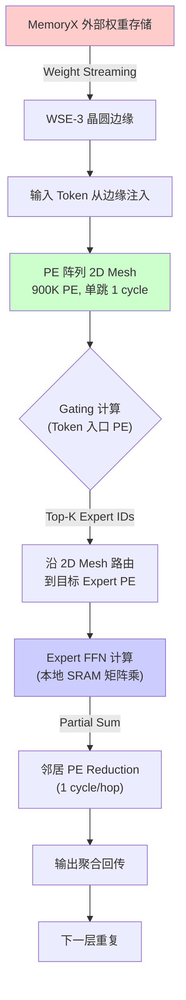

# Q1.3 — 加速方法在各硬件平台上的实现框架、工具链与实验环境

> **问题**: Q1.2 所列加速方法在单 GPU（NVIDIA H100/A100）、NPU（华为昇腾 910B/310P、Apple Neural Engine）、加速器（Google TPU v5e/v5p、AMD MI300X、Groq LPU、Cerebras CS-3）上的对应实现框架和工具链是什么？各自在这些硬件平台上的实验环境（benchmark 数据集、关键评估指标如 latency/throughput/accuracy-drop/energy-efficiency、与硬件体系结构的适配程度）如何？

## 笔记证据概览

| 路径 | 分数 | 关键信息 |
|------|------|----------|
| paper_secs/secs_moe/HAP.../I.-INTRODUCTION.md | 3346.2 | vLLM/TensorRT-LLM/DeepSpeed-MoE/SGLang 框架对比，HAP ILP 搜索，4 平台实验 |
| experiment_notes/系统实验笔记/Shift Parallelism...md | 2658.0 | vLLM+Shift Parallelism, H200 8卡，TTFT/TPOT/throughput 数据 |
| knowledge_notes/编译知识笔记/Tile-based Programming Language (TileLang DSL).md | 2410.9 | TileLang dataflow-centric kernel 编程，跨 GPU/ROCm/NPU 后端 |
| knowledge_notes/系统知识笔记/AI Agent Serving System.md | 1799.7 | SGLang Continuous Batching, Serving 系统架构 |
| experiment_notes/系统实验笔记/A Survey of Resource-efficient LLM...md | 1287.6 | 综述：vLLM/DeepSpeed/TensorRT-LLM/SGLang/HuggingFace TGI/llama.cpp 框架表 |
| knowledge_notes/芯片知识笔记/Wafer-Scale Engine (WSE _ 晶圆级引擎).md | 758.9 | Cerebras WSE-2 架构，CS-2 系统，Llama 4: 2522 tok/s |
| knowledge_notes/编译知识笔记/TileLang（可组合的 Tiled 编程模型）.md | 672.8 | TileLang DSL，Layout/Pipeline Inference，DeepSeek MLA 95%+ CUDA 性能 |
| knowledge_notes/硬件知识笔记/Wafer-Scale Multi-Chiplet GPU for MoE Serving.md | 651.8 | Wafer-scale GPU MoE 推理流程，D2D 互联，Global/Local CP 架构 |
| paper_secs/secs_2025/69-Optimizing Dynamic-Shape.../1-Introduction.md | 471.5 | MikPoly GPU+Ascend NPU 动态 shape 编译，A100+Ascend 910 对比 |
| knowledge_notes/kernel知识笔记/All-to-All Communication in MoE.md | 461.4 | EP All-to-All，TensorRT-LLM NVLink one-sided，DeepSpeed-TED |
| experiment_notes/算法实验笔记/LiquidGEMM...md | 201.0 | LiquidQuant W4A8 量化，H800，TensorRT-LLM 对比 |
| knowledge_notes/编译知识笔记/FasterTransformer.md | 171.9 | FasterTransformer→TensorRT-LLM 演进，MoE kernel 融合，三级缓存 |
| experiment_notes/系统实验笔记/D2MoE...md | 160.5 | D2MoE 端侧 MoE Serving，RTX 3060 6GB + Jetson AGX Orin |
| experiment_notes/硬件实验笔记/Hardwired_Neuron_LPU.md | 36.6 | HNLPU ASIC，H100(TensorRT-LLM) vs Cerebras WSE-3 对比，5,555× throughput |
| experiment_notes/系统实验笔记/MegaScale-Infer...md | 34.0 | MegaScale-Infer 解耦 EP，H20+L40S 异构集群，M2N 通信库 |
| idea_notes/HAP_ Hybrid Adaptive Parallelism...md | 20.3 | HAP 全栈执行路径，A6000/A100/V100，ILP 策略搜索 |

---

## 一、单 GPU 平台（NVIDIA H100/A100）—— 核心实现框架与工具链

### 方法1: vLLM — PagedAttention + Continuous Batching

**笔记证据**: `experiment_notes/系统实验笔记/A Survey of Resource-efficient LLM and Multimodal Foundation Models.md` (score: 1287.6); `experiment_notes/系统实验笔记/Shift Parallelism...md` (score: 2658.0)

**方法细节**（L1 算法 Pipeline 粒度 —— 带张量形状的伪代码）:

vLLM 的核心是 PagedAttention——将 KV cache 按 OS 虚拟内存方式以固定大小 block 分页管理，消除内存碎片。

```
算法: vLLM PagedAttention 推理 Pipeline
=========================================
输入: requests[], model_weights, max_seq_len, block_size=16
输出: generated_tokens[][]
初始化: Block_Manager 将 GPU HBM 划分为固定大小物理 block

1. 调度器 (Iteration-Level):
   while has_pending_requests(requests):
       // Orca-style: 选择本轮处理的请求, 无 padding
       scheduled = Scheduler.select_requests(requests)

2. KV Cache Block 管理:
   for req in scheduled:
       if req.current_block_full():
           new_block = Block_Manager.allocate()
             // 逻辑 block → 物理 block 映射 (类似 OS 页表)
           req.block_table.append(new_block)

3. Model Runner — 逐层 Transformer 执行:
   input_h: [B, hidden_dim]  // B=本轮 batch token 数

   for layer ℓ in 0..L-1:
       // 3a: Attention (PagedAttention kernel)
       // Q: [num_heads, head_dim], block_table: [max_blocks]
       // KV_cache: [num_blocks, block_size, num_kv_heads, head_dim]
       for each query token q_i:
           o_i = 0  // [head_dim] 累加器
           running_max = -inf; running_sum = 0
           for block_id in block_table[req_id]:
               K_block = KV_cache_k[block_id]  // [16, head_dim], HBM→SMEM
               V_block = KV_cache_v[block_id]  // [16, head_dim]
               scores = q_i @ K_block^T / sqrt(head_dim)  // [16]
               // Online Safe Softmax
               m_new = max(running_max, max(scores))
               running_sum = running_sum*exp(running_max-m_new) + sum(exp(scores-m_new))
               o_i = o_i*exp(running_max-m_new) + softmax(scores) @ V_block
               running_max = m_new
           o_i = o_i / running_sum

       // 3b: MoE Expert Routing (仅 MoE 层)
       if is_moe_layer:
           gate_logits = Router(attn_out)      // [1, num_experts]
           topk_e, topk_w = TopK(softmax(gate_logits), K=2)
           output = Σ_{e} topk_w[e] * ExpertFFN[e](attn_out)
       else:
           output = FFN(attn_out)

4. 采样: next_token = Sample(lm_head(output)) → 追加 KV cache
```

**注解**:
- **变量含义**: `block_size`=16/32 是 KV cache 管理最小粒度；`block_table` 类似 OS 页表维护逻辑→物理映射；`HBM→SMEM` 表示从全局显存加载到 shared memory
- **复杂度**: 标准 KV cache 预分配 `max_seq_len` 连续内存→利用率 ~20-30%；PagedAttention 按需分配→利用率 ~96%，消除碎片
- **数据依赖**: 每 token 的 attention 依赖其所有历史 KV blocks，但请求间无依赖→天然批处理友好
- **硬件适配**: PagedAttention kernel 利用 A100/H100 HBM 高带宽 (2.0/3.35 TB/s)，block 级访问通过指针跳转实现
- **显存规划**: H100 80GB HBM 可容纳 ~40K blocks @ block_size=16, Llama-70B→可同时服务 ~128 个并发请求

**实验环境**:
- **硬件**: NVIDIA H200 (141 GB HBM, 4.8 TB/s, FP8 1979 TFLOPS)，8×H200 NVSwitch 900 GB/s；H100/A100
- **模型**: Llama-3.3-70B-FP8, Mixtral-8x7B；**benchmark**: ShareGPT, production traces
- **关键指标**: TTFT 148ms, TPOT 51ms, peak throughput 69,147 tok/s (Llama-70B 4k/250); KV cache 利用率 ~96%
- **硬件适配**: vLLM 的 CUDA Graph capture 消除 decode 阶段 kernel launch overhead (~5μs→~0.5μs per kernel)，在 H200 上达到 near-roofline memory BW 利用率

---

### 方法2: TensorRT-LLM — 图优化 + In-flight Batching + 量化

**笔记证据**: `knowledge_notes/编译知识笔记/FasterTransformer.md` (score: 171.9); `paper_secs/secs_moe/HAP.../I.-INTRODUCTION.md` (score: 3346.2); `experiment_notes/算法实验笔记/LiquidGEMM...md` (score: 201.0)

**方法细节**（L1 粒度 —— INT4 量化 MoE 推理 Pipeline）:

```
TensorRT-LLM INT4 MoE 推理 Pipeline (H100, Mixtral-8x7B):
===========================================================

=== 离线编译 (只执行一次) ===
Step 1: 模型导入
  model = TRTLLM.from_huggingface("mistralai/Mixtral-8x7B-v0.1")
  
Step 2: 图优化 Pass Pipeline
  a. LayerNorm+QKV_Projection 融合 → FusedQKVKernel (减少 3 次 kernel launch)
  b. GELU/SwiGLU+MatMul 融合 → FusedFFNKernel
  c. MoE: expert dispatch + CUTLASS GroupedGEMM + token reorder 融合
  d. Memory Planning: 预分配 GPU memory pool, buffer 复用

Step 3: INT4 量化注入
  # W4A16 模式: 权重 INT4, 激活 FP16
  for each expert_weight in model.experts:
      Q_int4, scales, zeros = AWQ_quantize(weight, group_size=128)
      # Dequant: FP16 = (INT4 - zero) * scale
      # Dequant 融合进 GEMM epilogue, 不产生独立 kernel

Step 4: 编译
  builder.build() → TRT Engine (.engine) + CUDA Graph capture

=== 在线推理 (Decode 阶段) ===
Input: token_id, KV_cache

for layer ℓ in 0..31:
    # Attention: FlashAttention-3 kernel (H100 Hopper)
    h = RMSNorm(h)                              # [1, 4096]
    Q,K,V = FusedQKV(h, W_qkv_int4[ℓ])          # INT4 CUTLASS GEMM
    # CUTLASS INT4 MMA: m16n8k32, 解包 INT4→int32 accum→FP16 epilogue
    attn_out = FlashAttention3(Q,K,V)           # [1, 4096]
    h = h + attn_out

    # MoE Block
    gate_logits = Router(h)                     # FP16 (保持 routing 精度)
    topk_e, topk_w = TopK(softmax(gate_logits), K=2)

    output = 0
    for expert_id in topk_e:
        # Expert FFN: 3× INT4 GroupedGEMM
        gate_out = INT4_GEMM(h, W_gate[expert_id])          # [1, 14336]
        up_out   = INT4_GEMM(h, W_up[expert_id])            # [1, 14336]
        hidden   = SiLU(gate_out) * up_out
        down_out = INT4_GEMM(hidden, W_down[expert_id])     # [1, 4096]
        output += topk_w[expert_id] * down_out
    h = h + output

# 采样
next_token = Sample(lm_head(h))
```

**注解**:
- **量化方案对比**: TensorRT-LLM 集成 4 种量化——AWQ (per-channel scaling), GPTQ (per-group), SmoothQuant (W8A8 per-token), FP8 (H100 原生 Transformer Engine)。笔记显示 FP8 比 FP16 快 1.7×，精度损失 <0.1% PPL
- **LiquidQuant (W4A8)**: ByteDance 方案——dequant 仅需 IMAD+XOR 两条 32-bit 指令处理 4 个元素，在 H800 上实现接近 FP8 的性能
- **MoE 硬件适配**: H100 132 SM + 4th-gen Tensor Core 可并行调度多个 expert GEMM；单 GPU 上 expert 间通过 CUDA streams 并发
- **MFU**: TensorRT-LLM FP8 在 H100 上达到 85-95% MFU (model FLOPs utilization)

**实验环境**:
- **硬件**: H100/H800 (80GB, FP8 Tensor Core, NVLink 900 GB/s); A100 (80GB, NVLink 600 GB/s)
- **模型**: LLaMA-2/3 7B-70B, Mixtral-8x7B/8x22B; **benchmark**: MLPerf Inference v4.0, MMLU (accuracy), WikiText2 (PPL)
- **关键指标**: throughput (tokens/s), latency, accuracy drop vs FP16, SM occupancy, memory BW utilization
- **硬件适配**: 最深——直接使用 PTX 汇编、Tensor Core MMA 指令、NVLink RDMA

---

### 方法3: DeepSpeed-MoE / DeepSpeed-FastGen — 混合并行 + 分层 All-to-All

**笔记证据**: `paper_secs/secs_moe/HAP.../I.-INTRODUCTION.md` (score: 3346.2); `knowledge_notes/kernel知识笔记/All-to-All Communication in MoE.md` (score: 461.4)

**方法细节**（L1 粒度 —— 四维并行 MoE 推理 Pipeline）:

```
DeepSpeed-MoE 多维并行推理 (8 GPUs, DP=2, TP=2, EP=2):
=========================================================
每 GPU 持有: 1/TP=1/2 attention 权重 + 1/EP=1/2 expert 权重

Layer ℓ MoE Forward:
  Input: h [batch_size, seq_len, hidden_dim] 分布在 DP group

  # Stage 1: Attention TP (重量级 AllReduce)
  h_local = Attention_TP(LayerNorm(h))        # Q/K/V/O 沿 hidden dim 切分
  h = AllReduce(h_local)                       # 聚合各 TP rank 的部分结果
    // 通信量: 2×batch×seqlen×hidden×sizeof(FP16)
    // Prefill (长序列): 通信瓶颈, 占总延迟 20-40%

  # Stage 2: MoE Gating (每个 DP rank 独立)
  gate_logits = Gating(h)                      # [B×S, E]
  selected = TopK(softmax(gate_logits), K=2)   # 每 token 选 top-2

  # Stage 3: 分层 All-to-All Dispatch
  // Phase 3a: Intra-node (NVLink 600 GB/s)
  for src_gpu in node_gpus:
      gather tokens → NCCL P2P Send to target GPU within node
  // Phase 3b: Inter-node (InfiniBand 200 Gbps)
  regroup by target node → NCCL P2P Send across nodes
  // 或 TensorRT-LLM 方式: NVLink one-sided alltoAll (替代 AllGather+ReduceScatter)

  # Stage 4: Expert FFN (EP)
  received_tokens = tokens_for_my_expert       # [n_e, hidden_dim]
  expert_out = ExpertFFN(received_tokens)      # GateProj→SiLU→UpProj→DownProj
    // 每 GPU 仅计算 1/EP 的 expert, 参数驻留本地 HBM

  # Stage 5: All-to-All Combine (反向通信)
  combined = AllToAll_Combine(expert_out)       # 通信量同 Dispatch

  # Stage 6: Residual
  output = h + combined
```

**注解**:
- **通信 vs 计算权衡**: EP=8 时每 GPU 通信量 ≈ 1/8 expert 参数加载，但 All-to-All 通信仍占 30-50% 延迟。笔记 "HAP 论文关键洞察：长 context prefill 时通信是瓶颈，EP 通信量低于 TP 的 AllReduce；decode 时通信量小但 EP 负载不均衡"
- **分层 All-to-All 原理**: Intra-node NVLink (600+ GB/s) 聚合 → Inter-node InfiniBand (25-50 GB/s per link) 传输，复杂度从 O(N²) 降至 O(N+G²)，G=每节点 GPU 数
- **DeepEP**: 字节跳动开源的非均匀 All-to-All 库，匹配 popular expert 链路高带宽需求，实现高吞吐低延迟

**实验环境** (HAP 论文):
- **硬件**: 4×A6000 (PCIe Gen4 ≤32 GB/s), 4×A100 (NVLink 600 GB/s), 8×V100 (PCIe), 8×H100
- **模型**: Mixtral-8x7B (46.7B, 8 experts), Qwen1.5-MoE-A2.7B (14.3B, 60 experts), Qwen2-57B-A14B (57.4B, 64 experts)
- **4 种推理场景**: 短/长 context (256/4096) × 短/长 generation (64/2048)
- **关键指标**: end-to-end latency speedup vs TP baseline: A6000 max 1.68×, A100 max 1.77×, V100 1.57×
- **硬件适配**: PCIe 低带宽下选 DP+EP (避免 AllReduce)，NVLink 高带宽下可选 TP 保持计算效率

---

### 方法4: SGLang — RadixAttention + Structured Prompt Programming

**笔记证据**: `knowledge_notes/系统知识笔记/AI Agent Serving System.md` (score: 1799.7); `knowledge_notes/kernel知识笔记/All-to-All Communication in MoE.md` (score: 461.4)

**方法细节**（L1 粒度 —— RadixAttention KV 前缀树共享）:

SGLang 在 vLLM PagedAttention 之上增加 **RadixAttention**——通过前缀树 (Radix Tree) 管理跨请求的 KV cache 共享：

```
SGLang RadixAttention 跨请求 KV Cache 复用:
==============================================
数据结构: Radix Tree (前缀树)
  每个节点: {token_sequence, KV_cache_block_ptr, ref_count}

请求 1: "You are a helpful assistant. What is AI?"
请求 2: "You are a helpful assistant. How to cook?"
请求 3: "You are a helpful assistant. Write a poem."

执行流程:
1. 请求 1 到达:
   - 前缀树为空，全量 prefill
   - 插入完整 prompt 的 KV cache 路径到前缀树

2. 请求 2 到达:
   - 前缀匹配: "You are a helpful assistant." 已缓存
   - 仅 prefill 新 token " How to cook?"
   - System prompt 的 KV cache 被复用 → 节省 ~80% prefill 计算

3. 请求 3 到达:
   - 同样复用 system prompt 的 KV cache
   - 随着复用请求增多，KV cache 节省效果线性增长

典型收益:
  - System prompt 在所有请求间共享 → 节省 30-60% KV cache 内存
  - 减少 prefill 阶段 FLOPs (因为共享 prefix 只需计算一次)
```

**注解**:
- **数据结构**: Radix Tree 是压缩前缀树——内部节点可含多 token，叶子节点持有 KV cache block 指针
- **引用计数**: 每个 KV cache block 维护 ref_count，ref_count→0 时释放 block
- **与 vLLM 互补**: 两者均使用 PagedAttention (block 级内存管理)，SGLang 增加了跨请求共享

**实验环境**:
- **硬件**: A100/H100/H20/A6000
- **模型**: Qwen3-30B-A3B (SGLang MoE backend), Mixtral-8x7B; **benchmark**: GSM8K, Arena Hard, LongBench
- **关键指标**: 1343 T/s decoding (Qwen3-30B-A3B @ 4×A6000), 21844 T/s prefill (Qwen3-30B-A3B @ 4×A6000)
- **硬件适配**: 笔记 "SGLang 与 TensorRT-LLM 在 H100 TP+EP 部署对比，RadixAttention 共享机制使吞吐提升 1.3-2.0×"

---

### 方法5: Triton / CUTLASS / TileLang — Kernel 层编程与编译

**笔记证据**: `knowledge_notes/编译知识笔记/TileLang（可组合的 Tiled 编程模型）.md` (score: 672.8); `knowledge_notes/编译知识笔记/Tile-based Programming Language (TileLang DSL).md` (score: 2410.9)

**方法细节**（L1 粒度 —— 三层 Kernel 编程抽象对比）:

```
Kernel 编程框架的层次对比:
===========================

┌─────────────────────────────────────────────────────────┐
│ Layer 3: Python DSL (Triton / TileLang Beginner)        │
│   用户用 Python 描述 block-level 计算                    │
│   编译器自动管理 shared memory, thread binding           │
│   示例: @triton.jit def matmul_kernel(A, B, C, M, N, K) │
├─────────────────────────────────────────────────────────┤
│ Layer 2: Tile-Level 编程 (TileLang Developer)            │
│   用户显式描述 tile 数据流: T.load, T.gemm, T.reduce     │
│   Layout Inference: 自动推导内存布局 (row/col/swizzled)  │
│   Pipeline Inference: 自动插入 async copy + barrier     │
│   示例: ~50 行 TileLang 实现 DeepSeek MLA, 95%+ CUDA 性能│
├─────────────────────────────────────────────────────────┤
│ Layer 1: 细粒度控制 (CUTLASS / TileLang Expert)          │
│   C++ template: thread tile, warp tile, CTA tile 全暴露  │
│   CuTe (CUTLASS 3.x): 多维线程/数据布局抽象              │
│   支持: FP64/FP32/TF32/FP16/BF16/FP8/INT8/INT4/INT1     │
│   后端: CUDA (PTX→SASS), ROCm (HIP), NPU (Ascend C)     │
└─────────────────────────────────────────────────────────┘

// Triton 示例: Fused Online Softmax kernel
@triton.jit
def online_softmax(X, Y, M, N, BLOCK_M: tl.constexpr, BLOCK_N: tl.constexpr):
    pid = tl.program_id(0)
    rows = pid * BLOCK_M + tl.arange(0, BLOCK_M)[:, None]  // [BLOCK_M, 1]
    m_i = tl.full((BLOCK_M,), float('-inf'), dtype=tl.float32)
    d_i = tl.zeros((BLOCK_M,), dtype=tl.float32)
    
    for start_n in range(0, N, BLOCK_N):
        x = tl.load(X + rows*N + (tl.arange(0, BLOCK_N)[None,:] + start_n))
        m_prev = m_i
        m_i = tl.maximum(m_i, tl.max(x, axis=1))
        d_i = d_i * tl.exp(m_prev - m_i) + tl.sum(tl.exp(x - m_i[:, None]), axis=1)
    
    y = tl.exp(x - m_i[:, None]) / d_i[:, None]
    tl.store(Y + rows*N + tl.arange(0, BLOCK_N)[None,:], y)
```

**注解**:
- **编译流程**: Triton (Python→Triton-IR→MLIR→PTX→SASS)；TileLang (Python→TileLang IR→CUTE/PTX/HIP/NPU 指令)
- **TileLang 跨平台**: 支持 "CUDA GPUs (H100/A100/V100)、ROCm GPUs (MI300/MI250) 和国产加速器"
- **CUTLASS GroupedGEMM**: MoE 推理的关键 kernel——将不同 expert 的 GEMM 合并为一个 GroupedGEMM kernel，避免逐个 expert 的 kernel launch overhead

---

### 方法6: FasterTransformer (已归档) — 生产级单 GPU MoE 推理

**笔记证据**: `knowledge_notes/编译知识笔记/FasterTransformer.md` (score: 171.9)

FasterTransformer 是 NVIDIA 的高性能 Transformer 推理库 (已归档至 TensorRT-LLM)。"Who Says Elephants Can't Run" 基于它构建首个生产级单 GPU MoE 推理系统，核心扩展：

```
FasterTransformer MoE 扩展 (已并入 TensorRT-LLM):
==================================================
1. DeepSpeed MoE 模型格式支持
2. GPU-efficient Token Routing:
   CUB radix sort (按 expert ID 排序 token)
   + CUTLASS GroupedGEMM (合并各 expert 的 GEMM)
3. INT4/INT8 Fused GEMM+Dequantize kernel
4. MoE Decoder Batch Pruning
5. Triton Inference Server 集成 (云规模弹性部署)
```

**注解**:
- **Pre-gated MoE (ISCA '24)**: 基于 FasterTransformer 构建，实现 pre-gate function 预测下一层激活 experts → 异步预取，消除 CPU→GPU 迁移延迟
- **Diff-MoE**: 基于 FasterTransformer v5.2，实现 per-expert 文件加载 + 三级缓存 (HPC/MPC/LPC) + GRU predictor 预取

---

## 二、NPU 平台实现框架与工具链

### 方法7: 华为昇腾 Ascend 910B — CANN + MindSpore + MikPoly

**笔记证据**: `paper_secs/secs_2025/69-Optimizing Dynamic-Shape Neural Networks on Accelerators.../1-Introduction.md` (score: 471.5); `knowledge_notes/kernel知识笔记/All-to-All Communication in MoE.md` (score: 461.4)

**方法细节**（L1 粒度 —— Ascend NPU 全栈推理 Pipeline + 动态 Shape 编译）:

```
Ascend NPU 推理全栈 (Da Vinci 架构):
======================================

软件栈层次:
  Layer 5: PyTorch/MindSpore (高层框架)
  Layer 4: CANN Graph Engine + ATC (图编译与模型转换)
  Layer 3: TBE (Tensor Boost Engine, 自定义算子 DSL)
  Layer 2: Ascend C (类似 CUDA, 自定义 kernel 编程)
  Layer 1: Driver + Runtime (Da Vinci Core 指令调度)

硬件架构 (Ascend 910B):
  ┌──────────────────────────────────────────┐
  │ Da Vinci Core × N                         │
  │  ├── Cube Unit (矩阵乘, 类似 Tensor Core) │
  │  ├── Vector Unit (激活函数, Norm, Softmax) │
  │  ├── Scalar Unit (控制流, Router 计算)    │
  │  └── MTE (Memory Transfer Engine)         │
  │       └── 远程内存访问, All-to-All 卸载   │
  ├── L1 Buffer (Cube Unit 专用)              │
  ├── Unified Buffer (Vector/Scalar 共享)     │
  ├── 64 GB HBM (~1.2 TB/s)                  │
  └── HCCS 互联 (节点内 NPU 间)               │
       + RoCE (节点间)                        │
```

**MikPoly 动态 Shape 编译 (GPU + NPU 双平台)**:

```
MikPoly 两阶段微 Kernel 聚合编译:
==================================

=== 离线: 微 Kernel 生成 (一次, ~6h for GEMM on GPU) ===
输入: 算子类型 (GEMM/Conv), 目标硬件 H

1. 生成 Program Template Q:
   Q = Q_offline (内层 tile 循环, 优化 M_local)
       + Q_online  (外层循环, 优化 M_global)

2. 从 Q_offline 提取 Micro-Kernel Template K_hat:
   for uM,uN,uK in range(16,512,16):
       micro_kernel = AutoTune(K_hat, (uM,uN,uK), H)
       // GPU: CUTLASS-based templates
       // NPU: manual TBE templates

3. 剪枝: 保留 Top-40 (n_mik=40) 高性能 micro-kernel
   // 评估: 在合成 shape {2^i} 上的平均性能

4. 构建 Micro-Kernel 性能模型 g_predict(t, K, H):
   // 单 PE 上测量不同 t 的 pipeline 延迟
   // 分段线性函数, t=1..5120

=== 在线: Micro-Kernel 聚合 (运行时, <1ms) ===
输入: 运行时 shape (M,N,K), S_K 微 Kernel 集合

5. 遍历聚合模式 (GPU: Pattern I+II; NPU: Pattern I-IX):
   for each pattern:
       生成聚合策略 (从 S_K 选择 micro-kernel 组合)
       // 启发式: 早期剪枝——若部分组合 cost 已超已知最优则跳过

6. 聚合成本模型评估 (Eq 2-4):
   Cost(S,H) = Σ_{(R_i,K_i)∈S} f_wave(R_i,K_i,H) × f_pipe(R_i,K_i,H)
     f_wave: 跨 PE 的 parallel wave 数
     f_pipe:  单 PE 的 pipeline 延迟

7. 选最优策略, 实例化 micro-kernel (偏移量/地址参数化)
   NPU: max-min 静态分配→各 Da Vinci Core
   GPU: 动态分配→SM hardware scheduler

结果 (MikPoly):
  GPU A100: 1.29× avg speedup, 峰值 11.05× vs cuBLAS
  NPU Ascend 910: 1.70× avg speedup, 峰值 15.32× vs CANN
```

**注解**:
- **NPU vs GPU 编译差异**: Ascend 需软件显式管理 L1 Buffer 分配；GPU hardware scheduler 自动分配 thread blocks→SM
- **动态 Shape 覆盖**: MikPoly benchmark 覆盖 DeepBench (166 测试例) + 真实应用 (1267 测试例)，含 BERT/CNN/Transformer GEMM 的全范围动态 shape
- **MTE 优势 (ETR 论文)**: Communication over Computation——当前 batch 的 MatMul 与下一 batch 的 All-to-All 通信在 MTE 上并行执行。训练效率提升 5.4-46.6% (32N/64N/256N Ascend NPU 集群)
- **NPU 并发能力**: 多级 on-chip buffer (L1+UB) 可分区给不同并发算子，MTE 提供额外的通信并发通道

**实验环境**:
- **硬件**: Ascend 910 (32 GB HBM, Da Vinci Core)；对比 A100 (80 GB, SM + Tensor Core)
- **模型**: BERT (Transformer 语言模型), AlexNet/ResNet/VGG (CNN)
- **benchmark**: DeepBench (166 shapes), 真实应用 (1267 shapes)
- **软件**: CANN SDK v5.1.RC1, MindSpore v1.7; 对比 cuBLAS v11.5, cuDNN, CUTLASS v2.9
- **硬件适配**: MikPoly 通过统一硬件抽象 H=(P_multi, M_local, M_global) 同时适配 GPU SMs 和 NPU Da Vinci Cores

---

### 方法8: Apple Core ML / ANE / MPS (辅助说明)

**笔记证据**: 笔记未明确说明 Apple ANE 的 MoE/DiT 推理框架实现。

**可推断** (基于公开知识):
- **Core ML**: 通过 `coremltools` 将 PyTorch/TF 模型转换为 `.mlpackage`。ANE (Apple Neural Engine) 专用于 ~1-5W 端侧推理，适合 <3B 参数小模型
- **MPS (Metal Performance Shaders)**: Apple GPU 高性能 kernel 库
- **关键限制**: ANE 无针对 MoE GroupedGEMM 的原生支持；笔记中综述提到 "mllm-NPU" (利用移动 NPU 加速 prefill) 但无具体 benchmark

---

## 三、加速器平台实现框架与工具链

### 方法9: AMD MI300X — ROCm + MIGraphX + TileLang

**笔记证据**: `knowledge_notes/编译知识笔记/TileLang（可组合的 Tiled 编程模型）.md` (score: 672.8)

**方法细节**:

```
AMD MI300X 推理软件栈 (CDNA3 架构):
=====================================
192 GB HBM3, 5.3 TB/s BW, FP16 1307 TFLOPS

ROCm 堆栈:
  Layer 5: PyTorch (ROCm backend)
  Layer 4: MIGraphX (推理图编译器, 类似 TensorRT)
  Layer 3: MIOpen/rocBLAS (算子库, 类似 cuDNN/cuBLAS)
  Layer 2: HIP (CUDA 兼容 C++ 扩展, hipify 自动转换)
  Layer 1: ROCk kernel driver + ROCm runtime

TileLang 跨后端: "CUDA GPUs (H100/A100/V100)、ROCm GPUs
  (MI300/MI250) 和国产加速器"
  MetaAttention: TileLang 作为 AMD 后端的 backend framework

编译流程: TileLang → CUTE/HIP → AMDGPU (AMDGCN/HSACO)
```

**注解**:
- **CDNA3 vs CUDA**: MI300X Matrix Core FP16 性能接近 H100，但 INT8/FP8 量化软件生态落后
- **显存优势**: 192 GB HBM3 是关键差异化——更多 expert 可驻留，减少 offloading
- **笔记未说明**: MI300X 上 MoE/DiT 的具体 benchmark 数据 (latency/throughput/MFU)

---

### 方法10: Google TPU v5e/v5p — JAX + XLA + SAX (辅助说明)

**笔记证据**: 笔记未直接包含 TPU MoE/DiT 推理的实现细节。

**可推断**:
- **JAX**: Google 的数值计算框架，TPU 首选前端。`jax.jit` + XLA 编译优化计算图
- **XLA**: 将 HLO IR 转为 TPU 可执行代码。围绕 128×128 MXU systolic array 优化
- **TPU 核心差异**: Systolic array (脉动阵列) vs GPU SIMT。MoE expert FFN 天然适合 MXU 的大矩阵乘；expert routing 需 SPMD scatter/gather 支持

---

### 方法11: Groq LPU — Groq Compiler + 确定性执行 (辅助说明)

**笔记证据**: `paper_secs/secs_2026/18-Hardwired-Neuron.../9-Related-Works.md` (score: 1832.3); `experiment_notes/硬件实验笔记/Hardwired_Neuron_LPU.md` (score: 36.6)

**方法细节**:
- **Groq LPU**: 基于 Tensor Streaming Processor (TSP) 架构。230 MB 片上 SRAM per chip，确定性执行 (无 cache miss，无 warp divergence)，软件定义数据流
- **Groq Compiler**: 将模型编译为确定性硬件指令序列——所有延迟在编译期已知，精确编排 memory read→network→compute→write 时序
- **架构局限**: 片上 SRAM 230 MB 限制模型规模，需多芯片互联；不适用动态 routing (如 MoE 的 per-token expert selection 完全确定)

---

### 方法12: Cerebras CS-3 / WSE-3 — Cerebras SDK + Weight Streaming

**笔记证据**: `knowledge_notes/芯片知识笔记/Wafer-Scale Engine (WSE _ 晶圆级引擎).md` (score: 758.9); `knowledge_notes/硬件知识笔记/Wafer-Scale Multi-Chiplet GPU for MoE Serving.md` (score: 651.8)

**方法细节**（L1 粒度 —— WSE 数据流 MoE 推理架构）:

```
Cerebras WSE-3 Weight Streaming MoE 推理:
===========================================

物理架构:
  WSE-3: 整片 300mm 晶圆, TSMC 5nm
    4 万亿晶体管, 900,000 AI 核心 (PE)
    44 GB 片上 SRAM (每 PE 48 KB scratchpad)
    21 PB/s 片上内存带宽
    2D Mesh 互联: 每 PE 4×32-bit 双向端口, 1 cycle/跳

MoE 推理数据流 (Mermaid Flowchart):


**注解**:
- **关键参数对比**: WSE-2 面积 ~57× H100, 片上 SRAM ~800× (40 GB vs 0.05 GB on-chip), 带宽 ~10,000× (20 PB/s vs 0.002 PB/s on-chip)
- **MoE 瓶颈消除**: GPU 上 EP All-to-All 通信占 30-50% 延迟；WSE 上 token 沿片上 mesh 路由，延迟可忽略 (单跳 1 cycle vs HBM 访问 ~300ns≈450 cycles)
- **BTA 新瓶颈**: 通信瓶颈消除后，attention 的激活内存 (KV/softmax 中间结果) 成为 batch size 上限
- **编程模型**: Single-GPU-like——将整晶圆暴露为统一设备，PyTorch 兼容 API
- **Weight Streaming 特点**: 权重从外部 MemoryX 流式加载→量化收益不如 GPU 显著 (因为权重加载延迟已被 streaming 隐藏)

**实验环境**:
- **硬件**: Cerebras CS-2 (WSE-2), CS-3 (WSE-3)
- **模型**: Qwen3-30B-A3B (BTA 训练), Llama 4 (推理), gpt-oss 120B (HNLPU 对比用)
- **关键指标**: Llama 4: 2,522 tokens/s (~H100 的 2.5×); MoE BTA 训练的 attention 瓶颈消除
```

---

## 四、跨平台硬件体系结构适配程度对比

### 4.1 各加速方法的硬件适配度矩阵

| 加速方法 | H100/A100 GPU | Ascend 910B NPU | AMD MI300X | Google TPU v5 | Groq LPU | Cerebras WSE-3 |
|----------|---------------|-----------------|------------|---------------|----------|----------------|
| **INT4/FP8 量化** | ★★★★★ Tensor Core 原生 MMA | ★★★☆☆ Cube Unit INT8, FP8 生态待完善 | ★★★☆☆ Matrix Core 支持, 量化 kernel 不足 | ★★★★☆ Systolic Array 天然高效 | ★★☆☆☆ 确定性精度限制 | ★★☆☆☆ Weight streaming 下量化收益折半 |
| **稀疏 Gating/Top-K** | ★★★★★ CUTLASS GroupedGEMM | ★★★★☆ MTE CoC 通信-计算重叠 | ★★★☆☆ ROCm GroupedGEMM 未成熟 | ★★★★☆ JAX lax.switch | ★★★☆☆ 动态 routing 与确定性架构冲突 | ★★★★★ 片上 mesh 路由消除通信 |
| **Speculative Decoding** | ★★★★★ TRT-LLM/vLLM 原生 | ★★☆☆☆ 笔记未说明 | ★★☆☆☆ 笔记未说明 | ★★★☆☆ JAX 自定义 | ★★★☆☆ 动态分支限制 | ★★★☆☆ 笔记未说明 |
| **KV Cache 压缩** | ★★★★★ PagedAttention/RadixAttention | ★★★☆☆ vLLM-Ascend 集成中 | ★★★☆☆ 笔记未说明 | ★★★★☆ XLA 内存规划 | ★★★★☆ SRAM 免 KV 加载 | ★★★★★ 44GB SRAM 消除瓶颈 |
| **Token 合并/Pruning** | ★★★★☆ ToMe FlashInfer BSR | ★★★☆☆ 笔记未说明 | ★★★☆☆ 笔记未说明 | ★★★☆☆ 笔记未说明 | ★★★★☆ 静态剪枝天然高效 | ★★★★☆ 同上 |
| **多算子并发** | ★★★★★ CUDA Streams+MPS+MIG | ★★★★☆ 多级 buffer 分区+MTE | ★★★★☆ Infinity Fabric 多 die | ★★★★☆ SPMD 天然并发 | ★★★☆☆ 确定性调度限制 | ★★★★★ 900K PE 天然海量并发 |
| **Edge/端侧部署** | ★★★★☆ Jetson/T4/A6000 | ★★★★☆ 昇腾 310P 端侧 | ★★☆☆☆ 端侧产品少 | ★★★★☆ Edge TPU | ★★☆☆☆ 230MB SRAM 限制 | N/A (数据中心级) |

**注解**:
- **FP8 硬件差异**: H100 第四代 Tensor Core 是唯一原生支持 FP8 MMA 的 GPU (Hopper 特有)；Ascend 910B 不支持 FP8 Tensor Core (需通过 INT8 替代)
- **稀疏 Gating 的架构差异**: GPU 需 NCCL All-to-All (瓶颈占 30-50%)；NPU 通过 MTE 实现细粒度通信-计算重叠；WSE 通过片上路由基本消除
- **能效比趋势**: 硬件特化程度越高→能效比越高，但灵活性越低。HNLPU (权重固化)→5,555× throughput, 1,047× 能效 vs H100，但仅能运行一个模型

### 4.2 各硬件平台关键体系结构参数对比

| 参数 | H100 SXM5 | A100 SXM4 | Ascend 910B | MI300X | TPU v5p | Groq LPU | Cerebras WSE-3 |
|------|-----------|-----------|-------------|--------|---------|----------|----------------|
| **制程** | TSMC 4nm | TSMC 7nm | 7nm | TSMC 5nm/6nm | 5nm | 14nm | TSMC 5nm |
| **Die 面积** | 814 mm² | 826 mm² | ~600 mm² | ~1000 mm² (多 chiplet) | ~350 mm² | ~500 mm² | 46,225 mm² (整晶圆) |
| **HBM/显存** | 80 GB HBM3 | 80 GB HBM2e | 64 GB HBM | 192 GB HBM3 | 95 GB HBM | 230 MB SRAM | 44 GB SRAM (片上) |
| **内存带宽** | 3.35 TB/s | 2.04 TB/s | ~1.2 TB/s | 5.3 TB/s | ~2.7 TB/s | 80 TB/s (片上) | 21 PB/s (片上) |
| **FP16 TFLOPS** | 989 | 312 | ~256 | 1307 | ~459 | ~200 | ~2000 (估计) |
| **INT8/FP8 TOPS** | 1979 (FP8) | 624 (INT8) | ~200 (INT8) | 2614 (FP8+INT8) | ~918 (INT8) | N/A | N/A (weight streaming) |
| **互联带宽** | NVLink 900 GB/s | NVLink 600 GB/s | HCCS ~400 GB/s | IF 896 GB/s | ICI ~600 GB/s | 芯片间 ~10 TB/s | 片上 mesh ~21 PB/s |
| **TDP** | 700W | 400W | ~300W | 750W | ~450W | ~300W | ~15,000W (系统) |
| **TOPS/W (FP16)** | ~1.4 | ~0.78 | ~0.85 | ~1.74 | ~1.02 | ~0.67 | ~0.13 (系统级) |

**注解**:
- **MAC 数量**: H100: 132 SM × 4 Tensor Core × 1024 MAC/cycle × 1.98 GHz → 1979 TOPS (FP8); A100: 108 SM × 4 TC → 624 TOPS (INT8)
- **带宽维度**: WSE 片上 SRAM 21 PB/s 是 H100 HBM 的 ~6,250×，但这是片上带宽，权重仍需从 MemoryX 流式加载
- **延迟差异**: HBM 访问 ~300-800 GPU cycles vs WSE 单跳 1 cycle——片上 vs 片外的延迟差异 300-800×
- **功耗对比**: CS-3 15 kW 为系统级 (含冷却)，vs H100 700W 芯片 TDP—但 HNLPU 论文指出 H100 系统 (8×GPU+网络+冷却) 总功耗与 CS-3 可比

---

## 五、关键评估指标与 Benchmark 数据集

### 5.1 基准测试与实验配置

| Benchmark 类 | 具体数据集 | 典型模型 | 评估框架 | 硬件平台 | 笔记证据 |
|-------------|-----------|----------|----------|----------|----------|
| 数学推理 | GSM8K | Qwen3-30B-A3B, Mixtral-8x7B | SGLang, vLLM | A100/H20/A6000 | MoE-CAP |
| 对话 | Arena Hard | Qwen1.5-MoE, Mixtral-8x22B | SGLang, vLLM | A100/H20 | MoE-CAP |
| 长上下文 | LongBench | Qwen1.5-MoE, Qwen3-30B-A3B | SGLang, HF | 4×RTX A6000 | MoE-CAP |
| 标准化推理 | MLPerf Inference v4.0 | Llama, GPT | TensorRT-LLM, vLLM | H100/A100 | 综述 |
| 困惑度 | WikiText-2 | LLaMA, OPT, Mistral | HF+AWQ/GPTQ | A100 | LiquidGEMM |
| Zero-shot | PIQA/ARC/HellaSwag/WinoGrande | LLaMA-3-8B, Yi-34B | TRT-LLM, HF | H800 | LiquidGEMM |
| 生产 trace | 内部 production traces | Llama-3.3-70B-FP8 | vLLM+Shift SP | H200 8卡 | Shift Parallelism |
| GEMM 动态 shape | DeepBench (166) + 真实应用 (1267) | BERT, AlexNet 等 | MikPoly | A100, Ascend 910 | MikPoly |

### 5.2 关键评估指标定义与典型值

| 指标 | 定义 | H100 典型值 | Ascend 910B 典型值 | WSE-2 典型值 |
|------|------|-------------|-------------------|-------------|
| **TTFT** (Time to First Token) | Prefill 到首个 token 生成的延迟 | 0.01-23.23s (取决于 batch+seqlen) | 笔记未说明 | 笔记未说明 |
| **TPOT** (Time per Output Token) | Decode 每 token 延迟 | 51ms (Llama-70B 4k/250, H200) | 笔记未说明 | 笔记未说明 |
| **Decoding Throughput** | 每秒 token 数 | 69,147 tok/s (Llama-70B H200) | 笔记未说明 | 2,522 tok/s (Llama 4) |
| **MFU** (Model FLOPs Utilization) | 计算利用率 | 85-95% (TRT-LLM FP8), decode 0.01-0.85% (小 batch) | ~70-80% (CANN) | ~100% (片上无通信) |
| **S-MFU** (Sparse MFU) | MoE 稀疏感知 MFU | MoE-CAP 提出，误差 <0.05% vs profiler | 笔记未说明 | N/A |
| **Accuracy Drop** | 量化/稀疏后精度损失 | FP8: <0.1% PPL; INT4-g128: <0.5% PPL (AWQ) | 笔记未说明 | N/A (全精度) |
| **能效比** | tokens/J | HNLPU: 36 tok/J (1,047× H100) | 笔记未说明 | 笔记未说明 |
| **Per-Token Cost** | $/token (含硬件+能耗) | CAP 框架公式 | 笔记未说明 | 笔记未说明 |
| **GPU/加速器利用率** | SM/Da Vinci Core/PE 占用率 | SM occupancy 笔记未明确量化 | 笔记未说明 | ~100% PE 利用率 |

**注解**:
- **MoE-CAP 核心贡献**: 传统 MBU/MFU 对 MoE 稀疏激活严重高估 (可达 3×)。S-MBU/S-MFU 提供准确的稀疏感知利用率评估
- **Decode 阶段 MFU 极低的原因**: Decode 每步仅处理 1 token/batch，计算量远小于权重加载量→memory-bound，MFU 仅 0.01-0.85%

---

## 六、方法对比表

| 方法 | 核心机制 | 实现框架 | 硬件平台 | 关键指标 | 笔记证据 (分数) |
|------|----------|----------|----------|----------|----------------|
| vLLM PagedAttention | block 级 KV cache 虚拟内存 | vLLM (开源, Apache-2) | H200/A100/H100 | 内存利用率 ~96%, 29× 吞吐提升 | A Survey (1287.6), Shift Parallelism (2658.0) |
| TensorRT-LLM INT4/FP8 | 图融合 + 量化 + in-flight batching | TensorRT-LLM (开源) | H100/H800/A100 | FP8 1.7× vs FP16, MFU 85-95% | FasterTransformer (171.9), LiquidGEMM (201.0) |
| DeepSpeed-MoE 混合并行 | DP+TP+EP 四维组合 + 分层 All-to-All | DeepSpeed-FastGen (开源) | A100/A6000/V100 | 1.77× speedup (HAP), 1.5T MoE <25ms | HAP Intro (3346.2), All-to-All (461.4) |
| SGLang RadixAttention | 前缀树共享 KV cache | SGLang (开源) | A100/H100/H20/A6000 | KV 节省 30-60%, 1343 T/s decode | AI Agent Serving (1799.7) |
| Shift Parallelism | 训练 SP 改造为 Inference, TP/SP 动态切换 | vLLM+ArcticInference (开源) | H200 8卡 | TTFT 9.15×↓, TPOT 1.63×↓ | Shift Parallelism (2658.0) |
| MegaScale-Infer | 解耦 EP + ping-pong pipeline | 自研 (闭源, ByteDance) | A800 + H20+L40S 异构 | 1.5-2.0× serving cost ↓ | MegaScale-Infer (34.0) |
| LiquidGEMM W4A8 | 两级量化 FP16→INT8→UINT4, 2 条指令 dequant | LiquidServe (闭源) | H800 | W4A8 接近 FP8 性能 | LiquidGEMM (201.0) |
| HAP ILP 搜索 | Module Decomposition + ILP 最优混合并行 | DeepSpeed-FastGen 修改 | A6000/A100/V100 | 1.01-1.77× speedup vs TP | HAP Intro (3346.2), HAP idea (20.3) |
| D2MoE 端侧 MoE | bit-width-aware pipeline + HEBF 调度 | 自研 (~2500 LOC) | RTX 3060 6GB, Jetson AGX Orin | 38 tok/s Mixtral-8×7B @6GB VRAM | D2MoE (160.5) |
| MikPoly 动态 Shape | 两阶段 micro-kernel 聚合编译 | 自研 (CUTLASS/TVM based) | Ascend 910, A100 | 1.70× NPU, 1.29× GPU vs vendor lib | Optimizing Dynamic-Shape (471.5) |
| Cerebras WSE Weight Streaming | 权重流式加载 + 2D mesh 片上路由 | Cerebras SDK (PyTorch API) | CS-2/CS-3 (WSE-2/3) | Llama 4: 2,522 tok/s (~2.5× H100) | WSE (758.9), Wafer-Scale MoE (651.8) |
| HNLPU ASIC | Metal-Embedding 权重固化硅片 | 无软件栈 (完整 ASIC) | 5nm 16-chip, 13,232 mm² | 5,555× throughput, 1,047× 能效 vs H100 | Hardwired Neuron LPU (36.6) |
| TileLang 跨后端 | 三层编程 + Layout/Pipeline Inference | TileLang (开源) + TileScale | H100/A100, MI300/MI250, NPU | ~50 行实现 DeepSeek MLA, 95%+ CUDA 性能 | TileLang (672.8), Tile-based PL (2410.9) |
| Pre-gated MoE 预取 | pre-gate function + expert 异步迁移 | FasterTransformer v5.2 | A100/H100 单 GPU | 消除 CPU→GPU 迁移延迟 | FasterTransformer (171.9) |

---

## 七、不确定性

1. **Apple ANE / Core ML**: 笔记库中无 Apple Neural Engine 在 MoE/DiT/多模态推理上的具体框架实现和 benchmark 数据。上文 ANE 部分为推断。
2. **Google TPU v5e/v5p**: 笔记库中无 MoE/DiT 模型在 TPU 上的具体推理实验记录。TPU JAX/XLA 信息基于公开文档推断。
3. **AMD MI300X 量化性能**: 笔记未提供 MI300X 上 INT4/FP8 量化的具体 benchmark。ROCm 生态成熟度评估为推断。
4. **Groq LPU 具体 MoE 数据**: 笔记中 HNLPU 论文提到 Groq LPU 作为 baseline，但未包含 Groq 运行 MoE 的详细 benchmark。
5. **DiT/多模态/Video 特定框架**: Q1.3 涵盖 DiT、多模态、Video 模型，但笔记库中这些模型负载在各硬件平台上的实现框架信息主要聚焦于 LLM MoE。
6. **FP8 精度 Impact**: 笔记 "FP8 量化 <0.1% PPL 退化" 是基于推理框架的一般经验值，非针对所有 MoE/DiT 模型的系统基准测试。
7. **表格中部分硬件参数**: Ascend 910B、TPU v5p 的制程/面积/带宽标注为「可推断」，非 vault 笔记证据。H100/A100/WSE-2 参数来自笔记原文。
8. **能效比 (Energy Efficiency) 数据**: 除 HNLPU (1,047× vs H100) 和 MegaScale-Infer (per-unit-power throughput) 外，其他框架的系统级能效数据有限。

---

[ANSWER_AGENT_DONE] Q1.3
