# Q1.6 — 面向硬件体系结构的多算子并发优化：算法层面设计空间与最佳实践

## 笔记证据概览

| 路径 | 分数 | 关键信息 |
|------|------|----------|
| paper_secs/.../StreamTensor/1.1-Dataflow-Architecture.md | 5208.6 | Dataflow 架构的 Kernel/FIFO/Token 抽象，systolic array + SIMD 混合计算 |
| knowledge_notes/.../Systolic-array Accelerator (for VLM Inference).md | 3882.9 | Weight stationary dataflow 32×32 PE array，GEMM tiling 执行流程 |
| paper_secs/.../FlashFuser.../span-idpage-7-0...md | 3228.3 | FlashFuser DSM-based fusion 实验配置与对比 |
| paper_secs/.../SambaNova/Streaming-Dataflow-enables-Pipelining...md | 358.1 | Streaming dataflow 空间融合：PCU/PMU/AGCU 组件，自动算子融合 |
| experiment_notes/.../FlashFuser_...Inter-Core-Conn.md | 656.5 | DSM-based cluster-level loop scheduling, tile selection, resource mapping |
| idea_notes/Comet Fine-grained...Overlapping...md | 1008.6 | Shared tensor decomposition + tile reordering + thread block specialization |
| experiment_notes/.../Comet...Overlapping...md | 978.9 | Fine-grained fused MoE kernel: 86.5% communication hidden |
| idea_notes/Welder Scheduling...via Tile-graph.md | 939.5 | Tile-graph 抽象：Propagate/SetConnect，inter-layer independence |
| paper_secs/.../SCAR- Scheduling...Multi-Chiplet...md | 2159.0 | Heterogeneous dataflow MCM scheduling，inter-chiplet pipelining |
| knowledge_notes/.../Hardware-Aware Balance Planning.md | 271.3 | PROBE greedy planning solver：T_window 约束下的 expert 复制决策 |
| experiment_notes/.../Mirage Persistent Kernel...md | 243.4 | In-kernel parallel runtime：SM partitioning, cross-task pipelining, paged SMEM |
| idea_notes/Nimble_...GPU Task Scheduling.md | 967.6 | AoT CUDA Graph scheduling + multi-stream DAG 并行化 |
| experiment_notes/.../Lancet...Whole-Graph...Overlapping.md | 1158.1 | Whole-graph computation-communication partitioning + pipeline scheduling |
| paper_secs/.../Meta_s_Second_Generation_AI_Chip...md | 920.3 | MTIA 2 NPU vs GPU SIMT 对比，model-chip co-design |
| idea_notes/ParallelKittens...Multi-GPU-AI-Kernels.md | 300.5 | LCSC 编程模板：Intra-SM / Inter-SM overlapping 两种调度策略 |
| knowledge_notes/.../Focus Unit.md | 311.7 | SEC/SIC streaming 子模块嵌入 systolic array memory interface |

---

## 一、算子排布与调度策略（主内容）

### 方法1: AoT Whole-Graph Capture + Multi-Stream 并行调度 (Nimble)

**笔记证据**: `idea_notes/Nimble_ Lightweight and Parallel GPU Task Scheduling for Deep Learning.md` (score: 967.6)

**是什么？**
Nimble 将深度学习执行的调度从 "runtime per-operator dispatch" 转变为 "ahead-of-time whole-graph capture + replay"。通过 CUDA Graph API 预录制全部 GPU kernel calls，并在 DAG 上运行 Ford-Fulkerson 最大匹配算法自动发现可并行执行的算子，分配到多个 CUDA stream 并发执行。

**方法细节**（L1 算法 Pipeline 粒度 — 伪代码）：

```
算法: Nimble AoT Scheduling + Multi-Stream Execution
输入: DNN 模型 M (静态计算图), dummy input X_dummy
输出: CUDA Graph G (含多 stream 拓扑和同步点)

===== 阶段 1: AoT Graph Capture =====
1. 用 X_dummy 预运行 M 一次
2. 通过 CUDA Stream Capture API 拦截所有 GPU kernel calls:
   - 记录每个 kernel 的 launch parameters (grid/block dims, SMEM)
   - 记录 kernel arguments (tensor pointers, shapes, strides)
   - 记录 submission order 和 CUDA stream assignment
   - 记录所有 cudaMalloc/cudaFree 调用
3. 生成完整 CUDA Graph G_raw

===== 阶段 2: Multi-Stream DAG 并行化 =====
4. 从 G_raw 提取算子级 DAG D = (V, E)
   - V: 算子节点 (每个节点 = 一个 GPU kernel)
   - E: 数据依赖边 (u→v 表示 v 消费 u 的输出)
5. 计算 Minimum Equivalent Graph (MEG):
   - 消除 D 中的冗余传递边 (若 u→v→w 且 u→w, 则删除 u→w)
   - MEG 保留了完整的逻辑并发信息
6. 构建 Bipartite Graph B:
   - B 的节点 = MEG 中的边
   - B 的边 = 共享端点的 MEG 边对
7. Ford-Fulkerson 最大匹配算法在 B 上:
   - 每种 matching 代表一组无依赖、可并行执行的算子
8. Stream 分配:
   - 按 matching 结果将算子分配到不同 CUDA stream
   - 最小化跨 stream 同步: 仅在 DAG 原始依赖位置插入 CUDA event
9. 将 stream assignment 注入 G_raw → 生成最终 CUDA Graph G

===== 阶段 3: Runtime Replay =====
10. 推理时: cudaGraphLaunch(G) → GPU 自主执行全部 kernel
    - 无 CPU mediation (无 operator dispatch/shape inference/kernel selection overhead)
    - 多 stream 并发执行: GPU SM 持续工作
```

**注解**:
- **变量含义**: `D = (V,E)` 是算子级 DAG，`MEG` 是消除冗余传递边后的最小等价图。`B` 的 bipartite 结构将 "可并行性" 编码为 matching 问题。
- **复杂度分析**: MEG 计算 O(|V|+|E|)，Ford-Fulkerson O(|V|·|E|)。AoT preparation 一次性开销约 0.35s，在所有后续推理中摊销。
- **数据依赖**: Stream 分配尊重原始 DAG 的数据依赖——仅在无依赖的算子间引入并行。
- **并发可行性**: NASNet-A 的 DAG 中最大逻辑并发度达 15。Multi-stream 自身贡献 up to 1.88× speedup。整体 vs PyTorch inference up to 22.34× speedup。

**硬件适配性**: Nimble 对 GPU SIMT 架构友好——利用 CUDA Graph 消除了 CPU→GPU dispatch 延迟（通常 ~100µs per kernel），同时多 stream 将 DAG 的逻辑并发转化为 GPU 物理并行。但对 NPU/TPU（无 CUDA Graph 等效 API）不直接适用。

### 方法2: SM 分区 + In-Kernel Parallel Runtime (MPK)

**笔记证据**: `experiment_notes/kernel实验笔记/Mirage Persistent Kernel_ A Compiler and Runtime for Mega-Kernelizing Tensor Programs.md` (score: 243.4)

**是什么？**
MPK 将 GPU 的全部 SM 物理划分为 workers 和 schedulers，在单个 mega-kernel 内部实现完整的 event-driven 并行运行时系统——替代传统的 "kernel-per-operator" 执行模型。

**方法细节**（L1 算法 Pipeline 粒度 — 伪代码）：

```
算法: MPK In-Kernel Parallel Runtime
硬件: H100, 132 SMs → 128 Workers + 4 Schedulers (16 warps)

===== SM 分区（编译期确定） =====
Scheduler_SMs = {0, 1, 2, 3}        // 每个含 4 个 warp (共 16 个 scheduler warp)
Worker_SMs = {4, 5, ..., 131}        // 每个 SM 1 个 worker
每个 Worker SM 维护: task_queue (device memory circular buffer)
每个 Scheduler SM 维护: event_queue (device memory circular buffer)

===== Event-Driven Execution Loop =====
从 start event e0 开始:

while (有未完成任务):
  // --- Scheduler 端 ---
  for each scheduler warp w ∈ {0..15}:
    e = event_queue.dequeue()           // atomicAdd 出队
    tasks = tGraph.get_tasks(e)
    for task in tasks:
      if JIT_mode:
        worker = select_least_loaded_worker()
        worker.task_queue.enqueue(task)
      else:  // AOT_mode: task 已预分配到 worker

  // --- Worker 端 ---
  for each worker SM:
    task = dequeue() or check_AOT_queue()
    if task == null: continue

    // Cross-task software pipelining:
    Phase 1 (pre-load):
      acquire_smem_pages(pages_needed)   // 申请 32KB pages
      TMA_async_copy(global_src, smem_dst)  // 异步，不阻塞 compute
    Phase 2 (compute):
      wait_TMA_complete()
      execute_kernel_body(task)          // Tensor Core MMA / CUDA Core SIMT
      // 期间: 预取下一 task 描述符 (352 bytes)
    Phase 3 (complete):
      notify_event(task.output_event)
      release_smem_pages(task.pages)
```

**注解**:
- **变量含义**: `tGraph` 是编译期生成的 task 依赖图。JIT 模式需 2 次同步（assign + complete），AOT 仅需 1 次但缺乏动态负载均衡。
- **复杂度分析**: Worker-Scheduler 通信通过 device memory semaphores（atomicAdd/atomicCAS）。Cross-task pipelining 消除 pipeline bubble，1.2-1.3× speedup (B200)。
- **并发可行性**: Kernel-per-operator 理论下限 ~10ms（纯粹模型参数加载时间），MPK 达到 12.5ms（仅比下限高 ~25%）。

**硬件适配性**: MPK 深度依赖 Hopper 架构特性——TMA 异步 copy、DSM、SMEM pages。对非 NVIDIA GPU 平台（NPU/TPU）需重新实现 in-kernel runtime 概念。

---

## 二、计算与通信 Overlap 的算法设计（主内容）

### 方法1: Fine-Grained Fused MoE Kernel with Tile-Level Overlap (Comet)

**笔记证据**: `idea_notes/Comet Fine-grained Computation-communication Overlapping for Mixture-of-Experts.md` (score: 1008.6), `experiment_notes/kernel实验笔记/Comet Fine-grained Computation-communication Overlapping for Mixture-of-Experts.md` (score: 978.9)

**是什么？**
Comet 解决 MoE 中通信（token 粒度）和计算（tile 粒度，128×128）之间的粒度不匹配。通过 Shared Tensor Decomposition + Tile Reordering + Thread Block Specialization 将 overlap 从 coarse-grained chunk 级升级为 fine-grained tile 级。

**方法细节**（L1 算法 Pipeline 粒度 — 伪代码）：

```
算法: Comet Fine-Grained MoE Fused Kernel
输入: tokens [M, N], routing_map, expert_weights
输出: expert_output [M, N]
硬件: H800 GPU (132 SMs), NVSHMEM

===== Layer0: Communication → Computation Pipeline =====

Step 1: Shared Tensor 沿 M 维度分解
  shared_tensor = dispatch_buffer   // shape [M×topk, N]
  分解为 M×topk 行 (token 粒度)
  tokens 按 source_rank 排序:
    local_tokens  → 聚集在前 (立即可用)
    remote_tokens → 聚集在后 (需 NVSHMEM 拉取)

Step 2: GroupGEMM Tile 计算顺序重调度
  Tile 分类:
    T_local:  仅含 local tokens → 优先级最高 (零等待)
    T_mixed:  含部分 remote tokens → 中等优先级
    T_remote: 仅含 remote tokens → 最后计算
  // 在计算 T_local 的同时: 通信 TB 正在 NVSHMEM 拉取 remote tokens
  // 在计算 T_mixed 的同时: 更多 remote tokens 持续到达

Step 3: Thread Block Specialization (SM 分配)
  通信 TB (n^c 个): NVSHMEM get token-by-token
  计算 TB (n^p 个): CUTLASS GroupGEMM (TMA + MMA)
  // n^c/n^p 比例由 Adaptive Assignment metadata 决定
  // 两套 TB 由 GPU hardware scheduler 并发调度，互不干扰

===== Layer1: Computation → Communication Pipeline =====

Step 4: Shared Tensor 沿 N 维度分解
  shared_tensor = GEMM_output_buffer
  分解为 N/T^N 个列块 (T^N = tile N 维度)

Step 5: Column-Wise GEMM + 通信重叠
  for col_block in [0, N/T^N):
    所有 expert 并行计算第 col_block 列块
    // T^N 列完成后: 立即 top-K reduce + NVSHMEM write
    // 不等所有列完成！reduce+通信 与 后续列 GEMM 完全重叠
```

**注解**:
- **变量含义**: `T^N` 是沿 hidden dim 的 tile 大小（典型值 128）。`n^c/n^p` 离线 profile 决定——小 M 时 n^c 小，大 M 时 n^c 增大到 26-46。
- **复杂度分析**: Tile reordering 仅需一次排序 O(M log M)。TB specialization 的关键是将通信和计算隔离到不同 TB——GEMM TB 使用标准 CUTLASS Hopper 实现（TMA + MMA），通信 TB 独立执行 NVSHMEM I/O。
- **数据依赖**: 关键洞察——单 token 是最小通信单元，但 GEMM tile (128×128) 需 128 tokens 数据。Coarse-grained pipeline 必须等整个 chunk 到齐；Comet 的 tile reordering 使 local-only tile 立即开始。
- **并发可行性**: Hide 86.5% communication（FasterMoE 29.2%, Tutel 68.6%）。单层 1.96× speedup vs Megatron-Cutlass。小 M 时 speedup 更高（2.37×），因为 kernel 内调度消除了 host 端 kernel launch 开销。

### 方法2: Whole-Graph Stage Pipeline (Lancet)

**笔记证据**: `experiment_notes/kernel实验笔记/Lancet_ Accelerating Mixture-of-Experts Training via Whole Graph Computation-Communication Overlappi.md` (score: 1158.1)

**是什么？**
Lancet 将 MoE 训练的前向/反向传播整体视为一个计算-通信图，沿 batch 维度划分为多个 partition，构造跨 partition 的 stage pipeline。

**方法细节**（L1 算法 Pipeline 粒度 — 伪代码）：

```
算法: Lancet Whole-Graph Partition + Pipeline Scheduling
输入: MoE 模型训练图, partition 数 P
输出: Pipeline schedule (每个算子的 start_time)

Step 1: 图分区 (沿 batch 维度)
  batch 划分为 P 个 partition
  每个 partition_i 含:
    Non-MoE Compute_i:  Attention_i → Router_i
    All-to-All_i:       dispatch_i → combine_i
    Expert_i:           Expert_FFN_i
    Post_i:             后续 Normalization

Step 2: 阶段 Pipeline
  Stage 0 (Compute):  [NMC_0, NMC_1, ..., NMC_{P-1}]
  Stage 1 (Comm):     [A2A_0, A2A_1, ..., A2A_{P-1}]
  Stage 2 (Compute):  [Expert_0, Expert_1, ..., Expert_{P-1}]
  Stage 3 (Compute):  [Post_0, Post_1, ..., Post_{P-1}]

Step 3: Pipeline Scheduler 启动时间计算
  start(NMC_i)    = max(end(NMC_{i-1}), end(Post_{i-1}_prev_layer))
  start(A2A_i)    = max(end(NMC_i), end(A2A_{i-1}))
  start(Expert_i) = max(end(A2A_i), end(Expert_{i-1}))

Step 4: 重叠 Timeline (P=3)
  NMC:     [0]   [1]   [2]
  A2A:           [0]   [1]   [2]    ← A2A_0 与 NMC_1 重叠
  Expert:              [0]   [1]   [2]  ← Expert_0 与 A2A_1 重叠
  Post:                      [0]   [1]   [2]
```

**注解**: Lancet 与 Comet 的对比——Lancet 是 coarse-grained partition 级 pipeline（非 tile 级），但通过 whole-graph 视角将 Attention、Router、All-to-All、Expert FFN 全部纳入统一 pipeline，overlap 覆盖率更高。Comet 更适合单 GPU 单请求场景（kernel 内调度），Lancet 更适合多 GPU 训练场景（跨 partition pipeline）。

---

## 三、算法层面的 Memory Planning（主内容）

### 方法1: Tile-Graph 抽象与 Memory Traffic 优化 (Welder)

**笔记证据**: `idea_notes/Welder Scheduling Deep Learning Memory Access via Tile-graph.md` (score: 939.5)

**是什么？**
Welder 将 DNN 的 memory 优化从 "为每对算子设计融合规则" 转变为 "在 tile-graph 上搜索最优 tile 连接配置"。通过 tile propagation 自动对齐不同算子间的 tile shape，在 shared memory 中复用中间数据。

**方法细节**（L1 算法 Pipeline 粒度 — 伪代码）：

```
算法: Welder Tile-Graph Memory Optimization
输入: DNN 计算图 G = (V, E)（operator 级）
输出: 优化后的分层 tile-graph 执行计划

===== 阶段 1: Tile-Graph 构造 =====
1. 将每个 operator v ∈ V 分解为 operator-tile 集合:
   每个 operator-tile 处理一个 output data tile [BM, BN]

2. 建立 tile 级连接:
   SetConnect(v_a.tile_i → v_b.tile_j, memory_level)
   // memory_level ∈ {L0(register), L1(shared memory), L2(global memory)}

===== 阶段 2: Tile Propagation（自动对齐 tile shape）=====
3. 从 output tile shape 反向推导整个 graph:
   for each edge (v_a → v_b):
     output_tile = v_b.input_tile_shape
     input_tile  = v_a.Propagate(output_tile)
     // 基于 tensor expression 自动计算
   // 关键性质: output tile shape 唯一确定所有 input tile shape
   // → 相邻 operator 的 tile 自动对齐，无需手工规则

===== 阶段 3: Traffic Cost Model ====="
4. memory_traffic = Σ (input_tile_sizes + output_tile_size) × num_tiles
   // Inter-layer independence: 每层 traffic 仅由该层 output tile 配置决定

5. 两层搜索:
   外层 — Graph Connecting: 枚举每条 edge 的连接层 (L0/L1/L2)
   内层 — Sub-Graph Tiling: 基于 traffic cost model 搜索最优 tile 配置

6. 容量约束: MemFootprint(tile_config) ≤ memory_level_capacity
   // SMEM: 227KB/SM on H100

===== 阶段 4: 代码生成 =====
7. 四指令模板: LoadTiles → ComputeTile → StoreTiles
   映射到任意有层级 memory 的加速器 (CUDA/ROCm/GraphCore)
```

**注解**:
- **变量含义**: `BM/BN` 是 output tile 的 batch/channel 维度。`SetConnect` 在两个 operator-tile 之间建立连接。`Propagate` 从 output tile 反向推导 input tile。
- **复杂度分析**: Inter-layer independence 将耦合的多层优化解耦为独立子问题——搜索空间从指数级降为线性级。
- **数据依赖**: Tile propagation 的数学基础——给定 Matmul O[i,j]=Σ_k A[i,k]×B[k,j]，output tile [i₀:i₁, j₀:j₁] 唯一确定 input tile: A 需 [i₀:i₁, :], B 需 [:, j₀:j₁]。
- **并发可行性**: 89 种非常规 fusion pattern 自动发现，含 48-operator fusion chain。BERT attention global memory traffic 节省 69%（840MB→264MB）。NeRF 7-layer MLP 全融合为单 kernel（5× speedup）。

### 方法2: Paged Shared-Memory Abstraction (MPK) (辅助说明)

**笔记证据**: `experiment_notes/kernel实验笔记/Mirage Persistent Kernel_ A Compiler and Runtime for Mega-Kernelizing Tensor Programs.md` (score: 243.4)

MPK 将 shared memory 分为固定大小 pages（32KB），task 按需 acquire/release。编译期通过区间图着色将无重叠生命周期的 tensor 映射到同一 page。H100 上每 SM 7 pages，A100 上 5 pages。Cross-task pipelining 允许在当前 task compute 期间预取下一 task 的数据到空闲 pages。

### 方法3: Hardware-Aware Balance Planning (PROBE) (辅助说明)

**笔记证据**: `knowledge_notes/系统知识笔记/Hardware-Aware Balance Planning（硬件感知均衡规划）.md` (score: 271.3)

PROBE 的 Greedy Planning Solver 将 expert 复制决策限制在 T_window 内——每个 rank 上非通信 kernel 的执行时间窗口。T_window^r 按设备计算-带宽比动态确定（高算力低带宽设备→小窗口→限制复制数量），最多 kmax=16 轮迭代。

---

## 四、融合算子/复合算子的算法设计（主内容）

### 方法1: DSM-Based Cluster-Level Kernel Fusion (FlashFuser)

**笔记证据**: `experiment_notes/kernel实验笔记/FlashFuser_ Expanding the Scale of Kernel Fusion for Compute-Intensive Operators via Inter-Core Conn.md` (score: 656.5)

**是什么？**
FlashFuser 突破单 SM shared memory 容量限制（H100: 227KB/SM），利用 Hopper 架构的 Distributed Shared Memory (DSM) 实现跨 SM 的 kernel fusion。中间 tensor 驻留 DSM（跨 SM 可见），无需 spill to HBM。

**方法细节**（L1 算法 Pipeline 粒度 — 伪代码）：

```
算法: FlashFuser DSM-Based Kernel Fusion
硬件: H100 GPU, DSM bandwidth/cluster: 2 SM: ~8TB/s, 16 SM: ~4TB/s

===== 编译期搜索 =====
1. 算子链统一 Loop 维度建模:
   X = {x_0, x_1, ..., x_{J-1}}  // 共依赖 loop 维度
   每个 x_j: Spatial (多 SM 并行) | Temporal (单 SM 串行)
   组合数: 最多 41 种

2. Loop Schedule 影响中间 tensor 大小:
   MNLK order: 需存储完整 C tensor → 可能 > 227KB → spill to DSM
   MLNK order: 每次迭代仅 partial E → 可驻留 SMEM

3. 两级 Hierarchical Tiling + Resource Mapping:
   Cluster-level tile → 影响 inter-block data exchange
   Block-level tile  → 影响 reg vs SMEM 分配
   贪心: reusable tensor reg→SMEM→DSM→HBM 逐级放置

4. Cost Model + Selection:
   D_V = data movement volume per memory level
   Cost C = max(V_l / B_l)  // 最慢 memory level 决定延迟
   Pruning → ~1.15×10^6 候选 → Top-11 profiling → 选最优

===== 运行时 DSM Primitives =====
5. dsm_all_exchange: cluster 内 AllReduce/Mul
   (TMA + mbarrier, cluster 内所有 Block 获得完整 C tile)

6. dsm_shuffle: ring communication 交换 C tile
   (Shuffle Group 内旋转 C tile slices)

7. dsm_reduce_scatter: hierarchical two-level reduction
   (intra-cluster + inter-cluster via TMA cp.reduce.async.bulk)

===== Gated FFN 策略 =====
Spatial Partitioning (cls_k=2):
  不同 Block group 执行两个 GEMM branch → max 并行度
Sequential within Block:
  同一 Block 串行 → min DSM communication
```

**注解**:
- **变量含义**: `X = {x_0,...,x_{J-1}}` 是算子链的统一 loop 维度集合。`V_l` 是在 memory level l 的数据传输量，`B_l` 是该 level 的带宽。
- **复杂度分析**: 41 种 schedule × tile size 枚举 × resource mapping → ~1.15×10^6 候选。DSM latency ~20ns (cluster=2) vs HBM ~280ns。
- **并发可行性**: vs Chimera 4.1× speedup，vs PyTorch 3.1×。Global memory access 减少 58%。SGLang E2E 平均 1.24× speedup。

### 方法2: Streaming Dataflow 硬件原生融合 (SambaNova SN40L)

**笔记证据**: `paper_secs/secs_2025/8-SambaNova_SN40L_Scaling_the_AI_Memory_Wall_with_Dataflow_and_Composition_of_Experts/Streaming-Dataflow-enables-Pipelining-and-Automatic-Fusion-with-Arbitrary-Access-Patterns.md` (score: 358.1)

**是什么？**
SN40L 通过 streaming dataflow 在硬件层面实现算子融合——算子以 coarse-grained pipeline 方式执行，tensor 被 tiled 并通过 PCU chain streamed，中间结果永远不物化到 off-chip memory。

**方法细节**（L1 算法 Pipeline 粒度 — 计算流程）：

```
SN40L Spatial Fusion: Gated FFN (Gemm0 → Mul → Gemm1)

硬件映射:
  PCU 0,1 (Systolic):  Gemm0 (W @ X)
  PMU I00,I01:         Gemm0 输出缓冲 (匹配输入带宽)
  PCU 2 (SIMD):        Mul (SiLU gating)
  PMU S0-S3:           Mul 输出缓冲 (容量拆分到 4 PMUs)
  PMU T00-T03:         Transpose (access pattern 优化)
  PMU T10-T13:         Transpose 输出缓冲
  PCU 3,4 (Systolic):  Gemm1 (投影)

数据流路径:
  Input → [I00,I01] → Gemm0 → [W00,W01] → Mul → [S0-S3]
       → [T00-T03] → Transpose (PMU access pattern)
       → [T10-T13] → Gemm1 → Output

Transpose 实现 (PMU 内):
  写入: diagonal striped format across scratchpad banks
  读取: normal + transposed 均以 full bandwidth
  // 将 Transpose 算子从计算操作降维为 memory access pattern
```

**注解**:
- **变量含义**: PCU (Pattern Compute Unit) 可配置为 systolic array 或 SIMD pipeline。PMU (Pattern Memory Unit) 提供可编程 scratchpad 存储。
- **硬件参数**: 1040 PCUs + 1040 PMUs，520MB SRAM，638 BF16 TFLOPs，2 dies (5nm, <650mm²)。
- **并发可行性**: 无 kernel launch overhead——中间结果在 PMU scratchpad 中流式传递。编译器 PnR 自动将算子图映射到 PCU/PMU 阵列。

---

## 五、不同硬件平台的并发模式偏好差异（主内容）

**笔记证据**: `paper_secs/.../StreamTensor/1.1-Dataflow-Architecture.md` (score: 5208.6), `knowledge_notes/.../Systolic-array Accelerator.md` (score: 3882.9), `paper_secs/.../Meta_s_Second_Generation_AI_Chip...md` (score: 920.3)

```mermaid
flowchart TD
    subgraph GPU_SIMT["GPU SIMT (NVIDIA H100)"]
        A1["HBM (80GB, 3.35TB/s)"] --> A2["L2 Cache (50MB)"]
        A2 --> A3["L1/SMEM (227KB/SM)"]
        A3 --> A4["Register File (256KB/SM)"]
        A4 --> A5["Tensor Core (WGMMA, 989 TFLOPS)"]
        A4 --> A6["CUDA Core (SIMT, 60 TFLOPS)"]
        A5 --> A7["Accumulator (FP32)"]
        A7 --> A3
    end

    subgraph NPU_SA["NPU Systolic Array (Ascend 910B)"]
        B1["HBM (64GB)"] --> B2["Global Buffer"]
        B2 --> B3["Input Buffer (128KB)"]
        B2 --> B4["Weight Buffer (78KB)"]
        B3 --> B5["Systolic Array (32x32 PE, FP16)"]
        B4 --> B5
        B5 --> B6["Output Buffer (512KB)"]
        B6 --> B7["SIMD Vector Engine"]
        B7 --> B8["Activation Unit (SiLU/GELU)"]
        B8 --> B2
    end

    subgraph Dataflow["Dataflow RDU (SambaNova SN40L)"]
        C1["DDR (1.5TB, 200GB/s)"] --> C2["HBM (64GB, 1.8TB/s)"]
        C2 --> C3["PMU SRAM (520MB total)"]
        C3 --> C4["PCU (Systolic/SIMD, 638 TFLOPS)"]
        C4 --> C5["RDN (On-Chip Interconnect)"]
        C5 --> C3
    end
```



**注解**:
- **GPU SIMT**: 132 SMs，每 SM 128KB L1 + 227KB SMEM。Tensor Core 提供 989 TFLOPS (BF16)。动态 warp 调度自动隐藏 memory latency。适合 "多 stream + kernel fusion" 并发模式。
- **NPU SA**: 32×32 PE array，weight stationary dataflow（权重预加载到 PE，inputs/outputs 流经 array）。确定性数据流——零 warp 调度开销。适合 "GEMM systolic + SIMD vector 交替执行" 的算子级并行。
- **Dataflow RDU**: 1040 PCUs + 1040 PMUs。三级存储（SRAM→HBM→DDR）。硬件原生 streaming fusion——适合 "空间 pipeline + 多 expert 并发 hosting" 模式（DDR 存所有 experts，HBM 缓存活跃 expert，SRAM 执行当前计算）。

### 各平台核心并发差异对比表

| 维度 | GPU SIMT (H100) | NPU SA (Ascend 910B) | TPU SA (v5p) | Dataflow RDU (SN40L) |
|------|-----------------|---------------------|--------------|----------------------|
| **计算范式** | Warp-SIMT + Tensor Core | 32×32 Systolic Array | 128×128 Systolic Array | Configurable SA/SIMD |
| **并发粒度** | Thread Block (1024 threads) | PE Array tile (m×32) | PE Array tile (m×128) | PCU-level pipeline stage |
| **存储层次** | HBM→L2→L1/SMEM→Reg | DDR→GlobalBuf→PE Reg | HBM→VPU→MXU | DDR→HBM→PMU SRAM |
| **算子融合** | 编译器 kernel fusion (SMEM 227KB 限制) | 编译器 layer fusion | XLA 自动融合 | 硬件原生 streaming fusion |
| **通信 Overlap 机制** | Multi-stream + NVSHMEM + TB specialization | 专用 DMA 引擎 + AI Core/Vector 交替 | ICI (Inter-Chip Interconnect) | RDN + P2P protocol |
| **最佳并发模式** | Kernel 内 TB specialization (Comet 风格) | 脉动流 + 向量引擎交替执行 | 大规模 systolic 批量 | 空间 streaming pipeline |
| **关键约束** | Kernel launch overhead (~100µs) | PE array 尺寸固定 (32×32) | XLA 编译时间 | 需编译器 PnR 映射 |

**笔记证据**: 此表综合了 `StreamTensor/1.1-Dataflow-Architecture.md` (score: 5208.6)、`Systolic-array Accelerator.md` (score: 3882.9)、`Streaming-Dataflow...md` (score: 358.1)、`Comet...Overlapping.md` (score: 978.9) 等多条笔记。

---

## 方法对比表

| 方法 | 核心机制 | 实现框架 | 硬件平台 | 关键指标 | 笔记证据 |
|------|----------|----------|----------|----------|----------|
| **Nimble** | AoT CUDA Graph + 自动 multi-stream DAG 并行化 | PyTorch + CUDA Graph API | V100/A100/H100 | vs PyTorch up to 22.34×, max concurrency=15 | idea_notes/Nimble (967.6) |
| **MPK (Mirage)** | In-kernel parallel runtime: SM 分区 + event-driven + cross-task pipelining | torch.compile(backend=MPK) | A100/H100/B200 | 12.5ms/token (下限~10ms), 1.2-1.3× speedup | experiment_notes/Mirage (243.4) |
| **Comet** | Shared tensor decomposition + tile reordering + TB specialization | CUTLASS + NVSHMEM + Megatron | H800/L20 | Hide 86.5% comm, 1.96× single-layer, 1.71× E2E | idea_notes/Comet (1008.6), experiment_notes/Comet (978.9) |
| **Lancet** | Whole-graph partition + stage pipeline scheduling | Tutel + NCCL + RAF | A100/V100 多节点 | 通信-计算重叠覆盖率分析 | experiment_notes/Lancet (1158.1) |
| **Welder** | Tile-graph + tile propagation + traffic cost model | ONNX + tile-graph compiler | V100/A100 | DRAM traffic 节省 69%, 89 种 fusion pattern | idea_notes/Welder (939.5) |
| **FlashFuser** | DSM-based cluster-level fusion + dsm_comm primitives | CUTLASS + CUDA 12.4 | H100 SXM | vs Chimera 4.1×, HBM access -58% | experiment_notes/FlashFuser (656.5) |
| **SCAR** | Heterogeneous chiplet scheduling: spatial locality + dataflow matching | Custom scheduler | MCM accelerator (sim) | O(10^56)→sec-level search | paper_secs/SCAR (2159.0) |
| **PROBE** | Hardware-aware greedy planning: T_window + water-filling | NVSHMEM + single-SM kernel | H100/H800 | Planning hidden by MoE compute | knowledge_notes/Hardware-Aware (271.3) |
| **SN40L Streaming** | 硬件原生 streaming dataflow: PCU SA/SIMD + PMU composable mem | SambaFlow compiler | SN40L RDU (5nm) | 520MB SRAM + 64GB HBM + 1.5TB DDR | paper_secs/SambaNova (358.1) |
| **ParallelKittens** | LCSC 模板: Intra-SM / Inter-SM overlapping + 8 通信原语 | ThunderKittens + CUDA | H100 (NVLink) | TMA + warp spec + 预分配缓冲区 | idea_notes/ParallelKittens (300.5) |

---

## 不确定性

1. **NPU/TPU 的具体并发原语细节**：笔记中对华为昇腾 Ascend NPU 和 Google TPU 的算子级并发机制描述有限，主要来自 `Systolic-array Accelerator.md` (score: 3882.9) 和 `Streaming-Dataflow...md` (score: 358.1) 的知识笔记推断。笔记未明确说明 CANN 的算子级并发 API 和 Ascend 910B 的片上网络拓扑细节。
2. **Lancet 在单 GPU 单请求场景的适用性**：Lancet 笔记主要覆盖多 GPU 训练场景的 whole-graph pipeline，在单 GPU 单请求推理场景下的适用性笔记未明确说明，标记为 "可推断"。
3. **FlashFuser DSM capacity 与 cluster size 的精确关系**：笔记显示 DSM bandwidth 随 cluster size 变化但 DSM 总可用容量与 cluster 内 SM 数量的定量关系笔记未明确给出。
4. **不同硬件平台对比的验证**：基于笔记内容跨硬件平台推断最佳实践映射，但部分对比（如 TPU v5p 的具体算子融合策略）笔记未直接验证。

---

[ANSWER_AGENT_DONE] Q1.6-L1
