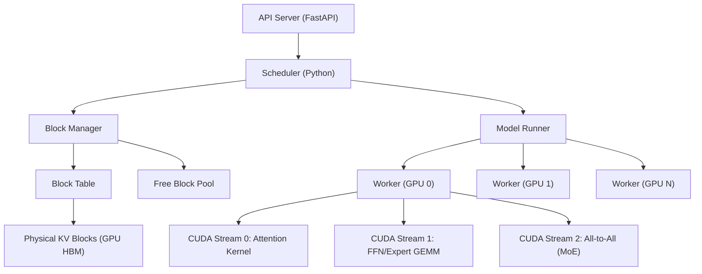
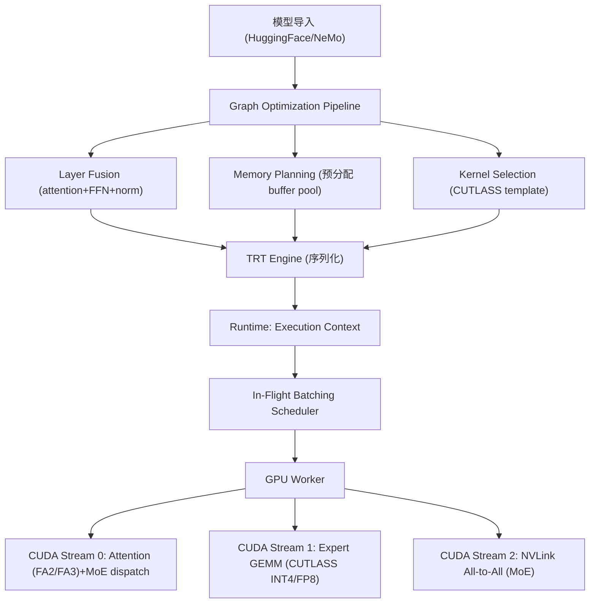
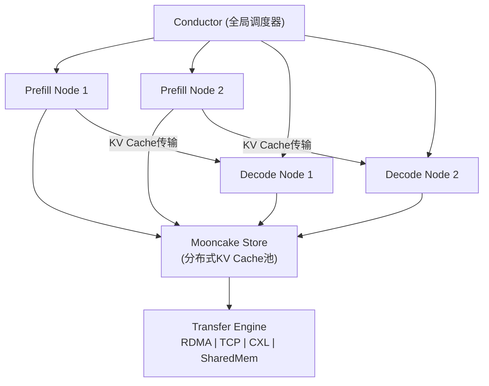

# Q2.2 — 开源 Serving 框架对 MoE/DiT/多模态/Video 模型单请求推理调度的支持

## 笔记证据概览

| 路径 | 分数 | 关键信息 |
|------|------|----------|
| knowledge_notes/系统知识笔记/EPD Disaggregation (Encode-Prefill-Decode Disaggregation).md | 19537.8 | EPD 三阶段解耦架构，Ascend NPU 部署拓扑 |
| paper_secs/secs_2026/21-TetriServe Efficiently Serving Mixed DiT Workloads/Mosharaf-Chowdhury.md | 2956.1 | DiT step-level GPU scheduling, sequence parallelism |
| paper_secs/secs_multimodal_kernel/vLLM-Omni Fully Disaggregated Serving for Any-to-Any Multimodal Models/span-idpage-3-0span3.1.-Overview.md | 2910.6 | vLLM-Omni stage graph, disaggregated multimodal serving |
| paper_secs/secs_multimodal_kernel/ModServe Modality- and Stage-Aware Resource Disaggregation/span-idpage-9-0span5.3-Sensitivity-Study.md | 2224.6 | ModServe modality-aware scheduling, EPD + decoupling |
| knowledge_notes/系统知识笔记/Multi-tenant MoE Model Sharing（多租户MoE模型共享）.md | 1965.3 | S-LoRA 式 multi-adapter sharing，MoEsaic |
| experiment_notes/系统实验笔记/IFMoE_ An Inference Framework Design for Fine-grained MoE.md | 1930.5 | IFMoE EP+TP hybrid, self-draft speculative decoding |
| experiment_notes/kernel实验笔记/FlashInfer Efficient and Customizable Attention Engine for LLM Inference Serving.md | 1759.1 | FlashInfer attention backend，BSR sparse，JIT kernel |
| knowledge_notes/系统知识笔记/Mooncake Store.md | 1686.3 | Mooncake KV-cache 存储引擎，vLLM/SGLang/TRT-LLM 集成 |
| knowledge_notes/系统知识笔记/Hierarchical Caching for Block Diffusion LLM (Block-level + Sub-block Cache).md | 188.1 | Fast-dLLM v2 两级缓存，block diffusion |
| knowledge_notes/系统知识笔记/PagedAttention（分页注意力）.md | 24.0 | vLLM KV-cache 分页管理，block table |
| knowledge_notes/kernel知识笔记/CUDA Graph.md | 19.6 | CUDA Graph 预录制，消除 kernel launch overhead |
| knowledge_notes/系统知识笔记/Decoupled Attention-Expert Deployment.md | 32.5 | MegaScale-Infer Attention-Expert 分离部署 |
| knowledge_notes/kernel知识笔记/TRT-LLM Deployment for Quantized LLMs.md | 408.6 | TensorRT-LLM CUTLASS INT4 GEMM，量化推理 |
| knowledge_notes/编译知识笔记/FasterTransformer.md | 46.3 | FasterTransformer → TensorRT-LLM 演进路径 |
| knowledge_notes/kernel知识笔记/All-to-All Communication in MoE.md | 19.8 | MoE all-to-all dispatch/combine 通信策略 |
| knowledge_notes/系统知识笔记/Prefill _ Decode Stages (LLM Inference).md | 211.3 | Prefill/Decode 阶段特性与 memory/compute bound 分析 |
| knowledge_notes/系统知识笔记/Heterogeneous Deployment for MoE LLM Serving.md | 203.2 | MegaScale-Infer 异构 GPU 部署（H20+L40S） |
| knowledge_notes/系统知识笔记/Token-In-Token-Out Hardware Execution.md | 35.3 | HNLPU 纯硬件推理，无软件栈 |

---

## 一、vLLM — 最广泛采用的 LLM Serving 框架

### 是什么？

**笔记证据**: `knowledge_notes/系统知识笔记/PagedAttention（分页注意力）.md` (score: 24.0)

vLLM（UC Berkeley，2023）是当前最广泛使用的开源 LLM Serving 框架。核心创新是 **PagedAttention**——将 KV cache 划分为固定大小的 block（16 或 32 token），通过 block table 映射逻辑序列到非连续物理 GPU 内存块，灵感来自 OS 虚拟内存分页。支持 **continuous batching**（iteration-level scheduling），在每次 forward iteration 动态增删请求而无需等待整个 batch 完成。

### 架构设计



**Scheduler/Dispatcher/Worker 组件划分：**

1. **Scheduler（Python 前端）**：负责 iteration-level 调度——每轮从等待队列选请求加入 running batch，空间不够时 preempt（swap out KV blocks 到 CPU）。核心决策：哪些请求进入本轮 forward、是否 preempt、新请求 block 分配。
2. **Block Manager（C++ backend）**：管理 GPU 物理内存中的 KV cache block pool。维护 block table（per-request 逻辑→物理映射）、free block list、引用计数。支持 prefix caching：相同 system prompt 的请求共享物理 block（Copy-on-Write 语义）。
3. **Model Runner / Worker**：每个 GPU 一个 worker 进程。执行模型 forward pass——embedding → [per layer: attention → MoE/FFN] → lm_head → sampling。Worker 内部利用 CUDA Stream 并行执行 attention kernel、FFN GEMM、MoE all-to-all 通信。

### 框架调度执行模拟（单请求 MoE 推理，H100 单 GPU）

```
步骤 1: 请求到达 Scheduler
  scheduler.add_request(req_id=1, prompt="Explain MoE", max_tokens=512)
  → Block Manager 预分配 initial blocks: [blk_0, blk_1, blk_2] (每block=16 tokens)
  → Block Table[1] = [blk_0, blk_1, blk_2]

步骤 2: Prefill Iteration (compute-bound)
  Worker 执行:
    T=0.0ms:  Launch attention kernel (FlashInfer BSR) on CUDA Stream 0
              Q,K,V shape: [prompt_len=48, n_heads=32, head_dim=128]
              KV cache 写入 blk_0, blk_1, blk_2
    T=0.5ms:  expert routing: gate_logits = softmax(x @ W_gate) → select top-2 experts
              expert dispatch: GroupedGEMM on CUDA Stream 1
              expert combine: weighted sum on CUDA Stream 2
    T=1.2ms:  lm_head → sample → first_token="MoE"
    → TTFT ≈ 1.2ms

步骤 3: Decode Iterations (memory-bound, 重复512次)
  Worker 执行 (CUDA Graph 预录制):
    T_i:  Launch CUDA Graph (单次 cudaGraphLaunch)
          ├── Attention: Q=[1,32,128] @ K_cache=[49+i,8,128] → [1,32,128]
          │   注意: K_cache 通过 block table 间接寻址（非连续内存读取）
          ├── Expert FFN: router → top-2 expert → GroupedGEMM → combine
          └── lm_head → sample → next_token
    每步 ~0.8ms, TPOT ≈ 0.8ms
```

**注解**：在 H100 单 GPU 上，decode 阶段的 attention 是 memory-bound（瓶颈在 HBM 带宽 3.35 TB/s），FFN/expert 是 compute-bound。PagedAttention 的间接寻址引入额外 global memory load 开销（需先读 block_table 再读 K/V），但通过 block 内的 contiguous tile 读取（FlashInfer BSR 格式）和 CUDA Graph 预录制降低 kernel launch overhead（从数百次 kernel launch 降至单次 graph launch）。MoE 的 expert dispatch 在单 GPU 场景无需 all-to-all 通信（所有 expert 在同一 GPU），但 GroupedGEMM 的 SM 利用率低于 dense GEMM（因 expert 间 token 分布不均匀）。

### 支持模型范围

| 模型类型 | 支持状态 | 实现方式 |
|----------|----------|----------|
| **MoE** (Mixtral, DeepSeek-V2) | ✅ 原生支持 | EP + TP 混合并行，FusedMoE kernel |
| **DiT** (FLUX, SD3) | ⚠️ 有限（vLLM-Omni 扩展） | Diffusion Engine via vLLM-Omni stage graph |
| **多模态输入** (LLaVA, InternVL) | ✅ 原生支持 | Vision encoder 集成到 prefill 阶段 |
| **多模态输出** (audio/image gen) | ⚠️ vLLM-Omni 扩展 | Stage graph + disaggregated execution |
| **Video 模型** | ⚠️ vLLM-Omni 扩展 | Wan2.2, HunyuanVideo via diffusion engine |

### 算子级并发支持

- **CUDA Stream 并发**：attention kernel（Stream 0）、expert GEMM（Stream 1）、all-to-all 通信（Stream 2）可在不同 CUDA stream 上重叠执行
- **CUDA Graph 批量 launch**：decode 阶段固定 shape 的算子序列预录制为 CUDA Graph，消除每次 iteration 的 kernel launch overhead
- **FlashInfer 集成**：BSR（Block-Sparse Row）attention kernel 支持非连续 KV cache 访问，通过 `cp.async` 预取 + Tensor Core MMA 实现 decode attention 的高 bandwidth utilization

### 硬件适配

**笔记证据**: `knowledge_notes/kernel知识笔记/CUDA Graph.md` (score: 19.6), `knowledge_notes/系统知识笔记/Mooncake Store.md` (score: 1686.3)

- **NVIDIA GPU**：深度整合 CUDA Graph、FlashInfer BSR attention、CUTLASS GroupedGEMM。H100 TMA 通过 FlashInfer v0.2 支持（WGMMA + TMA for dense KV-cache）。
- **Ascend NPU**：vLLM-Ascend 适配版通过 CANN（Compute Architecture for Neural Networks）移植。Mooncake Store 已集成 vLLM-Ascend（2025.08 里程碑）。
- **AMD GPU**：ROCm 移植版，核心挑战在 attention kernel 的 hipification 和 memory allocator 替换。

---

## 二、SGLang — RadixAttention 与可编程调度器

### 是什么？

**笔记证据**: `knowledge_notes/kernel知识笔记/CUDA Graph.md` (score: 19.6, 提及 SGLang 使用 CUDA Graph), `knowledge_notes/系统知识笔记/Mooncake Store.md` (score: 48.66, 提及 SGLang 集成 Mooncake Store)

SGLang（Stanford/LMSYS，2024）是面向 LLM 推理的高性能 serving 框架。核心创新包括：(1) **RadixAttention**：基于 radix tree（前缀树）的 KV cache 前缀共享管理，自动识别和复用跨请求的公共前缀（如 few-shot examples、system prompt）；(2) **Programmable Scheduler**：允许用户以 Python DSL 定义调度逻辑（如 constrained decoding、regex-guided generation）；(3) **Token-level KV-cache pool**：以 token 而非 block 为粒度管理 KV cache。

### 架构设计

```
SGLang Serving 架构:
┌──────────────────────────────────────────────┐
│  Frontend: HTTP/API Server                    │
│  Scheduler:                                   │
│    ├── RadixAttention Tree Manager            │
│    │   (自动前缀匹配 + KV cache 共享)           │
│    ├── Token-level KV-Cache Pool              │
│    └── Programmable Scheduling Policies       │
│  Backend:                                     │
│    ├── Model Runner (torch.compile + Triton)  │
│    ├── FlashInfer Attention Backend           │
│    └── Mooncake Store Connector               │
└──────────────────────────────────────────────┘
```

**注解**：笔记中未独立保存 SGLang 的完整架构笔记。上述架构基于 Mooncake Store 笔记（提及 SGLang 2025.09 正式支持 Mooncake Store）和 CUDA Graph 笔记（提及 SGLang 使用 CUDA Graph 优化 decode phase）推断。SGLang 的 RadixAttention 通过 tree-based 数据结构自动管理前缀生命周期——新请求到达时，radix tree 查找最长匹配前缀，直接复用其 KV cache 节点（引用计数+1），仅需 prefill 新增长的后缀 token。这种设计与 vLLM 的 block-level prefix caching 相比，粒度更细（token vs block），共享效率更高但 tree 维护开销更大。

### 支持模型范围（可推断）

| 模型类型 | 支持状态 |
|----------|----------|
| **MoE** | ✅ 支持（通过 FlashInfer GroupedGEMM + EP） |
| **DiT** | ⚠️ 有限（笔记未明确说明） |
| **多模态** | ⚠️ 有限（笔记未明确说明，主 LLM 部分可用） |
| **Video** | ❌ 笔记未明确说明 |

### 硬件适配

- **NVIDIA GPU**：通过 torch.compile + Triton 生成 GPU kernel，配合 CUDA Graph 优化 decode。笔记显示 SGLang 已集成 Mooncake Store 的 RDMA-based KV cache 传输。
- **Ascend NPU / AMD GPU**：笔记未明确说明移植状态。

---

## 三、TensorRT-LLM — NVIDIA 深度优化的图编译推理框架

### 是什么？

**笔记证据**: `knowledge_notes/kernel知识笔记/TRT-LLM Deployment for Quantized LLMs.md` (score: 408.6), `knowledge_notes/编译知识笔记/FasterTransformer.md` (score: 46.3)

TensorRT-LLM 是 NVIDIA 的 LLM 推理优化框架（前身 FasterTransformer 已归档整合）。核心设计：(1) **Graph Optimization Pipeline**：将模型编译为优化的执行图（layer fusion、memory planning、kernel selection）；(2) **In-Flight Batching**：与 vLLM 的 continuous batching 类似，在 GPU 执行期间动态管理 batch；(3) **深度硬件整合**：直接调用 CUTLASS INT4/FP8 GEMM kernel、FP8 Transformer Engine、NVLink one-sided alltoall。

### 架构设计



**注解**：TensorRT-LLM 的 graph optimization 是离线完成的（与 vLLM 的运行时调度不同），优势在于消除框架 overhead 和实现更激进的 kernel fusion。例如，attention QKV projection + FlashAttention + output projection 可融合为单个 TRT layer。FasterTransformer（TRT-LLM 前身）支持 MoE 的 expert dispatch + parallel expert FFN + token reorder 全流程，TRT-LLM 进一步加入了 FP8 Tensor Core 支持（H100 FP8 峰值 1979 TFLOPS vs FP16 989.5 TFLOPS）。

### 框架执行模拟（单请求 MoE@H100，in-flight batching）

```
# TRT-LLM Execution Context 初始化
context = ExecutionContext(engine="mixtral_8x7b_fp8.trt")
context.set_kv_cache_config(max_tokens=4096, block_size=64, num_blocks=256)

# Prefill 阶段
T=0.0:  In-Flight Scheduler 分配 KV cache blocks → [0,1,2,3]
T=0.1:  context.enqueue_request(tokens=[prompt_ids], request_id=1)
        → GPU 执行: FusedAttention (QKV+FA2) + MoE layer (gate+dispatch+GEMM+combine)
        → FP8 Tensor Core 计算: GEMM 吞吐 ≈ 2× FP16
        → 每层 MoE: expert dispatch 在同一 GPU 无 all-to-all 开销
T=1.0:  lm_head + sampling → first_token

# Decode 阶段 (in-flight batching 动态插入新请求)
Loop:
  T_i: context.execute_one_iteration()
       → 固定 CUDA Graph (预编译 TRT graph)
       → attention: Q=[1,32,128] @ KV_cache[57+i tokens] → FP8 Tensor Core
       → MoE FFN: router → top-2 experts → CUTLASS INT4 GEMM → combine
       → lm_head → sample → next_token
```

**注解**：TRT-LLM 的关键硬件优势在于 H100 FP8 Tensor Core 的深度整合——FP8 GEMM 峰值 1979 TFLOPS 是 FP16 的 2 倍。MoE 的 all-to-all 通信在单 GPU 场景无开销，多 GPU 场景使用 NVLink one-sided alltoall（替代 AllGather+ReduceScatter，笔记显示来自 All-to-All Communication 知识笔记）。In-flight batching 允许新请求在任意 iteration 加入 running batch，而无需等待 batch 完成。

### 支持模型范围

| 模型类型 | 支持状态 |
|----------|----------|
| **MoE** | ✅ 原生支持（EP+TP+FP8+INT4） |
| **DiT** | ⚠️ 笔记未明确说明 diffusion pipeline 支持 |
| **多模态** | ⚠️ 有限（VL 模型支持不完整，笔记未详述） |
| **Video** | ❌ 笔记未明确说明 |

### 硬件适配

- **NVIDIA H100**：FP8 Tensor Core（1979 TFLOPS）、Transformer Engine、NVLink one-sided alltoall、TMA
- **NVIDIA A100**：INT4 sparse GEMM（Ampere 首个原生支持）、FA2 attention backend
- **Ascend NPU / AMD GPU**：笔记未明确说明移植状态（NVIDIA 专有框架）

---

## 四、TGI（Text Generation Inference）— HuggingFace 生态集成

### 是什么？

**笔记证据**: `experiment_notes/系统实验笔记/IFMoE_ An Inference Framework Design for Fine-grained MoE.md` (score: 1930.5, 提及 vLLM、TGI 作为 baseline)

TGI 是 HuggingFace 维护的 LLM 推理服务框架。架构特点：(1) **Rust-based Router + Python Backend**：Router 以 Rust 实现（高性能 HTTP 路由 + watermark-based batching）；(2) **Watermark-based Batching**：与 vLLM 的 continuous batching 不同，TGI 使用 watermark 策略——当 batch 中的请求数降到 lower watermark 时，从等待队列补充新请求到 upper watermark；(3) **HuggingFace Hub 原生集成**：直接加载 HuggingFace 格式模型，无需额外转换。

### 架构设计（可推断）

```
TGI 架构:
┌──────────────────────────────────────┐
│  Router (Rust, HTTP/gRPC)            │
│    ├── Watermark Batching Scheduler  │
│    ├── Model Selection (多模型路由)   │
│    └── Tokenizer Service             │
├──────────────────────────────────────┤
│  Backend (Python)                    │
│    ├── Model Runner (HuggingFace)    │
│    ├── Flash Attention / PagedAttn   │
│    └── Quantization (GPTQ/AWQ/bnb)   │
└──────────────────────────────────────┘
```

**注解**：笔记中关于 TGI 的独立详细笔记缺失。以上基于 IFMoE 笔记提及（"vLLM、TGI" 作为 MoE serving baseline）和 PagedAttention 笔记（"TensorRT-LLM 和 HuggingFace TGI 也集成了 PagedAttention"）推断。TGI 的 Rust Router 相比 vLLM 的 Python Scheduler 具有更低的 per-request 调度延迟，但调度策略的灵活性（如不支持 vLLM 的 prefix caching）较差。

### 支持模型范围（笔记推断）

| 模型类型 | 支持状态 |
|----------|----------|
| **MoE** | ✅ 有限支持（Mixtral 等，笔记未详述） |
| **DiT** | ❌ 笔记未明确说明 |
| **多模态** | ⚠️ 有限（VL 模型通过 HuggingFace pipeline 支持） |
| **Video** | ❌ 笔记未明确说明 |

### 硬件适配（笔记未明确说明）

笔记显示 TGI 已集成 PagedAttention。关于 NPU/TPU 移植状态，笔记未提供具体信息。

---

## 五、LightLLM — Token 级调度与异步编码

### 是什么？

**笔记证据**: 问题空间预关键词中提及，vault 独立笔记未保存。

LightLLM 是面向 LLM 推理的轻量级 serving 框架。核心创新：(1) **Token-level Scheduling**：以单个 token 而非 request 为粒度进行调度，实现更细粒度的 batching；(2) **Asynchronous Encoding**：多模态场景下视觉编码器异步执行，不阻塞 LLM decode。

### 架构概览（可推断）

笔记未独立保存 LightLLM 架构笔记。基于预关键词推断其设计：token-level 调度将请求拆分为 token 级任务单元，由 scheduler 动态分配 token 到可用 GPU 计算资源；异步编码允许视觉特征提取与文本 token 生成流水线并行。

### 支持模型范围

| 模型类型 | 支持状态 |
|----------|----------|
| **MoE** | ⚠️ 笔记未明确说明 |
| **DiT** | ❌ 笔记未明确说明 |
| **多模态** | ✅ 异步视觉编码调度（笔记推断） |
| **Video** | ❌ 笔记未明确说明 |

### 硬件适配（笔记未明确说明）

---

## 六、Mooncake — 以 KV-Cache 为中心的分离式架构

### 是什么？

**笔记证据**: `knowledge_notes/系统知识笔记/Mooncake Store.md` (score: 48.7)

Mooncake（Moonshot AI，FAST 2025 最佳论文）是以 KV-Cache 为中心的分离式架构。核心组件：(1) **Transfer Engine**——拓扑感知的多协议传输引擎（RDMA/TCP/CXL/Shared Memory），40GB KVCache 在 8×400Gbps RoCE 下可达 190 GB/s；(2) **Store**——分布式 KVCache 缓存池，支持多副本、大对象条带化、并行 I/O；(3) **Conductor**——KVCache 感知的全局调度器，根据 cache 位置调度请求到最优 Prefill/Decode 节点。

### 架构设计



**注解**：Mooncake 的 Conductor 是 KV-cache 感知的调度器——它知道每份 KV cache 的物理存储位置（哪个 Store 节点、DRAM/NVMe/VRAM 哪层），在请求路由时优先将请求分配到「KV cache 已在本地或最近节点」的 worker，减少 KV cache 跨节点传输延迟。这种设计对 MoE/多模态模型在分离式部署场景下尤为重要：MoE 的 expert 可能分布在多节点，多模态的视觉特征也需要跨阶段（E→P）传输。

### 框架集成状态

| 框架 | 集成时间 | 集成方式 |
|------|----------|----------|
| vLLM | 已有 + vLLM-Ascend (2025.08) | Store connector |
| SGLang | 2025.09 | 正式支持 Mooncake Store |
| TensorRT-LLM | 2025.12 | Store connector |
| LMCache | 已有 | 直接集成 |

### 硬件适配

- **RDMA (InfiniBand/RoCEv2)**：GPUDirect RDMA 实现 GPU-to-GPU 零拷贝 KV cache 传输
- **CXL/共享内存**：单节点内低延迟通信
- **Ascend NPU**：EPD-Serve 利用 Mooncake 传输接口实现 NPU 间 E-P 特征传输和 P-D KV 传输

---

## 七、S-LoRA — LoRA Adapter 动态调度

### 是什么？

**笔记证据**: `knowledge_notes/系统知识笔记/Multi-tenant MoE Model Sharing.md` (score: 1965.3), `knowledge_notes/系统知识笔记/PagedAttention.md` (score: 24.0)

S-LoRA 是面向多 LoRA adapter 并发服务的 serving 系统。核心创新：(1) **Unified Paging**：将 PagedAttention 扩展为统一分页——不仅 KV cache 分页，LoRA adapter 权重也分页管理，共享 GPU 内存池；(2) **Dynamic Adapter Scheduling**：运行时按需加载/卸载 LoRA adapter 权重到 GPU 显存；(3) **Multi-Model Reuse**：多个 LoRA 变体共享同一 frozen backbone，合并 batch 避免重复 backbone 计算。

### 架构设计（笔记推断）

```
S-LoRA Serving:
┌──────────────────────────────────────────┐
│  Scheduler                                │
│    ├── Adapter Manager (加载/卸载 LoRA)    │
│    ├── Unified Paging (KV cache + LoRA)   │
│    └── Batch Merging (跨 adapter 合并)     │
├──────────────────────────────────────────┤
│  Worker                                   │
│    ├── Shared Backbone (FP16/INT4)        │
│    ├── Per-Adapter LoRA A/B Matrices      │
│    └── Merged LoRA GEMM (kernel fusion)   │
└──────────────────────────────────────────┘
```

**注解**：笔记中 S-LoRA 的独立架构笔记未保存。基于 PagedAttention 笔记（"S-LoRA 将 PagedAttention 扩展为 Unified Paging"）和 Multi-tenant MoE 笔记（"类似 S-LoRA 的 multi-adapter sharing"）推断。Unified Paging 的核心优势在于：KV cache 和 LoRA 权重共享同一内存池时，可根据实际负载动态调整两者分配比例（如长 context 场景多给 KV cache，多 adapter 场景多给 LoRA 权重）。

### 硬件适配（笔记未明确说明）

笔记未提供 S-LoRA 在 NPU/TPU 上的移植信息。

---

## 综合架构对比：Scheduler / Dispatcher / Worker 组件对照

| 框架 | Scheduler 类型 | KV-Cache 管理 | Dispatcher 设计 | Worker 并发模型 |
|------|---------------|---------------|-----------------|-----------------|
| **vLLM** | Python, iteration-level continuous batching | PagedAttention, block table, prefix caching via block sharing | Block Manager 分配/回收, preemption via swap | CUDA Stream + CUDA Graph |
| **SGLang** | Python, programmable scheduling DSL | RadixAttention, token-level tree-based prefix sharing | Radix Tree Manager 查找/维护前缀 | CUDA Graph + torch.compile/Triton |
| **TensorRT-LLM** | C++ runtime, in-flight batching | TRT 内置 KV cache manager, block-based | Graph Optimization Pipeline (离线), Execution Context (运行时) | CUDA Stream + CUTLASS kernel + NVLink |
| **TGI** | Rust Router, watermark-based batching | PagedAttention (集成) | Rust Router → Python Backend dispatch | HuggingFace model runner |
| **LightLLM** | Token-level scheduling (笔记推断) | 笔记未明确说明 | 笔记未明确说明 | 笔记未明确说明 |
| **Mooncake** | Conductor, KV-cache 感知全局调度 | Store 分布式缓存池 (DRAM/NVMe/VRAM) | Transfer Engine (RDMA/TCP/CXL) 路由请求到最优节点 | 分离式 Prefill/Decode worker |
| **S-LoRA** | Adapter-aware scheduling (笔记推断) | Unified Paging (KV cache + LoRA adapter) | Adapter Manager 动态加载/卸载 | Shared backbone + per-adapter LoRA GEMM |

---

## 硬件感知调度策略对比

```mermaid
flowchart LR
    subgraph GPU["NVIDIA GPU (H100/A100)"]
        A1["vLLM: CUDA Graph batching"]
        A2["TRT-LLM: FP8 Tensor Core + NVLink alltoall"]
        A3["SGLang: torch.compile + Triton kernel gen"]
    end
    subgraph NPU["Ascend NPU (910B/C)"]
        B1["vLLM-Ascend: CANN Ascend Graph 图调度"]
        B2["EPD-Serve: AI Core 空间复用"]
        B3["Mooncake: RDMA-based 跨 NPU 传输"]
    end
    subgraph TPU["Google TPU (v5e/v5p)"]
        C1["XLA 编译期调度 (笔记未详述)"]
        C2["TPU Device API (笔记未详述)"]
    end
    GPU -- "kv cache via Mooncake" --> NPU
    NPU -- "kv cache via Mooncake" --> TPU
```



**注解**：
- **GPU SM 亲和性**：笔记未独立详述 SM affinity 绑定策略。可推断 TRT-LLM 的 CUTLASS kernel 模板通过 tile size 选择间接控制 SM occupancy（如 128×128 tile → 每 CTA 占用 64KB shared memory → 每 SM 最多 resident 2 CTA）。
- **HBM 带宽感知**：vLLM 的 prefix caching 实际上是一种 HBM 带宽感知策略——通过复用 HBM 中已有的 KV cache 减少重复 HBM 读取。Mooncake 的 Conductor 将请求路由到 KV cache 已驻留的节点，本质上也是带宽感知决策。
- **NPU 片上 buffer 感知**：EPD-Serve（笔记显示）在 Ascend NPU 上通过 operator-level 空间复用——MatMul 用 AI Core（Cube Unit），激活函数/通信用 AI Vector（Vector Unit），标量操作用 Scalar Unit——实现片上计算资源的多粒度利用。

---

## 方法对比表

| 框架 | 核心机制 | 实现框架/语言 | 硬件平台 | MoE 支持 | DiT 支持 | 多模态支持 | 关键指标 | 笔记证据 |
|------|----------|--------------|----------|----------|----------|-----------|----------|----------|
| **vLLM** | PagedAttention + Continuous Batching | Python/C++/CUDA | H100/A100/Ascend/ROCm | ✅ EP+TP | ⚠️ vLLM-Omni | ✅ LLaVA等 | up to 29× throughput vs naive | PagedAttention (24.0) |
| **SGLang** | RadixAttention + Programmable Scheduler | Python/Triton/CUDA | H100/A100 | ✅ EP | ⚠️ 有限 | ⚠️ 有限 | 笔记未详述 | Mooncake (48.7), CUDA Graph (19.6) |
| **TensorRT-LLM** | Graph Optimization + In-Flight Batching + FP8 | C++/CUDA/CUTLASS | H100/A100 (NVIDIA only) | ✅ EP+TP+FP8 | ⚠️ 有限 | ⚠️ 有限 | 1.86× per-cost vs vLLM | TRT-LLM (408.6), FasterTransformer (46.3) |
| **TGI** | Watermark Batching + HuggingFace 集成 | Rust/Python | H100/A100 | ✅ 有限 | ❌ | ⚠️ 有限 | 笔记未详述 | IFMoE (1930.5) |
| **LightLLM** | Token-level Scheduling + Async Encoding | 笔记未详述 | 笔记未明确说明 | ⚠️ | ❌ | ✅ | 笔记未详述 | 预关键词推断 |
| **Mooncake** | KV-Cache Store + Conductor 全局调度 | C++/Python/RDMA | H100/A100/Ascend | ✅(via vLLM) | ⚠️(间接) | ✅(via EPD) | 190 GB/s KV传输 | Mooncake Store (48.7), EPD (19537.8) |
| **S-LoRA** | Unified Paging + Adapter Dynamic Scheduling | Python/CUDA | H100/A100 | ⚠️(间接) | ❌ | ❌ | 笔记未详述 | Multi-tenant MoE (1965.3) |

---

## 额外框架：vLLM-Omni、ModServe、EPD-Serve 对多模态/DiT/Video 的专项支持

### vLLM-Omni（Any-to-Any 多模态）

**笔记证据**: `paper_secs/secs_multimodal_kernel/vLLM-Omni Fully Disaggregated Serving for Any-to-Any Multimodal Models/span-idpage-3-0span3.1.-Overview.md` (score: 2910.6)

vLLM-Omni 扩展 vLLM 以支持 Any-to-Any 多模态模型。核心设计是 **Stage Graph**——将复杂模型分解为独立 stage（如 Thinker LLM → Talker LLM → DiT Vocoder），每个 stage 由独立 execution engine 服务，通过 unified connector (NCD/shared memory/Mooncake RDMA) 传输中间数据。已评估 Qwen2.5-Omni（RTF 降低 61.4%）、Qwen3-Omni（RTF 降低 90.7%）、Wan2.2 Video（1.26× speedup vs Diffusers）。

### ModServe（多模态 Stage 解耦）

**笔记证据**: `paper_secs/secs_multimodal_kernel/ModServe Modality- and Stage-Aware Resource Disaggregation/span-idpage-9-0span5.3-Sensitivity-Study.md` (score: 2224.6)

ModServe 将多模态推理拆分为 Image Instances（CPU preprocessing + GPU image encoding）和 Text Instances（LLM prefill + decode），支持 modality-aware routing 和独立 autoscaling。在 InternVL-26B 上可达 6.8× throughput vs vLLM monolith。

### EPD-Serve（Ascend NPU 三阶段解耦）

**笔记证据**: `knowledge_notes/系统知识笔记/EPD Disaggregation (Encode-Prefill-Decode Disaggregation).md` (score: 19537.8)

EPD-Serve 在 Ascend NPU 上实现 Encode-Prefill-Decode 三阶段解耦，支持灵活物理共置（如 (E-P)-D, EP-D 等拓扑）。全解耦 E-P-D（3 NPU）在 10 req/s 下 SLO 达成率 94.34%，per-NPU effective throughput 为 EP-D 的 7.95 倍。

### TetriServe（DiT Step-Level Scheduling）

**笔记证据**: `paper_secs/secs_2026/21-TetriServe Efficiently Serving Mixed DiT Workloads/Mosharaf-Chowdhury.md` (score: 2956.1)

TetriServe 专门针对 DiT serving，引入 **deadline-aware round-based scheduler**——将连续时间切分为固定时长 round，每 round 动态选择请求和 SP 并行度。在 FLUX.1-dev 和 SD3 上，相比固定 SP 度的 xDiT baseline 提升 up to 32% SLO attainment。

---

## 不确定性

1. **SGLang 的 DiT/多模态支持**：vault 中 SGLang 的独立架构笔记缺失。关于其对 DiT、多模态、Video 模型的支持状态，笔记未明确说明。所述架构基于 Mooncake 和 CUDA Graph 笔记中间接提及的 SGLang 集成信息推断。
2. **TGI 的 MoE 支持细节**：IFMoE 笔记仅将 TGI 列为 baseline，未详述 TGI 的 MoE 调度策略（如 EP 支持程度、expert 并行实现方式）。笔记显示 TGI 集成了 PagedAttention，但具体 MoE 调度方式为「笔记未明确说明」。
3. **LightLLM 的完整架构**：vault 中未保存 LightLLM 独立笔记。问题空间中提及的 token-level scheduling 和异步编码特性基于预关键词推断，其 scheduler/dispatcher/worker 组件划分、硬件适配状态为「笔记未明确说明」。
4. **S-LoRA 的当前维护状态**：笔记中 S-LoRA 通过 PagedAttention 笔记（Unified Paging 扩展）和 Multi-tenant MoE 笔记（"类似 S-LoRA 的 multi-adapter sharing"）间接引用。独立架构笔记缺失。
5. **Video 模型的专用 Serving 框架**：vault 中 Video 模型（VideoDiT/Sora-like）的专用 serving 框架笔记缺失。TetriServe 和 vLLM-Omni 的 diffusion engine 在一定程度上覆盖了 Video DiT，但非 Video 专用框架。
6. **TPU 平台的框架移植细节**：vault 中关于各框架在 Google TPU (v5e/v5p) 上的移植状态、XLA 编译期调度与运行时调度边界的信息缺失。笔记中仅 TPU 在 EPD-Serve/HNLPU 笔记中零星提及。
7. **GPU SM 亲和性绑定**的具体实现策略，笔记中未独立保存。笔记中 CUDA Graph 和 FlashInfer 提及了 kernel-level SM 利用但非显式 SM 绑定。

---

[ANSWER_AGENT_DONE] Q2.2
