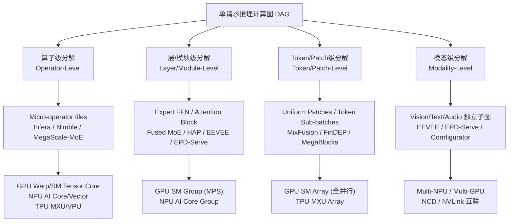

# Q2.3 — Serving 层如何将单请求推理计算分解为可并发执行的计算单元？

## 笔记证据概览

| 路径 | 分数 | 关键信息 |
|------|------|----------|
| knowledge_notes/编译知识笔记/Shepherd Operator.md | 1413.2 | Infera：小算子合并为 shepherd operator 的粒度控制，避免 per-op 调度 overhead 超过计算时间 |
| knowledge_notes/编译知识笔记/Tile-Based Zero-Tuning Compilation.md | 1309.2 | Infera：大 op→micro-op tile 分解 + multi-version kernel generation (zero-tuning) |
| knowledge_notes/算法知识笔记/Operator Taxonomy for Patch-Level Diffusion Inference.md | 751.0 | MixFusion：Pixel-wise vs Context-dependent 算子分类，DiT 无 Conv→100% accuracy patched inference |
| knowledge_notes/kernel知识笔记/Megakernel _ Fused Persistent Kernel for Distributed MoE.md | 455.7 | FlashMoE：Gate→Dispatch→Expert FFN→Combine→跨GPU通信 融合为单 persistent kernel |
| knowledge_notes/kernel知识笔记/Fused MoE（融合 MoE Kernel）.md | 400.9 | vLLM Fused MoE：Router→Dispatch→GEMM→Combine 单 kernel 融合 (15-20% 吞吐提升) |
| knowledge_notes/kernel知识笔记/Intra-operator Communication-Computation Overlap via Tile-Level Fused Kernels（瓦片级通信-计算融合内核的算子内重叠）.md | 275.9 | MegaScale-MoE：四种 tile 级通信-计算 barrier 融合 (A2A+GEMM, GEMM+A2A, AG+Scatter+GroupedGEMM, GroupedGEMM+Gather+RS) |
| idea_notes/Mirage Persistent Kernel_ A Compiler and Runtime for Mega-Kernelizing Tensor Programs.md | 59.2 | MPK：SM级 tGraph 替代 kernel 级 DAG，mega-kernel 消除 kernel barrier (1.0-1.7× speedup) |
| knowledge_notes/系统知识笔记/Cooperative Compilation and Scheduling（协同编译与调度）.md | 72.5 | Infera：离线多版本 kernel + 在线动态选择/fusion/launch 的协同编译-调度架构 |
| knowledge_notes/硬件知识笔记/Ascend NPU Architecture (AI Core _ AI Vector _ Da Vinci).md | 24.0 | Ascend NPU：AI Core (16×16×16 MAC) + AI Vector (256-bit SIMD) + Scalar 三单元异构并发 |
| knowledge_notes/系统知识笔记/Module Multiplexing（模块多路复用）.md | 14.6 | EEVEE：Visual encoder / Text decoder 独立 SM 分区 + Synergistic Greedy Search 策略生成 |
| knowledge_notes/系统知识笔记/Flexible Stage Disaggregation with Physical Co-location.md | 21.7 | EPD-Serve：7 种 E/P/D 解耦拓扑 + AI Core/Vector 算子级互补复用 |
| knowledge_notes/kernel知识笔记/Stream Assignment Algorithm (Minimum Equivalent Graph + Bipartite Matching).md | 29.3 | Nimble：MEG 去除冗余传递边→Bipartite Matching→CUDA stream 分配 (max concurrency=15) |
| knowledge_notes/系统知识笔记/Mixed-Resolution Batching for Diffusion Model Serving.md | 138.9 | MixFusion：GCD-based patch 统一化 (sequential 17.8s→batched 9.5s) |

---

## 一、方法细节（数据流/架构）—— 四种分解粒度与硬件映射

### 1.1 分解粒度分类总览

Serving 层对单请求推理计算图的分解可在四个粒度层次上进行，每个层次对应不同的并行机会和硬件利用模式：



**注解**:
- 四种粒度的关系是层次化的——实际上系统通常组合使用多层分解。例如 Infera 在编译期做算子级 tile 分解（大 op→micro op），运行时由 TEU 将 micro-kernel 在 warp 级水平融合为高效执行单元。MixFusion 同时使用 patch 级（CSP 格式）和算子级（pixel-wise vs context-dependent 分类）分解。
- 粒度越细，潜在并发度越高，但调度开销（kernel launch、同步、metadata 管理）也越大。Shepherd Operator 的存在正是为了解决「小算子调度开销超过执行时间」的粒度下限问题。

---

### 1.2 算子级分解（Operator-Level Decomposition）

**笔记证据**: `knowledge_notes/编译知识笔记/Tile-Based Zero-Tuning Compilation.md` (score: 1309.2), `knowledge_notes/编译知识笔记/Shepherd Operator.md` (score: 1413.2), `knowledge_notes/kernel知识笔记/Stream Assignment Algorithm (Minimum Equivalent Graph + Bipartite Matching).md` (score: 29.3)

#### 方法1: Infera Tile-Based 分解 + 自适应粒度控制

Infera compiler 将模型 forward pass 的每个 DNN operator 按 tile size 决策切分为 micro operator。关键创新在于**自适应粒度控制**——大型 operator（Conv2D、GEMM）切分为 tile 级 micro operator，每个 tile 独立编译为 micro-kernel；小型 operator（elementwise add、activation）合并为 **shepherd operator**，避免 per-operator 调度 overhead 超过计算时间。

**编译与执行框架模拟**:

```
Step 1: ONNX Model → TVM Relay Frontend → Computation Graph
Step 2: Tile-Tailored Partition
  ├── 大 operator: Conv2D → Conv_tile_0, Conv_tile_1, ...
  │   └── 每个 tile 独立编译为 micro-kernel
  └── 小 operator 组: Add + ReLU + BatchNorm → Shepherd_0
      └── Shepherd kernel 内部按拓扑顺序调用子 kernel
      └── 对外表现为单一调度单元（一个 micro operator）
Step 3: Tile Size 决策 (Top-Down 静态分析)
  ├── Register file level: 32-bit register/thread limit = 64/96/128
  │   └── 平衡 ILP vs TLP: register 越多→ILP 越高, 但 concurrent warp 越少
  ├── Shared memory level: usage/block limit = 48/80/112/144 KiB
  │   └── spatial tile = thread_tile × thread_count
  └── Global memory level: spatial tile = block_tile × grid_size(64)
Step 4: Multi-Version Micro Kernel Generation
  ├── pipeline stage 2/3/4 + async copy + warp specialization
  └── cut-and-patch SASS instruction scheduling (ILP 优化)
Step 5: CUDA Binary Static Library (.a) → 注册到 Inference Server Model Pool

在线推理 (TEU 三阶段):
  Phase 1 - SelectKernels: DAG 中选 zero in-degree 且最大化 asynchronous wavefront
                           的 data blocks → 在线回归模型选最优 kernel 版本
  Phase 2 - FuseKernels: CUDA binary level warp-level horizontal fusion
  Phase 3 - LaunchKernel: HKQ→GDRCopy→DKQ→daemon kernel CDP launch
```

**伪时间线（H100 单 GPU, Conv+ReLU+BN 融合, 4 mainloop + 4 copy warps）**:

```
T0-T1: TMA 异步加载 Conv_tile_0 input (global→shared)    [Copy Warp 0-3, 不占 SM]
T1-T3: Conv_tile_0 compute (Tensor Core MMA)               [Mainloop Warp 0-3]
T2-T4: TMA 预取 Conv_tile_1 input (与 tile_0 compute 重叠) [Copy Warp 0-3]
T3-T5: Conv_tile_1 compute + tile_0 ReLU/BN in shepherd    [Mainloop Warp 0-3]
T4-T6: TMA 预取 Conv_tile_2 input                         [Copy Warp 0-3]
...
→ 关键: copy warp 和 mainloop warp 在不同 warp scheduler slot 上并发执行
```

**注解**:
- **Shepherd Operator 的设计动机**: tile-based 调度有 overhead（kernel selection metadata、fusion cost、launch latency），对小 operator（单个 elementwise op 仅数 μs 执行时间）来说调度 overhead 可能超过执行时间。Shepherd operator 将小 operator 的调度从 per-micro-operator 降级为 per-shepherd-operator，保持调度粒度合理。
- **Zero-tuning 特性**: 所有 tile size、register/shared memory 分配、pipeline 配置由静态约束直接计算，无需 GPU profiling 反馈。编译时间比 Ansor/MetaSchedule 低 2-3 个数量级，比 Roller（仍使用 performance model）节省 66-86% CPU 时间。
- **协同编译-调度**: 编译器提供 multi-version kernels + metadata (#inst, resource usage)，调度器根据运行时 GPU 并发状态选择最优 kernel 版本——实现 Halide 的 algorithm/schedule 解耦思想在推理时调度层面的延伸。

#### 方法2: Nimble DAG→MEG→流分配

Nimble 将 DAG 中算子分配到多个 CUDA stream 以实现最大逻辑并发度。核心算法分四步：

```
输入: DAG G = (V, E) 其中 V = operators, E = data dependencies
输出: stream_assignment: map<v ∈ V, stream_id>

Step 1: 构建 Minimum Equivalent Graph (MEG)
  计算传递闭包，去除冗余传递边
  例: A→B→C 且 A→C 存在 → A→C 是冗余边（可通过 A→B→C 推导）
  MEG 暴露真正的直接依赖关系

Step 2: 构建 Bipartite Graph
  每条 MEG 边 → 二分图中的节点
  若两条边 (u₁,v₁) 和 (u₂,v₂) 无共同节点且无依赖 → 二分图中连接

Step 3: Maximum Matching (Ford-Fulkerson)
  每个 matching → 一组可并行执行的边 → 分配到一个 CUDA stream

Step 4: Stream Assignment + CUDA Event 插入
  同 stream 内算子按拓扑序排列
  跨 stream 仅在 MEG 边跨越 stream 边界时插入 CUDA event 同步
```

**注解**:
- **为什么需要 MEG**: 原始 DAG 的 max_flow 可能给出误导性结论。如图 3 示例：DAG 中 A→E 有两条路径（A→B→C→D→E 和 A→E 直连），max_flow(A→E)=1 暗示「并行度=1」。MEG 去除 A→E 冗余传递边后暴露真实并行度。
- **理论保证**: 算法实现 maximum logical concurrency 且 minimum number of synchronizations。NASNet-A 实测 max concurrency=15，multi-stream 贡献 up to 1.88× speedup。
- **GPU 硬件并发模型**: H100 支持 32 个并发 CUDA stream——每个 stream 内 kernel 串行，跨 stream kernel 可真正并发（前提是不共享同一 SM 子分区）。GPU warp scheduler 在各 SM 上以 warp 粒度交错执行不同 stream 的 thread block。

#### 硬件映射：算子级分解在不同硬件上的执行效率

| 硬件平台 | 计算单元 | 算子级分解适配 | 关键约束 |
|----------|---------|---------------|---------|
| GPU (H100) | 132 SM, Tensor Core + CUDA Core + TMA | Micro-kernel warp specialization 在 SM 内并发; TMA 异步搬运与计算 overlap | per-micro-op kernel launch overhead; SM 内 register/shared memory 竞争 |
| NPU (Ascend 910B) | AI Core (16×16×16 MAC) + AI Vector (256-bit SIMD) + Scalar | AI Core 执行 MatMul tile; AI Vector 并发执行 AllReduce/LayerNorm tile——算子级空间复用 | UB (256KB) 容量约束 tile 粒度下限; 三单元虽并发但共享 UB |
| TPU (v5e/v5p) | MXU (128×128 systolic) + VPU (vector) | XLA 编译期自动分解为 MXU/VPU 操作序列 | 编译期固定调度, 运行时不可动态调整 |

---

### 1.3 层/模块级分解（Layer/Module-Level Decomposition）

**笔记证据**: `knowledge_notes/kernel知识笔记/Fused MoE（融合 MoE Kernel）.md` (score: 400.9), `knowledge_notes/kernel知识笔记/Megakernel _ Fused Persistent Kernel for Distributed MoE.md` (score: 455.7), `knowledge_notes/系统知识笔记/Module Multiplexing（模块多路复用）.md` (score: 14.6)

#### 方法3: MoE Expert 级分解（Fused MoE → Megakernel）

将 MoE 层的 Gate→Dispatch→Expert FFN→Combine 四个阶段作为独立并发计算单元。传统实现为 per-expert kernel launch（每个 expert 一次 GEMM launch），产生大量 kernel launch overhead。Fused MoE 将所有 expert 的 FFN 合并为单 kernel；FlashMoE Megakernel 更进一步将分布式场景的全部 MoE 算子（含跨 GPU 通信）融合为单个 persistent kernel。

**vLLM Fused MoE 执行模拟（Mixtral-8x7B, H100）**:

```
Step 1: Router → Top-K
  logits = Linear(x)                              // [total_tokens, 8]
  topk_vals, topk_idx = topk(softmax(logits), k=2)

Step 2: Token Sorting (moe_align_block_size)
  sorted_tokens = sort_by_expert(topk_idx)
  padding to BLOCK_SIZE 对齐 (BLOCK_M=64)
  → Expert 0: tokens [t3, t7, t12, ...]
  → Expert 1: tokens [t1, t5, t9, ...]  (可能空)

Step 3: Fused MoE Kernel (单次 launch, Grid = E × ceil(tokens/BLOCK_M))
  For expert_id in 0..7:
    For token_block in expert's tokens:
      a_block = A[sorted_token_ids[block_start:...]]    // 间接寻址, 仅加载该 expert 的 token
      w1 = B[expert_id]                                  // 仅加载一次 expert 权重
      gate = silu(a_block @ w1_gate)                     // FC1 gate+up 融合
      up   = a_block @ w1_up
      hidden = gate * up
      out = hidden @ w2                                  // FC2 down
      out = out * topk_weights[block_start:...]          // routing weight 内联
      atomic_add(C[sorted_token_ids], out)               // top-k experts 的加权和原子聚合

对比传统: 6-8 次 kernel launch → 1-2 次
吞吐提升: 15-20% (大 batch, H100)
```

**FlashMoE Megakernel 执行模拟（分布式 MoE, 多 GPU）**:

```
Grid: N blocks/GPU; Block 角色: blockId < N-1 → Processor, blockId == N-1 → OS Block

OS Block (block N-1) 内:
  Warp 0: Scheduler (work-conserving, 多线程调度)
    └── 循环 sweep doorbells → WarpInclusiveSum → 分配 ready task → idle Processor
  Warp 1-3: Subscriber
    └── Poll remote flags → decode remote tile packet → enqueue task → doorbell Scheduler

Processor Block:
  while(!interrupt):
    switch(task.type):
      case GEMM0: CUTLASS device-side fused GEMM + GELU → notify Scheduler
      case GEMM1: CUTLASS device-side GEMM → NVSHMEM put to remote combine buffer

性能: 1 kernel launch vs Megatron-LM+DeepEP 的 432 次
SM occupancy: tile=(128,64), block_size=128, registers=255/thread, max 2 blocks/SM, 0 spill
```

**注解**:
- **In-kernel Work-Conserving Scheduler**: FlashMoE 用 1 个 warp（32 threads）实现 GPU 内多线程任务调度器——doorbell 是 monotonic counter（非 binary flag），Scheduler warp 并行 sweep doorbells 实现 O(1) 的 task discovery。这消除了 CPU-GPU 同步的全部开销。
- **Device-side BLAS**: CUTLASS device-side API 在 persistent kernel 内直接执行 GEMM——传统方式必须通过 CPU launch cuBLAS kernel。
- **Megakernel 化趋势**: 笔记证据（MPK, FlashMoE, MegaScale-MoE）显示行业正从「分解后独立调度」向「分解后重新融合为 mega-kernel」演进——分解是手段，消除 kernel barrier 后的 mega-kernel 是目标执行形态。

#### 方法4: EEVEE Module Multiplexing（多模态模型模块级分解）

将多模态模型的 modality-specific modules 拆分为独立进程，各自拥有独立 batch size 和 SM allocation。

**EEVEE 执行框架模拟（LLaVA-1.5, A100 80GB）**:

```
GPU A100 (108 SMs)
├── Visual Encoder Process (CLIP ViT-L/14)
│   ├── SM allocation: 70% (≈75 SMs), 通过 CUDA_MPS_ACTIVE_THREAD_PERCENTAGE 设定
│   ├── Batch size: B_vis=2 (图像预处理 batch)
│   └── 执行: image resize→normalize→H2D→ViT forward→visual tokens [577, 1024]
│
├── Text Decoder Process (LLaMA-7B)
│   ├── SM allocation: 30% (≈33 SMs)
│   ├── Batch size: B_txt=8 (文本生成 batch)
│   └── 执行: text embedding→[visual tokens; text tokens]→LLM decode
│
└── Inter-Module Communication: GPU shared memory + CUDA IPC handler
    └── Visual tokens → Text Decoder 消费 (延迟远低于 PCIe 的 ~50μs)

Offline Synergistic Greedy Search 策略生成:
  Step 1: 从 monolithic 顺序执行初始化策略
  Step 2: 逐步增加各模块 batch size
    └── 每次将增量放在对 batch latency 负面影响最小的 stage
  Step 3: Balanced SM Reallocation
    └── 从最短 latency 模块转移 SM→最长 latency 模块, 直至 stage 内各模块 latency 趋近平衡
  约束: per-stage SM 总和=100%, 各模块 B = egress module B 的整数倍, E2E latency≤SLO
  复杂度: O(|M|² · max_batch · 100)

Stage-Level Parallelism:
  Visual Encoder preprocess (resize/normalize/H2D, 可达 inference 时间 40%)
    ↔ Text Decoder inference 重叠执行
  → 利用 pipeline 并行度避免 GPU 等待 CPU 完成预处理

Modal Cache:
  同一图像对应多个问题时 (VQA2: ≥3 问题/图), 后续问题直接加载缓存的 visual tokens
  Cache loading 通过 CUDA streams 与新请求 computation kernel 重叠
```

**注解**:
- **MPS SM Partition 的硬约束**: CUDA MPS 的 SM allocation 必须在 CUDA 初始化前通过环境变量设定且运行时不可更改。因此 EEVEE 的策略是「部署时固定、按需切换」——当负载变化超过阈值时通过 active-standby 机制（权重已驻留 GPU）在毫秒级切换到预计算策略。
- **实验效果**: RTX 3090/A100 上 max capacity 平均 +157%, 高负载 LLaVA latency 平均 -90% vs Triton monolithic serving, GPU active SM ≈90%。

#### 方法5: EPD-Serve Encode/Prefill/Decode 三阶段解耦

**笔记证据**: `knowledge_notes/系统知识笔记/Flexible Stage Disaggregation with Physical Co-location.md` (score: 21.7), `knowledge_notes/硬件知识笔记/Ascend NPU Architecture (AI Core _ AI Vector _ Da Vinci).md` (score: 24.0)

**EPD-Serve 部署拓扑切换模拟**:

```
7 种部署拓扑:
  E-P-D:    Encode | Prefill | Decode  (3 NPU 全解耦, SLO attainment 94.34%)
  EP-D:     Encode+Prefill | Decode   (2 NPU)
  ED-P:     Encode+Decode | Prefill   (2 NPU, 推荐最低 TTFT)
  E-PD:     Encode | Prefill+Decode   (2 NPU)
  (E-P)-D:  Encode+Prefill 共置 | Decode (2 NPU, 推荐最高吞吐: +57-69% vs EP-D)
  (E-D)-P:  Encode+Decode 共置 | Prefill (2 NPU, TTFT 降低 39-55%)
  (E-PD):   全部共置 (1 NPU, 最大化吞吐 +13-15% vs monolithic)

物理共置关键机制 (Ascend NPU):
  ┌─────────────────────────────────────────────────┐
  │  AI Core (Cube Unit)    │  AI Vector (Vector)   │
  │  MatMul (Encode ViT)    │  AllReduce (通信)     │
  │  MatMul (Prefill LLM)   │  LayerNorm, GELU      │
  │  256 MACs/cycle         │  256-bit SIMD         │
  │                         │                       │
  │  算子互补: 当 MatMul 执行时, AllReduce 可同时用 AI Vector  │
  │  当 Prefill 等待 P-D 传输时, Encode 利用空闲 AI Core 继续  │
  └─────────────────────────────────────────────────┘
```

**注解**:
- **三阶段解耦的硬件依据**: Encode (ViT) 为 compute-heavy + 大 activation; Prefill 为 compute-heavy + 产生大 KV Cache; Decode 为 memory-bound (token-by-token GEMV)。三个阶段的计算/内存特征完全不同，统一调度必然导致硬件利用率低。
- **物理共置的关键洞察**: 不同算子的硬件资源需求互补——MatMul 是 AI Core compute-heavy（低数据搬运）、AllReduce 是 AI Vector communication-heavy（高数据搬运），在同一 NPU 上交替执行减少 idle 周期。该策略的本质是**利用硬件异构计算单元的独立性**实现细粒度空间复用。

---

### 1.4 Token/Patch 级分解（Token/Patch-Level Decomposition）

**笔记证据**: `knowledge_notes/算法知识笔记/Operator Taxonomy for Patch-Level Diffusion Inference.md` (score: 751.0), `knowledge_notes/系统知识笔记/Mixed-Resolution Batching for Diffusion Model Serving.md` (score: 138.9)

#### 方法6: MixFusion Patch-Level 并行分解 (DiT/扩散模型)

将不同分辨率的扩散模型输入图像 partition 为 uniform size patches，通过 CSP 格式和 Operator Taxonomy 分类实现混合分辨率批处理。

**MixFusion 执行模拟（SDXL, H100, 3 请求 512²/768²/1024²）**:

```
Step 1: Patch Partition
  patch_size = GCD(512, 768, 1024) = 256
  Req_512: 4 patches (2×2); Req_768: 9 patches (3×3); Req_1024: 16 patches (4×4)
  Total: 29 uniform patches [256, 256, C]

Step 2: CSP Format 构建 (4 个 integer arrays, O(1) 查找)
  RequestOffset = [0, 4, 13]; ResolutionOffset = [0, 4, 13]
  patch→request 逆向查找表

Step 3: Per-Block Denoising (每个 denoising step 的每个 block)
  For op in block.operators:
    if op is Pixel-wise (Linear/FFN/CrossAttn):        // >70% 计算量
      output = batched_op(all_29_patches)              // 统一 batch=29, 标准 PyTorch
      → GPU SM[0..131] 全并行

    elif op is Self-Attention:                          // ~20% 计算量
      For each resolution_group in [512, 768, 1024]:
        full_feature = reconstruct_from_patches(patches_of_res)
        output = FlashAttention(full_feature)           // per-resolution batched attn
      → SM[0..43]→Res 512, SM[44..87]→Res 768, SM[88..131]→Res 1024 (并行)

    elif op is Convolution (仅 U-Net, DiT 无):          // ~10% 计算量
      For each patch:
        output = FusedGroupNormWithStitching(patch, neighbor_boundaries)
      → boundary pixels 通过 TB 间 shared memory 交换 (Patch Edge Stitcher)

性能: sequential 17.8s → batched 9.5s (3 分辨率)
DiT 优势: 无 Convolution → patched inference 自然 100% accuracy
U-Net 约束: Convolution kernel size 1-3 → Patch Edge Stitcher 处理跨 patch 边界
```

**注解**:
- **Operator Taxonomy 分类体系**: Pixel-wise operators（仅依赖当前 patch/pixel 内部信息）可直接在各 patch 上独立并行；Context-dependent operators（Self-Attention 需要 all patches 交互、Convolution 需要相邻 patch 边界像素）需要特殊处理。
- **Patch Size 选择**: patch_size 必须 = batch 内各 resolution 在 height/width 维的 GCD。限制是当分辨率差异极大时 patch 数可能超过 GPU memory。
- **PES 质量**: Patch Edge Stitcher latency 接近理论 optimal（Figure 5），生成质量 PSNR 与 unpatched 无显著差异。

---

### 1.5 模态级分解（Modality-Level Decomposition）

多模态模型的视觉流、文本流、音频流编码子图天然具有模态级独立性。EEVEE 将各模态编码器作为独立进程通过 CUDA MPS 空间多路复用；EPD-Serve 通过模态感知多路径调度将不同模态请求路由到不同实例。

**核心机制**: 模态级分解的关键在于**跨模态数据就绪管理**和**模态间资源隔离**。笔记证据显示 EEVEE 通过 GPU shared memory + CUDA IPC handler 实现低延迟模态间通信，EPD-Serve 通过 Global Instance Status Table 实现 least-loaded-first 的实例选择。

**注解**: 笔记未明确说明 Video 模型的 spatial encoder + temporal encoder 独立调度分解的具体方法和实验数据——这是笔记覆盖的一个空白。

---

### 1.6 Mega-Kernel 化：跨粒度的终极融合

**笔记证据**: `idea_notes/Mirage Persistent Kernel_ A Compiler and Runtime for Mega-Kernelizing Tensor Programs.md` (score: 59.2)

Mirage Persistent Kernel (MPK) 代表了分解策略的反向极致——将分解后的细粒度 task 重新融合为单个 mega-kernel，以 **SM 级 tGraph** 替代 kernel 级 computation graph。

**MPK tGraph 编译与执行模拟（Qwen3-8B decode, H100）**:

```
离线编译:
  Step 1: Operator Decomposition
    MatMul(X,W_Q): [B×H]×[H×H] → 132 tasks (每 SM 一个)
    Attention: 动态 task 数 (JIT, 依赖 sequence length)
  Step 2: tGraph 构建
    每个 task 352 bytes metadata: dependent_event | trigger_event | I/O ptrs | config
    每个 event: required_trigger_count | [first_task_id, last_task_id]
    → 全部以连续数组存储于 GPU device memory
  Step 3: Dependency Analysis (task-pair level, 非 operator level)
    仅当 task t1 输出区域 ∩ task t2 输入区域 ≠ ∅ 时才插入 event

在线执行 (单次 kernel launch):
  SM 物理分区: 128 Workers + 4 Scheduler-SMs (16 warp-schedulers)
  
  T0: Start event → Scheduler 分发 Q/K/V projection tasks (AOT pre-assigned)
  T1: Worker SM_i: Q_proj (TMA preload W_Q → Tensor Core MMA)
      同时 TMA 预取 K_proj weight tile (cross-task pipelining, 消除 pipeline bubble)
  T2: Q/K/V 完成 → Scheduler 分发 attention tasks (JIT, dynamic load balance)
      快 worker 先完成先获得下游 O_proj tasks
  T3: All attention done → barrier → MLP tasks (AOT)
      Worker: Gate_proj GEMM + 同时 prefetch Up_proj weight → SiLU → Down_proj
  T4: 跨全部层, TMA/Tensor Cores/CUDA Cores 三种硬件持续饱和

性能: MPK 12.5ms vs SGLang/vLLM 14.5ms, 仅比理论下限 10ms 高 ~25%
加速: end-to-end 1.0-1.7× (cross-task pipelining 1.2-1.3× + fine-grained overlap 1.1×)
```

**注解**:
- **tGraph 的核心价值**: SM 级表示暴露了 kernel barrier 遮蔽的细粒度并行性。例如 MatMul→AllReduce：每个 AllReduce task 仅依赖一个对应 MatMul task 的输出——传统 kernel-per-operator 必须等整个 MatMul kernel 完成才能启动 AllReduce，MPK 通过 per-task-pair events 使 compute 和 communication 在不同 SM 上并发执行。
- **Hybrid JIT+AOT**: Attention（data-dependent 执行时间）用 JIT launch 实现 dynamic load balance；MatMul（确定性执行时间）用 AOT pre-assigned 消除 dispatch overhead。这是对 MoE/DiT/多模态等多样化模型负载的关键适配机制。
- **笔记未明确说明**: MPK 对 MoE Expert 动态路由、DiT 扩散步骤迭代、多模态多阶段等场景的具体支持程度和性能数据。

---

## 二、分解粒度选择的硬件依据

**笔记证据**: `knowledge_notes/硬件知识笔记/Ascend NPU Architecture (AI Core _ AI Vector _ Da Vinci).md` (score: 24.0), `knowledge_notes/kernel知识笔记/Intra-operator Communication-Computation Overlap via Tile-Level Fused Kernels（瓦片级通信-计算融合内核的算子内重叠）.md` (score: 275.9)

| 约束维度 | GPU (H100) | NPU (Ascend 910B) | TPU (v5e/v5p) |
|----------|-----------|-------------------|---------------|
| 计算单元数量 | 132 SMs, 每 SM 可并行 32+ warp | ~32 AI Core + ~32 AI Vector (笔记未精确) | 1-8 MXU/chip, 128×128 systolic array |
| 片上存储/SM | 227KB shared memory + 256KB register file/SM | 256KB Unified Buffer (共享) | 16-48MB vector memory |
| HBM 带宽 | 3.35 TB/s | 1.5-2.0 TB/s (笔记未精确) | ~2.76 TB/s (v5p) |
| 并发执行模型 | CUDA streams + MPS 空间分区 | AI Core/Vector/Scalar 独立指令队列, 硬件并发 | XLA 编译期固定调度, 运行时不可调 |
| 同步原语 | __syncthreads, mbarrier (TMA), CUDA event | Barrier instruction (笔记未详述) | Collective permute |
| 关键瓶颈 | SM count + register pressure + kernel launch overhead | UB容量 + AI Core/Vector 通信带宽 | 编译期调度固定, 缺少运行时动态粒度调整 |

**分解粒度选择的启发式规则**（从笔记证据推断）:

1. **算子级分解上限**: 分解后的 micro-operator 计算量应大于调度 overhead。Shepherd Operator 的存在表明 elementwise op（数 μs 执行）的调度 overhead 已超过其计算收益——需合并。
2. **层/模块级分解约束**: 分解出的独立模块应具有互补的硬件资源需求。GPU 上 Attention (compute-heavy) 和 Expert FFN (memory-heavy) 可通过 MPS SM 分区减少竞争；NPU 上 MatMul (AI Core) 和 AllReduce (AI Vector) 可通过异构单元并发实现空间复用。
3. **Token/Patch 级分解上限**: 子批次数量受计算单元数量约束——每个 SM 至少需要一个完整的 GEMM tile (≥64×128) 才能有效利用 Tensor Core。子批次过多导致 occupancy 下降。
4. **模态级分解约束**: 受显存限制——所有模态的权重需同时驻留。GPU H100 80GB 可同时容纳 LLaVA-1.5 的 ViT (~300M) + LLaMA-7B，但更大模型可能需要串行或 offloading。
5. **Mega-kernel 化前提**: 编译时必须能静态分析全部 task 的依赖关系和资源需求（MPK 的 tGraph 依赖 Mirage superoptimizer 自动生成每个 task 的优化 CUDA 实现）——对于高度动态的 MoE routing 或扩散步骤可能需要 Hybrid JIT+AOT 混合策略。

---

## 三、实现（辅助说明）

**笔记证据**: `knowledge_notes/系统知识笔记/Cooperative Compilation and Scheduling（协同编译与调度）.md` (score: 72.5)

| 系统 | 分解策略 | 实现方式 | 适用模型 | 硬件平台 |
|------|---------|---------|---------|---------|
| Infera | 算子级 tile 分解 + shepherd 合并 | TVM 0.16.0 tile-tailored compiler (~17k LoC C++), zero-tuning | 通用 DNN | NVIDIA GPU |
| Nimble | DAG→MEG→Bipartite Matching→CUDA stream | PyTorch TorchScript IR 分析 + AoT stream assignment | 通用 DL (CNN/Transformer) | NVIDIA GPU |
| MixFusion | Patch级 + 算子级 (pixel-wise/context-dependent) | PyTorch custom ops (CSP, PES CUDA kernel) | DiT (SD3), U-Net (SDXL) | NVIDIA H100 |
| vLLM Fused MoE | Token 组 + Expert 级融合 | Triton JIT kernel (`fused_moe.py`) | MoE (Mixtral, DeepSeek-V2) | NVIDIA H100 |
| FlashMoE | Megakernel (全融合) | CUDA C++ (~6820 行), CUTLASS device-side, NVSHMEM | 分布式 MoE | NVIDIA GPU |
| MegaScale-MoE | Tile 级通信-计算 barrier 融合 (4 类 fused kernel) | CUDA kernel + device memory barrier + GPU copy engine | MoE 训练/推理 | NVIDIA GPU |
| EEVEE | 模块级 + 模态级 (SM MPS 分区) | Python (~5000 行), vLLM + NVIDIA MPS | LLaVA, BLIP-2, InternVL2.5 | NVIDIA A100, RTX 3090 |
| EPD-Serve | 阶段级 (E/P/D 解耦) + 算子级硬件互补 | PyTorch/Ascend + Mooncake Store | 多模态 LLM | Ascend NPU (Atlas 800I A2) |
| MPK | SM 级 tGraph→mega-kernel | torch.compile(backend=MPK) + Mirage superoptimizer | LLM (Qwen3 等) | NVIDIA H100, B200 |
| MoE-Blaze | Atomic-free GPU parallel dispatch | CUDA kernel (3 步替代 multi-pass radix sort) | MoE | NVIDIA GPU |

**注解**: 笔记显示大部分前沿系统未开源（FlashMoE、MegaScale-MoE、MPK、EEVEE 均未找到官方仓库），实验可复现性受限。vLLM Fused MoE 为开源实现，是当前最成熟的 MoE 推理分解参考实现。

---

## 四、实验环境（辅助说明）

**笔记证据**: `experiment_notes/系统实验笔记/MixFusion_ A Patch-Level Parallel Serving System for Mixed-Resolution Diffusion Models.md` (score: 192.9), `experiment_notes/系统实验笔记/Efficient Multimodal Serving via Module Multiplexing.md` (score: 24.0)

| 系统 | 硬件 | Benchmark | 关键指标 |
|------|------|-----------|---------|
| MixFusion | H100 80GB | SDXL/SD3 多分辨率 (512/768/1024) | Sequential 17.8s→Batched 9.5s; PES ~optimal |
| EEVEE | A100, RTX 3090 | CLIP, BLIP, BLIP-2, LLaVA-1.5, InternVL2.5-8B | Max capacity +157%, latency -90% vs Triton, SM active ~90% |
| EPD-Serve | Atlas 800I A2 (Ascend 910B, 64GB) | VisualWebInstruct (256+256 mixed) | (E-P)-D 吞吐 +57-69%, SLO attainment 94.34% (E-P-D) |
| Infera | NVIDIA GPU (笔记未给出型号) | Multi-model mixed serving | Cooperative speedup 1.6-3.5× vs operator-based |
| MegaScale-MoE | NVIDIA GPU (笔记未给出型号) | 6 种 MoE 模型 | Fused vs non-fused 通信+计算 time 1.2-4.7×; 训练 iteration time -7.1-12.9% |
| Fused MoE (vLLM) | 4×H100 | Mixtral-8x7B (MoE-Inference-Bench) | 吞吐 +15-20% (大 batch), 不同 seq length 保持 12-18% |
| MPK | H100, B200 | Qwen3-8B/1.7B | E2E 1.0-1.7× vs SGLang/vLLM; 仅比理论下限高 ~25% |
| Nimble | A100 40GB ×4 | NASNet-A, BERT, GPT-2 | Multi-stream up to 1.88× speedup |

**注解**: 笔记中跨硬件平台（GPU vs NPU vs TPU）的分解效率对比实验数据缺失。各系统独立验证自身的硬件平台，缺乏统一 benchmark 下的 apple-to-apple 粒度对比（如 MixFusion patch 级 vs 纯算子级在 DiT 上的对比）。

---

## 五、方法对比表

| 方法 | 核心机制 | 分解粒度 | 实现框架 | 硬件平台 | 关键并行机会 | 调度开销 | 笔记证据 |
|------|----------|---------|---------|---------|-------------|---------|---------|
| Infera Tile-Based | 大 op→micro-op tile + 小 op→shepherd merge + multi-version kernel | 算子级 | TVM compiler + TEU runtime | GPU | Micro-op tile 间异步流水线 (overlap load/compute) | 中 (per-tile metadata) | knowledge_notes/编译知识笔记 (1309.2/1413.2) |
| Nimble Stream Assign | MEG + Bipartite Matching 最大逻辑并发度 | 算子级 | PyTorch JIT trace + AoT | GPU | 15 个可并行算子 (NASNet-A) | 低 (AoT 离线) | knowledge_notes/kernel知识笔记 (29.3) |
| MegaScale-MoE Intra-op | 4 类 tile 级通信-计算 barrier 融合 | 算子内 Tile 级 | CUDA kernel + device memory barrier | GPU (分布式) | Tile 到达即计算, 不等全量通信完成 | 中 (per-tile flag polling) | knowledge_notes/kernel知识笔记 (275.9) |
| vLLM Fused MoE | Router→Dispatch→GEMM→Combine 单 kernel | Token组 + Expert级 | Triton JIT kernel | H100 | 8 experts FFN 在单 kernel 内并发 | 低 (1 launch) | knowledge_notes/kernel知识笔记 (400.9) |
| FlashMoE Megakernel | 全部 MoE ops + 跨 GPU 通信融合为单 persistent kernel | Megakernel (全融合) | CUDA + CUTLASS + NVSHMEM | GPU (分布式) | Processor/Scheduler/Subscriber warp 角色分工 | 极低 (1 launch) | knowledge_notes/kernel知识笔记 (455.7) |
| EEVEE Module Mux | 模态模块独立进程 + SM 分区 + Modal Cache | 模块级 + 模态级 | vLLM + NVIDIA MPS | A100/RTX3090 | Visual encoder ↔ Text decoder MPS 并发 | 低 (硬件分区) | knowledge_notes/系统知识笔记 (14.6) |
| EPD-Serve Stage Disagg | E/P/D 三阶段解耦 + 物理共置 + AI Core/Vector 互补 | 阶段级 + 算子级 | PyTorch/Ascend + Mooncake | Ascend NPU 910B | AI Core (MatMul) ↔ AI Vector (AllReduce) 交替 | 中 (topology switch) | knowledge_notes/系统知识笔记 (21.7) |
| MixFusion Patch Decomp | CSP uniform patch + Operator Taxonomy (pixel-wise/context-dependent) | Patch级 + 算子级 | PyTorch cust. ops + PES | H100 | Pixel-wise ops 全并行; per-resolution attn 分组并行 | 低 (patch batch) | knowledge_notes/算法知识笔记 (751.0) |
| MPK tGraph Mega-Kernel | SM级 tGraph (task-pair 依赖) + cross-task pipelining + Hybrid JIT/AOT | SM 级 (超算子级) | torch.compile + Mirage superopt | H100/B200 | TMA/Tensor Core/CUDA Core 三种单元持续饱和 | 极低 (1 launch) | idea_notes (59.2) |
| FinDEP | r₁(batch) × r₂(token) 两级 pipeline + ASAS/AASS 选择 | Token 级 | FlashInfer + NCCL | A6000/A10/H20 | AG attention 与 EG expert compute 流水线重叠 | 低 (solver <1ms) | paper_secs (2703.4) |

---

## 六、不确定性

1. **TPU (v5e/v5p/v6e) 上的分解策略实验数据**: 笔记中所有主要实验（MixFusion, EEVEE, EPD-Serve, Fused MoE, MPK）均基于 GPU 或 NPU。TPU 上 MoE/DiT/多模态/Video 模型的算子级/模块级分解 benchmark 数据在笔记中完全缺失。XLA 编译器的自动分解策略在笔记中未详细描述。

2. **Video 模型的时空分解**: 笔记未找到 Video 模型（VideoDiT, Sora-like, Video-LLaMA）的 spatial encoder + temporal encoder 独立调度分解的具体方法和实验数据。最接近的笔记是 MixFusion 的图像 patch 级分解和 OneVision-Encoder 的 HEVC codec-based patchification，但针对 Video generation 的帧间/帧内并行调度在 Serving 层的证据缺失。

3. **NPU 片上 UB 容量约束的数值分析**: EPD-Serve 描述了 Ascend NPU 的算子级空间复用，但 Unified Buffer (256KB) 在共置场景下的 per-operator partition 大小和 spill 策略笔记未给出具体数值。

4. **Groq LPU / Cerebras CS-3 的分解策略**: 笔记中未找到这两类 dataflow 架构加速器的分解策略证据——其分解粒度选择是否与传统 GPU/NPU 策略有本质差异，笔记未明确说明。

5. **跨粒度组合的最优配置**: 笔记中各系统独立验证各自的分解策略，缺乏统一 benchmark 下不同粒度分解策略的对比（如 MixFusion patch 级 vs 纯算子级在 DiT 上的对比实验）。

6. **前沿系统开源状态**: FlashMoE、MegaScale-MoE (ByteDance 内部)、MPK、EEVEE 的官方开源仓库在笔记中均未标注——实验可复现性受限。

7. **Video 专用 benchmark**: 笔记未找到 Video-MME 或类似 Video 推理 benchmark 上与计算图分解相关的实验数据。

---

[ANSWER_AGENT_DONE] Q2.3
